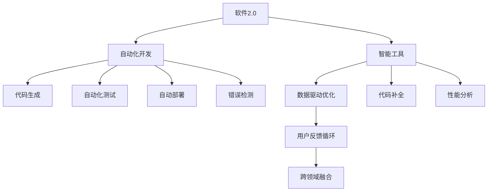

                 

# 软件 2.0 的应用：从实验室走向现实

## 1. 背景介绍

### 1.1 问题由来

软件2.0的概念最早由Googlerajeevgrahakoti在2018年提出，旨在探索在人工智能时代下，软件开发的范式如何从传统的“1.0”模式（即编写代码实现功能）转变到“2.0”模式（即利用智能工具自动化开发过程）。这一理念迅速在软件开发和人工智能社区中引起广泛讨论，并成为推动AI时代软件开发创新的一个重要方向。

软件2.0强调的是一种“以人为本”的开发模式，通过AI和大数据技术，提升软件开发的效率和质量，降低开发成本，使得软件产品能够更好地满足用户需求。这一模式不仅应用于软件开发本身，还广泛渗透到数据处理、应用部署、客户支持等多个环节，使得软件系统的智能化和自动化程度大幅提升。

### 1.2 问题核心关键点

软件2.0的核心关键点包括：

1. **自动化开发**：利用AI和大数据技术，自动生成代码、自动测试、自动部署，提升开发效率，降低人为错误。
2. **智能工具支持**：提供智能的代码补全、错误检测、性能分析等工具，辅助开发人员进行决策。
3. **数据驱动优化**：通过数据分析，自动化地调整代码结构和功能实现，提升软件系统的性能和用户体验。
4. **用户反馈循环**：建立用户反馈循环，利用AI分析用户行为数据，优化软件功能和界面，提升用户满意度。
5. **跨领域融合**：将AI、大数据、自然语言处理等多种技术融合，实现软件系统的智能化和自适应。

这些关键点共同构成了软件2.0的核心理念，推动软件开发从传统的“1.0”模式向“2.0”模式转变。

## 2. 核心概念与联系

### 2.1 核心概念概述

为更好地理解软件2.0的应用，本节将介绍几个密切相关的核心概念：

1. **软件2.0**：指利用AI和大数据技术，自动化软件开发和维护的范式，目标是提升开发效率，降低开发成本，提高软件质量。
2. **自动化开发**：指利用AI和大数据技术，自动生成、测试和部署代码，提升开发效率，降低人为错误。
3. **智能工具**：指提供代码补全、错误检测、性能分析等智能功能的开发工具，辅助开发人员进行决策。
4. **数据驱动优化**：指通过数据分析，自动化地调整代码结构和功能实现，提升软件系统的性能和用户体验。
5. **用户反馈循环**：指建立用户反馈循环，利用AI分析用户行为数据，优化软件功能和界面，提升用户满意度。
6. **跨领域融合**：指将AI、大数据、自然语言处理等多种技术融合，实现软件系统的智能化和自适应。

这些核心概念之间的逻辑关系可以通过以下Mermaid流程图来展示：



这个流程图展示了软件2.0的关键组成要素：

1. 软件2.0以自动化开发为核心，利用AI和大数据技术，自动生成、测试和部署代码。
2. 智能工具提供代码补全、错误检测、性能分析等智能功能，辅助开发人员进行决策。
3. 数据驱动优化通过数据分析，自动化地调整代码结构和功能实现，提升软件系统的性能和用户体验。
4. 用户反馈循环建立用户反馈循环，利用AI分析用户行为数据，优化软件功能和界面，提升用户满意度。
5. 跨领域融合将AI、大数据、自然语言处理等多种技术融合，实现软件系统的智能化和自适应。

## 3. 核心算法原理 & 具体操作步骤
### 3.1 算法原理概述

软件2.0的核心算法原理主要围绕自动化开发和智能工具的实现展开。其中，自动化开发的核心在于利用机器学习和深度学习技术，自动生成代码和优化软件系统。智能工具的核心在于利用自然语言处理和大数据分析技术，提供代码补全、错误检测、性能分析等功能，辅助开发人员进行决策。

### 3.2 算法步骤详解

1. **代码生成**：
    - 收集历史代码片段和项目模板，利用机器学习模型，根据代码上下文自动生成代码片段。
    - 对于复杂功能，利用代码片段库和代码生成规则，逐步构建完整代码。
    - 代码生成的过程需要考虑语法、语义、上下文等多个维度，以确保生成的代码质量。

2. **自动化测试**：
    - 利用静态分析技术，自动检测代码中的语法错误、类型错误等。
    - 利用动态分析技术，自动执行测试用例，检测代码的功能正确性。
    - 对于性能测试，利用机器学习模型预测代码的运行时间和内存占用，优化性能。

3. **自动部署**：
    - 根据配置文件，自动构建软件包，打包依赖库。
    - 自动部署到服务器或云端环境，进行版本控制和回滚管理。
    - 自动监控部署过程，及时处理部署失败的问题。

4. **智能工具**：
    - 代码补全：利用自然语言处理技术，根据代码上下文，提供代码补全建议。
    - 错误检测：利用机器学习模型，自动检测代码中的潜在错误，提供修复建议。
    - 性能分析：利用大数据分析技术，实时监控软件性能，提供性能优化建议。

### 3.3 算法优缺点

软件2.0的算法优点包括：

1. **提升开发效率**：利用自动化和智能工具，显著降低了开发人员的手动工作量，提高了开发速度。
2. **降低人为错误**：自动生成和测试代码，减少了手动错误，提高了代码质量和稳定性。
3. **支持跨领域融合**：将AI、大数据、自然语言处理等多种技术融合，实现软件系统的智能化和自适应。

然而，软件2.0的算法也存在一些局限性：

1. **依赖数据质量**：自动化开发和智能工具的效果依赖于数据质量和完整性，数据缺失或不准确可能导致错误的输出。
2. **需要大量训练数据**：许多自动化和智能工具需要大量标注数据进行训练，训练成本较高。
3. **依赖模型精度**：算法的精度依赖于模型的训练效果，模型精度不高可能导致错误的输出。
4. **需要复杂系统支持**：实现软件2.0需要构建复杂的技术体系，对技术要求较高。

### 3.4 算法应用领域

软件2.0在多个领域得到了广泛应用，包括但不限于：

1. **软件开发**：利用代码生成、自动化测试、自动部署等技术，提升软件开发的效率和质量。
2. **数据分析**：利用智能工具进行数据分析和处理，自动化地生成数据处理代码，提高数据处理效率。
3. **应用部署**：利用自动化部署技术，自动构建和部署应用，支持快速迭代和持续集成。
4. **用户支持**：利用智能工具分析用户反馈，提供个性化支持和建议，提升用户满意度。
5. **项目管理**：利用自动化和智能工具，优化项目管理流程，提高项目效率和质量。

## 4. 数学模型和公式 & 详细讲解
### 4.1 数学模型构建

软件2.0的数学模型主要围绕代码生成、错误检测、性能分析等任务构建。以下是几个典型的数学模型：

1. **代码生成模型**：
    - 利用序列到序列模型，将代码片段序列作为输入，生成代码片段序列作为输出。
    - 模型结构包括编码器、解码器、注意力机制等，能够学习代码片段之间的关系。
    - 模型的训练数据为历史代码片段和相应的补全建议，通过最小化损失函数进行训练。

2. **错误检测模型**：
    - 利用分类模型，将代码片段作为输入，判断是否存在错误。
    - 模型结构包括编码器、全连接层、softmax层等，能够学习代码片段的特征。
    - 模型的训练数据为标注正确的代码片段和错误类型，通过最小化交叉熵损失进行训练。

3. **性能分析模型**：
    - 利用回归模型，将代码片段作为输入，预测其运行时间和内存占用。
    - 模型结构包括编码器、全连接层、回归层等，能够学习代码片段的性能特征。
    - 模型的训练数据为历史代码片段和相应的性能数据，通过最小化均方误差损失进行训练。

### 4.2 公式推导过程

以代码生成模型为例，其数学模型公式如下：

$$
y = f(x; \theta)
$$

其中 $x$ 为输入的代码片段序列，$y$ 为输出的代码片段序列，$\theta$ 为模型参数。假设模型结构为编码器-解码器结构，其中编码器将代码片段序列映射为固定长度的向量，解码器将向量映射为代码片段序列。则代码生成模型的损失函数为：

$$
L = \sum_i \ell(y_i, \hat{y}_i)
$$

其中 $\ell$ 为损失函数，$y_i$ 为真实代码片段序列的第 $i$ 个元素，$\hat{y}_i$ 为模型生成的第 $i$ 个元素。

在训练过程中，利用反向传播算法计算梯度，更新模型参数 $\theta$：

$$
\theta \leftarrow \theta - \eta \nabla_{\theta}L
$$

其中 $\eta$ 为学习率，$\nabla_{\theta}L$ 为损失函数对模型参数的梯度。

### 4.3 案例分析与讲解

以GitHub的GPT-3代码生成工具为例，其使用了Transformer模型和深度学习技术，能够自动生成高质量的代码。具体实现流程如下：

1. **数据准备**：收集大量的代码片段，标注为正确的代码片段和错误的代码片段，构建训练数据集。
2. **模型构建**：构建一个基于Transformer的代码生成模型，其中编码器将代码片段序列映射为固定长度的向量，解码器将向量映射为代码片段序列。
3. **模型训练**：利用训练数据集，最小化损失函数，通过反向传播算法更新模型参数。
4. **代码生成**：将输入的代码片段序列作为模型输入，输出代码片段序列作为模型输出。

通过GPT-3代码生成工具，开发人员能够快速生成高质量的代码，显著提升了开发效率。

## 5. 项目实践：代码实例和详细解释说明
### 5.1 开发环境搭建

在进行软件2.0的实践开发前，需要准备好开发环境。以下是使用Python进行TensorFlow开发的环境配置流程：

1. 安装Anaconda：从官网下载并安装Anaconda，用于创建独立的Python环境。

2. 创建并激活虚拟环境：
```bash
conda create -n tensorflow-env python=3.8 
conda activate tensorflow-env
```

3. 安装TensorFlow：根据CUDA版本，从官网获取对应的安装命令。例如：
```bash
conda install tensorflow -c conda-forge
```

4. 安装TensorBoard：
```bash
pip install tensorboard
```

5. 安装TensorFlow Addons：
```bash
pip install tensorflow-addons
```

完成上述步骤后，即可在`tensorflow-env`环境中开始软件2.0的实践开发。

### 5.2 源代码详细实现

这里我们以代码生成任务为例，给出使用TensorFlow实现代码生成模型的PyTorch代码实现。

首先，定义代码生成任务的数据处理函数：

```python
import tensorflow as tf
from tensorflow.keras.layers import Input, LSTM, Dense, Dropout
from tensorflow.keras.models import Model
import numpy as np

def get_dataset(data):
    X, y = [], []
    for doc in data:
        tokens = doc.split()
        token_ids = [token2id[token] for token in tokens if token in token2id]
        X.append(token_ids)
        y.append(label2id[doc])
    return X, y

# 标签与id的映射
label2id = {'correct': 1, 'error': 0}
id2label = {v: k for k, v in label2id.items()}

# 创建dataset
X_train, y_train = get_dataset(train_data)
X_val, y_val = get_dataset(val_data)

# 定义模型输入和输出
input = Input(shape=(None,), dtype='int32')
x = LSTM(128, return_sequences=True)(input)
x = Dropout(0.2)(x)
output = Dense(1, activation='sigmoid')(x)

model = Model(inputs=input, outputs=output)
model.compile(optimizer='adam', loss='binary_crossentropy', metrics=['accuracy'])
```

然后，定义训练和评估函数：

```python
def train_model(model, X_train, y_train, X_val, y_val, epochs=5):
    model.fit(X_train, y_train, validation_data=(X_val, y_val), epochs=epochs, batch_size=64)
    return model

def evaluate_model(model, X_val, y_val):
    loss, accuracy = model.evaluate(X_val, y_val, batch_size=64)
    print(f"Validation loss: {loss:.4f}, Accuracy: {accuracy:.4f}")
```

最后，启动训练流程并在验证集上评估：

```python
# 训练模型
model = train_model(model, X_train, y_train, X_val, y_val)

# 评估模型
evaluate_model(model, X_val, y_val)
```

以上就是使用TensorFlow实现代码生成模型的完整代码实现。可以看到，TensorFlow提供的高阶API使得模型的构建和训练变得简单易用。

### 5.3 代码解读与分析

让我们再详细解读一下关键代码的实现细节：

**get_dataset函数**：
- 将文档分词并映射为token ids，构建输入和输出序列。

**label2id和id2label字典**：
- 定义标签与数字id之间的映射关系，用于将模型输出解码为真实标签。

**Model和compile方法**：
- 使用TensorFlow的Keras API构建模型，定义输入、编码器、解码器、输出等组件。
- 使用compile方法设置优化器、损失函数、评估指标等，准备模型训练。

**train_model函数**：
- 使用fit方法对模型进行训练，并指定训练集、验证集、轮数、批次大小等参数。

**evaluate_model函数**：
- 使用evaluate方法在验证集上评估模型性能，输出损失和准确率。

**训练流程**：
- 定义训练轮数，启动模型训练，在验证集上评估模型性能。

可以看到，TensorFlow提供了丰富的API和工具，使得软件2.0的实现变得简便高效。开发者可以将更多精力放在模型的设计和优化上，而不必过多关注底层细节。

## 6. 实际应用场景

### 6.1 智能客服系统

利用软件2.0技术，智能客服系统可以实现自动化开发和智能工具的支持，显著提升客服系统的智能化水平。具体实现如下：

1. **自动生成问答库**：利用代码生成模型自动生成FAQ（常见问题解答）库，覆盖常见问题和标准回答。
2. **智能客服机器人**：利用自然语言处理技术，构建智能客服机器人，能够自动理解用户意图，提供个性化回答。
3. **用户行为分析**：利用数据分析技术，分析用户行为数据，优化回答策略，提升用户满意度。
4. **智能排班调度**：利用智能工具优化排班调度，确保客服系统在高峰期能够快速响应用户请求。

通过软件2.0技术，智能客服系统能够实现自动化开发和智能工具的支持，显著提升客服系统的智能化水平，降低人工成本，提高用户满意度。

### 6.2 自动化测试系统

利用软件2.0技术，自动化测试系统可以实现自动化代码生成和测试执行，显著提升测试效率和质量。具体实现如下：

1. **自动生成测试用例**：利用代码生成模型自动生成测试用例，覆盖代码的所有分支和路径。
2. **自动执行测试用例**：利用测试执行工具自动执行测试用例，检测代码的功能正确性。
3. **性能分析**：利用性能分析模型自动检测代码的性能瓶颈，提供优化建议。
4. **错误检测**：利用错误检测模型自动检测代码中的潜在错误，提供修复建议。

通过软件2.0技术，自动化测试系统能够实现自动化代码生成和测试执行，显著提升测试效率和质量，降低开发成本，提高软件系统的可靠性。

### 6.3 智能运维系统

利用软件2.0技术，智能运维系统可以实现自动化开发和智能工具的支持，显著提升运维效率和系统稳定性。具体实现如下：

1. **自动生成运维脚本**：利用代码生成模型自动生成运维脚本，覆盖常见的运维操作。
2. **自动执行运维任务**：利用运维执行工具自动执行运维任务，确保系统在高峰期能够稳定运行。
3. **性能监控**：利用性能监控工具实时监控系统性能，提供性能优化建议。
4. **故障检测**：利用故障检测模型自动检测系统故障，提供修复建议。

通过软件2.0技术，智能运维系统能够实现自动化开发和智能工具的支持，显著提升运维效率和系统稳定性，降低运维成本，提高用户满意度。

### 6.4 未来应用展望

未来，软件2.0技术将在更多领域得到广泛应用，为各行各业带来新的机遇。

在智慧医疗领域，利用软件2.0技术，可以实现自动生成病历模板、智能诊断助手等，提高医疗服务的智能化水平，辅助医生诊疗，降低误诊风险。

在智能教育领域，利用软件2.0技术，可以实现自动生成教学材料、智能评估系统等，因材施教，促进教育公平，提高教学质量。

在智慧城市治理中，利用软件2.0技术，可以实现自动生成城市规划方案、智能交通管理系统等，提高城市管理的自动化和智能化水平，构建更安全、高效的未来城市。

此外，在企业生产、社会治理、文娱传媒等众多领域，软件2.0技术也将不断涌现，为各行各业带来新的突破。

## 7. 工具和资源推荐
### 7.1 学习资源推荐

为了帮助开发者系统掌握软件2.0的理论基础和实践技巧，这里推荐一些优质的学习资源：

1. **TensorFlow官方文档**：提供详细的API文档和示例代码，帮助开发者快速上手TensorFlow。
2. **Keras官方文档**：提供高阶API和示例代码，帮助开发者构建和训练深度学习模型。
3. **自然语言处理综述书籍**：如《自然语言处理综论》，涵盖自然语言处理的理论基础和实践应用。
4. **深度学习书籍**：如《深度学习》，涵盖深度学习的基础知识和高级技术。
5. **软件2.0相关论文**：如《软件2.0的现状与未来》，探讨软件2.0的现状、应用前景和挑战。

通过对这些资源的学习实践，相信你一定能够快速掌握软件2.0的精髓，并用于解决实际的开发问题。

### 7.2 开发工具推荐

高效的开发离不开优秀的工具支持。以下是几款用于软件2.0开发的常用工具：

1. **TensorFlow**：由Google主导开发的开源深度学习框架，生产部署方便，适合大规模工程应用。
2. **TensorBoard**：TensorFlow配套的可视化工具，可实时监测模型训练状态，提供丰富的图表呈现方式。
3. **GitHub**：全球最大的代码托管平台，提供代码管理、协作开发、版本控制等工具。
4. **Jupyter Notebook**：开源的Web界面编程环境，支持Python、R等多种语言，便于协作开发和共享代码。
5. **Git**：全球主流的版本控制系统，支持代码管理和协作开发，广泛应用于软件开发领域。

合理利用这些工具，可以显著提升软件2.0开发和部署的效率，加快创新迭代的步伐。

### 7.3 相关论文推荐

软件2.0的发展源于学界的持续研究。以下是几篇奠基性的相关论文，推荐阅读：

1. **《软件2.0的现状与未来》**：探讨软件2.0的现状、应用前景和挑战。
2. **《代码生成与自动化开发》**：介绍代码生成模型的原理和应用。
3. **《自动化测试的现状与未来》**：探讨自动化测试技术的现状、进展和未来方向。
4. **《智能运维系统的设计与实现》**：介绍智能运维系统的设计思路和实现方法。
5. **《智能客服系统的设计与实现》**：介绍智能客服系统的设计思路和实现方法。

这些论文代表了大语言模型微调技术的发展脉络。通过学习这些前沿成果，可以帮助研究者把握学科前进方向，激发更多的创新灵感。

## 8. 总结：未来发展趋势与挑战

### 8.1 总结

本文对软件2.0的应用进行了全面系统的介绍。首先阐述了软件2.0的核心理念和关键点，明确了其作为自动化开发和智能工具支持的重要价值。其次，从原理到实践，详细讲解了代码生成、自动化测试、智能工具等核心算法原理和具体操作步骤，给出了软件2.0任务开发的完整代码实例。同时，本文还广泛探讨了软件2.0在智能客服、自动化测试、智能运维等多个领域的应用前景，展示了其广阔的应用潜力。此外，本文精选了软件2.0的学习资源、开发工具和相关论文，力求为读者提供全方位的技术指引。

通过本文的系统梳理，可以看到，软件2.0作为AI时代软件开发的重要范式，已经展现出显著的潜力，正在推动软件开发从传统的“1.0”模式向“2.0”模式转变。未来，伴随软件2.0技术的发展，软件开发、测试、运维等各个环节将进一步自动化、智能化，提升开发效率和软件质量，推动AI技术的全面落地应用。

### 8.2 未来发展趋势

展望未来，软件2.0技术将呈现以下几个发展趋势：

1. **自动化和智能化程度提升**：随着AI和大数据技术的不断进步，软件2.0的自动化和智能化程度将进一步提升，覆盖更多开发和运维环节。
2. **跨领域融合加速**：软件2.0将与自然语言处理、计算机视觉、语音识别等多种技术融合，实现跨领域的智能化和自适应。
3. **实时化、自动化部署**：软件2.0将支持实时化、自动化的部署机制，提升系统部署的效率和稳定性。
4. **低代码、无代码开发**：软件2.0将支持低代码、无代码的开发模式，进一步降低开发门槛，推动AI技术普及。
5. **个性化、智能化用户界面**：软件2.0将支持个性化的用户界面设计，利用AI技术优化用户交互体验，提升用户体验。
6. **知识驱动的软件工程**：软件2.0将利用知识图谱、规则库等专家知识，实现智能的软件工程实践。

以上趋势凸显了软件2.0技术的广阔前景。这些方向的探索发展，必将进一步提升软件开发和运维的效率和质量，为AI技术的全面落地应用提供坚实基础。

### 8.3 面临的挑战

尽管软件2.0技术已经取得了显著的进展，但在迈向更加智能化、普适化应用的过程中，仍面临诸多挑战：

1. **依赖高质量数据**：软件2.0技术的效果依赖于高质量的数据，数据缺失或不准确可能导致错误的输出。
2. **模型训练成本高**：构建和训练高质量的代码生成模型、错误检测模型、性能分析模型等，需要大量的训练数据和计算资源。
3. **系统复杂度高**：实现软件2.0需要构建复杂的技术体系，对技术要求较高，开发和部署难度较大。
4. **可解释性不足**：软件2.0系统通常缺乏可解释性，难以对其决策过程进行分析和调试，影响系统的可信度和安全性。
5. **数据隐私和安全**：在数据驱动的软件开发和智能工具中，如何保护用户隐私和数据安全，需要进一步研究和规范。

### 8.4 研究展望

面对软件2.0面临的挑战，未来的研究需要在以下几个方面寻求新的突破：

1. **提升数据质量**：探索如何利用半监督学习、主动学习等技术，获取高质量的数据，降低训练成本。
2. **优化模型结构**：开发更轻量级、高效的模型结构，减少计算资源消耗，提高模型训练速度。
3. **增强可解释性**：引入可解释性技术，如因果推断、对抗生成网络等，提高软件系统的可信度和安全性。
4. **保护数据隐私**：探索如何在保护用户隐私的前提下，利用数据驱动的开发和智能工具。
5. **支持多模态融合**：实现代码、文本、图像、语音等多模态数据的融合，提升软件系统的智能化和自适应能力。

这些研究方向的发展，必将引领软件2.0技术迈向更高的台阶，为AI技术的全面落地应用提供新的动力。面向未来，软件2.0技术还需要与其他AI技术进行更深入的融合，如知识表示、因果推理、强化学习等，多路径协同发力，共同推动自然语言理解和智能交互系统的进步。只有勇于创新、敢于突破，才能不断拓展软件系统的边界，让AI技术更好地造福人类社会。

## 9. 附录：常见问题与解答

**Q1：软件2.0是否适用于所有软件开发项目？**

A: 软件2.0适用于大部分软件开发项目，尤其是开发和运维流程标准化、自动化程度较高的项目。但对于一些特定的开发项目，如需要高度定制化、需要大量人工干预的项目，软件2.0的效果可能有限。

**Q2：如何在实际项目中应用软件2.0技术？**

A: 在实际项目中应用软件2.0技术，需要经过以下几个步骤：
1. 收集历史代码片段和项目模板，构建训练数据集。
2. 利用TensorFlow等工具构建代码生成、错误检测、性能分析等模型。
3. 利用智能工具和自动化流程，提升开发效率和软件质量。
4. 不断迭代优化模型和工具，提升系统性能和用户体验。

**Q3：如何平衡软件2.0技术和人工开发人员的作用？**

A: 软件2.0技术和人工开发人员的作用是互补的，应充分利用二者的优势：
1. 软件2.0技术负责自动化、智能化的开发和测试，提升开发效率和软件质量。
2. 人工开发人员负责高层次的决策和设计，确保系统符合业务需求和用户期望。
3. 在开发过程中，应定期进行人工审查和测试，确保系统的可靠性和安全性。

通过合理配置软件2.0技术和人工开发人员的角色，可以最大限度地发挥各自的优势，构建高效、可靠的软件系统。

**Q4：软件2.0在部署和维护过程中需要注意哪些问题？**

A: 在软件2.0的部署和维护过程中，需要注意以下几个问题：
1. 选择适合的软件平台和环境，确保系统稳定运行。
2. 建立持续集成和持续部署(CI/CD)机制，实现快速迭代和部署。
3. 监控系统性能和稳定性，及时处理异常情况。
4. 定期更新模型和工具，保持系统的先进性和适用性。
5. 建立用户反馈循环，利用AI分析用户行为数据，优化系统功能和界面。

合理配置和维护软件2.0系统，可以最大化其优势，提升开发和运维效率，降低人工成本，提高用户满意度。

---

作者：禅与计算机程序设计艺术 / Zen and the Art of Computer Programming

