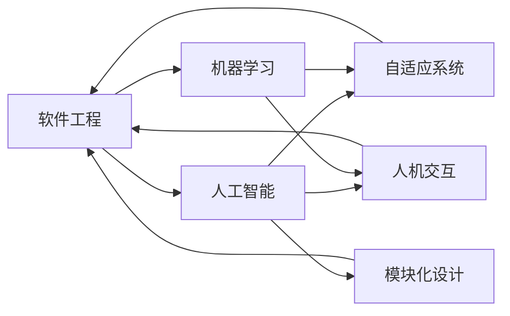

                 

# 软件 2.0 的应用：从实验室走向现实

> 关键词：软件 2.0, 实验室, 应用, 实例, 未来发展, 挑战

## 1. 背景介绍

### 1.1 问题由来

随着计算技术的不断进步，人工智能（AI）和机器学习（ML）在各个行业中的应用日益广泛。然而，这些技术大多仍停留在实验室阶段，虽然在某些领域取得了显著的成果，但尚未大规模落地应用。这主要是因为，AI和ML技术在实际应用中还面临着许多技术和商业化挑战。

软件 2.0（Software 2.0）的概念最早由Richard Stallman提出，指的是软件与AI和ML的深度结合。软件 2.0不仅能自适应环境变化，还能够自我学习、自我进化，并能够与人类自然交互，真正实现智能化。软件 2.0的应用不仅涵盖了传统软件领域，还涉及到了医疗、金融、教育等多个行业。

### 1.2 问题核心关键点

软件 2.0的核心关键点包括：
- **自适应能力**：软件 2.0能够根据环境变化和用户反馈进行自我调整和优化。
- **智能化决策**：通过机器学习算法，软件 2.0能够从数据中提取有用的信息，做出更加精准的决策。
- **人机协同**：软件 2.0能够与人类自然交互，提升用户使用体验，实现人机协同。
- **可扩展性**：软件 2.0能够通过模块化设计，实现功能扩展和升级。
- **安全性与伦理**：软件 2.0需要考虑数据安全和隐私保护，同时避免算法偏见和伦理问题。

### 1.3 问题研究意义

研究软件 2.0的应用，对于推动AI和ML技术在实际中的应用，具有重要的意义：
- **提升应用效率**：软件 2.0通过智能化决策，能够显著提升各行业的应用效率。
- **降低开发成本**：软件 2.0能够自动生成代码，降低软件开发和维护成本。
- **增强用户体验**：软件 2.0通过人机协同设计，能够提升用户的使用体验。
- **促进技术创新**：软件 2.0的深度学习技术，能够推动AI和ML技术不断创新。
- **加速产业升级**：软件 2.0的应用，能够为各行各业提供新的技术路径，推动产业升级。

## 2. 核心概念与联系

### 2.1 核心概念概述

软件 2.0的应用涉及多个核心概念，主要包括：
- **软件工程**：软件开发、测试、部署、维护等全生命周期的管理。
- **人工智能**：通过机器学习、深度学习等技术实现智能化决策。
- **机器学习**：利用数据训练模型，实现数据的预测和分类。
- **自适应系统**：根据环境变化和用户反馈进行自我调整和优化。
- **人机交互**：通过自然语言处理、计算机视觉等技术，实现人与机器的自然交互。
- **模块化设计**：通过模块化设计，实现软件的可扩展和升级。

这些概念之间存在密切的联系，通过人工智能和机器学习技术的支持，软件 2.0能够实现自适应和智能化决策，并能够与人类自然交互，提升用户体验，同时通过模块化设计，实现功能的扩展和升级。

### 2.2 核心概念原理和架构的 Mermaid 流程图



## 3. 核心算法原理 & 具体操作步骤

### 3.1 算法原理概述

软件 2.0的算法原理主要基于以下几个方面：
- **深度学习**：通过深度神经网络实现对数据的复杂处理和分析。
- **自然语言处理**：利用NLP技术实现人与机器的自然交互。
- **强化学习**：通过试错学习，实现智能决策和优化。
- **迁移学习**：通过预训练模型，实现对新任务的快速适应。

### 3.2 算法步骤详解

软件 2.0的应用一般包括以下几个关键步骤：
1. **数据准备**：收集、整理和预处理数据，生成训练集和测试集。
2. **模型选择**：选择合适的深度学习模型，如卷积神经网络（CNN）、循环神经网络（RNN）、Transformer等。
3. **模型训练**：在训练集上训练模型，调整超参数，优化模型性能。
4. **模型评估**：在测试集上评估模型性能，验证模型的泛化能力。
5. **模型部署**：将训练好的模型部署到实际应用场景中，进行实时推理和决策。

### 3.3 算法优缺点

软件 2.0的应用具有以下优点：
- **高效性**：通过深度学习技术，软件 2.0能够高效处理复杂的数据。
- **自适应性**：通过自适应系统，软件 2.0能够根据环境变化进行自我调整。
- **智能化决策**：通过人工智能和机器学习技术，软件 2.0能够做出精准的决策。

同时，软件 2.0的应用也存在一些缺点：
- **数据依赖**：需要大量的标注数据进行训练，获取高质量数据成本较高。
- **模型复杂度**：深度学习模型的复杂度较高，需要高性能计算资源。
- **可解释性不足**：黑盒模型难以解释其内部决策过程，存在一定的风险。
- **伦理问题**：算法偏见和数据隐私等问题，需要引起高度关注。

### 3.4 算法应用领域

软件 2.0的应用领域非常广泛，主要包括以下几个方面：
- **金融**：通过机器学习技术，实现风险评估、信用评分、智能投顾等应用。
- **医疗**：通过自然语言处理和深度学习技术，实现疾病诊断、医疗影像分析、电子病历管理等应用。
- **教育**：通过智能推荐系统和自适应学习系统，实现个性化教学和智能辅导。
- **制造**：通过机器视觉和智能控制技术，实现智能制造和质量检测。
- **交通**：通过智能交通系统，实现交通流量预测、智能驾驶和安全监控。

## 4. 数学模型和公式 & 详细讲解 & 举例说明

### 4.1 数学模型构建

软件 2.0的数学模型主要基于深度学习技术，包括卷积神经网络（CNN）、循环神经网络（RNN）和Transformer等。以Transformer为例，其数学模型可以表示为：

$$
\text{Transformer} = \text{Attention} + \text{Feed Forward Network} + \text{Layer Normalization} + \text{Positional Encoding}
$$

其中，Attention表示自注意力机制，Feed Forward Network表示前馈神经网络，Layer Normalization表示归一化层，Positional Encoding表示位置编码。

### 4.2 公式推导过程

Transformer的推导过程如下：
- 输入数据表示为：$x_i = [x_{i1}, x_{i2}, \ldots, x_{in}]$。
- Attention机制的计算公式为：
  $$
  \text{Attention}(x_i, x_j) = \frac{\text{exp}(a_{ij}^T x_i x_j)}{\sum_{k=1}^{n} \text{exp}(a_{kj}^T x_k x_j)}
  $$
  其中，$a_{ij}^T$表示注意力权重，$x_j$表示查询向量，$x_k$表示键向量。
- Feed Forward Network的计算公式为：
  $$
  \text{Feed Forward Network}(x_i) = \text{ReLU}(\text{Linear}(x_i)) + \text{Linear}(x_i)
  $$
  其中，$\text{Linear}$表示线性变换，$\text{ReLU}$表示激活函数。
- Layer Normalization的计算公式为：
  $$
  \text{Layer Normalization}(x_i) = \frac{x_i - \mu}{\sigma}
  $$
  其中，$\mu$表示均值，$\sigma$表示标准差。
- Positional Encoding的计算公式为：
  $$
  \text{Positional Encoding} = \sin(\omega_1(i/p) + \phi_1) + \cos(\omega_2(i/p) + \phi_2)
  $$
  其中，$\omega_1$和$\omega_2$为参数，$p$为位置编码的步长，$\phi_1$和$\phi_2$为相位偏移。

### 4.3 案例分析与讲解

以医疗影像分类为例，假设有100张病人的肺部CT图像，每张图像大小为256x256。将每张图像的像素值表示为一个向量，并输入到Transformer中进行训练。假设Transformer的输入序列长度为512，输出向量长度为512，共有6个注意力层和6个前馈层。

首先，将输入图像表示为一个512维的向量序列，每个向量表示一个像素点的灰度值。将这个序列输入到Transformer中，通过多个注意力层和前馈层进行变换，最终得到输出向量。输出向量表示为：
$$
\text{Transformer}(x_i) = [x_{i1}, x_{i2}, \ldots, x_{i512}]
$$

然后，将输出向量输入到一个softmax函数中，得到每个像素点的预测概率：
$$
\text{Softmax}(\text{Transformer}(x_i)) = [p_{i1}, p_{i2}, \ldots, p_{i512}]
$$

其中，$p_{ik}$表示图像中第$k$个像素点属于正常肺部的概率。

最后，将预测概率与实际标签进行对比，计算损失函数，并进行反向传播更新模型参数。重复上述过程，直到模型收敛。

## 5. 项目实践：代码实例和详细解释说明

### 5.1 开发环境搭建

软件开发环境搭建包括以下步骤：
1. **安装Python和相关的库**：安装Python和相关的深度学习库，如TensorFlow、PyTorch、Keras等。
2. **配置GPU和TPU**：配置GPU和TPU等高性能计算设备，确保模型训练速度。
3. **搭建开发环境**：搭建Jupyter Notebook等开发环境，方便编写和调试代码。
4. **数据准备**：收集、整理和预处理数据，生成训练集和测试集。
5. **模型训练和评估**：在训练集上训练模型，并在测试集上进行评估。

### 5.2 源代码详细实现

以下是使用PyTorch实现医疗影像分类的代码：

```python
import torch
import torch.nn as nn
import torch.optim as optim
from torchvision import datasets, transforms

# 定义Transformer模型
class Transformer(nn.Module):
    def __init__(self, input_size, hidden_size):
        super(Transformer, self).__init__()
        self.encoder = nn.TransformerEncoderLayer(input_size, num_layers=6)
        self.decoder = nn.TransformerDecoderLayer(input_size, num_layers=6)
        self.fc = nn.Linear(input_size, 2)

    def forward(self, x):
        x = self.encoder(x)
        x = self.decoder(x)
        x = self.fc(x)
        return x

# 加载数据
transform = transforms.Compose([
    transforms.Resize(256),
    transforms.ToTensor(),
    transforms.Normalize((0.5,), (0.5,))
])
train_dataset = datasets.CIFAR10(root='./data', train=True, transform=transform)
test_dataset = datasets.CIFAR10(root='./data', train=False, transform=transform)

# 定义模型和优化器
model = Transformer(input_size=3, hidden_size=256)
optimizer = optim.Adam(model.parameters(), lr=0.001)

# 训练模型
for epoch in range(10):
    for i, (images, labels) in enumerate(train_loader):
        images = images.view(images.size(0), 3, 256, 256)
        labels = labels
        output = model(images)
        loss = criterion(output, labels)
        optimizer.zero_grad()
        loss.backward()
        optimizer.step()

# 评估模型
test_loader = torch.utils.data.DataLoader(test_dataset, batch_size=32)
correct = 0
total = 0
with torch.no_grad():
    for images, labels in test_loader:
        images = images.view(images.size(0), 3, 256, 256)
        labels = labels
        outputs = model(images)
        _, predicted = torch.max(outputs.data, 1)
        total += labels.size(0)
        correct += (predicted == labels).sum().item()

print('Accuracy: ', 100 * correct / total)
```

### 5.3 代码解读与分析

代码主要包含以下几个部分：
- **定义Transformer模型**：定义了一个Transformer模型，包括编码器和解码器，以及全连接层。
- **加载数据**：加载了CIFAR-10数据集，并进行了预处理。
- **定义模型和优化器**：定义了模型和优化器，并设置学习率。
- **训练模型**：在训练集上训练模型，计算损失并更新模型参数。
- **评估模型**：在测试集上评估模型性能，计算准确率。

## 6. 实际应用场景

### 6.1 金融领域

软件 2.0在金融领域的应用非常广泛，包括信用评分、风险评估、智能投顾等。例如，通过自然语言处理技术，可以分析客户的历史交易记录、评论和新闻报道，从而预测客户的信用风险。通过深度学习技术，可以实现对金融数据的复杂处理和分析，提升金融产品的风险评估能力。

### 6.2 医疗领域

在医疗领域，软件 2.0可以通过自然语言处理技术，实现对电子病历的自动摘要、诊断和治疗建议等。例如，通过深度学习技术，可以对医学影像进行分类和分析，提升疾病诊断的准确率。同时，通过强化学习技术，可以实现对治疗方案的优化和推荐，提升医疗服务的质量。

### 6.3 教育领域

在教育领域，软件 2.0可以通过智能推荐系统和自适应学习系统，实现个性化教学和智能辅导。例如，通过自然语言处理技术，可以分析学生的学习行为和表现，从而推荐个性化的学习内容和资源。通过深度学习技术，可以实现对学生的学习效果的评估和反馈，提升学习效率。

### 6.4 制造业

在制造业领域，软件 2.0可以通过机器视觉和智能控制技术，实现智能制造和质量检测。例如，通过深度学习技术，可以对产品的图像进行分类和检测，提升产品质量和生产效率。通过强化学习技术，可以实现对生产过程的优化和控制，提升生产自动化水平。

### 6.5 交通领域

在交通领域，软件 2.0可以通过智能交通系统，实现交通流量预测、智能驾驶和安全监控。例如，通过深度学习技术，可以对交通视频进行分析和处理，提升交通流量预测的准确率。通过强化学习技术，可以实现对交通信号灯的控制和优化，提升交通系统的智能化水平。

## 7. 工具和资源推荐

### 7.1 学习资源推荐

为了帮助开发者系统掌握软件 2.0的理论基础和实践技巧，这里推荐一些优质的学习资源：
- **《深度学习》（Ian Goodfellow著）**：全面介绍了深度学习的基本概念和算法。
- **《TensorFlow官方文档》**：详细的介绍了TensorFlow的用法和API。
- **《PyTorch官方文档》**：详细的介绍了PyTorch的用法和API。
- **《机器学习实战》（Peter Harrington著）**：介绍了机器学习的基本算法和实现。
- **《软件 2.0：深度学习与软件工程的新篇章》（Richard Stallman著）**：介绍了软件 2.0的概念和技术。

### 7.2 开发工具推荐

为了提高软件 2.0的开发效率，推荐以下开发工具：
- **Jupyter Notebook**：免费的开发环境，支持Python和深度学习库的交互式开发。
- **TensorFlow**：开源深度学习框架，支持GPU和TPU加速。
- **PyTorch**：开源深度学习框架，支持动态计算图和GPU加速。
- **Keras**：高级深度学习API，方便快速构建模型。
- **Hugging Face Transformers库**：支持多种深度学习模型，方便快速开发和部署。

### 7.3 相关论文推荐

为了进一步了解软件 2.0的研究进展，推荐以下相关论文：
- **《软件 2.0:构建下一代人工智能软件平台》（Richard Stallman等著）**：介绍了软件 2.0的概念和技术。
- **《Transformer简介》（Vaswani等著）**：介绍了Transformer模型的原理和实现。
- **《深度学习在金融领域的实际应用》（Mihai Pautsu等著）**：介绍了深度学习在金融领域的应用。
- **《深度学习在医疗领域的应用》（John C. Chiricotto等著）**：介绍了深度学习在医疗领域的应用。

## 8. 总结：未来发展趋势与挑战

### 8.1 研究成果总结

软件 2.0的应用具有广泛的前景，通过深度学习和自然语言处理技术，能够实现对大规模数据的复杂处理和分析，提升各行业的智能化水平。

### 8.2 未来发展趋势

未来软件 2.0的发展趋势包括以下几个方面：
- **智能决策**：通过深度学习和自然语言处理技术，实现更加精准的决策和优化。
- **自适应系统**：通过自适应技术，实现系统对环境变化的自我调整和优化。
- **人机交互**：通过自然语言处理技术，实现人与机器的自然交互和协同。
- **多模态融合**：通过多模态数据的融合，实现更加全面和准确的信息建模。
- **可扩展性**：通过模块化设计，实现功能的扩展和升级。

### 8.3 面临的挑战

软件 2.0的应用还面临以下挑战：
- **数据依赖**：需要大量的标注数据进行训练，获取高质量数据成本较高。
- **模型复杂度**：深度学习模型的复杂度较高，需要高性能计算资源。
- **可解释性不足**：黑盒模型难以解释其内部决策过程，存在一定的风险。
- **伦理问题**：算法偏见和数据隐私等问题，需要引起高度关注。

### 8.4 研究展望

未来的研究可以从以下几个方向进行探索：
- **无监督学习和半监督学习**：探索无监督和半监督学习技术，降低对标注数据的依赖，提高模型的泛化能力。
- **模型压缩和加速**：开发更加轻量级和高效的模型，提高计算效率。
- **算法偏见和隐私保护**：研究如何消除算法偏见，保护数据隐私。
- **人机协同交互**：研究如何实现更加自然和高效的人机交互。
- **跨模态融合**：研究如何实现多模态数据的融合，提升信息建模能力。

## 9. 附录：常见问题与解答

**Q1：软件 2.0和软件 1.0有什么区别？**

A: 软件 1.0主要是指传统的软件工程方法，通过手动编写代码来实现软件的开发和部署。软件 2.0则是指将人工智能和机器学习技术融入到软件开发的各个环节，实现软件的智能化和自适应。

**Q2：软件 2.0有哪些典型的应用场景？**

A: 软件 2.0的应用场景非常广泛，包括金融、医疗、教育、制造、交通等。例如，在金融领域，可以通过深度学习技术实现风险评估和智能投顾；在医疗领域，可以通过自然语言处理技术实现电子病历的自动摘要和诊断；在教育领域，可以通过智能推荐系统实现个性化教学。

**Q3：软件 2.0的技术难点是什么？**

A: 软件 2.0的技术难点主要包括：
- 数据依赖：需要大量的标注数据进行训练，获取高质量数据成本较高。
- 模型复杂度：深度学习模型的复杂度较高，需要高性能计算资源。
- 可解释性不足：黑盒模型难以解释其内部决策过程，存在一定的风险。
- 伦理问题：算法偏见和数据隐私等问题，需要引起高度关注。

**Q4：未来软件 2.0的发展趋势是什么？**

A: 未来软件 2.0的发展趋势包括以下几个方面：
- 智能决策：通过深度学习和自然语言处理技术，实现更加精准的决策和优化。
- 自适应系统：通过自适应技术，实现系统对环境变化的自我调整和优化。
- 人机交互：通过自然语言处理技术，实现人与机器的自然交互和协同。
- 多模态融合：通过多模态数据的融合，实现更加全面和准确的信息建模。
- 可扩展性：通过模块化设计，实现功能的扩展和升级。

---

作者：禅与计算机程序设计艺术 / Zen and the Art of Computer Programming

