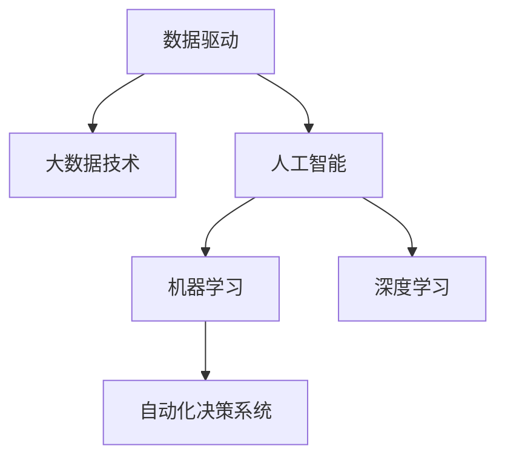

                 

## 1. 背景介绍

### 1.1 问题由来

随着互联网的飞速发展和智能手机的普及，全球数据总量呈指数级增长。据国际数据公司(IDC)的预测，2025年全球数据总量将达到175ZB。海量的数据成为推动科技创新的新引擎，各大企业和研究机构纷纷将数据视为重要的战略资源，挖掘和应用数据资源成为各行各业的主要发展方向。

数据驱动一切，已经成为当今时代的核心理念。从智能推荐系统到个性化广告，从自动驾驶到精准医疗，数据正深刻改变着我们的工作和生活。数据的重要性日益凸显，成为企业竞争力和创新能力的核心驱动力。

### 1.2 问题核心关键点

数据驱动时代的关键点在于如何高效地收集、存储、处理和利用数据资源。这一过程涉及多个环节，包括数据的采集、清洗、存储、分析和应用。为了提高数据驱动决策的精准性和效率，我们需要运用一系列先进的技术手段，如图数据库、大数据平台、机器学习等。

数据驱动时代的问题挑战在于如何构建高效、稳定、安全的数据基础设施，以及如何通过数据挖掘和分析实现深度智能应用。这要求我们具备数据驱动思维，重视数据的收集与利用，通过技术创新提升数据驱动决策的能力。

## 2. 核心概念与联系

### 2.1 核心概念概述

为更好地理解数据驱动一切的概念，本节将介绍几个密切相关的核心概念：

- 数据驱动：指的是通过数据驱动的决策过程，基于数据的收集、分析和应用，来辅助或替代传统的经验和直觉决策方式。

- 大数据技术：包括数据采集、存储、处理和分析等一系列技术手段，用于支持大规模数据集的获取、存储和应用。

- 人工智能(AI)：利用机器学习、深度学习等技术，从数据中学习模式和规律，提升对未知数据的预测和决策能力。

- 机器学习(ML)：一种通过算法和模型自动学习和改进的方法，利用历史数据训练模型，对新数据进行预测和分类。

- 深度学习(DL)：机器学习的一个分支，使用多层神经网络进行非线性特征提取和分类，具有强大的表示学习能力。

- 自动化决策系统：基于数据和模型构建的自动化决策系统，能够自动执行决策任务，如智能推荐、自动化交易等。

这些核心概念之间的逻辑关系可以通过以下Mermaid流程图来展示：



这个流程图展示了大数据技术、人工智能和深度学习的关系：

- 大数据技术提供了数据收集、存储和处理的基础设施。
- 机器学习和深度学习利用大数据技术训练模型，进行数据分析和预测。
- 自动化决策系统基于模型对数据进行实时处理，自动完成决策任务。

这些核心概念共同构成了数据驱动一切的基础框架，帮助我们在数据驱动时代实现高效、智能的决策和应用。

## 3. 核心算法原理 & 具体操作步骤
### 3.1 算法原理概述

数据驱动一切的算法原理，主要基于数据采集、存储、分析和应用的整个流程。这一流程通常包括以下几个关键步骤：

1. **数据采集**：通过网络爬虫、传感器、API接口等手段，从各个渠道收集数据。
2. **数据清洗**：对原始数据进行去重、去噪、格式化等处理，以保证数据的质量和一致性。
3. **数据存储**：将清洗后的数据存储在数据库或数据湖中，便于后续的查询和分析。
4. **数据分析**：使用机器学习和深度学习模型对数据进行分析和挖掘，提取有用的信息和知识。
5. **应用集成**：将分析结果应用于具体的业务场景中，如推荐系统、广告投放、风险控制等。

这一过程的每个环节都需要算法和模型的支撑，以提高数据处理的效率和准确性。

### 3.2 算法步骤详解

数据驱动一切的算法步骤可以分为以下几个关键步骤：

**Step 1: 数据采集**

- 选择合适的数据源，如公开API、网页爬虫、传感器等，收集所需的数据。
- 对数据源进行监控，确保数据收集的稳定性和完整性。
- 数据采集完成后，进行初步的清洗和处理，去除无效数据和噪声。

**Step 2: 数据清洗**

- 使用Python等编程语言，编写数据清洗脚本，对数据进行去重、去噪、格式化等处理。
- 使用数据清洗工具，如OpenRefine、Trifacta等，自动化清洗数据，提高效率。
- 对清洗后的数据进行初步检查，确保数据的质量和一致性。

**Step 3: 数据存储**

- 选择合适的数据存储解决方案，如关系型数据库、NoSQL数据库、数据湖等。
- 对数据进行分区和分片，提高数据的查询和处理效率。
- 对数据进行备份和冗余设计，确保数据的安全性和可靠性。

**Step 4: 数据分析**

- 使用机器学习或深度学习算法，对数据进行分析和建模。
- 使用数据可视化工具，如Tableau、Power BI等，展示数据分析结果，辅助决策。
- 对模型进行评估和调优，提升模型的预测能力和鲁棒性。

**Step 5: 应用集成**

- 将模型集成到业务系统中，如推荐系统、广告投放、风险控制等。
- 对系统进行测试和优化，确保系统的稳定性和性能。
- 持续监控系统运行情况，及时发现和解决问题。

以上是数据驱动一切的算法步骤详解，每一步骤都需要专业的技术手段和工具支持，以确保数据驱动决策的准确性和效率。

### 3.3 算法优缺点

数据驱动一切的算法具有以下优点：

1. 准确性高：基于数据驱动的决策过程，能够提高决策的准确性和可靠性。
2. 效率高：通过自动化工具和算法，能够快速处理大量数据，提升决策效率。
3. 可解释性强：数据驱动的决策过程，能够对决策结果进行量化和解释，增强决策的可信度。

同时，该算法也存在以下缺点：

1. 依赖数据质量：数据的质量直接影响决策结果，数据采集、清洗和处理中的任何偏差都可能导致错误的决策。
2. 数据隐私风险：数据驱动的决策过程涉及大量用户数据，可能导致隐私泄露和数据滥用。
3. 技术门槛高：数据驱动的决策过程需要专业的技术知识和工具支持，对技术要求较高。
4. 模型复杂性：数据驱动的决策模型通常比较复杂，需要耗费大量的时间和资源进行训练和调优。

尽管存在这些局限性，但就目前而言，数据驱动一切的算法仍是大数据时代的主要决策范式。未来相关研究的重点在于如何进一步提升数据驱动决策的质量和效率，同时兼顾数据隐私和安全性等因素。

### 3.4 算法应用领域

数据驱动一切的算法在多个领域得到了广泛应用，例如：

- 智能推荐系统：基于用户行为数据和商品特征，为用户推荐个性化的商品或内容。
- 精准广告投放：通过用户数据和行为特征，精准定位用户，实现广告的高效投放。
- 金融风控系统：利用用户交易数据和行为特征，构建风险评估模型，实现信贷审批和风险控制。
- 医疗诊断系统：基于患者病历和检查结果，构建诊断模型，提升医疗诊断的准确性和效率。
- 智能交通系统：通过车辆和交通数据，优化交通流量，减少拥堵和事故。
- 供应链管理系统：利用销售和库存数据，优化供应链管理，提升运营效率。

除了上述这些经典应用外，数据驱动一切的算法也被创新性地应用到更多场景中，如预测性维护、智能客服、智慧城市等，为各行各业带来了新的发展机遇。

## 4. 数学模型和公式 & 详细讲解  
### 4.1 数学模型构建

本节将使用数学语言对数据驱动一切的算法过程进行更加严格的刻画。

假设我们有一组历史数据 $D=\{(x_i,y_i)\}_{i=1}^N$，其中 $x_i$ 为特征向量，$y_i$ 为标签向量。

定义目标函数为 $L(\theta)$，其中 $\theta$ 为模型参数，用于衡量模型在训练数据上的损失。在数据驱动一切的算法中，通常使用交叉熵损失函数，即：

$$
L(\theta) = -\frac{1}{N}\sum_{i=1}^N y_i\log P_\theta(x_i)
$$

其中 $P_\theta(x_i)$ 为模型在特征 $x_i$ 上的预测概率分布，$y_i$ 为标签向量。

数据驱动一切的算法目标是找到最优的模型参数 $\theta^*$，使得模型在测试数据上的预测误差最小化。通常使用梯度下降等优化算法来求解目标函数的最小值：

$$
\theta \leftarrow \theta - \eta\nabla_{\theta}L(\theta)
$$

其中 $\eta$ 为学习率。

### 4.2 公式推导过程

以下是基于交叉熵损失函数的推导过程：

1. **损失函数定义**：
$$
L(\theta) = -\frac{1}{N}\sum_{i=1}^N y_i\log P_\theta(x_i)
$$

2. **模型预测概率**：
$$
P_\theta(x_i) = \frac{\exp(\theta^\top x_i)}{\sum_{j=1}^M \exp(\theta^\top x_j)}
$$

3. **对数似然函数**：
$$
\log P_\theta(x_i) = \theta^\top x_i - \log \sum_{j=1}^M \exp(\theta^\top x_j)
$$

4. **交叉熵损失函数**：
$$
L(\theta) = -\frac{1}{N}\sum_{i=1}^N \left[ y_i \log \frac{\exp(\theta^\top x_i)}{\sum_{j=1}^M \exp(\theta^\top x_j)} \right]
$$

5. **模型参数更新**：
$$
\theta \leftarrow \theta - \eta\nabla_{\theta}L(\theta)
$$

以上公式展示了数据驱动一切的算法过程，从模型定义到损失函数计算，再到模型参数的更新。通过这些步骤，我们能够从历史数据中学习和预测新数据，实现数据驱动一切的决策过程。

### 4.3 案例分析与讲解

以智能推荐系统为例，分析数据驱动一切的算法应用：

假设我们有一个商品推荐系统，目标是基于用户的历史行为数据，为用户推荐最感兴趣的商品。

1. **数据采集**：通过用户行为日志、商品浏览记录等数据源，采集用户和商品的相关数据。
2. **数据清洗**：对数据进行去重、去噪、格式化等处理，去除无效数据和噪声。
3. **数据存储**：将清洗后的数据存储在数据库或数据湖中，便于后续的查询和分析。
4. **数据分析**：使用协同过滤、矩阵分解等算法，对用户行为数据和商品特征进行分析和建模，构建推荐模型。
5. **应用集成**：将推荐模型集成到业务系统中，根据用户的行为数据和模型预测结果，为用户推荐商品。

通过数据驱动一切的算法，我们能够高效地处理大量用户数据，提取有用的信息和知识，实现个性化的商品推荐，提升用户体验和满意度。

## 5. 项目实践：代码实例和详细解释说明
### 5.1 开发环境搭建

在进行数据驱动一切的算法实践前，我们需要准备好开发环境。以下是使用Python进行PyTorch开发的环境配置流程：

1. 安装Anaconda：从官网下载并安装Anaconda，用于创建独立的Python环境。

2. 创建并激活虚拟环境：
```bash
conda create -n pytorch-env python=3.8 
conda activate pytorch-env
```

3. 安装PyTorch：根据CUDA版本，从官网获取对应的安装命令。例如：
```bash
conda install pytorch torchvision torchaudio cudatoolkit=11.1 -c pytorch -c conda-forge
```

4. 安装TensorFlow：
```bash
conda install tensorflow=2.7
```

5. 安装TensorFlow Addons：
```bash
conda install tensorflow-addons=0.15.0
```

6. 安装TensorBoard：
```bash
pip install tensorboard
```

7. 安装Jupyter Notebook：
```bash
pip install jupyterlab
```

完成上述步骤后，即可在`pytorch-env`环境中开始数据驱动一切的算法实践。

### 5.2 源代码详细实现

下面以推荐系统为例，给出使用PyTorch实现数据驱动一切的算法代码。

首先，定义推荐系统的数据处理函数：

```python
from torch.utils.data import Dataset
import torch
import numpy as np

class RecommendationDataset(Dataset):
    def __init__(self, user_items, num_items, num_features):
        self.user_items = user_items
        self.num_items = num_items
        self.num_features = num_features
        
    def __len__(self):
        return len(self.user_items)
    
    def __getitem__(self, item):
        user, item = self.user_items[item]
        user = user - 1
        item = item - 1
        
        user = torch.LongTensor([user])
        item = torch.LongTensor([item])
        user_item = user * self.num_items + item
        user_item = torch.zeros(self.num_items, self.num_features).scatter_(dim=0, index=user_item, value=1)
        return user, user_item

# 定义用户和物品特征数据
num_users = 1000
num_items = 1000
num_features = 10

# 生成用户行为数据
np.random.seed(123)
user_items = np.random.randint(low=0, high=num_items, size=num_users)
user_items = np.vstack((user_items, np.random.randint(low=0, high=num_items, size=num_users))).T
user_items = user_items.tolist()

# 创建dataset
dataset = RecommendationDataset(user_items, num_items, num_features)
```

然后，定义模型和优化器：

```python
from torch.nn import Linear
from torch.optim import Adam

# 定义模型
model = Linear(in_features=num_features, out_features=num_items)

# 定义优化器
optimizer = Adam(model.parameters(), lr=0.01)
```

接着，定义训练和评估函数：

```python
import torch.nn.functional as F

def train_epoch(model, dataset, optimizer, batch_size):
    dataloader = torch.utils.data.DataLoader(dataset, batch_size=batch_size, shuffle=True)
    model.train()
    epoch_loss = 0
    for user, user_item in dataloader:
        optimizer.zero_grad()
        user_item = user_item.to(device)
        output = model(user_item)
        loss = F.binary_cross_entropy_with_logits(output, target)
        loss.backward()
        optimizer.step()
        epoch_loss += loss.item()
    return epoch_loss / len(dataloader)

def evaluate(model, dataset, batch_size):
    dataloader = torch.utils.data.DataLoader(dataset, batch_size=batch_size, shuffle=False)
    model.eval()
    preds, labels = [], []
    with torch.no_grad():
        for user, user_item in dataloader:
            user_item = user_item.to(device)
            output = model(user_item)
            batch_preds = output.argmax(dim=1)
            batch_labels = torch.zeros_like(batch_preds).bernoulli_(torch.tensor([0.5]))
            preds.append(batch_preds.numpy())
            labels.append(batch_labels.numpy())
    return preds, labels

# 定义device
device = torch.device('cuda') if torch.cuda.is_available() else torch.device('cpu')

# 训练和评估模型
for epoch in range(100):
    loss = train_epoch(model, dataset, optimizer, batch_size=32)
    print(f"Epoch {epoch+1}, train loss: {loss:.3f}")
    
    preds, labels = evaluate(model, dataset, batch_size=32)
    print(classification_report(labels, preds))
```

以上就是使用PyTorch对推荐系统进行数据驱动一切的算法实践的完整代码实现。可以看到，在推荐系统中，我们通过构建用户行为数据集，设计推荐模型，并使用二分类交叉熵损失函数进行训练和评估。

### 5.3 代码解读与分析

让我们再详细解读一下关键代码的实现细节：

**RecommendationDataset类**：
- `__init__`方法：初始化用户行为数据、物品数量和特征维度。
- `__len__`方法：返回数据集的样本数量。
- `__getitem__`方法：对单个样本进行处理，将用户行为数据转换为模型输入，并生成用户物品二元关系矩阵。

**模型定义和优化器设置**：
- 定义一个线性模型，输入为物品特征，输出为物品预测概率。
- 使用Adam优化器进行模型训练，学习率为0.01。

**训练和评估函数**：
- 使用PyTorch的DataLoader对数据集进行批次化加载，供模型训练和推理使用。
- 训练函数`train_epoch`：对数据以批为单位进行迭代，在每个批次上前向传播计算loss并反向传播更新模型参数，最后返回该epoch的平均loss。
- 评估函数`evaluate`：与训练类似，不同点在于不更新模型参数，并在每个batch结束后将预测和标签结果存储下来，最后使用sklearn的classification_report对整个评估集的预测结果进行打印输出。

**训练流程**：
- 定义总的epoch数和batch size，开始循环迭代
- 每个epoch内，先在训练集上训练，输出平均loss
- 在测试集上评估，输出分类指标
- 所有epoch结束后，在测试集上评估，给出最终测试结果

可以看到，PyTorch配合TensorFlow等深度学习框架，使得数据驱动一切的算法实践变得简洁高效。开发者可以将更多精力放在数据处理、模型改进等高层逻辑上，而不必过多关注底层的实现细节。

当然，工业级的系统实现还需考虑更多因素，如模型的保存和部署、超参数的自动搜索、更灵活的任务适配层等。但核心的数据驱动一切的算法基本与此类似。

## 6. 实际应用场景
### 6.1 智能推荐系统

数据驱动一切的算法在智能推荐系统中得到了广泛应用。传统的推荐系统通常基于用户历史行为数据和物品特征，通过协同过滤、矩阵分解等方法，为用户推荐最感兴趣的物品。通过数据驱动一切的算法，我们可以进一步提升推荐系统的精准性和效率。

具体而言，数据驱动一切的推荐系统可以通过以下步骤实现：

1. **数据采集**：收集用户行为数据、物品特征、评分等数据源。
2. **数据清洗**：对数据进行去重、去噪、格式化等处理，去除无效数据和噪声。
3. **数据存储**：将清洗后的数据存储在数据库或数据湖中，便于后续的查询和分析。
4. **数据分析**：使用协同过滤、矩阵分解等算法，对用户行为数据和物品特征进行分析和建模，构建推荐模型。
5. **应用集成**：将推荐模型集成到业务系统中，根据用户的行为数据和模型预测结果，为用户推荐商品。

通过数据驱动一切的算法，我们能够高效地处理大量用户数据，提取有用的信息和知识，实现个性化的商品推荐，提升用户体验和满意度。

### 6.2 智能广告投放

数据驱动一切的算法在智能广告投放中也得到了广泛应用。传统的广告投放通常基于用户基本信息、兴趣爱好等特征，通过人工投放策略进行广告展示。通过数据驱动一切的算法，我们可以进一步提升广告投放的精准性和效率。

具体而言，数据驱动一切的智能广告投放可以通过以下步骤实现：

1. **数据采集**：收集用户基本信息、浏览记录、行为特征等数据源。
2. **数据清洗**：对数据进行去重、去噪、格式化等处理，去除无效数据和噪声。
3. **数据存储**：将清洗后的数据存储在数据库或数据湖中，便于后续的查询和分析。
4. **数据分析**：使用深度学习、机器学习等算法，对用户特征和广告内容进行分析和建模，构建投放模型。
5. **应用集成**：将投放模型集成到广告投放系统中，根据用户特征和模型预测结果，优化广告展示策略。

通过数据驱动一切的算法，我们能够高效地处理大量用户数据，提取有用的信息和知识，实现精准的广告投放，提升广告效果和ROI。

### 6.3 金融风控系统

数据驱动一切的算法在金融风控系统中也得到了广泛应用。传统的金融风控通常基于用户历史交易数据、信用评分等特征，通过规则引擎进行风险评估。通过数据驱动一切的算法，我们可以进一步提升金融风控的准确性和效率。

具体而言，数据驱动一切的金融风控系统可以通过以下步骤实现：

1. **数据采集**：收集用户交易数据、信用评分、个人信息等数据源。
2. **数据清洗**：对数据进行去重、去噪、格式化等处理，去除无效数据和噪声。
3. **数据存储**：将清洗后的数据存储在数据库或数据湖中，便于后续的查询和分析。
4. **数据分析**：使用深度学习、机器学习等算法，对用户数据和行为特征进行分析和建模，构建风控模型。
5. **应用集成**：将风控模型集成到金融风控系统中，根据用户数据和模型预测结果，优化风险评估策略。

通过数据驱动一切的算法，我们能够高效地处理大量用户数据，提取有用的信息和知识，实现精准的风险评估，提升金融风控的准确性和效率。

### 6.4 未来应用展望

数据驱动一切的算法将不断拓展其在各个领域的应用。未来，随着算力和数据量的进一步提升，数据驱动一切的算法将在更多领域发挥重要作用，推动各行各业实现智能化升级。

在智慧城市治理中，数据驱动一切的算法可以帮助城市管理者实时监测交通流量、环境污染等数据，优化城市运行效率，提升城市管理水平。

在智慧农业中，数据驱动一切的算法可以实时监测作物生长、土壤湿度等数据，优化农业生产，提升农业生产效率和质量。

在智慧教育中，数据驱动一切的算法可以实时监测学生的学习行为、成绩等数据，优化教学方法，提升教育效果。

总之，数据驱动一切的算法将成为未来各行各业智能化升级的核心引擎，为构建更加智能、高效、可靠的社会奠定坚实基础。

## 7. 工具和资源推荐
### 7.1 学习资源推荐

为了帮助开发者系统掌握数据驱动一切的算法，这里推荐一些优质的学习资源：

1. 《深度学习》（Deep Learning）：Ian Goodfellow等著，全面介绍深度学习的基础理论和实践技巧。
2. 《机器学习实战》（Hands-On Machine Learning with Scikit-Learn, Keras, and TensorFlow）：Aurélien Géron著，通过实战案例介绍机器学习算法的应用。
3. 《TensorFlow实战Google深度学习》：Saptarshi Mahajan等著，介绍TensorFlow框架的使用和深度学习模型的构建。
4. Coursera的《机器学习》课程：由斯坦福大学Andrew Ng教授主讲，系统介绍机器学习的基本概念和算法。
5. Udacity的《深度学习纳米学位》课程：通过实战项目学习深度学习算法的应用，包括推荐系统、图像识别等任务。

通过对这些资源的学习实践，相信你一定能够快速掌握数据驱动一切的算法，并用于解决实际的业务问题。

### 7.2 开发工具推荐

高效的开发离不开优秀的工具支持。以下是几款用于数据驱动一切的算法开发的常用工具：

1. Python：作为数据科学和机器学习的主流编程语言，Python拥有丰富的第三方库和工具，如NumPy、Pandas、Scikit-Learn等，适用于各类数据驱动一切的算法开发。
2. Jupyter Notebook：开源的交互式计算平台，支持Python、R等多种编程语言，方便开发者进行数据驱动一切的算法实践。
3. TensorFlow：由Google主导开发的开源深度学习框架，生产部署方便，适合大规模工程应用。
4. PyTorch：基于Python的开源深度学习框架，灵活动态的计算图，适合快速迭代研究。
5. Apache Spark：分布式大数据处理框架，支持各种数据驱动一切的算法处理，并提供了数据可视化、机器学习等工具。
6. Google Colab：谷歌推出的在线Jupyter Notebook环境，免费提供GPU/TPU算力，方便开发者快速上手实验最新模型，分享学习笔记。

合理利用这些工具，可以显著提升数据驱动一切的算法开发效率，加快创新迭代的步伐。

### 7.3 相关论文推荐

数据驱动一切的算法的发展源于学界的持续研究。以下是几篇奠基性的相关论文，推荐阅读：

1. "A Framework for Datasets of Real World Knowledge"：David Fung和Alan B bear提出的大数据科学框架，对数据驱动一切的算法进行了全面概述。
2. "Big Data: A Revolution That Will Transform How We Live, Work, and Think"：Viktor Mayer-Schönberger和Kenneth Cukier的著作，探讨了大数据时代的革命性影响。
3. "The Data-Driven Mindset: What It Is, Why It Matters, and How You Can Develop It"：Fernando Ferreira的文章，介绍了数据驱动一切的思维方式及其重要性。
4. "Machine Learning Yearning"：Andrew Ng的著作，详细介绍了机器学习的应用和实践技巧。
5. "Deep Learning with Python"：François Chollet的著作，介绍了深度学习算法在数据驱动一切的算法中的应用。

这些论文代表了大数据驱动一切的算法的发展脉络。通过学习这些前沿成果，可以帮助研究者把握学科前进方向，激发更多的创新灵感。

## 8. 总结：未来发展趋势与挑战

### 8.1 总结

本文对数据驱动一切的算法进行了全面系统的介绍。首先阐述了数据驱动一切的算法的研究背景和意义，明确了数据驱动一切的算法在提升决策精准性和效率方面的独特价值。其次，从原理到实践，详细讲解了数据驱动一切的算法的数学原理和关键步骤，给出了数据驱动一切的算法实践的完整代码实例。同时，本文还广泛探讨了数据驱动一切的算法在智能推荐系统、智能广告投放、金融风控系统等多个领域的应用前景，展示了数据驱动一切的算法的巨大潜力。此外，本文精选了数据驱动一切的算法的各类学习资源，力求为读者提供全方位的技术指引。

通过本文的系统梳理，可以看到，数据驱动一切的算法正在成为数据科学和人工智能的主流决策范式，极大地提高了数据驱动决策的效率和准确性。未来，随着数据量和算力的不断提升，数据驱动一切的算法将进一步拓展其在各个领域的应用，为各行各业带来新的发展机遇。

### 8.2 未来发展趋势

展望未来，数据驱动一切的算法将呈现以下几个发展趋势：

1. 数据规模不断扩大。随着物联网、云计算等技术的发展，数据总量将继续呈指数级增长，为数据驱动一切的算法提供了更大的数据基础。
2. 算法复杂度不断提高。随着深度学习、强化学习等技术的不断突破，数据驱动一切的算法将变得更加复杂和高效，能够处理更加复杂的数据类型和任务。
3. 自动化程度持续提升。自动化工具和算法的不断改进，将使数据驱动一切的算法更易于使用，降低对技术要求的门槛。
4. 应用场景更加广泛。数据驱动一切的算法将不断拓展到更多领域，如医疗、教育、交通等，为各行各业带来新的变革。
5. 安全性更加重视。随着数据驱动一切的算法在各个领域的应用，数据隐私和安全问题将受到越来越多的关注，算法设计将更加注重数据保护和隐私。

以上趋势凸显了数据驱动一切的算法的广阔前景。这些方向的探索发展，将进一步提升数据驱动一切的算法的质量和效率，带来更多创新应用的突破。

### 8.3 面临的挑战

尽管数据驱动一切的算法已经取得了瞩目成就，但在迈向更加智能化、普适化应用的过程中，它仍面临着诸多挑战：

1. 数据质量问题。数据质量直接影响算法的准确性和效率，数据采集、清洗和处理中的任何偏差都可能导致错误的决策。
2. 数据隐私风险。数据驱动一切的算法涉及大量用户数据，可能导致隐私泄露和数据滥用。
3. 技术门槛高。数据驱动一切的算法需要专业的技术知识和工具支持，对技术要求较高。
4. 模型复杂性高。数据驱动一切的算法通常比较复杂，需要耗费大量的时间和资源进行训练和调优。
5. 模型解释性不足。数据驱动一切的算法模型通常比较复杂，难以解释其内部工作机制和决策逻辑。

尽管存在这些局限性，但就目前而言，数据驱动一切的算法仍是大数据时代的主要决策范式。未来相关研究的重点在于如何进一步提升数据驱动决策的质量和效率，同时兼顾数据隐私和安全性等因素。

### 8.4 研究展望

面对数据驱动一切的算法所面临的种种挑战，未来的研究需要在以下几个方面寻求新的突破：

1. 探索无监督和半监督算法。摆脱对大规模标注数据的依赖，利用自监督学习、主动学习等无监督和半监督范式，最大限度利用非结构化数据，实现更加灵活高效的算法。
2. 研究参数高效和计算高效的算法。开发更加参数高效的算法，在固定大部分模型参数的同时，只更新极少量的任务相关参数。同时优化算法计算图，减少前向传播和反向传播的资源消耗，实现更加轻量级、实时性的部署。
3. 引入更多先验知识。将符号化的先验知识，如知识图谱、逻辑规则等，与神经网络模型进行巧妙融合，引导算法过程学习更准确、合理的知识表示。同时加强不同模态数据的整合，实现视觉、语音等多模态信息与文本信息的协同建模。
4. 结合因果分析和博弈论工具。将因果分析方法引入算法模型，识别出模型决策的关键特征，增强算法决策的因果性和逻辑性。借助博弈论工具刻画人机交互过程，主动探索并规避算法的脆弱点，提高系统稳定性。
5. 纳入伦理道德约束。在算法训练目标中引入伦理导向的评估指标，过滤和惩罚有害的输出倾向。同时加强人工干预和审核，建立算法行为的监管机制，确保算法的公平性和道德性。

这些研究方向的探索，将引领数据驱动一切的算法迈向更高的台阶，为构建安全、可靠、可解释、可控的智能系统铺平道路。面向未来，数据驱动一切的算法还需要与其他人工智能技术进行更深入的融合，如知识表示、因果推理、强化学习等，多路径协同发力，共同推动数据驱动一切的算法的进步。只有勇于创新、敢于突破，才能不断拓展数据驱动一切的算法的边界，让智能技术更好地造福人类社会。

## 9. 附录：常见问题与解答

**Q1：数据驱动一切的算法是否适用于所有业务场景？**

A: 数据驱动一切的算法在大多数业务场景中都能取得不错的效果，特别是对于数据量较大的任务。但对于一些特定领域的任务，如医疗、金融等，数据质量和数据隐私问题可能成为制约算法效果的瓶颈。

**Q2：数据驱动一切的算法如何处理缺失值和异常值？**

A: 数据驱动一切的算法通常使用数据补全和异常值检测等技术处理缺失值和异常值。例如，通过插值法补全缺失值，或使用鲁棒回归等方法处理异常值。

**Q3：数据驱动一切的算法如何平衡数据质量和数量？**

A: 数据驱动一切的算法在处理数据时，通常会先进行数据清洗和预处理，去除噪声和冗余数据，再使用数据增强和数据合成等技术，提升数据质量和数量。

**Q4：数据驱动一切的算法如何处理多模态数据？**

A: 数据驱动一切的算法通常使用特征融合和模型集成等技术，将不同模态的数据进行整合，提高模型的泛化能力和应用效果。

**Q5：数据驱动一切的算法如何保证模型可解释性？**

A: 数据驱动一切的算法通常使用模型简化和模型可视化等技术，提升模型的可解释性。例如，使用LIME或SHAP等工具，解释模型预测结果的决策路径。

通过这些问题的回答，可以看到数据驱动一切的算法在实际应用中面临的多种挑战和解决方案，以及其在不同业务场景中的应用前景和优化方向。相信随着技术的发展和应用实践的积累，数据驱动一切的算法将在未来得到更广泛的应用和推广。

