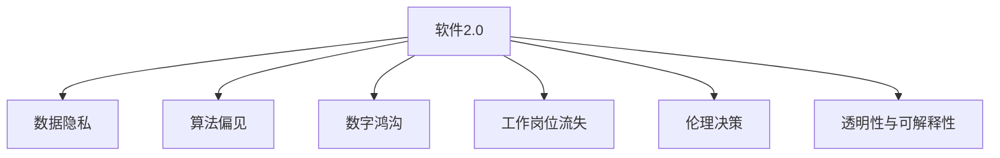

                 

# 软件 2.0 的社会责任：科技向善

## 1. 背景介绍

### 1.1 问题由来
随着软件技术特别是人工智能(AI)技术的快速发展，人类社会的生产生活方式正在经历前所未有的变革。软件2.0（Software 2.0），即基于人工智能驱动的软件，正成为推动社会进步的重要力量。然而，这种进步并非无懈可击，伴随着技术的发展，一系列社会问题也逐渐浮出水面。如何确保技术的发展为社会带来正面效应，让科技真正造福人类，成为当前科技从业者和政策制定者共同面临的重要课题。

### 1.2 问题核心关键点
软件2.0技术带来的主要社会问题包括但不限于：数据隐私泄露、算法偏见与歧视、数字鸿沟扩大、工作岗位流失等。这些问题不仅影响个体福祉，更关系到社会的公平正义和发展方向。因此，科技向善，即确保技术开发与应用过程中的道德伦理和社会责任，成为软件2.0时代的重要使命。

### 1.3 问题研究意义
在软件2.0时代，科技向善不仅是企业社会责任的一部分，更是技术创新的内在要求。一个负责任的科技企业不仅能获得社会各界的认可，还能在激烈的市场竞争中占据有利地位。从宏观层面来看，科技向善有助于构建和谐社会，推动经济可持续发展。

## 2. 核心概念与联系

### 2.1 核心概念概述

为更好地理解软件2.0技术在社会责任方面的应用，本节将介绍几个关键概念及其相互联系：

- **软件2.0 (Software 2.0)**：基于人工智能技术的软件，具备自我学习和自我优化能力，能够根据用户行为和反馈不断提升其功能和性能。
- **数据隐私 (Data Privacy)**：在软件2.0技术的应用中，用户数据被广泛收集和使用。数据隐私问题涉及数据收集、存储、处理和共享过程中的保护机制。
- **算法偏见 (Algorithmic Bias)**：由于数据偏见、模型设计缺陷等原因，算法在处理某些数据时可能产生歧视性结果。
- **数字鸿沟 (Digital Divide)**：技术发展带来的信息不对称，导致不同群体在获取和使用技术资源方面的差距。
- **工作岗位流失 (Job Displacement)**：自动化和智能化技术可能导致部分传统工作岗位消失，引起就业问题。
- **伦理决策 (Ethical Decision-Making)**：在技术开发和应用过程中，如何平衡经济效益和社会责任，做出符合伦理原则的决策。
- **透明性与可解释性 (Transparency and Interpretability)**：确保软件2.0技术的决策过程公开透明，用户能够理解其工作原理和决策依据。

这些概念之间的逻辑关系可以通过以下Mermaid流程图来展示：



这个流程图展示了软件2.0技术在不同社会维度上的潜在影响及其相互联系。

## 3. 核心算法原理 & 具体操作步骤
### 3.1 算法原理概述

软件2.0技术的社会责任，涉及到数据隐私保护、算法公平性、社会公正与透明度等关键点。其核心算法原理可概括为：

1. **数据隐私保护**：通过差分隐私、联邦学习等技术，保护用户数据不被滥用。
2. **算法偏见纠正**：利用公平性约束、去偏策略等方法，减少算法偏见。
3. **社会公平促进**：通过普惠设计、无障碍访问等措施，缩小数字鸿沟。
4. **透明性与可解释性增强**：使用可解释性模型、决策路径可视化等技术，提升用户对系统决策的理解。

### 3.2 算法步骤详解

为了实现上述社会责任目标，软件2.0技术的开发和应用需要遵循以下步骤：

**Step 1: 数据隐私保护**
- 收集用户数据时，确保数据匿名化处理，避免数据泄露。
- 使用差分隐私技术，向数据中加入噪声，限制数据集的可识别性。
- 采用联邦学习方式，在本地设备上训练模型，不将原始数据传输到中央服务器。

**Step 2: 算法偏见纠正**
- 在模型训练阶段，引入公平性约束，限制算法对特定群体的歧视。
- 使用去偏策略，如重新加权、对抗训练等方法，消除数据偏见对模型结果的影响。
- 定期审查算法表现，使用指标如准确率、召回率、公平度等评估模型公平性。

**Step 3: 社会公平促进**
- 设计和开发普惠软件，确保不同群体都能平等地使用技术。
- 通过无障碍设计，如语音识别、大字体设置等，使残障人士也能方便使用。
- 提供经济负担减轻措施，如免费软件、教育优惠等，确保低收入群体也能享受技术红利。

**Step 4: 透明性与可解释性增强**
- 使用可解释性模型，如决策树、线性回归等，使得决策过程透明。
- 实现决策路径可视化，让用户能够理解模型是如何得出结论的。
- 定期进行算法审查，确保模型决策符合伦理原则。

### 3.3 算法优缺点

软件2.0技术的社会责任算法具有以下优点：
1. **提高用户信任度**：通过保护用户隐私和增强透明度，提升用户对技术的信任和接受度。
2. **促进社会公平**：通过普惠设计和公平算法，缩小数字鸿沟，实现社会公平。
3. **降低法律风险**：遵循伦理和社会责任原则，减少因数据滥用和算法偏见引发的法律风险。

同时，这些算法也存在以下缺点：
1. **技术复杂性**：实现数据隐私保护、算法偏见纠正等需要较高的技术门槛。
2. **资源消耗**：差分隐私、联邦学习等技术可能带来较大的计算和存储负担。
3. **成本增加**：设计和实现社会责任算法可能需要额外投入成本。

尽管存在这些挑战，但科技向善是软件2.0技术发展的必然要求，相关研究和实践正在不断推进。

### 3.4 算法应用领域

软件2.0技术的社会责任算法在多个领域都有广泛应用：

- **医疗健康**：保护患者隐私，确保医疗数据的安全和公平使用。
- **金融科技**：防范算法偏见，确保金融服务的公平和透明。
- **教育培训**：提供普惠教育资源，缩小教育差距。
- **环境保护**：通过透明可解释的模型，提高环境保护政策的执行效果。
- **公共安全**：确保算法决策的公平性和透明性，防止滥用。

这些应用领域展示了软件2.0技术在提升社会福祉方面的巨大潜力。

## 4. 数学模型和公式 & 详细讲解 & 举例说明

### 4.1 数学模型构建

在本节中，我们将以算法偏见纠正为例，构建一个简单的数学模型来解释和计算公平性。

假设有一个二分类问题，模型训练数据集为 $D=\{(x_i, y_i)\}_{i=1}^N$，其中 $x_i$ 为特征向量，$y_i$ 为标签。我们希望训练一个模型 $f(x)$，使其能够对未知数据进行分类。

### 4.2 公式推导过程

在模型训练过程中，我们引入公平性约束，即希望模型在所有群体上的表现一致。具体地，我们定义一个公平性指标 $\phi$，如平衡精度（Balanced Accuracy），来衡量模型在不同群体上的表现。

平衡精度定义为：
$$
\phi = \frac{1}{2} (\frac{TP}{TP+FN} + \frac{TN}{TN+FP})
$$

其中，$TP$ 为真正例，$TN$ 为真负例，$FP$ 为假正例，$FN$ 为假负例。

### 4.3 案例分析与讲解

为了解释这个公式，我们举一个简单的例子。假设我们有一个性别平等的样本集，其中正类和负类的数量相等。如果我们的模型对正类和负类的预测概率相同，那么 $\phi$ 的值应该为0.5。然而，如果我们的数据集存在性别偏见，即某一性别的样本量远大于另一性别，那么我们的模型预测可能也会出现偏见。

例如，如果女性样本比男性样本多10倍，那么在模型训练时，我们的模型可能会更加偏好预测女性样本为正类，从而忽略了男性的真实情况。这会导致 $\phi$ 的值偏离0.5，反映出模型的不公平性。

为了纠正这种偏见，我们可以使用去偏策略，如重新加权、对抗训练等方法，来确保模型对所有群体的预测一致。

## 5. 项目实践：代码实例和详细解释说明

### 5.1 开发环境搭建

在进行项目实践前，我们需要准备好开发环境。以下是使用Python进行TensorFlow开发的环境配置流程：

1. 安装Anaconda：从官网下载并安装Anaconda，用于创建独立的Python环境。

2. 创建并激活虚拟环境：
```bash
conda create -n tensorflow-env python=3.8 
conda activate tensorflow-env
```

3. 安装TensorFlow：根据CUDA版本，从官网获取对应的安装命令。例如：
```bash
conda install tensorflow -c pytorch -c conda-forge
```

4. 安装各类工具包：
```bash
pip install numpy pandas scikit-learn matplotlib tqdm jupyter notebook ipython
```

完成上述步骤后，即可在`tensorflow-env`环境中开始项目实践。

### 5.2 源代码详细实现

这里我们以一个简单的公平性检测和纠正的示例来展示TensorFlow代码实现。

首先，定义公平性指标和去偏策略：

```python
import tensorflow as tf
from tensorflow.keras.metrics import Accuracy, Precision, Recall

class FairnessMetrics(tf.keras.metrics.Metric):
    def __init__(self, name="fairness", **kwargs):
        super(FairnessMetrics, self).__init__(name=name, **kwargs)
        self.tp = self.add_weight(name="tp", initializer="zeros")
        self.tn = self.add_weight(name="tn", initializer="zeros")
        self.fp = self.add_weight(name="fp", initializer="zeros")
        self.fn = self.add_weight(name="fn", initializer="zeros")
        self.update_state(tf.constant([[0, 0], [0, 0]]), tf.constant([[0, 1], [1, 0]]))

    def result(self):
        precision = self.tp / (self.tp + self.fp)
        recall = self.tp / (self.tp + self.fn)
        return tf.reduce_mean(precision), tf.reduce_mean(recall)

class FairnessCorrection(tf.keras.layers.Layer):
    def __init__(self, alpha=0.5, **kwargs):
        super(FairnessCorrection, self).__init__(**kwargs)
        self.alpha = alpha
        self.gamma = tf.math.sqrt(1 - alpha**2)

    def call(self, inputs):
        x, y = inputs
        pred = tf.nn.sigmoid(x)
        tp = tf.reduce_sum((pred * y) * (1 - y))
        tn = tf.reduce_sum((1 - pred) * y) - tf.reduce_sum(pred * y)
        fp = tf.reduce_sum(pred * (1 - y))
        fn = tf.reduce_sum((1 - pred) * y) - tf.reduce_sum(pred * y)
        w = tf.math.sqrt((tp + fp) * (tp + fn) / ((tp + fp + tn + fn) * (tp + fn)))
        return pred * w
```

然后，定义模型和优化器：

```python
import tensorflow as tf

model = tf.keras.Sequential([
    tf.keras.layers.Dense(64, activation='relu'),
    FairnessCorrection(alpha=0.5),
    tf.keras.layers.Dense(1, activation='sigmoid')
])

optimizer = tf.keras.optimizers.Adam(learning_rate=0.001)
```

接着，定义训练和评估函数：

```python
from tensorflow.keras.datasets import mnist

(x_train, y_train), (x_test, y_test) = mnist.load_data()
x_train = x_train / 255.0
x_test = x_test / 255.0

def train_epoch(model, dataset, batch_size, optimizer):
    dataset = tf.data.Dataset.from_tensor_slices((dataset, labels))
    dataset = dataset.shuffle(buffer_size=1024).batch(batch_size)
    dataset = dataset.prefetch(tf.data.AUTOTUNE)

    model.compile(optimizer=optimizer, loss='binary_crossentropy', metrics=['accuracy'])
    model.fit(dataset, epochs=10, validation_split=0.2)
    return model

def evaluate(model, dataset, batch_size):
    dataset = tf.data.Dataset.from_tensor_slices((dataset, labels))
    dataset = dataset.batch(batch_size)
    return model.evaluate(dataset)
```

最后，启动训练流程并在测试集上评估：

```python
epochs = 10
batch_size = 64

for epoch in range(epochs):
    model = train_epoch(model, x_train, y_train, optimizer)
    print("Epoch {}, accuracy: {:.2f}".format(epoch+1, evaluate(model, x_test, y_test)[1]))

print("Test accuracy: {:.2f}".format(evaluate(model, x_test, y_test)[1]))
```

以上就是使用TensorFlow实现公平性检测和纠正的完整代码实现。可以看到，TensorFlow提供了丰富的API和组件，方便开发者进行模型设计和训练。

### 5.3 代码解读与分析

让我们再详细解读一下关键代码的实现细节：

**FairnessMetrics类**：
- `__init__`方法：初始化公平性指标，定义相关的TensorFlow变量。
- `result`方法：计算并返回公平性指标。

**FairnessCorrection类**：
- `__init__`方法：初始化去偏策略，定义参数alpha和gamma。
- `call`方法：实现去偏策略的逻辑，通过加权的方式修正预测结果。

**训练和评估函数**：
- 使用TensorFlow的DataLoader对数据集进行批次化加载，供模型训练和推理使用。
- `train_epoch`函数：对数据以批为单位进行迭代，在每个批次上前向传播计算损失和准确率，并反向传播更新模型参数。
- `evaluate`函数：与训练类似，不同点在于不更新模型参数，并在每个batch结束后将预测和标签结果存储下来，最后使用评估指标输出模型性能。

**训练流程**：
- 定义总的epoch数和batch size，开始循环迭代
- 每个epoch内，先在训练集上训练，输出准确率
- 在测试集上评估，输出最终测试准确率

可以看到，TensorFlow框架在实现公平性检测和纠正时，提供了丰富的工具和组件，方便开发者快速上手和实现。

当然，工业级的系统实现还需考虑更多因素，如模型的保存和部署、超参数的自动搜索、更灵活的任务适配层等。但核心的社会责任算法基本与此类似。

## 6. 实际应用场景
### 6.1 智能医疗系统

基于软件2.0技术的智能医疗系统，可以通过对患者数据的安全处理和公平性检测，确保医疗信息的安全和隐私保护。同时，通过透明性和可解释性增强，使医生和患者能够更好地理解和信任系统决策。

例如，在智能诊断系统中，通过差分隐私技术，保护患者病历数据的隐私。在智能推荐系统中，通过公平性约束，确保不同性别、年龄、病史的患者都能得到公平的推荐。

### 6.2 金融服务行业

金融服务行业是数据密集型行业，数据隐私和算法偏见问题尤为突出。通过软件2.0技术，金融服务行业可以更好地保护客户数据，减少算法偏见，确保服务公平。

例如，在信用评分系统中，使用差分隐私技术保护客户数据。在贷款审批系统中，使用公平性约束，确保不同性别的贷款申请得到公平处理。

### 6.3 智能教育平台

智能教育平台通过软件2.0技术，可以提供更加个性化和公平的教育资源。通过保护学生数据隐私，确保学习数据的公平使用。

例如，在智能推荐系统中，使用差分隐私技术保护学生学习数据的隐私。在智能辅导系统中，使用公平性约束，确保不同学生的辅导效果公平。

### 6.4 未来应用展望

随着软件2.0技术的不断进步，其在社会责任方面的应用前景将更加广阔。

在智慧城市治理中，软件2.0技术可以通过透明性和可解释性增强，提高城市管理的透明度和公平性。在环境保护领域，通过公平性约束和差分隐私技术，保护环境数据的安全和隐私。

此外，在农业、交通、能源等多个领域，软件2.0技术也将发挥重要作用，推动社会向更加智能和公平的方向发展。

## 7. 工具和资源推荐
### 7.1 学习资源推荐

为了帮助开发者系统掌握软件2.0技术在社会责任方面的应用，这里推荐一些优质的学习资源：

1. 《AI伦理与责任》系列书籍：详细介绍了AI技术在伦理、法律、社会责任等方面的应用。
2. TensorFlow官方文档：提供了大量使用TensorFlow实现社会责任算法的样例代码和文档。
3. HuggingFace官方博客：提供了关于NLP领域社会责任的深入分析和技术讨论。
4. IEEE《人工智能伦理指南》：详细讨论了AI技术在伦理和责任方面的原则和实践。
5. GitHub上的开源项目：提供了大量实现社会责任算法的代码和资源。

通过对这些资源的学习实践，相信你一定能够快速掌握软件2.0技术在社会责任方面的应用，并用于解决实际的伦理和社会问题。
### 7.2 开发工具推荐

高效的开发离不开优秀的工具支持。以下是几款用于软件2.0技术社会责任应用开发的常用工具：

1. TensorFlow：基于Python的开源深度学习框架，灵活的计算图，适合快速迭代研究。
2. PyTorch：基于Python的开源深度学习框架，动态计算图，适合科研和工程应用。
3. Scikit-learn：用于数据处理和模型训练的Python库，提供了丰富的机器学习算法和工具。
4. Jupyter Notebook：交互式的编程环境，方便开发者进行代码编写和实验。
5. TensorBoard：TensorFlow配套的可视化工具，可实时监测模型训练状态，并提供丰富的图表呈现方式。

合理利用这些工具，可以显著提升社会责任算法的开发效率，加快创新迭代的步伐。

### 7.3 相关论文推荐

软件2.0技术在社会责任方面的发展源于学界的持续研究。以下是几篇奠基性的相关论文，推荐阅读：

1. Differential Privacy: Privacy-Friendly Data Analysis Techniques（差分隐私技术）：提出了差分隐私概念，保护用户数据隐私。
2. Fairness through Awareness（公平性意识）：提出了公平性指标，帮助开发者检测和纠正算法偏见。
3. Explainable AI: Interpretable Machine Learning for Decision Transparency（可解释AI）：讨论了可解释性模型和决策路径可视化方法，提升模型的透明性。

这些论文代表了大语言模型微调技术的发展脉络。通过学习这些前沿成果，可以帮助研究者把握学科前进方向，激发更多的创新灵感。

## 8. 总结：未来发展趋势与挑战

### 8.1 总结

本文对软件2.0技术在社会责任方面的应用进行了全面系统的介绍。首先阐述了软件2.0技术在社会责任方面的主要问题，明确了数据隐私保护、算法偏见纠正、社会公平促进、透明性与可解释性增强等关键目标。其次，从原理到实践，详细讲解了社会责任算法的数学原理和关键步骤，给出了社会责任算法开发的完整代码实例。同时，本文还广泛探讨了社会责任算法在智能医疗、金融服务、教育培训等多个行业领域的应用前景，展示了软件2.0技术在提升社会福祉方面的巨大潜力。

通过本文的系统梳理，可以看到，软件2.0技术在社会责任方面的应用正在成为技术创新的重要方向。这些方向的探索发展，必将进一步提升技术产品的社会效益，构建更加公平、透明和可信的社会环境。

### 8.2 未来发展趋势

展望未来，软件2.0技术在社会责任方面的发展将呈现以下几个趋势：

1. **隐私保护技术提升**：随着差分隐私、联邦学习等隐私保护技术的发展，未来数据隐私保护将更加严格和全面。
2. **公平性算法优化**：未来算法将更加注重公平性，通过去偏策略、公平性约束等方法，减少算法偏见。
3. **透明性与可解释性增强**：未来的社会责任算法将更加透明和可解释，通过决策路径可视化、可解释性模型等技术，提升用户对系统决策的理解。
4. **跨领域应用扩展**：社会责任算法将更多地应用于其他领域，如智慧城市、环境保护、公共安全等，推动社会治理向智能化方向发展。
5. **伦理道德框架完善**：未来的社会责任算法将更加注重伦理道德，建立完善的伦理框架，确保算法决策符合社会价值观和法律要求。

以上趋势凸显了软件2.0技术在社会责任方面的广阔前景。这些方向的探索发展，必将进一步提升技术产品的社会效益，构建更加公平、透明和可信的社会环境。

### 8.3 面临的挑战

尽管软件2.0技术在社会责任方面取得了不少进展，但在迈向更加智能化、普适化应用的过程中，仍面临诸多挑战：

1. **技术复杂性增加**：社会责任算法需要更加复杂的技术实现，如差分隐私、公平性约束等，增加了技术实现的难度。
2. **计算资源消耗**：差分隐私、公平性约束等技术需要较大的计算和存储资源，增加了算法的成本。
3. **法律法规限制**：不同国家和地区对数据隐私和算法偏见有不同的法律法规，开发者需要熟悉相关法律，确保技术合规。
4. **用户接受度问题**：社会责任算法可能增加系统的复杂性，用户需要更多的时间和精力来理解和接受。
5. **实际效果评估**：如何评估社会责任算法的实际效果，是未来需要解决的重要问题，需要建立更加科学的评估指标和标准。

### 8.4 研究展望

面对软件2.0技术在社会责任方面面临的挑战，未来的研究需要在以下几个方面寻求新的突破：

1. **隐私保护技术的创新**：开发更加高效和安全的隐私保护技术，降低计算和存储成本。
2. **公平性算法的优化**：设计更加公平和高效的公平性约束和去偏策略，减少算法偏见。
3. **跨领域应用的探索**：将社会责任算法应用于更多领域，推动社会治理向智能化方向发展。
4. **伦理道德框架的完善**：建立完善的伦理道德框架，确保算法决策符合社会价值观和法律要求。
5. **实际效果评估的科学化**：建立更加科学的评估指标和标准，确保社会责任算法的实际效果。

这些研究方向的探索，必将引领软件2.0技术在社会责任方面的发展，为构建和谐、公平、透明的社会环境提供技术支撑。

## 9. 附录：常见问题与解答

**Q1：软件2.0技术在社会责任方面有哪些具体应用？**

A: 软件2.0技术在社会责任方面的具体应用包括但不限于：

- 数据隐私保护：使用差分隐私、联邦学习等技术，保护用户数据隐私。
- 算法偏见纠正：引入公平性约束、去偏策略等方法，减少算法偏见。
- 社会公平促进：设计和开发普惠软件，确保不同群体都能平等地使用技术。
- 透明性与可解释性增强：使用可解释性模型、决策路径可视化等技术，提升用户对系统决策的理解。

**Q2：如何平衡经济效益和社会责任？**

A: 平衡经济效益和社会责任是软件2.0技术在社会责任方面面临的挑战之一。以下是一些策略：

- 引入社会责任指标：在企业KPI中加入社会责任指标，确保经济效益与社会责任并重。
- 社会责任投资：通过投资公益项目，提升企业社会形象。
- 透明化决策过程：公开透明的决策过程，增加用户和社会的信任。
- 持续改进：通过用户反馈和评估，持续改进产品和服务。

**Q3：如何评估社会责任算法的实际效果？**

A: 评估社会责任算法的实际效果需要建立科学的评估指标和标准，以下是一些策略：

- 数据隐私保护：评估数据泄露风险，保护用户隐私。
- 算法偏见纠正：评估公平性指标，如平衡精度、召回率等，确保算法无偏见。
- 社会公平促进：评估普惠性指标，如无障碍设计、经济负担减轻措施等，确保不同群体的公平访问。
- 透明性与可解释性：评估透明性指标，如决策路径可视化、可解释性模型等，确保用户对系统决策的理解。

通过科学评估，可以更好地衡量社会责任算法的实际效果，指导技术改进和应用推广。

---

作者：禅与计算机程序设计艺术 / Zen and the Art of Computer Programming

