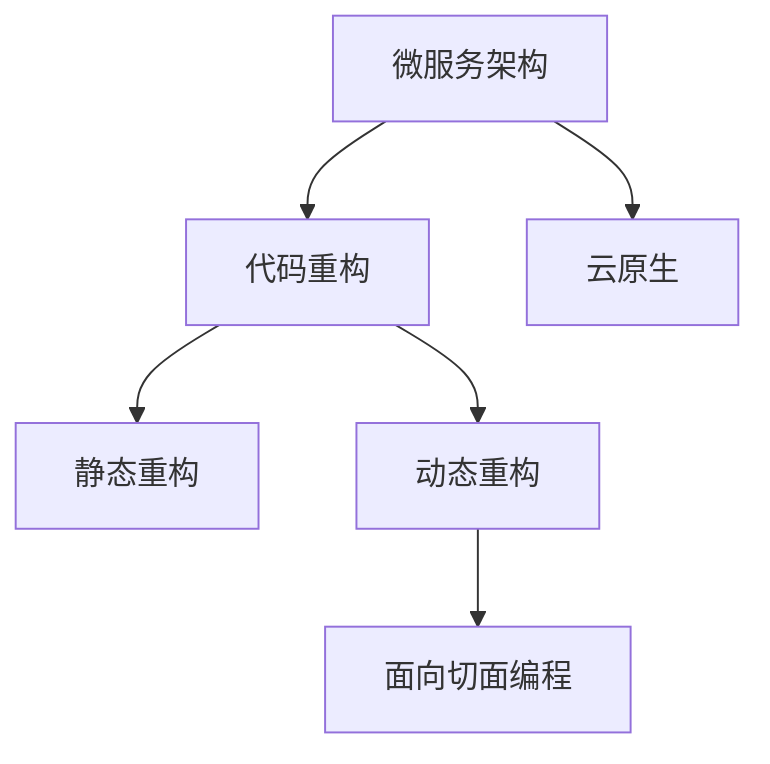

                 

## 1. 背景介绍

在软件工程领域，代码重构（Code Refactoring）一直是一个核心话题，它不仅影响代码的可读性、可维护性和性能，更关系项目的长期发展和成功。传统的代码重构主要聚焦于静态代码结构的优化，包括命名规范、结构调整、类重构等。然而，随着技术的发展，尤其是面向服务的架构（SOA）和微服务的普及，代码重构的需求和形式发生了显著变化。本文聚焦于在软件2.0时代，即微服务架构和云原生背景下，代码重构的新趋势、新挑战和新方法。

## 2. 核心概念与联系

### 2.1 核心概念概述

- **微服务架构**：将单体应用拆分为一组服务单元，每个服务负责独立功能，并通过网络协议通信，促进应用程序的可扩展性和灵活性。
- **云原生**：包括容器化、微服务、自动化部署、持续集成/持续部署（CI/CD）、声明式API、基于资源的计算等理念和技术。
- **代码重构**：通过修改代码结构、方法和设计，以提高代码质量、减少复杂性、增强可读性和可维护性的过程。
- **动态代码重构**：在运行时动态调整代码逻辑，增强代码适应性和响应能力。
- **面向切面编程（AOP）**：通过在横切关注点（如日志、事务、安全等）上编写代码，分离代码的横切逻辑，提高模块化程度。

这些核心概念之间的逻辑关系可以通过以下Mermaid流程图来展示：



这个流程图展示了一些核心概念之间的联系：

1. 微服务架构通过将应用程序拆分为服务单元，每个服务可以独立重构。
2. 云原生提供了容器化、微服务、CI/CD等技术支撑，为代码重构提供环境支持。
3. 静态代码重构关注代码结构的优化，如命名规范、结构调整、类重构等。
4. 动态代码重构在运行时调整代码逻辑，增强代码适应性和响应能力。
5. 面向切面编程通过在横切关注点上编写代码，分离横切逻辑，提高模块化程度。

## 3. 核心算法原理 & 具体操作步骤

### 3.1 算法原理概述

在微服务架构和云原生背景下，代码重构的目标是通过优化和调整服务组件的内部逻辑、接口调用关系和外部依赖，提升系统的可扩展性、可维护性和性能。因此，重构算法需要考虑多维度因素，包括代码可读性、模块化程度、服务解耦、性能优化等。

静态代码重构主要依赖于静态分析工具和代码审查流程，通过手动或自动化的方式识别代码中的问题，并进行相应调整。动态代码重构则需要在运行时根据业务需求或环境变化动态调整代码逻辑，常用于增强系统的响应性和自适应能力。面向切面编程则通过将横切关注点与业务逻辑分离，提高代码的模块化程度和复用性。

### 3.2 算法步骤详解

静态代码重构的主要步骤如下：

1. **需求分析**：识别代码中的问题，如代码复杂度、命名规范、结构冗余等。
2. **工具支持**：使用静态分析工具（如SonarQube、PMD、Checkstyle等）辅助识别代码问题。
3. **代码审查**：通过代码审查（Code Review）和持续集成（CI）流程，确保重构的代码质量。
4. **自动化重构**：使用代码重构工具（如IntelliJ IDEA、SonarQube插件等）辅助自动化重构。

动态代码重构主要步骤如下：

1. **环境监控**：实时监控系统运行状态和业务变化。
2. **重构决策**：根据监控结果和业务需求，动态决策是否需要重构代码。
3. **动态调整**：使用AOP框架（如Spring AOP）动态调整代码逻辑。
4. **性能测试**：重构后进行性能测试，确保系统性能不受影响。

面向切面编程的步骤如下：

1. **识别切面**：识别应用程序中的横切关注点，如日志、事务、安全等。
2. **编写切面**：编写切面代码，定义横切逻辑。
3. **应用切面**：将切面应用到需要关注的组件上，实现横切关注点的分离。
4. **监控和优化**：实时监控切面的性能，根据监控结果进行优化调整。

### 3.3 算法优缺点

静态代码重构的优点包括：

- 可预见性强：静态重构可以在开发早期发现并解决代码问题，减少后续维护成本。
- 成本较低：相对于动态重构，静态重构所需的资源和时间成本较低。

缺点包括：

- 难以覆盖所有问题：静态重构难以全面覆盖代码中的所有问题，特别是在复杂系统中。
- 开发时间延长：重构过程中需要反复审查和测试，影响开发速度。

动态代码重构的优点包括：

- 实时适应：动态重构能够实时适应业务需求和环境变化，增强系统灵活性。
- 减少开发时间：动态重构可以在运行时调整逻辑，减少开发和测试时间。

缺点包括：

- 性能风险：动态重构可能会影响系统性能，尤其是在大规模系统中。
- 不可预测性：动态重构的决策可能带来不可预测的副作用。

面向切面编程的优点包括：

- 模块化程度高：通过分离横切逻辑，提高代码模块化程度和复用性。
- 降低复杂性：减少代码中的冗余逻辑，降低系统复杂度。

缺点包括：

- 学习曲线陡峭：面向切面编程需要理解切面设计原理和实现方式，学习成本较高。
- 性能损失：过度使用切面可能导致性能损失，需要仔细权衡利弊。

### 3.4 算法应用领域

静态代码重构广泛应用于传统软件开发项目中，常用于提高代码质量和可维护性。例如，对于代码结构复杂、命名不规范的项目，可以通过静态重构改善代码结构，提升代码可读性。

动态代码重构常用于需要实时响应业务变化和环境变化的场景，如在线金融系统、实时数据处理系统等。通过动态重构，系统可以更加灵活地应对变化，增强系统的适应性。

面向切面编程常用于大型系统的架构设计和模块化开发。例如，对于分布式系统中的日志记录、事务管理、安全防护等功能，可以通过切面编程实现横切逻辑的分离，提高系统的模块化和可维护性。

## 4. 数学模型和公式 & 详细讲解 & 举例说明

### 4.1 数学模型构建

在代码重构中，数学模型主要用于描述代码质量、复杂度和性能等方面的量化指标。常见的模型包括：

1. **代码复杂度模型**：用于量化代码的复杂度和可维护性，如McCabe复杂度、Cyclomatic Complexity等。
2. **性能模型**：用于量化代码的性能指标，如响应时间、吞吐量等。

### 4.2 公式推导过程

以McCabe复杂度为例，其公式为：

$$
C = \text{number of decision points} + \text{number of branches} - \text{number of paths}
$$

其中，`number of decision points`表示决策点的数量，`number of branches`表示分支的数量，`number of paths`表示路径的数量。通过计算McCabe复杂度，可以评估代码的复杂度，指导代码重构。

### 4.3 案例分析与讲解

假设某段代码的McCabe复杂度为10，决策点有5个，分支有10个，路径有3个。根据公式计算：

$$
C = 5 + 10 - 3 = 12
$$

该代码的复杂度为12，需要进一步简化决策点和分支，以降低代码复杂度。

## 5. 项目实践：代码实例和详细解释说明

### 5.1 开发环境搭建

为了进行代码重构，需要搭建一个开发环境。以下是使用Java和Spring Boot进行代码重构的开发环境配置流程：

1. 安装JDK：从官网下载并安装JDK。
2. 安装Maven：从官网下载并安装Maven。
3. 配置Spring Boot：使用Spring Initializr生成Spring Boot项目。
4. 配置CI/CD：使用Jenkins或GitHub Actions配置持续集成流程。
5. 配置静态分析工具：使用SonarQube或Checkstyle配置静态分析工具。

### 5.2 源代码详细实现

下面以静态重构为例，提供一个Java代码的示例：

```java
public class MyService {
    public String myMethod(String input) {
        String result = null;
        try {
            // 业务逻辑处理
            result = "result";
        } catch (Exception e) {
            // 异常处理
            result = "error";
        }
        return result;
    }
}
```

静态重构后的代码可能如下：

```java
public class MyService {
    public String myMethod(String input) {
        return myHelper(input);
    }
    
    private String myHelper(String input) {
        String result = null;
        try {
            // 业务逻辑处理
            result = "result";
        } catch (Exception e) {
            // 异常处理
            result = "error";
        }
        return result;
    }
}
```

### 5.3 代码解读与分析

在上述代码重构中，将业务逻辑分离到了一个私有方法`myHelper`中，提高了代码的可读性和可维护性。

## 6. 实际应用场景

### 6.1 系统架构调整

在微服务架构下，系统架构的调整可以通过代码重构实现。例如，将一个单体应用拆分为多个微服务，每个微服务负责独立的业务逻辑和数据存储。通过静态重构，优化服务之间的接口调用关系，减少依赖，提高系统的可扩展性和可维护性。

### 6.2 性能优化

在云原生背景下，性能优化可以通过动态代码重构实现。例如，对性能瓶颈进行识别，动态调整代码逻辑以提升系统性能。在Kubernetes环境中，可以使用容器化技术动态扩展服务实例，以应对高并发请求。

### 6.3 异常处理优化

面向切面编程可以用于优化异常处理逻辑。例如，将异常处理逻辑从每个业务方法中分离出来，编写通用的异常处理器，增强异常处理的可复用性和一致性。

## 7. 工具和资源推荐

### 7.1 学习资源推荐

- **《重构：改善既有代码的设计》**：Martin Fowler的经典著作，详细介绍重构的基本概念、方法和实践。
- **《Effective Java》**：由Joshua Bloch撰写，提供Java编程中的最佳实践，包括代码重构。
- **《Spring Boot实战》**：通过实战项目，介绍Spring Boot的开发和使用，包括代码重构。
- **《微服务设计模式》**：讲解微服务架构下的设计模式和最佳实践，包括代码重构。

### 7.2 开发工具推荐

- **IntelliJ IDEA**：Java开发首选IDE，提供丰富的代码重构功能。
- **SonarQube**：静态分析工具，用于代码质量评估和代码重构。
- **GitHub Actions**：持续集成/持续部署工具，支持动态代码重构。
- **Spring Boot**：Java开发框架，支持微服务架构和面向切面编程。

### 7.3 相关论文推荐

- **"Refactoring: Improving the Design of Existing Code"*：Martin Fowler，详细介绍代码重构的理论和方法。
- **"Aspect-Oriented Programming"*：Gregor Kiczales，介绍面向切面编程的基本概念和设计。
- **"Microservices: A Microservices Architecture Guide"*：Sam Newman，介绍微服务架构的原理和设计。

## 8. 总结：未来发展趋势与挑战

### 8.1 总结

本文对基于微服务架构和云原生背景下的代码重构方法进行了系统介绍。通过静态重构、动态重构和面向切面编程，系统全面地展示了代码重构的理论、方法和实践。通过实践案例，进一步验证了代码重构的可行性和效果。

### 8.2 未来发展趋势

展望未来，代码重构将呈现以下几个发展趋势：

1. **自动化和智能化**：随着AI技术的发展，代码重构将更加自动化和智能化，减少手动操作，提高效率和精度。
2. **模型驱动**：通过机器学习和数据驱动的方式，自动化评估和优化代码质量，实现更加精准的重构决策。
3. **平台化**：代码重构工具和平台将更加集成化，提供一站式的重构解决方案。
4. **跨语言支持**：代码重构工具将支持多种编程语言，提高开发效率和重构效果。

### 8.3 面临的挑战

尽管代码重构已经取得显著成效，但仍然面临以下挑战：

1. **复杂系统重构**：大型系统的代码重构复杂度高，涉及多方面协同，难以全面覆盖。
2. **技术栈差异**：不同技术栈之间的代码重构难度大，需要跨栈技术支持。
3. **性能影响**：动态重构可能带来性能影响，需要仔细权衡。
4. **数据驱动不足**：代码重构缺乏数据驱动，难以量化重构效果。

### 8.4 研究展望

未来的研究需要重点关注以下几个方向：

1. **自动重构工具**：开发更加智能化的自动重构工具，支持大规模、高复杂度系统的代码重构。
2. **数据驱动重构**：通过数据分析和机器学习，指导重构决策，提高重构效率和精度。
3. **跨技术栈重构**：研究跨技术栈的代码重构方法，提高跨技术栈系统的开发效率和重构效果。
4. **性能优化**：在重构过程中考虑性能优化，减少对系统性能的负面影响。

## 9. 附录：常见问题与解答

**Q1：什么是代码重构？**

A: 代码重构是指通过修改代码结构、方法和设计，以提高代码质量、减少复杂性、增强可读性和可维护性的过程。

**Q2：代码重构有哪些主要类型？**

A: 主要分为静态重构、动态重构和面向切面编程。

**Q3：代码重构的优缺点有哪些？**

A: 优点包括提高代码质量和可维护性、降低后续开发和维护成本等。缺点包括可能延长开发时间、复杂系统重构难度大等。

**Q4：如何进行静态代码重构？**

A: 需求分析、使用静态分析工具、代码审查和自动化重构等步骤。

**Q5：如何进行动态代码重构？**

A: 环境监控、重构决策、动态调整和性能测试等步骤。

**Q6：如何进行面向切面编程？**

A: 识别切面、编写切面、应用切面和监控优化等步骤。

---

作者：禅与计算机程序设计艺术 / Zen and the Art of Computer Programming

