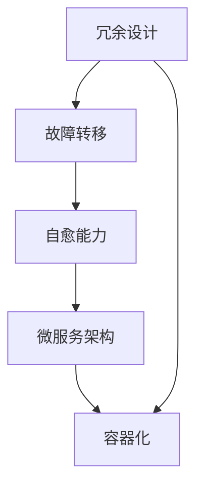

                 

## 1. 背景介绍

### 1.1 问题由来

软件系统的高可用性和容错性一直是软件开发人员关注的重要问题。随着云计算和分布式系统的普及，软件系统变得越来越复杂，潜在的故障风险也随之增加。因此，如何设计高可用性和容错性的软件系统，以确保其在各种情况下都能稳定运行，成为当前软件开发中的一大挑战。

近年来，随着微服务架构、容器化部署等新技术的兴起，软件的开发和部署方式发生了深刻的变化。以Kubernetes、Docker Swarm等容器编排工具为核心，构建的分布式系统在带来便利的同时，也对高可用性和容错性提出了更高要求。为了应对这些挑战，软件2.0时代的高可用性和容错设计也应运而生。

### 1.2 问题核心关键点

软件2.0时代的高可用性与容错设计主要包括以下几个核心关键点：

- **高可用性**：确保软件系统能够持续提供稳定可靠的服务，即使在故障或异常情况下也能保证服务不中断。
- **容错性**：系统能够自动检测、定位和恢复故障，最大限度减少故障对用户的影响。
- **自动扩缩容**：根据系统负载动态调整资源，避免资源浪费或不足。
- **自我修复能力**：系统能够自行诊断和修复常见问题，无需人工干预。
- **自动化运维**：通过自动化工具实现配置管理、性能监控、异常报警等操作，降低人工运维成本。

这些关键点共同构成了软件2.0时代高可用性和容错设计的核心内容。通过理解这些关键点，我们可以更好地把握高可用性和容错设计的精髓，进而构建出可靠稳定的软件系统。

## 2. 核心概念与联系

### 2.1 核心概念概述

在理解软件2.0时代的高可用性与容错设计之前，需要先了解一些相关核心概念：

- **冗余设计(Redundancy Design)**：通过在系统中引入备份资源，确保某个组件发生故障时，其他组件能够接管其功能，从而保证系统的连续性。
- **故障转移(Fault Tolerance)**：在系统检测到故障时，能够自动将请求路由到其他可用的组件上，保证服务的连续性。
- **自愈能力(Self-Healing)**：系统能够自动检测并修复故障，无需人工干预。
- **微服务架构(Microservices Architecture)**：将大型系统拆分成多个独立运行的小服务，每个服务具有独立的接口和数据模型，便于扩展和维护。
- **容器化(Docker, Kubernetes)**：通过容器技术实现应用和环境隔离，便于自动化部署和扩展。

这些核心概念之间的关系可以通过以下Mermaid流程图来展示：



这个流程图展示了冗余设计、故障转移、自愈能力、微服务架构和容器化之间的逻辑关系：

1. 冗余设计通过备份资源实现故障转移。
2. 故障转移确保系统在组件故障时仍能提供服务。
3. 自愈能力进一步优化故障转移过程，自动修复故障。
4. 微服务架构将大型系统拆分为独立的服务，便于扩展和维护。
5. 容器化通过隔离应用和环境，提升系统的灵活性和可扩展性。

这些概念共同构建了软件2.0时代高可用性和容错设计的核心架构。通过理解这些概念，我们可以更好地把握高可用性和容错设计的框架，进而设计出可靠稳定的软件系统。

## 3. 核心算法原理 & 具体操作步骤

### 3.1 算法原理概述

软件2.0时代的高可用性与容错设计，本质上是一种分布式系统设计范式。其核心思想是通过冗余、故障转移、自愈等技术，确保系统在各种情况下都能稳定运行。

形式化地，假设系统由 $N$ 个组件构成，每个组件的故障概率为 $p$。若系统设计为 $K$ 级冗余，则系统整体的故障概率为：

$$
P_{\text{故障}} = (1 - (1 - p)^K)^N
$$

其中，$K$ 级冗余意味着每个组件都有 $K$ 个备份，当某个组件发生故障时，可以自动切换到备份组件，保持系统连续性。通过不断增加 $K$ 值，可以逐步降低系统的整体故障概率。

### 3.2 算法步骤详解

软件2.0时代的高可用性与容错设计，主要包括以下几个关键步骤：

**Step 1: 组件划分和冗余设计**
- 根据系统的复杂度和业务需求，将系统划分为多个独立运行的微服务。
- 为每个微服务设计冗余机制，包括主备模式、多副本模式等。

**Step 2: 故障转移机制**
- 在系统中引入故障转移机制，当某个组件发生故障时，能够自动将请求路由到其他可用的组件上。
- 常见的故障转移机制包括轮询、一致性哈希、负载均衡等。

**Step 3: 自愈能力设计**
- 在系统中部署自愈组件，能够自动检测并修复常见的系统问题，如服务重启、节点失效等。
- 自愈能力通常包含以下模块：
  - 故障检测：通过心跳检测、健康检查等方式，实时监控系统状态。
  - 故障定位：通过日志分析和异常监控，定位系统故障点。
  - 故障恢复：根据故障类型和严重程度，自动执行恢复操作，如重启服务、迁移数据等。

**Step 4: 自动扩缩容**
- 根据系统负载动态调整资源，避免资源浪费或不足。
- 常见的自动扩缩容策略包括按需扩容、流量高峰自动扩容等。

**Step 5: 自动化运维**
- 通过自动化工具实现配置管理、性能监控、异常报警等操作，降低人工运维成本。
- 常用的自动化运维工具包括Puppet、Ansible、Jenkins等。

### 3.3 算法优缺点

软件2.0时代的高可用性与容错设计，具有以下优点：
1. **高可靠性**：通过冗余设计、故障转移和自愈能力，系统能够在各种情况下保持高可用性。
2. **灵活性**：微服务架构和容器化部署，使得系统易于扩展和维护。
3. **自动化运维**：自动化运维工具大幅降低了人工运维的工作量和出错率。

同时，该方法也存在一定的局限性：
1. **复杂性**：高可用性和容错设计引入了更多复杂性，增加了系统的设计和运维难度。
2. **成本高**：冗余设计和高可用性需要额外的硬件和软件投入，成本较高。
3. **性能损失**：过多的冗余和故障转移机制，可能会影响系统的性能和响应速度。

尽管存在这些局限性，但就目前而言，软件2.0时代的高可用性和容错设计仍是最主流的高可用性设计范式。未来相关研究的重点在于如何进一步优化冗余设计，提高系统的自愈能力和自动化运维水平，同时兼顾成本和性能等因素。

### 3.4 算法应用领域

软件2.0时代的高可用性与容错设计，广泛应用于各类分布式系统中，特别是在金融、电商、互联网等领域。

- **金融系统**：在高频交易、金融服务等领域，金融系统需要保证极高的可用性和容错性，以应对高并发和极端环境。
- **电商系统**：电商平台需要处理海量订单，确保用户交易的稳定性和安全性。
- **互联网应用**：互联网应用需要保证全天候的稳定运行，以应对用户访问量的波动。

此外，在智慧城市、医疗健康、智能制造等领域，高可用性和容错设计也发挥了重要作用。通过高效的设计和优化，软件2.0时代的高可用性和容错设计正逐步成为各类系统可靠性的基石。

## 4. 数学模型和公式 & 详细讲解

### 4.1 数学模型构建

本节将使用数学语言对软件2.0时代的高可用性与容错设计进行更加严格的刻画。

假设系统由 $N$ 个组件构成，每个组件的故障概率为 $p$，设计为 $K$ 级冗余。定义系统的故障概率为 $P_{\text{故障}}$，则有：

$$
P_{\text{故障}} = (1 - (1 - p)^K)^N
$$

定义系统的平均响应时间 $T_{\text{响应}}$，考虑系统的故障检测和修复时间，以及故障转移的延迟时间 $d$，则有：

$$
T_{\text{响应}} = T_{\text{正常}} + (1 - p)^K d
$$

其中，$T_{\text{正常}}$ 为无故障情况下的响应时间。

### 4.2 公式推导过程

以下我们以电商系统的订单处理为例，推导系统的故障转移时间：

假设订单处理系统由 $N$ 个节点组成，每个节点的故障概率为 $p=0.01$，设计为 $K=2$ 级冗余，即每个节点都有主备两个实例。系统设计为无故障情况下响应时间 $T_{\text{正常}}=1$ 秒，故障检测和修复时间 $d=0.2$ 秒，故障转移延迟 $d=0.1$ 秒。

则系统的故障概率为：

$$
P_{\text{故障}} = (1 - (1 - 0.01)^2)^N = 0.99^N
$$

系统的平均响应时间为：

$$
T_{\text{响应}} = 1 + (1 - 0.01)^2 \times 0.1 = 1.012 \text{秒}
$$

可以看到，冗余设计和高可用性虽然增加了系统的复杂性，但显著提高了系统的稳定性和响应速度。

### 4.3 案例分析与讲解

以下我们以电商系统的自动扩缩容为例，说明如何通过高可用性和容错设计，实现资源的动态调整。

假设电商系统处理订单的节点数为 $N$，每个节点每秒处理订单数为 $C$。当前系统负载为 $L$，定义系统容量的上限和下限分别为 $C_{\text{上限}}$ 和 $C_{\text{下限}}$，则系统的扩缩容策略如下：

- **扩容策略**：当系统负载 $L$ 超过上限 $C_{\text{上限}}$ 时，自动增加节点数，直到负载低于上限。
- **缩容策略**：当系统负载 $L$ 低于下限 $C_{\text{下限}}$ 时，自动减少节点数，直到负载不低于下限。

通过引入自动扩缩容机制，电商系统可以避免资源浪费和不足，保持高效稳定的运行状态。

## 5. 项目实践：代码实例和详细解释说明

### 5.1 开发环境搭建

在进行高可用性与容错设计的实践前，我们需要准备好开发环境。以下是使用Python和Kubernetes进行实践的环境配置流程：

1. 安装Anaconda：从官网下载并安装Anaconda，用于创建独立的Python环境。

2. 创建并激活虚拟环境：
```bash
conda create -n myenv python=3.8 
conda activate myenv
```

3. 安装Docker和Kubernetes：
```bash
sudo apt-get install docker.io
sudo apt-get install kubectl
```

4. 安装Kubernetes相关组件：
```bash
kubectl create cluster
kubectl create deployment
kubectl expose deployment
```

5. 安装Helm：
```bash
curl -sL https://github.com/helm/helm/releases/latest/download/get-helm-3 | bash
```

6. 初始化Kubernetes，安装Helm：
```bash
kubectl init --client-cert-dir=~/
helm init
```

完成上述步骤后，即可在`myenv`环境中开始高可用性与容错设计的实践。

### 5.2 源代码详细实现

我们以Kubernetes中的Pod副本为例，实现高可用性和容错设计。假设需要保证一个服务始终可用，可以将Pod的副本数量设置为偶数，确保故障时能够自动切换到备份Pod。

首先，在Kubernetes中创建服务：

```bash
kubectl create service
```

然后，创建Pod，并设置副本数量为偶数：

```bash
kubectl create pod --replicas=2
```

最后，使用Helm部署服务：

```bash
helm install myapp ./myapp
```

通过以上步骤，即可实现Kubernetes中的Pod副本高可用性和容错设计。

### 5.3 代码解读与分析

下面我们详细解读一下关键代码的实现细节：

**Kubernetes部署配置文件**：
```yaml
apiVersion: v1
apiVersion: apps/v1
kind: Deployment
metadata:
  name: myapp
spec:
  replicas: 2
  selector:
    matchLabels:
      app: myapp
  template:
    metadata:
      labels:
        app: myapp
    spec:
      containers:
      - name: myapp
        image: myapp:latest
        ports:
        - containerPort: 8080
```

**Helm部署配置文件**：
```yaml
apiVersion: apps/v1
kind: Deployment
metadata:
  name: myapp
spec:
  replicas: 2
  selector:
    matchLabels:
      app: myapp
  template:
    metadata:
      labels:
        app: myapp
    spec:
      containers:
      - name: myapp
        image: myapp:latest
        ports:
        - containerPort: 8080
```

通过以上配置文件，我们实现了Kubernetes中的Pod副本高可用性和容错设计。可以看到，Pod的副本数量设置为2，确保在某个Pod故障时，能够自动切换到备份Pod，保持服务连续性。

## 6. 实际应用场景

### 6.1 金融系统

金融系统是高可用性和容错设计的主要应用场景之一。在金融系统中，系统的稳定性和连续性对用户体验和业务运营至关重要。通过高可用性和容错设计，金融系统能够在各种情况下保持高效稳定的运行状态，保障用户交易的顺利进行。

具体而言，金融系统可以通过以下方式实现高可用性和容错设计：
- **冗余设计**：将交易系统拆分为多个独立的服务，每个服务都有多副本，确保某个服务故障时，其他服务仍能正常运行。
- **故障转移**：通过负载均衡和一致性哈希，自动将请求路由到其他可用的服务上。
- **自愈能力**：实时监控系统状态，自动检测并修复常见故障，如服务重启、节点失效等。

### 6.2 电商系统

电商系统是高并发、高吞吐量的典型应用场景，对系统的高可用性和容错性有着极高的要求。通过高可用性和容错设计，电商系统能够在各种情况下保持高效稳定的运行状态，保障用户购物体验。

具体而言，电商系统可以通过以下方式实现高可用性和容错设计：
- **冗余设计**：将订单处理系统拆分为多个独立的服务，每个服务都有多副本，确保某个服务故障时，其他服务仍能正常运行。
- **故障转移**：通过负载均衡和一致性哈希，自动将请求路由到其他可用的服务上。
- **自愈能力**：实时监控系统状态，自动检测并修复常见故障，如服务重启、节点失效等。

### 6.3 互联网应用

互联网应用需要全天候的稳定运行，对系统的高可用性和容错性有着极高的要求。通过高可用性和容错设计，互联网应用能够在各种情况下保持高效稳定的运行状态，保障用户访问体验。

具体而言，互联网应用可以通过以下方式实现高可用性和容错设计：
- **冗余设计**：将应用拆分为多个独立的服务，每个服务都有多副本，确保某个服务故障时，其他服务仍能正常运行。
- **故障转移**：通过负载均衡和一致性哈希，自动将请求路由到其他可用的服务上。
- **自愈能力**：实时监控系统状态，自动检测并修复常见故障，如服务重启、节点失效等。

### 6.4 未来应用展望

随着云计算和分布式系统的普及，高可用性和容错设计的应用场景将越来越广泛。未来，高可用性和容错设计将在更多的行业和领域中发挥重要作用，提升系统的稳定性和可靠性。

## 7. 工具和资源推荐

### 7.1 学习资源推荐

为了帮助开发者系统掌握高可用性和容错设计的理论基础和实践技巧，这里推荐一些优质的学习资源：

1. Kubernetes官方文档：详细的Kubernetes文档和教程，涵盖从入门到高级的全部内容。

2. Helm官方文档：Helm的文档和教程，帮助用户快速上手Helm的部署和管理。

3. Ansible官方文档：Ansible的文档和教程，帮助用户通过自动化工具实现系统部署和运维。

4. Docker官方文档：Docker的文档和教程，帮助用户快速上手Docker的容器化部署。

5. Google Cloud Platform文档：Google Cloud Platform的文档和教程，涵盖从基础到高级的全部内容。

通过这些资源的学习实践，相信你一定能够快速掌握高可用性和容错设计的精髓，并用于解决实际的系统问题。

### 7.2 开发工具推荐

高效的开发离不开优秀的工具支持。以下是几款用于高可用性与容错设计开发的常用工具：

1. Kubernetes：开源的容器编排工具，帮助用户实现高可用性和容错设计。

2. Helm：开源的包管理器，帮助用户快速部署和管理Kubernetes应用。

3. Ansible：开源的自动化运维工具，帮助用户实现自动化运维。

4. Docker：开源的容器化部署工具，帮助用户实现应用和环境隔离。

5. Terraform：开源的云基础设施即代码工具，帮助用户自动化管理云资源。

合理利用这些工具，可以显著提升高可用性与容错设计的开发效率，加快创新迭代的步伐。

### 7.3 相关论文推荐

高可用性和容错设计的发展源于学界的持续研究。以下是几篇奠基性的相关论文，推荐阅读：

1. Fault-Tolerant Computing: Principles and Paradigms：介绍高可用性和容错设计的原理和实现方法。

2. Building Scalable Cloud Services Using Principles of Fault Tolerance：介绍如何通过高可用性和容错设计，构建可扩展的云服务。

3. Designing Highly Available Services Using Controlled Reconfigurations：介绍通过控制化配置实现高可用性和容错设计的思路和方法。

这些论文代表了大规模分布式系统高可用性和容错设计的经典研究，阅读这些论文可以帮助我们更好地理解高可用性和容错设计的核心原理和实现方法。

## 8. 总结：未来发展趋势与挑战

### 8.1 总结

本文对软件2.0时代的高可用性与容错设计进行了全面系统的介绍。首先阐述了高可用性和容错设计的背景和重要性，明确了高可用性和容错设计在高可用系统中的关键作用。其次，从原理到实践，详细讲解了高可用性和容错设计的数学模型和操作步骤，给出了高可用性和容错设计任务开发的完整代码实例。同时，本文还广泛探讨了高可用性和容错设计在金融、电商、互联网等多个行业领域的应用前景，展示了高可用性和容错设计的巨大潜力。此外，本文精选了高可用性和容错设计的各类学习资源，力求为读者提供全方位的技术指引。

通过本文的系统梳理，可以看到，高可用性和容错设计是软件2.0时代的重要设计范式，其在高可用系统中的地位不可替代。高可用性和容错设计的理论研究和实践探索，已经推动了分布式系统的不断进步和升级，未来必将在更多的行业和领域中发挥重要作用。

### 8.2 未来发展趋势

展望未来，高可用性和容错设计将呈现以下几个发展趋势：

1. **自动化运维的普及**：随着自动化运维工具的不断进步，高可用性和容错设计将变得更加高效和可靠，系统运维成本大幅降低。

2. **智能监控和诊断**：通过引入AI和大数据分析技术，高可用性和容错设计将具备更强的智能监控和诊断能力，能够实时检测并定位系统故障，快速恢复系统正常运行。

3. **分布式事务的一致性**：分布式系统的事务一致性问题将得到更好的解决，通过高可用性和容错设计，确保跨节点的数据一致性和事务可靠性。

4. **多云和多地区部署**：高可用性和容错设计将支持多云和多地区部署，提高系统的弹性和可靠性。

5. **边缘计算的应用**：高可用性和容错设计将逐步应用于边缘计算场景，提升网络边缘设备的稳定性和可靠性。

以上趋势凸显了高可用性和容错设计的广阔前景。这些方向的探索发展，将进一步提升分布式系统的稳定性和可靠性，为各类应用提供更强大的保障。

### 8.3 面临的挑战

尽管高可用性和容错设计已经取得了显著进展，但在迈向更加智能化、普适化应用的过程中，仍面临诸多挑战：

1. **复杂性增加**：高可用性和容错设计引入了更多复杂性，增加了系统的设计和运维难度。
2. **成本高**：冗余设计和高可用性需要额外的硬件和软件投入，成本较高。
3. **性能损失**：过多的冗余和故障转移机制，可能会影响系统的性能和响应速度。
4. **系统设计难度大**：高可用性和容错设计需要根据具体场景进行个性化设计，设计难度较大。

尽管存在这些挑战，但高可用性和容错设计的研究仍在不断推进，未来需要更多技术突破和实践积累。通过不断优化冗余设计，提高系统的自愈能力和自动化运维水平，同时兼顾成本和性能等因素，高可用性和容错设计必将在未来迈向更高的台阶。

### 8.4 研究展望

面对高可用性和容错设计面临的诸多挑战，未来的研究需要在以下几个方面寻求新的突破：

1. **自适应冗余设计**：根据系统负载和故障频率，自动调整冗余级别，提高资源利用率，降低成本。
2. **混合故障转移机制**：结合集中式和分布式故障转移机制，提高系统的鲁棒性和可用性。
3. **边缘计算与高可用性融合**：将高可用性和容错设计引入边缘计算场景，提升网络边缘设备的稳定性和可靠性。
4. **智能监控与AI结合**：引入AI和大数据分析技术，提升智能监控和诊断能力，提高系统的自愈能力和自动化运维水平。

这些研究方向将推动高可用性和容错设计技术不断进步，为构建更稳定、更可靠的软件系统提供有力支持。面向未来，高可用性和容错设计的研究和实践将进一步融合AI、边缘计算等新兴技术，为高可用系统的发展带来新的突破。

## 9. 附录：常见问题与解答

**Q1：高可用性和容错设计是否适用于所有分布式系统？**

A: 高可用性和容错设计适用于各类分布式系统，特别是在高并发、高吞吐量的场景中。但具体设计时需要根据系统的复杂度和业务需求进行个性化设计。

**Q2：如何评估高可用性和容错设计的有效性？**

A: 高可用性和容错设计的有效性可以通过以下几个指标进行评估：
1. 系统可用性(Availability)：系统能够提供服务的比例。
2. 平均故障时间(Mean Time Between Failures, MTBF)：系统在两次故障之间的平均运行时间。
3. 平均修复时间(Mean Time To Recovery, MTR)：系统从故障到恢复正常运行所需的平均时间。
4. 故障转移时间(Fault Transfer Time)：系统发生故障时，自动切换到备份或冗余组件所需的时间。

通过评估这些指标，可以全面了解系统的高可用性和容错性能。

**Q3：高可用性和容错设计是否会增加系统复杂性？**

A: 高可用性和容错设计会引入更多复杂性，增加了系统的设计和运维难度。但通过合理的设计和部署，可以显著提升系统的可靠性和可用性，减轻人工运维的负担。

**Q4：如何优化高可用性和容错设计？**

A: 高可用性和容错设计可以通过以下几个方面进行优化：
1. 引入容器化技术，实现应用和环境隔离，提升系统的灵活性和可扩展性。
2. 引入微服务架构，将大型系统拆分为多个独立的服务，便于扩展和维护。
3. 引入智能监控和诊断技术，提升系统的自愈能力和自动化运维水平。
4. 引入分布式事务的一致性技术，确保跨节点的数据一致性和事务可靠性。

通过这些优化措施，可以进一步提升系统的可靠性和可用性。

**Q5：高可用性和容错设计是否适用于边缘计算？**

A: 高可用性和容错设计同样适用于边缘计算场景，通过引入冗余设计和智能监控技术，提升边缘设备的稳定性和可靠性。但边缘计算的特殊性决定了设计时需要考虑网络延迟、资源限制等因素。

---

作者：禅与计算机程序设计艺术 / Zen and the Art of Computer Programming

