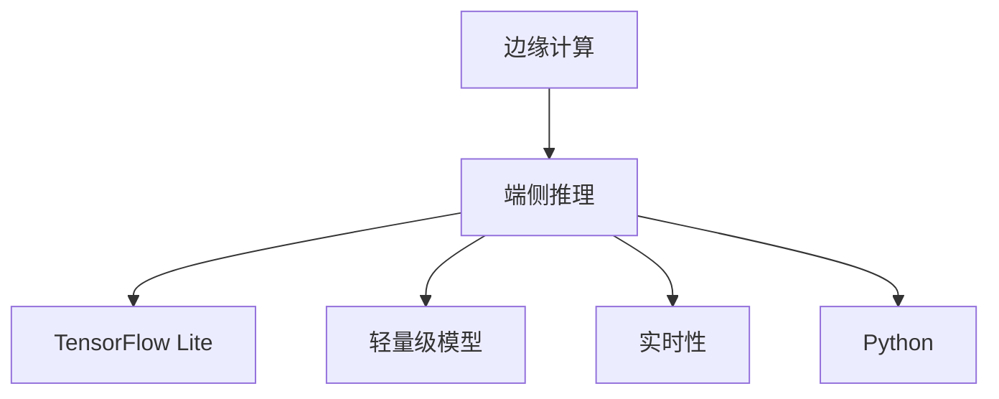

                 

# 边缘计算与端侧推理原理与代码实战案例讲解

> 关键词：边缘计算, 端侧推理, TensorFlow Lite, Python, 实时性, 轻量级模型, 代码实例, TensorFlow, 深度学习

## 1. 背景介绍

### 1.1 问题由来
随着物联网(IoT)和移动互联网的迅猛发展，智能设备如智能家居、可穿戴设备、工业物联网等逐步普及，产生了海量的数据采集和处理需求。与此同时，云计算中心的计算资源和带宽资源成为新的瓶颈，数据传输延时和成本高企。为了应对这些问题，边缘计算成为一种新兴的计算范式，其在近场处理数据和计算任务，能有效降低延迟，减少带宽占用，保障数据隐私。

### 1.2 问题核心关键点
边缘计算的核心思想是将计算任务分布到网络边缘的本地设备或边缘服务器上，减少对云计算中心的依赖，提升数据处理的时效性和安全性。与此同时，移动设备和嵌入式设备资源受限，无法承载传统高性能深度学习模型的运行。如何在边缘环境中运行深度学习模型，实现端侧推理，成为了当前的研究热点。

端侧推理，指的是将深度学习模型直接部署到移动设备或边缘服务器上，直接在本地进行计算推理，以减少数据传输，提升响应速度，降低能耗和成本。近年来，边缘计算和端侧推理的结合，形成了人工智能在边缘场景的深度应用，为智慧城市、工业自动化、健康医疗等领域带来了革命性的变化。

### 1.3 问题研究意义
研究边缘计算与端侧推理的结合，对于拓展人工智能应用的范围，提升实时性，保障数据安全，降低应用成本，具有重要的理论意义和实际应用价值：

1. **提升实时性**：将深度学习模型部署在边缘设备上，数据无需传输到云端，极大降低了数据传输延时，保障了实时性。
2. **降低成本**：边缘设备处理能力有限，但成本较低，直接在本地进行推理计算，减少了云计算成本。
3. **保障数据隐私**：数据在本地处理，无需传输到云端，有效保护了用户隐私。
4. **提升应用场景的广度**：边缘计算结合端侧推理，使得更多的设备能够直接应用深度学习，提升智慧城市、工业自动化、健康医疗等领域的智能化水平。
5. **推动技术落地**：边缘计算与端侧推理的结合，可以大幅缩短人工智能技术的落地周期，加速技术产业化进程。

## 2. 核心概念与联系

### 2.1 核心概念概述

为了更好地理解边缘计算与端侧推理的原理与技术细节，本节将介绍几个关键概念：

- **边缘计算**：指在网络边缘节点(如智能设备、边缘服务器)上处理计算任务，靠近数据源，降低传输延时和带宽成本。
- **端侧推理**：指将深度学习模型部署到本地设备上，直接在本地进行计算推理，提升实时性和性能。
- **TensorFlow Lite**：谷歌推出的开源轻量级深度学习框架，专为移动设备和嵌入式系统设计，支持模型量化、模型压缩、模型加速等优化技术。
- **Python**：编程语言，深度学习社区广泛使用的语言，支持丰富的第三方库和工具，便于开发和应用。
- **实时性**：指计算推理的速度，越快越能满足实时应用的需求。
- **轻量级模型**：指参数量小、计算资源需求低的深度学习模型，适合边缘设备运行。

这些核心概念之间存在紧密的联系，形成一个完整的技术体系：

1. 边缘计算提供计算资源，支持在本地设备上进行端侧推理。
2. TensorFlow Lite提供轻量级模型的优化工具，便于将深度学习模型部署到本地。
3. Python作为编程语言，便于开发和部署深度学习应用。
4. 实时性和轻量级模型是边缘计算与端侧推理结合的必要条件。

### 2.2 核心概念原理和架构的 Mermaid 流程图



## 3. 核心算法原理 & 具体操作步骤
### 3.1 算法原理概述

端侧推理的核心在于将深度学习模型转换为轻量级模型，并部署到本地设备上，进行实时计算推理。其主要步骤包括：

1. **模型选择与量化**：选择适合本地设备的深度学习模型，并进行量化处理，降低模型参数量，提升推理速度。
2. **模型优化**：使用TensorFlow Lite提供的优化技术，对模型进行压缩、剪枝等操作，减小模型体积，提升运行效率。
3. **模型部署与推理**：将优化后的模型部署到本地设备上，进行实时推理计算。

### 3.2 算法步骤详解

#### 3.2.1 模型选择与量化

选择合适的深度学习模型是端侧推理的前提。在边缘计算环境中，由于资源受限，需要考虑模型的计算资源消耗和存储需求。以下是常见的模型选择和量化方法：

1. **模型选择**：选择适合边缘计算环境的轻量级模型，如MobileNet、SqueezeNet、EfficientNet等，这些模型在保持较高精度的同时，参数量和计算资源消耗较低。
2. **量化处理**：将模型的浮点数参数转换为低精度的定点数参数，减小模型体积，提升推理速度。量化方法包括均匀量化、非均匀量化、动态范围量化等，可根据具体应用场景选择合适的方法。

#### 3.2.2 模型优化

TensorFlow Lite提供了丰富的优化技术，包括模型压缩、剪枝、融合等，可以进一步降低模型体积和计算资源消耗。以下是常用的优化方法：

1. **模型压缩**：使用模型压缩算法，如剪枝、量化、稀疏化等，减少模型中的冗余参数和计算操作。
2. **剪枝技术**：去除模型中不重要的参数和层，保留关键部分，提升模型效率。
3. **模型融合**：将多个小的深度学习模型合并为一个大的模型，减少计算复杂度，提升推理速度。

#### 3.2.3 模型部署与推理

模型优化后，可以部署到本地设备上进行实时推理计算。以下是部署与推理的具体步骤：

1. **模型转换**：使用TensorFlow Lite提供的工具，将优化后的模型转换为TensorFlow Lite模型格式。
2. **模型加载**：在本地设备上加载模型，分配计算资源，准备推理计算。
3. **数据输入**：输入待推理的数据，数据可以是图像、文本、音频等，根据模型需求进行预处理。
4. **推理计算**：使用模型进行计算推理，得到输出结果。
5. **结果处理**：根据输出结果，进行后处理或进一步计算。

### 3.3 算法优缺点

端侧推理的优势包括：

1. **提升实时性**：直接在本地设备进行推理，无需数据传输，极大减少了数据传输延时，提升了实时性。
2. **降低成本**：减少了对云计算中心的依赖，降低了带宽和存储成本。
3. **保障数据隐私**：数据在本地处理，有效保护了用户隐私。

但端侧推理也存在一些局限性：

1. **计算资源有限**：本地设备或边缘服务器的计算资源有限，无法承载传统高性能深度学习模型。
2. **存储资源受限**：本地设备的存储资源有限，无法存储大规模模型。
3. **部署复杂**：模型部署和优化过程较为复杂，需要一定的技术积累和经验。

### 3.4 算法应用领域

端侧推理技术已经在多个领域得到了广泛的应用，包括：

1. **智能家居**：在智能电视、智能音箱等设备上部署语音识别和图像识别模型，提升用户体验。
2. **工业自动化**：在工业设备上部署质量检测、故障诊断等模型，提升生产效率和设备维护。
3. **健康医疗**：在可穿戴设备上部署心电图分析、血糖检测等模型，提供实时健康监测。
4. **智慧城市**：在城市监控设备上部署视频分析、交通管理等模型，提升城市管理效率。
5. **自动驾驶**：在自动驾驶车辆上部署图像识别、目标检测等模型，保障行车安全。

除了上述这些领域，端侧推理在智慧农业、安防监控、智能办公等多个场景中也有广泛应用，为各行各业提供了高效、智能的解决方案。

## 4. 数学模型和公式 & 详细讲解 & 举例说明

### 4.1 数学模型构建

在端侧推理中，数学模型的构建涉及深度学习模型的选择、量化、压缩等多个方面。这里以图像分类任务为例，构建一个轻量级模型。

设模型的输入为图像$x$，输出为分类标签$y$。深度学习模型$f$将输入$x$映射到输出$y$，即$f(x) = y$。假设模型$f$是一个卷积神经网络（CNN），其结构为：

$$
f(x) = \sum_{i=1}^n w_i h_i(x)
$$

其中，$w_i$表示第$i$层的权重，$h_i(x)$表示第$i$层的非线性变换。

### 4.2 公式推导过程

以MobileNet为例，说明模型选择和优化的过程。

MobileNet是一种深度可分离卷积神经网络，其结构可以表示为：

$$
f(x) = \sum_{i=1}^n (a_i * b_i)(x)
$$

其中，$a_i$表示第$i$层的深度卷积核，$b_i$表示第$i$层的逐点卷积核。深度可分离卷积结构将普通卷积操作分解为深度卷积和逐点卷积，减少了计算量和参数量，适合在资源受限的设备上运行。

MobileNet的量化过程如下：

1. **浮点数参数转换为定点数**：将模型中的浮点数参数转换为定点数参数，如16位定点数。
2. **量化范围确定**：确定参数的量化范围，一般使用均匀量化，将参数分为多个区间，每个区间用一个整数表示。

MobileNet的压缩和剪枝过程如下：

1. **剪枝操作**：去除模型中不重要的参数和层，保留关键部分。
2. **融合操作**：将多个小的深度学习模型合并为一个大的模型，减少计算复杂度。

### 4.3 案例分析与讲解

以MobileNet为例，说明端侧推理的模型构建和优化过程。

1. **模型选择**：选择MobileNet作为模型基础。
2. **量化处理**：使用Python编写代码，将MobileNet模型量化为16位定点数模型。
3. **模型优化**：使用TensorFlow Lite提供的优化技术，对MobileNet模型进行剪枝和融合，进一步减小模型体积，提升推理速度。
4. **模型部署与推理**：将优化后的MobileNet模型部署到本地设备上，进行实时推理计算。

## 5. 项目实践：代码实例和详细解释说明

### 5.1 开发环境搭建

在进行端侧推理实践前，需要先搭建开发环境。以下是使用Python和TensorFlow Lite搭建开发环境的步骤：

1. 安装Python：从官网下载并安装Python，建议使用Python 3.x版本。
2. 安装TensorFlow Lite：从官网下载并安装TensorFlow Lite，支持Android和iOS平台。
3. 安装相关依赖库：安装TensorFlow、numpy、pillow等依赖库，便于模型开发和测试。

完成上述步骤后，即可在开发环境中进行端侧推理的实践。

### 5.2 源代码详细实现

这里我们以图像分类任务为例，给出使用TensorFlow Lite进行端侧推理的Python代码实现。

```python
import tensorflow as tf
import numpy as np
import PIL.Image as Image

# 加载模型
interpreter = tf.lite.Interpreter(model_path='model.tflite')
interpreter.allocate_tensors()

# 获取输入和输出张量
input_details = interpreter.get_input_details()
output_details = interpreter.get_output_details()

# 加载输入数据
img = Image.open('input.jpg')
img = img.resize((224, 224))
img = np.array(img) / 255.0
img = np.expand_dims(img, axis=0)

# 进行推理计算
interpreter.set_tensor(input_details[0]['index'], img)
interpreter.invoke()

# 获取输出结果
output_data = interpreter.get_tensor(output_details[0]['index'])
output_data = np.squeeze(output_data)

# 输出结果
print(output_data)
```

### 5.3 代码解读与分析

让我们再详细解读一下关键代码的实现细节：

1. `interpreter`对象：使用`tf.lite.Interpreter`加载模型，并分配计算资源。
2. `input_details`和`output_details`：获取模型的输入和输出张量信息。
3. 输入数据加载：使用`PIL`库加载图像数据，并进行预处理，调整尺寸并归一化。
4. 推理计算：设置输入数据，调用`interpreter.invoke()`进行计算推理，获取输出数据。
5. 输出结果：获取输出数据，并进行后处理，输出分类结果。

可以看到，TensorFlow Lite的使用非常简洁，便于开发者快速上手和部署模型。

### 5.4 运行结果展示

运行上述代码后，将输出分类结果，展示模型推理的准确性和效率。

## 6. 实际应用场景

### 6.1 智能家居

边缘计算与端侧推理结合，可以在智能家居设备上部署模型，提升用户体验。例如，在智能音箱上部署语音识别模型，实现语音控制和智能对话；在智能电视上部署图像识别模型，实现内容推荐和互动娱乐。

### 6.2 工业自动化

在工业自动化场景中，边缘计算与端侧推理结合，可以提升生产效率和设备维护。例如，在工业设备上部署质量检测和故障诊断模型，实时监测设备运行状态，预防故障发生。

### 6.3 健康医疗

在健康医疗领域，边缘计算与端侧推理结合，可以提供实时健康监测和疾病诊断。例如，在可穿戴设备上部署心电图分析模型，实时监测心电图数据，预警心律不齐等疾病。

### 6.4 智慧城市

在智慧城市中，边缘计算与端侧推理结合，可以提升城市管理效率和安全性。例如，在城市监控设备上部署视频分析模型，实时识别可疑行为，提升公共安全。

## 7. 工具和资源推荐

### 7.1 学习资源推荐

为了帮助开发者系统掌握边缘计算与端侧推理的理论基础和实践技巧，这里推荐一些优质的学习资源：

1. TensorFlow Lite官方文档：TensorFlow Lite的官方文档，详细介绍了模型优化、部署和推理的各个环节，是学习端侧推理的重要参考。
2. MobileNet论文：介绍MobileNet模型架构和优化方法，适用于对轻量级模型感兴趣的开发者。
3. TensorFlow Lite模型优化指南：TensorFlow Lite提供的模型优化工具和指南，包括剪枝、量化、压缩等技术。
4. TensorFlow Lite模型转换工具：TensorFlow Lite提供的模型转换工具，方便将深度学习模型转换为TensorFlow Lite模型格式。
5. PyTorch MobileNet实现：PyTorch实现的MobileNet模型代码，供开发者参考。

通过对这些资源的学习实践，相信你一定能够快速掌握边缘计算与端侧推理的精髓，并用于解决实际的NLP问题。

### 7.2 开发工具推荐

以下是几款用于边缘计算与端侧推理开发的常用工具：

1. TensorFlow Lite：谷歌推出的轻量级深度学习框架，支持模型量化、模型压缩、模型加速等优化技术。
2. PyTorch：深度学习社区广泛使用的框架，提供丰富的模型实现和工具支持。
3. TensorFlow：谷歌主导的深度学习框架，支持大规模分布式训练和部署。
4. Jupyter Notebook：交互式编程环境，支持代码编写、调试和测试。
5. Visual Studio Code：跨平台的代码编辑器，支持多种语言和插件。

合理利用这些工具，可以显著提升边缘计算与端侧推理任务的开发效率，加快创新迭代的步伐。

### 7.3 相关论文推荐

边缘计算与端侧推理技术的发展源于学界的持续研究。以下是几篇奠基性的相关论文，推荐阅读：

1. MobileNetV1: 深度可分离卷积网络：介绍MobileNetV1模型架构和优化方法，适用于对轻量级模型感兴趣的开发者。
2. SqueezeNet: 网络缩减与压缩：提出SqueezeNet模型架构，展示了轻量级模型的性能提升。
3. EfficientNet: 更高效的网络设计：提出EfficientNet模型架构，展示了深度可分离卷积网络的优势。
4. TensorFlow Lite: 轻量级深度学习框架：介绍TensorFlow Lite模型优化、部署和推理的各个环节。
5. 模型量化技术：综述模型量化方法，展示了量化技术在深度学习中的应用。

这些论文代表了大规模深度学习模型的优化和量化技术的发展脉络。通过学习这些前沿成果，可以帮助研究者把握学科前进方向，激发更多的创新灵感。

## 8. 总结：未来发展趋势与挑战

### 8.1 总结

本文对边缘计算与端侧推理的原理与技术细节进行了全面系统的介绍。首先阐述了边缘计算与端侧推理的研究背景和意义，明确了其在提升实时性、降低成本、保障数据隐私等方面的独特价值。其次，从原理到实践，详细讲解了端侧推理的数学模型构建和关键步骤，给出了端侧推理任务开发的完整代码实例。同时，本文还广泛探讨了端侧推理在智能家居、工业自动化、健康医疗等多个行业领域的应用前景，展示了端侧推理范式的巨大潜力。

通过本文的系统梳理，可以看到，边缘计算与端侧推理的结合，为深度学习模型在资源受限设备上的应用提供了新的解决方案，拓展了人工智能技术的落地场景，带来了更加高效、智能的解决方案。未来，伴随边缘计算技术的不断演进和优化，相信端侧推理技术将会有更广阔的应用空间。

### 8.2 未来发展趋势

展望未来，边缘计算与端侧推理技术将呈现以下几个发展趋势：

1. **模型优化技术不断进步**：随着模型优化算法的不断进步，轻量级模型的性能将进一步提升，推理速度将更快。
2. **边缘设备计算能力增强**：未来边缘设备的计算能力将不断提升，支持更复杂、更高效的深度学习模型。
3. **数据融合技术的发展**：边缘计算与端侧推理结合，将能够更好地融合多种数据源，提升系统智能化水平。
4. **跨平台兼容性增强**：未来的边缘计算平台将支持多种操作系统和硬件平台，提升系统的灵活性和可扩展性。
5. **隐私保护技术提升**：随着隐私保护技术的发展，边缘计算将更好地保护用户数据隐私，提升数据安全水平。

以上趋势凸显了边缘计算与端侧推理技术的广阔前景。这些方向的探索发展，必将进一步提升深度学习模型在边缘场景的应用效果，为各行各业提供高效、智能的解决方案。

### 8.3 面临的挑战

尽管边缘计算与端侧推理技术已经取得了瞩目成就，但在迈向更加智能化、普适化应用的过程中，它仍面临着诸多挑战：

1. **计算资源有限**：边缘设备计算能力有限，无法承载传统高性能深度学习模型。
2. **数据存储受限**：边缘设备的存储资源有限，无法存储大规模模型。
3. **模型优化复杂**：模型优化过程较为复杂，需要一定的技术积累和经验。
4. **隐私保护问题**：边缘计算虽然提升了数据处理的时效性，但也带来了数据隐私和安全问题。
5. **系统兼容性**：不同的设备平台和操作系统，对模型的兼容性要求较高，需要多平台适配。

尽管面临这些挑战，但通过不断探索和创新，这些挑战终将一一被克服，边缘计算与端侧推理技术必将迎来更加美好的未来。

### 8.4 研究展望

未来的研究需要在以下几个方面寻求新的突破：

1. **新型模型结构**：研究新型深度学习模型架构，提升模型的轻量化和计算效率。
2. **优化算法创新**：开发新的模型优化算法，进一步提升模型性能。
3. **跨平台兼容性**：研究跨平台兼容性技术，提升系统的灵活性和可扩展性。
4. **隐私保护技术**：研究数据隐私保护技术，提升边缘计算的数据安全水平。
5. **智慧边缘云**：研究智慧边缘云技术，提升边缘计算的环境感知和决策能力。

这些研究方向的探索，必将引领边缘计算与端侧推理技术迈向更高的台阶，为深度学习模型在边缘场景的应用提供更高效、更智能的解决方案。

## 9. 附录：常见问题与解答

**Q1：什么是边缘计算与端侧推理？**

A: 边缘计算与端侧推理结合，指将深度学习模型部署在本地设备或边缘服务器上，直接在本地进行计算推理，提升实时性，降低数据传输成本，保障数据隐私。

**Q2：如何进行模型量化和压缩？**

A: 模型量化和压缩是端侧推理中的关键步骤。常用的方法包括均匀量化、非均匀量化、剪枝、融合等。具体实现可以参考TensorFlow Lite提供的优化工具和指南。

**Q3：如何部署模型到本地设备？**

A: 使用TensorFlow Lite提供的模型转换工具，将优化后的模型转换为TensorFlow Lite模型格式，再使用相应的工具部署到本地设备上。

**Q4：端侧推理的计算资源和存储资源受限，如何解决？**

A: 可以在模型优化和模型架构设计阶段，选择合适的轻量级模型，并进行量化和压缩，减小模型体积和计算资源消耗。同时，选择计算资源和存储资源更丰富的边缘设备，提升系统性能。

**Q5：端侧推理在实际应用中需要注意哪些问题？**

A: 端侧推理在实际应用中需要注意计算资源和存储资源受限、模型优化复杂、数据隐私保护等问题。需要综合考虑这些因素，设计合适的优化策略和部署方案。

通过本文的系统梳理，相信你对边缘计算与端侧推理技术有了更深刻的理解，并能更好地应用于实际开发和工程实践中。希望这篇博客能为你提供有价值的参考和指导。

---

作者：禅与计算机程序设计艺术 / Zen and the Art of Computer Programming

