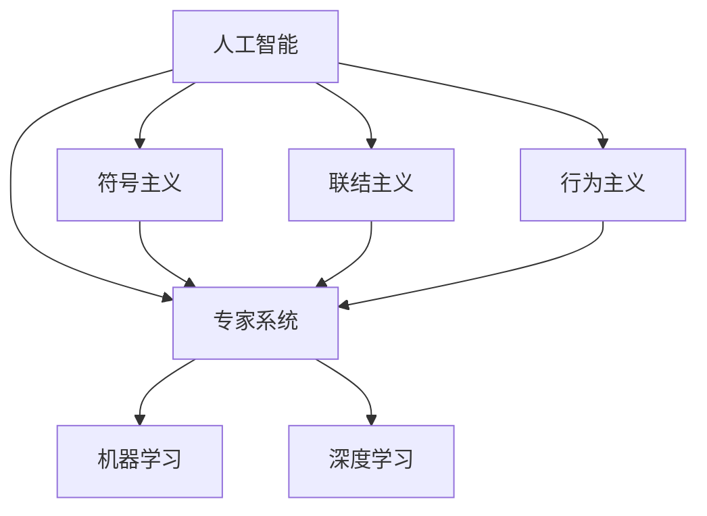

                 

## 1. 背景介绍

### 1.1 问题由来

1955年8月，一次划时代的会议在达特茅斯学院召开。这次会议不仅标志着人工智能(Artificial Intelligence, AI)一词的诞生，更汇聚了一批先驱性的科学家，奠定了AI技术的理论基础与实践方向。这些科学家们来自数学、计算机科学、心理学等多个学科，他们的集思广益促成了《达特茅斯会议报告》的出台，该报告中对AI的明确定义为：“研究如何让计算机模拟人类智能行为的科学”。自此，AI逐渐从概念走向实践，为人类社会的数字化转型开启了新篇章。

### 1.2 问题核心关键点

本次会议的核心议题包括：

- 定义AI的概念和目标：明确AI的研究对象与终极追求。
- 探讨AI的核心问题：诸如感知、推理、学习、自我改进等。
- 提出AI的技术路径：包括符号主义、联结主义、行为主义等。
- 建立AI的研究框架：诸如输入、处理、输出等基本步骤。
- 构建AI的实验室环境：如研究机构、教育体系、跨学科协作等。

这些核心议题不仅为后续AI技术的发展奠定了基础，更在科学界产生了深远影响。

## 2. 核心概念与联系

### 2.1 核心概念概述

为理解《达特茅斯会议报告》所奠定的AI理论框架，本节将介绍几个核心概念：

- 人工智能(Artificial Intelligence, AI)：通过计算机技术模仿人类智能行为的过程，包括感知、学习、推理等。
- 符号主义(Symbolism)：一种模拟人类思维逻辑的AI实现方式，使用符号表示知识，并通过推理规则进行计算。
- 联结主义(Connectivism)：以神经网络为基础，通过大量神经元间的连接模拟人脑的认知过程。
- 行为主义(Behaviorism)：通过观察和反馈训练模型，使其学会特定任务的行为，侧重实际应用。
- 专家系统(Expert System)：利用规则和知识库模拟专家决策过程，解决特定领域问题。
- 机器学习(Machine Learning)：让机器通过数据自适应学习，提升性能。
- 深度学习(Deep Learning)：在神经网络基础上，引入多层结构，处理更复杂的数据。

这些概念间的关系可以通过以下Mermaid流程图来展示：



这个流程图展示了AI技术的主要分支及其联系：

1. 人工智能（AI）是涵盖多个分支的总称。
2. 符号主义、联结主义和行为主义分别代表了早期的AI实现方式。
3. 专家系统利用规则和知识库，是AI在特定领域的典型应用。
4. 机器学习和深度学习则是现代AI的重要技术支撑。

## 3. 核心算法原理 & 具体操作步骤
### 3.1 算法原理概述

达特茅斯会议中，AI的许多核心算法原则已被奠定。以下是几个关键点：

- **符号主义**：利用符号表示知识，进行逻辑推理。常用算法包括Prolog等。
- **联结主义**：基于神经网络，学习输入输出映射关系。
- **行为主义**：通过反馈调节模型行为，常用算法如强化学习（Reinforcement Learning, RL）。
- **专家系统**：构建知识库，使用规则引擎进行决策。
- **机器学习**：通过算法使模型学习输入-输出映射关系，如线性回归、决策树、支持向量机等。
- **深度学习**：通过多层神经网络，处理复杂非线性关系，如卷积神经网络（CNN）、循环神经网络（RNN）等。

### 3.2 算法步骤详解

以深度学习为例，其核心步骤包括：

**Step 1: 准备数据集**
- 收集并预处理数据，如图像数据集、文本数据集等。
- 进行数据增强，扩充训练集。

**Step 2: 构建神经网络模型**
- 设计模型结构，如卷积层、池化层、全连接层等。
- 确定损失函数和优化器。

**Step 3: 训练模型**
- 使用梯度下降等算法更新模型参数。
- 进行反向传播计算梯度。
- 定期在验证集上评估模型性能。

**Step 4: 测试和部署**
- 在测试集上测试模型性能。
- 部署模型至实际应用系统。
- 定期更新模型以适应新数据。

### 3.3 算法优缺点

深度学习作为现代AI的核心算法，具备以下优点：

1. 强大的表征能力：多层神经网络能处理复杂非线性关系。
2. 高效的学习能力：利用梯度下降算法快速迭代优化。
3. 广泛的应用场景：图像、语音、文本等领域均有成功应用。

同时，深度学习也存在一些局限性：

1. 数据依赖性强：大量数据是训练模型的基础。
2. 模型复杂度高：参数量极大，计算成本高。
3. 可解释性差：模型黑箱特性，难以解释内部工作机制。
4. 泛化性能不稳定：对噪声和异常数据敏感。
5. 训练难度高：网络结构设计、超参数调优等需要大量经验。

### 3.4 算法应用领域

深度学习已广泛应用于以下领域：

1. **计算机视觉**：如图像分类、目标检测、人脸识别等。
2. **自然语言处理**：如文本分类、情感分析、机器翻译等。
3. **语音识别**：如语音合成、语音翻译等。
4. **推荐系统**：如电商推荐、新闻推荐等。
5. **智能控制**：如自动驾驶、机器人控制等。

## 4. 数学模型和公式 & 详细讲解 & 举例说明

### 4.1 数学模型构建

以卷积神经网络（CNN）为例，数学模型构建如下：

**输入**：$x \in \mathbb{R}^{m \times n \times d}$

**卷积层**：$y=f(\mathcal{W}*x+b)$

**池化层**：$z=g(\mathcal{M}*y)$

**全连接层**：$a=\mathcal{V}*y$

其中，$f$ 和 $g$ 分别表示激活函数，$\mathcal{W}$、$\mathcal{M}$ 和 $\mathcal{V}$ 分别表示卷积核、池化核和全连接层的权重。

### 4.2 公式推导过程

以卷积神经网络（CNN）为例，公式推导如下：

- **卷积层**：$y=f(\mathcal{W}*x+b)$

其中，$x$ 为输入图像，$\mathcal{W}$ 为卷积核，$b$ 为偏置项，$f$ 为激活函数。

- **池化层**：$z=g(\mathcal{M}*y)$

其中，$y$ 为卷积层输出，$\mathcal{M}$ 为池化核，$g$ 为激活函数。

- **全连接层**：$a=\mathcal{V}*y$

其中，$y$ 为池化层输出，$\mathcal{V}$ 为全连接层权重，$a$ 为最终输出。

### 4.3 案例分析与讲解

以图像分类任务为例，使用卷积神经网络（CNN）进行模型训练：

1. **准备数据集**：收集图像数据集，并进行数据增强。
2. **构建模型**：定义网络结构，如卷积层、池化层、全连接层等。
3. **训练模型**：使用随机梯度下降（SGD）算法，更新模型参数。
4. **测试模型**：在测试集上评估模型性能。

## 5. 项目实践：代码实例和详细解释说明
### 5.1 开发环境搭建

以下是使用Python和TensorFlow搭建CNN模型的环境配置流程：

1. 安装Anaconda：从官网下载并安装Anaconda，用于创建独立的Python环境。

2. 创建并激活虚拟环境：
```bash
conda create -n tf-env python=3.8 
conda activate tf-env
```

3. 安装TensorFlow：根据CUDA版本，从官网获取对应的安装命令。例如：
```bash
pip install tensorflow==2.3
```

4. 安装相关库：
```bash
pip install numpy scipy matplotlib pandas scikit-learn tf-estimator tensorflow-datasets tensorflow-hub tensorflow-addons
```

完成上述步骤后，即可在`tf-env`环境中开始模型训练。

### 5.2 源代码详细实现

以下是使用TensorFlow搭建并训练CNN模型的完整代码实现：

```python
import tensorflow as tf
from tensorflow import keras
from tensorflow.keras import layers

# 准备数据集
(x_train, y_train), (x_test, y_test) = keras.datasets.mnist.load_data()
x_train = x_train.reshape(x_train.shape[0], 28, 28, 1).astype('float32') / 255
x_test = x_test.reshape(x_test.shape[0], 28, 28, 1).astype('float32') / 255
y_train = keras.utils.to_categorical(y_train, 10)
y_test = keras.utils.to_categorical(y_test, 10)

# 定义模型结构
model = keras.Sequential(
    [
        layers.Conv2D(32, (3, 3), activation='relu', input_shape=(28, 28, 1)),
        layers.MaxPooling2D((2, 2)),
        layers.Flatten(),
        layers.Dense(10, activation='softmax')
    ])

# 编译模型
model.compile(optimizer='adam', loss='categorical_crossentropy', metrics=['accuracy'])

# 训练模型
model.fit(x_train, y_train, epochs=10, batch_size=32, validation_data=(x_test, y_test))

# 评估模型
model.evaluate(x_test, y_test)
```

### 5.3 代码解读与分析

让我们再详细解读一下关键代码的实现细节：

**数据准备**：
- 使用`keras.datasets.mnist.load_data`加载MNIST数据集，包含手写数字图片和对应标签。
- 对图像数据进行归一化处理。

**模型定义**：
- 使用`keras.Sequential`定义序列模型，包含卷积层、池化层和全连接层。
- 卷积层使用`Conv2D`，32个3x3的卷积核，激活函数为ReLU。
- 池化层使用`MaxPooling2D`，2x2的池化窗口。
- 全连接层使用`Dense`，10个神经元，激活函数为Softmax。

**模型编译**：
- 使用`model.compile`编译模型，指定优化器、损失函数和评估指标。

**模型训练**：
- 使用`model.fit`训练模型，指定训练集、标签、批次大小、迭代轮数和验证集。

**模型评估**：
- 使用`model.evaluate`评估模型性能，输出测试集上的准确率。

## 6. 实际应用场景
### 6.1 医疗影像诊断

深度学习在医疗影像诊断领域展现了巨大潜力。传统方法依靠放射科医生对图像进行手动分析，耗时长、成本高且准确率受人为因素影响较大。使用深度学习模型对医疗影像进行自动分析，能够快速识别出病变区域，提供精准诊断。

以肺结节检测为例，使用卷积神经网络（CNN）模型对肺部CT图像进行训练，自动标注出结节区域。训练好的模型可用于新病人的CT影像分析，提升诊断效率和准确率，减轻医生的工作负担。

### 6.2 自动驾驶

深度学习在自动驾驶领域的应用同样具有革命性意义。自动驾驶系统需要实时处理大量传感器数据，如摄像头、雷达、激光雷达等，并准确地做出驾驶决策。

使用卷积神经网络（CNN）和循环神经网络（RNN）等深度学习模型，对传感器数据进行处理，识别道路标志、车辆行人等目标，进行路径规划和避障决策。这种技术不仅提高了驾驶安全性，还降低了交通拥堵和事故率。

### 6.3 金融风险管理

深度学习在金融领域的应用，主要集中在风险管理和预测上。通过构建深度学习模型，可以对市场数据进行实时分析，预测股票价格、市场波动等。

以股票价格预测为例，使用LSTM（长短期记忆网络）模型对历史股价数据进行训练，预测未来股价走势。这种技术能够帮助投资者做出更准确的投资决策，降低投资风险。

### 6.4 未来应用展望

展望未来，深度学习的应用场景将进一步扩展：

1. **智能制造**：使用深度学习模型进行设备故障预测、质量控制等，提升生产效率。
2. **智慧城市**：利用深度学习对城市交通、环境、能源等数据进行分析，优化城市管理。
3. **个性化推荐**：使用深度学习模型进行用户行为分析，提供个性化推荐服务，如电商推荐、新闻推荐等。
4. **智能交互**：结合自然语言处理（NLP）技术，构建智能聊天机器人，提升客户服务体验。
5. **科学研究**：利用深度学习进行大数据分析、生物信息学等研究，加速科学进展。

## 7. 工具和资源推荐
### 7.1 学习资源推荐

为了帮助开发者系统掌握深度学习的基础知识和实践技巧，这里推荐一些优质的学习资源：

1. 《深度学习》（Ian Goodfellow、Yoshua Bengio、Aaron Courville著）：深度学习领域的经典教材，全面介绍了深度学习的基本原理和实践技巧。
2. 《Python深度学习》（Francois Chollet著）：Keras框架的作者所著，介绍了深度学习的基本概念和实践操作。
3. 《Deep Learning Specialization》（Andrew Ng教授）：Coursera平台的深度学习课程，系统讲解深度学习的基础理论和应用。
4. DeepLearning.AI课程（吴恩达教授）：提供深度学习入门到高级课程，涵盖模型构建、优化算法等。
5. TensorFlow官方文档：TensorFlow的官方文档，提供了丰富的示例和API指南，是深度学习开发者的必备资源。

通过对这些资源的学习实践，相信你一定能够快速掌握深度学习的基础知识和实践技巧，并用于解决实际的NLP问题。

### 7.2 开发工具推荐

高效的开发离不开优秀的工具支持。以下是几款用于深度学习开发常用的工具：

1. TensorFlow：由Google主导开发的深度学习框架，支持GPU/TPU算力，适合大规模工程应用。
2. PyTorch：Facebook开发的深度学习框架，灵活的动态计算图，适合快速迭代研究。
3. Keras：Google开发的高级深度学习API，提供了丰富的预训练模型和便捷的接口。
4. Jupyter Notebook：支持Python和TensorFlow等工具的交互式开发环境，方便快速实验和共享。
5. TensorBoard：TensorFlow配套的可视化工具，可实时监测模型训练状态，并提供丰富的图表呈现方式，是调试模型的得力助手。

合理利用这些工具，可以显著提升深度学习模型的开发效率，加快创新迭代的步伐。

### 7.3 相关论文推荐

深度学习作为当前AI领域的热门技术，相关研究也在不断进步。以下是几篇奠基性的相关论文，推荐阅读：

1. AlexNet：深度学习在图像分类任务上的突破性成果。
2. GoogleNet：提出Inception网络结构，提高深度学习模型的准确性和效率。
3. ResNet：解决深度网络退化问题，提高模型深度和精度。
4. VGGNet：提出VGG网络结构，提升深度学习模型的泛化能力。
5. LeNet：深度学习在手写数字识别任务上的经典案例。

这些论文展示了深度学习技术的发展脉络，帮助读者理解其背后的科学原理和技术细节。

## 8. 总结：未来发展趋势与挑战
### 8.1 总结

本文对达特茅斯会议所奠定的AI技术基础进行了全面系统的介绍。首先阐述了AI的核心概念和应用场景，明确了深度学习在AI中的核心地位。其次，从原理到实践，详细讲解了深度学习的数学模型和实现步骤，给出了深度学习任务开发的完整代码实例。同时，本文还广泛探讨了深度学习在医疗、自动驾驶、金融等多个领域的应用前景，展示了深度学习技术的广阔前景。最后，本文精选了深度学习技术的各类学习资源，力求为读者提供全方位的技术指引。

通过本文的系统梳理，可以看到，深度学习技术在AI领域已取得了重大进展，正在成为驱动AI技术发展的重要引擎。未来，伴随深度学习技术与其他AI技术的深度融合，AI将朝着更加智能化、普适化、自动化的方向发展，进一步推动人类社会的数字化转型。

### 8.2 未来发展趋势

展望未来，深度学习技术将呈现以下几个发展趋势：

1. **模型规模持续增大**：随着算力成本的下降和数据规模的扩张，深度学习模型的参数量还将持续增长，模型复杂度将进一步提高。
2. **多模态深度学习**：结合图像、语音、文本等多种模态数据，构建更为全面、准确的知识表示。
3. **自监督学习**：利用无监督学习获取更多数据，提升模型的泛化能力。
4. **迁移学习**：将已有模型在相关任务上进行微调，提升模型的迁移学习能力。
5. **对抗学习**：通过对抗样本训练，提高模型的鲁棒性和泛化性能。
6. **联邦学习**：多设备协同学习，保护隐私的同时提升模型性能。

这些趋势展示了深度学习技术的不断演进，未来将在更多领域得到应用，为人类社会的数字化转型带来新的变革。

### 8.3 面临的挑战

尽管深度学习技术已经取得了显著成就，但在其发展过程中仍面临诸多挑战：

1. **数据质量问题**：深度学习模型依赖大量高质量数据，数据采集、清洗、标注等环节存在巨大成本。
2. **模型复杂度高**：深度学习模型参数量极大，计算资源消耗高，训练时间长。
3. **可解释性差**：深度学习模型往往是黑盒系统，难以解释其内部工作机制和决策逻辑。
4. **泛化性能不稳定**：模型对噪声和异常数据敏感，鲁棒性不足。
5. **训练难度高**：网络结构设计、超参数调优等需要大量经验，难以标准化。

### 8.4 研究展望

面对深度学习技术所面临的挑战，未来的研究需要在以下几个方面寻求新的突破：

1. **数据增强**：利用数据扩增技术，提升训练数据的多样性和数量。
2. **模型压缩**：通过模型剪枝、量化等技术，减少模型参数量和计算量，提高模型效率。
3. **知识蒸馏**：通过知识蒸馏技术，将复杂模型的知识迁移到简单模型中，提高模型泛化性能。
4. **自适应学习**：开发自适应学习算法，提升模型对新数据和新任务的适应能力。
5. **可解释性增强**：引入可解释性技术，增强模型的透明度和可理解性。

这些研究方向将推动深度学习技术朝着更加智能化、可解释化、高效化的方向发展，为构建更全面、可靠、高效的人工智能系统铺平道路。

## 9. 附录：常见问题与解答

**Q1：深度学习模型是否适用于所有数据集？**

A: 深度学习模型适用于复杂、高维、非线性的数据集，但对于结构简单、线性关系强的数据集，可能过度拟合，不如传统机器学习模型。因此，选择合适的模型需要根据数据特点进行选择。

**Q2：如何提高深度学习模型的泛化性能？**

A: 提高泛化性能的关键在于：
1. 数据增强：利用数据扩增技术，提升训练数据的多样性和数量。
2. 正则化：使用L2正则、Dropout等技术，避免过拟合。
3. 早停机制：设置早停阈值，避免模型过拟合。
4. 迁移学习：在相关任务上进行微调，提高模型的泛化能力。

**Q3：深度学习模型在实际应用中是否需要定期更新？**

A: 深度学习模型需要定期更新以适应新数据和新任务，避免过时。通过数据在线更新和模型持续学习，能够保持模型的时效性和适应性。

**Q4：如何处理深度学习模型的可解释性问题？**

A: 处理深度学习模型的可解释性问题，可以通过以下方法：
1. 可视化：使用可视化技术，展示模型内部计算过程和决策路径。
2. 规则提取：提取模型中的决策规则，增强模型的透明度。
3. 特征重要性：计算特征对模型输出的贡献度，理解模型依赖的输入特征。

**Q5：如何提高深度学习模型的训练效率？**

A: 提高深度学习模型训练效率的方法包括：
1. 模型裁剪：去除不必要的层和参数，减小模型尺寸。
2. 量化加速：将浮点模型转为定点模型，压缩存储空间。
3. 梯度累积：使用梯度累积技术，提高模型训练的效率。
4. 分布式训练：使用多设备协同训练，加速模型训练。

通过以上方法，可以显著提高深度学习模型的训练效率，优化模型的性能和资源使用。

