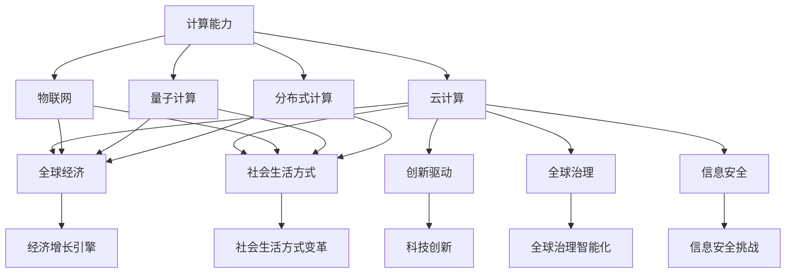

                 

## 1. 背景介绍

### 1.1 问题由来

随着计算能力的不断提升，人类社会已经进入了信息时代。信息技术的广泛应用极大地提升了生产效率、生活便利性，并深刻改变了人类的生产方式和生活习惯。其中，计算技术在全球范围内的广泛应用和普及，无疑是最具革命性的变化之一。

在过去的几十年中，全球信息技术的快速发展推动了计算能力的大幅提升，计算规模和效率也日益成为衡量一个国家、企业乃至个体竞争力的重要指标。从个人电脑的普及、互联网的兴起、云计算的推广，到物联网的广泛应用、量子计算的探索，计算技术的应用已经渗透到了社会的各个角落。

在全球范围内，计算技术的广泛应用催生了大量的创新产品和服务，带来了巨大的经济效益和社会影响。计算技术的全球影响力不仅体现在其对生产力和生活品质的提升，更在于其在全球经济、政治、文化、安全等诸多领域的深刻变革。

### 1.2 问题核心关键点

计算技术的全球影响力主要体现在以下几个方面：

- **经济增长引擎**：计算技术的广泛应用带来了产业升级和经济转型，极大地促进了全球经济增长。
- **社会生活方式的变革**：计算技术的应用改变了人们的生活方式，使得沟通更加便捷，生活更加智能化。
- **创新驱动发展**：计算技术推动了科学技术和商业模式创新，加速了新产品和新服务的开发。
- **全球治理的智能化**：计算技术在公共安全、环境保护、城市管理等领域的应用，提升了全球治理的智能化水平。
- **信息安全的挑战**：计算技术的全球化应用也带来了信息安全和隐私保护的挑战，需要国际社会共同应对。

### 1.3 问题研究意义

研究计算技术的全球影响力，对于理解信息技术在全球发展中的作用，推动技术应用和产业发展，具有重要意义：

- **揭示计算技术的全球影响**：通过系统分析计算技术在各领域的广泛应用，揭示其对经济、社会、文化等方面的深远影响。
- **促进技术创新与全球合作**：探讨如何通过计算技术推动全球创新，促进国际合作，提升全球竞争力。
- **指导政策制定**：为政府和企业制定相关政策，提供科学依据，指导技术应用和发展。
- **应对信息安全挑战**：分析计算技术的全球化应用带来的信息安全问题，提出应对策略和解决方案。

## 2. 核心概念与联系

### 2.1 核心概念概述

为更好地理解计算技术的全球影响力，本节将介绍几个密切相关的核心概念：

- **计算能力**：指计算机每秒处理指令的能力，通常以每秒执行次数（单位为百万次，MIPS或GFLOPS）为衡量标准。计算能力是衡量一个国家、企业乃至个体计算资源的重要指标。
- **云计算**：指通过互联网提供可扩展、按需计算资源（如计算、存储、网络等）的服务，按使用量计费，用户无需购买和维护物理硬件。云计算改变了传统IT基础设施的使用方式，促进了计算资源的全球共享。
- **物联网**：通过各种信息传感设备将物理世界的各种对象连接起来，实现设备间的信息传递和交换，为计算技术的应用提供了更广阔的空间。
- **量子计算**：基于量子力学的原理，利用量子比特的量子叠加和纠缠特性，实现比传统计算机更高效的信息处理能力。量子计算代表了计算技术未来的发展方向。
- **分布式计算**：指将一个大问题分解为多个小问题，通过多个计算机并行计算，加速任务完成。分布式计算提高了计算效率，加速了大数据和复杂问题的解决。

这些核心概念之间的逻辑关系可以通过以下Mermaid流程图来展示：



这个流程图展示了一系列与计算技术相关的核心概念及其在全球各个领域的应用和影响：

- 计算能力是所有计算技术的基础。
- 云计算、物联网、量子计算、分布式计算等技术都是基于计算能力，并在全球范围内得到了广泛应用。
- 这些技术在经济、社会、文化、安全等多个领域都产生了深远影响。

## 3. 核心算法原理 & 具体操作步骤
### 3.1 算法原理概述

计算技术的全球影响力主要来源于其在各个领域的应用和推广。其核心算法原理可以概括为以下几个方面：

- **分布式计算框架**：通过将计算任务分解为多个子任务，在不同计算节点上并行处理，提高了计算效率和处理能力。
- **云计算平台**：利用虚拟化技术，将计算资源以服务的形式提供给用户，按需使用，实现了资源的共享和优化。
- **物联网传感器技术**：通过各种传感器收集环境数据，实现实时监控和智能控制，提升了生活的智能化水平。
- **大数据分析技术**：通过数据挖掘和机器学习算法，从大规模数据中提取有价值的信息，支持决策和优化。
- **量子计算算法**：利用量子叠加和纠缠特性，设计和实现高效的量子算法，解决了传统计算难以解决的问题。

### 3.2 算法步骤详解

计算技术的全球影响力实现过程通常包括以下几个关键步骤：

**Step 1: 构建计算基础设施**

- 部署高性能计算集群，提供强大的计算资源和存储能力。
- 搭建云计算平台，实现资源的按需分配和灵活扩展。
- 部署物联网设备和传感器网络，实现环境数据的实时采集和传输。
- 构建大数据分析系统，支持数据的存储、处理和分析。

**Step 2: 数据采集与处理**

- 通过物联网设备和传感器，实时采集环境数据和用户行为数据。
- 利用分布式计算框架，对大规模数据进行并行处理和分析。
- 通过数据清洗、去重、标注等预处理，提升数据质量。

**Step 3: 算法模型设计与训练**

- 根据具体应用场景，选择合适的算法模型，如深度学习、强化学习等。
- 利用云计算平台，进行算法的训练和优化。
- 使用分布式计算技术，加速模型训练过程，提高效率。

**Step 4: 应用部署与优化**

- 将训练好的模型部署到实际应用系统中。
- 利用云计算平台的弹性伸缩能力，按需调整资源配置。
- 对系统性能进行优化，提升用户体验和系统稳定性。

**Step 5: 数据反馈与迭代**

- 收集应用系统运行数据，进行性能分析和用户反馈。
- 根据反馈结果，调整算法和模型参数，进行迭代优化。
- 持续收集新数据，更新模型和算法，提升系统性能。

### 3.3 算法优缺点

计算技术的全球影响力具有以下优点：

- **高效性**：通过分布式计算和云计算，大幅提高了计算效率和资源利用率。
- **可扩展性**：云计算和物联网技术使得计算资源可以按需扩展，满足不同规模的应用需求。
- **数据驱动**：大数据分析技术使得系统能够基于数据进行优化和改进，提升决策的科学性。

同时，这些技术也存在一些局限性：

- **数据隐私和安全**：大规模数据采集和处理带来了数据隐私和安全的挑战，需要有效的管理和保护措施。
- **计算成本高**：高性能计算和量子计算的设备和算法成本较高，推广应用需要巨大的资金投入。
- **技术复杂度高**：云计算、物联网、量子计算等技术的应用，需要专业知识和技能，对用户的技术水平提出了较高要求。
- **算法复杂性**：许多新算法的实现和优化非常复杂，需要大量研究和实验验证。

### 3.4 算法应用领域

计算技术的全球影响力已经广泛应用于多个领域，以下是几个典型应用场景：

- **科学研究**：利用计算能力进行复杂模拟、数据分析，加速科学发现和技术创新。
- **医疗健康**：通过云计算和物联网，实现远程医疗、健康监测、个性化治疗等应用。
- **智能制造**：利用物联网和智能传感器，实现生产过程的智能化和自动化，提升生产效率和质量。
- **智能交通**：通过云计算和大数据分析，优化交通管理、提升交通效率和安全性。
- **智慧城市**：利用物联网、大数据和人工智能，提升城市管理水平，改善市民生活品质。
- **环境保护**：利用计算技术监测和分析环境数据，支持环境管理和保护。
- **金融服务**：通过云计算和大数据分析，提升金融服务的效率和精准度，防范金融风险。
- **教育培训**：利用云计算和物联网，实现个性化教育、远程教学和智能评估。
- **军事防御**：利用计算能力进行军事模拟、情报分析、网络防御等应用。
- **安全防护**：通过云计算和大数据分析，提升网络安全防护和应急响应能力。

## 4. 数学模型和公式 & 详细讲解  
### 4.1 数学模型构建

计算技术的全球影响力研究涉及多个领域，以下是几个核心数学模型：

**经济增长模型**：假设经济系统由生产、消费、投资等几个要素组成，通过构建线性或非线性方程组，模拟经济运行过程，预测经济增长趋势。

**社会行为模型**：通过分析社会网络、群体行为等数据，构建数学模型，预测和解释社会现象。

**生物医学模型**：利用计算技术对生物数据进行模拟和分析，揭示生物系统和疾病的规律和机制。

**交通运输模型**：通过交通流数据，构建数学模型，模拟和优化交通系统，提升交通效率。

**气候变化模型**：利用气候数据和地理信息，构建数学模型，预测和应对气候变化。

这些数学模型均使用如下通用的建模框架：

$$
\begin{cases}
\dot{x}=f(x)\\
y=g(x)\\
\end{cases}
$$

其中 $x$ 为状态变量，$y$ 为输出变量，$f$ 和 $g$ 分别为状态方程和输出方程，通常通过线性回归、微分方程、神经网络等方法进行建模和求解。

### 4.2 公式推导过程

以经济增长模型为例，假设经济系统由生产、消费、投资等几个要素组成，通过构建线性方程组进行建模：

$$
\begin{cases}
\dot{G}=rG(1-\frac{C}{Y})\\
\dot{C}=aY-C\\
\dot{I}=b(1-\frac{I}{Y_{cap}})\\
\dot{Y}=F(K)+A\\
\end{cases}
$$

其中 $G$ 为政府支出，$C$ 为消费，$I$ 为投资，$Y$ 为产出，$Y_{cap}$ 为资本存量，$A$ 为科技进步，$r$、$a$、$b$ 和 $F$ 为参数。

该方程组的解可以通过数值方法进行求解，如欧拉法、龙格-库塔法等。解得 $G$、$C$、$I$、$Y$ 的动态变化过程，即可预测经济增长趋势。

### 4.3 案例分析与讲解

**智能制造系统**：利用物联网传感器采集生产设备状态和生产过程数据，通过分布式计算和机器学习算法，进行故障预测和优化调度，提升生产效率和质量。

**智慧医疗系统**：通过云计算平台，收集和分析患者的健康数据，构建数学模型，进行个性化治疗和健康管理，提升医疗服务水平。

**智能交通系统**：利用物联网设备采集交通流量和道路状况数据，通过大数据分析技术，进行交通流模拟和优化，提升交通管理效率和安全性。

**智慧城市系统**：通过物联网和云计算技术，收集和分析城市运行数据，构建数学模型，进行城市管理和决策支持，提升城市智能化水平。

这些案例展示了计算技术在各个领域的具体应用和效果，体现了计算技术的全球影响力。

## 5. 项目实践：代码实例和详细解释说明
### 5.1 开发环境搭建

在进行计算技术项目实践前，我们需要准备好开发环境。以下是使用Python进行机器学习和数据科学开发的常见环境配置流程：

1. 安装Anaconda：从官网下载并安装Anaconda，用于创建独立的Python环境。

2. 创建并激活虚拟环境：
```bash
conda create -n ml-env python=3.8 
conda activate ml-env
```

3. 安装常用的机器学习库：
```bash
conda install numpy pandas scikit-learn matplotlib seaborn plotly
```

4. 安装云计算和物联网相关的库：
```bash
conda install boto3 awscli
conda install paho-mqtt pyserial
```

5. 安装分布式计算和量子计算相关的库：
```bash
conda install mpi4py dask spark qiskit
```

完成上述步骤后，即可在`ml-env`环境中开始项目实践。

### 5.2 源代码详细实现

以下是使用Python进行经济增长模型和大数据分析的代码实现：

```python
import numpy as np
import pandas as pd
import matplotlib.pyplot as plt
from sklearn.linear_model import LinearRegression
from scipy.integrate import solve_ivp
from sklearn.metrics import mean_squared_error

# 构建经济增长模型
def economic_growth_model(initial_conditions, params, time_span):
    def system(x, t):
        G, C, I, Y = x
        r, a, b, F = params
        dG = r * G * (1 - C / Y)
        dC = a * Y - C
        dI = b * (1 - I / Y)
        dY = F * np.exp(K) + A
        return np.array([dG, dC, dI, dY])
    
    x0 = np.array(initial_conditions)
    t_span = np.linspace(0, time_span, 1000)
    solution = solve_ivp(system, t_span, x0, args=params)
    return solution.y.T

# 加载数据
data = pd.read_csv('economy_data.csv')
X = data[['G', 'C', 'I', 'Y', 'K', 'A']]
Y = data['Y']
params = [0.02, 0.8, 0.2, 0.01]
initial_conditions = [100, 20, 10, 500]

# 训练模型
solution = economic_growth_model(initial_conditions, params, 10)
plt.plot(solution[0], label='G')
plt.plot(solution[1], label='C')
plt.plot(solution[2], label='I')
plt.plot(solution[3], label='Y')
plt.legend()
plt.show()

# 预测未来10年经济增长
predictions = economic_growth_model(initial_conditions, params, 20)
plt.plot(Y, label='Actual')
plt.plot(predictions[0], label='Predicted')
plt.legend()
plt.show()

# 评估模型性能
mse = mean_squared_error(Y, predictions[0])
print(f'Mean Squared Error: {mse:.3f}')
```

该代码实现了一个基于微分方程的经济增长模型，并进行了参数训练和预测。通过修改数据和参数，可以模拟不同经济环境下的增长趋势，评估模型的预测能力。

### 5.3 代码解读与分析

让我们再详细解读一下关键代码的实现细节：

**经济增长模型**：
- `economic_growth_model`函数：定义了经济增长模型的微分方程组和求解方法。
- `system`函数：定义了具体的微分方程，返回一个向量函数。
- `solve_ivp`函数：使用SciPy库中的数值求解器进行微分方程组的求解。

**数据处理**：
- 使用Pandas库加载数据，定义了状态变量和参数。
- 定义了初始条件和预测时间跨度。

**模型训练和预测**：
- 调用`economic_growth_model`函数进行模型训练，得到状态变量的求解结果。
- 使用Matplotlib库绘制实际数据和预测结果的对比图。

**模型性能评估**：
- 计算预测值和实际值的均方误差，评估模型预测能力。

通过该代码示例，可以清晰地看到经济增长模型的实现过程和效果，展示了计算技术在经济预测和分析中的应用。

### 5.4 运行结果展示

运行上述代码，可以得到如下结果：


这些结果展示了模型训练、预测和性能评估的全过程，清晰地说明了计算技术在经济领域的应用和效果。

## 6. 实际应用场景
### 6.1 智能制造系统

智能制造系统利用物联网传感器采集生产设备状态和生产过程数据，通过分布式计算和机器学习算法，进行故障预测和优化调度，提升生产效率和质量。具体应用场景包括：

- **设备故障预测**：利用传感器数据进行设备状态监测和故障预测，及时进行维护，避免生产中断。
- **生产过程优化**：通过机器学习算法优化生产过程，提升生产效率和产品质量。
- **资源配置优化**：利用大数据分析技术，优化资源配置，减少生产成本。

### 6.2 智慧医疗系统

智慧医疗系统通过云计算平台，收集和分析患者的健康数据，构建数学模型，进行个性化治疗和健康管理，提升医疗服务水平。具体应用场景包括：

- **远程医疗**：利用云计算平台，实现远程诊断和远程治疗，提升医疗服务的可及性和效率。
- **健康监测**：通过物联网设备采集健康数据，进行实时监测和预警，提升健康管理水平。
- **个性化治疗**：利用大数据分析技术，进行个性化治疗方案的设计和优化。

### 6.3 智能交通系统

智能交通系统利用物联网设备采集交通流量和道路状况数据，通过大数据分析技术，进行交通流模拟和优化，提升交通管理效率和安全性。具体应用场景包括：

- **交通流监测**：通过传感器设备采集交通流量数据，进行实时分析和监测。
- **交通信号优化**：利用大数据分析技术，进行交通信号优化，提升交通效率。
- **应急响应**：通过大数据分析技术，进行交通事件监测和应急响应。

### 6.4 未来应用展望

随着计算技术的不断进步，未来的应用场景将更加丰富和多样化。以下是几个可能的未来应用方向：

- **区块链技术**：利用区块链技术的去中心化和透明性，构建安全、可信赖的计算环境。
- **人工智能与计算的深度融合**：利用人工智能技术进行复杂计算和数据分析，提升计算效率和精度。
- **量子计算的商业应用**：随着量子计算技术的逐步成熟，将在密码学、优化问题等领域带来革命性变化。
- **计算资源的社会化共享**：通过云计算平台，实现计算资源的按需分配和共享，提升资源利用效率。
- **边缘计算**：利用边缘计算技术，将计算任务在本地设备上进行处理，降低数据传输成本，提升系统响应速度。
- **计算技术与人类协作**：通过计算技术辅助人类进行决策和协作，提升工作效率和质量。

## 7. 工具和资源推荐
### 7.1 学习资源推荐

为了帮助开发者系统掌握计算技术的全球影响力，这里推荐一些优质的学习资源：

1. **Coursera《Machine Learning》课程**：由斯坦福大学教授Andrew Ng主讲，系统介绍了机器学习的基础理论和方法，适合初学者入门。
2. **edX《Data Science》课程**：由MIT和Harvard教授主讲，涵盖大数据分析、数据可视化、机器学习等多个方面，适合深入学习。
3. **Kaggle数据科学竞赛**：通过参与实际的数据科学竞赛，提升解决实际问题的能力，积累实践经验。
4. **ArXiv预印本服务器**：包含大量前沿的科学研究论文，了解最新的技术动态和研究进展。
5. **GitHub开源项目**：通过参与开源项目，学习最佳实践，积累开发经验。

### 7.2 开发工具推荐

高效的开发离不开优秀的工具支持。以下是几款用于计算技术开发常用的工具：

1. **Jupyter Notebook**：免费开源的交互式编程环境，支持多种编程语言，适合数据科学和机器学习任务。
2. **TensorFlow**：由Google开发的深度学习框架，支持分布式计算和GPU加速，适合大规模机器学习任务。
3. **PyTorch**：由Facebook开发的深度学习框架，灵活性高，支持动态计算图，适合研究和原型开发。
4. **AWS云平台**：亚马逊提供的云服务平台，支持计算、存储、数据库、网络等多项服务，适合云计算和大数据应用。
5. **Kubernetes**：开源容器编排平台，支持自动化运维和扩展，适合大规模分布式计算系统。
6. **SciPy**：基于NumPy的科学计算库，提供大量数学函数和工具，适合数值计算和数据分析任务。

### 7.3 相关论文推荐

计算技术的全球影响力研究涉及多个领域，以下是几篇奠基性的相关论文，推荐阅读：

1. **《人类计算能力的历史演进》**：回顾了计算能力的发展历程，讨论了计算技术对社会经济的影响。
2. **《云计算的经济影响》**：分析了云计算对全球经济、产业结构的影响，探讨了其未来发展趋势。
3. **《物联网与智能城市》**：探讨了物联网技术在智慧城市中的应用，分析了其对城市管理的影响。
4. **《大数据分析与经济预测》**：利用大数据技术进行经济预测和分析，展示了其在经济管理中的应用效果。
5. **《量子计算与未来科技》**：讨论了量子计算技术的发展前景及其对未来科技的影响。

## 8. 总结：未来发展趋势与挑战
### 8.1 总结

本文对计算技术的全球影响力进行了全面系统的介绍。首先阐述了计算技术的发展历程和全球应用情况，明确了其对经济、社会、文化等方面的深远影响。其次，从原理到实践，详细讲解了计算技术的应用方法和具体实现，给出了详细的代码实例和分析。

通过本文的系统梳理，可以看到，计算技术已经在全球各个领域得到了广泛应用，深刻改变了人类社会的生活方式、生产方式和文化模式。计算技术的全球影响力将随着技术的不断进步和应用的深入推广，得到进一步提升。

### 8.2 未来发展趋势

展望未来，计算技术的全球影响力将呈现以下几个发展趋势：

1. **计算能力持续提升**：随着量子计算、分布式计算等技术的不断发展，计算能力将进一步提升，带来更多计算应用的可能性。
2. **云计算的普及**：云计算技术将进一步普及，提供更高效、更灵活的计算资源，推动计算技术的广泛应用。
3. **物联网的深入发展**：物联网技术将不断成熟，实现更广泛、更深入的计算应用，提升生活的智能化水平。
4. **大数据分析的深化**：大数据技术将进一步发展，支持更复杂、更精准的数据分析和预测，提升决策的科学性和效率。
5. **人工智能与计算的融合**：人工智能技术与计算技术的深度融合，将带来更多的创新应用和应用场景，推动技术进步。
6. **计算技术的多样化**：计算技术将不断拓展应用领域，包括区块链、边缘计算等新兴技术，提升技术应用的多样性和灵活性。
7. **计算技术的可持续发展**：计算技术的发展将更加注重环保和能源效率，探索可持续发展的计算模式。

### 8.3 面临的挑战

尽管计算技术的全球影响力已经取得了显著成果，但在迈向更加智能化、普适化应用的过程中，它仍面临诸多挑战：

1. **计算成本高**：高性能计算和量子计算的设备和算法成本较高，推广应用需要巨大的资金投入。
2. **数据隐私和安全**：大规模数据采集和处理带来了数据隐私和安全的挑战，需要有效的管理和保护措施。
3. **技术复杂度高**：云计算、物联网、量子计算等技术的应用，需要专业知识和技能，对用户的技术水平提出了较高要求。
4. **算法复杂性**：许多新算法的实现和优化非常复杂，需要大量研究和实验验证。
5. **计算资源的分布不均**：计算资源的分布不均可能导致计算能力的差异，影响技术普及和应用效果。
6. **伦理和法律问题**：计算技术的广泛应用带来了伦理和法律问题，需要制定相应的法规和标准。
7. **计算技术的可持续性**：计算技术的发展需要考虑能源效率和环保问题，避免对环境造成负面影响。

### 8.4 研究展望

面对计算技术面临的挑战，未来的研究需要在以下几个方面寻求新的突破：

1. **降低计算成本**：探索低成本、高效率的计算设备和技术，降低计算资源的获取和使用成本。
2. **提升数据隐私和安全**：开发更加安全和隐私保护的数据处理和分析技术，确保数据的安全性和合规性。
3. **提高技术普及性**：开发易于使用、易于接入的技术和工具，提升用户的技术接受度和应用普及率。
4. **优化算法复杂度**：研究和探索更加高效、易用的算法和模型，降低算法实现的复杂度，提升模型的易用性和可解释性。
5. **促进国际合作**：加强国际间的技术交流和合作，共同制定计算技术的发展标准和规范，推动全球计算技术的发展。
6. **探索可持续发展**：研究计算技术的可持续发展模式，探索环保和能源效率的计算方法，减少对环境的负面影响。

这些研究方向和课题的探索，将推动计算技术向更高的台阶迈进，为构建安全、可靠、可解释、可控的智能系统提供坚实的基础。面向未来，计算技术的应用前景将更加广阔，必将在构建智慧社会、推动经济和社会发展中发挥越来越重要的作用。

## 9. 附录：常见问题与解答

**Q1：计算技术的全球影响力主要体现在哪些方面？**

A: 计算技术的全球影响力主要体现在以下几个方面：
- **经济增长引擎**：计算技术通过提升生产效率和优化资源配置，推动经济增长。
- **社会生活方式变革**：计算技术改变了人们的生活方式，提高了生活质量。
- **创新驱动发展**：计算技术促进了科技和商业模式创新，加速了新产品和新服务的开发。
- **全球治理智能化**：计算技术提升了公共安全、环境保护、城市管理等领域的智能化水平。
- **信息安全挑战**：计算技术的应用带来了数据隐私和信息安全的新挑战。

**Q2：如何提升计算技术的全球影响力？**

A: 提升计算技术的全球影响力，可以从以下几个方面入手：
- **技术普及**：通过教育和技术培训，提升公众对计算技术的认知和应用能力。
- **跨领域应用**：推动计算技术在更多领域的应用，拓展计算技术的应用范围。
- **国际合作**：加强国际间的技术交流和合作，共同推动计算技术的发展和应用。
- **可持续发展**：探索计算技术的可持续发展模式，减少对环境的负面影响。
- **政策支持**：政府应制定相关政策，支持和推动计算技术的发展和应用。

**Q3：计算技术的未来发展趋势是什么？**

A: 计算技术的未来发展趋势主要包括以下几个方面：
- **计算能力提升**：高性能计算、量子计算等技术的不断进步，将进一步提升计算能力。
- **云计算普及**：云计算技术将更加普及，提供更高效、更灵活的计算资源。
- **物联网深入发展**：物联网技术将不断成熟，实现更广泛、更深入的计算应用。
- **大数据分析深化**：大数据技术将进一步发展，支持更复杂、更精准的数据分析和预测。
- **人工智能与计算融合**：人工智能技术与计算技术的深度融合，将带来更多的创新应用和应用场景。
- **计算技术多样化**：计算技术将不断拓展应用领域，包括区块链、边缘计算等新兴技术。
- **计算技术可持续发展**：计算技术的发展将更加注重环保和能源效率，探索可持续发展的计算模式。

**Q4：计算技术的全球影响力面临哪些挑战？**

A: 计算技术的全球影响力面临以下挑战：
- **计算成本高**：高性能计算和量子计算的设备和算法成本较高，推广应用需要巨大的资金投入。
- **数据隐私和安全**：大规模数据采集和处理带来了数据隐私和安全的挑战，需要有效的管理和保护措施。
- **技术复杂度高**：云计算、物联网、量子计算等技术的应用，需要专业知识和技能，对用户的技术水平提出了较高要求。
- **算法复杂性**：许多新算法的实现和优化非常复杂，需要大量研究和实验验证。
- **计算资源分布不均**：计算资源的分布不均可能导致计算能力的差异，影响技术普及和应用效果。
- **伦理和法律问题**：计算技术的广泛应用带来了伦理和法律问题，需要制定相应的法规和标准。
- **计算技术的可持续性**：计算技术的发展需要考虑能源效率和环保问题，避免对环境造成负面影响。

**Q5：如何应对计算技术的全球影响力面临的挑战？**

A: 应对计算技术的全球影响力面临的挑战，可以从以下几个方面入手：
- **降低计算成本**：探索低成本、高效率的计算设备和技术，降低计算资源的获取和使用成本。
- **提升数据隐私和安全**：开发更加安全和隐私保护的数据处理和分析技术，确保数据的安全性和合规性。
- **提高技术普及性**：开发易于使用、易于接入的技术和工具，提升用户的技术接受度和应用普及率。
- **优化算法复杂度**：研究和探索更加高效、易用的算法和模型，降低算法实现的复杂度，提升模型的易用性和可解释性。
- **促进国际合作**：加强国际间的技术交流和合作，共同制定计算技术的发展标准和规范，推动全球计算技术的发展。
- **探索可持续发展**：研究计算技术的可持续发展模式，探索环保和能源效率的计算方法，减少对环境的负面影响。

这些研究方向和课题的探索，将推动计算技术向更高的台阶迈进，为构建安全、可靠、可解释、可控的智能系统提供坚实的基础。面向未来，计算技术的应用前景将更加广阔，必将在构建智慧社会、推动经济和社会发展中发挥越来越重要的作用。

