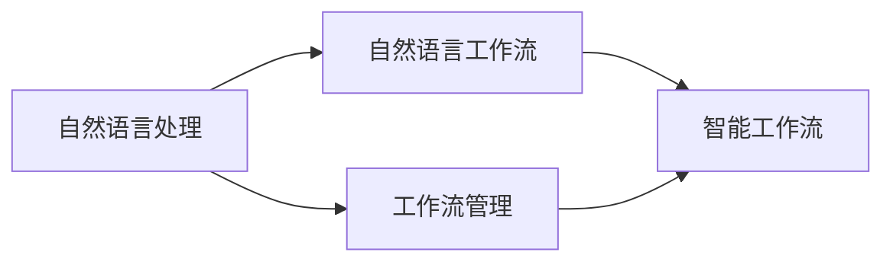

                 

# 通过自然语言创建工作流

> 关键词：自然语言处理(NLP), 工作流创建, 自然语言工作流, 人工智能, 数据驱动

## 1. 背景介绍

随着人工智能技术的发展，自然语言处理(Natural Language Processing, NLP)成为了连接人类与机器的重要桥梁。在过去几年中，深度学习和大规模预训练语言模型在NLP领域取得了显著的进步。这些模型已经能够理解和生成自然语言，从而为构建智能工作流提供了新的可能性。

传统的工作流管理系统，如Trello、Asana等，依赖于用户手动填写任务描述、设置任务优先级、分配责任等。这种方式虽然直观易用，但对于大规模的团队协作和复杂的流程管理，却显得效率低下，容易出错。而利用NLP技术，可以从自然语言描述中自动提取任务信息，构建出更加智能、高效的工作流管理系统。

本博客将深入探讨如何通过自然语言处理技术，创建智能工作流，并详细介绍其实现原理、操作步骤、应用领域及未来发展方向。

## 2. 核心概念与联系

### 2.1 核心概念概述

为了更好地理解自然语言创建工作流，我们先介绍几个核心概念及其联系：

- **自然语言处理(NLP)**：使用计算机技术处理、分析和生成人类自然语言的能力。它包括文本分类、命名实体识别、关系抽取、机器翻译、情感分析等任务。
- **工作流管理**：通过软件工具自动化和标准化业务流程，提高效率和协作质量。
- **自然语言工作流**：利用NLP技术，从自然语言描述中自动解析出任务信息，构建工作流的过程。
- **智能工作流**：结合人工智能技术，实现任务自动化执行、状态实时更新、智能推荐等功能的自动化工作流。

这些概念之间的联系和相互作用可以通过以下Mermaid流程图来展示：



这个流程图展示了大语言模型在NLP与工作流管理之间的桥梁作用：自然语言处理技术提取任务信息，构建工作流，最终结合人工智能技术实现智能工作流管理。

## 3. 核心算法原理 & 具体操作步骤
### 3.1 算法原理概述

自然语言工作流的核心思想是通过NLP技术，从自然语言描述中自动提取任务信息，构建出结构化的任务列表和依赖关系。这一过程可以大致分为两个阶段：

1. **任务解析**：从自然语言描述中提取任务信息，包括任务名称、执行者、截止日期、前置任务、后置任务等。
2. **任务关联**：根据任务信息，构建出任务之间的依赖关系，形成有向无环图(Directed Acyclic Graph, DAG)。

形式化地，假设自然语言描述为 $\text{desc}$，任务列表为 $\text{tasks}$，任务关系为 $\text{relations}$。任务解析的目标是找到 $\text{desc}$ 中的关键信息，映射到 $\text{tasks}$ 中。任务关联的目标是利用 $\text{relations}$ 构建出 $\text{tasks}$ 中的任务依赖关系。

### 3.2 算法步骤详解

基于上述原理，自然语言工作流的具体实现步骤如下：

**Step 1: 准备自然语言描述和任务列表**

- 收集项目文档、会议记录、邮件等自然语言描述。
- 定义任务的基本属性，如任务名称、执行者、截止日期等。

**Step 2: 任务解析**

- 使用预训练的NLP模型，如BERT、GPT-3等，对自然语言描述进行向量化。
- 利用预训练的命名实体识别模型，从描述中提取出人名、机构名、日期等关键信息。
- 使用预训练的关系抽取模型，从描述中识别出任务之间的逻辑关系，如“之前”、“之后”、“同时”等。
- 将提取出的信息映射到任务列表中的相应属性，构建出任务的初步框架。

**Step 3: 任务关联**

- 构建任务之间的依赖关系图，可以使用有向无环图表示。
- 通过算法自动识别和构建任务间的依赖关系，如前置任务、后置任务、并行任务等。
- 利用优化算法，如最小生成树算法(Minimum Spanning Tree, MST)，对依赖关系图进行优化，减少任务间的冗余和依赖冲突。

**Step 4: 任务执行与监控**

- 根据依赖关系图，自动化执行任务。
- 实时监控任务状态，并根据任务依赖关系进行动态调整。
- 结合人工智能技术，如预测模型、推荐算法等，进行任务优先级调整和智能推荐。

### 3.3 算法优缺点

自然语言工作流的优点包括：

1. **高效自动化**：利用NLP技术，自动解析自然语言描述，构建任务列表和依赖关系，大幅减少手动输入的繁琐工作。
2. **灵活扩展**：对于不同的任务类型，可以灵活定制解析和关联算法，适应复杂多变的需求。
3. **智能优化**：结合人工智能技术，实现任务动态调整和优先级优化，提高工作效率。

然而，该方法也存在一些局限性：

1. **语言理解局限**：当前NLP模型的语言理解能力还有待提升，可能无法准确解析复杂自然语言描述。
2. **依赖标注数据**：解析和关联模型的性能依赖于标注数据的质量和数量，标注数据的获取和维护成本较高。
3. **上下文理解不足**：对于涉及多个文档或段落的自然语言描述，模型可能难以理解整体上下文关系，导致解析错误。
4. **算法复杂性**：依赖复杂的算法和数据结构，可能存在计算复杂度高、实时性不足的问题。

### 3.4 算法应用领域

自然语言工作流技术可以应用于多个领域，以下是几个典型应用：

**项目管理**：从项目文档、邮件中提取任务信息，构建项目任务列表和依赖关系，自动生成项目进度表。

**运营管理**：从客服记录、客户反馈中提取问题信息，构建运营任务列表和优先级，自动派单和更新状态。

**内容管理**：从文档、邮件中提取关键信息，构建内容任务列表和引用关系，自动生成文档目录和引用列表。

**智能会议管理**：从会议纪要中提取任务信息，构建会议任务列表和依赖关系，自动生成会议进度和纪要。

## 4. 数学模型和公式 & 详细讲解 & 举例说明

### 4.1 数学模型构建

自然语言工作流的数学模型可以抽象为从自然语言描述 $\text{desc}$ 到任务列表 $\text{tasks}$ 和依赖关系图 $\text{relations}$ 的映射。设 $f_{\theta}(\text{desc}) = (\text{tasks}, \text{relations})$，其中 $\theta$ 为模型参数。任务列表 $\text{tasks}$ 和依赖关系图 $\text{relations}$ 的构建过程可以看作是对 $\text{desc}$ 的编码和解码。

### 4.2 公式推导过程

以任务解析为例，我们假设有一个自然语言描述 $\text{desc} = \text{“在2023年12月31日前，完成项目报告的撰写和提交，并安排与客户的第一次会议。”}$，目标是从中提取出任务信息，构建任务列表 $\text{tasks}$ 和依赖关系图 $\text{relations}$。

首先，使用BERT模型对 $\text{desc}$ 进行向量化，得到向量 $\vec{v}$。

$$
\vec{v} = \text{BERT}(\text{desc})
$$

然后，使用预训练的命名实体识别模型，从 $\vec{v}$ 中识别出人名、机构名、日期等信息，并将这些信息映射到任务列表 $\text{tasks}$ 的相应属性中。

$$
\text{tasks} = \{(\text{项目报告}, \text{撰写}, 2023-12-31), (\text{项目报告}, \text{提交}, 2023-12-31), (\text{客户会议}, \text{安排}, 2023-12-31)\}
$$

接下来，使用预训练的关系抽取模型，从 $\vec{v}$ 中识别出任务之间的逻辑关系，如“之前”、“之后”、“同时”等。这里以任务“项目报告撰写”和“项目报告提交”为例，假设模型识别出“项目报告撰写之后进行提交”。

$$
\text{relations} = \{(\text{项目报告}, \text{项目报告撰写}, \text{之后}), (\text{项目报告}, \text{项目报告提交}, \text{之后})\}
$$

将任务列表 $\text{tasks}$ 和依赖关系图 $\text{relations}$ 输入优化算法，如MST算法，构建出完整的任务依赖关系图。

### 4.3 案例分析与讲解

为了更好地理解自然语言工作流的实际应用，我们以一个示例项目为例进行详细分析。

假设有一个项目文档，包含如下自然语言描述：

**文档一**：

```
项目概述：开发一款智能语音助手，包括语音识别、自然语言理解和语音生成等功能。
任务列表：
1. 用户界面设计（UI）
2. 语音识别模型训练
3. 自然语言理解模型训练
4. 语音生成模型训练
5. 用户测试
6. 部署上线
依赖关系：
1. UI设计完成后，才能进行语音识别模型训练
2. 语音识别模型训练完成后，才能进行自然语言理解模型训练
3. 自然语言理解模型训练完成后，才能进行语音生成模型训练
4. 所有模型训练完成后，才能进行用户测试
5. 用户测试完成后，才能部署上线
```

对上述文档进行自然语言工作流分析：

1. **任务解析**：
   - 从文档中提取任务信息：
     - 任务1：用户界面设计（UI）
     - 任务2：语音识别模型训练
     - 任务3：自然语言理解模型训练
     - 任务4：语音生成模型训练
     - 任务5：用户测试
     - 任务6：部署上线
   - 提取关键时间节点：
     - 项目截止日期：未明确，假设为2023年12月31日

2. **任务关联**：
   - 构建任务依赖关系图，如下所示：
     ```
     UI设计  ------> 语音识别训练 --> 自然语言理解训练 --> 语音生成训练 --> 用户测试 --> 部署上线
     ```
   - 优化依赖关系图，减少冗余和依赖冲突，如下所示：
     ```
     UI设计  ------> 语音识别训练 ------ 自然语言理解训练 ------ 语音生成训练 --> 用户测试 --> 部署上线
     ```

3. **任务执行与监控**：
   - 根据依赖关系图，自动化执行任务，实时监控任务状态。
   - 结合预测模型和推荐算法，进行任务优先级调整和智能推荐。

## 5. 项目实践：代码实例和详细解释说明
### 5.1 开发环境搭建

在进行自然语言工作流实践前，我们需要准备好开发环境。以下是使用Python进行SpaCy开发的环境配置流程：

1. 安装Anaconda：从官网下载并安装Anaconda，用于创建独立的Python环境。

2. 创建并激活虚拟环境：
```bash
conda create -n nlp-env python=3.8 
conda activate nlp-env
```

3. 安装SpaCy：
```bash
pip install spacy
```

4. 下载预训练模型：
```bash
python -m spacy download en_core_web_sm
```

完成上述步骤后，即可在`nlp-env`环境中开始自然语言工作流的实践。

### 5.2 源代码详细实现

下面我们以任务解析为例，给出使用SpaCy进行自然语言工作流分析的Python代码实现。

首先，定义任务解析函数：

```python
import spacy
from spacy.matcher import Matcher

nlp = spacy.load('en_core_web_sm')
matcher = Matcher(nlp.vocab)

def parse_task(task_desc):
    task_list = []
    relations = []
    
    # 匹配人名、机构名、日期等信息
    matches = []
    matches = matcher(nlp(task_desc))
    
    # 将匹配到的信息映射到任务列表
    for match_id, start, end in matches:
        match_str = nlp[match_id].text
        task_list.append(match_str)
    
    # 匹配逻辑关系
    matches = matcher(nlp(task_desc))
    
    # 将匹配到的关系映射到依赖关系图
    for match_id, start, end in matches:
        match_str = nlp[match_id].text
        relations.append(match_str)
    
    return task_list, relations
```

然后，进行自然语言描述的解析：

```python
task_desc = """
项目概述：开发一款智能语音助手，包括语音识别、自然语言理解和语音生成等功能。
任务列表：
1. 用户界面设计（UI）
2. 语音识别模型训练
3. 自然语言理解模型训练
4. 语音生成模型训练
5. 用户测试
6. 部署上线
依赖关系：
1. UI设计完成后，才能进行语音识别模型训练
2. 语音识别模型训练完成后，才能进行自然语言理解模型训练
3. 自然语言理解模型训练完成后，才能进行语音生成模型训练
4. 所有模型训练完成后，才能进行用户测试
5. 用户测试完成后，才能部署上线
"""

task_list, relations = parse_task(task_desc)
print("任务列表：", task_list)
print("依赖关系：", relations)
```

可以看到，通过SpaCy库，我们能够方便地从自然语言描述中解析出任务列表和依赖关系，构建出结构化的任务依赖关系图。

### 5.3 代码解读与分析

让我们再详细解读一下关键代码的实现细节：

**parse_task函数**：
- 利用SpaCy库加载预训练模型，并实例化Matcher。
- 定义任务列表和依赖关系的列表。
- 使用Matcher在自然语言描述中匹配人名、机构名、日期等信息，并将匹配结果映射到任务列表中。
- 使用Matcher在自然语言描述中匹配逻辑关系，并将匹配结果映射到依赖关系列表中。
- 最终返回任务列表和依赖关系列表。

**任务解析函数调用**：
- 定义自然语言描述，调用parse_task函数，解析出任务列表和依赖关系。
- 打印输出任务列表和依赖关系，用于验证解析结果。

通过SpaCy库的强大能力，我们能够高效地从自然语言描述中解析出任务信息，构建出结构化的任务依赖关系图。

当然，在实际应用中，还需要结合具体的业务场景和需求，对解析算法进行优化。例如，对于不同领域的项目描述，可能需要定制化的解析规则和词典，以提高解析准确性。

## 6. 实际应用场景
### 6.1 项目管理

自然语言工作流在项目管理中的应用，可以大幅提升项目管理效率，减少手动输入的繁琐工作。

在传统项目管理中，项目经理需要手动记录项目进度、任务分配等信息。而自然语言工作流技术可以将项目文档、邮件等自然语言描述自动解析为任务信息，构建出任务列表和依赖关系，自动化执行和监控项目进度。这不仅减少了手动输入的工作量，还提高了数据的准确性和一致性。

例如，假设项目经理收到一封邮件，内容如下：

**邮件内容**：

```
项目经理，请安排在下周五前完成报告撰写，并通知小张进行数据收集。
```

自然语言工作流技术可以自动解析出任务信息，构建出任务列表和依赖关系，如下所示：

**任务列表**：
- 报告撰写
- 数据收集

**依赖关系**：
- 报告撰写依赖于数据收集

结合项目管理工具，如Trello、Asana等，可以自动化执行和监控任务，实时更新项目进度。这不仅提高了工作效率，还减少了人为操作的错误。

### 6.2 运营管理

在运营管理中，自然语言工作流技术可以从客服记录、客户反馈中自动提取问题信息，构建运营任务列表和优先级，自动派单和更新状态。

例如，假设客服中心收到一封客户投诉邮件，内容如下：

**邮件内容**：

```
尊敬的客服人员，我的快递在运输过程中丢失了，请尽快帮我处理。
```

自然语言工作流技术可以自动解析出问题信息，构建出运营任务列表和依赖关系，如下所示：

**任务列表**：
- 处理客户投诉
- 跟进物流状态

**依赖关系**：
- 处理客户投诉依赖于物流跟踪

结合运营管理工具，如Zendesk、Salesforce等，可以自动派单和更新状态，提升运营效率和客户满意度。这不仅减少了人工操作的工作量，还提高了问题解决的及时性。

### 6.3 内容管理

在内容管理中，自然语言工作流技术可以从文档、邮件中提取关键信息，构建内容任务列表和引用关系，自动生成文档目录和引用列表。

例如，假设编辑收到一封邮件，内容如下：

**邮件内容**：

```
亲爱的编辑，请参考附件中的研究报告，补充相关数据，并在本周完成初稿。
```

自然语言工作流技术可以自动解析出任务信息，构建出内容任务列表和依赖关系，如下所示：

**任务列表**：
- 补充数据
- 完成初稿

**依赖关系**：
- 补充数据依赖于研究报告
- 完成初稿依赖于补充数据

结合内容管理工具，如Overleaf、Scrivener等，可以自动化执行和监控内容任务，实时更新文档状态。这不仅提高了内容创作的效率，还确保了文档结构的清晰和一致。

## 7. 工具和资源推荐
### 7.1 学习资源推荐

为了帮助开发者系统掌握自然语言工作流的理论基础和实践技巧，这里推荐一些优质的学习资源：

1. 《自然语言处理综论》：斯坦福大学提供的NLP课程，系统介绍NLP的基本概念和前沿技术，适合初学者。
2. 《SpaCy官方文档》：SpaCy库的官方文档，提供详尽的API和代码示例，是学习SpaCy库的重要资源。
3. 《NLP实战指南》：一本实战性质的NLP书籍，介绍NLP应用案例和工具使用技巧，适合进阶学习者。
4. 《深度学习框架实战指南》：一本介绍深度学习框架（如TensorFlow、PyTorch等）的实战指南，提供大量实践案例，适合开发者入门。

通过这些资源的学习实践，相信你一定能够快速掌握自然语言工作流的精髓，并用于解决实际的业务问题。

### 7.2 开发工具推荐

高效的开发离不开优秀的工具支持。以下是几款用于自然语言工作流开发的常用工具：

1. SpaCy：自然语言处理工具库，提供丰富的NLP功能，包括命名实体识别、关系抽取、句法分析等。
2. TensorFlow：开源深度学习框架，支持分布式计算和大规模模型训练，适合处理复杂的NLP任务。
3. PyTorch：开源深度学习框架，提供动态计算图和丰富的NLP库，支持快速原型开发和研究。
4. Scikit-learn：机器学习库，提供丰富的预处理、建模和评估工具，适合处理数据清洗和特征工程等环节。

合理利用这些工具，可以显著提升自然语言工作流任务的开发效率，加快创新迭代的步伐。

### 7.3 相关论文推荐

自然语言工作流的发展源于学界的持续研究。以下是几篇奠基性的相关论文，推荐阅读：

1. "Efficient Estimation of Word Representations in Vector Space"（即Word2Vec）：提出了Word2Vec模型，将文本转换为向量表示，是NLP领域的里程碑工作。
2. "Bidirectional LSTM-Based Language Model"：提出了双向LSTM模型，大幅提升了语言模型的表现，为后续预训练大模型奠定了基础。
3. "Transformers: State-of-the-Art Natural Language Processing"：介绍了Transformer模型，开创了预训练大模型的先河，推动了NLP领域的巨大进步。
4. "BERT: Pre-training of Deep Bidirectional Transformers for Language Understanding"：提出了BERT模型，通过大规模预训练实现了NLP任务的SOTA性能，为微调提供了强大的基础。
5. "GPT-3: Language Models are Unsupervised Multitask Learners"：展示了GPT-3模型强大的零样本和少样本学习能力，为自然语言工作流提供了新的思路。

这些论文代表了大语言模型微调技术的发展脉络。通过学习这些前沿成果，可以帮助研究者把握学科前进方向，激发更多的创新灵感。

## 8. 总结：未来发展趋势与挑战
### 8.1 总结

本文对自然语言工作流的创建方法进行了全面系统的介绍。首先阐述了自然语言工作流的背景和应用价值，明确了其在工作流管理中的独特作用。其次，从原理到实践，详细讲解了自然语言工作流的数学模型、解析算法和关联算法，并给出了完整的代码实例。同时，本文还广泛探讨了自然语言工作流在项目管理、运营管理、内容管理等不同场景中的应用前景，展示了其广泛的适用性。

通过本文的系统梳理，可以看到，自然语言工作流技术在提升项目管理、运营管理、内容管理等方面具有重要意义。它可以显著减少手动输入的工作量，提高数据准确性和一致性，提升工作效率。未来，随着自然语言处理技术的不断进步，自然语言工作流将变得更加智能和高效，为各行各业带来深远的变革。

### 8.2 未来发展趋势

展望未来，自然语言工作流技术将呈现以下几个发展趋势：

1. **多模态融合**：自然语言工作流将从单一文本处理拓展到多模态融合，结合图像、视频、语音等多模态数据，提升信息理解和处理能力。
2. **实时交互**：结合自然语言理解和生成技术，自然语言工作流将实现实时交互，为用户提供更加自然流畅的体验。
3. **知识图谱整合**：自然语言工作流将更加注重与知识图谱的整合，利用外部知识库和规则库，提升任务理解和推理能力。
4. **分布式计算**：自然语言工作流将结合分布式计算技术，提高任务执行的效率和可扩展性。
5. **自适应学习**：自然语言工作流将具备自适应学习能力，能够根据任务的反馈信息，动态调整模型参数，提升模型性能。

以上趋势凸显了自然语言工作流技术的广阔前景。这些方向的探索发展，必将进一步提升自然语言工作流系统的智能化水平，为各行各业带来深远的变革。

### 8.3 面临的挑战

尽管自然语言工作流技术已经取得了显著成就，但在实现全面落地应用的过程中，仍面临诸多挑战：

1. **语言理解精度**：自然语言工作流的核心在于从自然语言描述中自动解析出任务信息，构建任务依赖关系。当前NLP模型的语言理解能力仍有待提升，特别是在处理复杂长句时，解析准确性可能会受到影响。
2. **数据质量问题**：自然语言工作流的性能依赖于标注数据的质量和数量，标注数据的获取和维护成本较高。如何提升数据质量，减少标注工作量，仍是重要研究方向。
3. **计算资源消耗**：自然语言工作流需要处理大量的文本数据，计算复杂度高，实时性可能不足。如何优化算法和数据结构，提升计算效率，仍需进一步研究。
4. **跨领域泛化能力**：自然语言工作流需要在不同领域、不同任务中实现良好的泛化能力。如何构建通用的任务解析和关联算法，适应复杂多变的业务场景，仍需深入研究。

### 8.4 研究展望

面对自然语言工作流技术所面临的挑战，未来的研究需要在以下几个方面寻求新的突破：

1. **多模态自然语言理解**：结合图像、视频、语音等多模态数据，提升自然语言工作流的信息处理能力。
2. **自适应自然语言解析**：结合自适应学习技术，提升自然语言工作流的泛化能力和实时交互能力。
3. **知识图谱整合**：将自然语言工作流与知识图谱进行深度整合，提升任务理解和推理能力。
4. **分布式计算优化**：结合分布式计算技术，提高自然语言工作流的计算效率和可扩展性。
5. **自监督学习**：利用自监督学习技术，提升自然语言工作流的语言理解精度和泛化能力。

这些研究方向的探索，必将引领自然语言工作流技术迈向更高的台阶，为各行各业带来深远的变革。面向未来，自然语言工作流技术还需要与其他人工智能技术进行更深入的融合，如知识表示、因果推理、强化学习等，多路径协同发力，共同推动自然语言工作流系统的进步。只有勇于创新、敢于突破，才能不断拓展自然语言工作流的边界，让智能技术更好地造福人类社会。

## 9. 附录：常见问题与解答

**Q1：自然语言工作流是否适用于所有业务场景？**

A: 自然语言工作流适用于大部分业务场景，特别是涉及任务管理和项目执行的场景。然而，对于高度定制化或特定领域的任务，可能需要结合具体业务需求进行定制化开发。例如，在金融领域，可能需要针对金融术语和格式进行定制化解析。

**Q2：如何提升自然语言工作流的解析精度？**

A: 提升自然语言工作流的解析精度，需要从数据、模型、算法等多个环节进行优化：
1. 数据质量：获取高质量的标注数据，减少数据噪声。
2. 模型优化：选择和训练合适的NLP模型，提升语言理解能力。
3. 算法改进：设计更加精准的任务解析和关联算法，提高解析精度。
4. 上下文理解：结合上下文信息，提升自然语言工作流的理解能力。

**Q3：自然语言工作流在实际应用中面临哪些挑战？**

A: 自然语言工作流在实际应用中面临以下挑战：
1. 语言理解：当前NLP模型的语言理解能力仍有待提升，特别是在处理复杂长句时，解析准确性可能会受到影响。
2. 数据质量：自然语言工作流的性能依赖于标注数据的质量和数量，标注数据的获取和维护成本较高。
3. 计算资源：自然语言工作流需要处理大量的文本数据，计算复杂度高，实时性可能不足。
4. 跨领域泛化：自然语言工作流需要在不同领域、不同任务中实现良好的泛化能力。

**Q4：如何实现自然语言工作流的分布式计算？**

A: 实现自然语言工作流的分布式计算，需要结合以下技术：
1. 分布式存储：采用分布式文件系统，如Hadoop、Ceph等，存储大规模文本数据。
2. 分布式计算：结合分布式计算框架，如Spark、Ray等，提高计算效率和可扩展性。
3. 数据并行处理：利用数据并行处理技术，提升计算效率。
4. 模型并行优化：结合模型并行优化技术，减少计算复杂度。

这些技术的结合，可以实现自然语言工作流的分布式计算，提升任务执行的效率和可扩展性。

**Q5：自然语言工作流在实际应用中如何进行实时监控？**

A: 自然语言工作流的实时监控需要结合以下几个技术：
1. 事件驱动：利用事件驱动技术，实时监控任务状态变化。
2. 状态管理：采用状态管理工具，如Apache Kafka、RocketMQ等，实时更新任务状态。
3. 可视化界面：结合可视化界面技术，展示任务状态和进度。
4. 告警系统：结合告警系统，设置异常告警阈值，及时发现和处理问题。

通过以上技术的结合，可以实现自然语言工作流的实时监控，确保任务执行的效率和可控性。

---

作者：禅与计算机程序设计艺术 / Zen and the Art of Computer Programming

