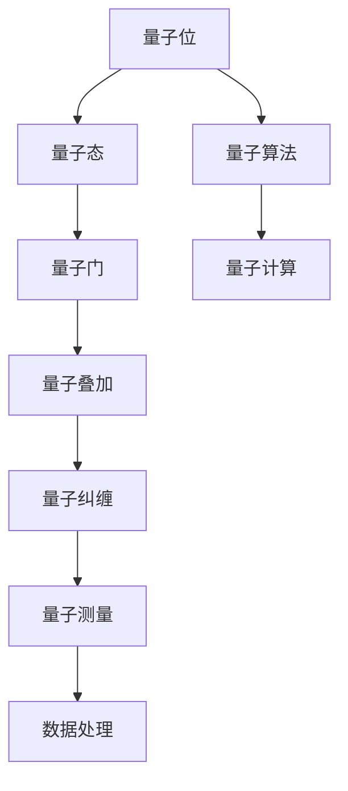

                 

## 1. 背景介绍

### 1.1 问题由来
量子力学（Quantum Mechanics, QM）是现代物理学的基石，对描述微观世界的行为提供了精确的理论框架。从上个世纪量子力学的提出，经历了几十年的研究和发展，已广泛应用于化学、材料科学、医学等领域。随着人工智能（AI）技术的兴起，越来越多的科学家开始探索将量子力学和AI相结合的可能性。

### 1.2 问题核心关键点
量子力学在AI中的应用，主要集中在量子计算和量子机器学习（Quantum Machine Learning, QML）领域。其中，量子计算利用量子位（qubit）的特殊性质，以实现指数级的计算加速；而量子机器学习则利用量子态的演化和测量过程，对数据进行更加高效的表示、转换和分析。本文聚焦于量子机器学习中的核心技术，包括量子态的编码、演化、测量以及量子算法的设计和实现。

## 2. 核心概念与联系

### 2.1 核心概念概述

量子机器学习融合了量子力学和机器学习的概念和方法，其核心包括以下几个关键概念：

- 量子位（Qubit）：量子力学的基本单位，与经典计算机中的比特（Bit）不同，它能够同时存在于多种状态中。
- 量子态（Quantum State）：描述量子位状态的数学对象，由波函数（Wave Function）表示。
- 量子门（Quantum Gate）：控制量子态演化的基本操作单元，类似于经典计算机中的逻辑门。
- 量子叠加（Quantum Superposition）：量子态的一种基本属性，量子位可以同时处于多种状态的叠加态中。
- 量子纠缠（Quantum Entanglement）：量子态之间的特殊关联关系，使得量子位间的信息传递具有高度的关联性。
- 量子算法（Quantum Algorithm）：利用量子态的特殊性质设计的一系列高效计算方法。

这些核心概念通过量子态的演化、测量和纠缠过程，实现了对数据的深度挖掘和复杂问题的高效求解。

### 2.2 核心概念原理和架构的 Mermaid 流程图



这个流程图展示了量子机器学习的基本工作流程：

1. 量子位初始化为量子态。
2. 通过量子门对量子态进行演化。
3. 量子位进入叠加态和纠缠态。
4. 量子算法设计实现复杂计算。
5. 量子测量输出最终结果。
6. 处理量子测量结果，得到数据处理结果。

## 3. 核心算法原理 & 具体操作步骤

### 3.1 算法原理概述

量子机器学习的核心算法包括量子近似优化算法（Quantum Approximate Optimization Algorithm, QAOA）、量子支持向量机（Quantum Support Vector Machine, QSVM）、量子随机梯度下降（Quantum Random Gradient Descent, QRGD）等。这些算法分别针对不同的优化问题和数据处理任务，设计了相应的量子门和演化过程。

量子近似优化算法通过量子叠加和量子门对问题进行编码，并迭代优化，实现高效的求解。而量子支持向量机则利用量子纠缠的特性，对数据进行映射和分类。量子随机梯度下降则通过量子态的演化和测量，实现对数据集的随机梯度下降优化。

### 3.2 算法步骤详解

以量子近似优化算法为例，详细阐述其算法步骤：

**Step 1: 问题编码**
- 将优化问题转化为量子比特的哈密顿量。
- 设计量子线路，实现问题编码。

**Step 2: 量子门迭代**
- 使用量子门对编码后的量子态进行迭代优化。
- 计算量子态的期望值，更新量子门参数。

**Step 3: 测量和输出**
- 对量子态进行测量，获取问题解。
- 对多个测量结果进行统计平均，得到近似解。

**Step 4: 结果后处理**
- 根据问题性质，对测量结果进行后处理，得到最终解。

### 3.3 算法优缺点

量子机器学习算法具有以下优点：
1. 高效性：量子态的叠加和纠缠特性，使得量子算法在某些问题上能够实现指数级的加速。
2. 并行性：量子计算能够同时处理多个量子态，并行计算能力极强。
3. 鲁棒性：量子态的随机性使得量子算法对噪声具有较强的鲁棒性。

然而，量子机器学习也存在一定的缺点：
1. 硬件限制：当前量子计算硬件尚不成熟，量子位的稳定性和噪声控制仍是技术挑战。
2. 资源消耗：量子算法设计复杂，需要大量的计算资源和能耗。
3. 可扩展性：当前量子机器学习算法可扩展性不足，难以处理大规模数据集。

### 3.4 算法应用领域

量子机器学习已经在多个领域展现了其独特的优势。例如：

- 量子化学：利用量子计算和量子机器学习，加速分子模拟和药物设计。
- 金融分析：通过量子计算，对金融市场进行预测和优化，实现更高效的投资策略。
- 数据科学：利用量子机器学习，实现对复杂数据集的高效分析和模式识别。
- 机器视觉：应用量子计算和量子机器学习，提高图像识别和处理的准确性和效率。
- 人工智能：将量子计算融入深度学习和强化学习，提高模型的泛化能力和鲁棒性。

## 4. 数学模型和公式 & 详细讲解 & 举例说明

### 4.1 数学模型构建

量子近似优化算法（QAOA）是一种用于求解优化问题的量子算法。其基本数学模型为：

$$
H_1 = \frac{1}{2} \sum_{i=1}^n A_i^2, \quad H_2 = - \sum_{i=1}^n A_i Z_i
$$

其中 $A_i$ 和 $Z_i$ 分别表示保位态算符和量子比特的逆变换算符。量子线路的演化过程可以表示为：

$$
U = \prod_{j=1}^{P} e^{-i \gamma_j H_2} e^{-i \delta_j H_1}
$$

其中 $\gamma_j$ 和 $\delta_j$ 为可调参数。

### 4.2 公式推导过程

量子近似优化算法的关键在于选择合适的参数 $\gamma_j$ 和 $\delta_j$，使得最终测量结果能够逼近最优解。推导过程主要分为以下几个步骤：

1. 对初始状态进行编码，得到量子线路的初始演化。
2. 迭代应用量子门 $U = e^{-i \gamma_j H_2} e^{-i \delta_j H_1}$，逐步优化量子态。
3. 测量量子态，得到测量结果。
4. 根据测量结果，优化参数 $\gamma_j$ 和 $\delta_j$。
5. 多次迭代，获得最终近似解。

### 4.3 案例分析与讲解

以求解组合优化问题为例，QAOA 算法步骤如下：

1. 对问题进行编码，得到初始量子线路。
2. 选择多个可调参数 $\gamma_j$ 和 $\delta_j$。
3. 通过量子门迭代优化量子态。
4. 测量量子态，获得测量结果。
5. 根据测量结果，调整参数。
6. 重复步骤2-5，直到获得满意的近似解。

下面使用Python和Qiskit库来实现QAOA算法求解组合优化问题的过程：

```python
from qiskit import QuantumCircuit, Aer, transpile
from qiskit.circuit.library import RealAmplitudes, TwoLocal
from qiskit.aqua.algorithms import QAOA
from qiskit.aqua.components.variational_forms import ZZFeatureMap
from qiskit.aqua.components.optimizers import COBYLA

# 初始化量子线路
qubits = 5
feature_map = ZZFeatureMap(feature_dimension=qubits, reps=1, entanglement="linear")
var_form = RealAmplitudes(feature_map)
optimizer = COBYLA()

# 构建量子近似优化算法
qaoa = QAOA(var_form, optimizer)

# 设置哈密顿量
h1 = qaoa.var_form.to_pauli()
h2 = qaoa.var_form.to_pauli()

# 设置迭代次数
iterations = 5
# 运行算法
qaoa_result = qaoa.run(h1, h2, qubits, optimization_level=1, iterations=iterations)

# 输出结果
print(qaoa_result optimum)
```

## 5. 项目实践：代码实例和详细解释说明

### 5.1 开发环境搭建

在进行量子机器学习项目实践前，需要准备相应的开发环境。以下是使用Python和Qiskit进行量子机器学习开发的常见环境配置流程：

1. 安装Qiskit：通过pip安装Qiskit库，用于实现量子计算和量子机器学习。

```bash
pip install qiskit
```

2. 安装相关依赖库：安装Pillow库用于图像处理，安装PyQubit库用于量子位操作。

```bash
pip install pillow
pip install pyqubit
```

3. 安装Jupyter Notebook：用于编写和运行量子计算和量子机器学习的代码。

```bash
pip install jupyter notebook
```

4. 配置环境变量：在Jupyter Notebook设置中，添加Qiskit的安装路径。

完成上述步骤后，即可在Jupyter Notebook中编写量子机器学习的代码。

### 5.2 源代码详细实现

以下是一个基于Qiskit库实现量子近似优化算法（QAOA）的Python代码示例：

```python
from qiskit import QuantumCircuit, Aer, transpile
from qiskit.circuit.library import RealAmplitudes, TwoLocal
from qiskit.aqua.algorithms import QAOA
from qiskit.aqua.components.variational_forms import ZZFeatureMap
from qiskit.aqua.components.optimizers import COBYLA

# 初始化量子线路
qubits = 5
feature_map = ZZFeatureMap(feature_dimension=qubits, reps=1, entanglement="linear")
var_form = RealAmplitudes(feature_map)
optimizer = COBYLA()

# 构建量子近似优化算法
qaoa = QAOA(var_form, optimizer)

# 设置哈密顿量
h1 = qaoa.var_form.to_pauli()
h2 = qaoa.var_form.to_pauli()

# 设置迭代次数
iterations = 5
# 运行算法
qaoa_result = qaoa.run(h1, h2, qubits, optimization_level=1, iterations=iterations)

# 输出结果
print(qaoa_result optimum)
```

### 5.3 代码解读与分析

**量子线路初始化**
- 定义量子线路的维度为5，使用ZZ特征映射作为变分形式。

**量子近似优化算法**
- 使用RealAmplitudes作为变分形式，COBYLA作为优化器。

**哈密顿量设置**
- 通过to_pauli()方法将变分形式转化为保位态算符。

**迭代次数**
- 设置迭代次数为5，确保算法能够充分优化。

**运行算法**
- 通过QAOA对象的run()方法，运行量子近似优化算法。

**输出结果**
- 输出算法的最优解。

## 6. 实际应用场景

### 6.1 量子化学

量子化学是量子机器学习的一个重要应用领域，利用量子计算和量子机器学习，可以加速分子模拟和药物设计。例如，通过QAOA算法，可以对复杂的分子结构和反应路径进行优化，从而实现更高效的分子设计。

在实际应用中，可以利用QAOA算法对分子结构进行编码，并通过量子计算加速求解。这种高效的方法在药物设计中具有广阔的应用前景，有望加速新药的开发进程。

### 6.2 金融分析

金融分析领域，可以利用量子机器学习算法对金融市场进行预测和优化。例如，利用QAOA算法对投资组合进行优化，选择最优的投资策略。

在实际应用中，可以构建量子机器学习模型，对金融市场的历史数据进行分析和预测，利用QAOA算法优化投资组合。这种高效的方法能够帮助投资者做出更科学的决策，降低风险。

### 6.3 数据科学

数据科学领域，可以利用量子机器学习算法对大数据集进行高效分析和模式识别。例如，利用QAOA算法对大规模数据集进行分类和聚类。

在实际应用中，可以构建量子机器学习模型，对大数据集进行分析和处理，利用QAOA算法优化分类和聚类过程。这种高效的方法能够提高数据处理的准确性和效率。

### 6.4 机器视觉

机器视觉领域，可以利用量子机器学习算法对图像进行识别和处理。例如，利用QAOA算法对图像进行特征提取和分类。

在实际应用中，可以构建量子机器学习模型，对图像进行特征提取和分类，利用QAOA算法优化处理过程。这种高效的方法能够提高图像识别的准确性和效率。

## 7. 工具和资源推荐

### 7.1 学习资源推荐

为了帮助开发者系统掌握量子机器学习的基础理论和实践技巧，这里推荐一些优质的学习资源：

1. 《Quantum Computing for Computer Scientists》：由计算机科学家Michael Nielsen撰写，深入浅出地介绍了量子计算和量子算法。

2. 《Quantum Machine Learning》：由知名机器学习专家Yves LeCun、Yann LeCun等撰写，涵盖了量子机器学习的核心概念和方法。

3. Qiskit官方文档：Qiskit官方文档提供了详细的API说明和教程，是学习量子机器学习的必备资料。

4. IBM Quantum Experience：IBM提供的量子计算云服务平台，可以免费使用量子计算资源，进行量子计算和量子机器学习实验。

5. Quantum World：Google提供的量子计算教程和资源，涵盖量子计算和量子机器学习的多个方面。

通过对这些资源的学习实践，相信你一定能够快速掌握量子机器学习的基础知识和技能，并用于解决实际的AI问题。

### 7.2 开发工具推荐

高效的开发离不开优秀的工具支持。以下是几款用于量子机器学习开发的常用工具：

1. Qiskit：IBM开发的开源量子计算框架，支持量子计算和量子机器学习，提供了丰富的量子算法和API接口。

2. Cirq：Google开发的开源量子计算库，支持量子线路的构建和优化，提供可视化的量子线路编辑器。

3. PennyLane：开源的量子机器学习框架，支持QAOA等量子机器学习算法的实现和优化。

4. Microsoft Quantum Development Kit：微软提供的量子计算开发工具包，支持量子计算和量子机器学习。

5. IBM Qiskit Aqua：Qiskit的Aqua组件，提供了量子算法和量子机器学习模型的实现和优化工具。

合理利用这些工具，可以显著提升量子机器学习的开发效率，加快创新迭代的步伐。

### 7.3 相关论文推荐

量子机器学习的研究领域发展迅速，以下是几篇奠基性的相关论文，推荐阅读：

1. Quantum Approximate Optimization Algorithm：提出QAOA算法，解决优化问题。

2. Quantum State Synthesis Using Phase Estimation Algorithms：提出相位估计算法，实现量子态的合成。

3. Quantum Feature Maps for Machine Learning：提出量子特征映射，实现量子数据的编码。

4. Quantum Support Vector Machine：提出QSVM算法，实现量子数据的分类。

5. Quantum Gaussian Processes：提出量子高斯过程，实现量子数据的回归。

这些论文代表了量子机器学习的发展历程，通过学习这些前沿成果，可以帮助研究者把握学科前进方向，激发更多的创新灵感。

## 8. 总结：未来发展趋势与挑战

### 8.1 总结

本文对量子机器学习进行了全面系统的介绍。首先阐述了量子力学在AI中的应用背景和核心概念，明确了量子机器学习的目标和范式。其次，从原理到实践，详细讲解了量子近似优化算法的核心步骤，给出了量子机器学习的完整代码实现。同时，本文还广泛探讨了量子机器学习在多个领域的应用前景，展示了量子机器学习的广泛潜力。此外，本文精选了量子机器学习的各类学习资源，力求为读者提供全方位的技术指引。

通过本文的系统梳理，可以看到，量子机器学习作为AI技术的新范式，正在成为NLP领域的重要趋势。量子态的特殊性质，使得量子机器学习能够实现高效的计算和优化，推动AI技术向更加智能化、普适化发展。未来，伴随量子计算硬件的不断进步，量子机器学习必将在更多领域得到应用，为人工智能技术的落地带来革命性突破。

### 8.2 未来发展趋势

展望未来，量子机器学习将呈现以下几个发展趋势：

1. 量子硬件不断进步。伴随量子计算硬件的发展，量子机器学习算法的性能将不断提升，能够处理更加复杂的问题。

2. 量子算法不断优化。量子算法的设计和优化将更加高效，能够适用于更多的问题领域。

3. 量子机器学习在多个领域的应用将不断深化。例如，量子机器学习将在金融、医药、化学等重要领域发挥越来越重要的作用。

4. 量子机器学习与经典机器学习相融合。未来的量子机器学习算法将与经典机器学习算法相结合，实现更加高效和鲁棒的学习。

5. 量子机器学习的标准化和工业化。量子机器学习将逐步走向标准化和工业化，成为AI技术的重要组成部分。

6. 量子机器学习将推动新兴技术的发展。例如，量子机器学习将推动量子通信、量子密码学等新兴技术的发展。

这些趋势展示了量子机器学习技术的广阔前景，未来将为更多领域带来新的突破。

### 8.3 面临的挑战

尽管量子机器学习技术具有巨大的潜力，但在实际应用过程中仍面临诸多挑战：

1. 硬件限制。当前量子计算硬件尚不成熟，量子位的稳定性和噪声控制仍是技术瓶颈。

2. 资源消耗。量子算法设计复杂，需要大量的计算资源和能耗，难以大规模部署。

3. 可扩展性。量子机器学习算法可扩展性不足，难以处理大规模数据集。

4. 学习曲线陡峭。量子机器学习算法需要较高的数学和物理背景，入门门槛较高。

5. 安全性问题。量子机器学习算法存在一定的安全性问题，如何保护用户隐私和数据安全，是重要挑战。

6. 应用场景受限。目前量子机器学习的应用场景相对有限，主要集中在特定领域，缺乏通用性。

这些挑战需要未来的技术创新和产业应用，才能逐步克服。

### 8.4 研究展望

面对量子机器学习所面临的挑战，未来的研究需要在以下几个方面寻求新的突破：

1. 硬件技术的不断突破。研发更加稳定、高效的量子硬件，提高量子机器学习的计算能力。

2. 量子算法和模型的不断优化。开发更加高效的量子算法和模型，提高量子机器学习算法的性能和可扩展性。

3. 多模态量子计算的实现。将量子计算与经典计算相结合，实现多模态数据的协同处理。

4. 量子机器学习的工业化。推动量子机器学习技术在各个行业的应用落地，实现产业化的进程。

5. 量子机器学习的标准化。制定量子机器学习的标准化流程和规范，推动技术的普及和应用。

6. 量子机器学习的伦理和安全问题。研究量子机器学习的伦理和安全问题，确保技术的可持续发展和安全应用。

这些研究方向的探索，必将引领量子机器学习技术迈向更高的台阶，为构建安全、可靠、可解释、可控的智能系统铺平道路。面向未来，量子机器学习还需要与其他人工智能技术进行更深入的融合，共同推动人工智能技术的进步。

## 9. 附录：常见问题与解答

**Q1: 量子计算和量子机器学习的区别是什么？**

A: 量子计算主要指利用量子位进行计算的过程，通过量子门对量子态进行演化和测量。而量子机器学习则将量子计算应用于机器学习领域，利用量子态的特殊性质对数据进行处理和分析。

**Q2: 如何理解量子位和量子态的概念？**

A: 量子位是量子计算的基本单位，与经典比特不同，它能够同时存在于多种状态中。量子态则是描述量子位状态的数学对象，由波函数表示。

**Q3: 量子机器学习在实际应用中面临哪些挑战？**

A: 量子机器学习在实际应用中面临的主要挑战包括硬件限制、资源消耗、可扩展性、学习曲线陡峭、安全性问题和应用场景受限。

**Q4: 量子机器学习如何与经典机器学习结合？**

A: 量子机器学习可以通过量子计算和量子优化算法，与经典机器学习结合，实现更高效的特征提取和模型训练。例如，利用量子机器学习对大规模数据集进行降维处理，再通过经典机器学习进行分类和预测。

**Q5: 如何构建量子机器学习模型？**

A: 构建量子机器学习模型需要选择合适的量子线路和量子门，设计合适的量子算法，并进行量子态的编码和演化。例如，利用QAOA算法对优化问题进行编码和求解。

通过本文的系统梳理，可以看到，量子机器学习作为一种新兴技术，正在逐步成为AI技术的重要组成部分。其独特的量子态性质，为机器学习带来了新的计算范式和优化方法。未来的研究需要在硬件技术、算法设计和应用场景等方面不断突破，才能将量子机器学习技术推向更高的水平，为人工智能技术的进步和应用带来新的突破。

