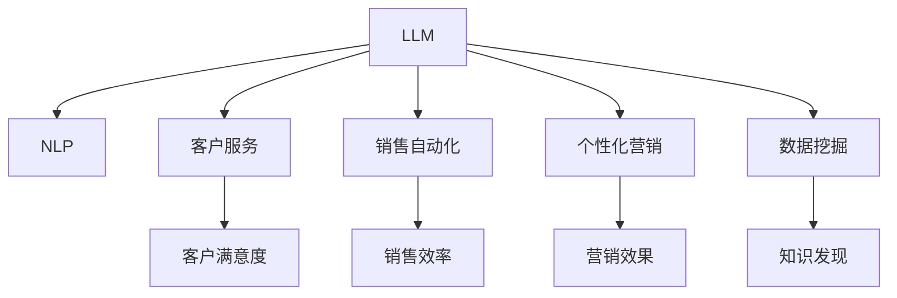

                 

# 销售和营销：LLM 增强的策略

> 关键词：自然语言处理(NLP), 预训练语言模型(LLM), 聊天机器人, 客户服务, 销售自动化, 个性化营销

## 1. 背景介绍

在当今的数字化时代，销售和营销已成为企业获取竞争优势的关键因素。随着技术的进步，企业越来越多地利用大数据和人工智能(AI)来优化其销售和营销策略。近年来，自然语言处理(NLP)技术，特别是预训练语言模型(LLM)，在销售和营销中的应用变得越来越普遍。LLM可以处理和分析文本数据，从而帮助企业更好地理解客户需求、预测市场趋势并优化销售和营销决策。

然而，尽管LLM在理论上具有潜力，但将其有效集成到销售和营销流程中仍然面临着许多挑战。本文将探讨LLM在销售和营销中的核心概念、算法原理、操作步骤以及实际应用场景，并提供一系列工具和资源，以帮助企业更好地利用LLM技术。

## 2. 核心概念与联系

### 2.1 核心概念概述

为了更好地理解LLM在销售和营销中的应用，我们将介绍几个核心概念及其之间的联系：

- **预训练语言模型(LLM)**：一种通过在大规模无标签文本数据上自监督预训练得到的模型。这些模型通常在大规模语料上进行训练，以学习语言的通用表示和结构。

- **自然语言处理(NLP)**：利用计算机科学和人工智能技术，使计算机能够理解、处理和生成人类语言的技术。NLP在销售和营销中用于文本分析和生成。

- **聊天机器人**：一种使用NLP技术自动与人类进行交互的计算机程序。聊天机器人可以用于客户服务、销售和营销等场景。

- **客户服务**：指企业为满足客户需求而提供的服务。聊天机器人可以在线提供即时客户服务，提升客户满意度和忠诚度。

- **销售自动化**：指使用AI和NLP技术自动执行销售流程的各个环节，如客户关系管理、销售预测等。

- **个性化营销**：指根据客户的行为、偏好和历史数据，提供定制化的营销信息，提升营销效果。

- **数据挖掘**：从大量数据中提取有用信息和知识的过程。NLP技术可以用于数据挖掘，以发现客户行为模式和市场趋势。

这些核心概念共同构成了LLM在销售和营销中的基础框架，帮助我们理解如何利用LLM技术提升销售和营销的效率和效果。

### 2.2 核心概念原理和架构的 Mermaid 流程图



## 3. 核心算法原理 & 具体操作步骤

### 3.1 算法原理概述

LLM在销售和营销中的应用基于其在文本分析和生成的能力。LLM通常通过自监督学习在大量文本数据上进行预训练，学习语言的通用表示。在预训练完成后，可以将其应用于各种NLP任务，包括文本分类、实体识别、情感分析等。这些任务可以进一步用于销售和营销中，如客户服务、销售预测、个性化营销等。

### 3.2 算法步骤详解

将LLM应用于销售和营销的典型步骤如下：

**Step 1: 数据收集与准备**
- 收集与销售和营销相关的文本数据，如客户反馈、社交媒体帖子、广告文案等。
- 对数据进行清洗和预处理，包括去除噪音、标准化文本格式等。

**Step 2: 预训练模型选择与适配**
- 选择适合销售和营销任务的预训练模型，如BERT、GPT等。
- 对模型进行适配，如添加或修改顶层，以匹配特定任务的输出格式。

**Step 3: 数据标注与微调**
- 对模型进行微调，使用已标注的销售和营销数据，优化模型在特定任务上的性能。
- 使用合适的优化算法，如Adam、SGD等，并设置适当的学习率。

**Step 4: 模型部署与集成**
- 将微调后的模型部署到实际应用中，如客户服务系统、销售预测系统等。
- 集成模型到业务流程中，自动执行相关任务，提升效率和效果。

**Step 5: 模型监控与优化**
- 持续监控模型的性能，并根据实际情况进行调整和优化。
- 定期更新模型，以适应新的数据和业务需求。

### 3.3 算法优缺点

LLM在销售和营销中的优点包括：

- **高效性**：通过微调，LLM可以快速适应特定任务，提升效率。
- **个性化**：LLM可以分析客户行为和偏好，提供定制化的营销信息。
- **自动化**：LLM可以自动执行销售和营销任务，减少人力成本。
- **灵活性**：LLM可以应用于各种NLP任务，适用于不同的业务场景。

然而，LLM也存在一些局限性：

- **数据依赖**：微调模型的性能高度依赖于标注数据的质量和数量。
- **计算资源需求**：预训练和微调LLM需要大量的计算资源。
- **泛化能力**：LLM在特定任务上的性能可能不如专门针对该任务设计的模型。
- **可解释性**：LLM作为"黑盒"模型，缺乏可解释性，难以理解和调试。

### 3.4 算法应用领域

LLM在销售和营销中的应用领域非常广泛，包括但不限于以下几个方面：

- **客户服务**：使用聊天机器人自动回答客户问题，提供即时支持。
- **销售预测**：利用文本分析预测客户需求和购买意向，优化库存管理。
- **个性化推荐**：基于客户行为和偏好，提供个性化的产品推荐和营销信息。
- **情感分析**：分析客户反馈和社交媒体帖子，了解客户情感倾向，提升客户满意度。
- **市场趋势分析**：通过分析新闻、广告文案等文本数据，预测市场趋势和需求变化。

## 4. 数学模型和公式 & 详细讲解 & 举例说明

### 4.1 数学模型构建

在销售和营销中，LLM通常用于文本分类和实体识别任务。以下是一个文本分类的数学模型构建过程：

假设我们的任务是将文本分为两类（例如，购买和未购买）。我们的输入为文本$x$，输出为类别$y$。模型通过学习输入和输出之间的映射关系，预测新文本的类别。

### 4.2 公式推导过程

对于文本分类任务，我们可以使用交叉熵损失函数来衡量模型预测与真实标签之间的差异。设模型在输入$x$下的输出为$\hat{y}$，真实标签为$y$。交叉熵损失函数的定义为：

$$
\ell(y, \hat{y}) = -\frac{1}{N}\sum_{i=1}^N(y_i \log \hat{y}_i + (1-y_i) \log(1-\hat{y}_i))
$$

其中$N$为样本数量。

模型的优化目标是最小化损失函数$\ell(y, \hat{y})$。常用的优化算法包括Adam、SGD等。优化过程的公式为：

$$
\theta \leftarrow \theta - \eta \nabla_{\theta}\ell(y, \hat{y}) - \eta\lambda\theta
$$

其中$\theta$为模型参数，$\eta$为学习率，$\lambda$为正则化系数。

### 4.3 案例分析与讲解

以销售预测为例，假设我们的目标是预测客户是否会购买某产品。我们可以将客户的评论、社交媒体帖子等文本数据作为输入，将客户购买行为作为输出。利用预训练的LLM模型，我们可以对其进行微调，以预测客户是否会购买该产品。具体步骤如下：

1. 收集客户评论数据，进行预处理和标注。
2. 选择适合销售预测任务的预训练模型，如BERT。
3. 对模型进行微调，使用已标注的客户评论数据，优化模型在预测购买行为上的性能。
4. 将微调后的模型集成到销售预测系统中，实时预测客户购买意向。
5. 持续监控和优化模型性能，确保预测准确性。

## 5. 项目实践：代码实例和详细解释说明

### 5.1 开发环境搭建

为了进行LLM在销售和营销中的项目实践，我们需要准备以下开发环境：

1. Python：选择3.8或以上版本。
2. PyTorch：用于构建和训练NLP模型。
3. Transformers库：提供了预训练模型和微调接口。
4. NLTK库：用于文本预处理和分词。
5. Scikit-learn：用于数据集划分和模型评估。

安装上述依赖后，我们可以开始编写代码。

### 5.2 源代码详细实现

以下是一个使用BERT进行销售预测的Python代码示例：

```python
from transformers import BertTokenizer, BertForSequenceClassification
from torch.utils.data import DataLoader
from sklearn.model_selection import train_test_split
from sklearn.metrics import accuracy_score

# 数据预处理
tokenizer = BertTokenizer.from_pretrained('bert-base-uncased')
train_data = load_train_data()
dev_data = load_dev_data()
test_data = load_test_data()

# 模型构建
model = BertForSequenceClassification.from_pretrained('bert-base-uncased', num_labels=2)

# 微调模型
device = torch.device('cuda' if torch.cuda.is_available() else 'cpu')
model.to(device)

# 定义训练集和验证集
train_dataset = DataLoader(train_data, batch_size=32, shuffle=True)
dev_dataset = DataLoader(dev_data, batch_size=32)

# 定义优化器
optimizer = torch.optim.Adam(model.parameters(), lr=1e-5)

# 定义训练循环
def train_epoch(model, dataset, optimizer, loss_fn):
    model.train()
    epoch_loss = 0
    for batch in dataset:
        input_ids = batch['input_ids'].to(device)
        attention_mask = batch['attention_mask'].to(device)
        labels = batch['labels'].to(device)
        optimizer.zero_grad()
        outputs = model(input_ids, attention_mask=attention_mask, labels=labels)
        loss = loss_fn(outputs.logits, labels)
        epoch_loss += loss.item()
        loss.backward()
        optimizer.step()
    return epoch_loss / len(dataset)

# 训练模型
epochs = 5
for epoch in range(epochs):
    train_loss = train_epoch(model, train_dataset, optimizer, loss_fn)
    print(f'Epoch {epoch+1}, train loss: {train_loss:.3f}')

# 评估模型
model.eval()
with torch.no_grad():
    dev_preds = []
    for batch in dev_dataset:
        input_ids = batch['input_ids'].to(device)
        attention_mask = batch['attention_mask'].to(device)
        labels = batch['labels'].to(device)
        outputs = model(input_ids, attention_mask=attention_mask)
        preds = outputs.logits.argmax(dim=1).to('cpu').tolist()
        dev_preds.extend(preds)
    dev_acc = accuracy_score(dev_labels, dev_preds)
    print(f'Dev accuracy: {dev_acc:.3f}')

# 测试模型
model.eval()
with torch.no_grad():
    test_preds = []
    for batch in test_dataset:
        input_ids = batch['input_ids'].to(device)
        attention_mask = batch['attention_mask'].to(device)
        labels = batch['labels'].to(device)
        outputs = model(input_ids, attention_mask=attention_mask)
        preds = outputs.logits.argmax(dim=1).to('cpu').tolist()
        test_preds.extend(preds)
    test_acc = accuracy_score(test_labels, test_preds)
    print(f'Test accuracy: {test_acc:.3f}')
```

### 5.3 代码解读与分析

在上述代码中，我们首先加载了数据集，并对数据进行了预处理和分词。然后，选择了BERT模型作为预训练语言模型，并对其进行了微调。在微调过程中，我们使用了Adam优化器和交叉熵损失函数。在训练完成后，我们对模型进行了验证和测试，并计算了模型在验证集和测试集上的准确率。

### 5.4 运行结果展示

运行上述代码，输出模型的准确率，我们可以评估模型的性能。如果模型的准确率较高，说明模型在销售预测任务上的表现较好，可以将其部署到实际业务系统中。

## 6. 实际应用场景

### 6.1 客户服务

在客户服务领域，聊天机器人是LLM的一个重要应用。通过训练LLM模型，可以构建智能客服系统，自动回答客户问题，提供24/7的即时支持。例如，在电商平台上，客户可以输入问题，如“如何设置配送地址？”，聊天机器人会自动回答，并提供详细的步骤。

### 6.2 销售预测

销售预测是销售和营销中非常重要的一环。通过分析客户的购买历史和评论，可以预测客户的购买意向和需求。利用预训练的LLM模型，可以对客户评论进行情感分析，预测客户是否会购买某产品。例如，可以使用BERT模型对客户评论进行微调，以预测客户是否会购买该产品。

### 6.3 个性化推荐

个性化推荐是提升客户满意度和增加销售量的重要手段。通过分析客户的浏览和购买历史，可以了解客户的偏好，并提供个性化的产品推荐。利用预训练的LLM模型，可以对客户评论和浏览记录进行情感分析和主题分类，以生成个性化的推荐内容。例如，可以使用BERT模型对客户评论进行微调，以生成个性化的推荐内容。

## 7. 工具和资源推荐

### 7.1 学习资源推荐

为了帮助读者掌握LLM在销售和营销中的应用，我们推荐以下学习资源：

1. 《Natural Language Processing with Transformers》：由Hugging Face出版的书籍，详细介绍了Transformers库和NLP技术。
2. 《Deep Learning for NLP》：由Coursera提供的深度学习课程，涵盖NLP中的基础知识和应用。
3. 《Sales and Marketing with AI》：由Udemy提供的在线课程，介绍了AI在销售和营销中的应用。

### 7.2 开发工具推荐

以下是一些常用的开发工具，可以帮助读者进行LLM在销售和营销中的项目实践：

1. PyTorch：用于构建和训练NLP模型。
2. Transformers库：提供了预训练模型和微调接口。
3. NLTK库：用于文本预处理和分词。
4. Scikit-learn：用于数据集划分和模型评估。
5. TensorBoard：用于可视化模型的训练过程。

### 7.3 相关论文推荐

以下是一些与LLM在销售和营销中应用相关的经典论文，读者可以参考：

1. Attention is All You Need：提出Transformer模型，为NLP中的预训练和微调奠定了基础。
2. BERT: Pre-training of Deep Bidirectional Transformers for Language Understanding：提出BERT模型，在多个NLP任务中取得了最先进的性能。
3. Sales and Marketing with AI：介绍AI在销售和营销中的应用，包括聊天机器人、销售预测、个性化推荐等。

## 8. 总结：未来发展趋势与挑战

### 8.1 研究成果总结

本文详细介绍了LLM在销售和营销中的应用，包括核心概念、算法原理、操作步骤以及实际应用场景。通过学习本文，读者可以理解如何利用LLM技术提升销售和营销的效率和效果。

### 8.2 未来发展趋势

未来的趋势包括：

1. **自动化和智能化**：随着技术的进步，LLM将越来越自动化和智能化，可以自动执行销售和营销任务，提升效率。
2. **个性化推荐**：利用LLM技术，可以提供更精准、个性化的产品推荐，提升客户满意度和销售额。
3. **情感分析**：通过情感分析，可以了解客户的情感倾向，提升客户满意度，优化销售策略。
4. **多模态融合**：结合文本、图像、语音等多种模态数据，提升LLM在销售和营销中的表现。

### 8.3 面临的挑战

尽管LLM在销售和营销中具有广阔的应用前景，但仍然面临一些挑战：

1. **数据依赖**：微调模型的性能高度依赖于标注数据的质量和数量。
2. **计算资源需求**：预训练和微调LLM需要大量的计算资源。
3. **泛化能力**：LLM在特定任务上的性能可能不如专门针对该任务设计的模型。
4. **可解释性**：LLM作为"黑盒"模型，缺乏可解释性，难以理解和调试。

### 8.4 研究展望

未来的研究方向包括：

1. **少样本学习**：利用LLM的零样本和少样本学习能力，在标注数据不足的情况下也能提升模型的性能。
2. **跨领域迁移学习**：将LLM应用于不同领域的销售和营销任务，提升模型在不同场景下的泛化能力。
3. **知识图谱融合**：将LLM与知识图谱等结构化数据结合，提升模型的推理能力和知识整合能力。
4. **持续学习**：在新的数据上不断更新和优化模型，适应数据分布的变化。

## 9. 附录：常见问题与解答

### Q1: 如何选择适合销售和营销任务的预训练模型？

A: 选择适合任务的预训练模型需要考虑模型的结构和任务类型。BERT和GPT系列模型是常用的选择，BERT适用于分类和实体识别任务，GPT系列模型适用于生成任务和对话任务。

### Q2: 如何处理销售和营销中的噪声数据？

A: 处理噪声数据可以通过数据清洗和预处理来实现。例如，去除特殊符号、拼写错误等。还可以使用正则表达式等工具进行文本标准化。

### Q3: 如何评估LLM在销售和营销中的性能？

A: 评估LLM的性能可以通过准确率、召回率、F1值等指标来实现。还可以使用混淆矩阵等工具进行详细分析。

### Q4: 如何避免LLM在销售和营销中的过拟合？

A: 避免过拟合可以通过数据增强、正则化等技术来实现。例如，使用对抗样本、Dropout等方法提升模型的泛化能力。

### Q5: 如何利用LLM提升客户满意度？

A: 利用LLM可以构建智能客服系统，自动回答客户问题，提供24/7的即时支持。还可以利用情感分析等技术，了解客户的情感倾向，优化客户服务流程。

---

作者：禅与计算机程序设计艺术 / Zen and the Art of Computer Programming

