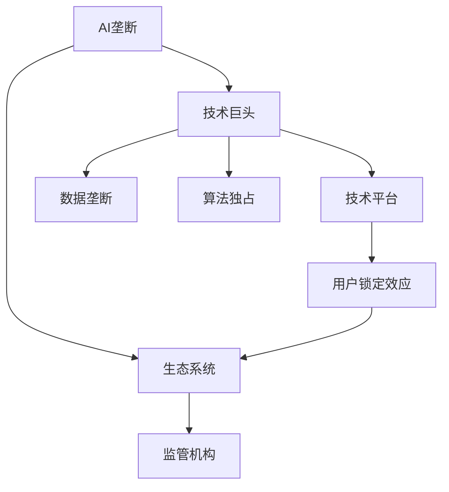
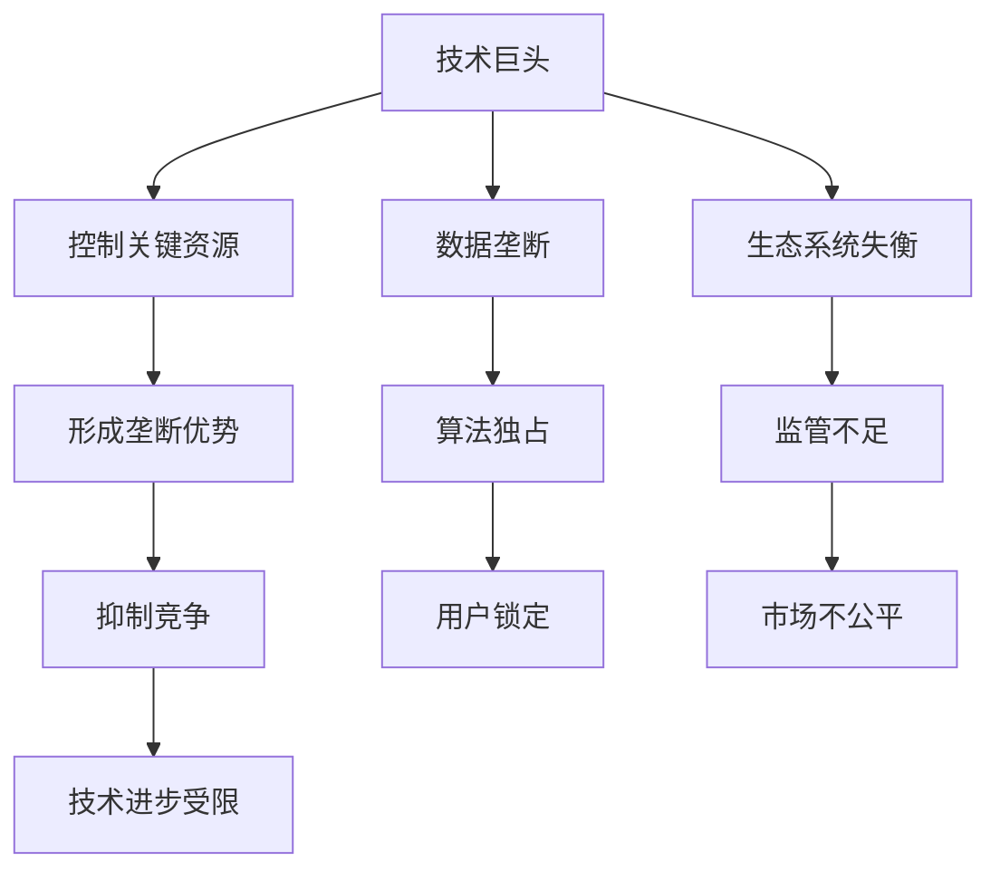

                 

## 1. 背景介绍

在人工智能(AI)迅猛发展的当下，人们越来越意识到AI技术的巨大潜力和广泛应用。但与此同时，AI的快速发展也带来了一系列新的挑战和问题，其中尤为严重的是AI垄断的威胁。AI垄断不仅会导致技术进步的不平衡，还可能威胁到社会的公平与正义，引发社会治理的巨大挑战。本文旨在探讨AI垄断的产生原因及其潜在影响，并提出有效的措施来维护AI技术的健康生态系统。

## 2. 核心概念与联系

### 2.1 核心概念概述

为深入理解AI垄断的概念及其影响，本节将介绍几个核心概念及其相互联系：

- **AI垄断**：指少数大型企业或技术平台通过控制关键AI技术、算法、数据等资源，形成市场优势地位，限制其他竞争者进入，抑制技术创新的现象。
- **技术巨头**：指在AI技术领域拥有显著优势的少数企业，如Google、Facebook、微软、亚马逊等。
- **技术平台**：指提供基础设施和开发环境，支持AI开发者和应用落地的平台，如AWS、Google Cloud、Microsoft Azure等。
- **数据垄断**：指大型企业通过控制海量数据资源，形成数据优势，抑制其他企业的竞争。
- **算法独占**：指企业拥有独特算法和知识产权，导致技术市场的不公平竞争。
- **用户锁定效应**：指用户习惯于使用某个平台的服务，难以切换到其他平台。
- **生态系统**：指由技术、开发者、用户、监管机构等组成的复杂系统，AI技术的健康发展依赖于生态系统的平衡。

这些概念之间的关系可以用以下Mermaid流程图来表示：



这个流程图展示了AI垄断与生态系统的各个要素之间的复杂联系。

### 2.2 核心概念原理和架构的 Mermaid 流程图



这个流程图详细展示了技术巨头如何通过控制资源形成垄断，进而抑制竞争，最终导致生态系统的失衡。

## 3. 核心算法原理 & 具体操作步骤

### 3.1 算法原理概述

AI垄断的核心在于少数企业通过控制技术、算法、数据等关键资源，形成市场优势地位。这种垄断现象通常体现在以下几个方面：

1. **技术优势**：技术巨头通过长期的技术研发积累，掌握独特的AI技术，形成难以逾越的技术壁垒。
2. **算法独占**：拥有专利和独特的算法，限制其他企业的算法创新和应用。
3. **数据垄断**：通过收购或合作，控制大量用户数据，形成数据优势，进一步巩固技术垄断地位。
4. **用户锁定**：通过免费提供基础服务，吸引用户使用其平台，使用户难以切换到其他平台，形成用户锁定效应。

### 3.2 算法步骤详解

为了防止AI垄断的产生，我们需要采取一系列措施来维护AI技术的健康生态系统。以下是详细步骤：

1. **政策监管**：制定明确的反垄断法规，规范AI技术的市场行为，防止企业滥用市场优势地位。
2. **数据开放**：推动数据共享和开放，减少数据垄断，促进AI技术的公平竞争。
3. **算法透明**：要求企业公开算法和算法原理，减少算法独占现象，推动算法透明化。
4. **用户选择权**：保护用户的数据隐私和选择权，确保用户可以自由选择平台和应用。
5. **技术多样性**：鼓励技术多样性和创新，避免单一技术巨头的垄断。

### 3.3 算法优缺点

**优点**：

- 通过政策监管和数据开放，可以有效遏制AI垄断现象，促进AI技术的公平竞争和健康发展。
- 提高算法透明性，有助于消除技术壁垒，推动更多企业参与AI技术开发。
- 保护用户的数据隐私和选择权，有助于构建更公平、透明的AI技术生态系统。

**缺点**：

- 政策监管和数据开放可能面临技术巨头的强烈抵制，实施难度较大。
- 算法透明性可能导致技术安全性问题，增加企业泄露核心技术的风险。
- 用户选择权的保护可能导致平台间的激烈竞争，影响用户体验和平台稳定。

### 3.4 算法应用领域

AI垄断现象不仅出现在技术领域，还广泛存在于商业、医疗、教育等多个领域。例如，在医疗领域，大型医疗数据平台通过控制大量医疗数据，形成数据垄断，限制其他企业进入市场。在教育领域，大型在线教育平台通过免费提供基础课程，吸引大量用户，形成用户锁定效应，抑制其他教育平台的竞争。

## 4. 数学模型和公式 & 详细讲解 & 举例说明

### 4.1 数学模型构建

在AI垄断问题的研究中，通常会使用博弈论等数学模型来描述企业之间的竞争关系。以下是一个简单的博弈模型：

- **参与者**：假设有两个企业A和B，各自独立开发AI技术。
- **策略**：每个企业可以选择研发新产品或改进现有产品。
- **收益**：成功研发新产品获得高收益，改进现有产品获得低收益。
- **成本**：研发新产品需要高成本，改进现有产品成本较低。

### 4.2 公式推导过程

设企业A研发新产品的概率为$p_A$，企业B研发新产品的概率为$p_B$。则企业A和B的期望收益分别为：

$$
E_A = p_A \cdot (1-p_B) \cdot H(A) + (1-p_A) \cdot (1-p_B) \cdot L(A)
$$

$$
E_B = p_B \cdot (1-p_A) \cdot H(B) + (1-p_B) \cdot (1-p_A) \cdot L(B)
$$

其中，$H$表示高收益，$L$表示低收益，$A$和$B$分别代表两个企业。

企业A和B的最优策略是使得自己的期望收益最大化。通过求解这个博弈模型，可以找到企业最优的研发策略。

### 4.3 案例分析与讲解

假设企业A和B在AI技术市场的竞争中，企业A研发新产品的成本为100，收益为300；企业B研发新产品的成本为80，收益为200。设$p_A=0.5$，$p_B=0.3$。则企业A和B的期望收益分别为：

$$
E_A = 0.5 \cdot (1-0.3) \cdot 300 + 0.5 \cdot (1-0.3) \cdot 100 = 185
$$

$$
E_B = 0.3 \cdot (1-0.5) \cdot 200 + 0.7 \cdot (1-0.5) \cdot 80 = 110
$$

显然，企业A的期望收益高于企业B，因此企业A更有可能选择研发新产品。这个案例展示了企业在AI技术市场的竞争中，如何通过选择最优策略来最大化收益。

## 5. 项目实践：代码实例和详细解释说明

### 5.1 开发环境搭建

在进行AI垄断问题的研究和开发中，我们需要使用Python和相关库进行数据分析和建模。以下是开发环境搭建的具体步骤：

1. 安装Python和Anaconda：从官网下载并安装Python和Anaconda，用于创建独立的Python环境。

2. 创建并激活虚拟环境：
```bash
conda create -n ai_monopoly python=3.8 
conda activate ai_monopoly
```

3. 安装相关库：
```bash
conda install pandas numpy scipy matplotlib seaborn sympy
pip install scikit-learn jupyter notebook plotly
```

完成上述步骤后，即可在`ai_monopoly`环境中开始研究和开发。

### 5.2 源代码详细实现

以下是一个简单的Python代码，用于计算企业之间的期望收益，并找到最优策略：

```python
import sympy as sp

# 定义变量
p_A, p_B = sp.symbols('p_A p_B')
H_A, L_A = 300, 100
H_B, L_B = 200, 80

# 定义期望收益函数
E_A = p_A * (1 - p_B) * H_A + (1 - p_A) * (1 - p_B) * L_A
E_B = p_B * (1 - p_A) * H_B + (1 - p_B) * (1 - p_A) * L_B

# 求解最优策略
opt_A = sp.solve(E_A - E_B, p_A)
opt_B = sp.solve(E_A - E_B, p_B)

print("企业A的最优研发概率为：", opt_A)
print("企业B的最优研发概率为：", opt_B)
```

这段代码定义了两个企业之间的期望收益函数，并求解了企业的最优研发概率。输出结果展示了企业在AI技术市场的竞争中，如何通过选择最优策略来最大化收益。

### 5.3 代码解读与分析

这段代码使用了Sympy库来定义变量和求解方程。通过定义期望收益函数，并求解企业的最优策略，可以清晰地展示企业在AI技术市场的竞争关系和最优决策。

## 6. 实际应用场景

### 6.1 医疗健康

在医疗领域，大型医疗数据平台通过控制大量医疗数据，形成数据垄断，限制其他企业进入市场。例如，大型医疗平台通过合作医院获取患者病历数据，再将其转化为有价值的医疗知识库。这些数据优势使得平台能够在疾病预测、个性化治疗等方面提供更精准的服务。然而，这种数据垄断现象也引发了数据安全和隐私保护的担忧。

### 6.2 教育

在教育领域，大型在线教育平台通过免费提供基础课程，吸引大量用户，形成用户锁定效应，抑制其他教育平台的竞争。例如，Coursera和edX等平台通过高质量的课程和认证，吸引了大量学生和教师，形成了强大的用户基础。这些平台通过垄断优质资源，限制了其他平台的竞争和发展。

### 6.3 金融

在金融领域，大型金融机构通过控制大量金融数据，形成数据优势，限制其他金融科技公司的竞争。例如，大型银行通过合作金融机构获取客户交易数据，再将其转化为有价值的金融分析工具。这些数据优势使得银行能够在风险控制、投资决策等方面提供更准确的服务。

### 6.4 未来应用展望

随着AI技术的不断发展和应用，AI垄断现象将变得更加复杂和难以预测。未来的研究需要在以下几个方面进行深入探索：

1. **数据共享机制**：如何平衡数据安全和隐私保护与数据共享之间的关系，促进数据资源的公平分配。
2. **算法透明性**：如何确保算法的透明性和公平性，避免算法独占现象。
3. **用户选择权**：如何保护用户的数据隐私和选择权，确保用户可以自由选择平台和应用。
4. **技术多样性**：如何鼓励技术多样性和创新，避免单一技术巨头的垄断。

这些研究方向的探索将有助于构建更加公平、透明、健康的AI技术生态系统。

## 7. 工具和资源推荐

### 7.1 学习资源推荐

为了帮助开发者系统掌握AI垄断的相关理论知识，以下是一些优质的学习资源：

1. 《反垄断法》课程：法学专家讲解的《反垄断法》课程，帮助理解反垄断法规和政策。
2. 《博弈论》课程：数学专家讲解的博弈论课程，深入讲解博弈模型的建立和求解。
3. 《数据隐私保护》书籍：关于数据隐私保护方面的经典书籍，帮助理解数据安全和隐私保护的原理和实践。
4. 《算法透明性》论文：学术界关于算法透明性的最新研究成果，帮助理解算法透明性的重要性和实现方法。

通过对这些资源的学习实践，相信你一定能够全面掌握AI垄断的原理和应对措施，并应用于实际应用场景。

### 7.2 开发工具推荐

高效的开发离不开优秀的工具支持。以下是几款用于AI垄断研究和开发的常用工具：

1. Python：基于Python的开源深度学习框架，灵活动态的计算图，适合快速迭代研究。大部分AI垄断相关模型都有Python版本的实现。
2. Scikit-learn：常用的机器学习库，支持各种数据预处理和模型训练，适合进行数据分析和建模。
3. Jupyter Notebook：免费的开源数据科学平台，支持编写和执行Python代码，方便进行实验和分享学习笔记。
4. Plotly：数据可视化工具，支持绘制各种图表和动画，方便展示和分析研究结果。

合理利用这些工具，可以显著提升AI垄断研究的开发效率，加快创新迭代的步伐。

### 7.3 相关论文推荐

AI垄断技术的发展源于学界的持续研究。以下是几篇奠基性的相关论文，推荐阅读：

1. Google Reaper：Google的研究表明，大型科技公司通过数据和算法垄断，严重限制了市场竞争和创新。
2. The Quest for Market Dominance：Marry Minow的研究表明，市场集中度的提高会导致创新能力的下降，损害市场公平。
3. Data Monopoly in the Information Age：David Lyon的研究表明，数据垄断对数据隐私和用户选择权造成了严重威胁。
4. Algorithms and Market Power：Marieka Philippe的研究表明，算法独占会加剧市场垄断现象，抑制技术进步。

这些论文代表了大规模AI垄断技术的研究脉络。通过学习这些前沿成果，可以帮助研究者把握学科前进方向，激发更多的创新灵感。

## 8. 总结：未来发展趋势与挑战

### 8.1 研究成果总结

本文对AI垄断现象进行了全面系统的探讨，明确了AI垄断对市场竞争、技术进步和社会公平的影响。在政策监管、数据开放、算法透明、用户选择权、技术多样性等方面提出了具体的解决方案，为维护AI技术的健康生态系统提供了重要的参考。

### 8.2 未来发展趋势

展望未来，AI垄断技术的发展将呈现以下几个趋势：

1. **技术进步加速**：随着AI技术的不断进步，AI垄断现象将更加普遍和复杂。未来需要更有效的监管措施和技术手段，防止技术巨头滥用市场优势。
2. **数据共享增加**：随着数据共享机制的完善，数据垄断现象将得到缓解。更多的企业将能够获得所需的数据资源，促进技术公平竞争。
3. **算法透明性增强**：随着算法透明性的提升，算法独占现象将得到抑制。更多企业将能够公平参与算法创新和应用。
4. **用户选择权保护**：随着用户选择权保护的加强，用户锁定效应将得到缓解。用户将能够自由选择平台和应用，提升用户体验和平台稳定性。
5. **技术多样性发展**：随着技术多样性的发展，单一技术巨头的垄断将得到遏制。更多企业将能够参与技术创新和市场竞争。

以上趋势展示了AI垄断技术的未来发展方向。这些方向的探索和发展，将有助于构建更加公平、透明、健康的AI技术生态系统。

### 8.3 面临的挑战

尽管AI垄断技术的研究已经取得了重要进展，但在迈向更加智能化、普适化应用的过程中，它仍面临诸多挑战：

1. **政策监管难度**：如何制定有效的反垄断法规，规范市场行为，防止企业滥用市场优势，仍是一个重要挑战。
2. **数据安全问题**：如何平衡数据安全和隐私保护与数据共享之间的关系，避免数据泄露和滥用，是一个亟待解决的问题。
3. **算法透明性难题**：如何确保算法的透明性和公平性，避免算法独占现象，仍然是一个重要的研究方向。
4. **用户选择权保护**：如何保护用户的数据隐私和选择权，确保用户可以自由选择平台和应用，仍是一个复杂的问题。
5. **技术多样性难度**：如何鼓励技术多样性和创新，避免单一技术巨头的垄断，仍然是一个需要深入探索的课题。

这些挑战展示了AI垄断技术在实际应用中的复杂性和多样性。只有在政策、技术、用户选择权等多个方面协同发力，才能真正构建公平、透明、健康的AI技术生态系统。

### 8.4 研究展望

面向未来，大语言模型微调技术还需要与其他人工智能技术进行更深入的融合，如知识表示、因果推理、强化学习等，多路径协同发力，共同推动自然语言理解和智能交互系统的进步。只有勇于创新、敢于突破，才能不断拓展语言模型的边界，让智能技术更好地造福人类社会。

## 9. 附录：常见问题与解答

**Q1：如何判断企业是否存在AI垄断现象？**

A: 判断企业是否存在AI垄断现象，需要综合考虑多个因素，如市场集中度、技术优势、算法独占、数据垄断等。常用的方法包括市场份额分析、专利申请分析、技术评估等。

**Q2：如何防止AI垄断现象的产生？**

A: 防止AI垄断现象的产生，需要采取多项措施，如政策监管、数据开放、算法透明、用户选择权保护、技术多样性鼓励等。

**Q3：AI垄断现象对社会有哪些影响？**

A: AI垄断现象对社会的影响包括市场公平性下降、技术创新受限、用户选择权受限等。

**Q4：如何确保AI技术的健康发展？**

A: 确保AI技术的健康发展，需要制定明确的反垄断法规，推动数据共享和开放，提高算法透明性，保护用户的数据隐私和选择权，鼓励技术多样性和创新。

通过本文的系统梳理，可以看到，AI垄断问题的研究对维护AI技术的健康生态系统具有重要意义。只有从政策、技术、用户选择权等多个维度协同发力，才能真正构建公平、透明、健康的AI技术生态系统，实现AI技术的可持续发展。

