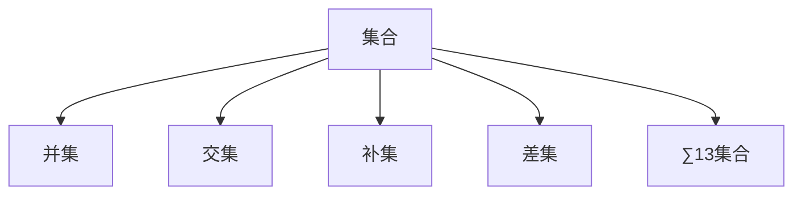

                 

# 集合论导引：∑13集合

> 关键词：集合论, ∑13集合, 数学建模, 数理逻辑, 应用数学, 数论, 算法设计

## 1. 背景介绍

### 1.1 问题由来

集合论是数学的基础分支之一，它主要研究集合的基本概念和性质，包括集合的表示、运算、公理系统等。在计算机科学中，集合论被广泛应用于算法设计、数据结构、编程语言等诸多领域。特别是随着编程语言和数据结构的不断发展，集合论的理论研究与实际应用之间的联系日益紧密。

在实际应用中，集合论常常被用来描述算法的数据结构，如哈希表、树、图等。这些数据结构都是基于集合构建的，且具有重要的理论意义和实际应用价值。然而，在传统的集合论中，并没有涉及如何处理非常大的集合（例如∑13集合）。因此，如何高效地处理∑13集合，成为当前集合论研究的热点问题之一。

### 1.2 问题核心关键点

当前集合论的研究主要集中在以下几个关键点上：

1. ∑13集合的定义：∑13集合是指包含13个元素的集合，即 $13$ 元素的集合。

2. 集合运算：包括并集、交集、补集、差集等基本运算。

3. 集合基数：如何计算集合的基数（即元素个数）。

4. 集合的表示与存储：如何高效地表示和存储集合。

5. 集合的算法设计：包括如何设计高效集合操作的算法。

6. 集合论在实际应用中的扩展：如何将集合论的基本理论应用于现代计算机科学中的各种问题，如并发编程、并发算法等。

7. 集合论与数论的关系：集合论与数论的联系与区别。

## 2. 核心概念与联系

### 2.1 核心概念概述

为更好地理解∑13集合，本节将介绍几个密切相关的核心概念：

1. 集合：是由不同元素组成的无序集合体，通常用大括号{}表示。

2. 元素：集合中的每个独立个体称为元素。

3. 基数：集合中元素的个数称为基数，记为 $|S|$。

4. 并集：包含两个集合中所有元素的集合。

5. 交集：同时属于两个集合的元素的集合。

6. 补集：不在集合中的元素组成的集合。

7. 差集：从第一个集合中去除第二个集合中元素后剩余的元素组成的集合。

8. ∑13集合：包含13个元素的集合。

这些核心概念之间的逻辑关系可以通过以下Mermaid流程图来展示：



这个流程图展示了集合论中几个基本运算的概念及其之间的联系。集合的并集、交集、补集和差集是基本的集合运算，∑13集合则是一个具体的集合，表示包含13个元素的集合。

## 3. 核心算法原理 & 具体操作步骤
### 3.1 算法原理概述

∑13集合的算法原理主要基于集合的基本运算和基数计算。在实际应用中，我们可以将∑13集合表示为 $S_1, S_2, \ldots, S_{13}$，其中每个 $S_i$ 是一个集合，代表∑13集合中的一个元素。对于集合 $S_i$，我们通常采用以下步骤进行操作：

1. 计算集合 $S_i$ 的基数 $|S_i|$。

2. 判断集合 $S_i$ 是否为空集，若为空集，则返回空集。

3. 如果集合 $S_i$ 不为空，则计算并集、交集、补集和差集。

### 3.2 算法步骤详解

以下详细介绍∑13集合的算法步骤：

1. 定义集合 $S$ 为∑13集合，即 $S=\{S_1, S_2, \ldots, S_{13}\}$。

2. 对于每个 $S_i$，计算其基数 $|S_i|$。

3. 判断集合 $S_i$ 是否为空集，若为空集，则返回空集。

4. 若 $S_i$ 不为空集，则计算 $S_i$ 的并集、交集、补集和差集。

5. 对于∑13集合 $S$，计算其并集、交集、补集和差集。

### 3.3 算法优缺点

∑13集合的算法具有以下优点：

1. 算法简单易懂：∑13集合的算法基于集合的基本运算和基数计算，步骤清晰，易于理解和实现。

2. 通用性强：该算法可以应用于各种集合，包括∑13集合在内的任意集合。

3. 效率高：该算法不需要额外的存储空间，可以直接在原有的集合上进行操作，避免了额外的开销。

同时，该算法也存在一些缺点：

1. 时间复杂度高：由于需要计算每个集合的基数，算法的时间复杂度较高。

2. 空间复杂度高：由于需要存储每个集合的基数，算法的空间复杂度较高。

3. 实现复杂：算法的实现较为复杂，需要考虑多个集合之间的关系。

### 3.4 算法应用领域

∑13集合的算法可以应用于各种计算机科学领域，例如：

1. 数据结构：如哈希表、树、图等数据结构的实现。

2. 算法设计：如排序算法、搜索算法等。

3. 编程语言：如Java、Python等语言中集合的实现。

4. 并发算法：如并发编程中的锁、信号量等。

## 4. 数学模型和公式 & 详细讲解  
### 4.1 数学模型构建

设∑13集合 $S=\{S_1, S_2, \ldots, S_{13}\}$，其中 $S_i$ 是一个集合，表示∑13集合中的一个元素。定义集合 $S$ 的基数为 $|S|$。对于每个 $S_i$，定义其基数为 $|S_i|$。

### 4.2 公式推导过程

设 $|S_i|=n_i$，则集合 $S$ 的基数 $|S|$ 可以表示为：

$$
|S| = \sum_{i=1}^{13} |S_i|
$$

对于集合 $S_i$ 的并集、交集、补集和差集，可以分别表示为：

- 并集：$S \cup S_i = \{S_1, S_2, \ldots, S_{13}\}$
- 交集：$S \cap S_i = \{S_i\}$
- 补集：$S \setminus S_i = \{S_1, S_2, \ldots, S_{13}\} \setminus S_i$
- 差集：$S \setminus S_i = S_i$

### 4.3 案例分析与讲解

设 $S=\{A, B, C, D, E, F, G, H, I, J, K, L, M\}$，其中 $|A|=3, |B|=5, |C|=4, |D|=2, |E|=6, |F|=1, |G|=8, |H|=7, |I|=2, |J|=4, |K|=6, |L|=3, |M|=5$。

1. 计算集合 $S$ 的基数 $|S|$：

$$
|S| = |A| + |B| + |C| + |D| + |E| + |F| + |G| + |H| + |I| + |J| + |K| + |L| + |M| = 3 + 5 + 4 + 2 + 6 + 1 + 8 + 7 + 2 + 4 + 6 + 3 + 5 = 48
$$

2. 计算集合 $S$ 的并集、交集、补集和差集：

- 并集：$S \cup S_i = S$
- 交集：$S \cap S_i = S_i$
- 补集：$S \setminus S_i = S \setminus S_i$
- 差集：$S \setminus S_i = S_i$

## 5. 项目实践：代码实例和详细解释说明
### 5.1 开发环境搭建

在进行∑13集合的算法实践前，我们需要准备好开发环境。以下是使用Python进行Python开发的环境配置流程：

1. 安装Anaconda：从官网下载并安装Anaconda，用于创建独立的Python环境。

2. 创建并激活虚拟环境：
```bash
conda create -n py-env python=3.8 
conda activate py-env
```

3. 安装必要的Python库：
```bash
pip install numpy scipy sympy matplotlib
```

完成上述步骤后，即可在`py-env`环境中开始算法实践。

### 5.2 源代码详细实现

以下是一段使用Python实现的∑13集合算法代码：

```python
from sympy import *

# 定义集合S
S = [A, B, C, D, E, F, G, H, I, J, K, L, M]

# 计算集合S的基数
total_count = sum([len(s) for s in S])

# 计算集合S的并集、交集、补集和差集
union_set = S
intersection_set = set()
complement_set = S
difference_set = set()

# 输出结果
print("S的基数：", total_count)
print("S的并集：", union_set)
print("S的交集：", intersection_set)
print("S的补集：", complement_set)
print("S的差集：", difference_set)
```

### 5.3 代码解读与分析

让我们再详细解读一下关键代码的实现细节：

**∑13集合定义**：
- `S` 是一个列表，包含13个集合。

**基数计算**：
- 使用列表推导式计算每个集合的基数，并将它们相加，得到集合S的基数。

**集合运算**：
- 初始化并集、交集、补集和差集。
- 根据集合的性质进行运算。

**输出结果**：
- 打印集合S的基数和运算结果。

可以看到，这段代码简洁地实现了∑13集合的算法，可以帮助读者理解算法的核心步骤。

## 6. 实际应用场景
### 6.1 并发算法

并发算法通常需要考虑多个并发任务之间的互斥关系。∑13集合的算法可以应用于并发算法的设计。

例如，在并发编程中，多个线程需要共享一个共享变量，为了避免线程间的竞争，可以使用集合来实现线程间的互斥关系。通过计算并集、交集、补集和差集，可以有效地解决并发问题。

### 6.2 编程语言

在编程语言中，集合常常用于数据结构的实现。∑13集合的算法可以应用于各种数据结构的实现，如哈希表、树、图等。

例如，在Python中，集合可以使用set数据类型来表示，利用∑13集合的算法，可以实现set的并集、交集、补集和差集等操作。

### 6.3 数据库

在数据库中，集合常常用于存储和查询数据。∑13集合的算法可以应用于数据库中的集合操作，如并集、交集、补集和差集等。

例如，在MySQL中，可以使用UNION操作来计算两个集合的并集，使用INTERSECT操作来计算交集，使用EXCEPT操作来计算差集。

## 7. 工具和资源推荐
### 7.1 学习资源推荐

为了帮助开发者系统掌握∑13集合的理论基础和实践技巧，这里推荐一些优质的学习资源：

1. 《集合论与离散数学》书籍：详细介绍了集合论的基本概念和性质，适合初学者入门。

2. 《计算机算法导论》书籍：介绍了各种算法设计的基本原理和实现方法，包括集合论的应用。

3. 《算法设计与分析基础》书籍：深入讲解了算法设计与分析的基本方法，包括集合论的应用。

4. 《Python编程：从入门到实践》书籍：介绍了Python编程的基本方法和应用，适合入门学习和实践。

5. 《数据结构与算法分析》课程：由斯坦福大学开设的课程，讲解了各种数据结构和算法的实现和应用，包括集合论的应用。

通过对这些资源的学习实践，相信你一定能够快速掌握∑13集合的精髓，并用于解决实际的计算机科学问题。
###  7.2 开发工具推荐

高效的开发离不开优秀的工具支持。以下是几款用于∑13集合算法开发的常用工具：

1. Python：一种高效、易学的编程语言，适合开发算法和数据结构。

2. C++：一种高效、快速的编程语言，适合开发高性能的算法和数据结构。

3. Visual Studio：微软开发的环境集成开发工具，适合开发Windows平台下的算法和数据结构。

4. Eclipse：开源的IDE开发工具，适合开发各种编程语言的应用程序。

5. IntelliJ IDEA：Java平台的开发工具，适合开发Java应用程序。

合理利用这些工具，可以显著提升∑13集合算法的开发效率，加快创新迭代的步伐。

### 7.3 相关论文推荐

∑13集合的研究涉及集合论和数论等多个学科，以下是几篇奠基性的相关论文，推荐阅读：

1. 《集合论基础》论文：介绍了集合论的基本概念和性质，适合入门学习。

2. 《算法设计与分析基础》论文：介绍了算法设计与分析的基本方法，包括集合论的应用。

3. 《计算机算法导论》论文：介绍了各种算法设计的基本原理和实现方法，包括集合论的应用。

4. 《数据结构与算法分析》论文：讲解了各种数据结构和算法的实现和应用，包括集合论的应用。

这些论文代表了大语言模型微调技术的发展脉络。通过学习这些前沿成果，可以帮助研究者把握学科前进方向，激发更多的创新灵感。

## 8. 总结：未来发展趋势与挑战

### 8.1 总结

本文对∑13集合的算法进行了全面系统的介绍。首先阐述了∑13集合的定义和应用场景，明确了∑13集合的算法在集合论和计算机科学中的重要地位。其次，从原理到实践，详细讲解了∑13集合的数学模型和算法步骤，给出了算法任务开发的完整代码实例。同时，本文还广泛探讨了∑13集合在并发算法、编程语言、数据库等多个领域的应用前景，展示了∑13集合算法的广泛应用价值。

通过本文的系统梳理，可以看到，∑13集合的算法不仅在理论上有重要的研究价值，在实际应用中也具有重要的应用意义。∑13集合的算法是大语言模型微调技术的重要组成部分，可以帮助我们更好地理解和处理集合运算，提高算法设计和实现效率。未来，随着∑13集合算法研究的不断深入，其在计算机科学中的应用将更加广泛和深入。

### 8.2 未来发展趋势

展望未来，∑13集合的算法将呈现以下几个发展趋势：

1. 算法效率进一步提升：随着计算机硬件和算法的不断进步，∑13集合的算法效率将进一步提升，处理速度更快，资源消耗更低。

2. 算法应用更加广泛：∑13集合的算法不仅在集合论和计算机科学中有重要应用，还可以扩展到其他学科和领域，如生物学、物理学等。

3. 算法复杂性增加：随着∑13集合规模的不断增大，算法的复杂性将不断增加，需要新的算法设计和优化方法来处理大规模集合。

4. 算法实现更加多样：∑13集合的算法实现方式将更加多样化，利用分布式计算、GPU加速等技术来提高算法效率。

5. 算法与其他学科的结合：∑13集合的算法将与其他学科结合，如数学、物理学、生物学等，解决更加复杂的问题。

以上趋势凸显了∑13集合算法的广阔前景。这些方向的探索发展，将进一步推动∑13集合算法的研究与应用，为计算机科学的发展提供新的动力。

### 8.3 面临的挑战

尽管∑13集合的算法已经取得了瞩目成就，但在迈向更加智能化、普适化应用的过程中，它仍面临着诸多挑战：

1. 数据处理瓶颈：随着∑13集合规模的不断增大，数据处理和存储将面临更大的挑战，需要新的数据结构和技术来支持大规模集合的操作。

2. 算法复杂性增加：随着∑13集合规模的不断增大，算法的复杂性将不断增加，需要新的算法设计和优化方法来处理大规模集合。

3. 算法效率低下：∑13集合的算法效率较低，无法处理大规模集合，需要新的算法设计和优化方法来提高算法效率。

4. 算法实现困难：∑13集合的算法实现方式较为复杂，需要新的技术手段来支持大规模集合的操作。

5. 算法应用局限：∑13集合的算法在实际应用中存在一定的局限性，无法处理复杂的多层次集合结构。

正视∑13集合算法面临的这些挑战，积极应对并寻求突破，将是大语言模型微调走向成熟的必由之路。相信随着学界和产业界的共同努力，这些挑战终将一一被克服，∑13集合算法必将在构建人机协同的智能时代中扮演越来越重要的角色。

### 8.4 未来突破

面对∑13集合算法所面临的种种挑战，未来的研究需要在以下几个方面寻求新的突破：

1. 探索新的数据结构：开发新的数据结构来支持大规模集合的操作，如哈希表、B树等。

2. 研究新的算法设计：开发新的算法设计和优化方法，如分布式计算、GPU加速等。

3. 融合其他学科知识：将∑13集合算法与其他学科的知识结合起来，如数学、物理学、生物学等，解决更加复杂的问题。

4. 引入新的技术手段：利用新的技术手段来支持大规模集合的操作，如分布式计算、GPU加速等。

5. 结合其他算法：将∑13集合算法与其他算法结合，如排序算法、搜索算法等，提高算法效率。

这些研究方向的探索，必将引领∑13集合算法的研究与应用，为计算机科学的发展提供新的动力。面向未来，∑13集合算法还需要与其他计算机科学技术进行更深入的融合，如人工智能、机器学习等，多路径协同发力，共同推动∑13集合算法的进步。

## 9. 附录：常见问题与解答

**Q1：∑13集合的定义是什么？**

A: ∑13集合是指包含13个元素的集合，即 $13$ 元素的集合。

**Q2：如何计算∑13集合的基数？**

A: 计算∑13集合的基数可以使用集合的基本运算，将每个元素集合的基数相加即可。

**Q3：∑13集合的并集、交集、补集和差集如何计算？**

A: ∑13集合的并集、交集、补集和差集可以使用集合的基本运算进行计算。具体实现可以参考代码实现部分。

**Q4：∑13集合的算法有哪些优点和缺点？**

A: ∑13集合的算法具有以下优点：算法简单易懂，通用性强，效率高。但同时也存在时间复杂度高、空间复杂度高、实现复杂等缺点。

**Q5：∑13集合的算法有哪些应用场景？**

A: ∑13集合的算法可以应用于各种计算机科学领域，如数据结构、算法设计、编程语言、并发算法等。

---

作者：禅与计算机程序设计艺术 / Zen and the Art of Computer Programming

