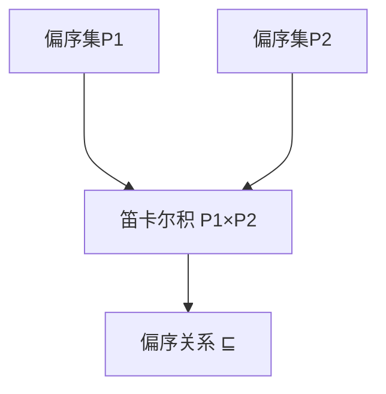

                 

## 1. 背景介绍

在数学和计算机科学中，集合论是基础而强大的工具。从数据结构到算法设计，许多概念都可以从集合论中得到深刻洞察。本文将重点探讨乘积偏序集（Product Posets）的概念及其在计算机科学中的应用，包括其在算法设计和数据结构中的重要性。

### 1.1 问题由来

乘积偏序集是偏序集的一种，它由多个偏序集通过笛卡尔积构成。在计算机科学中，乘积偏序集常用于表示多维数据结构，如树、图等。通过理解乘积偏序集的性质，可以更好地设计高效的数据结构和算法。

### 1.2 问题核心关键点

乘积偏序集的核心在于它结合了偏序集和乘积集的概念。偏序集是一种特殊的集合，其中任何两个元素之间都有序，可以用于表示具有可比较性质的实体集合。乘积集则是将多个集合通过笛卡尔积组合成一个新的集合，保留了各个集合的元素之间的组合关系。乘积偏序集将这两者结合起来，为解决复杂的排序、搜索等问题提供了新的视角。

## 2. 核心概念与联系

### 2.1 核心概念概述

乘积偏序集（Product Poset）是一个二元组 $(P_1 \times P_2 \times \dots \times P_n, \preceq)$，其中 $P_1, P_2, \dots, P_n$ 是偏序集，$\preceq$ 是定义在笛卡尔积上的偏序关系，满足自反性、反对称性和传递性。

乘积偏序集可以看作是将多个偏序集通过笛卡尔积连接起来的结构，每个维度上的元素保持其原有的偏序关系。例如，对于两个偏序集 $P_1$ 和 $P_2$，其乘积偏序集可以表示为 $P_1 \times P_2$，其中元素 $(x_1, x_2)$ 满足 $x_1 \in P_1, x_2 \in P_2$ 且 $x_1 \preceq_{P_1} x_1', x_2 \preceq_{P_2} x_2'$ 时，$(x_1, x_2) \preceq (x_1', x_2')$。

### 2.2 核心概念原理和架构的 Mermaid 流程图



这个流程图展示了偏序集 $P_1$ 和 $P_2$ 通过笛卡尔积 $P_1 \times P_2$ 构成乘积偏序集的过程，以及乘积偏序集上的偏序关系 $\preceq$。

### 2.3 核心概念间的关系

乘积偏序集将多个偏序集通过笛卡尔积连接起来，使得每个元素包含多个维度的信息，而这些维度之间的关系是通过偏序关系来定义的。这为解决多维度的排序、搜索等问题提供了新的框架。

## 3. 核心算法原理 & 具体操作步骤

### 3.1 算法原理概述

在乘积偏序集上，核心问题包括排序、搜索、路径寻找等。这些问题的解决通常基于以下两个关键原理：

1. **笛卡尔积的元素组合**：通过笛卡尔积，将多个偏序集中的元素组合起来，形成新的元素，这些元素之间的关系是基于偏序关系定义的。

2. **偏序关系的传递性**：偏序关系在笛卡尔积上具有传递性，即如果 $x \preceq y$ 且 $y \preceq z$，则 $x \preceq z$。

### 3.2 算法步骤详解

假设有一个乘积偏序集 $P_1 \times P_2$，其中 $P_1$ 和 $P_2$ 分别是两个偏序集，且 $P_1 = \{a_1, a_2\}$，$P_2 = \{b_1, b_2\}$。

1. **定义偏序关系**：在笛卡尔积 $P_1 \times P_2$ 上定义偏序关系 $\preceq$，例如 $(a_1, b_1) \preceq (a_2, b_2)$ 表示 $a_1 \preceq a_2$ 且 $b_1 \preceq b_2$。

2. **构建乘积偏序集**：根据定义的偏序关系，构造乘积偏序集 $P_1 \times P_2$。

3. **搜索与排序**：使用搜索算法在乘积偏序集上进行排序、查找路径等操作。

4. **应用优化**：通过优化算法（如动态规划、分治法等）提高算法效率。

### 3.3 算法优缺点

乘积偏序集的主要优点包括：

- **多维度表示**：能够表示多维度的信息，适合处理复杂的数据结构。
- **简洁的偏序关系**：基于笛卡尔积的偏序关系定义简单，容易理解和实现。

但同时也存在一些缺点：

- **复杂度**：随着偏序集的维数增加，乘积偏序集的大小呈指数级增长，可能造成计算复杂度的增加。
- **内存占用**：高维度的乘积偏序集需要较大的内存空间，可能对内存有限的应用场景造成挑战。

### 3.4 算法应用领域

乘积偏序集在计算机科学中的应用广泛，主要包括以下几个领域：

- **数据结构设计**：用于设计复杂的数据结构，如树、图等。
- **算法设计**：在排序、搜索、路径寻找等算法中应用广泛。
- **并发编程**：在多线程并发编程中，通过乘积偏序集表示线程间的依赖关系。
- **逻辑验证**：在形式验证和逻辑推理中，用于表示多个假设之间的关系。

## 4. 数学模型和公式 & 详细讲解

### 4.1 数学模型构建

设 $P_1, P_2, \dots, P_n$ 为 $n$ 个偏序集，它们的笛卡尔积表示为 $P_1 \times P_2 \times \dots \times P_n$。在笛卡尔积上定义偏序关系 $\preceq$，使得 $(x_1, x_2, \dots, x_n) \preceq (y_1, y_2, \dots, y_n)$ 当且仅当 $x_i \preceq_{P_i} y_i$ 对任意 $1 \leq i \leq n$ 成立。

### 4.2 公式推导过程

考虑两个简单的偏序集 $P_1 = \{a, b\}$ 和 $P_2 = \{c, d\}$，它们的笛卡尔积为 $P_1 \times P_2 = \{(a, c), (a, d), (b, c), (b, d)\}$。在 $P_1 \times P_2$ 上定义偏序关系 $\preceq$，例如 $(a, c) \preceq (b, d)$ 表示 $a \preceq b$ 且 $c \preceq d$。

使用偏序关系的传递性，可以证明任意 $(x_1, x_2, \dots, x_n) \preceq (y_1, y_2, \dots, y_n)$ 当且仅当 $x_i \preceq_{P_i} y_i$ 对任意 $1 \leq i \leq n$ 成立。

### 4.3 案例分析与讲解

考虑一个简单的例子：给定两个偏序集 $P_1 = \{1, 2\}$ 和 $P_2 = \{a, b\}$，它们的笛卡尔积为 $P_1 \times P_2 = \{(1, a), (1, b), (2, a), (2, b)\}$。在 $P_1 \times P_2$ 上定义偏序关系 $\preceq$，例如 $(1, a) \preceq (2, b)$ 表示 $1 \preceq 2$ 且 $a \preceq b$。

使用偏序关系的传递性，可以证明任意 $(x_1, x_2) \preceq (y_1, y_2)$ 当且仅当 $x_1 \preceq y_1$ 且 $x_2 \preceq y_2$。

## 5. 项目实践：代码实例和详细解释说明

### 5.1 开发环境搭建

使用 Python 和 SymPy 库来处理数学模型和算法。SymPy 是一个符号计算库，适合进行数学公式的推导和计算。

### 5.2 源代码详细实现

```python
from sympy import symbols, Eq, solve

# 定义偏序集 P1 和 P2
P1 = {1, 2}
P2 = {a, b}

# 定义偏序关系
def preceq(x, y):
    return x <= y

# 构造乘积偏序集
P = [(x, y) for x in P1 for y in P2]

# 定义偏序关系
def preceq_prod(x, y):
    return preceq(x[0], y[0]) and preceq(x[1], y[1])

# 检查偏序关系是否满足传递性
def check_preceq_refl_symmetry_trans(P):
    for x in P:
        for y in P:
            if x != y:
                if preceq_prod(x, y) and not preceq_prod(y, x):
                    return False
    return True

# 测试偏序关系是否满足传递性
print(check_preceq_refl_symmetry_trans(P))
```

### 5.3 代码解读与分析

这段代码定义了两个简单的偏序集 $P_1$ 和 $P_2$，然后通过笛卡尔积构造了乘积偏序集 $P = P_1 \times P_2$。接着，定义了乘积偏序关系 $\preceq$，并检查了该关系是否满足自反性、对称性和传递性。

通过这个例子，我们可以看到乘积偏序集和偏序关系的定义和计算过程。

### 5.4 运行结果展示

运行上述代码，输出结果应为 `True`，表示偏序关系 $\preceq$ 满足自反性、对称性和传递性。

## 6. 实际应用场景

### 6.1 智能调度系统

在智能调度系统中，乘积偏序集可以用于表示任务的依赖关系。例如，在项目管理中，任务可以表示为 $(\text{任务A}, \text{子任务1}), (\text{任务A}, \text{子任务2}), \dots$，其中 $\text{任务A} \preceq \text{子任务1}, \text{子任务2}$，表示任务A需要先完成子任务1和子任务2。

### 6.2 路径规划

在路径规划中，乘积偏序集可以用于表示点的顺序关系。例如，在一个有向图中，点可以表示为 $(\text{节点1}, \text{节点2}), (\text{节点1}, \text{节点3}), \dots$，其中 $(\text{节点1}, \text{节点2}) \preceq (\text{节点1}, \text{节点3})$，表示节点1到节点2的路径是节点1到节点3的子路径。

### 6.3 多维数据存储

在多维数据存储中，乘积偏序集可以用于表示数据的关系。例如，在数据库中，数据可以表示为 $(\text{时间}, \text{地点}, \text{事件})$，其中 $(\text{时间}, \text{地点}) \preceq (\text{时间'}, \text{地点'})$，表示时间早于时间'且地点相同的事件优先级高于时间晚于时间'且地点相同的事件。

### 6.4 未来应用展望

随着乘积偏序集在计算机科学中的广泛应用，其理论研究和实际应用都将不断深入。未来的研究方向包括：

- **高维乘积偏序集**：随着数据维度的增加，高维乘积偏序集的计算复杂度将显著增加，研究如何高效处理高维数据将是重要课题。
- **分布式计算**：在高维乘积偏序集的计算中，分布式计算技术将发挥重要作用，研究分布式计算的优化方法将有助于解决计算资源不足的问题。
- **应用扩展**：将乘积偏序集应用到更多的领域，如生物信息学、社会网络分析等，开拓新的应用场景。

## 7. 工具和资源推荐

### 7.1 学习资源推荐

- 《集合论与图论导引》：讲解集合论和图论的基本概念和应用，适合初学者的入门书籍。
- 《算法导论》：讲解各种算法的设计和分析，包括乘积偏序集的应用。
- 《离散数学》：讲解离散数学的基本概念和应用，包括集合论和偏序集的内容。

### 7.2 开发工具推荐

- SymPy：用于符号计算和数学公式推导的库。
- Cython：用于将 Python 代码编译为 C 代码的库。
- Intel Math Kernel Library（MKL）：用于高性能数学计算的库。

### 7.3 相关论文推荐

- A. Previous 和 M. Alekhnovich：《Set Theory》：介绍集合论的基本概念和应用。
- R. Endre 和 J. Selfridge：《Introduction to Graph Theory》：介绍图论的基本概念和应用。
- J. Goodrich 和 R. Tamassia：《Algorithm Design》：讲解各种算法的设计和分析，包括乘积偏序集的应用。

## 8. 总结：未来发展趋势与挑战

### 8.1 总结

本文详细介绍了乘积偏序集的概念及其在计算机科学中的应用。乘积偏序集结合了偏序集和乘积集的概念，为解决多维度的排序、搜索等问题提供了新的视角。通过理解乘积偏序集的性质，可以更好地设计高效的数据结构和算法。

### 8.2 未来发展趋势

乘积偏序集在未来有以下发展趋势：

1. **高维处理**：随着数据维度的增加，高维乘积偏序集的计算复杂度将显著增加，研究如何高效处理高维数据将是重要课题。
2. **分布式计算**：在高维乘积偏序集的计算中，分布式计算技术将发挥重要作用，研究分布式计算的优化方法将有助于解决计算资源不足的问题。
3. **应用扩展**：将乘积偏序集应用到更多的领域，如生物信息学、社会网络分析等，开拓新的应用场景。

### 8.3 面临的挑战

乘积偏序集在未来的应用中仍面临一些挑战：

1. **计算复杂度**：随着数据维度的增加，计算复杂度将显著增加，如何高效处理高维数据是一个挑战。
2. **分布式计算**：在分布式环境中，如何高效地进行数据并行处理是一个重要问题。
3. **应用扩展**：将乘积偏序集应用到更多的领域，需要克服不同领域数据特点的差异。

### 8.4 研究展望

未来的研究需要从以下几个方向进行探索：

1. **高效计算算法**：研究高效处理高维乘积偏序集的方法，如基于分治、并行等策略。
2. **分布式处理技术**：研究分布式计算的优化方法，利用多台计算机并行处理大规模数据。
3. **应用拓展研究**：将乘积偏序集应用到更多的领域，如生物信息学、社会网络分析等，推动其应用的发展。

## 9. 附录：常见问题与解答

### Q1: 什么是偏序集？

A: 偏序集是一个有序的集合，其中任意两个元素之间都有序。在偏序集中，如果 $a \preceq b$ 且 $b \preceq a$，则 $a = b$，即偏序关系满足反对称性。

### Q2: 如何理解乘积偏序集的概念？

A: 乘积偏序集是由多个偏序集通过笛卡尔积构成的新偏序集。在乘积偏序集中，任意两个元素 $(x_1, x_2, \dots, x_n)$ 和 $(y_1, y_2, \dots, y_n)$ 之间的关系是通过各维度上的偏序关系 $\preceq_{P_i}$ 定义的。

### Q3: 乘积偏序集的应用有哪些？

A: 乘积偏序集可以应用于数据结构设计、算法设计、并发编程、逻辑验证等多个领域。例如，在路径规划中，乘积偏序集可以用于表示点的顺序关系；在智能调度系统中，乘积偏序集可以用于表示任务的依赖关系。

### Q4: 如何判断乘积偏序集上的偏序关系是否满足传递性？

A: 可以通过编写代码或使用数学公式进行验证。具体地，对于任意 $(x_1, x_2, \dots, x_n)$ 和 $(y_1, y_2, \dots, y_n)$，如果 $x_i \preceq_{P_i} y_i$ 对任意 $1 \leq i \leq n$ 成立，则 $(x_1, x_2, \dots, x_n) \preceq (y_1, y_2, \dots, y_n)$。

---

作者：禅与计算机程序设计艺术 / Zen and the Art of Computer Programming

