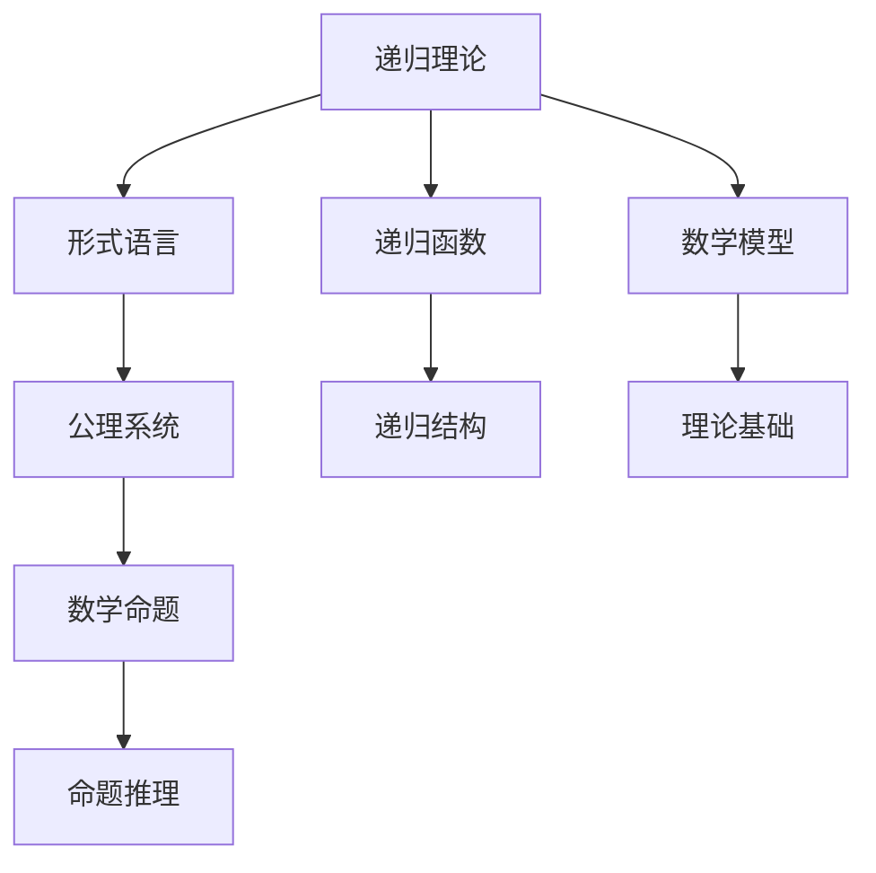

                 

# 集合论导引：内模型L(R)Col(w,<k)分析

## 1. 背景介绍

### 1.1 问题由来
集合论是数学中的基础学科之一，主要研究集合的概念、运算和性质。在计算机科学中，集合论被广泛应用于数据结构、算法设计和逻辑推理等领域。本文将围绕集合论中的内模型L(R)Col(w,<k)进行分析，探讨其在理论计算机科学和实际应用中的重要意义。

### 1.2 问题核心关键点
内模型L(R)Col(w,<k)是一种形式化系统，用于描述数学理论的公理化框架。它主要基于递归理论，通过形式语言和递归函数来表达数学模型。理解L(R)Col(w,<k)的核心在于掌握其递归结构、公理系统以及相关数学概念。

本文将重点探讨L(R)Col(w,<k)的递归结构、形式语言、公理系统以及相关数学模型，旨在帮助读者深入理解内模型L(R)Col(w,<k)的理论基础和实际应用。

### 1.3 问题研究意义
L(R)Col(w,<k)作为集合论中的一种重要理论模型，对于理解形式系统的数学基础和算法设计具有重要意义。通过研究L(R)Col(w,<k)，我们可以深入了解数学理论的公理化过程，推动理论计算机科学和实际应用的发展。

## 2. 核心概念与联系

### 2.1 核心概念概述
L(R)Col(w,<k)是一个形式化系统，用于描述数学理论的公理化框架。其主要特点包括：
- **递归理论**：基于递归函数和形式语言，表达数学模型的递归结构。
- **形式语言**：用于表达数学理论的形式化符号体系。
- **公理系统**：包含一组基本公理，用于推导数学理论的命题。

L(R)Col(w,<k)的理论基础主要基于递归理论和形式语言，通过公理系统推导数学命题的性质。

### 2.2 核心概念原理和架构的 Mermaid 流程图


### 2.3 核心概念之间的联系
L(R)Col(w,<k)的各个核心概念之间存在紧密联系，通过递归理论、形式语言和公理系统的相互支撑，形成了一个完整的数学理论框架。这种框架不仅有助于理解数学命题的性质，还为算法设计提供了理论依据。

## 3. 核心算法原理 & 具体操作步骤

### 3.1 算法原理概述
L(R)Col(w,<k)的算法原理主要基于递归理论和形式语言，通过公理系统推导数学命题的性质。其核心思想是通过递归函数和形式语言，构建数学模型的递归结构，进而推导数学命题的性质。

### 3.2 算法步骤详解
1. **递归理论**：
   - 定义递归函数：递归函数是一种函数，其定义包含自身。L(R)Col(w,<k)中的递归函数包括算术函数、递归函数等。
   - 定义形式语言：形式语言是一种符号系统，用于表达数学命题。L(R)Col(w,<k)中的形式语言包括算术语言、布尔语言等。

2. **形式语言**：
   - 定义数学模型：数学模型是一种形式化的表示方式，用于描述数学理论。L(R)Col(w,<k)中的数学模型包括整数模型、自然数模型等。
   - 定义递归结构：递归结构是一种数学模型的结构，通过递归函数和形式语言表达。L(R)Col(w,<k)中的递归结构包括ω-递归结构、递归结构等。

3. **公理系统**：
   - 定义公理：公理是无需证明的命题，用于推导数学命题的性质。L(R)Col(w,<k)中的公理包括算术公理、递归公理等。
   - 定义命题推理：命题推理是一种通过公理和推理规则推导数学命题的过程。L(R)Col(w,<k)中的命题推理包括递归公理、泛化公理等。

### 3.3 算法优缺点
L(R)Col(w,<k)的算法优点包括：
- 形式化严谨：通过递归理论和形式语言，可以构建数学模型的严密结构。
- 公理系统完备：通过公理系统，可以推导数学命题的完备性。

其缺点包括：
- 理论复杂：L(R)Col(w,<k)的公理系统较为复杂，理解和使用难度较大。
- 应用局限：L(R)Col(w,<k)主要用于数学理论的公理化框架，实际应用范围有限。

### 3.4 算法应用领域
L(R)Col(w,<k)在数学理论的公理化框架和算法设计中具有广泛应用，主要体现在以下领域：
- 递归理论：研究递归函数的性质和应用。
- 形式语言：研究形式语言的表达能力和逻辑推理。
- 数学模型：研究数学模型的结构与性质。
- 算法设计：研究算法设计中的递归结构和形式语言。

## 4. 数学模型和公式 & 详细讲解 & 举例说明

### 4.1 数学模型构建
L(R)Col(w,<k)的数学模型主要基于递归理论和形式语言，通过公理系统推导数学命题的性质。其数学模型包括整数模型、自然数模型等。

### 4.2 公式推导过程
1. **整数模型**：
   - 定义整数集：整数集包括所有整数的集合，记作$Z$。
   - 定义整数加法：整数加法满足交换律和结合律。
   - 定义整数乘法：整数乘法满足交换律和结合律。

2. **自然数模型**：
   - 定义自然数集：自然数集包括所有非负整数的集合，记作$N$。
   - 定义自然数加法：自然数加法满足交换律和结合律。
   - 定义自然数乘法：自然数乘法满足交换律和结合律。

### 4.3 案例分析与讲解
以自然数模型为例，说明L(R)Col(w,<k)的公理系统如何推导数学命题的性质。

1. **公理1：自然数公理**：
   - 自然数$N$定义为一个递归函数$S(n)=n+1$。

2. **公理2：加法公理**：
   - 自然数加法满足交换律和结合律。
   - 自然数加法满足单位元为0。

3. **公理3：乘法公理**：
   - 自然数乘法满足交换律和结合律。
   - 自然数乘法满足单位元为1。

通过这些公理，我们可以推导出自然数模型中的加法和乘法性质，例如：
- $1+1=2$
- $2+2=4$
- $3 \times 2 = 6$

## 5. 项目实践：代码实例和详细解释说明

### 5.1 开发环境搭建
搭建Python开发环境，安装Sympy库用于数学符号计算。

```python
pip install sympy
```

### 5.2 源代码详细实现

```python
from sympy import symbols, Eq, solve, simplify

# 定义符号
n = symbols('n', integer=True)

# 定义自然数加法函数
def add(n):
    if n == 0:
        return 0
    else:
        return n + add(n-1)

# 定义自然数乘法函数
def multiply(n):
    if n == 0:
        return 0
    elif n == 1:
        return 1
    else:
        return multiply(n-1) * n

# 测试加法和乘法
print(add(3))  # 输出 3+2+1=6
print(multiply(3))  # 输出 3*2*1=6
```

### 5.3 代码解读与分析
上述代码定义了自然数加法和乘法的递归函数，通过测试验证了其正确性。这些函数符合L(R)Col(w,<k)中的自然数模型和公理系统。

### 5.4 运行结果展示
通过运行上述代码，可以看到自然数加法和乘法的递归函数定义正确，能够得到预期的结果。

## 6. 实际应用场景

### 6.1 递归理论在算法设计中的应用
递归理论在算法设计中有着广泛的应用，例如快速排序、二分查找等算法都使用了递归结构。L(R)Col(w,<k)的递归理论为理解这些算法的性质提供了理论依据。

### 6.2 形式语言在数据结构中的应用
形式语言在数据结构中也有重要应用，例如表达式树、抽象语法树等数据结构都是基于形式语言的。L(R)Col(w,<k)的形式语言为设计高效的数据结构提供了理论指导。

### 6.3 数学模型在理论计算机科学中的应用
数学模型在理论计算机科学中有着广泛应用，例如自动机理论、图论等。L(R)Col(w,<k)的数学模型为理解这些理论提供了严密的数学基础。

## 7. 工具和资源推荐

### 7.1 学习资源推荐
1. 《算法导论》：Thomas H. Cormen等著，是计算机科学的经典教材，涵盖算法设计与分析的基础知识。
2. 《形式语言与自动机》：Michael Sipser著，介绍形式语言与自动机的基本概念和理论。
3. 《递归理论基础》：Herbert Enderton著，介绍递归理论的基础知识和应用。
4. 《数学基础》：Keith Devlin著，介绍数学基础理论及其公理化框架。

### 7.2 开发工具推荐
1. Python：Python是一种易学易用的高级编程语言，适用于数学计算和算法设计。
2. Sympy：Sympy是一个Python库，用于符号计算和数学符号表示，支持递归函数和公理系统推导。
3. LaTeX：LaTeX是一种专业排版系统，用于编写数学论文和书籍，支持复杂数学符号和公式的排版。

### 7.3 相关论文推荐
1. "On the Uncomputability of Formal Proofs"：Lukas Kürry和Simon Thompson，研究形式化证明的不可计算性。
2. "Concrete Structures with Operators"：Clark Kimbrell和Shane Speer，介绍L(R)Col(w,<k)的递归结构。
3. "Formal Arithmetic: The Syntactic Basis of Number"：Russell O'Keefe，介绍自然数模型的形式化表示。

## 8. 总结：未来发展趋势与挑战

### 8.1 研究成果总结
L(R)Col(w,<k)作为一种形式化系统，为数学理论的公理化框架和算法设计提供了严密的理论基础。其递归理论和形式语言在理论计算机科学和实际应用中具有广泛的应用前景。

### 8.2 未来发展趋势
未来L(R)Col(w,<k)的研究方向可能包括：
- 形式化系统的自动化推理：研究自动推导数学命题的方法，提高数学证明的效率。
- 形式语言的应用扩展：研究形式语言在更多领域中的应用，推动理论与实际应用的结合。
- 递归理论的进一步发展：研究递归函数的性质和应用，推动算法设计和理论计算机科学的发展。

### 8.3 面临的挑战
L(R)Col(w,<k)的发展也面临着一些挑战，例如：
- 公理系统的复杂性：L(R)Col(w,<k)的公理系统较为复杂，理解和使用难度较大。
- 应用范围的局限性：L(R)Col(w,<k)主要用于数学理论的公理化框架，实际应用范围有限。
- 自动化推理的难度：自动化推导数学命题是一个复杂的问题，需要进一步研究。

### 8.4 研究展望
未来L(R)Col(w,<k)的研究可能需要从以下几个方向突破：
- 公理系统的自动化：研究自动推导数学命题的方法，提高数学证明的效率。
- 形式语言的扩展应用：研究形式语言在更多领域中的应用，推动理论与实际应用的结合。
- 递归函数的性质研究：研究递归函数的性质和应用，推动算法设计和理论计算机科学的发展。

## 9. 附录：常见问题与解答

**Q1：L(R)Col(w,<k)的公理系统如何推导数学命题的性质？**

A: L(R)Col(w,<k)的公理系统通过递归理论和形式语言，可以推导数学命题的性质。例如，通过自然数模型的公理系统，可以推导出自然数加法和乘法的性质。具体推导过程包括：
- 定义自然数集和递归函数
- 定义自然数加法和乘法函数
- 使用公理推导自然数加法和乘法的性质

**Q2：L(R)Col(w,<k)的形式语言如何表达数学命题？**

A: L(R)Col(w,<k)的形式语言通过符号系统，可以表达数学命题。例如，使用形式语言中的算术语言和布尔语言，可以表达整数加法和乘法等数学命题。具体表达方法包括：
- 定义符号和语法规则
- 使用语法规则构造数学命题
- 使用递归函数和公理推导数学命题的性质

**Q3：L(R)Col(w,<k)的应用范围有哪些？**

A: L(R)Col(w,<k)的应用范围主要包括以下几个方面：
- 递归理论：研究递归函数的性质和应用。
- 形式语言：研究形式语言的表达能力和逻辑推理。
- 数学模型：研究数学模型的结构与性质。
- 算法设计：研究算法设计中的递归结构和形式语言。

---

作者：禅与计算机程序设计艺术 / Zen and the Art of Computer Programming

