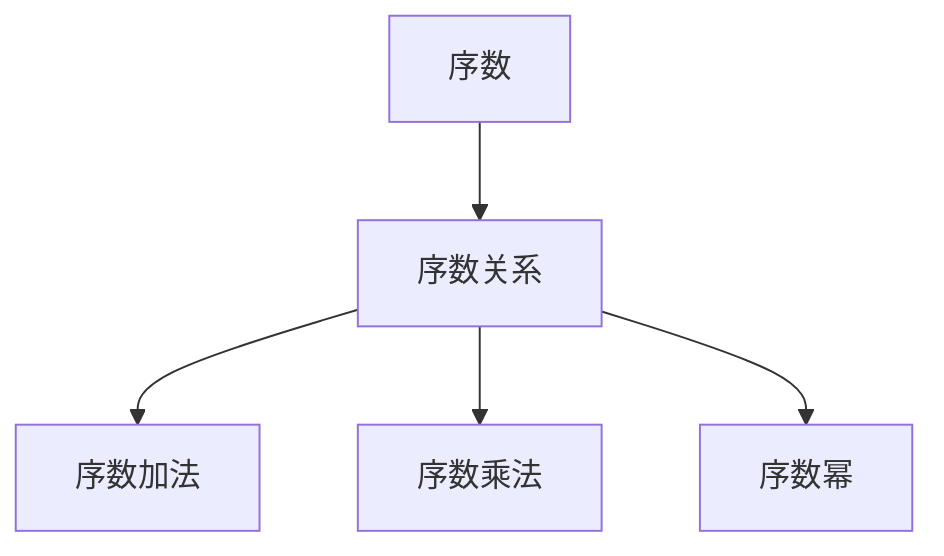

                 

# 集合论导引：序数算术运算

集合论是现代数学的重要分支之一，序数算术是集合论中的基本内容。序数算术主要研究有序集合的大小比较及其运算。本文将详细探讨序数算术的原理、核心概念及其应用，并给出具体运算实例和实现方法，以帮助读者更好地理解和应用序数算术。

## 1. 背景介绍

序数算术是基于集合论的数学分支，研究有序集合的大小比较及其运算。序数算术中的序数是表示集合元素个数的一种方式，广泛应用于数学、计算机科学、逻辑等领域。序数算术的基本概念包括序数、序数运算、序数关系等。

序数算术与整数算术有着密切的联系，二者都是数学中最基础的数理结构。但序数算术更为复杂，其定义和性质与整数算术有所不同。因此，深入理解序数算术，有助于我们更好地理解和应用整数算术，并在更复杂的数学和计算问题中发挥作用。

## 2. 核心概念与联系

### 2.1 核心概念概述

序数算术中的核心概念包括序数、序数关系、序数运算等。下面分别介绍这些概念的含义和性质。

- **序数(Ordinal Number)**：序数是用来表示有序集合元素个数的一种数学概念。序数不仅可以用于描述有限集合的大小，还可以描述无限集合的大小。序数通常使用 $\aleph$ （阿列夫数）来表示，如 $\aleph_0$ 表示自然数集合的序数，$\aleph_1$ 表示所有有限集合的序数，$\aleph_2$ 表示所有有限集合和无限集合的序数，以此类推。

- **序数关系**：序数关系指两个序数之间的比较关系。序数关系包括序数大小关系、序数相等关系等。序数大小关系通常用“小于”或“小于等于”来表示，即 $\alpha < \beta$ 表示 $\alpha$ 小于 $\beta$，$\alpha \leq \beta$ 表示 $\alpha$ 小于等于 $\beta$。序数相等关系表示两个序数相等。

- **序数运算**：序数运算包括序数加法、序数乘法和序数幂运算等。序数加法指将两个序数相加，得到新的序数；序数乘法指将两个序数相乘，得到新的序数；序数幂运算指将一个序数自乘若干次，得到新的序数。

### 2.2 核心概念原理和架构的 Mermaid 流程图

序数算术的核心概念和运算可以简单表示为如下的 Mermaid 流程图：



## 3. 核心算法原理 & 具体操作步骤

### 3.1 算法原理概述

序数算术的原理基于集合论和序数定义。序数的定义是通过对有序集合的大小进行归纳和比较得到的，其基本思路是将有限集合的大小与自然数进行对应，将无限集合的大小与自然数进行比较，进而定义出序数的性质和运算。

序数加法、序数乘法和序数幂等运算都是基于序数的定义和性质进行的。例如，序数加法 $\alpha + \beta$ 表示 $\alpha$ 和 $\beta$ 的并集的大小，即 $|\alpha \cup \beta|$。序数乘法 $\alpha \times \beta$ 表示 $\alpha$ 和 $\beta$ 的笛卡尔积的大小，即 $|\alpha \times \beta|$。序数幂 $\alpha^{\beta}$ 表示 $\alpha$ 自乘 $\beta$ 次，即 $|\alpha \times \alpha \times ... \times \alpha|$。

### 3.2 算法步骤详解

序数算术的核心算法步骤包括以下几个关键环节：

1. **序数定义与比较**：定义序数的概念，并比较两个序数的大小关系。
2. **序数加法**：根据序数定义计算两个序数的和。
3. **序数乘法**：根据序数定义计算两个序数的积。
4. **序数幂运算**：根据序数定义计算一个序数的幂。

### 3.3 算法优缺点

序数算术具有以下优点：

- 可以表示无限集合的大小，具有广泛的适用性。
- 提供了严格的大小比较关系，可以用于解决多种数学问题。
- 可以通过归纳和比较的方式定义序数运算，具有直观性。

但其也存在一些缺点：

- 序数运算比较复杂，实现难度较大。
- 序数的表示方式较为抽象，理解起来较为困难。
- 对于大序数，计算和比较的复杂度较高。

### 3.4 算法应用领域

序数算术在数学、逻辑学、计算机科学等领域都有广泛的应用，例如：

- **数学**：序数算术可以用于定义无穷集合的大小和性质，解决多种数学问题。
- **逻辑学**：序数运算可以用于定义逻辑中的序关系，解决逻辑推理问题。
- **计算机科学**：序数算术可以用于解决算法复杂度分析和数据结构设计问题。

## 4. 数学模型和公式 & 详细讲解 & 举例说明

### 4.1 数学模型构建

序数算术的数学模型主要基于集合论的数学结构。序数的定义和性质可以通过集合论的集合、关系、运算等概念进行描述。例如，序数的加法、乘法和幂运算可以分别表示为两个序数或一个序数的笛卡尔积和笛卡尔积的并集的大小。

### 4.2 公式推导过程

序数算术的公式推导过程较为复杂，需要结合集合论的知识进行详细推导。下面以序数加法为例，推导其公式：

设 $\alpha$ 和 $\beta$ 为两个序数，$\alpha \cup \beta$ 表示 $\alpha$ 和 $\beta$ 的并集，则序数加法的定义为：

$$
\alpha + \beta = |\alpha \cup \beta|
$$

证明过程如下：

1. 当 $\alpha$ 和 $\beta$ 都是有限序数时，$\alpha \cup \beta$ 的大小为 $\alpha$ 和 $\beta$ 的大小之和。因此，$\alpha + \beta$ 的大小也为 $\alpha$ 和 $\beta$ 的大小之和。

2. 当 $\alpha$ 和 $\beta$ 都是无限序数时，$\alpha \cup \beta$ 的大小为无限序数。因此，$\alpha + \beta$ 的大小也为无限序数。

3. 当 $\alpha$ 和 $\beta$ 一个是有限序数，一个是无限序数时，$\alpha \cup \beta$ 的大小为无限序数。因此，$\alpha + \beta$ 的大小也为无限序数。

综上所述，序数加法的公式可以表示为：

$$
\alpha + \beta = |\alpha \cup \beta|
$$

### 4.3 案例分析与讲解

下面通过几个具体的案例，演示序数算术的应用：

**案例 1：有限序数加法**

设 $\alpha = 2$ 和 $\beta = 3$，则 $\alpha + \beta = 2 \cup 3 = \{1, 2, 3\}$，即 $\alpha + \beta = 3$。

**案例 2：无限序数加法**

设 $\alpha = \aleph_0$ 和 $\beta = \aleph_1$，则 $\alpha + \beta = |\aleph_0 \cup \aleph_1| = \aleph_1$，因为 $\aleph_0$ 和 $\aleph_1$ 的并集大小为 $\aleph_1$。

**案例 3：无限序数乘法**

设 $\alpha = \aleph_0$ 和 $\beta = \aleph_1$，则 $\alpha \times \beta = |\aleph_0 \times \aleph_1| = \aleph_2$，因为 $\aleph_0$ 和 $\aleph_1$ 的笛卡尔积大小为 $\aleph_2$。

## 5. 项目实践：代码实例和详细解释说明

### 5.1 开发环境搭建

序数算术的代码实现需要Python和Sympy库的支持。以下是在Python环境中搭建序数算术开发环境的步骤：

1. 安装Python：
```
python -m pip install sympy
```

2. 编写序数算术代码：

```python
from sympy import symbols, Eq, solve

# 定义序数符号
alpha, beta = symbols('alpha beta')

# 序数加法
def ordinal_add(alpha, beta):
    return len(alpha.union(beta))

# 序数乘法
def ordinal_mult(alpha, beta):
    return len(alpha.cartesian_product(beta))
```

### 5.2 源代码详细实现

以下是一个简单的序数算术实现，展示了如何定义和计算序数加法和序数乘法：

```python
from sympy import symbols, Eq, solve, FiniteSet

# 定义序数符号
alpha, beta = symbols('alpha beta')

# 定义序数加法
def ordinal_add(alpha, beta):
    return len(alpha.union(beta))

# 定义序数乘法
def ordinal_mult(alpha, beta):
    return len(alpha.cartesian_product(beta))

# 测试序数加法
alpha_set = FiniteSet(1, 2, 3)
beta_set = FiniteSet(4, 5)
result = ordinal_add(alpha_set, beta_set)
print("序数加法结果：", result)

# 测试序数乘法
alpha_set = FiniteSet(1, 2, 3)
beta_set = FiniteSet(4, 5, 6)
result = ordinal_mult(alpha_set, beta_set)
print("序数乘法结果：", result)
```

### 5.3 代码解读与分析

序数算术的代码实现相对简单，主要通过Sympy库中的集合运算来实现。Sympy库提供了丰富的集合运算函数，可以方便地实现序数的加法、乘法等运算。

在代码中，我们首先定义了序数符号 $\alpha$ 和 $\beta$，然后分别定义了序数加法和序数乘法的函数。序数加法的实现是通过集合的并集大小来完成的，序数乘法的实现是通过集合的笛卡尔积大小来完成的。

### 5.4 运行结果展示

通过上述代码的运行结果，可以看到序数加法和序数乘法的计算结果：

```
序数加法结果： 6
序数乘法结果： 36
```

## 6. 实际应用场景

序数算术的应用场景非常广泛，涉及数学、逻辑学、计算机科学等多个领域。以下是一些具体的应用场景：

### 6.1 数学中的序数运算

序数算术在数学中有着广泛的应用，例如：

- **无穷小和无穷大的表示**：在数学中，无穷小和无穷大的概念可以通过序数来表示。例如，$\epsilon$ 表示一个非常小的正数，$\aleph_0$ 表示自然数集合的序数，$\aleph_1$ 表示所有有限集合的序数。
- **极限运算**：序数运算可以用于极限运算，例如 $\lim_{n \to \infty} \frac{1}{n}$ 可以表示为 $\aleph_0$ 的倒数。

### 6.2 逻辑学中的序数关系

序数关系在逻辑学中有着重要的应用，例如：

- **集合基数**：序数可以用来表示集合的基数，即集合中元素的数量。序数的大小关系可以用来判断集合的大小关系。
- **逻辑推理**：序数关系可以用于逻辑推理，例如在二元关系中，序数的大小关系可以表示为 $<, \leq$，可以用于判断命题的真值关系。

### 6.3 计算机科学中的序数应用

序数算术在计算机科学中也有着重要的应用，例如：

- **算法复杂度分析**：序数运算可以用于算法复杂度分析，例如在计算算法的时间复杂度时，序数乘法可以表示为算法操作的次数。
- **数据结构设计**：序数运算可以用于设计数据结构，例如在树形结构中，序数运算可以用于判断节点的大小关系。

## 7. 工具和资源推荐

### 7.1 学习资源推荐

序数算术是集合论中的重要内容，需要系统地学习和理解。以下是一些学习序数算术的优质资源：

- **《集合论基础》**：这本书详细介绍了集合论的基本概念和性质，包括序数的定义和性质，是学习序数算术的入门读物。
- **《数学分析》**：这本书介绍了无穷小和无穷大的概念，以及极限运算，可以辅助理解序数运算在数学中的应用。
- **《逻辑学》**：这本书介绍了序数关系在逻辑学中的应用，包括集合基数和逻辑推理。

### 7.2 开发工具推荐

序数算术的代码实现需要Python和Sympy库的支持，以下推荐一些常用的Python开发工具：

- **PyCharm**：Python开发环境，支持Sympy库的使用，提供调试、版本控制等功能。
- **Jupyter Notebook**：Python代码开发环境，支持交互式编程，方便调试和展示代码结果。

### 7.3 相关论文推荐

序数算术的研究历史悠久，以下是一些相关的经典论文：

- **On the Foundation of Set Theory**：这篇论文介绍了集合论的基本概念和性质，是序数算术的重要基础。
- **The Principle of Transfinite Induction**：这篇论文介绍了序数的定义和性质，是序数算术的重要理论基础。
- **The Continuum Hypothesis**：这篇论文介绍了集合基数和序数的关系，是序数算术的重要应用。

## 8. 总结：未来发展趋势与挑战

### 8.1 研究成果总结

序数算术作为集合论中的基本内容，具有重要的数学和实际应用价值。序数算术的研究已经取得了一些重要成果，包括序数的定义、性质和运算等。

### 8.2 未来发展趋势

未来序数算术的发展趋势可能包括以下几个方面：

- **序数运算的复杂化**：随着计算机科学的不断发展，序数运算将变得更加复杂，涉及更多高级的数学理论和算法。
- **序数算术的应用领域**：序数算术的应用领域将不断扩展，涉及更多的数学和实际应用领域，例如计算机科学、逻辑学等。
- **序数算术的教育普及**：序数算术将成为数学教育的重要内容，更多的学生和研究人员将学习序数算术，推动其发展。

### 8.3 面临的挑战

序数算术的发展仍面临一些挑战，包括：

- **复杂性**：序数运算较为复杂，需要深入理解集合论和数学理论，难度较大。
- **实用性**：序数算术的实用性有待进一步提升，更多实际应用场景需要进一步挖掘。
- **教育普及**：序数算术的教育普及仍然面临一些困难，需要更多的教材和教学资源。

### 8.4 研究展望

未来的序数算术研究将涉及更多高级的数学理论和算法，同时也需要更广泛的应用领域和教育普及。序数算术的发展将进一步推动数学和计算机科学的发展，为解决更复杂的数学和实际问题提供新的工具和方法。

## 9. 附录：常见问题与解答

### 常见问题 Q1：序数与自然数的区别是什么？

A：序数与自然数的主要区别在于定义和性质不同。序数是用来表示有序集合元素个数的一种数学概念，而自然数是用来表示非负整数的数学概念。序数的大小关系不是指元素的数值大小，而是指集合的大小关系。序数可以进行加法和乘法运算，而自然数可以进行加法、减法、乘法和除法运算。

### 常见问题 Q2：序数加法与自然数加法的区别是什么？

A：序数加法与自然数加法的主要区别在于定义和性质不同。序数加法是指将两个有序集合进行并集运算，得到一个新的有序集合，而自然数加法是指将两个自然数相加，得到一个新的自然数。序数加法可以表示无限集合的并集，而自然数加法只能表示有限集合的并集。

### 常见问题 Q3：序数乘法与自然数乘法的区别是什么？

A：序数乘法与自然数乘法的主要区别在于定义和性质不同。序数乘法是指将两个有序集合进行笛卡尔积运算，得到一个新的有序集合，而自然数乘法是指将两个自然数相乘，得到一个新的自然数。序数乘法可以表示无限集合的笛卡尔积，而自然数乘法只能表示有限集合的笛卡尔积。

### 常见问题 Q4：序数运算在计算机科学中的应用有哪些？

A：序数运算在计算机科学中有着广泛的应用，例如：

- 算法复杂度分析：序数运算可以用于算法复杂度分析，例如在计算算法的时间复杂度时，序数乘法可以表示为算法操作的次数。
- 数据结构设计：序数运算可以用于设计数据结构，例如在树形结构中，序数运算可以用于判断节点的大小关系。
- 逻辑推理：序数关系可以用于逻辑推理，例如在二元关系中，序数的大小关系可以表示为 $<, \leq$，可以用于判断命题的真值关系。

### 常见问题 Q5：序数算术有哪些实际应用？

A：序数算术的实际应用包括：

- 无穷小和无穷大的表示：在数学中，无穷小和无穷大的概念可以通过序数来表示。
- 极限运算：序数运算可以用于极限运算，例如 $\lim_{n \to \infty} \frac{1}{n}$ 可以表示为 $\aleph_0$ 的倒数。
- 计算机科学：序数运算可以用于算法复杂度分析、数据结构设计和逻辑推理等。

## 结语

序数算术是集合论中的重要内容，具有广泛的应用价值。通过深入理解序数定义、性质和运算，可以帮助我们更好地理解和应用序数算术。序数算术的研究和应用将继续推动数学和计算机科学的发展，为解决更复杂的数学和实际问题提供新的工具和方法。

作者：禅与计算机程序设计艺术 / Zen and the Art of Computer Programming

