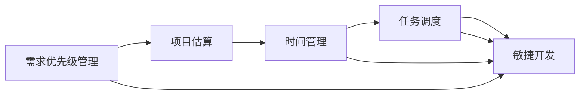

                 

# 需求优先级管理与项目估算原理与代码实战案例讲解

> 关键词：需求优先级管理,项目估算,时间管理,任务调度,敏捷开发

## 1. 背景介绍

在软件开发和项目管理中，需求优先级管理和项目估算是一项极其重要的任务。优秀的项目管理和估算是确保项目按时交付、控制成本、提高客户满意度的关键因素。然而，需求优先级管理与项目估算往往复杂繁琐、容易出错，因此对于从业者来说，需要深入理解其原理，并具备一定的实际经验。本文将从背景介绍出发，逐步深入剖析需求优先级管理与项目估算的核心概念、算法原理、操作步骤和实际应用案例，力求为读者提供全面深入的技术指导。

## 2. 核心概念与联系

### 2.1 核心概念概述

需求优先级管理与项目估算的核心概念包括：

- 需求优先级管理（Requirement Priority Management）：指确定和优先排序项目需求的过程，以确保最重要的需求优先实现。需求优先级通常基于需求的业务价值、技术难度、紧急程度等因素进行评估。

- 项目估算（Project Estimation）：指通过分析项目需求，预测完成项目所需的时间、成本和资源的过程。项目估算包括任务时间估算、任务资源估算、项目整体成本估算等。

- 时间管理（Time Management）：指在项目执行过程中，对时间资源的计划、分配和监控，以确保项目按时完成。

- 任务调度（Task Scheduling）：指通过合理安排任务执行顺序和时间，以最大化项目效率和资源利用率的过程。

- 敏捷开发（Agile Development）：指采用迭代、增量方式开发和交付产品，强调快速响应变化和客户反馈。

这些概念之间相互关联，需求优先级管理提供项目任务的基础排序，项目估算为任务调度提供数据支撑，时间管理和任务调度是敏捷开发的具体实践手段。

### 2.2 核心概念原理和架构的 Mermaid 流程图



这个流程图展示了需求优先级管理、项目估算、时间管理、任务调度和敏捷开发之间的联系与互动关系。需求优先级管理是项目估算的前提，而时间管理和任务调度则是在敏捷开发框架下进行的具体实践。

## 3. 核心算法原理 & 具体操作步骤

### 3.1 算法原理概述

需求优先级管理与项目估算的算法原理主要基于以下两个模型：

1. **MoSCoW模型**：MoSCoW模型将需求分为Must-have（必须有的）、Should-have（应该有的）、Could-have（可以有）和Won't-have（不会有的）四类。通过评估每个需求的业务价值和技术难度，将需求分配到不同优先级。

2. **PERT模型**：PERT（Program Evaluation and Review Technique）模型是一种用于时间估算的统计技术，通过评估任务所需的最短时间、最长时间和最可能时间，结合专家经验，进行任务时间估算。

### 3.2 算法步骤详解

#### 3.2.1 需求优先级管理步骤

1. **收集需求**：通过问卷调查、用户访谈等方式，收集项目相关需求。
2. **需求分类**：按照MoSCoW模型将需求分类。
3. **需求评分**：对每个需求根据业务价值、技术难度、紧急程度等维度进行评分。
4. **排序需求**：根据评分高低进行需求优先级排序。

#### 3.2.2 项目估算步骤

1. **任务分解**：将项目拆分为可执行的任务。
2. **任务时间估算**：根据PERT模型，对每个任务进行时间估算。
3. **任务资源估算**：根据任务需求，估算所需的资源（人力、物力、财力）。
4. **项目整体估算**：将各任务的时间、资源估算汇总，得到项目整体估算。

#### 3.2.3 任务调度步骤

1. **任务排序**：根据需求优先级和项目估算结果，进行任务排序。
2. **时间规划**：确定每个任务的开始和结束时间。
3. **资源分配**：根据任务需求，分配相应的资源。
4. **监控调整**：在项目执行过程中，监控任务进度和资源利用情况，及时调整计划。

### 3.3 算法优缺点

#### 3.3.1 算法优点

1. **科学性**：基于业务价值和技术难度进行需求排序，结合PERT模型进行时间估算，具有较高的科学性和可靠性。
2. **灵活性**：可以在敏捷开发框架下进行，适应快速变化的需求环境。
3. **可操作性**：需求优先级管理和项目估算的具体步骤明确，易于实施。

#### 3.3.2 算法缺点

1. **主观性强**：需求评分和任务时间估算依赖专家经验，可能存在主观偏差。
2. **复杂度高**：对于复杂项目，需求优先级管理和项目估算过程复杂繁琐。
3. **成本高**：详细的需求分析和估算过程可能需要较多时间和资源投入。

### 3.4 算法应用领域

需求优先级管理与项目估算方法广泛应用于软件开发、项目管理、产品规划等领域。具体应用场景包括：

- 软件开发项目的需求分析和任务分解。
- 产品发布周期的项目管理。
- 新产品开发的时间表规划和资源分配。
- 项目风险管理和成本控制。

## 4. 数学模型和公式 & 详细讲解 & 举例说明

### 4.1 数学模型构建

需求优先级管理与项目估算的数学模型包括：

1. **需求评分模型**：
   - 业务价值评分：V
   - 技术难度评分：T
   - 紧急程度评分：E
   - 需求评分：R = V * T * E

2. **PERT模型**：
   - 最短时间：t_min
   - 最长时间：t_max
   - 最可能时间：t_most_likely
   - 任务时间期望值：E(T) = (t_min + 4 * t_most_likely + t_max) / 6

### 4.2 公式推导过程

#### 需求评分模型推导

需求评分模型基于业务价值、技术难度和紧急程度进行计算。假设每个维度的评分范围为1-5，则需求评分R的计算公式为：

$$
R = V * T * E
$$

其中V、T和E分别为业务价值、技术难度和紧急程度评分，取值范围为1-5。

#### PERT模型推导

PERT模型中的任务时间期望值E(T)，通过加权平均计算得到：

$$
E(T) = \frac{t_{min} + 4 * t_{most\_likely} + t_{max}}{6}
$$

其中，t_min为任务最短时间，t_max为任务最长时间，t_most_likely为任务最可能时间。

### 4.3 案例分析与讲解

假设项目需求如下：

- 需求1：实现用户登录功能，业务价值3分，技术难度4分，紧急程度4分。
- 需求2：实现用户注册功能，业务价值4分，技术难度5分，紧急程度3分。
- 需求3：实现用户数据分析功能，业务价值5分，技术难度3分，紧急程度2分。

根据需求评分模型，计算每个需求评分：

- 需求1评分：R1 = 3 * 4 * 4 = 48
- 需求2评分：R2 = 4 * 5 * 3 = 60
- 需求3评分：R3 = 5 * 3 * 2 = 30

根据评分结果，进行需求优先级排序，假设每分代表10个优先级单位，则排序结果为：

- 需求2优先级：60分
- 需求1优先级：48分
- 需求3优先级：30分

根据PERT模型，假设任务1需要3天最短时间，7天最长时间，5天最可能时间，计算任务1时间期望值：

$$
E(T) = \frac{3 + 4 * 5 + 7}{6} = 5
$$

## 5. 项目实践：代码实例和详细解释说明

### 5.1 开发环境搭建

为了进行需求优先级管理和项目估算的代码实践，需要使用Python进行编程。以下是一个简单的开发环境搭建流程：

1. 安装Python：从官网下载安装Python 3.6以上版本。
2. 安装Pip：在终端中运行`pip install --upgrade pip`安装Pip包管理工具。
3. 安装必要的Python库：使用Pip安装需求分析和项目管理相关的库，如`pandas`、`numpy`、`matplotlib`、`scipy`等。

### 5.2 源代码详细实现

#### 需求优先级管理

```python
import pandas as pd

# 需求评分表
def calculate_requirement_score(business_value, tech_difficulty, urgency):
    score = business_value * tech_difficulty * urgency
    return score

# 需求排序
def sort_requirements(requirements):
    scores = requirements.apply(lambda x: calculate_requirement_score(x['business_value'], x['tech_difficulty'], x['urgency']), axis=1)
    return requirements.sort_values(by=scores, ascending=False)

# 读取需求数据
requirements = pd.read_csv('requirements.csv')

# 计算需求评分
scores = requirements.apply(lambda x: calculate_requirement_score(x['business_value'], x['tech_difficulty'], x['urgency']), axis=1)

# 排序需求
sorted_requirements = sort_requirements(requirements)
```

#### 项目估算

```python
import numpy as np
from scipy.stats import beta

# PERT模型参数
def estimate_task_time(t_min, t_max, t_most_likely):
    # 计算beta分布的参数
    alpha = (t_max - t_min) / (t_max - t_most_likely)
    beta = (t_most_likely - t_min) / (t_max - t_most_likely)
    # 计算期望值
    expected_time = np.sum(beta.cdf(np.arange(t_min, t_max + 1), alpha, beta) * np.arange(t_min, t_max + 1))
    return expected_time

# 读取任务数据
tasks = pd.read_csv('tasks.csv')

# 计算任务时间期望值
expected_times = tasks.apply(lambda x: estimate_task_time(x['t_min'], x['t_max'], x['t_most_likely']), axis=1)

# 计算项目整体时间期望值
project_time = np.sum(expected_times)
```

### 5.3 代码解读与分析

#### 需求优先级管理

- 代码中的`calculate_requirement_score`函数计算了每个需求的总评分。
- `sort_requirements`函数通过评分对需求进行排序。
- `scores`变量通过`apply`函数计算所有需求的评分，用于后续排序。
- `sorted_requirements`变量通过`sort_values`方法对需求进行排序，并返回排序后的需求数据。

#### 项目估算

- 代码中的`estimate_task_time`函数使用了PERT模型，计算了任务的期望时间。
- `expected_times`变量通过`apply`函数计算了所有任务的期望时间，用于后续计算项目整体时间。
- `project_time`变量通过`np.sum`方法计算了所有任务期望时间的总和，得到了项目整体时间期望值。

### 5.4 运行结果展示

通过运行上述代码，可以得到需求优先级排序和项目整体时间估算结果：

```python
print("需求优先级排序：")
print(sorted_requirements)
print("\n项目整体时间期望值：")
print(project_time)
```

## 6. 实际应用场景

### 6.1 软件开发项目的需求分析和任务分解

在软件开发项目中，需求分析和任务分解是项目管理的核心环节。通过需求优先级管理，可以确定最重要的需求，优先实现；通过项目估算，可以预测任务时间和资源需求，制定合理的项目计划。

例如，一个电商平台开发项目中，需求包括用户登录、用户注册、商品搜索、订单管理等。通过需求评分模型，对每个需求进行评分和排序，可以确定优先实现用户登录和商品搜索功能。通过PERT模型，对每个任务进行时间估算，可以预测项目整体需要20天时间，需要5个开发人员完成。

### 6.2 产品发布周期的项目管理

在产品发布周期中，需求优先级管理和项目估算可以帮助项目经理合理安排项目进度和资源。例如，一家互联网公司准备在半年内发布一款新应用，需要完成需求收集、需求分析、原型设计、UI设计、开发、测试等多个环节。通过需求优先级管理，可以确定哪些需求需要优先实现；通过项目估算，可以预测每个环节所需的时间资源，制定详细的项目计划。

### 6.3 新产品开发的时间表规划和资源分配

在新产品开发中，时间表规划和资源分配是项目管理的重要任务。通过需求优先级管理和项目估算，可以确定新产品开发的主要里程碑和时间节点，合理安排各阶段资源分配，确保项目按时完成。例如，一家科技公司准备开发一款智能手表，需要进行需求收集、原型设计、软件开发、测试和上市推广等多个环节。通过需求优先级管理，可以确定优先实现芯片设计和软件开发的低功耗问题；通过项目估算，可以预测整个项目需要6个月时间，需要10个开发人员、5个测试人员和1个UI设计师。

## 7. 工具和资源推荐

### 7.1 学习资源推荐

为了帮助读者深入理解需求优先级管理和项目估算，以下是几本推荐的书籍和在线课程：

- 《敏捷项目管理：过程与工具》（A Guide to the Agile Project Management Process and Tools）：详细介绍了敏捷项目管理的方法和工具。
- 《软件项目管理：方法和实践》（Software Project Management: Processes and Principles）：介绍了项目管理的基本原则和方法。
- 《需求分析与管理系统》（Requirements Analysis and Management）：介绍了需求分析和管理的具体方法和工具。

### 7.2 开发工具推荐

以下是一些常用的项目管理工具和代码开发工具：

- Trello：在线项目管理工具，支持任务拆分和进度跟踪。
- Asana：在线项目管理工具，支持任务分配和协作。
- JIRA：企业级项目管理工具，支持敏捷开发和问题跟踪。
- GitLab：代码版本控制系统，支持代码管理、问题跟踪和持续集成。

### 7.3 相关论文推荐

以下是几篇关于需求优先级管理和项目估算的知名论文，建议阅读：

- 《Agile Project Management with Scrum》（Scrum敏捷项目管理）：Dean Ambler 著，介绍了Scrum项目管理框架。
- 《The Practical Guide to Product Management》（产品经理实战指南）：Gene Chao 著，介绍了产品经理的基本职责和方法。
- 《Requirements Engineering: From Analysis and Specification to Solution Construction》（需求工程：从分析和规范到解决方案构建）：Barker 和 Reiss 著，介绍了需求工程的基本概念和方法。

## 8. 总结：未来发展趋势与挑战

### 8.1 未来发展趋势

需求优先级管理和项目估算技术将继续发展，主要趋势包括：

1. **智能化和自动化**：随着AI技术的进步，未来项目管理工具将更加智能化和自动化，能够自动进行需求分析和项目估算，提高效率和准确性。
2. **多维度评估**：除了需求评分模型和PERT模型，未来可能会引入更多维度的评估方法，如SWOT分析、PEST分析等，帮助项目经理全面评估项目风险和机会。
3. **实时监控和调整**：敏捷开发和持续集成技术的发展，使得项目管理需要实时监控和调整，以应对快速变化的需求环境。
4. **协作工具的改进**：随着远程办公和协作的普及，项目管理工具将更加注重协作和沟通，提高团队协作效率。

### 8.2 面临的挑战

尽管需求优先级管理和项目估算技术在不断发展，但仍面临一些挑战：

1. **需求多变性**：项目需求往往难以准确预测，随着项目进展和市场变化，需求可能发生变化，需要快速调整计划。
2. **资源冲突**：项目资源（人力、物力、财力）往往有限，如何合理分配资源，平衡项目进度和质量，是一个难题。
3. **数据准确性**：需求评分和任务时间估算依赖于准确的数据，如果数据不准确，将影响估算结果的准确性。
4. **文化差异**：不同项目团队和组织文化对需求优先级和项目管理的理解和执行可能存在差异，需要协调和统一。

### 8.3 研究展望

未来的研究可以从以下几个方面进行：

1. **需求动态管理**：研究如何动态调整项目需求，适应快速变化的市场和客户需求。
2. **多目标优化**：研究如何在多目标优化中，同时考虑项目进度、质量和成本，找到最优解决方案。
3. **智能化预测**：研究如何利用机器学习和AI技术，提高需求评分和任务时间估算的准确性。
4. **协作与沟通**：研究如何利用协作工具和沟通工具，提高团队协作效率，促进项目顺利推进。

## 9. 附录：常见问题与解答

### 9.1 需求优先级管理常见问题

**Q1：如何确定需求优先级？**

A: 需求优先级通常基于需求对业务价值的影响、技术难度和紧急程度进行评分，然后按照评分高低进行排序。例如，可以使用MoSCoW模型将需求分为必须有的、应该有的、可以有和不应该有四种类型。

**Q2：如何处理需求冲突？**

A: 需求冲突通常需要项目经理进行协调和决策，可以召开会议进行讨论，优先考虑对业务价值影响大的需求，并考虑技术实现的难度和成本。如果仍然无法解决冲突，可以引入利益相关者进行评估和决策。

### 9.2 项目估算常见问题

**Q1：项目估算的时间是否准确？**

A: 项目估算的时间通常基于PERT模型，通过历史数据和专家经验进行预测，具有一定的不确定性。为了提高准确性，可以进行多次估算，取平均值，并在项目执行过程中实时监控和调整。

**Q2：估算时间和实际时间相差较大怎么办？**

A: 如果项目估算时间和实际时间相差较大，可以分析原因并进行调整。可能的原因包括：需求变化、资源不足、技术难度超出预期等。未来可以引入更多维度评估和更精确的估算方法，提高估算准确性。

---

作者：禅与计算机程序设计艺术 / Zen and the Art of Computer Programming

