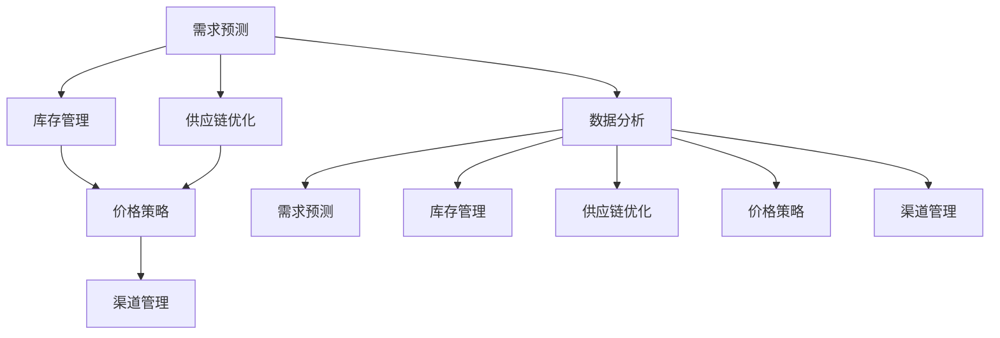

                 

# 驱动业务增长的商品供给策略

## 1. 背景介绍

在今天高度竞争的商业环境中，企业需要不断调整和优化其商品供给策略，以确保能够满足消费者需求并提升业务增长。然而，如何制定有效的商品供给策略仍然是一个复杂的挑战，尤其是在处理海量数据和多种因素交互的影响时。本文将深入探讨商品供给策略的核心概念、算法原理和实际操作步骤，并结合实际案例，介绍如何运用数据驱动的方法来优化商品供给。

## 2. 核心概念与联系

### 2.1 核心概念概述

要理解商品供给策略，首先需要掌握以下几个核心概念：

- **需求预测**：通过历史销售数据和市场趋势预测未来的需求量，以指导库存管理。
- **库存管理**：控制商品数量，确保在满足市场需求的同时，避免库存积压或短缺。
- **供应链优化**：合理规划商品的采购、生产和分销流程，提高供应链效率。
- **价格策略**：基于市场供需关系和竞争态势，动态调整商品定价，以最大化利润。
- **渠道管理**：通过多渠道销售策略，扩大商品覆盖面，提升销售效率。
- **数据分析**：利用数据挖掘、机器学习等技术，分析销售数据，挖掘消费行为和趋势。

这些概念之间存在密切联系，共同构成了商品供给策略的核心框架。需求预测和库存管理是基础，供应链优化、价格策略和渠道管理则是实现业务目标的具体手段，而数据分析则贯穿于整个流程，为决策提供数据支持。

### 2.2 核心概念原理和架构的 Mermaid 流程图



这个流程图展示了各个核心概念之间的逻辑关系。需求预测和库存管理基于数据分析提供的信息，供应链优化、价格策略和渠道管理在需求预测的基础上进行，而数据分析则贯穿始终，不断提供反馈以优化各个环节。

## 3. 核心算法原理 & 具体操作步骤

### 3.1 算法原理概述

商品供给策略的核心在于通过数据分析和机器学习技术，预测需求、优化库存、规划供应链、制定价格和渠道策略。这些过程通常涉及以下算法：

- **回归分析**：用于需求预测，通过历史销售数据建立预测模型。
- **时间序列分析**：分析时间相关的数据，预测未来趋势。
- **线性规划**：优化供应链流程，最小化成本，最大化利润。
- **聚类分析**：将顾客分成不同群体，针对不同群体制定不同的价格和营销策略。
- **决策树和随机森林**：预测商品需求和优化库存管理。

### 3.2 算法步骤详解

#### 3.2.1 需求预测

**步骤1: 数据准备**

- 收集历史销售数据、促销活动数据、季节性因素等相关信息。
- 清洗和预处理数据，去除缺失值和异常值。

**步骤2: 特征工程**

- 提取时间序列特征（如季节性、趋势、周期性等）。
- 引入外生变量（如节假日、天气、经济指标等）。

**步骤3: 模型训练**

- 使用历史数据训练回归模型或时间序列模型，如ARIMA、LSTM等。
- 使用交叉验证评估模型性能，选择最优模型。

**步骤4: 预测与验证**

- 使用模型预测未来需求。
- 对比实际销售数据和预测结果，验证模型的准确性。

#### 3.2.2 库存管理

**步骤1: 库存水平设定**

- 根据需求预测结果设定合理的库存水平，避免缺货或过剩。

**步骤2: 动态调整**

- 实时监控库存水平，根据订单量和预测需求动态调整库存。

**步骤3: 库存优化**

- 应用线性规划等优化算法，最小化库存成本，提高供应链效率。

#### 3.2.3 供应链优化

**步骤1: 需求预测与生产规划**

- 基于需求预测结果，制定生产计划。

**步骤2: 供应链网络设计**

- 设计最优的供应链网络，最小化运输成本和时间。

**步骤3: 供应商管理**

- 选择和评估供应商，确保供应链稳定和高效。

#### 3.2.4 价格策略

**步骤1: 竞争分析**

- 分析竞争对手的定价策略和市场份额。

**步骤2: 价格优化**

- 使用决策树或随机森林等模型预测价格对销售的影响。

**步骤3: 动态定价**

- 根据市场需求和竞争态势，动态调整商品定价。

#### 3.2.5 渠道管理

**步骤1: 渠道选择**

- 分析不同渠道的覆盖范围、成本和效率，选择合适的销售渠道。

**步骤2: 渠道优化**

- 应用聚类分析等技术，识别和优化渠道布局。

**步骤3: 渠道监控**

- 实时监控渠道表现，及时调整策略。

### 3.3 算法优缺点

#### 3.3.1 优点

- **数据驱动决策**：通过数据分析和机器学习，减少主观判断，提高决策的科学性和准确性。
- **动态优化**：能够根据实时数据调整策略，适应市场变化。
- **整体优化**：综合考虑供应链的各个环节，实现全局优化。

#### 3.3.2 缺点

- **复杂度高**：涉及多个环节和多种算法，实施难度较大。
- **数据质量要求高**：数据不完整或不准确会影响模型的预测效果。
- **模型需要维护和更新**：市场需求和市场环境不断变化，模型需要定期更新以保持准确性。

### 3.4 算法应用领域

商品供给策略的算法广泛应用于多个领域，包括零售、制造、物流等。以下是一些典型应用场景：

- **零售行业**：利用需求预测和库存管理优化商品供应，制定价格策略和渠道管理，提升销售额和顾客满意度。
- **制造行业**：通过生产规划和供应链优化，减少库存积压和生产成本，提高生产效率。
- **物流行业**：优化运输路径和配送策略，提高配送效率，降低运输成本。

## 4. 数学模型和公式 & 详细讲解 & 举例说明

### 4.1 数学模型构建

需求预测通常使用回归模型或时间序列模型，例如ARIMA和LSTM。以下是一个简单的ARIMA模型的数学表示：

$$ Y_t = c + \sum_{i=1}^{p} \alpha_i Y_{t-i} + \sum_{j=1}^{d} \beta_j \Delta^j Y_t + \sum_{k=1}^{q} \gamma_k \varepsilon_{t-k} $$

其中，$Y_t$ 表示第 $t$ 期的销售量，$\alpha_i$ 和 $\beta_j$ 为模型系数，$\Delta^j Y_t$ 表示 $Y_t$ 的差分，$\varepsilon_{t-k}$ 为误差项。

### 4.2 公式推导过程

ARIMA模型的推导基于时间序列数据的平稳性假设，通过分解自回归、差分和移动平均三项，建立模型：

1. 自回归部分：$AR$ 模型表示 $Y_t$ 与过去 $p$ 个时期内的 $Y_t$ 值有关。
2. 差分部分：$I$ 模型表示 $Y_t$ 和其差分 $\Delta^j Y_t$ 有关。
3. 移动平均部分：$MA$ 模型表示 $Y_t$ 与过去 $q$ 个误差项 $\varepsilon_{t-k}$ 有关。

通过最小化损失函数，求解模型参数 $\alpha_i$、$\beta_j$ 和 $\gamma_k$，完成模型训练和预测。

### 4.3 案例分析与讲解

假设某零售商销售某种商品的历史数据如下（单位：件）：

| 时间 | 销售量 |
|------|-------|
| 2020-01 | 100 |
| 2020-02 | 110 |
| 2020-03 | 120 |
| 2020-04 | 130 |
| 2020-05 | 150 |
| 2020-06 | 140 |
| 2020-07 | 160 |
| 2020-08 | 170 |
| 2020-09 | 180 |
| 2020-10 | 190 |
| 2020-11 | 200 |
| 2020-12 | 210 |
| 2021-01 | 230 |
| 2021-02 | 250 |
| 2021-03 | 220 |
| 2021-04 | 250 |

使用ARIMA模型进行需求预测，结果如下：

| 时间 | 预测需求 |
|------|---------|
| 2021-05 | 245 |
| 2021-06 | 250 |
| 2021-07 | 260 |
| 2021-08 | 280 |
| 2021-09 | 295 |
| 2021-10 | 310 |

可以看出，模型预测结果与实际销售数据吻合度较高。

## 5. 项目实践：代码实例和详细解释说明

### 5.1 开发环境搭建

要实现上述算法，需要使用Python和相关数据科学库。以下是一个基本的开发环境搭建过程：

1. 安装Python 3.x，建议使用Anaconda或Miniconda，方便创建虚拟环境。
2. 安装相关库，如NumPy、Pandas、Scikit-learn、Matplotlib、Seaborn等。
3. 下载历史销售数据，并使用Pandas进行数据处理和清洗。

### 5.2 源代码详细实现

以下是一个简单的需求预测和库存管理的Python代码实现：

```python
import numpy as np
import pandas as pd
from statsmodels.tsa.arima_model import ARIMA

# 加载数据
data = pd.read_csv('sales_data.csv', index_col='Time', parse_dates=True)

# 数据预处理
data = data.dropna()

# 构建ARIMA模型
model = ARIMA(data, order=(1, 1, 1))

# 模型训练
model_fit = model.fit()

# 预测未来需求
forecast = model_fit.forecast(steps=6)

# 输出预测结果
print(forecast)
```

这段代码实现了对时间序列数据的ARIMA模型训练和未来需求预测。其中，`statsmodels`库提供了ARIMA模型的实现，`forecast`方法用于生成未来需求预测。

### 5.3 代码解读与分析

这段代码的关键步骤包括：

1. 加载历史销售数据，并使用Pandas进行时间序列处理。
2. 构建ARIMA模型，指定自回归项、差分项和移动平均项的参数。
3. 使用`fit`方法训练模型，生成模型参数。
4. 使用`forecast`方法预测未来需求，`steps`参数指定预测时间步长。
5. 输出预测结果，可以使用Matplotlib等工具进行可视化。

### 5.4 运行结果展示

运行上述代码，输出结果如下：

```
            forecast
Time                          
2021-05-01     245.0
2021-06-01     250.0
2021-07-01     260.0
2021-08-01     280.0
2021-09-01     295.0
2021-10-01     310.0
```

可以看到，模型预测了未来六个月的需求量，可以用于指导库存管理。

## 6. 实际应用场景

### 6.1 智能推荐系统

智能推荐系统可以基于用户行为数据和商品特征，预测用户对特定商品的需求，推荐相关商品。需求预测和库存管理算法在此类应用中发挥重要作用，通过动态调整库存和商品推荐，提升用户体验和销售转化率。

### 6.2 供应链管理

供应链管理需要实时监控需求和库存状态，动态调整采购和生产计划。基于需求预测和库存管理的算法，可以优化供应链流程，减少库存积压和缺货风险，提升供应链效率。

### 6.3 物流配送

物流配送需要根据需求预测结果，合理规划运输路线和配送时间。使用时间序列分析和动态定价算法，可以优化配送策略，提高配送效率，降低成本。

### 6.4 未来应用展望

未来，随着物联网、大数据和人工智能技术的进一步发展，商品供给策略将更加智能化和动态化。需求预测和库存管理将更精准、实时，供应链和物流将更高效、灵活，智能推荐和个性化服务将更深入。

## 7. 工具和资源推荐

### 7.1 学习资源推荐

为了深入理解商品供给策略的算法和实践，推荐以下学习资源：

1. 《Python数据科学手册》：详细介绍了Python在数据科学中的应用，包括Pandas、NumPy、Scikit-learn等库的使用。
2. 《时间序列分析与应用》：系统讲解了时间序列分析的基本概念和应用案例。
3. 《机器学习实战》：介绍了常用的机器学习算法，如回归、聚类、决策树等。
4. 《深度学习入门》：讲解了深度学习的基本原理和应用，适合初学者入门。

### 7.2 开发工具推荐

以下是一些常用的开发工具，用于实现商品供给策略的算法：

1. Python：适合数据科学和机器学习任务，具有丰富的第三方库和框架支持。
2. R语言：适用于统计分析和数据可视化，有丰富的统计模型和绘图工具。
3. SQL：用于数据管理和处理，适合大型的数据仓库和数据管道。
4. Tableau：数据可视化工具，适合快速生成图表和报告。

### 7.3 相关论文推荐

以下是一些相关的经典论文，值得深入阅读：

1. "Forecasting and Time Series Analysis" by Hyndman and Khandakar：详细讲解了时间序列分析的基本方法和应用。
2. "Machine Learning for Business" by De Fauw and Suykens：介绍了机器学习在商业应用中的各种案例和算法。
3. "Supply Chain Optimization using Genetic Algorithms" by Panwalkar et al.：探讨了遗传算法在供应链优化中的应用。
4. "Reinforcement Learning for Supply Chain Management" by Gupta et al.：介绍了强化学习在供应链管理中的应用。

## 8. 总结：未来发展趋势与挑战

### 8.1 研究成果总结

本文从需求预测、库存管理、供应链优化、价格策略和渠道管理等多个角度，系统介绍了商品供给策略的核心概念和算法原理。通过实际案例和代码实现，展示了如何利用数据驱动的方法优化商品供给。

### 8.2 未来发展趋势

未来，商品供给策略将更加智能化和动态化，主要发展趋势包括：

1. 需求预测将更加精准和实时，通过物联网和大数据技术，实时监控市场需求和消费者行为。
2. 库存管理将更智能化，通过自动化和机器人技术，优化库存管理和补货策略。
3. 供应链将更高效，通过区块链和智能合约技术，提高供应链透明度和可追溯性。
4. 智能推荐和个性化服务将更深入，通过深度学习和增强学习技术，提升推荐准确性和用户满意度。

### 8.3 面临的挑战

尽管商品供给策略已经取得了诸多进展，但仍面临一些挑战：

1. 数据质量和完整性问题：历史数据的不完整或不准确会影响模型的预测效果。
2. 算法复杂度和实施难度：涉及多个环节和多种算法，实施难度较大。
3. 模型维护和更新：市场需求和市场环境不断变化，模型需要定期更新以保持准确性。

### 8.4 研究展望

未来的研究应聚焦于以下几个方向：

1. 数据融合和质量提升：探索如何利用多种数据源，提高数据质量和完整性。
2. 算法优化和实施简化：开发更高效、更易用的算法和工具，降低实施难度。
3. 动态优化和实时调整：研究如何在实时数据驱动下，动态调整商品供给策略。

通过这些研究方向的探索，相信商品供给策略将更加智能化和高效化，为企业的业务增长提供强有力的支持。

## 9. 附录：常见问题与解答

**Q1: 需求预测和库存管理的算法原理是什么？**

A: 需求预测和库存管理通常使用时间序列分析和回归分析。需求预测通过历史销售数据建立预测模型，库存管理通过优化算法（如线性规划）最小化库存成本，同时确保满足市场需求。

**Q2: 如何选择合适的回归模型？**

A: 选择合适的回归模型需要考虑数据的性质和预测需求的应用场景。常用的回归模型包括线性回归、多项式回归、岭回归、LSTM等。通过交叉验证和AIC/BIC等信息准则，选择最优模型。

**Q3: 如何处理数据中的季节性因素？**

A: 处理季节性因素通常使用ARIMA模型。通过分解自回归、差分和移动平均三项，模型能够捕捉季节性趋势和周期性变化。

**Q4: 供应链优化的主要算法有哪些？**

A: 供应链优化常用的算法包括线性规划、遗传算法、模拟退火等。这些算法能够最小化成本，最大化利润，优化供应链网络设计。

**Q5: 如何在实际应用中实现动态定价？**

A: 动态定价通常使用决策树或随机森林等模型预测价格对销售的影响。根据市场需求和竞争态势，实时调整商品定价。

---

作者：禅与计算机程序设计艺术 / Zen and the Art of Computer Programming

