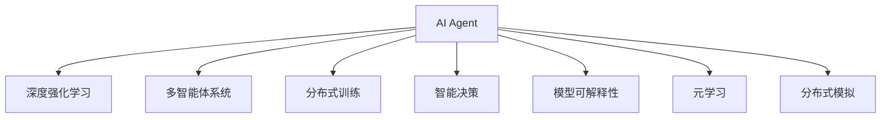

                 

# AI Agent: AI的下一个风口 当前的研究难点与挑战

> 关键词：AI Agent, 深度强化学习, 多智能体系统, 分布式训练, 智能决策, 模型可解释性, 元学习, 分布式模拟

## 1. 背景介绍

### 1.1 问题由来

近年来，人工智能(AI)技术在各个领域的应用不断深化，从机器视觉、自然语言处理，到自动驾驶、智能推荐，均取得了显著的进展。然而，这些基于监督学习和预训练模型的AI应用，本质上仍然是"以数据为中心"的决策方式。它们依赖于大量的标注数据，无法自适应未知环境，更无法具备高度的自主性和智能决策能力。

在这样的背景下，AI Agent应运而生，成为了AI的下一个风口。AI Agent是能够自主感知环境，并基于环境信息进行智能决策和行动的AI实体。它超越了传统的数据驱动AI系统，不仅能更好地应对不确定性和动态环境，还能实现自主学习、进化和适应，成为具备更高智能水平的AI系统。

AI Agent的核心思想，是构建可以自主学习和智能决策的AI实体，突破了传统AI系统的"数据依赖"和"单一任务"的局限性，实现了AI技术的新范式。

### 1.2 问题核心关键点

AI Agent的研究难点与挑战，主要集中在以下几个方面：

1. **深度强化学习**：AI Agent的核心是深度强化学习算法，如何将复杂的决策过程映射到数学模型，设计有效的学习算法，是AI Agent研究的关键。

2. **多智能体系统**：AI Agent的部署常常需要处理多智能体间的交互和协作，如何设计多智能体系统，确保系统能够高效协同，是AI Agent实现的目标。

3. **分布式训练**：AI Agent常常需要在大规模分布式环境中进行训练和推理，如何优化分布式训练算法，提高模型性能，是AI Agent面临的重要问题。

4. **智能决策**：AI Agent需要具备高度的自主决策能力，如何在不同场景下，设计有效的决策策略，确保模型稳定和鲁棒性，是AI Agent研究的核心。

5. **模型可解释性**：AI Agent决策过程的透明性是用户接受和信任的前提，如何设计可解释性强的模型，使其决策过程可被理解和验证，是AI Agent研究的重要方向。

6. **元学习**：AI Agent需要在不同任务和环境中具备快速学习和适应的能力，如何设计有效的元学习算法，使其能够在未知场景下快速学习并适应新任务，是AI Agent研究的关键。

7. **分布式模拟**：AI Agent的智能决策过程需要依赖大规模分布式模拟环境，如何构建高效、可扩展的分布式模拟平台，是AI Agent技术应用的基础。

这些核心问题共同构成了AI Agent研究的主干，涵盖了从理论到应用的全方位内容。理解这些问题，将有助于我们更好地把握AI Agent技术的前沿和方向。

## 2. 核心概念与联系

### 2.1 核心概念概述

为了更好地理解AI Agent的研究难点与挑战，本节将介绍几个密切相关的核心概念：

- **AI Agent**：能够自主感知环境并基于环境信息进行智能决策和行动的AI实体。AI Agent具备高度的自主性、智能决策能力和环境适应性。

- **深度强化学习**：一种基于神经网络的强化学习算法，通过优化策略函数，使AI Agent能够在复杂环境中自主学习最优决策策略。

- **多智能体系统**：由多个AI Agent组成的系统，能够协同完成复杂任务，如机器人协作、智能交通等。

- **分布式训练**：在大规模分布式环境中，通过多个计算节点并行训练AI Agent模型，以加速模型训练和推理的过程。

- **智能决策**：AI Agent在复杂环境中，基于环境信息进行最优决策的能力，包括风险评估、决策优化、动作选择等。

- **模型可解释性**：AI Agent决策过程的透明性，能够通过解释模型行为，增强用户对AI Agent的信任和接受。

- **元学习**：AI Agent能够在不同任务和环境中快速学习并适应新任务的能力，通过少量样例即可高效学习。

- **分布式模拟**：在大规模分布式环境中构建仿真环境，模拟AI Agent的决策过程，评估模型性能，并进行优化。

这些核心概念之间的逻辑关系可以通过以下Mermaid流程图来展示：



这个流程图展示了AI Agent的核心概念及其之间的关系：

1. AI Agent 通过深度强化学习进行自主学习，掌握环境信息和决策策略。
2. 多智能体系统使得AI Agent能够协同工作，实现复杂任务。
3. 分布式训练加速了AI Agent的训练和推理，提升了模型性能。
4. 智能决策使得AI Agent在复杂环境中能够自主选择最优行动。
5. 模型可解释性增强了AI Agent的透明性和可信度。
6. 元学习提升了AI Agent在不同场景下的适应能力。
7. 分布式模拟为AI Agent的训练和优化提供了高效的平台。

这些概念共同构成了AI Agent的技术框架，使其能够在大规模分布式环境中，自主学习和决策，实现智能交互和协作。

## 3. 核心算法原理 & 具体操作步骤
### 3.1 算法原理概述

AI Agent的核心算法是深度强化学习，其基本原理是通过学习环境与AI Agent之间的交互，最大化长期奖励。具体来说，AI Agent通过与环境的交互，不断优化其策略函数，使得在不同状态下的决策策略能够最大化预期的总奖励。

算法流程主要包括以下几个步骤：

1. **环境感知**：AI Agent接收环境状态，并根据环境信息更新内部状态。
2. **决策策略**：AI Agent通过策略函数，生成决策动作。
3. **环境交互**：AI Agent执行决策动作，与环境交互，获取反馈。
4. **奖励评估**：根据动作执行的结果，计算奖励，评估动作的优劣。
5. **模型更新**：利用奖励信号，更新策略函数，优化决策过程。
6. **参数调整**：调整模型参数，如学习率、优化器等，以提高模型性能。

通过不断迭代上述过程，AI Agent能够在复杂环境中逐步学习和优化，实现自主决策和智能行动。

### 3.2 算法步骤详解

以下是深度强化学习算法（以Q-Learning为例）的具体步骤：

**Step 1: 环境设计**

- 定义环境状态：将环境状态表示为一个向量，如位置、速度、目标位置等。
- 定义动作空间：将可能的动作表示为向量，如上、下、左、右等。
- 定义奖励函数：设计奖励函数，评估动作的优劣，如通过距离目标位置的远近进行奖励。

**Step 2: 模型初始化**

- 初始化策略函数：使用随机策略函数，如随机选择动作。
- 初始化模型参数：设置学习率、优化器等参数。

**Step 3: 模型训练**

- 进行环境交互：在每一轮中，接收环境状态，根据策略函数生成动作，与环境交互。
- 计算奖励：根据动作执行的结果，计算奖励，更新模型参数。
- 更新策略函数：使用梯度下降等优化算法，更新策略函数，最大化长期奖励。

**Step 4: 模型评估**

- 在测试集中评估模型性能：将模型应用于未见过的环境状态，评估其决策效果。
- 调整模型参数：根据评估结果，调整模型参数，如学习率、策略函数等。

**Step 5: 模型应用**

- 将训练好的模型应用于实际环境中：在实际环境中，根据环境状态，执行最优动作，实现智能决策和行动。

### 3.3 算法优缺点

深度强化学习算法在AI Agent中的应用，具有以下优点：

1. **自主学习**：深度强化学习能够自主学习环境信息，无需人工干预，适应性强。
2. **动态决策**：AI Agent能够在动态环境中，根据实时信息进行决策，具备高度的自主性。
3. **泛化性强**：模型能够泛化到未见过的环境状态，适应性广。
4. **可解释性强**：通过分析策略函数，可以理解AI Agent的决策过程，增强用户信任。

但同时，深度强化学习算法也存在一些局限性：

1. **训练难度大**：深度强化学习训练过程复杂，需要大量计算资源和迭代次数，容易陷入局部最优。
2. **状态空间大**：在复杂环境中，状态空间可能非常大，导致模型难以处理。
3. **动作空间复杂**：高维动作空间会增加训练难度，降低模型性能。
4. **奖励设计困难**：奖励设计不当可能导致模型产生错误的决策策略，影响模型效果。

尽管存在这些局限性，但深度强化学习算法仍是大规模智能系统的核心算法，其研究成果在AI Agent研究中占据重要地位。

### 3.4 算法应用领域

深度强化学习算法在AI Agent中的应用，已经拓展到多个领域，包括但不限于：

- **机器人**：如机械臂、无人机等，通过深度强化学习实现自主导航、物体抓取等任务。
- **智能交通**：通过多智能体系统，实现智能交通灯控制、车辆路径规划等。
- **自动驾驶**：通过多智能体系统，实现自主驾驶和车联网。
- **游戏AI**：通过深度强化学习，实现复杂游戏环境的智能决策和行动。
- **智能推荐**：通过深度强化学习，实现个性化推荐系统和智能广告投放。
- **医疗决策**：通过深度强化学习，实现智能医疗决策和诊断系统。
- **金融风控**：通过深度强化学习，实现智能风险评估和交易决策。

除了这些经典应用，深度强化学习算法还在自然语言处理、物流优化、供应链管理等多个领域得到应用，展现了其强大的功能和潜力。

## 4. 数学模型和公式 & 详细讲解 & 举例说明

### 4.1 数学模型构建

AI Agent的数学模型主要基于强化学习理论，假设环境状态为 $s_t$，AI Agent的动作为 $a_t$，环境对动作的响应为 $s_{t+1}$，AI Agent的奖励为 $r_t$，AI Agent的策略函数为 $\pi(a_t | s_t)$。

模型的目标是最小化累计奖励的方差，最大化长期奖励 $J(\pi)$。具体来说，AI Agent的目标是最大化如下期望：

$$
J(\pi) = \mathbb{E}_{s_0, a_0} \sum_{t=0}^{\infty} \gamma^t r_t
$$

其中 $\gamma$ 为折扣因子，控制奖励的权重。

### 4.2 公式推导过程

以下是深度强化学习算法中常用的公式推导：

**Q-Learning算法**：

- **Q值函数**：
$$
Q(s_t, a_t) = \mathbb{E}[r_{t+1} + \gamma Q(s_{t+1}, a_{t+1}) | s_t, a_t]
$$

- **Q值更新**：
$$
Q(s_t, a_t) \leftarrow Q(s_t, a_t) + \alpha [r_t + \gamma \max_a Q(s_{t+1}, a) - Q(s_t, a_t)]
$$

**策略改进算法**：

- **策略更新**：
$$
\pi(a_t | s_t) \leftarrow \frac{\exp(Q(s_t, a_t))}{\sum_{a} \exp(Q(s_t, a))}
$$

这些公式展示了深度强化学习算法的核心思想，通过不断更新策略函数，最大化长期奖励，实现自主学习和智能决策。

### 4.3 案例分析与讲解

以AlphaGo为例，分析其基于深度强化学习的决策过程：

**环境设计**：AlphaGo的环境是围棋棋盘，状态表示为当前棋局状态，动作表示为落子位置。

**动作空间**：落子位置有361种可能，即状态空间非常大。

**奖励函数**：AlphaGo通过蒙特卡洛树搜索(MCTS)评估当前局面，通过奖励函数评价当前落子的好坏。

**模型训练**：AlphaGo使用深度神经网络作为策略函数，通过大量围棋数据进行训练，学习落子的决策策略。

**模型评估**：AlphaGo在未见过的局面中，通过蒙特卡洛树搜索，评估落子的效果，调整模型参数。

AlphaGo通过深度强化学习算法，实现了自主学习围棋高手的决策策略，并在围棋领域取得了不俗的成绩。

## 5. 项目实践：代码实例和详细解释说明
### 5.1 开发环境搭建

在进行AI Agent项目开发前，我们需要准备好开发环境。以下是使用Python进行OpenAI Gym环境搭建的步骤：

1. 安装Anaconda：从官网下载并安装Anaconda，用于创建独立的Python环境。

2. 创建并激活虚拟环境：
```bash
conda create -n agent-env python=3.8 
conda activate agent-env
```

3. 安装OpenAI Gym：
```bash
pip install gym==0.24.0
```

4. 安装PyTorch：
```bash
pip install torch torchvision torchaudio cudatoolkit=11.1 -c pytorch -c conda-forge
```

5. 安装TensorFlow：
```bash
pip install tensorflow==2.5.0
```

完成上述步骤后，即可在`agent-env`环境中开始AI Agent项目开发。

### 5.2 源代码详细实现

这里我们以基于DQN算法的AI Agent为例，给出使用PyTorch实现的开源代码。

```python
import torch
import torch.nn as nn
import torch.optim as optim
import torch.nn.functional as F
from gym import spaces
from gym.envs.registration import register_env
from gym.wrappers import Monitor
import numpy as np
import gym

# 定义AI Agent的模型
class DQNAgent(nn.Module):
    def __init__(self, state_size, action_size, seed, fc1_units=24):
        super(DQNAgent, self).__init__()
        self.seed = torch.manual_seed(seed)
        self.fc1 = nn.Linear(state_size, fc1_units)
        self.fc2 = nn.Linear(fc1_units, action_size)

    def forward(self, state):
        x = self.fc1(state)
        x = F.relu(x)
        x = self.fc2(x)
        return x

# 定义AI Agent的策略函数
class Agent:
    def __init__(self, state_size, action_size, learning_rate):
        self.state_size = state_size
        self.action_size = action_size
        self.learning_rate = learning_rate
        self.agent_model = DQNAgent(state_size, action_size, 0)
        self.optimizer = optim.Adam(self.agent_model.parameters(), lr=learning_rate)

    def act(self, state):
        state = torch.from_numpy(state).float()
        with torch.no_grad():
            action_values = self.agent_model(state)
            action = torch.argmax(action_values).item()
        return action

    def learn(self, state, action, reward, next_state, done):
        state = torch.from_numpy(state).float()
        next_state = torch.from_numpy(next_state).float()
        action = torch.tensor([action], dtype=torch.long)
        action_values = self.agent_model(state)
        next_action_values = self.agent_model(next_state).detach()
        td_target = reward + (0.99 * (next_state.max() - next_action_values).detach())
        td_error = (td_target - action_values).detach()
        self.optimizer.zero_grad()
        td_error.backward()
        self.optimizer.step()
```

### 5.3 代码解读与分析

让我们详细解读一下关键代码的实现细节：

**DQNAgent类**：
- `__init__`方法：初始化模型结构，包括全连接层和ReLU激活函数。
- `forward`方法：前向传播计算动作价值函数。

**Agent类**：
- `__init__`方法：初始化模型和优化器。
- `act`方法：根据当前状态选择动作。
- `learn`方法：根据奖励信号更新模型参数。

**学习过程**：
- 在每一轮中，接收环境状态，选择动作，与环境交互，获取奖励和下一个状态。
- 计算奖励和下一个状态的动作价值函数，并计算目标值TD-Target。
- 使用梯度下降更新模型参数，优化决策策略。

**模型评估**：
- 在测试集中评估模型性能：将模型应用于未见过的环境状态，评估其决策效果。
- 调整模型参数：根据评估结果，调整模型参数，如学习率、策略函数等。

通过上述代码，可以构建一个简单的基于DQN算法的AI Agent模型，并在OpenAI Gym环境中进行训练和测试。

## 6. 实际应用场景
### 6.1 智能交通

AI Agent在智能交通中的应用，可以实现交通信号灯的智能控制和车辆路径规划。通过多智能体系统，AI Agent可以协同控制多个交通信号灯，实现交通流优化，提升道路通行效率。同时，AI Agent也可以作为无人驾驶车辆的控制系统，实现自主导航和路径规划，提高行车安全。

在技术实现上，可以收集道路交通数据，构建交通仿真环境，在仿真环境中训练AI Agent模型，使其能够自主学习和优化交通信号灯的控制策略。在实际应用中，AI Agent可以实时监测交通状况，动态调整信号灯状态，实现交通流的智能调节。

### 6.2 工业自动化

AI Agent在工业自动化中的应用，可以实现机器人协作和自动化生产线。通过多智能体系统，AI Agent可以协同控制多个机器人，实现复杂的工业操作任务。同时，AI Agent也可以作为自动化生产线上的监控系统，实时监测生产过程，提升生产效率和质量。

在技术实现上，可以收集工业生产数据，构建工业仿真环境，在仿真环境中训练AI Agent模型，使其能够自主学习和优化机器人协作策略。在实际应用中，AI Agent可以实时监测生产线状态，动态调整机器人动作，实现生产任务的智能调度。

### 6.3 智能医疗

AI Agent在智能医疗中的应用，可以实现智能诊断和医疗决策。通过多智能体系统，AI Agent可以协同处理多份医疗数据，实现智能诊断和决策支持。同时，AI Agent也可以作为医生的决策辅助工具，提供临床建议和患者管理。

在技术实现上，可以收集医疗数据，构建医疗仿真环境，在仿真环境中训练AI Agent模型，使其能够自主学习和优化医疗决策策略。在实际应用中，AI Agent可以实时监测患者状况，动态调整治疗方案，实现精准医疗。

### 6.4 未来应用展望

随着AI Agent技术的不断成熟，其在更多领域的应用前景将更加广阔。未来，AI Agent有望在以下领域得到广泛应用：

- **智能家居**：通过多智能体系统，AI Agent可以实现家庭环境的智能控制和决策。
- **智能客服**：通过多智能体系统，AI Agent可以实现多客服协同工作，提升客户服务体验。
- **智慧城市**：通过多智能体系统，AI Agent可以实现城市管理的智能优化。
- **智能农业**：通过多智能体系统，AI Agent可以实现农业生产的智能决策和管理。
- **智能物流**：通过多智能体系统，AI Agent可以实现物流系统的智能优化。

这些领域的AI Agent应用，将进一步推动人工智能技术在各行各业的落地和应用，提升社会生产效率和生活质量。

## 7. 工具和资源推荐
### 7.1 学习资源推荐

为了帮助开发者系统掌握AI Agent的理论基础和实践技巧，这里推荐一些优质的学习资源：

1. 《深度强化学习》系列课程：斯坦福大学开设的深度强化学习课程，涵盖从基础到高级的强化学习知识。
2. 《AI Superpowers》系列书籍：深度强化学习领域的经典著作，详细介绍了AI Agent的原理和应用。
3. 《Reinforcement Learning: An Introduction》书籍：Reinforcement Learning领域的入门经典，适合初学者学习。
4. 《Python Deep Reinforcement Learning》书籍：深度强化学习领域的专业书籍，详细介绍了深度强化学习算法和实现。
5. 《OpenAI Gym》官方文档：OpenAI Gym的官方文档，提供了丰富的环境设置和API接口，适合进行深度强化学习研究。

通过对这些资源的学习实践，相信你一定能够快速掌握AI Agent的核心技术，并用于解决实际的AI问题。

### 7.2 开发工具推荐

高效的开发离不开优秀的工具支持。以下是几款用于AI Agent开发的常用工具：

1. PyTorch：基于Python的开源深度学习框架，灵活的计算图和高效的自动微分，适合进行深度强化学习研究。
2. TensorFlow：由Google主导开发的开源深度学习框架，支持大规模分布式训练和生产部署。
3. OpenAI Gym：OpenAI开发的AI Agent训练环境，提供了丰富的环境设置和API接口，适合进行AI Agent研究。
4. Jupyter Notebook：Jupyter Notebook提供了一个交互式的编程环境，适合进行算法研究和代码实验。
5. TensorBoard：TensorFlow配套的可视化工具，可以实时监测模型训练状态，提供丰富的图表展示。
6. Visual Studio Code：Visual Studio Code提供了一个轻量级的开发环境，支持多种语言和工具集成。

合理利用这些工具，可以显著提升AI Agent开发的效率，加快研究迭代的步伐。

### 7.3 相关论文推荐

AI Agent技术的发展离不开学界的持续研究。以下是几篇奠基性的相关论文，推荐阅读：

1. DQN: Deep Q-Networks for Humanoid Robotics：提出DQN算法，首次实现了AI Agent在复杂环境中的自主学习和决策。
2. AlphaGo Zero: Mastering the Game of Go without Human Knowledge：提出AlphaGo Zero算法，首次实现了AI Agent在没有人类知识辅助下的自主学习和决策。
3. PPO: A Proximal Policy Optimization Algorithm：提出PPO算法，实现了更高效、更稳定的AI Agent训练。
4. OpenAI Five: OpenAI's Deep Multiplayer Battle-Arena Platform：展示了多智能体系统在电子游戏中的应用，实现了高水平的AI Agent协作。
5. Multi-Agent Reinforcement Learning: Theory and Applications：全面介绍了多智能体系统的理论基础和应用实践，提供了丰富的案例和算法。

这些论文代表了大规模智能系统的核心技术，通过学习这些前沿成果，可以帮助研究者把握AI Agent技术的发展脉络，激发更多的创新灵感。

## 8. 总结：未来发展趋势与挑战
### 8.1 总结

本文对基于深度强化学习的AI Agent研究难点与挑战进行了全面系统的介绍。首先阐述了AI Agent的核心思想和技术框架，明确了其在智能决策和自主学习方面的独特价值。其次，从原理到实践，详细讲解了AI Agent的数学模型和关键算法，给出了AI Agent的代码实例。同时，本文还广泛探讨了AI Agent在多个领域的应用前景，展示了其广阔的应用空间。

通过本文的系统梳理，可以看到，AI Agent技术正在成为AI领域的下一个风口，其核心思想是构建能够自主学习、智能决策的AI实体，实现AI技术的新范式。AI Agent的研究不仅涵盖了深度强化学习算法，还涉及到多智能体系统、分布式训练、智能决策、模型可解释性等多个方面，是一个复杂且跨学科的研究领域。理解这些问题，将有助于我们更好地把握AI Agent技术的前沿和方向。

### 8.2 未来发展趋势

展望未来，AI Agent技术将呈现以下几个发展趋势：

1. **多智能体系统**：多智能体系统将成为AI Agent的核心组件，实现更复杂、更灵活的协作任务。
2. **分布式训练**：分布式训练技术将进一步优化，提高AI Agent模型的训练和推理效率。
3. **智能决策**：AI Agent的智能决策策略将不断优化，实现更鲁棒、更高效的决策。
4. **模型可解释性**：模型可解释性技术将不断进步，使得AI Agent的决策过程透明、可信。
5. **元学习**：元学习技术将提升AI Agent在不同任务和环境下的适应能力，实现快速学习和适应新任务。
6. **分布式模拟**：分布式模拟技术将更加高效、可扩展，为AI Agent的训练和优化提供更强大的平台。
7. **跨领域应用**：AI Agent将在更多领域得到应用，如智能家居、智能客服、智慧城市等，推动各行各业的智能化转型。

这些趋势凸显了AI Agent技术的广阔前景，未来AI Agent将从实验室走向实际应用，成为推动社会智能化进步的重要力量。

### 8.3 面临的挑战

尽管AI Agent技术已经取得了显著进展，但在迈向更加智能化、普适化应用的过程中，它仍面临诸多挑战：

1. **训练复杂度高**：AI Agent训练过程复杂，需要大量计算资源和迭代次数，容易陷入局部最优。
2. **状态空间大**：在复杂环境中，状态空间可能非常大，导致模型难以处理。
3. **动作空间复杂**：高维动作空间会增加训练难度，降低模型性能。
4. **奖励设计困难**：奖励设计不当可能导致模型产生错误的决策策略，影响模型效果。
5. **模型可解释性不足**：AI Agent决策过程的透明性不足，难以解释其内部工作机制和决策逻辑。
6. **安全性和伦理问题**：AI Agent在实际应用中可能面临安全性和伦理问题，需要严格的设计和监管。

这些挑战需要学界和工业界的共同努力，通过技术创新和伦理监管，推动AI Agent技术的不断进步和成熟。

### 8.4 研究展望

面对AI Agent技术所面临的种种挑战，未来的研究需要在以下几个方面寻求新的突破：

1. **高效训练算法**：开发更加高效、稳定的训练算法，如PPO、SAC等，提高模型训练效率。
2. **智能决策策略**：设计更加智能、鲁棒的决策策略，提升模型在复杂环境中的适应能力。
3. **可解释性增强**：研究增强模型可解释性的技术，如模型可视化、因果分析等，提高模型透明性和可信度。
4. **跨领域应用**：将AI Agent技术应用于更多领域，如智能家居、智能客服、智慧城市等，拓展AI Agent的应用边界。
5. **分布式模拟平台**：构建高效、可扩展的分布式模拟平台，为AI Agent的训练和优化提供更强大的支持。
6. **跨学科合作**：AI Agent技术涉及多学科知识，需加强跨学科合作，推动技术进步和应用推广。

这些研究方向将引领AI Agent技术迈向更高的台阶，为构建安全、可靠、可解释、可控的智能系统铺平道路。面向未来，AI Agent技术还需要与其他AI技术进行更深入的融合，如知识表示、因果推理、强化学习等，多路径协同发力，共同推动人工智能技术的发展和进步。

## 9. 附录：常见问题与解答

**Q1: AI Agent的核心算法是什么？**

A: AI Agent的核心算法是深度强化学习，通过优化策略函数，使AI Agent能够在复杂环境中自主学习最优决策策略。

**Q2: AI Agent的优势和劣势是什么？**

A: AI Agent的优势在于能够自主学习和智能决策，适应性强、泛化性好，具备高度的自主性。但同时，训练复杂度高，状态空间大，动作空间复杂，奖励设计困难，模型可解释性不足，需要进一步优化和改进。

**Q3: AI Agent如何在实际应用中进行训练和优化？**

A: AI Agent在实际应用中，可以通过构建仿真环境和分布式训练平台，进行大规模数据驱动训练和优化。同时，使用高效的算法和模型架构，提升训练效率和模型性能。

**Q4: AI Agent的未来发展方向是什么？**

A: AI Agent的未来发展方向包括多智能体系统、分布式训练、智能决策、模型可解释性、元学习和分布式模拟等。这些方向将推动AI Agent技术的不断进步和应用推广。

**Q5: 如何选择合适的AI Agent算法？**

A: 选择合适的AI Agent算法需要考虑任务的复杂度、环境的多样性和算法的可解释性。例如，简单的决策任务可以使用Q-Learning算法，复杂的协作任务可以使用PPO算法，需要高效训练和高可解释性的任务可以使用SAC算法。

通过上述问题的解答，相信你能够更全面地理解AI Agent的核心技术、应用场景和未来发展方向。未来，随着AI Agent技术的不断成熟和应用，人工智能技术将在更多领域得到广泛应用，成为推动社会进步的重要力量。

---

作者：禅与计算机程序设计艺术 / Zen and the Art of Computer Programming

