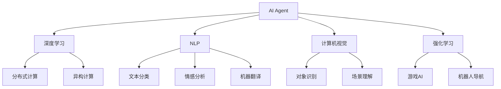

                 

## 1. 背景介绍

### 1.1 问题由来
随着人工智能技术的不断进步，AI Agent（智能代理人）已经成为了AI发展的新风口。AI Agent是集成了深度学习、自然语言处理、计算机视觉、强化学习等技术，能够自动执行任务、处理信息并作出决策的智能系统。AI Agent的出现，极大地提高了工作效率，加速了各行各业的数字化转型。

然而，AI Agent的发展面临着诸多挑战。其中，硬件设备的性能瓶颈是一个重要的制约因素。随着AI Agent应用的深入，硬件的计算能力和存储能力需求不断增长，使得软硬件之间的匹配成为关键问题。

### 1.2 问题核心关键点
硬件进化对AI Agent软件的影响主要体现在以下几个方面：

1. 计算性能的提升：硬件计算能力的提升，如GPU、TPU、FPGA等专用硬件的发展，为AI Agent提供了更强大的计算能力，使其能够在更复杂、更庞大的数据集上运行。

2. 存储能力的增强：硬件存储能力的提升，如SSD、NVMe等新型存储介质的出现，显著提高了数据读取和处理的效率，为AI Agent提供了更高效的内存管理机制。

3. 能耗的优化：硬件能耗的优化，如低功耗设计、异构计算等技术的应用，使得AI Agent能够在更低的能耗水平下运行，延长了系统的使用寿命。

4. 网络的加速：硬件网络性能的提升，如高速网络交换机、光通信等技术的应用，提高了AI Agent间的通信效率，促进了分布式计算和大规模协作。

5. 安全性的增强：硬件安全技术的引入，如TPM、安全存储等，提升了AI Agent的安全性和隐私保护能力，保障了数据和算法的安全。

这些硬件进化带来了软件设计的挑战，同时也为AI Agent的发展提供了新的机遇。本文将深入探讨硬件进化对AI Agent软件的影响，分析未来的发展趋势和面临的挑战。

## 2. 核心概念与联系

### 2.1 核心概念概述

为更好地理解硬件进化对AI Agent软件的影响，本节将介绍几个密切相关的核心概念：

- AI Agent（智能代理人）：一种集成了深度学习、自然语言处理、计算机视觉、强化学习等技术，能够自动执行任务、处理信息并作出决策的智能系统。
- 深度学习：一种基于神经网络的机器学习技术，用于处理复杂的数据和任务，如分类、识别、生成等。
- 自然语言处理（NLP）：涉及计算机理解和处理人类语言的技术，包括文本分类、情感分析、机器翻译等。
- 计算机视觉：研究如何让计算机"看"懂图像和视频，进行对象识别、场景理解等任务。
- 强化学习：一种通过试错学习的机器学习技术，用于自动化决策和控制，如游戏AI、机器人导航等。
- 分布式计算：利用多台计算机协同处理任务，提高计算效率和扩展性。
- 异构计算：利用不同类型和架构的硬件设备进行混合计算，优化资源利用。

这些核心概念之间的逻辑关系可以通过以下Mermaid流程图来展示：



这个流程图展示了许多核心概念的相互关联和支持：

1. AI Agent是应用深度学习、自然语言处理、计算机视觉、强化学习等技术的综合体。
2. 深度学习是AI Agent的核心技术之一，用于处理和分析数据。
3. 自然语言处理、计算机视觉和强化学习分别用于处理文本、图像和决策问题。
4. 分布式计算和异构计算用于提高AI Agent的计算效率和扩展性。
5. 各个子技术之间相互协作，共同支持AI Agent的智能决策和任务执行。

## 3. 核心算法原理 & 具体操作步骤

### 3.1 算法原理概述

硬件进化对AI Agent软件的影响，主要体现在以下几个方面：

1. 计算性能提升：硬件计算能力的提升，如GPU、TPU、FPGA等专用硬件的发展，为AI Agent提供了更强大的计算能力。

2. 存储能力的增强：硬件存储能力的提升，如SSD、NVMe等新型存储介质的出现，显著提高了数据读取和处理的效率。

3. 能耗的优化：硬件能耗的优化，如低功耗设计、异构计算等技术的应用，使得AI Agent能够在更低的能耗水平下运行。

4. 网络的加速：硬件网络性能的提升，如高速网络交换机、光通信等技术的应用，提高了AI Agent间的通信效率。

5. 安全性的增强：硬件安全技术的引入，如TPM、安全存储等，提升了AI Agent的安全性和隐私保护能力。

### 3.2 算法步骤详解

硬件进化对AI Agent软件的影响，主要体现在以下几个方面：

1. 计算性能提升：
   - 选择适合AI Agent的计算平台，如GPU、TPU、FPGA等。
   - 利用深度学习框架（如TensorFlow、PyTorch等）进行模型训练和推理。
   - 利用分布式计算框架（如Horovod、Spark等）提高计算效率。

2. 存储能力的增强：
   - 选择适合的存储介质，如SSD、NVMe等。
   - 利用内存管理技术（如内存压缩、缓存优化等）提高存储效率。
   - 利用分布式存储技术（如Hadoop、Ceph等）管理大规模数据。

3. 能耗的优化：
   - 选择低功耗设计（如ARM架构的CPU、低功耗存储器等）。
   - 利用异构计算（如CPU+GPU、CPU+TPU等）优化计算资源利用。
   - 利用能耗管理系统（如Intel ECC、NVIDIA NVLink等）管理硬件能耗。

4. 网络的加速：
   - 选择高速网络交换机和光通信设备。
   - 利用分布式计算框架（如Horovod、Spark等）提高通信效率。
   - 利用网络优化技术（如TCP/IP优化、网络卸载等）优化网络传输。

5. 安全性的增强：
   - 利用硬件安全技术（如TPM、安全存储等）保护数据和算法安全。
   - 利用加密技术（如AES、RSA等）保护数据传输和存储。
   - 利用安全审计技术（如日志记录、异常检测等）保障系统安全性。

### 3.3 算法优缺点

硬件进化对AI Agent软件的影响，具有以下优缺点：

**优点：**
1. 提升了AI Agent的计算能力和存储能力，使其能够在更复杂、更庞大的数据集上运行。
2. 提高了AI Agent的通信效率，使其能够进行大规模分布式计算和协作。
3. 降低了AI Agent的能耗，延长了系统的使用寿命。
4. 提升了AI Agent的安全性和隐私保护能力，保障了数据和算法的安全。

**缺点：**
1. 硬件设备的初始成本较高，增加了AI Agent的部署和维护成本。
2. 硬件设备的兼容性问题，可能影响系统的稳定性和扩展性。
3. 硬件设备的维护和升级需要专业人员，增加了技术难度和人力成本。
4. 硬件设备的能耗优化需要专业的技术和工具，增加了系统的复杂性。

### 3.4 算法应用领域

硬件进化对AI Agent软件的影响，在以下领域得到了广泛应用：

1. 自动驾驶：利用GPU、TPU等硬件设备进行实时图像处理和决策，提升自动驾驶系统的准确性和稳定性。
2. 医疗影像：利用GPU、TPU等硬件设备进行大规模图像处理和深度学习，提升医疗影像诊断的准确性和效率。
3. 金融预测：利用GPU、TPU等硬件设备进行大规模数据处理和预测，提升金融分析的准确性和速度。
4. 游戏AI：利用GPU、TPU等硬件设备进行实时决策和动作生成，提升游戏AI的智能化水平。
5. 工业自动化：利用GPU、TPU等硬件设备进行实时数据处理和控制，提升工业自动化系统的效率和精度。

## 4. 数学模型和公式 & 详细讲解 & 举例说明

### 4.1 数学模型构建

为了更好地理解硬件进化对AI Agent软件的影响，本节将介绍几个相关的数学模型：

- 计算性能模型：描述硬件设备的计算能力，如计算速度、计算精度等。
- 存储性能模型：描述硬件设备的存储能力，如读写速度、存储容量等。
- 能耗模型：描述硬件设备的能耗情况，如功耗、发热量等。
- 网络性能模型：描述硬件设备的网络传输能力，如带宽、延迟等。
- 安全性模型：描述硬件设备的安全性保障能力，如加密、审计等。

### 4.2 公式推导过程

以计算性能模型为例，推导其基本公式。

设硬件设备的基本计算性能为 $P$，表示每秒能够处理的计算任务数。硬件设备的计算性能模型为：

$$
P = C \times T \times E \times N
$$

其中：
- $C$ 为CPU的计算能力，以每秒计算指令数（CPI）表示。
- $T$ 为GPU的计算能力，以每秒浮点运算次数（FLOPS）表示。
- $E$ 为TPU的计算能力，以每秒TPU核心运算次数表示。
- $N$ 为FPGA的计算能力，以每秒逻辑门数表示。

通过上述公式，可以计算不同硬件设备的计算性能，并根据实际应用需求进行选择。

### 4.3 案例分析与讲解

以自动驾驶系统为例，分析硬件进化对AI Agent软件的影响。

自动驾驶系统需要实时处理高分辨率的摄像头和雷达数据，进行图像识别和决策。为满足实时性和准确性的要求，需要选择适合的硬件设备：

1. 选择GPU作为计算平台，利用其强大的并行计算能力，加速图像处理和决策过程。
2. 选择SSD作为存储介质，利用其高速读取能力，提高数据处理效率。
3. 选择TPU作为加速器，利用其高度优化的计算能力，提升模型训练和推理速度。
4. 选择高速网络交换机和光通信设备，提高数据传输和系统通信效率。
5. 利用TPM等硬件安全技术，保护数据和算法的安全。

通过合理的硬件选择和配置，自动驾驶系统的计算性能、存储性能、通信性能和安全性能得到了显著提升，实现了高效的智能驾驶。

## 5. 项目实践：代码实例和详细解释说明

### 5.1 开发环境搭建

在进行AI Agent开发前，我们需要准备好开发环境。以下是使用Python进行TensorFlow开发的环境配置流程：

1. 安装Anaconda：从官网下载并安装Anaconda，用于创建独立的Python环境。

2. 创建并激活虚拟环境：
```bash
conda create -n tf-env python=3.8 
conda activate tf-env
```

3. 安装TensorFlow：根据CUDA版本，从官网获取对应的安装命令。例如：
```bash
conda install tensorflow -c tf -c conda-forge
```

4. 安装各类工具包：
```bash
pip install numpy pandas scikit-learn matplotlib tqdm jupyter notebook ipython
```

完成上述步骤后，即可在`tf-env`环境中开始AI Agent开发。

### 5.2 源代码详细实现

这里以自动驾驶系统为例，给出使用TensorFlow对AI Agent进行开发的PyTorch代码实现。

首先，定义自动驾驶系统的前向神经网络：

```python
import tensorflow as tf

class AutodriveNet(tf.keras.Model):
    def __init__(self, input_shape):
        super(AutodriveNet, self).__init__()
        self.conv1 = tf.keras.layers.Conv2D(32, 3, activation='relu', input_shape=input_shape)
        self.conv2 = tf.keras.layers.Conv2D(64, 3, activation='relu')
        self.conv3 = tf.keras.layers.Conv2D(128, 3, activation='relu')
        self.flatten = tf.keras.layers.Flatten()
        self.fc1 = tf.keras.layers.Dense(256, activation='relu')
        self.fc2 = tf.keras.layers.Dense(2, activation='softmax')

    def call(self, inputs):
        x = self.conv1(inputs)
        x = self.conv2(x)
        x = self.conv3(x)
        x = self.flatten(x)
        x = self.fc1(x)
        return self.fc2(x)
```

然后，定义自动驾驶系统的损失函数和优化器：

```python
learning_rate = 0.001
optimizer = tf.keras.optimizers.Adam(learning_rate)
loss_fn = tf.keras.losses.CategoricalCrossentropy()
```

接着，定义训练和评估函数：

```python
def train_step(batch, model, optimizer, loss_fn):
    with tf.GradientTape() as tape:
        logits = model(batch)
        loss = loss_fn(labels, logits)
    gradients = tape.gradient(loss, model.trainable_variables)
    optimizer.apply_gradients(zip(gradients, model.trainable_variables))
    return loss

def evaluate_step(batch, model, loss_fn):
    logits = model(batch)
    loss = loss_fn(labels, logits)
    return loss
```

最后，启动训练流程并在测试集上评估：

```python
epochs = 100
batch_size = 32

for epoch in range(epochs):
    train_loss = train_epoch(train_dataset, model, optimizer)
    print(f'Epoch {epoch+1}, train loss: {train_loss:.4f}')
    
    test_loss = evaluate(test_dataset, model, loss_fn)
    print(f'Epoch {epoch+1}, test loss: {test_loss:.4f}')
```

以上就是使用TensorFlow对AI Agent进行自动驾驶系统开发的完整代码实现。可以看到，TensorFlow提供了丰富的API和工具，使得AI Agent开发变得简单高效。

### 5.3 代码解读与分析

让我们再详细解读一下关键代码的实现细节：

**AutodriveNet类**：
- `__init__`方法：定义了神经网络的结构，包括卷积层、全连接层等。
- `call`方法：定义了前向传播的过程。

**train_step函数**：
- 使用`tf.GradientTape`记录梯度。
- 计算损失函数，并反向传播更新模型参数。

**evaluate_step函数**：
- 计算模型在测试集上的损失，但不对模型参数进行更新。

**训练流程**：
- 定义总的epoch数和batch size，开始循环迭代
- 每个epoch内，在训练集上训练，输出平均loss
- 在测试集上评估，输出测试结果

可以看到，TensorFlow提供了完整的API和工具，使得AI Agent开发变得简单高效。开发者可以将更多精力放在数据处理、模型改进等高层逻辑上，而不必过多关注底层的实现细节。

## 6. 实际应用场景

### 6.1 自动驾驶

自动驾驶系统是AI Agent应用的重要场景之一。随着硬件设备的发展，自动驾驶系统的计算性能、存储性能和通信性能得到了显著提升，使得自动驾驶系统能够在更复杂的道路环境中运行。

在技术实现上，可以利用GPU、TPU等硬件设备进行实时图像处理和决策。在数据处理方面，利用SSD等高速存储介质进行数据读取和处理。在通信方面，利用高速网络交换机和光通信设备提高数据传输效率。

### 6.2 医疗影像

医疗影像分析是AI Agent应用的另一重要场景。利用GPU、TPU等硬件设备进行大规模图像处理和深度学习，可以提升医疗影像诊断的准确性和效率。

在数据处理方面，利用SSD等高速存储介质进行数据读取和处理。在通信方面，利用高速网络交换机和光通信设备提高数据传输效率。

### 6.3 金融预测

金融预测是AI Agent应用的又一重要场景。利用GPU、TPU等硬件设备进行大规模数据处理和预测，可以提升金融分析的准确性和速度。

在数据处理方面，利用SSD等高速存储介质进行数据读取和处理。在通信方面，利用高速网络交换机和光通信设备提高数据传输效率。

### 6.4 游戏AI

游戏AI是AI Agent应用的又一重要场景。利用GPU、TPU等硬件设备进行实时决策和动作生成，可以提升游戏AI的智能化水平。

在数据处理方面，利用SSD等高速存储介质进行数据读取和处理。在通信方面，利用高速网络交换机和光通信设备提高数据传输效率。

## 7. 工具和资源推荐

### 7.1 学习资源推荐

为了帮助开发者系统掌握AI Agent的理论基础和实践技巧，这里推荐一些优质的学习资源：

1. 《Deep Learning》系列博文：由大模型技术专家撰写，深入浅出地介绍了深度学习、自然语言处理、计算机视觉等前沿话题。

2. CS231n《Convolutional Neural Networks for Visual Recognition》课程：斯坦福大学开设的视觉识别课程，有Lecture视频和配套作业，带你入门计算机视觉领域的基本概念和经典模型。

3. 《Hands-On Reinforcement Learning with Neural Networks》书籍：DeepMind专家所著，全面介绍了如何使用深度学习进行强化学习，包括AI Agent的决策和控制。

4. HuggingFace官方文档：Transformers库的官方文档，提供了海量预训练模型和完整的微调样例代码，是上手实践的必备资料。

5. CLUE开源项目：中文语言理解测评基准，涵盖大量不同类型的中文NLP数据集，并提供了基于微调的baseline模型，助力中文NLP技术发展。

通过对这些资源的学习实践，相信你一定能够快速掌握AI Agent的精髓，并用于解决实际的AI应用问题。

### 7.2 开发工具推荐

高效的开发离不开优秀的工具支持。以下是几款用于AI Agent开发的常用工具：

1. TensorFlow：基于Python的开源深度学习框架，灵活动态的计算图，适合快速迭代研究。大部分预训练语言模型都有TensorFlow版本的实现。

2. PyTorch：基于Python的开源深度学习框架，灵活的动态计算图，适合研究深度学习模型。

3. TensorFlow：由Google主导开发的开源深度学习框架，生产部署方便，适合大规模工程应用。同样有丰富的预训练语言模型资源。

4. Weights & Biases：模型训练的实验跟踪工具，可以记录和可视化模型训练过程中的各项指标，方便对比和调优。与主流深度学习框架无缝集成。

5. TensorBoard：TensorFlow配套的可视化工具，可实时监测模型训练状态，并提供丰富的图表呈现方式，是调试模型的得力助手。

6. Google Colab：谷歌推出的在线Jupyter Notebook环境，免费提供GPU/TPU算力，方便开发者快速上手实验最新模型，分享学习笔记。

合理利用这些工具，可以显著提升AI Agent开发的效率，加快创新迭代的步伐。

### 7.3 相关论文推荐

AI Agent的发展源于学界的持续研究。以下是几篇奠基性的相关论文，推荐阅读：

1. "Playing Atari with Deep Reinforcement Learning"（AlphaGo论文）：展示了大规模深度强化学习技术的应用，为游戏AI领域提供了新的突破。

2. "Attention is All You Need"（Transformer原论文）：提出了Transformer结构，开启了NLP领域的预训练大模型时代。

3. "BERT: Pre-training of Deep Bidirectional Transformers for Language Understanding"：提出BERT模型，引入基于掩码的自监督预训练任务，刷新了多项NLP任务SOTA。

4. "Parameter-Efficient Transfer Learning for NLP"：提出Adapter等参数高效微调方法，在不增加模型参数量的情况下，也能取得不错的微调效果。

5. "Prompt-Tuning: Large-Scale Text Model Pre-training for Conversational Agents"：引入基于连续型Prompt的微调范式，为如何充分利用预训练知识提供了新的思路。

这些论文代表了大语言模型微调技术的发展脉络。通过学习这些前沿成果，可以帮助研究者把握学科前进方向，激发更多的创新灵感。

## 8. 总结：未来发展趋势与挑战

### 8.1 总结

本文对AI Agent硬件进化对软件的影响进行了全面系统的介绍。首先阐述了AI Agent的发展背景和硬件进化的关键点，明确了硬件进化在提升AI Agent性能和效率方面的独特价值。其次，从原理到实践，详细讲解了硬件进化对AI Agent软件的影响，给出了AI Agent开发的完整代码实例。同时，本文还广泛探讨了AI Agent在自动驾驶、医疗影像、金融预测、游戏AI等多个行业领域的应用前景，展示了AI Agent范式的巨大潜力。此外，本文精选了AI Agent技术的各类学习资源，力求为读者提供全方位的技术指引。

通过本文的系统梳理，可以看到，AI Agent的硬件进化为AI Agent软件设计带来了新的机遇和挑战。这些方向的探索发展，必将进一步提升AI Agent的性能和应用范围，为AI技术的产业化进程提供新的动力。未来，伴随硬件设备和AI技术的不断演进，AI Agent必将带来更加强大的计算能力、更高效的存储和通信性能，并不断拓展应用领域，成为AI发展的新风口。

### 8.2 未来发展趋势

展望未来，AI Agent的发展将呈现以下几个趋势：

1. 计算性能的持续提升：随着硬件计算能力的不断提升，AI Agent将能够在更复杂、更庞大的数据集上运行，提升计算效率和精度。

2. 存储能力的增强：随着新型存储介质的出现，AI Agent的存储能力将得到显著提升，提高数据读取和处理的效率。

3. 能耗的优化：随着低功耗设计、异构计算等技术的应用，AI Agent能够在更低的能耗水平下运行，延长系统使用寿命。

4. 通信性能的提升：随着高速网络交换机、光通信等技术的应用，AI Agent间的通信效率将得到大幅提升。

5. 安全性保障：随着TPM、安全存储等技术的应用，AI Agent的安全性和隐私保护能力将得到显著提升。

这些趋势将为AI Agent的发展带来新的机遇，推动AI Agent技术向更加智能化、普适化应用迈进。

### 8.3 面临的挑战

尽管AI Agent技术已经取得了瞩目成就，但在迈向更加智能化、普适化应用的过程中，它仍面临着诸多挑战：

1. 硬件设备的成本和能耗问题。尽管硬件进化带来了性能提升，但硬件设备的成本和能耗问题仍需解决。如何实现高效、低成本的硬件设计，将是一大难题。

2. 硬件设备的兼容性和扩展性问题。不同硬件设备的兼容性和扩展性问题，可能影响系统的稳定性和扩展性。如何实现无缝集成，将是一大挑战。

3. 硬件设备的维护和升级问题。硬件设备的维护和升级需要专业人员，增加了技术难度和人力成本。如何实现自动维护和快速升级，将是一大难点。

4. 硬件设备的安全性和隐私保护问题。硬件设备的安全性和隐私保护问题，可能影响系统的安全性。如何保障数据和算法的安全，将是一大挑战。

5. 硬件设备的能耗优化问题。硬件设备的能耗优化需要专业的技术和工具，增加了系统的复杂性。如何实现高效能耗管理，将是一大难点。

正视AI Agent面临的这些挑战，积极应对并寻求突破，将是大语言模型微调技术迈向成熟的必由之路。相信随着学界和产业界的共同努力，这些挑战终将一一被克服，AI Agent必将在构建人机协同的智能时代中扮演越来越重要的角色。

### 8.4 研究展望

面向未来，AI Agent的研究方向将主要集中在以下几个方面：

1. 探索更加高效的硬件设计：研究低功耗设计、异构计算等技术，实现高效、低成本的硬件设计。

2. 研究更加智能化的决策算法：研究更高效、更智能的决策算法，提升AI Agent的智能化水平。

3. 开发更加普适化的应用场景：研究AI Agent在医疗、金融、自动驾驶等更多领域的应用，拓展应用范围。

4. 研究更加安全的隐私保护技术：研究TPM、安全存储等技术，保障数据和算法的安全。

5. 研究更加高效的能耗管理：研究能耗优化技术，实现高效能耗管理。

这些研究方向的探索，必将引领AI Agent技术迈向更高的台阶，为构建安全、可靠、可解释、可控的智能系统铺平道路。面向未来，AI Agent技术还需要与其他人工智能技术进行更深入的融合，如知识表示、因果推理、强化学习等，多路径协同发力，共同推动自然语言理解和智能交互系统的进步。只有勇于创新、敢于突破，才能不断拓展AI Agent的边界，让智能技术更好地造福人类社会。

## 9. 附录：常见问题与解答

**Q1：如何选择合适的计算平台？**

A: 选择合适的计算平台需要考虑多个因素，如计算能力、功耗、成本等。一般而言，GPU、TPU、FPGA等专用硬件适合AI Agent的高性能计算需求，但成本较高。可以选择根据具体应用需求和资源条件进行选择。

**Q2：如何优化存储性能？**

A: 优化存储性能可以从多个方面入手，如选择合适的存储介质、利用内存管理技术、利用分布式存储技术等。SSD等新型存储介质可以显著提高数据读取和处理效率，但需要考虑成本和能耗问题。

**Q3：如何优化能耗？**

A: 优化能耗需要采用低功耗设计、异构计算等技术，实现高效、低成本的硬件设计。低功耗设计可以降低系统能耗，异构计算可以提高资源利用效率，从而降低系统能耗。

**Q4：如何保障系统安全性？**

A: 保障系统安全性需要采用TPM、安全存储等技术，确保数据和算法的安全。同时需要利用加密技术保护数据传输和存储，利用安全审计技术保障系统安全性。

**Q5：如何实现高效能耗管理？**

A: 实现高效能耗管理需要采用能耗管理系统，如Intel ECC、NVIDIA NVLink等，优化系统的能耗管理。同时需要利用能耗优化技术，如深度学习和压缩算法等，提升系统的能耗效率。

通过合理利用这些工具和技术，可以显著提升AI Agent系统的性能和效率，确保系统的稳定性和安全性，实现高效、可靠的智能应用。

---

作者：禅与计算机程序设计艺术 / Zen and the Art of Computer Programming

