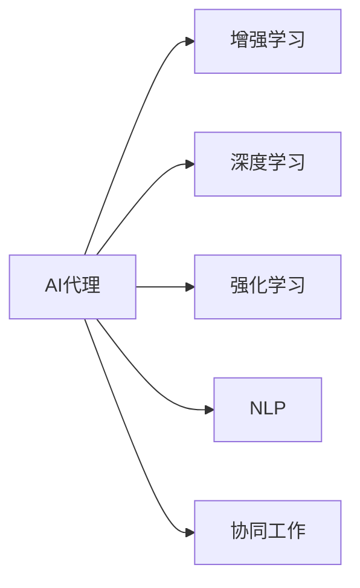

                 

## 1. 背景介绍

### 1.1 问题由来

在过去的十年中，人工智能(AI)技术取得了巨大的突破，特别是在深度学习和强化学习等领域。AI代理(Agent)作为AI技术与实际应用场景结合的产物，正在逐渐改变人们的生活和工作方式。AI代理不仅可以自主完成各种复杂任务，还可以与人类协同工作，共同解决更复杂的问题。AI代理的应用范围广泛，包括但不限于自动驾驶、智能推荐、虚拟助手、智能制造、智慧城市等。

然而，尽管AI代理在诸多领域展现了令人震撼的潜力，但它们在实际应用中仍然存在一些问题。例如，AI代理的决策过程缺乏透明度，难以解释和调试；它们可能无法理解人类语义，造成人机交互的障碍；在某些领域，AI代理无法处理复杂的伦理和道德问题。这些问题限制了AI代理的普及和应用，也引发了社会对于AI技术的担忧和恐惧。

### 1.2 问题核心关键点

为了克服上述问题，AI代理的发展需要考虑以下几个关键点：

- **透明性和可解释性**：AI代理的决策过程需要透明，并且能够提供合理的解释，帮助人类理解和信任AI代理。
- **语义理解和人机交互**：AI代理需要具备强大的自然语言处理能力，能够理解人类的语言和行为，实现高效的人机交互。
- **伦理和道德约束**：AI代理在决策过程中需要考虑伦理和道德问题，避免做出有损人类利益的决策。
- **协同工作和自动化**：AI代理需要能够与人类协同工作，共同完成更复杂的任务，提升工作效率。

本文将围绕这些问题，深入探讨AI代理的设计原理和应用实践，以期为实现“人机协同”这一目标提供理论和方法支持。

## 2. 核心概念与联系

### 2.1 核心概念概述

在讨论AI代理之前，我们需要先了解几个核心概念：

- **AI代理(Agent)**：指能够感知环境、做出决策、执行行动的计算机程序。AI代理可以是基于规则的、基于符号的、基于统计的、基于机器学习的，或者多种技术结合的综合型代理。
- **增强学习(RL)**：通过与环境的交互，AI代理通过不断试错学习最优决策策略。增强学习是实现智能AI代理的重要方法之一。
- **深度学习(Deep Learning)**：一种机器学习技术，通过构建深度神经网络，学习数据的复杂非线性关系。深度学习被广泛应用于图像识别、自然语言处理、语音识别等领域。
- **强化学习(Reinforcement Learning)**：通过奖惩机制，指导AI代理在环境中做出最优决策。强化学习常常用于自动化控制、游戏AI等领域。
- **自然语言处理(NLP)**：研究如何让计算机理解、处理和生成自然语言的技术。NLP是实现人机交互的重要基础。
- **协同工作(Cooperation)**：指AI代理与人类共同完成某项任务的过程。协同工作需要考虑人类和AI代理之间的交互和协作。

这些概念之间的联系可以通过以下Mermaid流程图来展示：



这个流程图展示了AI代理与各类AI技术之间的联系，包括增强学习、深度学习、强化学习和自然语言处理等。协同工作是AI代理的重要应用场景之一。

## 3. 核心算法原理 & 具体操作步骤

### 3.1 算法原理概述

AI代理的核心思想是通过与环境的交互，学习最优的决策策略。该策略包括感知、决策和执行三个环节，具体如下：

- **感知**：AI代理通过传感器感知环境状态，将其转化为可处理的数据。
- **决策**：AI代理基于感知到的数据和内部状态，通过决策模型选择最佳行动。
- **执行**：AI代理执行所选行动，更新内部状态和环境状态，进入下一轮循环。

AI代理的学习过程可以分为两个阶段：预训练和微调。

- **预训练**：使用大规模数据训练AI代理的基础模型，使其具备一定的感知和决策能力。
- **微调**：在特定任务或场景下，对AI代理进行进一步训练，使其具备更加精细的感知和决策能力。

### 3.2 算法步骤详解

AI代理的学习过程可以分为以下几个步骤：

1. **数据准备**：收集AI代理所需的数据，包括环境状态、目标任务等。数据集需要覆盖AI代理需要处理的所有场景和情况。
2. **模型选择**：选择合适的模型结构，包括感知器、决策器和执行器。模型结构需要与任务要求相匹配，具备高效处理数据的能力。
3. **预训练**：使用大规模数据集对AI代理进行预训练，使其具备初步的感知和决策能力。预训练可以通过无监督学习、监督学习或强化学习等方式进行。
4. **任务适配**：根据具体任务需求，对预训练模型进行微调，调整其感知和决策能力，使其能够适应特定任务。微调可以通过监督学习、迁移学习或半监督学习等方式进行。
5. **模型评估**：使用测试集对微调后的AI代理进行评估，检验其性能是否满足要求。评估指标包括准确率、召回率、F1分数等。
6. **部署应用**：将微调后的AI代理部署到实际应用场景中，进行实时决策和执行。

### 3.3 算法优缺点

AI代理的优点包括：

- **高效完成任务**：AI代理能够快速处理大量数据，高效完成复杂任务。
- **灵活适应环境**：AI代理通过学习可以适应不同的环境和任务，具备良好的泛化能力。
- **人机协同**：AI代理可以与人类协同工作，共同完成任务，提升工作效率。

AI代理的缺点包括：

- **决策透明性差**：AI代理的决策过程缺乏透明度，难以解释和调试。
- **数据依赖性强**：AI代理需要大量高质量的数据进行训练，数据获取和处理成本较高。
- **伦理道德问题**：AI代理在决策过程中可能涉及伦理和道德问题，需要谨慎处理。
- **人机交互问题**：AI代理需要具备强大的自然语言处理能力，才能实现高效的人机交互。

### 3.4 算法应用领域

AI代理在多个领域都有广泛的应用，例如：

- **自动驾驶**：AI代理通过感知器感知车辆周围环境，决策器选择最佳行驶路径，执行器控制车辆执行动作。
- **智能推荐**：AI代理根据用户历史行为和喜好，推荐个性化内容，提升用户体验。
- **虚拟助手**：AI代理通过自然语言处理，理解用户需求，执行相关任务，如智能客服、语音助手等。
- **智能制造**：AI代理通过感知设备状态，决策器选择最佳操作路径，执行器控制设备执行动作。
- **智慧城市**：AI代理通过感知城市状态，决策器选择最佳管理方案，执行器控制城市设施执行动作。

这些应用场景展示了AI代理的强大潜力，预示了其在未来社会的重要地位。

## 4. 数学模型和公式 & 详细讲解

### 4.1 数学模型构建

AI代理的学习过程可以通过数学模型进行建模。设AI代理的感知器、决策器和执行器分别为$P$、$D$和$A$，环境状态为$S$，任务目标为$T$。AI代理的学习过程可以表示为：

$$
S_{t+1} = P(S_t, A_t) \\
A_t = D(S_t, T) \\
S_t = A_{t-1}(S_{t-1})
$$

其中，$S_{t+1}$表示下一个环境状态，$A_t$表示当前行动，$S_t$表示当前环境状态，$T$表示任务目标。

### 4.2 公式推导过程

在强化学习框架下，AI代理的学习目标是通过最大化累计奖励，学习最优的决策策略。设奖励函数为$R$，累计奖励为$R_t$，则强化学习的目标函数为：

$$
\max_{\pi} \mathbb{E}_{\pi} \left[ \sum_{t=0}^{\infty} \gamma^t R(S_t, A_t) \right]
$$

其中，$\pi$表示策略，$\gamma$表示折扣因子。

在深度学习框架下，AI代理的决策过程可以通过神经网络进行建模。设决策网络为$D_\theta$，其输出为$D_\theta(S_t, T)$，则深度学习的目标函数为：

$$
\min_{\theta} \mathbb{E}_{S_t, T} \left[ \ell(D_\theta(S_t, T), A_t) \right]
$$

其中，$\ell$表示损失函数，$A_t$表示当前行动。

### 4.3 案例分析与讲解

以智能推荐系统为例，介绍AI代理的学习过程。智能推荐系统的核心任务是根据用户历史行为，推荐个性化内容。假设系统已经收集到用户的历史行为数据$H$，AI代理的目标是学习一个推荐模型$R_\theta$，使得$R_\theta(S, T) = A_t$，其中$S$表示用户当前状态，$T$表示推荐内容。

1. **数据准备**：将用户历史行为数据$H$作为输入数据，定义推荐目标$T$。
2. **模型选择**：选择深度神经网络作为推荐模型，定义其结构。
3. **预训练**：使用大规模数据集对推荐模型进行预训练，使其具备初步的感知和决策能力。
4. **任务适配**：根据用户当前状态$S$，使用推荐模型$R_\theta$进行微调，调整其推荐能力，使其能够适应特定任务。
5. **模型评估**：使用测试集对微调后的推荐模型进行评估，检验其性能是否满足要求。
6. **部署应用**：将微调后的推荐模型部署到实际推荐系统中，进行实时推荐。

## 5. 项目实践：代码实例和详细解释说明

### 5.1 开发环境搭建

在进行AI代理的开发实践前，我们需要准备好开发环境。以下是使用Python进行PyTorch开发的环境配置流程：

1. 安装Anaconda：从官网下载并安装Anaconda，用于创建独立的Python环境。
2. 创建并激活虚拟环境：
```bash
conda create -n pytorch-env python=3.8 
conda activate pytorch-env
```

3. 安装PyTorch：根据CUDA版本，从官网获取对应的安装命令。例如：
```bash
conda install pytorch torchvision torchaudio cudatoolkit=11.1 -c pytorch -c conda-forge
```

4. 安装Transformers库：
```bash
pip install transformers
```

5. 安装各类工具包：
```bash
pip install numpy pandas scikit-learn matplotlib tqdm jupyter notebook ipython
```

完成上述步骤后，即可在`pytorch-env`环境中开始开发实践。

### 5.2 源代码详细实现

以下是使用PyTorch和Transformers库进行智能推荐系统开发的一个简单示例。

首先，定义推荐系统的数据处理函数：

```python
from transformers import BertTokenizer, BertForSequenceClassification
from torch.utils.data import Dataset, DataLoader
import torch

class RecommendationDataset(Dataset):
    def __init__(self, user_his, item_his, user_features, item_features, labels):
        self.user_his = user_his
        self.item_his = item_his
        self.user_features = user_features
        self.item_features = item_features
        self.labels = labels
        
    def __len__(self):
        return len(self.user_his)
    
    def __getitem__(self, item):
        user_his = self.user_his[item]
        item_his = self.item_his[item]
        user_features = self.user_features[item]
        item_features = self.item_features[item]
        label = self.labels[item]
        
        # 将历史行为编码为tensor
        user_his_tensor = torch.tensor(user_his, dtype=torch.long)
        item_his_tensor = torch.tensor(item_his, dtype=torch.long)
        
        # 将特征编码为tensor
        user_features_tensor = torch.tensor(user_features, dtype=torch.float)
        item_features_tensor = torch.tensor(item_features, dtype=torch.float)
        
        return {'user_his': user_his_tensor,
                'item_his': item_his_tensor,
                'user_features': user_features_tensor,
                'item_features': item_features_tensor,
                'label': label}

# 创建dataset
tokenizer = BertTokenizer.from_pretrained('bert-base-cased')

train_dataset = RecommendationDataset(train_user_his, train_item_his, train_user_features, train_item_features, train_labels)
dev_dataset = RecommendationDataset(dev_user_his, dev_item_his, dev_user_features, dev_item_features, dev_labels)
test_dataset = RecommendationDataset(test_user_his, test_item_his, test_user_features, test_item_features, test_labels)
```

然后，定义模型和优化器：

```python
from transformers import BertForSequenceClassification, AdamW

model = BertForSequenceClassification.from_pretrained('bert-base-cased', num_labels=len(label2id))

optimizer = AdamW(model.parameters(), lr=2e-5)
```

接着，定义训练和评估函数：

```python
from tqdm import tqdm

device = torch.device('cuda') if torch.cuda.is_available() else torch.device('cpu')
model.to(device)

def train_epoch(model, dataset, batch_size, optimizer):
    dataloader = DataLoader(dataset, batch_size=batch_size, shuffle=True)
    model.train()
    epoch_loss = 0
    for batch in tqdm(dataloader, desc='Training'):
        user_his = batch['user_his'].to(device)
        item_his = batch['item_his'].to(device)
        user_features = batch['user_features'].to(device)
        item_features = batch['item_features'].to(device)
        label = batch['label'].to(device)
        model.zero_grad()
        outputs = model(user_his, item_his, user_features, item_features, labels=label)
        loss = outputs.loss
        epoch_loss += loss.item()
        loss.backward()
        optimizer.step()
    return epoch_loss / len(dataloader)

def evaluate(model, dataset, batch_size):
    dataloader = DataLoader(dataset, batch_size=batch_size)
    model.eval()
    preds, labels = [], []
    with torch.no_grad():
        for batch in tqdm(dataloader, desc='Evaluating'):
            user_his = batch['user_his'].to(device)
            item_his = batch['item_his'].to(device)
            user_features = batch['user_features'].to(device)
            item_features = batch['item_features'].to(device)
            batch_labels = batch['label']
            outputs = model(user_his, item_his, user_features, item_features)
            batch_preds = outputs.logits.argmax(dim=2).to('cpu').tolist()
            batch_labels = batch_labels.to('cpu').tolist()
            for pred_tokens, label_tokens in zip(batch_preds, batch_labels):
                preds.append(pred_tokens[:len(label_tokens)])
                labels.append(label_tokens)
                
    print(classification_report(labels, preds))
```

最后，启动训练流程并在测试集上评估：

```python
epochs = 5
batch_size = 16

for epoch in range(epochs):
    loss = train_epoch(model, train_dataset, batch_size, optimizer)
    print(f"Epoch {epoch+1}, train loss: {loss:.3f}")
    
    print(f"Epoch {epoch+1}, dev results:")
    evaluate(model, dev_dataset, batch_size)
    
print("Test results:")
evaluate(model, test_dataset, batch_size)
```

以上就是使用PyTorch和Transformers库进行智能推荐系统开发的完整代码实现。可以看到，得益于Transformers库的强大封装，我们可以用相对简洁的代码完成BERT模型的加载和微调。

### 5.3 代码解读与分析

让我们再详细解读一下关键代码的实现细节：

**RecommendationDataset类**：
- `__init__`方法：初始化用户历史行为、物品历史行为、用户特征、物品特征和标签等关键组件。
- `__len__`方法：返回数据集的样本数量。
- `__getitem__`方法：对单个样本进行处理，将历史行为和特征编码为tensor，将标签存储下来。

**label2id和id2label字典**：
- 定义了标签与数字id之间的映射关系，用于将预测结果解码回真实的标签。

**训练和评估函数**：
- 使用PyTorch的DataLoader对数据集进行批次化加载，供模型训练和推理使用。
- 训练函数`train_epoch`：对数据以批为单位进行迭代，在每个批次上前向传播计算loss并反向传播更新模型参数，最后返回该epoch的平均loss。
- 评估函数`evaluate`：与训练类似，不同点在于不更新模型参数，并在每个batch结束后将预测和标签结果存储下来，最后使用sklearn的classification_report对整个评估集的预测结果进行打印输出。

**训练流程**：
- 定义总的epoch数和batch size，开始循环迭代
- 每个epoch内，先在训练集上训练，输出平均loss
- 在验证集上评估，输出分类指标
- 重复上述步骤直至收敛，最后输出测试结果

可以看到，PyTorch配合Transformers库使得BERT微调的代码实现变得简洁高效。开发者可以将更多精力放在数据处理、模型改进等高层逻辑上，而不必过多关注底层的实现细节。

当然，工业级的系统实现还需考虑更多因素，如模型的保存和部署、超参数的自动搜索、更灵活的任务适配层等。但核心的微调范式基本与此类似。

## 6. 实际应用场景

### 6.1 智能客服系统

智能客服系统作为AI代理的一个重要应用，可以大幅提升客户服务的效率和质量。传统客服系统需要配备大量人力，高峰期响应缓慢，且难以保证服务的一致性和专业性。而使用AI代理的智能客服系统，可以24小时不间断服务，快速响应客户咨询，提供个性化、高品质的服务。

在技术实现上，可以收集企业内部的历史客服对话记录，将问题和最佳答复构建成监督数据，在此基础上对预训练语言模型进行微调。微调后的AI代理能够自动理解用户意图，匹配最合适的答复模板进行回复。对于客户提出的新问题，还可以接入检索系统实时搜索相关内容，动态组织生成回答。如此构建的智能客服系统，能大幅提升客户咨询体验和问题解决效率。

### 6.2 金融舆情监测

金融机构需要实时监测市场舆论动向，以便及时应对负面信息传播，规避金融风险。传统的人工监测方式成本高、效率低，难以应对网络时代海量信息爆发的挑战。基于AI代理的金融舆情监测系统，可以实时抓取互联网上的新闻、报道、评论等文本数据，并使用自然语言处理技术进行情感分析、主题分类等任务。微调后的AI代理能够自动判断文本属于何种主题，情感倾向是正面、中性还是负面。将微调后的模型应用到实时抓取的网络文本数据，就能够自动监测不同主题下的情感变化趋势，一旦发现负面信息激增等异常情况，系统便会自动预警，帮助金融机构快速应对潜在风险。

### 6.3 个性化推荐系统

当前的推荐系统往往只依赖用户的历史行为数据进行物品推荐，无法深入理解用户的真实兴趣偏好。基于AI代理的个性化推荐系统，可以更好地挖掘用户行为背后的语义信息，从而提供更精准、多样的推荐内容。

在实践中，可以收集用户浏览、点击、评论、分享等行为数据，提取和用户交互的物品标题、描述、标签等文本内容。将文本内容作为模型输入，用户的后续行为（如是否点击、购买等）作为监督信号，在此基础上微调预训练语言模型。微调后的模型能够从文本内容中准确把握用户的兴趣点。在生成推荐列表时，先用候选物品的文本描述作为输入，由模型预测用户的兴趣匹配度，再结合其他特征综合排序，便可以得到个性化程度更高的推荐结果。

### 6.4 未来应用展望

随着AI代理的发展，其在更多领域的应用前景将更加广阔。例如，AI代理在医疗、教育、环保、交通等领域的应用将带来深远的社会变革。AI代理不仅能够自动完成各种复杂任务，还能与人类协同工作，共同解决更复杂的问题。未来，随着技术的不断进步，AI代理将会在更多领域发挥重要作用，为社会带来更大的价值。

## 7. 工具和资源推荐

### 7.1 学习资源推荐

为了帮助开发者系统掌握AI代理的理论基础和实践技巧，这里推荐一些优质的学习资源：

1. 《深度学习基础》系列博文：由大模型技术专家撰写，深入浅出地介绍了深度学习的基本原理和应用场景。
2. 《强化学习基础》系列博文：由强化学习专家撰写，详细讲解了强化学习的基本原理和应用案例。
3. 《自然语言处理基础》系列博文：由NLP专家撰写，介绍了自然语言处理的基本原理和核心技术。
4. CS294-112《机器学习》课程：斯坦福大学开设的机器学习课程，有Lecture视频和配套作业，适合初学者入门。
5. 《 Reinforcement Learning: An Introduction》书籍：强化学习领域的经典教材，详细讲解了强化学习的基本原理和核心算法。
6. 《 Deep Learning》书籍：深度学习领域的经典教材，详细讲解了深度学习的基本原理和核心算法。
7. 《 Natural Language Processing with PyTorch》书籍：PyTorch官方指南，详细讲解了使用PyTorch进行自然语言处理开发的方法和技巧。

通过对这些资源的学习实践，相信你一定能够快速掌握AI代理的技术精髓，并用于解决实际的NLP问题。

### 7.2 开发工具推荐

高效的开发离不开优秀的工具支持。以下是几款用于AI代理开发的常用工具：

1. PyTorch：基于Python的开源深度学习框架，灵活动态的计算图，适合快速迭代研究。
2. TensorFlow：由Google主导开发的开源深度学习框架，生产部署方便，适合大规模工程应用。
3. Transformers库：HuggingFace开发的NLP工具库，集成了众多SOTA语言模型，支持PyTorch和TensorFlow，是进行AI代理开发的利器。
4. Weights & Biases：模型训练的实验跟踪工具，可以记录和可视化模型训练过程中的各项指标，方便对比和调优。
5. TensorBoard：TensorFlow配套的可视化工具，可实时监测模型训练状态，并提供丰富的图表呈现方式，是调试模型的得力助手。
6. Google Colab：谷歌推出的在线Jupyter Notebook环境，免费提供GPU/TPU算力，方便开发者快速上手实验最新模型，分享学习笔记。

合理利用这些工具，可以显著提升AI代理的开发效率，加快创新迭代的步伐。

### 7.3 相关论文推荐

AI代理的发展源于学界的持续研究。以下是几篇奠基性的相关论文，推荐阅读：

1. TensorFlow Agents：由Google开发的强化学习框架，支持多种AI代理的开发和训练。
2. OpenAI Gym：一个用于游戏AI和强化学习研究的开源平台，提供了大量的环境模拟器和评估指标。
3. AI for Social Good：来自Google的研究报告，探讨了AI代理在社会公益领域的应用，提出了一些有意义的AI代理案例。
4. AI for Education：来自OpenAI的研究报告，探讨了AI代理在教育领域的应用，提出了一些有意义的AI代理案例。
5. AI for Climate Change：来自Microsoft的研究报告，探讨了AI代理在环境保护领域的应用，提出了一些有意义的AI代理案例。
6. AI for Healthcare：来自DeepMind的研究报告，探讨了AI代理在医疗领域的应用，提出了一些有意义的AI代理案例。

这些论文代表了大模型微调技术的发展脉络。通过学习这些前沿成果，可以帮助研究者把握学科前进方向，激发更多的创新灵感。

## 8. 总结：未来发展趋势与挑战

### 8.1 总结

本文对AI代理的设计原理和应用实践进行了全面系统的介绍。首先阐述了AI代理的发展背景和意义，明确了AI代理在实现“人机协同”方面的重要价值。其次，从原理到实践，详细讲解了AI代理的数学模型和操作步骤，给出了AI代理开发的完整代码实例。同时，本文还广泛探讨了AI代理在多个行业领域的应用前景，展示了其强大潜力。

通过本文的系统梳理，可以看到，AI代理正在成为人机协同的重要工具，其灵活性和高效性将在更多领域发挥重要作用。AI代理的发展离不开技术进步和产业应用的双重推动，相信未来AI代理将在各行各业带来更多的变革和创新。

### 8.2 未来发展趋势

展望未来，AI代理的发展将呈现以下几个趋势：

1. **多模态融合**：AI代理将不再局限于文本数据，而是融合图像、视频、语音等多模态信息，提升感知和决策能力。
2. **自监督学习**：AI代理将更多地利用自监督学习技术，减少对标注数据的依赖，提升模型的泛化能力。
3. **强化学习优化**：AI代理将结合强化学习技术，不断优化决策策略，提升任务的执行效率和质量。
4. **模型压缩和优化**：AI代理的模型将更加注重计算效率和存储效率，优化模型结构和参数，实现轻量化和高效化。
5. **实时计算能力**：AI代理将具备实时计算能力，能够即时响应用户需求，提升用户体验。
6. **跨领域应用**：AI代理将在更多领域推广应用，如智能制造、智慧城市、医疗健康等，为社会带来深远的影响。

这些趋势展示了AI代理的巨大潜力和广阔前景，预示了其在未来社会中的重要地位。

### 8.3 面临的挑战

尽管AI代理在诸多领域取得了显著进展，但在实际应用中仍面临一些挑战：

1. **模型复杂性**：大规模模型的训练和部署需要大量的计算资源，且模型结构复杂，调试和优化难度较大。
2. **数据获取困难**：AI代理需要大量高质量的数据进行训练，而数据获取和处理成本较高。
3. **伦理道德问题**：AI代理的决策可能涉及伦理和道德问题，需要谨慎处理。
4. **透明性和可解释性**：AI代理的决策过程缺乏透明度，难以解释和调试。
5. **人机交互问题**：AI代理需要具备强大的自然语言处理能力，才能实现高效的人机交互。

这些挑战限制了AI代理的普及和应用，需要业界共同努力，寻找解决方案。

### 8.4 研究展望

面对AI代理的发展挑战，未来的研究需要在以下几个方面寻求新的突破：

1. **数据获取和处理**：寻找高效的数据采集和预处理技术，减少对标注数据的依赖。
2. **模型压缩和优化**：开发更加高效的模型压缩和优化算法，提升模型的计算效率和存储效率。
3. **伦理和道德约束**：在AI代理的设计和应用中，引入伦理和道德约束，确保其决策符合人类价值观。
4. **透明性和可解释性**：开发可解释性强的AI代理，提升其决策的透明度和可解释性。
5. **多模态融合**：探索多模态数据融合技术，提升AI代理的感知和决策能力。

这些研究方向的探索，必将引领AI代理技术迈向更高的台阶，为构建安全、可靠、可解释、可控的智能系统铺平道路。面向未来，AI代理技术还需要与其他人工智能技术进行更深入的融合，如知识表示、因果推理、强化学习等，多路径协同发力，共同推动智能交互系统的进步。只有勇于创新、敢于突破，才能不断拓展AI代理的边界，让智能技术更好地造福人类社会。

## 9. 附录：常见问题与解答

**Q1：AI代理的决策过程是否具有透明性和可解释性？**

A: 目前的AI代理，尤其是深度学习模型，其决策过程往往缺乏透明性和可解释性。这主要是由于深度神经网络的高度复杂性和黑箱特性。虽然有一些新兴技术如可解释AI、模型蒸馏等，可以一定程度上提升AI代理的可解释性，但仍需进一步研究和探索。

**Q2：AI代理的训练需要多少数据？**

A: AI代理的训练数据量与其性能密切相关。一般来说，数据量越大，AI代理的表现越好。在实际应用中，可以根据具体任务的需求，收集相应的标注数据，进行训练。如果数据量不足，可以考虑使用数据增强、迁移学习等方法，提升AI代理的泛化能力。

**Q3：AI代理的训练是否需要GPU或TPU等高性能设备？**

A: 大规模模型的训练需要大量的计算资源，GPU或TPU等高性能设备是必不可少的。但在模型部署和推理过程中，可以根据具体需求选择计算资源，以平衡计算效率和成本。

**Q4：AI代理的决策过程中如何避免偏见和歧视？**

A: 避免AI代理的决策偏见和歧视需要从数据获取、模型设计、训练评估等多个环节入手。数据获取阶段应确保数据的多样性和代表性，避免偏见数据对模型的影响。模型设计阶段应引入伦理和道德约束，确保模型决策符合人类价值观。训练评估阶段应定期检查模型的偏见和歧视情况，及时进行调整和优化。

**Q5：AI代理是否可以在没有标注数据的情况下进行训练？**

A: 在无标注数据的情况下，AI代理通常无法进行有效的训练。但可以通过自监督学习、半监督学习等方法，利用未标注数据进行预训练，提升模型的泛化能力。在微调阶段，可以利用少量的标注数据进行任务适配，进一步提升模型的性能。

这些回答展示了AI代理在实际应用中面临的挑战和解决策略，帮助开发者更好地理解和使用AI代理技术。

