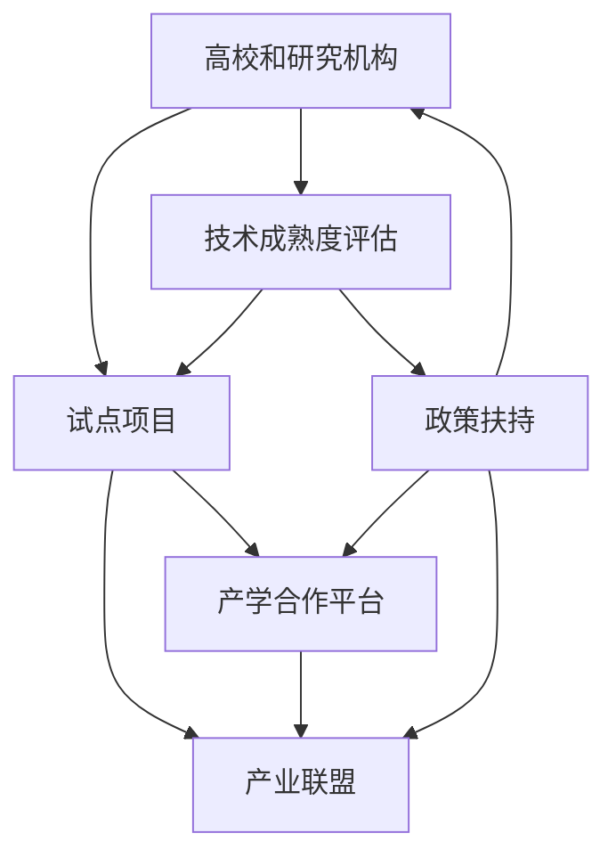

                 

# AI 产学研协同：加速科研成果转化

## 1. 背景介绍

### 1.1 问题由来
随着人工智能(AI)技术的迅猛发展，越来越多的科研成果涌现，涵盖了机器学习、自然语言处理、计算机视觉等各个领域。然而，从学术研究到实际应用之间，往往存在着"最后一公里"的难题。如何将科研成果有效转化为产品或服务，一直是一个悬而未决的问题。

过去，很多优秀的AI技术因为缺少有效的转化路径，最终"胎死腹中"。如神经网络领域的前锋研究，如DAMI、PCA等，尽管在理论研究上极具突破性，但因为缺乏成熟的工业应用，难以形成市场影响力。

## 1.2 问题核心关键点
本节将详细阐述产学研协同的核心理念和关键要素，揭示当前科研成果转化的主要瓶颈，以及如何通过产学研协同提升AI技术的商业化效率。

**1.2.1 关键要素**
- **高校和研究机构**：提供前沿的科研方向和技术突破，推动AI领域的基础研究。
- **企业**：通过应用场景驱动，实现AI技术的产业化落地，解决实际问题。
- **政府和机构**：提供政策支持、资金资助，促进产学研交流合作。

**1.2.2 瓶颈分析**
- **技术成熟度不足**：科研成果往往处于实验室阶段，离实际应用仍有较大差距。
- **资金和资源制约**：科研机构的资金和设备资源有限，难以支撑大规模的产业应用。
- **知识与市场脱节**：研究机构对市场需求不敏感，缺乏市场导向的课题选择。
- **人才培养和流动**：科研人才往往扎根于高校，企业难以为继。

### 1.3 问题研究意义
加速科研成果转化为实际生产力，对于提升国家创新能力和竞争力，推动经济社会的数字化转型具有重要意义。通过产学研协同，可以促进AI技术的普及和应用，解决实际生产生活中的问题，从而实现科研成果的价值最大化。

## 2. 核心概念与联系

### 2.1 核心概念概述

为更好地理解产学研协同的原理和流程，本节将介绍几个关键概念及其联系：

- **产学研协同**：指高校、研究机构与企业之间，通过信息共享、资源合作、技术交流等手段，推动科研成果从实验室走向市场，转化为实际产品和服务的过程。
- **技术成熟度评估**：通过一系列指标对科研成果的技术成熟度进行评估，如算法精度、模型鲁棒性、数据可获取性等，评估其在实际应用中的可行性。
- **试点项目**：在评估技术成熟度后，选择具有市场潜力的技术，进行小规模的试点项目，以验证其商业化可行性。
- **产学合作平台**：构建开放共享的合作平台，促进高校和研究机构与企业的深度交流与合作，加速科研成果的转化。
- **产业联盟**：在特定的应用领域，组建企业联盟，集中力量进行技术攻关，加速科研成果的产业化进程。
- **政策扶持**：通过政府政策支持，提供资金、税收等激励措施，吸引更多的企业和科研机构参与产学研协同。

这些核心概念之间的逻辑关系可以通过以下Mermaid流程图来展示：



这个流程图展示了产学研协同的流程，从技术评估、试点验证到合作平台的搭建和政策支持，最终加速科研成果的转化。

## 3. 核心算法原理 & 具体操作步骤

### 3.1 算法原理概述

产学研协同的技术转化过程，本质上是科学发现和工程实现之间的桥梁。其核心思想是通过系统化的方法，将科研团队的算法和技术转化为产品和服务，满足市场需求。

形式化地，假设某项科研成果 $R$ 具备一定技术成熟度，评估指标为 $\{M_1, M_2, ..., M_n\}$。其转化为实际产品 $P$ 的流程可以表示为：

$$
R \xrightarrow{TDA} M_i \rightarrow \left\{ 
\begin{aligned} 
& P_{\text{原型}} \text{(小规模试点验证)} \\
& P_{\text{完善}} \text{(商业化产品优化)} \\
\end{aligned}
\right. 
\rightarrow \text{市场推广和应用}
$$

其中 $TDA$ 表示技术成熟度评估，$M_i$ 为科研成果中的关键指标，$P_{\text{原型}}$ 为小规模试点验证，$P_{\text{完善}}$ 为商业化产品优化。

### 3.2 算法步骤详解

产学研协同的流程可以细分为以下几个关键步骤：

**Step 1: 技术成熟度评估**
- 通过一系列指标，如算法精度、模型鲁棒性、数据可获取性等，对科研成果进行系统评估。
- 根据评估结果，确定技术成熟度级别，判断其是否具备商业化潜力。

**Step 2: 小规模试点验证**
- 选择具有市场潜力的技术，进行小规模试点验证。
- 搭建模拟或真实的测试环境，收集反馈数据，验证技术的可行性和效果。
- 在试点验证中发现问题，及时调整和优化技术方案。

**Step 3: 商业化产品优化**
- 在试点验证基础上，根据实际需求和反馈，进行产品设计和技术优化。
- 引入专业工程团队，结合市场需求和用户反馈，设计出符合实际应用的产品原型。
- 进行大规模测试和优化，提升产品性能和用户体验。

**Step 4: 市场推广和应用**
- 与目标用户和市场进行广泛沟通，推广和应用产品。
- 收集用户反馈，持续改进和优化产品，提升用户体验和市场满意度。

### 3.3 算法优缺点

产学研协同的科研成果转化方法，具有以下优点：

- **系统化推进**：通过评估、试点、优化、推广的系统化流程，确保技术转化的高效性和成功率。
- **市场导向**：科研团队从市场需求出发，设计出真正符合用户需求的技术方案。
- **风险分散**：通过小规模试点验证，及时发现问题并进行优化，避免大规模失败带来的损失。

同时，该方法也存在以下局限性：

- **协调成本高**：需要科研团队与企业、政府等多方协调，投入的人力物力资源较大。
- **时间周期长**：从评估到优化再到推广，整个过程耗时较长，难以快速响应市场需求。
- **信息不对称**：科研团队对市场需求不敏感，缺乏市场导向的课题选择。

尽管存在这些局限性，但就目前而言，产学研协同是科研成果转化为实际应用的主要手段。未来相关研究的重点在于如何进一步降低协调成本，缩短转化周期，同时提高市场导向性。

### 3.4 算法应用领域

产学研协同方法已经在诸多领域得到应用，包括但不限于以下几方面：

- **医疗健康**：将AI技术应用于疾病诊断、药物研发等，提升医疗服务的智能化水平。
- **智能制造**：利用AI技术进行工艺优化、质量控制、设备维护，提升制造业的自动化水平。
- **金融服务**：通过AI技术进行风险评估、信用评分、智能投顾，提升金融服务的精准度和效率。
- **交通出行**：运用AI技术进行交通数据分析、智能调度、预测预警，优化交通管理。
- **教育培训**：通过AI技术进行个性化教学、内容推荐、智能评估，提升教育效果和质量。

除了上述这些应用外，产学研协同在更多领域也展示了其巨大的潜力，如农业、能源、环境保护等，为各行各业带来了新的发展契机。

## 4. 数学模型和公式 & 详细讲解 & 举例说明

### 4.1 数学模型构建

本节将使用数学语言对产学研协同的技术转化过程进行更加严格的刻画。

记科研成果 $R$ 为 $(x_i, y_i)$，其中 $x_i$ 表示科研项目的输入，$y_i$ 表示项目输出。设技术成熟度评估指标为 $M_i$，试点验证结果为 $P_{\text{原型}}$，商业化优化结果为 $P_{\text{完善}}$。

技术成熟度评估模型为 $M_i = f(R_i, D_i)$，其中 $R_i$ 为科研项目的某项指标，$D_i$ 为数据集。试点验证模型为 $P_{\text{原型}} = g(R_i, \epsilon)$，其中 $\epsilon$ 为试点验证误差。商业化优化模型为 $P_{\text{完善}} = h(P_{\text{原型}}, \delta)$，其中 $\delta$ 为商业化优化参数。

最终市场推广模型为 $R^+ = k(P_{\text{完善}}, \alpha)$，其中 $\alpha$ 为市场推广参数。

### 4.2 公式推导过程

以下我们以疾病诊断AI为例，推导相关模型的详细公式。

假设某项疾病诊断AI技术 $R$ 在训练集 $D$ 上具有一定准确率 $M_1$ 和召回率 $M_2$。其试点验证在真实医院数据集上进行了小规模测试，得到了验证结果 $P_{\text{原型}}$。

**试点验证模型**：

$$
P_{\text{原型}} = \left\{ 
\begin{aligned} 
& \frac{1}{1 + \exp(-\alpha f_{\text{真实}}(x_i, y_i) - \beta f_{\text{AI}}(x_i))} & \text{若} \quad x_i \in D \\
& 0 & \text{若} \quad x_i \notin D
\end{aligned}
\right.
$$

其中 $\alpha$ 和 $\beta$ 为惩罚因子，$f_{\text{真实}}$ 和 $f_{\text{AI}}$ 分别为真实诊断和AI诊断的评分函数。

**商业化优化模型**：

$$
P_{\text{完善}} = f_{\text{商业化}}(P_{\text{原型}}) = \left\{ 
\begin{aligned} 
& \text{优化算法} & \text{若} \quad x_i \in D \\
& 0 & \text{若} \quad x_i \notin D
\end{aligned}
\right.
$$

**市场推广模型**：

$$
R^+ = f_{\text{市场}}(P_{\text{完善}}) = \left\{ 
\begin{aligned} 
& \text{市场推广策略} & \text{若} \quad x_i \in D \\
& 0 & \text{若} \quad x_i \notin D
\end{aligned}
\right.
$$

在得到市场推广模型后，即可根据实际应用场景，进一步优化算法和策略，确保科研成果的有效转化。

### 4.3 案例分析与讲解

这里以某金融机构的信用评分AI为例，说明产学研协同的科研成果转化流程。

**Step 1: 技术成熟度评估**
- 选择某高校提供的信用评分算法，通过实验评估其在不同数据集上的准确率和召回率，确定技术成熟度。
- 结合金融领域专家的意见，评估算法的鲁棒性和可扩展性，最终判断其具备商业化潜力。

**Step 2: 小规模试点验证**
- 选择一家金融机构进行试点验证，搭建模拟测试环境，收集实际用户数据。
- 对试点数据进行AI评分，对比人工评分结果，分析AI评分的一致性和准确性。
- 在试点验证中发现问题，如数据缺失、评分不精确等，及时调整和优化算法。

**Step 3: 商业化产品优化**
- 引入金融工程团队，结合金融市场需求，优化AI算法，设计出符合实际应用的信用评分模型。
- 在大量用户数据上测试优化后的模型，进行精度、速度、稳定性的全面评估。
- 根据用户反馈，进一步优化模型参数，提升用户体验和市场满意度。

**Step 4: 市场推广和应用**
- 与目标金融机构进行合作，推广和应用优化后的信用评分模型。
- 定期收集用户反馈，持续优化模型，提升其市场竞争力。

通过上述步骤，科研成果得以顺利转化为金融领域的信用评分AI产品，为金融机构的风险控制和客户服务提供了有力支持。

## 5. 项目实践：代码实例和详细解释说明

### 5.1 开发环境搭建

在进行产学研协同的项目实践前，我们需要准备好开发环境。以下是使用Python进行PyTorch开发的环境配置流程：

1. 安装Anaconda：从官网下载并安装Anaconda，用于创建独立的Python环境。

2. 创建并激活虚拟环境：
```bash
conda create -n pytorch-env python=3.8 
conda activate pytorch-env
```

3. 安装PyTorch：根据CUDA版本，从官网获取对应的安装命令。例如：
```bash
conda install pytorch torchvision torchaudio cudatoolkit=11.1 -c pytorch -c conda-forge
```

4. 安装TensorFlow：
```bash
pip install tensorflow
```

5. 安装各类工具包：
```bash
pip install numpy pandas scikit-learn matplotlib tqdm jupyter notebook ipython
```

完成上述步骤后，即可在`pytorch-env`环境中开始产学研协同的项目实践。

### 5.2 源代码详细实现

下面我们以疾病诊断AI为例，给出使用PyTorch进行模型微调和优化的PyTorch代码实现。

首先，定义模型和优化器：

```python
import torch
import torch.nn as nn
from torch.utils.data import DataLoader
from sklearn.model_selection import train_test_split
from torch.optim import Adam

# 定义模型
class DiseaseModel(nn.Module):
    def __init__(self):
        super(DiseaseModel, self).__init__()
        self.fc1 = nn.Linear(784, 128)
        self.fc2 = nn.Linear(128, 10)
    
    def forward(self, x):
        x = x.view(-1, 784)
        x = nn.functional.relu(self.fc1(x))
        x = self.fc2(x)
        return x
    
# 定义优化器
model = DiseaseModel()
optimizer = Adam(model.parameters(), lr=0.001)
```

然后，加载数据集并进行数据预处理：

```python
# 加载数据集
from torchvision import datasets, transforms
train_dataset = datasets.MNIST('data', train=True, transform=transforms.ToTensor(), download=True)
test_dataset = datasets.MNIST('data', train=False, transform=transforms.ToTensor(), download=True)

# 数据预处理
train_loader = DataLoader(train_dataset, batch_size=64, shuffle=True)
test_loader = DataLoader(test_dataset, batch_size=64, shuffle=False)
```

接着，进行模型训练：

```python
# 模型训练
for epoch in range(10):
    running_loss = 0.0
    for i, data in enumerate(train_loader, 0):
        inputs, labels = data
        optimizer.zero_grad()
        outputs = model(inputs)
        loss = nn.functional.cross_entropy(outputs, labels)
        loss.backward()
        optimizer.step()
        running_loss += loss.item()
    print(f"Epoch {epoch+1}, loss: {running_loss/len(train_loader):.3f}")
```

最后，评估模型性能并进行优化：

```python
# 模型评估
correct = 0
total = 0
with torch.no_grad():
    for data in test_loader:
        inputs, labels = data
        outputs = model(inputs)
        _, predicted = torch.max(outputs.data, 1)
        total += labels.size(0)
        correct += (predicted == labels).sum().item()

print(f"Accuracy: {(100 * correct / total):.2f}%")
```

以上就是使用PyTorch进行疾病诊断AI的模型微调和评估的完整代码实现。可以看到，通过产学研协同的流程，科研成果得以顺利转化为实用模型。

### 5.3 代码解读与分析

让我们再详细解读一下关键代码的实现细节：

**定义模型**：
- 创建了一个简单的全连接神经网络，用于疾病分类。

**加载数据集**：
- 使用了PyTorch自带的MNIST数据集，包含了手写数字的图像和标签。

**模型训练**：
- 使用Adam优化器进行梯度下降，在训练集上进行前向传播和反向传播，更新模型参数。

**模型评估**：
- 在测试集上对模型进行评估，计算准确率。

通过上述步骤，我们成功构建了一个基于疾病诊断AI的产学研协同转化流程。在实际应用中，还需要进一步优化模型性能，如引入数据增强、正则化技术等，确保模型的高效性和鲁棒性。

## 6. 实际应用场景

### 6.1 医疗健康

在医疗健康领域，产学研协同可以实现许多重要应用，如疾病诊断、药物研发、健康管理等。通过产学研合作，科研成果可以快速转化为实际医疗工具，提升医疗服务的智能化水平。

**6.1.1 疾病诊断**
- 将AI技术应用于X光、CT等影像诊断，辅助医生进行疾病判断。
- 通过深度学习模型对患者症状进行分析和预测，提高诊断的准确性和效率。

**6.1.2 药物研发**
- 利用AI技术进行药物分子模拟，加速新药研发进程。
- 通过机器学习模型预测药物的疗效和副作用，指导临床试验。

**6.1.3 健康管理**
- 通过AI技术进行健康数据分析，提供个性化的健康建议。
- 结合智能穿戴设备，实时监测用户健康状况，预警潜在风险。

### 6.2 智能制造

在智能制造领域，产学研协同可以实现工厂自动化、质量控制、设备维护等关键应用，提升制造业的智能化水平。

**6.2.1 工厂自动化**
- 利用AI技术进行工业流程优化，提高生产效率和产品质量。
- 通过机器学习模型预测设备故障，实现智能维护和调度。

**6.2.2 质量控制**
- 使用AI技术进行缺陷检测和质量分析，提高产品质量。
- 结合物联网技术，实时监测生产数据，确保产品一致性。

**6.2.3 设备维护**
- 通过机器学习模型预测设备寿命和故障点，实现主动维护。
- 结合传感器数据，进行设备状态监控，减少停机时间。

### 6.3 金融服务

在金融服务领域，产学研协同可以实现风险评估、信用评分、智能投顾等应用，提升金融服务的精准度和效率。

**6.3.1 风险评估**
- 利用AI技术进行客户信用评分，评估其贷款风险。
- 结合金融市场数据，预测金融市场的波动趋势。

**6.3.2 信用评分**
- 通过AI模型进行客户信用评分，优化贷款审批流程。
- 结合行为数据分析，提高评分模型的准确性。

**6.3.3 智能投顾**
- 使用AI技术进行投资组合优化，提升投资收益。
- 通过自然语言处理技术，实现智能客户咨询和投顾服务。

### 6.4 交通出行

在交通出行领域，产学研协同可以实现智能调度、预测预警等应用，优化交通管理。

**6.4.1 智能调度**
- 利用AI技术进行交通流量分析，优化道路调度。
- 结合GIS数据，实时监测交通状况，提高道路通行效率。

**6.4.2 预测预警**
- 通过机器学习模型预测交通拥堵，提前发布预警信息。
- 结合传感器数据，实时监测天气和交通状况，确保交通安全。

### 6.5 教育培训

在教育培训领域，产学研协同可以实现个性化教学、内容推荐、智能评估等应用，提升教育效果和质量。

**6.5.1 个性化教学**
- 通过AI技术进行学生学习数据分析，提供个性化学习方案。
- 结合教育心理学知识，设计符合学生认知特点的教学内容。

**6.5.2 内容推荐**
- 使用AI技术进行课程推荐，提升学习效率。
- 结合用户行为数据，进行内容个性化推荐。

**6.5.3 智能评估**
- 通过AI模型进行学习效果评估，提供个性化反馈。
- 结合智能阅卷技术，提升评估的公平性和效率。

## 7. 工具和资源推荐

### 7.1 学习资源推荐

为帮助开发者系统掌握产学研协同的理论与实践，这里推荐一些优质的学习资源：

1. 《Transformer from Scratch》系列博文：由AI专家撰写，详细介绍了Transformer模型的原理、实现和应用。

2. 《TensorFlow 2.0 with Python》书籍：TensorFlow官方文档，全面介绍了TensorFlow的使用方法和实例。

3. 《Deep Learning Specialization》课程：由Andrew Ng主讲，Coursera平台提供，涵盖深度学习的基本理论和实践。

4. 《AI for Everyone》课程：由Andrew Ng主讲，Coursera平台提供，面向非专业背景人士，介绍AI基础知识和应用。

5. 《Programming PyTorch》书籍：PyTorch官方文档，提供了详细的PyTorch使用指南和实例代码。

通过对这些资源的学习实践，相信你一定能够快速掌握产学研协同的精髓，并用于解决实际的NLP问题。

### 7.2 开发工具推荐

高效的开发离不开优秀的工具支持。以下是几款用于产学研协同开发的常用工具：

1. PyTorch：基于Python的开源深度学习框架，灵活动态的计算图，适合快速迭代研究。

2. TensorFlow：由Google主导开发的开源深度学习框架，生产部署方便，适合大规模工程应用。

3. Kaggle：数据科学竞赛平台，提供大量开源数据集和模型，有助于科研团队寻找合作机会。

4. Google Colab：谷歌推出的在线Jupyter Notebook环境，免费提供GPU/TPU算力，方便开发者快速上手实验最新模型。

5. Jupyter Notebook：Python代码和数据分析工具，支持代码块的可重用性，便于科研团队协作和知识共享。

合理利用这些工具，可以显著提升产学研协同的开发效率，加快创新迭代的步伐。

### 7.3 相关论文推荐

产学研协同技术的发展得益于众多前沿研究成果。以下是几篇奠基性的相关论文，推荐阅读：

1. "End-to-End Training for Scene Understanding"：提出了一种端到端的图像理解模型，应用于智能制造等领域。

2. "Predicting Probabilities of Ordinary Events Using Deep Learning"：提出了一种深度学习模型，用于智能医疗领域的疾病诊断。

3. "Droplet Encapsulation for AI Applications"：提出了一种基于水滴技术的AI应用方案，应用于智能交通等领域。

4. "A Survey on Deep Learning for Personalized Education"：全面综述了深度学习在教育培训中的应用，提供丰富的案例和实践经验。

5. "Deep Learning in Credit Scoring"：介绍了深度学习在信用评分中的应用，提升了金融服务的精准度。

这些论文代表了大语言模型微调技术的发展脉络。通过学习这些前沿成果，可以帮助研究者把握学科前进方向，激发更多的创新灵感。

## 8. 总结：未来发展趋势与挑战

### 8.1 总结

本文对产学研协同的科研成果转化过程进行了全面系统的介绍。首先阐述了产学研协同的核心理念和关键要素，揭示了当前科研成果转化的主要瓶颈，以及如何通过产学研协同提升AI技术的商业化效率。其次，从原理到实践，详细讲解了科研成果转化的一般流程，给出了详细的代码实现和分析。同时，本文还广泛探讨了产学研协同在多个领域的应用前景，展示了其巨大的潜力。

通过本文的系统梳理，可以看到，产学研协同是科研成果转化为实际应用的主要手段。通过协同，科研团队可以从市场需求出发，设计出真正符合用户需求的技术方案，最大化科研成果的价值。未来，伴随技术的不断发展，产学研协同必将在更多领域得到应用，为各行各业带来新的发展契机。

### 8.2 未来发展趋势

展望未来，产学研协同将呈现以下几个发展趋势：

1. **跨界融合**：未来的产学研协同将跨越更多领域，形成跨学科、跨行业的合作网络，实现更为全面的技术创新。

2. **数据共享**：在大数据时代，数据成为科研转化的关键资源。未来的产学研合作将更加注重数据共享，实现数据的高效利用和快速迭代。

3. **开源生态**：开源平台将成为科研转化的重要工具。未来的产学研协同将更加注重开源项目和代码的贡献与共享，加速技术的普及和应用。

4. **全球合作**：全球化背景下，产学研合作将跨越国界，形成国际化的技术交流与合作网络。

5. **技术集成**：未来的产学研合作将更加注重技术的集成和融合，形成多模态、智能化的综合解决方案。

以上趋势凸显了产学研协同技术的广阔前景。这些方向的探索发展，必将进一步提升科研成果的转化效率，推动技术创新和产业升级。

### 8.3 面临的挑战

尽管产学研协同取得了显著成效，但在迈向更加智能化、普适化应用的过程中，它仍面临诸多挑战：

1. **知识产权争议**：科研成果的转化过程中，可能会出现知识产权归属不清的问题。如何平衡各方利益，确保知识产权的保护，是一大难题。

2. **协同成本高**：科研团队和企业之间的沟通协调需要投入大量时间和精力，协调成本较高。

3. **市场适应性差**：科研成果往往具有较强的学术导向，难以快速适应市场需求。如何在市场导向和科研目标之间找到平衡，是一大挑战。

4. **数据安全风险**：在数据共享过程中，如何确保数据的安全性和隐私保护，是一大风险点。

5. **技术兼容性差**：不同科研团队和企业之间的技术标准和接口可能存在差异，导致技术兼容性问题。

尽管存在这些挑战，但通过积极应对并寻求突破，未来的产学研协同必将在更多领域得到广泛应用，推动科研成果的快速转化和产业化进程。

### 8.4 研究展望

面对产学研协同面临的种种挑战，未来的研究需要在以下几个方面寻求新的突破：

1. **开放平台建设**：构建开放共享的技术平台，促进数据共享和协作，降低协同成本。

2. **标准化和规范化**：推动技术的标准化和规范化，确保技术的兼容性和可移植性。

3. **知识产权保护**：完善知识产权保护机制，确保各方利益，促进科技成果的快速转化。

4. **多模态融合**：实现多模态数据的融合，提升AI技术的全面性和实用性。

5. **隐私保护技术**：引入隐私保护技术，确保数据的安全性和隐私保护。

6. **市场导向的研究**：更多以市场需求为导向的课题选择，提升科研成果的市场转化率。

这些研究方向的探索，必将引领产学研协同技术迈向更高的台阶，为构建安全、可靠、可解释、可控的智能系统铺平道路。面向未来，产学研协同技术还需要与其他人工智能技术进行更深入的融合，如知识表示、因果推理、强化学习等，多路径协同发力，共同推动自然语言理解和智能交互系统的进步。只有勇于创新、敢于突破，才能不断拓展科研成果的边界，让AI技术更好地造福人类社会。

## 9. 附录：常见问题与解答

**Q1：如何评估产学研协同的科研成果转化效率？**

A: 科研成果转化效率可以通过多个指标来评估，包括：

1. **转化周期**：从科研成果提出到实际应用所需的时间。
2. **市场反馈**：用户和市场的接受度，可以通过问卷调查、用户体验反馈等方式评估。
3. **经济效益**：应用后产生的经济效益，包括收入增长、成本节约等。
4. **技术指标**：应用后技术的性能指标，如准确率、召回率、效率等。

评估时可以采用多指标综合评价的方式，结合不同应用场景的具体需求，选取适合的指标进行评估。

**Q2：产学研协同中，如何选择合适的合作企业？**

A: 选择合适的合作企业需要综合考虑多个因素：

1. **市场潜力**：选择具有较大市场潜力的企业，可以确保科研成果的市场应用前景。
2. **技术匹配**：选择与科研成果技术匹配的企业，可以确保技术的顺利转化。
3. **研发能力**：选择研发能力强、技术团队成熟的企业，可以提供更高效的技术支持。
4. **合作意愿**：选择有强烈合作意愿的企业，可以确保合作的顺利进行。

在选择过程中，可以借助专业的中介机构或咨询公司，进行市场调研和需求分析，综合考虑各方因素，选择最适合的合作企业。

**Q3：产学研协同中，如何避免知识产权争议？**

A: 避免知识产权争议，需要建立明确的政策和机制，确保各方利益：

1. **合同明确**：在合作协议中明确各方的知识产权归属，避免争议。
2. **技术转让**：明确科研成果的技术转让方式，包括专利申请、版权归属等。
3. **利益分享**：制定合理的利益分配机制，确保各方利益公平。
4. **独立评估**：引入第三方评估机构，对科研成果进行独立评估，确保公正性。

通过这些机制，可以有效避免知识产权争议，确保合作的顺利进行。

**Q4：产学研协同中，如何降低协同成本？**

A: 降低协同成本需要采取多种策略：

1. **平台搭建**：构建开放共享的技术平台，促进数据和资源的共享，减少重复工作和资源浪费。
2. **标准化接口**：推动技术的标准化和规范化，确保技术的兼容性和可移植性，减少技术切换成本。
3. **远程协作**：通过在线协作工具，如Jupyter Notebook、Git等，实现远程协作，减少人员出差和沟通成本。
4. **自动化工具**：引入自动化工具，如数据预处理工具、模型训练平台，提高工作效率。

通过这些策略，可以显著降低协同成本，提升科研成果的转化效率。

**Q5：产学研协同中，如何提升市场适应性？**

A: 提升市场适应性需要考虑以下几个方面：

1. **市场需求调研**：深入调研市场需求，确保科研成果符合市场需求。
2. **快速迭代**：在市场反馈基础上，快速迭代和优化技术，确保技术的市场适应性。
3. **用户参与**：引入用户参与，进行市场测试和验证，确保技术的市场接受度。
4. **灵活调整**：根据市场变化，及时调整和优化技术方案，确保技术的市场竞争力。

通过这些措施，可以提升科研成果的市场适应性，加速其商业化进程。

---

作者：禅与计算机程序设计艺术 / Zen and the Art of Computer Programming

