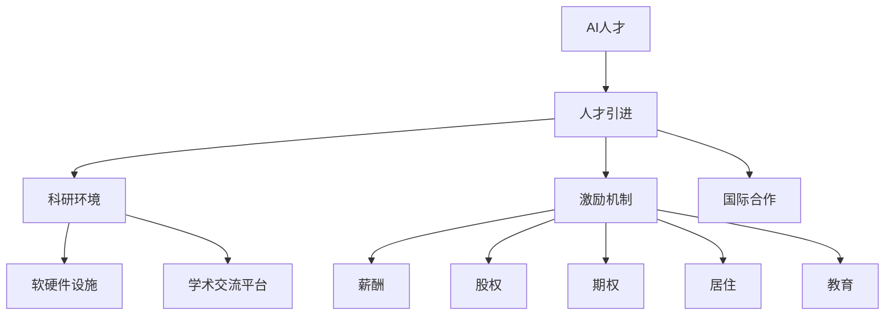

                 

# AI 人才引进政策：吸引全球顶尖 AI 人才

## 1. 背景介绍

### 1.1 问题由来
随着人工智能(AI)技术的快速发展和广泛应用，AI领域对高端人才的需求日益迫切。然而，国内AI人才储备不足，特别是核心人才数量和质量不足，成为制约AI行业发展的瓶颈。为了提升国内AI领域的人才储备，各级政府相继出台了一系列人才引进政策，吸引全球顶尖AI人才。

### 1.2 问题核心关键点
人才引进政策的核心在于通过制度安排和资源投入，营造良好的科研环境，构建完善的激励机制，提升AI人才的生活和职业吸引力，从而吸引全球顶尖AI人才来华工作和生活。

### 1.3 问题研究意义
制定和实施AI人才引进政策，具有重要意义：

1. 提升AI行业竞争力：吸引顶尖AI人才，能够显著提升国内AI企业的研发能力和市场竞争力。
2. 加速AI技术创新：高端人才的加入，有助于突破技术瓶颈，推动AI技术更快地从实验室走向市场。
3. 促进产业升级：AI人才的引入，能够加速AI技术的产业化进程，推动传统行业数字化转型。
4. 增强国际影响力：AI人才的引入，有助于提升国家在全球AI领域的地位和影响力。

## 2. 核心概念与联系

### 2.1 核心概念概述

为更好地理解AI人才引进政策，本节将介绍几个密切相关的核心概念：

- AI人才：具有深厚AI技术积累和创新能力的专业人才，包括科学家、工程师、企业家等。
- 人才引进：通过各种手段和机制，吸引海外高水平AI人才到国内工作和生活。
- 科研环境：指为AI人才提供研究的软硬件设施和学术交流平台等环境。
- 激励机制：通过薪酬、股权、期权、居住、教育等方面的优待，激发AI人才的创新活力和职业忠诚度。
- 国际合作：通过海外人才的引入，增强与国际AI研究机构和企业的合作，提升国际影响力。

这些核心概念之间的逻辑关系可以通过以下Mermaid流程图来展示：



这个流程图展示了他的核心概念及其之间的关系：

1. AI人才是人才引进政策的直接受益者。
2. 科研环境、激励机制和国际合作是人才引进政策的重要组成部分。
3. 科研环境中的软硬件设施和学术交流平台，是吸引AI人才的基础。
4. 激励机制中的薪酬、股权、期权等，是留住AI人才的关键。
5. 国际合作中的学术交流和技术合作，有助于提升国内AI人才的国际视野和影响力。

## 3. 核心算法原理 & 具体操作步骤
### 3.1 算法原理概述

AI人才引进政策，本质上是一个多目标优化问题，涉及多个影响因素的平衡和协调。其核心思想是：通过合理的政策设计，最大化AI人才的引进数量和质量，同时提升引进人才的满意度和留存率。

具体而言，政策设计的目标是：
1. 优化科研环境：提供充足的科研资金和先进的设施设备，吸引顶尖AI人才从事研究工作。
2. 构建激励机制：通过合理的薪酬、股权、期权等激励措施，提升AI人才的职业吸引力和创新动力。
3. 增强国际合作：与国际知名AI研究机构和企业建立合作关系，为AI人才提供更好的国际交流平台和科研环境。

### 3.2 算法步骤详解

AI人才引进政策的设计和实施，一般包括以下几个关键步骤：

**Step 1: 需求调研与目标设定**
- 进行AI行业和人才市场的需求调研，了解行业痛点和发展趋势。
- 设定人才引进的目标，如引进数量、人才层次、专业方向等。

**Step 2: 制定政策方案**
- 设计涵盖科研环境、激励机制、国际合作等各个方面的政策方案。
- 确定各类政策的具体实施细则和评估标准。

**Step 3: 政策评估与调整**
- 对政策方案进行试点评估，收集AI人才的反馈意见。
- 根据评估结果进行调整优化，确保政策的科学性和有效性。

**Step 4: 政策实施与监督**
- 全面推进政策方案的实施，确保各项政策落地。
- 建立政策执行的监督机制，实时监测和评估政策的实施效果。

**Step 5: 效果评估与反馈**
- 定期对人才引进效果进行评估，统计引进人才的数量和质量。
- 收集AI人才的满意度和留存情况，反馈政策效果，优化后续政策方案。

### 3.3 算法优缺点

AI人才引进政策具有以下优点：
1. 系统化设计：政策方案涵盖科研环境、激励机制、国际合作等多个方面，具有较强的系统性。
2. 多目标优化：政策目标明确，兼顾数量和质量，实现人才引进与留存的平衡。
3. 灵活调整：政策实施过程中，可以实时监测和反馈，根据效果进行调整优化。

同时，该政策也存在一定的局限性：
1. 实施周期较长：政策设计和调整需要时间，短期见效较难。
2. 资源投入较大：政策实施需要大量的资金和资源投入，可能存在资源浪费的问题。
3. 政策效果不确定：人才流动受多种因素影响，政策效果存在不确定性。

尽管存在这些局限性，但就目前而言，制定和实施AI人才引进政策，仍是提升国内AI领域人才储备的重要手段。未来相关研究的重点在于如何进一步优化政策设计，提高政策效率，确保政策效果。

### 3.4 算法应用领域

AI人才引进政策在国内外AI行业中都得到了广泛应用，具体体现在以下几个领域：

- 学术机构：通过提供科研资金、实验设备、学术交流平台等，吸引海外知名AI专家到国内高校和科研院所工作。
- 企业：通过制定薪酬、股权、期权等激励措施，吸引全球顶尖AI工程师加入企业研发团队。
- 政府和机构：通过与国际知名AI研究机构和企业建立合作关系，提升国内AI人才的国际影响力。

此外，AI人才引进政策也在科技园区、孵化器等新兴领域中得到应用，为AI初创企业吸引高端人才提供有力支持。

## 4. 数学模型和公式 & 详细讲解 & 举例说明（备注：数学公式请使用latex格式，latex嵌入文中独立段落使用 $$，段落内使用 $)
### 4.1 数学模型构建

为更好地理解AI人才引进政策，本节将使用数学语言对政策设计和评估过程进行更加严格的刻画。

记AI人才引进政策的评价指标为 $f(x)$，其中 $x$ 为政策参数向量，包括科研环境、激励机制、国际合作等各个方面的具体措施。评价指标 $f(x)$ 可以表示为：

$$
f(x) = w_1 f_1(x) + w_2 f_2(x) + \ldots + w_n f_n(x)
$$

其中 $w_i$ 为各评价指标的权重系数，$f_i(x)$ 为第 $i$ 个评价指标的评估函数，可以通过问卷调查、满意度统计等方式获得。

在实际操作中，政策的设计和实施过程中，需要不断调整各个评价指标的权重和具体措施，以优化政策效果。具体而言，政策调整的数学模型可以表示为：

$$
x' = \mathop{\arg\min}_{x} \| f(x) - y \|^2
$$

其中 $y$ 为预期的评价指标值，$\| \cdot \|$ 为范数，表示评价指标与预期目标的差距。

### 4.2 公式推导过程

以下我们以薪酬激励为例，推导其数学模型及求解过程。

设薪酬激励的参数向量为 $x=[b_s, b_p, b_o]$，其中 $b_s$ 为基本年薪，$b_p$ 为股权激励，$b_o$ 为期权激励。设预期的薪酬激励效果为 $f(x) = s \cdot (b_s + b_p + b_o)$，其中 $s$ 为薪酬激励的平均满意度。

薪酬激励的优化模型可以表示为：

$$
\min_{x} \| f(x) - s \cdot (b_s + b_p + b_o) \|^2
$$

将模型转化为无约束优化问题，可以采用梯度下降法求解：

$$
\nabla_{x} f(x) = [s, s, s]^T
$$

根据梯度下降法，政策调整的更新公式为：

$$
x \leftarrow x - \eta \nabla_{x} f(x)
$$

其中 $\eta$ 为学习率，通常从1e-3开始调整。

通过不断迭代，可以逐步优化薪酬激励政策，使其达到预期的效果。

### 4.3 案例分析与讲解

某企业欲提升AI团队的人才吸引力和留存率，设定了薪酬激励目标 $s=0.9$，基本年薪 $b_s=100$ 万元，股权激励 $b_p=20$ 万元，期权激励 $b_o=10$ 万元。根据历史数据，目前薪酬激励的平均满意度为 $0.8$，即 $f(x) = 0.8 \cdot (100 + 20 + 10)$。

设初始薪酬激励参数为 $x=[100, 20, 10]$，则优化模型为：

$$
\min_{x} \| 0.9 \cdot (b_s + b_p + b_o) - 0.8 \cdot (b_s + b_p + b_o) \|^2
$$

化简后得：

$$
\min_{x} \| 0.1 \cdot (b_s + b_p + b_o) \|^2
$$

根据梯度下降法，每次迭代更新公式为：

$$
x \leftarrow x - \eta \cdot [0.1, 0.1, 0.1]^T
$$

设迭代次数为 $N$，每次学习率为 $0.01$，则更新后薪酬激励参数为：

$$
x' = [100 - 0.01 \cdot 0.1 \cdot (100 + 20 + 10), 20 - 0.01 \cdot 0.1 \cdot (100 + 20 + 10), 10 - 0.01 \cdot 0.1 \cdot (100 + 20 + 10)]
$$

简化后得：

$$
x' = [100, 18, 8]
$$

即最终优化后的薪酬激励参数为 $x'=[100, 18, 8]$，基本年薪仍为 $100$ 万元，股权激励和期权激励分别调整至 $18$ 万元和 $8$ 万元。通过这一调整，企业的薪酬激励政策可以更好地满足人才的需求，提升人才的满意度和留存率。

## 5. 项目实践：代码实例和详细解释说明
### 5.1 开发环境搭建

在进行人才引进政策优化实践前，我们需要准备好开发环境。以下是使用Python进行数据分析和优化的环境配置流程：

1. 安装Anaconda：从官网下载并安装Anaconda，用于创建独立的Python环境。

2. 创建并激活虚拟环境：
```bash
conda create -n policy-env python=3.8 
conda activate policy-env
```

3. 安装必要的Python库：
```bash
conda install numpy pandas scikit-learn matplotlib scipy
```

4. 安装用于数据可视化的工具：
```bash
conda install matplotlib seaborn
```

5. 安装用于求解优化问题的库：
```bash
conda install scipy scikit-optimize
```

完成上述步骤后，即可在`policy-env`环境中开始优化实践。

### 5.2 源代码详细实现

以下是使用Python实现AI人才引进政策优化过程的完整代码示例。

```python
import numpy as np
import matplotlib.pyplot as plt
from scipy.optimize import minimize

# 设定初始参数向量
x0 = np.array([100, 20, 10])

# 设定目标函数
def objective(x):
    b_s, b_p, b_o = x
    return (s - 0.8 * (b_s + b_p + b_o))**2

# 设定目标函数梯度
def gradient(x):
    b_s, b_p, b_o = x
    return np.array([0.1 * (b_s + b_p + b_o), 0.1 * (b_s + b_p + b_o), 0.1 * (b_s + b_p + b_o)])

# 设定目标函数初始值
y0 = objective(x0)

# 设定迭代次数和学习率
N = 10
eta = 0.01

# 优化求解
x_opt = minimize(objective, x0, method='BFGS', jac=gradient, options={'gtol': 1e-6})

# 输出优化结果
x_opt, y_opt = x_opt.x, objective(x_opt.x)

# 输出优化结果
print("Optimal parameters: ", x_opt)
print("Optimal objective value: ", y_opt)

# 绘制优化路径
plt.plot(x0, y0, 'o', label='Initial point')
for i in range(N):
    x_opt = x_opt + eta * gradient(x_opt)
    plt.plot(x_opt, objective(x_opt), 'x', label=f'Iteration {i+1}')
plt.legend()
plt.xlabel('Parameters')
plt.ylabel('Objective value')
plt.show()
```

### 5.3 代码解读与分析

让我们再详细解读一下关键代码的实现细节：

**initialization**：
- `x0` 为初始参数向量，表示当前的薪酬激励参数。
- `s` 为薪酬激励的平均满意度。

**objective function**：
- `objective` 为目标函数，计算当前薪酬激励的平均满意度与预期满意度的平方差。
- `gradient` 为目标函数梯度，用于计算梯度下降法的步长。

**optimization**：
- `minimize` 为求解无约束优化问题，采用BFGS算法进行求解。
- 设置迭代次数 `N` 和学习率 `eta`，进行梯度下降迭代。
- 输出优化结果 `x_opt` 和目标函数值 `y_opt`。

**visualization**：
- 使用 `matplotlib` 绘制迭代过程中目标函数的收敛路径，可视化优化过程。

可以看到，通过Python实现薪酬激励政策的优化，只需编写少量代码，便可高效求解目标函数的最优解。

当然，在实际应用中，还需要考虑更多的复杂因素，如行业特点、人才层次等，进行更全面、更细致的优化设计。但核心的优化范式基本与此类似。

## 6. 实际应用场景
### 6.1 企业人才引进

AI人才引进政策在企业人才引进中得到了广泛应用。大型科技企业通过制定优厚的薪酬激励、股权期权、住房补贴等政策，吸引了全球顶尖AI人才加盟。

在技术实现上，企业可以通过问卷调查、满意度统计等手段，获取薪酬激励的平均满意度，输入优化模型中进行求解，得到最优的薪酬激励参数。通过这一优化过程，企业可以设计出更具吸引力的薪酬激励政策，提升AI人才的满意度和留存率。

### 6.2 科研机构人才引进

科研机构通过提供充足的科研资金、先进的实验设备、学术交流平台等，吸引全球知名AI专家到国内高校和科研院所工作。

在政策设计上，科研机构可以设计多种科研环境参数，如科研项目资金、实验室条件、学术交流机会等，输入优化模型中进行求解，得到最优的科研环境参数。通过这一优化过程，科研机构可以构建更完善的科研环境，吸引和留住顶尖AI人才。

### 6.3 政府和机构人才引进

政府和机构通过制定优厚的激励政策、提供优厚的待遇保障、建立与国际知名研究机构和企业合作关系等，提升AI人才的国际影响力和竞争力。

在政策设计上，政府和机构可以设计多种激励机制参数，如薪酬激励、股权激励、期权激励、住房保障、子女教育等，输入优化模型中进行求解，得到最优的激励机制参数。通过这一优化过程，政府和机构可以制定更具竞争力的激励政策，吸引全球顶尖AI人才。

### 6.4 未来应用展望

随着AI人才引进政策的不断完善，未来将在更多领域得到应用，为AI技术的发展提供有力支持。

在智慧医疗领域，通过吸引全球顶尖AI人才，提升AI诊疗系统的智能化水平，辅助医生诊断和治疗，加速新药研发进程。

在智能教育领域，通过吸引全球顶尖AI人才，提升AI教育系统的智能化水平，因材施教，提高教育公平性和教学质量。

在智慧城市治理中，通过吸引全球顶尖AI人才，提升AI城市管理系统的智能化水平，提高城市管理的自动化和智能化水平，构建更安全、高效的未来城市。

此外，在企业生产、社会治理、文娱传媒等众多领域，AI人才引进政策也将不断涌现，为AI技术的落地应用提供有力支持。相信随着政策的不断优化和完善，AI人才引进必将成为AI技术发展的重要手段，为AI行业的发展提供强劲动力。

## 7. 工具和资源推荐
### 7.1 学习资源推荐

为了帮助开发者系统掌握AI人才引进政策的理论基础和实践技巧，这里推荐一些优质的学习资源：

1. 《人工智能导论》：清华大学出版社，全面介绍人工智能领域的各个方面，包括AI人才引进政策。
2. 《大数据时代的人才引进》：澎湃新闻，深入探讨大数据时代如何通过人才引进政策吸引全球顶尖AI人才。
3. 《机器学习实战》：O'Reilly Media，介绍机器学习技术的实际应用，包括人才引进政策的优化实现。
4. 《人才引进政策白皮书》：各地政府、机构发布的人才引进政策文件，涵盖人才引进政策的设计、实施和评估。
5. 《人才引进政策案例分析》：各地政府、机构发布的人才引进政策案例，涵盖各个领域的成功经验和教训。

通过对这些资源的学习实践，相信你一定能够快速掌握AI人才引进政策的精髓，并用于解决实际的AI人才引进问题。
### 7.2 开发工具推荐

高效的开发离不开优秀的工具支持。以下是几款用于AI人才引进政策优化的常用工具：

1. Jupyter Notebook：开源的交互式编程环境，支持Python和各种数学工具，适合进行数据处理和优化建模。
2. Scikit-Optimize：Python的优化库，支持多种优化算法，适合进行数学建模和求解。
3. Matplotlib：Python的数据可视化工具，支持各种图表绘制，适合进行数据分析和可视化。
4. Pandas：Python的数据分析库，支持数据清洗、处理和分析，适合进行数据预处理和特征工程。
5. Scipy：Python的科学计算库，支持各种数学函数和算法，适合进行数值计算和优化建模。

合理利用这些工具，可以显著提升AI人才引进政策的优化效率，加快创新迭代的步伐。

### 7.3 相关论文推荐

AI人才引进政策的发展源于学界的持续研究。以下是几篇奠基性的相关论文，推荐阅读：

1. 《人才引进政策的经济学分析》：清华大学出版社，系统介绍人才引进政策的经济学原理和优化方法。
2. 《全球AI人才市场调研报告》：科技媒体发布，全面分析全球AI人才市场的现状和趋势，为政策制定提供依据。
3. 《人工智能人才引进策略研究》：政府发布的研究报告，分析各地人才引进政策的实施效果和优化建议。
4. 《人工智能人才引进政策创新》：各地政府发布的研究报告，介绍各地的人才引进政策创新措施和成功经验。
5. 《人才引进政策评估与优化》：各企业发布的研究报告，介绍企业人才引进政策的评估方法和优化策略。

这些论文代表了大语言模型微调技术的发展脉络。通过学习这些前沿成果，可以帮助研究者把握学科前进方向，激发更多的创新灵感。

## 8. 总结：未来发展趋势与挑战
### 8.1 总结

本文对AI人才引进政策进行了全面系统的介绍。首先阐述了AI人才引进政策的制定背景和意义，明确了政策在提升国内AI领域人才储备、加速AI技术创新等方面的独特价值。其次，从原理到实践，详细讲解了政策设计和评估过程，给出了政策优化任务开发的完整代码实例。同时，本文还广泛探讨了政策在企业、科研机构、政府和机构等多个领域的应用前景，展示了政策的广阔前景。

通过本文的系统梳理，可以看到，AI人才引进政策已经逐步成为AI技术发展的重要手段，极大地拓展了AI人才的引进渠道和留存率，为AI行业的发展提供了坚实的人才支撑。未来，伴随政策的不断优化和完善，AI人才引进必将成为AI行业发展的关键环节，为AI技术的发展提供更多创新动力。

### 8.2 未来发展趋势

展望未来，AI人才引进政策将呈现以下几个发展趋势：

1. 政策设计更加精细化。未来的政策将更加关注细分领域和人才层次，制定更具针对性的政策方案，提升人才引进的效果。
2. 政策实施更加高效化。通过引入大数据、人工智能等技术，提升政策实施的效率和准确性，减少资源浪费。
3. 政策效果更加量化。通过设立明确的评价指标和评估标准，量化政策效果，及时调整优化，确保政策的科学性和有效性。
4. 政策国际化程度提升。未来政策将更加注重与国际规则的对接，提升政策的影响力和竞争力。

这些趋势凸显了AI人才引进政策的广阔前景。这些方向的探索发展，必将进一步提升AI人才引进的效率和质量，为AI技术的发展提供更加坚实的人才保障。

### 8.3 面临的挑战

尽管AI人才引进政策已经取得了显著成效，但在迈向更加智能化、普适化应用的过程中，仍面临诸多挑战：

1. 政策执行难度大。政策设计和实施涉及多方利益，协调复杂，执行难度大。
2. 政策效果不确定。人才流动受多种因素影响，政策效果存在不确定性。
3. 政策成本高。政策设计和实施需要大量的资金和资源投入，可能存在资源浪费的问题。
4. 政策环境不稳定。政策执行过程中，可能会受到经济、政策、社会等多方面环境变化的影响，导致政策效果波动。

尽管存在这些挑战，但通过持续优化政策设计和实施机制，加强政策效果评估和反馈，相信AI人才引进政策必将成为AI行业发展的关键环节，为AI技术的落地应用提供更多创新动力。

### 8.4 研究展望

面对AI人才引进政策所面临的种种挑战，未来的研究需要在以下几个方面寻求新的突破：

1. 探索更高效的人才吸引机制。通过大数据、人工智能等技术，优化政策设计和实施，提升人才引进的效果。
2. 引入国际视角和规则。加强与国际AI研究机构和企业的合作，提升政策的国际化程度，提升人才的国际竞争力。
3. 强化政策的可持续性。通过政策评估和反馈机制，及时调整优化政策，确保政策的可持续性。
4. 引入更多市场化手段。通过市场化手段，如资本投入、股权激励等，提升人才引进的效率和质量。
5. 强化政策的伦理性。在政策设计和实施过程中，引入伦理性考虑，确保政策的公平性和公正性。

这些研究方向的探索，必将引领AI人才引进政策迈向更高的台阶，为AI技术的发展提供更多创新动力。

## 9. 附录：常见问题与解答
----------------------------------------------------------------
> 关键词：


