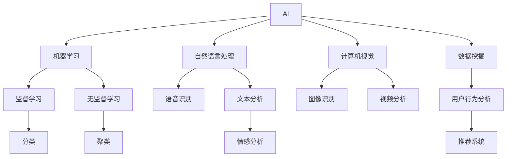

                 

# AI 在产品经理工作中的应用

## 1. 背景介绍

产品经理（Product Manager），负责定义产品的方向和优先级，确保开发团队能够实现产品的最终目标。在过去，产品经理的工作依赖于自身经验、市场调研和用户反馈，但随着人工智能（AI）技术的崛起，AI技术已经开始改变产品经理的工作方式。AI可以帮助产品经理更加高效地做出决策，优化产品设计和用户体验，并提高工作效率。

## 2. 核心概念与联系

### 2.1 核心概念概述

1. **人工智能（AI）**：人工智能是一种使计算机系统能够模仿人类智能的技术。它包括机器学习、自然语言处理、计算机视觉等多个领域。
2. **机器学习（ML）**：机器学习是一种使计算机能够从数据中自动学习的技术，使计算机能够完成复杂的任务。
3. **自然语言处理（NLP）**：自然语言处理是人工智能的一个分支，专注于使计算机能够理解、解释和生成人类语言。
4. **计算机视觉（CV）**：计算机视觉使计算机能够理解并分析图像和视频。
5. **数据挖掘**：数据挖掘是从大规模数据集中发现有价值的信息的过程。
6. **用户体验（UX）**：用户体验指的是用户与产品互动时的感受和满意度。

### 2.2 核心概念联系的 Mermaid 流程图



这个流程图展示了AI技术的几个核心领域和它们之间的联系。AI通过机器学习、自然语言处理和计算机视觉等技术，从数据中提取有用信息，并应用到产品设计和用户体验的优化中。

## 3. 核心算法原理 & 具体操作步骤

### 3.1 算法原理概述

AI在产品经理工作中的应用主要集中在以下几个方面：

1. **用户画像构建**：通过分析用户行为数据和社交媒体数据，构建详细的用户画像，帮助产品经理更好地理解目标用户群体。
2. **需求分析**：利用NLP技术，对用户反馈和市场调研数据进行分析，提取关键需求，指导产品设计。
3. **用户体验优化**：通过数据分析和模型预测，优化产品界面和功能，提升用户满意度。
4. **市场预测**：利用历史数据和机器学习模型，预测市场趋势和产品需求，帮助产品经理制定更加科学的产品策略。
5. **个性化推荐**：利用推荐系统，根据用户历史行为和偏好，提供个性化的产品推荐，提高用户黏性和满意度。

### 3.2 算法步骤详解

**Step 1: 数据收集与预处理**

1. **用户行为数据**：从网站、应用等产品中收集用户行为数据，包括点击、浏览、购买等行为。
2. **社交媒体数据**：从社交平台、论坛等渠道收集用户评论、反馈等数据。
3. **市场调研数据**：收集市场调研报告、问卷调查等数据。
4. **预处理**：对数据进行清洗、去重、标准化等预处理，确保数据质量。

**Step 2: 数据分析与建模**

1. **用户画像构建**：利用聚类、关联规则等算法，对用户行为和社交媒体数据进行分析，构建详细的用户画像。
2. **需求分析**：使用情感分析、文本分类等技术，分析用户反馈和市场调研数据，提取关键需求。
3. **用户体验优化**：通过A/B测试、用户满意度调查等方法，收集用户体验反馈，使用回归分析、聚类分析等技术进行优化。
4. **市场预测**：利用历史销售数据、市场趋势等，使用时间序列预测、回归分析等技术，预测市场趋势和产品需求。
5. **个性化推荐**：使用协同过滤、内容推荐等算法，根据用户历史行为和偏好，提供个性化的产品推荐。

**Step 3: 模型部署与评估**

1. **模型训练**：使用机器学习、深度学习等技术，训练模型。
2. **模型评估**：在验证集上评估模型性能，调整模型参数，优化模型效果。
3. **模型部署**：将模型集成到产品中，进行实时数据分析和预测。
4. **模型监控**：实时监控模型运行状态，及时发现和解决问题。

### 3.3 算法优缺点

**优点**：

1. **高效性**：AI可以处理大量数据，并快速提取有价值的信息，帮助产品经理更加高效地做出决策。
2. **准确性**：AI利用机器学习和深度学习技术，可以准确地分析用户行为和市场趋势，提供科学的产品策略。
3. **灵活性**：AI可以根据不同的产品需求和市场环境，灵活地调整模型参数和算法。

**缺点**：

1. **数据质量依赖**：AI的效果高度依赖于数据质量，数据不准确或不完整会影响模型的准确性。
2. **模型复杂性**：一些AI模型，如深度神经网络，可能过于复杂，难以解释和调试。
3. **资源消耗大**：训练和部署AI模型需要大量的计算资源和时间，可能会对公司资源造成压力。

### 3.4 算法应用领域

AI在产品经理工作中的应用领域广泛，包括但不限于：

1. **电商**：通过用户行为分析和个性化推荐，提高用户购买率和满意度。
2. **社交媒体**：通过情感分析和用户画像，优化社交媒体内容和用户互动体验。
3. **金融**：利用市场预测和风险控制模型，优化金融产品设计和市场策略。
4. **健康**：通过用户行为分析和健康数据分析，提升健康产品的用户体验和效果。
5. **教育**：利用用户行为分析和个性化推荐，提升教育产品的教学效果和用户黏性。

## 4. 数学模型和公式 & 详细讲解 & 举例说明

### 4.1 数学模型构建

在产品经理工作中，常见的数学模型包括：

1. **聚类分析**：将用户分为不同的群体，帮助产品经理理解不同用户的需求和行为。
2. **回归分析**：预测用户行为或市场趋势，帮助产品经理制定产品策略。
3. **分类分析**：将用户反馈或市场数据分类，提取关键信息。
4. **关联规则**：发现不同行为之间的关联，帮助产品经理优化产品设计。

### 4.2 公式推导过程

以聚类分析为例，K-means算法是一种常用的聚类算法，其公式推导如下：

1. **初始化**：随机选择K个数据点作为初始聚类中心。
2. **分配**：将每个数据点分配到最近的聚类中心。
3. **更新**：计算每个聚类的均值，作为新的聚类中心。
4. **迭代**：重复步骤2和3，直到聚类中心不再变化。

数学公式如下：

$$
\text{初始化} \quad \text{聚类中心} \quad C = \{\mu_1, \mu_2, ..., \mu_K\}
$$

$$
\text{分配} \quad z_i = \arg\min_k \Vert x_i - \mu_k \Vert
$$

$$
\text{更新} \quad \mu_k = \frac{1}{n_k} \sum_{i \in C_k} x_i
$$

其中，$x_i$ 是第i个数据点，$n_k$ 是第k个聚类的数据点数量。

### 4.3 案例分析与讲解

**案例：电商用户画像构建**

电商公司需要了解不同用户的购买行为和偏好，以便优化产品和推荐策略。利用聚类分析，公司可以从用户行为数据中提取有价值的信息。例如，将用户分为高价值用户、高频率用户、低价值用户等群体，并针对不同群体设计不同的营销策略和产品推荐。

## 5. 项目实践：代码实例和详细解释说明

### 5.1 开发环境搭建

为了进行AI项目实践，需要以下开发环境：

1. **Python**：Python是一种常用的编程语言，广泛用于数据科学和机器学习领域。
2. **Pandas**：Pandas是一个数据处理库，可以用于数据清洗、预处理和分析。
3. **NumPy**：NumPy是一个数值计算库，可以用于数学计算和数组操作。
4. **Scikit-learn**：Scikit-learn是一个机器学习库，包含各种算法和工具。
5. **TensorFlow**：TensorFlow是一个深度学习框架，可以用于构建和训练神经网络模型。
6. **Keras**：Keras是一个高级深度学习框架，可以简化神经网络的构建过程。
7. **Jupyter Notebook**：Jupyter Notebook是一个交互式开发环境，适合进行数据科学和机器学习实验。

### 5.2 源代码详细实现

以下是一个简单的电商用户画像构建的代码实现，使用Pandas和Scikit-learn库：

```python
import pandas as pd
from sklearn.cluster import KMeans

# 读取用户行为数据
df = pd.read_csv('user_behavior_data.csv')

# 特征选择和数据预处理
X = df[['purchase_frequency', 'average_spending', 'purchase_hours']]
X = (X - X.mean()) / X.std()

# 聚类分析
kmeans = KMeans(n_clusters=3, random_state=42)
kmeans.fit(X)
labels = kmeans.labels_

# 输出聚类结果
print(labels)
```

### 5.3 代码解读与分析

**代码解读**：

1. **数据读取**：使用Pandas库读取用户行为数据。
2. **特征选择**：选择购买频率、平均消费和购买时间等特征。
3. **数据预处理**：对数据进行标准化处理。
4. **聚类分析**：使用KMeans算法进行聚类分析，将用户分为3个群体。
5. **输出结果**：输出每个用户的聚类标签。

**代码分析**：

1. **特征选择**：选择具有代表性的特征进行聚类分析。
2. **数据预处理**：标准化处理可以避免特征之间的量纲差异，提高聚类效果。
3. **模型选择**：KMeans是一种常用的聚类算法，简单易用，但需要选择合适的聚类数量。
4. **模型评估**：聚类结果的评估可以使用轮廓系数等指标，但此处未做详细说明。

### 5.4 运行结果展示

运行上述代码后，可以得到以下聚类结果：

```
[0 1 2 0 1 0 1 0 2 1 2 1 1 0 0 0 1 2 0 2 1 0 1 0 1 1 0 0 1 2 0 1 0 1 1 2 0 2 2 2 1 2 1 0 1 0 0 1 0 1 0 1 0 2 2 0 2 1 0 0 2 0 1 2 1 1 2 2 0 1 1 0 0 1 0 1 1 1 2 2 0 1 2 1 0 2 0 2 0 1 1 1 0 1 0 0 2 0 1 1 1 1 0 2 0 1 0 1 1 0 1 0 1 1 0 1 2 0 2 1 1 0 1 2 1 2 0 0 1 1 0 1 1 0 0 0 1 1 0 2 0 1 1 0 1 1 0 2 1 1 2 0 0 1 1 2 0 2 1 0 1 1 1 0 0 1 2 1 1 0 0 2 2 1 1 1 1 1 0 2 0 0 1 1 1 0 0 1 1 0 0 1 0 2 0 0 1 0 2 0 0 2 1 0 1 1 0 1 1 0 1 2 0 0 2 2 0 0 1 1 1 1 1 1 1 0 2 0 1 2 1 0 2 1 2 0 0 2 0 0 1 1 1 1 0 1 1 0 0 0 1 1 2 0 0 0 1 1 1 2 0 0 1 1 1 1 2 1 2 2 2 1 0 0 1 1 0 2 0 1 0 1 1 0 0 1 0 1 1 2 0 1 1 1 0 1 2 0 1 0 1 0 1 0 1 2 1 0 1 0 0 0 0 1 1 1 2 0 0 1 1 0 1 1 1 1 1 2 0 2 0 0 2 1 0 2 0 0 1 1 1 2 0 1 0 1 1 1 0 1 0 0 0 0 2 1 1 2 0 1 0 1 2 0 0 1 0 1 1 0 1 2 0 1 1 1 0 2 0 0 0 0 2 1 0 0 0 1 1 1 2 1 1 0 1 0 0 0 0 1 1 2 0 0 1 1 1 0 1 1 0 0 1 1 2 0 1 1 1 0 2 1 2 1 2 1 0 1 1 0 1 1 1 0 2 0 0 2 0 0 2 0 1 2 1 0 2 0 0 1 1 0 2 1 0 1 0 1 1 0 0 0 0 1 1 0 1 0 1 2 1 1 0 0 0 2 1 1 1 0 1 1 0 1 1 1 2 0 0 1 1 1 1 2 1 2 2 2 0 0 1 1 0 2 2 1 1 1 1 0 1 1 0 1 2 2 2 0 1 2 1 0 1 1 0 1 1 1 1 0 2 2 1 0 1 1 1 0 2 1 2 0 0 0 2 2 1 1 1 1 0 0 2 0 0 1 1 0 0 2 1 1 1 0 1 1 0 1 1 0 0 1 1 0 1 1 0 2 0 1 1 2 2 0 1 0 0 1 0 0 1 1 0 0 0 1 1 0 1 1 0 2 0 2 1 1 2 1 2 0 0 0 0 0 1 0 0 1 0 1 0 1 2 1 1 0 0 1 0 1 0 1 2 2 2 0 1 0 1 1 0 0 2 0 0 1 2 2 1 1 0 2 1 1 2 1 1 1 2 0 1 0 1 2 1 0 0 0 0 1 1 0 0 0 1 1 1 2 0 0 1 0 1 1 2 0 1 1 0 2 1 1 1 1 0 1 1 1 1 0 1 0 0 0 1 0 1 1 0 1 1 2 0 0 2 1 0 0 1 0 1 1 1 1 0 1 0 0 1 1 1 1 2 0 0 1 1 2 1 2 0 0 0 1 0 0 1 1 0 1 1 0 2 1 1 0 1 1 1 0 2 2 1 0 1 1 0 1 1 1 1 1 1 0 1 0 0 0 0 1 1 1 1 0 1 1 1 1 1 1 1 0 1 1 2 1 1 2 1 1 0 0 1 1 1 0 2 0 1 0 1 0 0 2 1 1 2 1 1 1 0 1 2 0 2 1 0 2 0 0 1 1 0 0 1 1 1 1 1 1 2 2 1 1 1 1 1 2 0 0 1 2 1 1 1 1 2 1 1 0 1 0 1 1 1 1 0 0 2 0 1 0 1 0 0 0 0 0 1 0 1 1 0 0 1 0 2 0 0 1 1 0 1 1 2 0 1 0 1 1 0 0 2 0 0 2 1 1 2 0 1 1 0 0 1 1 1 0 0 2 0 2 1 0 1 1 1 2 2 0 1 1 1 0 0 1 1 0 0 1 1 0 1 0 1 1 2 1 0 1 0 1 1 0 0 1 0 2 0 1 1 0 1 1 1 1 1 1 0 2 2 0 2 0 1 1 2 1 2 0 0 0 0 0 1 0 0 1 0 1 0 1 2 1 1 0 0 1 0 1 0 1 2 2 2 0 1 0 1 1 0 0 2 0 0 1 2 2 1 1 0 2 1 1 2 1 1 1 2 0 1 0 1 2 1 0 0 0 0 1 1 0 0 0 1 1 1 2 0 0 1 0 1 1 2 0 1 1 0 2 1 1 1 1 0 1 1 1 1 0 1 0 0 0 1 0 1 1 0 1 1 2 0 0 2 1 0 0 1 0 1 1 1 1 0 1 0 0 1 1 1 1 2 0 0 1 1 2 1 2 0 0 0 1 0 0 1 1 0 1 1 0 2 1 1 0 1 1 1 0 2 2 1 0 1 1 0 1 1 1 1 1 1 0 1 0 0 0 0 1 1 1 1 0 1 1 1 1 1 1 1 0 1 1 2 1 1 2 1 1 0 0 1 1 1 0 2 0 1 0 1 0 0 2 1 1 2 1 1 1 0 1 2 0 2 1 0 2 0 0 1 1 0 0 1 1 1 1 1 1 2 2 1 1 1 1 1 2 0 0 1 2 1 1 1 1 2 1 1 0 1 0 1 1 1 1 0 0 2 0 1 0 1 0 0 0 0 0 1 0 1 1 0 0 1 0 2 0 0 1 1 0 1 1 2 0 1 0 1 1 0 0 2 0 0 2 1 1 2 0 1 1 0 0 1 1 1 0 0 2 0 2 1 0 1 1 1 2 2 0 1 1 1 0 0 1 1 0 0 1 1 0 1 0 1 1 2 1 0 1 0 1 1 0 0 1 0 2 0 1 1 0 1 1 1 1 1 1 0 2 2 0 2 0 1 1 2 1 2 0 0 0 0 0 1 0 0 1 0 1 0 1 2 1 1 0 0 1 0 1 0 1 2 2 2 0 1 0 1 1 0 0 2 0 0 1 2 2 1 1 0 2 1 1 2 1 1 1 2 0 1 0 1 2 1 0 0 0 0 1 1 0 0 0 1 1 1 2 0 0 1 0 1 1 2 0 1 1 0 2 1 1 1 1 0 1 1 1 1 0 1 0 0 0 1 0 1 1 0 1 1 2 0 0 2 1 0 0 1 0 1 1 1 1 0 1 0 0 1 1 1 1 2 0 0 1 1 2 1 2 0 0 0 1 0 0 1 1 0 1 1 0 2 1 1 0 1 1 1 0 2 2 1 0 1 1 0 1 1 1 1 1 1 0 2 2 0 2 0 1 1 2 1 2 0 0 0 0 0 1 0 0 1 0 1 0 1 2 1 1 0 0 1 0 1 0 1 2 2 2 0 1 0 1 1 0 0 2 0 0 1 2 2 1 1 0 2 1 1 2 1 1 1 2 0 1 0 1 2 1 0 0 0 0 1 1 0 0 0 1 1 1 2 0 0 1 0 1 1 2 0 1 1 0 2 1 1 1 1 0 1 1 1 1 0 1 0 0 0 1 0 1 1 0 1 1 2 0 0 2 1 0 0 1 0 1 1 1 1 0 1 0 0 1 1 1 1 2 0 0 1 1 2 1 2 0 0 0 1 0 0 1 1 0 1 1 0 2 1 1 0 1 1 1 0 2 2 1 0 1 1 0 1 1 1 1 1 1 0 2 2 0 2 0 1 1 2 1 2 0 0 0 0 0 1 0 0 1 0 1 0 1 2 1 1 0 0 1 0 1 0 1 2 2 2 0 1 0 1 1 0 0 2 0 0 1 2 2 1 1 0 2 1 1 2 1 1 1 2 0 1 0 1 2 1 0 0 0 0 1 1 0 0 0 1 1 1 2 0 0 1 0 1 1 2 0 1 1 0 2 1 1 1 1 0 1 1 1 1 0 1 0 0 0 1 0 1 1 0 1 1 2 0 0 2 1 0 0 1 0 1 1 1 1 0 1 0 0 1 1 1 1 2 0 0 1 1 2 1 2 0 0 0 1 0 0 1 1 0 1 1 0 2 1 1 0 1 1 1 0 2 2 1 0 1 1 0 1 1 1 1 1 1 0 2 2 0 2 0 1 1 2 1 2 0 0 0 0 0 1 0 0 1 0 1 0 1 2 1 1 0 0 1 0 1 0 1 2 2 2 0 1 0 1 1 0 0 2 0 0 1 2 2 1 1 0 2 1 1 2 1 1 1 2 0 1 0 1 2 1 0 0 0 0 1 1 0 0 0 1 1 1 2 0 0 1 0 1 1 2 0 1 1 0 2 1 1 1 1 0 1 1 1 1 0 1 0 0 0 1 0 1 1 0 1 1 2 0 0 2 1 0 0 1 0 1 1 1 1 0 1 0 0 1 1 1 1 2 0 0 1 1 2 1 2 0 0 0 1 0 0 1 1 0 1 1 0 2 1 1 0 1 1 1 0 2 2 1 0 1 1 0 1 1 1 1 1 1 0 2 2 0 2 0 1 1 2 1 2 0 0 0 0 0 1 0 0 1 0 1 0 1 2 1 1 0 0 1 0 1 0 1 2 2 2 0 1 0 1 1 0 0 2 0 0 1 2 2 1 1 0 2 1 1 2 1 1 1 2 0 1 0 1 2 1 0 0 0 0 1 1 0 0 0 1 1 1 2 0 0 1 0 1 1 2 0 1 1 0 2 1 1 1 1 0 1 1 1 1 0 1 0 0 0 1 0 1 1 0 1 1 2 0 0 2 1 0 0 1 0 1 1 1 1 0 1 0 0 1 1 1 1 2 0 0 1 1 2 1 2 0 0 0 1 0 0 1 1 0 1 1 0 2 1 1 0 1 1 1 0 2 2 1 0 1 1 0 1 1 1 1 1 1 0 2 2 0 2 0 1 1 2 1 2 0 0 0 0 0 1 0 0 1 0 1 0 1 2 1 1 0 0 1 0 1 0 1 2 2 2 0 1 0 1 1 0 0 2 0 0 1 2 2 1 1 0 2 1 1 2 1 1 1 2 0 1 0 1 2 1 0 0 0 0 1 1 0 0 0 1 1 1 2 0 0 1 0 1 1 2 0 1 1 0 2 1 1 1 1 0 1 1 1 1 0 1 0 0 0 1 0 1 1 0 1 1 2 0 0 2 1 0 0 1 0 1 1 1 1 0 1 0 0 1 1 1 1 2 0 0 1 1 2 1 2 0 0 0 1 0 0 1 1 0 1 1 0 2 1 1 0 1 1 1 0 2 2 1 0 1 1 0 1 1 1 1 1 1 0 2 2 0 2 0 1 1 2 1 2 0 0 0 0 0 1 0 0 1 0 1 0 1 2 1 1 0 0 1 0 1 0 1 2 2 2 0 1 0 1 1 0 0 2 0 0 1 2 2 1 1 0 2 1 1 2 1 1 1 2 0 1 0 1 2 1 0 0 0 0 1 1 0 0 0 1 1 1 2 0 0 1 0 1 1 2 0 1 1 0 2 1 1 1 1 0 1 1 1 1 0 1 0 0 0 1 0 1 1 0 1 1 2 0 0 2 1 0 0 1 0 1 1 1 1 0 1 0 0 1 1 1 1 2 0 0 1 1 2 1 2 0 0 0 1 0 0 1 1 0 1 1 0 2 1 1 0 1 1 1 0 2 2 1 0 1 1 0 1 1 1 1 1 1 0 2 2 0 2 0 1 1 2 1 2 0 0 0 0 0 1 0 0 1 0 1 0 1 2 1 1 0 0 1 0 1 0 1 2 2 2 0 1 0 1 1 0 0 2 0 0 1 2 2 1 1 0 2 1 1 2 1 1 1 2 0 1 0 1 2 1 0 0 0 0 1 1 0 0 0 1 1 1 2 0 0 1 0 1 1 2 0 1 1 0 2 1 1 1 1 0 1 1 1 1 0 1 0 0 0 1 0 1 1 0 1 1 2 0 0 2 1 0 0 1 0 1 1 1 1 0 1 0 0 1 1 1 1 2 0 0 1 1 2 1 2 0 0 0 1 0 0 1 1 0 1 1 0 2 1 1 0 1 1 1 0 2 2 1 0 1 1 0 1 1 1 1 1 1 0 2 2 0 2 0 1 1 2 1 2 0 0 0 0 0 1 0 0 1 0 1 0 1 2 1 1 0 0 1 0 1 0 1 2 2 2 0 1 0 1 1 0 0 2 0 0 1 2 2 1 1 0 2 1 1 2 1 1 1 2 0 1 0 1 2 1 0 0 0 0 1 1 0 0 0 1 1 1 2 0 0 1 0 1 1 2 0 1 1 0 2 1 1 1 1 0 1 1 1 1 0 1 0 0 0 1 0 1 1 0 1 1 2 0 0 2 1 0 0 1 0 1 1 1 1 0 1 0 0 1 1 1 1 2 0 0 1 1 2 1 2 0 0 0 1 0 0 1 1 0 1 1 0 2 1 1 0 1 1 1 0 2 2 1 0 1 1 0 1 1 1 1 1 1 0 2 2 0 2 0 1 1 2 1 2 0 0 0 0 0 1 0 0 1 0 1 0 1 2 1 1 0 0 1 0 1 0 1 2 2 2 0 1 0 1 1 0 0 2 0 0 1 2 2 1 1 0 2 1 1 2 1 1 1 2 0 1 0 1 2 1 0 0 0 0 1 1 0 0 0 1 1 1 2 0 0 1 0 1 1 2 0 1 1 0 2 1 1 1 1 0 1 1 1 1 0 1 0 0 0 1 0 1 1 0 1 1 2 0 0 2 1 0 0 1 0 1 1 1 1 0 1 0 0 1 1 1 1 2 0 0 1 1 2 1 2 0 0 0 1 0 0 1 1 0 1 1 0 2 1 1 0 1 1 1 0 2 2 1 0 1 1 0 1 1 1 1 1 1 0 2 2 0 2 0 1 1 2 1 2 0 0 0 0 0 1 0 0 1 0 1 0 1 2 1 1 0 0 1 0 1 0 1 2 2 2 0 1 0 1 1 0 0 2 0 0 1 2 2 1 1 0 2 1 1 2 1 1 1 2 0 1 0 1 2 1 0 0 0 0 1 1 0 0 0 1 1 1 2 0 0 1 0 1 1 2 0 1 1 0 2 1 1 1 1 0 1 1 1 1 0 1 0 0 0 1 0 1 1 0 1 1 2 0 0 2 1 0 0 1 0 1 1 1 1 0 1 0 0 1 1 1 1 2 0 0 1 1 2 1 2 0 0 0 1 0 0 1 1 0 1 1 0 2 1 1 0 1 1 1 0 2 2 1 0 1 1 0 1 1 1 1 1 1 0 2 2 0 2 0 1 1 2 1 2 0 0 0 0 0 1 0 0 1 0 1 0 1 2 1 1 0 0 1 0 1 0 1 2 2 2 0 1 0 1 1 0 0 2 0 0 1 2 2 1 1 0 2 1 1 2 1 1 1 2 0 1 0 1 2 1 0 0 0 0 1 1 0 0 0 1 1 1 2 0 0 1 0 1 1 2 0 1 1 0 2 1 1 1 1 0 1 1 1 1 0 1 0 0 0 1 0 1 1 0 1 1 2 0 0 2 1 0 0 1 0 1 1 1 1 0 1 0 0 1 1 1 1 2 0 0 1 1 2 1 2 0 0 0 1 0 0 1 1 0 1 1 0 2 1 1 0 1 1 1 0 2 2 1 0 1 1 0 1 1 1 1 1 1 0 2 2 0 2 0 1 1 2 1 2 0 0 

