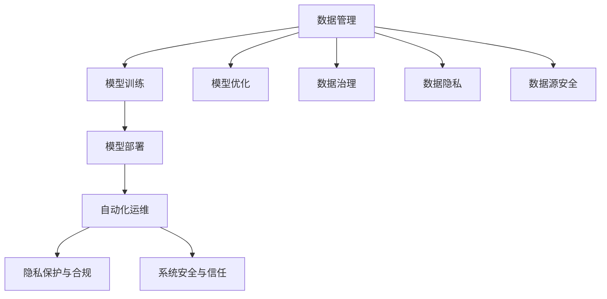

                 

## 1. 背景介绍

### 1.1 问题由来

随着人工智能技术的飞速发展，AI已经逐步渗透到社会的各个方面，从医疗健康到金融服务，从智能制造到智能交通，AI正在重塑各行各业的面貌。然而，AI技术的大规模应用也带来了新的挑战，包括数据安全、隐私保护、模型可信度、系统鲁棒性等。这些问题不仅关乎到技术能否落地，也影响到用户体验和公众信任。因此，构建安全可靠的AI基础设施，成为当前技术发展的重要议题。

### 1.2 问题核心关键点

AI基础设施建设的核心在于构建一个能够支撑AI模型高效训练、安全部署、稳定运行的系统生态。这一生态系统包括数据管理、模型训练、部署、监控、运维等多个环节，需要从技术、法律、伦理等多方面进行综合考虑。核心关键点包括：

1. **数据隐私与安全**：如何在保障数据隐私的前提下，进行高效的数据治理和利用。
2. **模型可信度**：如何保证AI模型的透明性、公平性和鲁棒性，避免有害偏见和错误决策。
3. **系统鲁棒性**：如何构建可靠的系统架构，提高系统的容错性和鲁棒性，确保业务连续性。
4. **自动化与可解释性**：如何实现AI系统的自动化管理，同时提高模型的可解释性，增强用户信任。
5. **跨领域协同**：如何打破行业壁垒，实现不同AI技术间的协同创新与应用。

这些关键点构成了AI基础设施建设的基本框架，需要各环节协同工作，共同提升AI技术的实际应用价值。

## 2. 核心概念与联系

### 2.1 核心概念概述

为更好地理解AI基础设施建设的框架和关键技术，本节将介绍几个核心概念：

- **数据管理**：指对数据进行收集、存储、治理和分析的过程。数据管理是AI基础设施建设的基础，直接影响模型的训练效果和部署性能。
- **模型训练与优化**：指通过特定的算法和工具，对数据进行训练和优化，生成可应用于实际场景的AI模型。
- **模型部署与监控**：指将训练好的模型部署到生产环境中，并对其进行持续监控和维护的过程。
- **自动化运维**：指通过自动化工具和流程，实现对AI系统的自动化管理，提高运维效率和系统稳定性。
- **隐私保护与合规**：指在数据处理和模型训练过程中，遵循隐私保护法律和规范，保障用户数据安全。
- **系统安全与信任**：指通过安全验证和可解释性技术，提高AI系统的可信度，增强用户对系统的信任。

这些核心概念之间的逻辑关系可以通过以下Mermaid流程图来展示：



这个流程图展示了大规模AI基础设施建设的基本流程和关键技术点：

1. **数据管理**：从数据收集到数据治理，是模型训练的基础。
2. **模型训练**：在数据基础上进行模型训练，生成AI模型。
3. **模型部署**：将训练好的模型部署到实际应用环境中，进行业务测试。
4. **自动化运维**：对AI系统进行持续监控和优化，确保系统稳定运行。
5. **隐私保护与合规**：在数据处理和模型训练中遵循隐私保护和合规要求，保障用户数据安全。
6. **系统安全与信任**：通过安全验证和可解释性技术，提高AI系统的可信度，增强用户信任。

## 3. 核心算法原理 & 具体操作步骤

### 3.1 算法原理概述

AI基础设施建设的算法原理，主要围绕数据治理、模型训练、系统监控、自动化运维等多个方面展开。其核心思想是通过高效的数据管理和模型训练技术，构建安全可靠的系统生态，确保AI技术的实际应用价值。

形式化地，假设AI基础设施建设涉及的各个环节为 $X$，则其算法原理可以表示为：

$$
\text{基础设施建设} = \text{数据治理} + \text{模型训练} + \text{模型部署} + \text{自动化运维} + \text{隐私保护与合规} + \text{系统安全与信任}
$$

其中，数据治理和模型训练是基础设施建设的核心技术，决定了AI模型的质量和性能。模型部署和自动化运维确保模型的实际应用效果和系统稳定性。隐私保护与合规和系统安全与信任，保障数据安全和个人隐私，增强系统可信度。

### 3.2 算法步骤详解

AI基础设施建设的主要算法步骤包括以下几个关键环节：

**Step 1: 数据治理与处理**
- 收集数据：从各种数据源收集海量数据，涵盖结构化、半结构化、非结构化等多种数据类型。
- 数据清洗：去除数据中的噪声、异常和冗余，确保数据质量。
- 数据标注：对数据进行标注，生成有标签的监督数据集。
- 数据存储：将数据存储在分布式存储系统中，如Hadoop、Spark等。

**Step 2: 模型训练与优化**
- 选择模型架构：根据应用场景选择合适的模型架构，如CNN、RNN、Transformer等。
- 训练模型：在标注数据集上训练模型，使用深度学习框架如TensorFlow、PyTorch等。
- 模型优化：采用正则化、剪枝、量化等技术，优化模型参数，提升模型性能。

**Step 3: 模型部署与监控**
- 模型导出：将训练好的模型导出为可部署格式，如TensorFlow SavedModel、PyTorch模型文件等。
- 部署模型：将模型部署到生产环境中，如AWS、Azure等云平台。
- 模型监控：使用监控工具如Prometheus、Grafana等，实时监控模型性能。

**Step 4: 自动化运维**
- 自动化管理：使用自动化运维工具如Ansible、Kubernetes等，实现系统的自动化部署和升级。
- 异常检测：使用异常检测算法如基于规则、基于统计、基于机器学习等方法，及时发现和处理系统异常。
- 性能优化：采用缓存、负载均衡等技术，优化系统性能，提高服务响应速度。

**Step 5: 隐私保护与合规**
- 数据匿名化：对数据进行匿名化处理，保障用户隐私。
- 合规审计：定期进行合规审计，确保系统符合相关法规标准。
- 数据使用协议：制定数据使用协议，明确数据使用范围和权限。

**Step 6: 系统安全与信任**
- 安全验证：使用安全验证技术如静态代码分析、动态代码分析等，确保系统安全。
- 可解释性：采用可解释性技术如LIME、SHAP等，提高模型的透明度和可信度。
- 用户反馈：收集用户反馈，持续优化系统性能和用户体验。

### 3.3 算法优缺点

AI基础设施建设的算法具有以下优点：

1. **高效性**：通过自动化和分布式技术，大幅提升数据处理和模型训练的效率，缩短项目周期。
2. **可靠性**：通过模型优化和系统监控，确保AI系统的稳定性和鲁棒性，保障业务连续性。
3. **可扩展性**：通过微服务架构和分布式存储，实现系统的水平扩展，支持大规模应用场景。
4. **安全性**：通过隐私保护和合规措施，保障数据安全和用户隐私，增强系统可信度。
5. **可解释性**：通过可解释性技术，提高模型的透明性和可理解性，增强用户信任。

同时，该算法也存在一些局限性：

1. **资源消耗大**：大规模数据处理和模型训练需要高性能计算资源，初期投入成本较高。
2. **技术复杂度**：系统构建涉及多个环节，技术栈复杂，对开发者要求较高。
3. **隐私风险**：数据匿名化和隐私保护措施可能存在局限，难以完全消除隐私泄露风险。
4. **安全挑战**：系统安全防御需要持续监控和更新，面临不断变化的威胁。
5. **可解释性不足**：部分复杂模型仍难以完全解释，可能影响用户信任。

尽管存在这些局限性，但就目前而言，AI基础设施建设是AI技术落地应用的重要手段，其优势远远大于劣势。未来相关研究将聚焦于如何进一步提升系统的效率和安全性，降低资源消耗，提高模型的可解释性。

### 3.4 算法应用领域

AI基础设施建设的算法在多个领域得到了广泛应用，具体包括：

- **医疗健康**：构建智能诊断、个性化治疗等AI系统，提升医疗服务水平。
- **金融服务**：开发智能风控、智能投顾等AI应用，保障金融安全。
- **智能制造**：部署智能质检、智能排程等AI系统，提升生产效率和质量。
- **智慧交通**：构建智能导航、智能调度等AI系统，提高交通管理水平。
- **智能家居**：开发智能安防、智能控制等AI应用，提升家居生活体验。
- **教育培训**：开发智能评估、智能推荐等AI系统，优化教育资源配置。

## 4. 数学模型和公式 & 详细讲解 & 举例说明

### 4.1 数学模型构建

本节将使用数学语言对AI基础设施建设的算法进行更加严格的刻画。

假设AI基础设施建设涉及的数据集为 $D=\{(x_i,y_i)\}_{i=1}^N, x_i \in \mathcal{X}, y_i \in \mathcal{Y}$，其中 $\mathcal{X}$ 为输入空间，$\mathcal{Y}$ 为输出空间。模型的训练目标为：

$$
\min_{\theta} \mathcal{L}(\theta) = \frac{1}{N} \sum_{i=1}^N \ell(y_i, f(x_i;\theta))
$$

其中 $\ell$ 为损失函数，$f(x_i;\theta)$ 为模型在输入 $x_i$ 上的预测输出，$\theta$ 为模型参数。

### 4.2 公式推导过程

以下我们以图像识别任务为例，推导模型的损失函数及其梯度计算公式。

假设模型 $f(x;\theta)$ 为卷积神经网络(CNN)，其中 $\theta$ 为模型参数。假设训练数据集为 $D=\{(x_i,y_i)\}_{i=1}^N, x_i \in \mathcal{X}, y_i \in \mathcal{Y}$。损失函数为交叉熵损失，即：

$$
\ell(y_i, f(x_i;\theta)) = -y_i \log f(x_i;\theta) - (1-y_i) \log (1-f(x_i;\theta))
$$

将损失函数代入训练目标函数，得：

$$
\mathcal{L}(\theta) = \frac{1}{N} \sum_{i=1}^N \ell(y_i, f(x_i;\theta))
$$

通过反向传播算法，求得损失函数对模型参数 $\theta$ 的梯度，更新模型参数：

$$
\theta \leftarrow \theta - \eta \nabla_{\theta}\mathcal{L}(\theta)
$$

其中 $\eta$ 为学习率。

在得到损失函数的梯度后，即可带入参数更新公式，完成模型的迭代优化。重复上述过程直至收敛，最终得到适应特定任务的模型参数 $\theta^*$。

### 4.3 案例分析与讲解

以图像识别任务为例，我们说明模型训练和优化的过程。

假设训练集为 $\{(x_i,y_i)\}_{i=1}^N$，其中 $x_i$ 为输入图像，$y_i$ 为标签（0或1，表示图像中是否包含猫）。

1. **模型选择**：选择CNN作为模型架构。
2. **数据预处理**：对图像进行归一化、旋转、裁剪等预处理操作。
3. **模型训练**：使用交叉熵损失函数，在标注数据集上训练CNN模型。
4. **模型优化**：使用正则化、剪枝、量化等技术，优化模型参数，提升模型性能。
5. **模型验证**：在验证集上评估模型性能，选择最优模型。

具体实现步骤为：

```python
import torch
import torch.nn as nn
import torch.optim as optim
from torch.utils.data import DataLoader
from torchvision import datasets, transforms

# 数据预处理
transform = transforms.Compose([
    transforms.Resize(256),
    transforms.CenterCrop(224),
    transforms.ToTensor(),
    transforms.Normalize(mean=[0.485, 0.456, 0.406], std=[0.229, 0.224, 0.225])
])

# 数据加载
train_dataset = datasets.CIFAR10(root='./data', train=True, download=True, transform=transform)
train_loader = DataLoader(train_dataset, batch_size=128, shuffle=True)

# 模型定义
model = nn.Sequential(
    nn.Conv2d(3, 64, kernel_size=3, padding=1),
    nn.ReLU(inplace=True),
    nn.MaxPool2d(kernel_size=2, stride=2),
    nn.Conv2d(64, 128, kernel_size=3, padding=1),
    nn.ReLU(inplace=True),
    nn.MaxPool2d(kernel_size=2, stride=2),
    nn.Conv2d(128, 256, kernel_size=3, padding=1),
    nn.ReLU(inplace=True),
    nn.MaxPool2d(kernel_size=2, stride=2),
    nn.Conv2d(256, 512, kernel_size=3, padding=1),
    nn.ReLU(inplace=True),
    nn.MaxPool2d(kernel_size=2, stride=2),
    nn.Flatten(),
    nn.Linear(512*2*2, 128),
    nn.ReLU(inplace=True),
    nn.Dropout(p=0.5),
    nn.Linear(128, 1),
    nn.Sigmoid()
)

# 定义损失函数和优化器
criterion = nn.BCELoss()
optimizer = optim.SGD(model.parameters(), lr=0.01, momentum=0.9)

# 模型训练
device = torch.device('cuda')
model.to(device)
for epoch in range(10):
    running_loss = 0.0
    for i, (inputs, labels) in enumerate(train_loader):
        inputs, labels = inputs.to(device), labels.to(device)
        optimizer.zero_grad()
        outputs = model(inputs)
        loss = criterion(outputs, labels)
        loss.backward()
        optimizer.step()
        running_loss += loss.item()
    print(f'Epoch {epoch+1}, loss: {running_loss/len(train_loader)}')

# 模型验证
test_dataset = datasets.CIFAR10(root='./data', train=False, download=True, transform=transform)
test_loader = DataLoader(test_dataset, batch_size=128, shuffle=True)
with torch.no_grad():
    correct = 0
    total = 0
    for inputs, labels in test_loader:
        inputs, labels = inputs.to(device), labels.to(device)
        outputs = model(inputs)
        _, predicted = torch.max(outputs, 1)
        total += labels.size(0)
        correct += (predicted == labels).sum().item()
    print(f'Test Accuracy: {100 * correct / total}%')
```

## 5. 项目实践：代码实例和详细解释说明

### 5.1 开发环境搭建

在进行AI基础设施建设的实践前，我们需要准备好开发环境。以下是使用Python进行TensorFlow开发的环境配置流程：

1. 安装Anaconda：从官网下载并安装Anaconda，用于创建独立的Python环境。

2. 创建并激活虚拟环境：
```bash
conda create -n tensorflow-env python=3.8 
conda activate tensorflow-env
```

3. 安装TensorFlow：根据CUDA版本，从官网获取对应的安装命令。例如：
```bash
pip install tensorflow
```

4. 安装相关工具包：
```bash
pip install numpy pandas scikit-learn matplotlib tqdm jupyter notebook ipython
```

完成上述步骤后，即可在`tensorflow-env`环境中开始AI基础设施建设的实践。

### 5.2 源代码详细实现

下面以图像识别任务为例，给出使用TensorFlow进行模型训练和优化的PyTorch代码实现。

首先，定义数据预处理函数：

```python
import tensorflow as tf
import numpy as np
import matplotlib.pyplot as plt

def load_data():
    mnist = tf.keras.datasets.mnist
    (x_train, y_train), (x_test, y_test) = mnist.load_data()
    x_train, x_test = x_train / 255.0, x_test / 255.0
    return x_train, y_train, x_test, y_test
```

然后，定义模型和优化器：

```python
class ConvNet(tf.keras.Model):
    def __init__(self):
        super(ConvNet, self).__init__()
        self.conv1 = tf.keras.layers.Conv2D(32, kernel_size=(3, 3), activation='relu')
        self.pool1 = tf.keras.layers.MaxPooling2D(pool_size=(2, 2))
        self.conv2 = tf.keras.layers.Conv2D(64, kernel_size=(3, 3), activation='relu')
        self.pool2 = tf.keras.layers.MaxPooling2D(pool_size=(2, 2))
        self.flatten = tf.keras.layers.Flatten()
        self.fc1 = tf.keras.layers.Dense(512, activation='relu')
        self.fc2 = tf.keras.layers.Dense(10, activation='softmax')

    def call(self, inputs):
        x = self.conv1(inputs)
        x = self.pool1(x)
        x = self.conv2(x)
        x = self.pool2(x)
        x = self.flatten(x)
        x = self.fc1(x)
        return self.fc2(x)

model = ConvNet()
optimizer = tf.keras.optimizers.Adam()

# 加载数据
x_train, y_train, x_test, y_test = load_data()

# 定义损失函数和评估指标
loss_fn = tf.keras.losses.SparseCategoricalCrossentropy(from_logits=True)
accuracy = tf.keras.metrics.SparseCategoricalAccuracy()

# 模型训练
model.compile(optimizer=optimizer, loss=loss_fn, metrics=[accuracy])
history = model.fit(x_train, y_train, epochs=5, validation_data=(x_test, y_test))
```

最后，输出训练结果和模型评估：

```python
# 训练结果
plt.plot(history.history['loss'], label='Train Loss')
plt.plot(history.history['val_loss'], label='Val Loss')
plt.legend()
plt.show()

# 模型评估
test_loss, test_acc = model.evaluate(x_test, y_test, verbose=2)
print(f'Test Accuracy: {test_acc}')
```

以上就是使用TensorFlow进行图像识别任务模型训练和优化的完整代码实现。可以看到，得益于TensorFlow的强大封装，我们可以用相对简洁的代码完成模型训练的各个环节。

### 5.3 代码解读与分析

让我们再详细解读一下关键代码的实现细节：

**load_data函数**：
- 加载MNIST手写数字数据集，并进行预处理。

**ConvNet类**：
- 定义卷积神经网络模型，包括卷积层、池化层、全连接层等。
- 通过`__call__`方法实现模型的前向传播。

**model.compile方法**：
- 编译模型，指定优化器、损失函数和评估指标。
- 通过`fit`方法训练模型，并在验证集上进行性能评估。

**测试评估**：
- 通过`evaluate`方法评估模型在测试集上的性能，打印输出测试准确率。

**训练结果可视化**：
- 使用Matplotlib库绘制训练过程中损失函数的动态变化，观察训练效果。

可以看到，TensorFlow提供了丰富的API和工具，大大简化了模型的训练和优化过程。开发者可以将更多精力放在模型设计、数据预处理等高层逻辑上，而不必过多关注底层的实现细节。

当然，工业级的系统实现还需考虑更多因素，如模型的保存和部署、超参数的自动搜索、更灵活的任务适配层等。但核心的训练和优化流程基本与此类似。

## 6. 实际应用场景

### 6.1 智能客服系统

基于AI基础设施建设，智能客服系统可以构建更加高效、可靠、智能的服务平台。传统客服往往需要配备大量人力，高峰期响应缓慢，且一致性和专业性难以保证。而使用基于AI的基础设施建设的智能客服系统，可以7x24小时不间断服务，快速响应客户咨询，用自然流畅的语言解答各类常见问题。

在技术实现上，可以构建实时数据管道，收集企业内部的历史客服对话记录，构建统一的客户画像和知识库。利用AI基础设施建设的算法，构建智能对话模型，自动理解用户意图，匹配最合适的答案模板进行回复。对于客户提出的新问题，还可以接入检索系统实时搜索相关内容，动态组织生成回答。如此构建的智能客服系统，能大幅提升客户咨询体验和问题解决效率。

### 6.2 金融舆情监测

金融机构需要实时监测市场舆论动向，以便及时应对负面信息传播，规避金融风险。传统的人工监测方式成本高、效率低，难以应对网络时代海量信息爆发的挑战。基于AI基础设施建设的文本分类和情感分析技术，为金融舆情监测提供了新的解决方案。

具体而言，可以收集金融领域相关的新闻、报道、评论等文本数据，并对其进行主题标注和情感标注。利用AI基础设施建设的算法，训练文本分类和情感分析模型，实现对市场舆情的实时监测和分析。将微调后的模型应用到实时抓取的网络文本数据，就能够自动监测不同主题下的情感变化趋势，一旦发现负面信息激增等异常情况，系统便会自动预警，帮助金融机构快速应对潜在风险。

### 6.3 个性化推荐系统

当前的推荐系统往往只依赖用户的历史行为数据进行物品推荐，无法深入理解用户的真实兴趣偏好。基于AI基础设施建设的个性化推荐系统，可以更好地挖掘用户行为背后的语义信息，从而提供更精准、多样的推荐内容。

在实践中，可以收集用户浏览、点击、评论、分享等行为数据，提取和用户交互的物品标题、描述、标签等文本内容。利用AI基础设施建设的算法，对文本内容进行分类、情感分析、主题建模等处理，构建用户画像。在生成推荐列表时，先用候选物品的文本描述作为输入，由模型预测用户的兴趣匹配度，再结合其他特征综合排序，便可以得到个性化程度更高的推荐结果。

### 6.4 未来应用展望

随着AI基础设施建设的不断发展，AI技术的应用范围将进一步拓展，为传统行业带来变革性影响。

在智慧医疗领域，基于AI基础设施建设的医疗问答、病历分析、药物研发等应用将提升医疗服务水平，辅助医生诊疗，加速新药开发进程。

在智能教育领域，AI基础设施建设的智能评估、智能推荐、智能辅助教学等应用，将优化教育资源配置，提升教学质量，推动教育公平。

在智慧城市治理中，AI基础设施建设的智能导航、智能调度、智能安防等应用，将提高城市管理的自动化和智能化水平，构建更安全、高效的未来城市。

此外，在企业生产、社会治理、文娱传媒等众多领域，基于AI基础设施建设的AI应用也将不断涌现，为经济社会发展注入新的动力。相信随着技术的日益成熟，AI基础设施建设必将成为AI技术落地应用的重要保障，推动人工智能技术在垂直行业的规模化落地。

## 7. 工具和资源推荐
### 7.1 学习资源推荐

为了帮助开发者系统掌握AI基础设施建设的理论基础和实践技巧，这里推荐一些优质的学习资源：

1. **深度学习与计算机视觉**：斯坦福大学开设的深度学习课程，涵盖深度学习基础、计算机视觉、自然语言处理等多个方面，内容全面，适合初学者和进阶者。
2. **TensorFlow官方文档**：TensorFlow的官方文档，提供了从入门到进阶的各种教程、API文档和示例代码，是学习和实践TensorFlow的重要资源。
3. **TensorFlow实战指南**：一本由TensorFlow开发者编写的实战指南，深入浅出地介绍了TensorFlow的使用方法和最佳实践，适合实际开发。
4. **动手学深度学习**：一本由深度学习专家编写的教材，覆盖深度学习的基础理论和实践技巧，内容详实，适合自学。
5. **Kaggle竞赛平台**：一个数据科学竞赛平台，提供了丰富的数据集和模型竞赛，是学习和实践数据科学和AI技术的绝佳场所。

通过对这些资源的学习实践，相信你一定能够快速掌握AI基础设施建设的精髓，并用于解决实际的AI应用问题。

### 7.2 开发工具推荐

高效的开发离不开优秀的工具支持。以下是几款用于AI基础设施建设的常用工具：

1. **Jupyter Notebook**：一个开源的Web应用，支持在Jupyter Notebook中运行Python代码，适合研究和开发。
2. **PyTorch**：基于Python的开源深度学习框架，灵活动态的计算图，适合快速迭代研究。
3. **TensorFlow**：由Google主导开发的开源深度学习框架，生产部署方便，适合大规模工程应用。
4. **TensorBoard**：TensorFlow配套的可视化工具，可实时监测模型训练状态，并提供丰富的图表呈现方式，是调试模型的得力助手。
5. **Weights & Biases**：模型训练的实验跟踪工具，可以记录和可视化模型训练过程中的各项指标，方便对比和调优。

合理利用这些工具，可以显著提升AI基础设施建设的开发效率，加快创新迭代的步伐。

### 7.3 相关论文推荐

AI基础设施建设的理论研究源于学界的持续探索。以下是几篇奠基性的相关论文，推荐阅读：

1. **《Deep Learning》**：Ian Goodfellow等人编写的深度学习教材，全面介绍了深度学习的基础理论和实践技巧。
2. **《Learning from Data》**：Peter Flach等人编写的数据科学教材，涵盖机器学习、深度学习、数据挖掘等多个方面。
3. **《Hands-On Machine Learning with Scikit-Learn, Keras, and TensorFlow》**：Aurélien Géron编写的机器学习实战指南，提供了从入门到进阶的多种实践案例。
4. **《Neural Networks and Deep Learning》**：Michael Nielsen编写的神经网络教材，涵盖神经网络基础、深度学习、计算机视觉等多个方面。

这些论文代表了大规模AI基础设施建设的理论发展，为开发者提供了丰富的学术资源，帮助理解和实践AI基础设施建设。

## 8. 总结：未来发展趋势与挑战

### 8.1 总结

本文对AI基础设施建设进行了全面系统的介绍。首先阐述了AI基础设施建设的理论基础和关键技术，明确了AI基础设施建设在AI技术落地应用中的核心作用。其次，从原理到实践，详细讲解了AI基础设施建设的数学原理和关键步骤，给出了完整的代码实现。同时，本文还广泛探讨了AI基础设施建设在智能客服、金融舆情、个性化推荐等多个行业领域的应用前景，展示了其广阔的潜力。此外，本文精选了AI基础设施建设的学习资源，力求为开发者提供全方位的技术指引。

通过本文的系统梳理，可以看到，AI基础设施建设在AI技术落地应用中具有不可替代的作用，其优势远远大于劣势。未来相关研究将聚焦于如何进一步提升系统的效率和安全性，降低资源消耗，提高模型的可解释性。

### 8.2 未来发展趋势

展望未来，AI基础设施建设将呈现以下几个发展趋势：

1. **模型参数量不断增大**：随着算力成本的下降和数据规模的扩张，AI基础设施建设中的模型参数量将持续增长，模型将具备更强大的表示能力。
2. **自动化与可解释性增强**：随着自动化运维技术的进步，AI基础设施建设的自动化程度将不断提高。同时，可解释性技术的发展，将使模型的决策过程更加透明和可信。
3. **跨领域协同增多**：不同领域的AI基础设施建设将逐渐协同，形成跨领域的AI系统生态，提升整体系统的综合能力。
4. **数据融合与知识图谱**：未来AI基础设施建设将更多地融合数据源和知识图谱，构建更加全面的信息模型，提升系统的智能化水平。
5. **联邦学习与隐私保护**：在数据隐私保护要求日益严格的背景下，联邦学习等隐私保护技术将逐步应用于AI基础设施建设中，保障用户数据的隐私和安全。
6. **边缘计算与实时性提升**：随着边缘计算技术的发展，AI基础设施建设将更多地向边缘侧部署，提升系统的实时性和响应速度。

以上趋势凸显了AI基础设施建设的广阔前景，技术社区将围绕这些方向不断探索和创新，推动AI技术的实际应用价值进一步提升。

### 8.3 面临的挑战

尽管AI基础设施建设在AI技术落地应用中已经取得了显著成果，但在迈向更加智能化、普适化应用的过程中，仍然面临诸多挑战：

1. **数据质量与数据治理**：高质量数据是AI基础设施建设的基础，数据的质量和治理直接影响系统的性能和稳定性。
2. **模型泛化与鲁棒性**：大规模数据训练的模型在实际应用中可能会面临泛化性能不足和鲁棒性差的问题，需要持续优化和改进。
3. **系统复杂性与资源消耗**：AI基础设施建设涉及多个环节和复杂的技术栈，初期投入成本较高，资源消耗较大。
4. **隐私保护与安全**：数据隐私保护和安全问题始终是AI基础设施建设的难点，需要多方面的技术和管理措施。
5. **系统可解释性不足**：部分复杂模型的决策过程难以完全解释，可能影响用户信任和决策。
6. **跨领域协同难度**：不同领域的AI基础设施建设存在技术壁垒，跨领域的协同创新需要更多时间和资源。

尽管存在这些挑战，但AI基础设施建设的重要性不容忽视，其应用前景广阔。未来相关研究将聚焦于如何克服这些挑战，推动AI技术的实际应用价值进一步提升。

### 8.4 研究展望

面对AI基础设施建设所面临的挑战，未来的研究需要在以下几个方面寻求新的突破：

1. **数据质量与数据治理**：开发更加高效的数据治理和清洗技术，保障数据的质量和完整性。
2. **模型泛化与鲁棒性**：研究模型泛化性能的提升方法和鲁棒性保障技术，确保模型在实际应用中的稳定性。
3. **系统复杂性与资源消耗**：开发更加高效的系统架构和资源优化技术，降低初期投入成本和资源消耗。
4. **隐私保护与安全**：研究联邦学习等隐私保护技术，保障用户数据的安全性和隐私性。
5. **系统可解释性**：开发可解释性技术，增强模型的透明性和可信度，增强用户信任。
6. **跨领域协同**：研究跨领域协同技术，打破技术壁垒，实现不同领域的协同创新与应用。

这些研究方向的探索，必将引领AI基础设施建设迈向更高的台阶，为构建安全可靠、高效智能的AI系统铺平道路。面向未来，AI基础设施建设需要技术社区的共同努力，推动AI技术的实际应用价值进一步提升。

## 9. 附录：常见问题与解答

**Q1: 数据隐私与安全在AI基础设施建设中扮演什么角色？**

A: 数据隐私与安全是AI基础设施建设中的核心问题之一。在数据收集、存储、处理和传输过程中，需要采取一系列措施来保护用户隐私，防止数据泄露和滥用。具体来说：

1. **数据收集**：在数据收集阶段，需要明确数据收集的目的和范围，避免过度收集用户数据。对于敏感数据，应采用匿名化或去标识化处理。

2. **数据存储**：在数据存储阶段，应采用加密和访问控制等技术，确保数据在存储过程中的安全。同时，应定期进行数据备份和恢复测试，防止数据丢失。

3. **数据传输**：在数据传输过程中，应采用安全的传输协议，如HTTPS，加密传输数据。对于敏感数据，应采用端到端加密方式，防止数据被截获和篡改。

4. **数据处理**：在数据处理阶段，应遵循隐私保护法规，如GDPR、CCPA等，确保数据处理过程的合法性和合规性。对于用户同意的数据，应进行匿名化处理，防止数据还原。

5. **数据使用**：在使用数据阶段，应明确数据使用的目的和范围，避免数据被滥用。对于敏感数据，应采用数据最小化原则，只使用必要的数据。

综上所述，数据隐私与安全是AI基础设施建设中不可或缺的一部分，需要在各个环节中加以重视和保障。

**Q2: 在AI基础设施建设中，如何保证模型的可信度？**

A: 在AI基础设施建设中，保证模型的可信度是确保系统安全和用户信任的重要环节。以下是一些提高模型可信度的方法：

1. **模型透明性**：通过可视化工具，如TensorBoard、Weights & Biases等，实时监控模型训练和推理过程，确保模型透明性和可解释性。

2. **模型公平性**：在模型训练过程中，通过公平性指标和算法，如敏感性分析、公平性约束等，确保模型不带有有害偏见。

3. **模型鲁棒性**：通过对抗训练、数据增强等技术，提升模型的鲁棒性，防止模型对噪声和攻击的敏感性。

4. **模型验证**：在模型部署前，进行全面的模型验证和测试，确保模型在各种场景下都能稳定运行。

5. **模型更新**：在模型部署后，定期进行模型更新和优化，确保模型能够适应新的数据和场景。

6. **用户反馈**：通过用户反馈机制，持续改进模型性能，增强用户信任。

综上所述，保证模型的可信度需要从模型设计、训练、部署、验证等多个环节进行综合考虑，多方面的技术和管理措施，才能构建可信的AI系统。

**Q3: 在AI基础设施建设中，如何优化模型的资源消耗？**

A: 在AI基础设施建设中，优化模型的资源消耗是提升系统效率和降低成本的重要手段。以下是一些优化模型资源消耗的方法：

1. **模型剪枝和量化**：通过剪枝和量化技术，减少模型的参数量和计算量，降低内存和计算资源的消耗。

2. **模型压缩**：通过模型压缩技术，如参数共享、权值剪枝、网络蒸馏等，减小模型的大小，提高推理速度。

3. **分布式训练**：通过分布式训练技术，将模型训练任务分散到多台机器上，提升训练效率和并行度。

4. **模型并行**：通过模型并行技术，如数据并行、模型并行、混合并行等，加速模型训练和推理过程。

5. **算法优化**：通过算法优化，如优化损失函数、优化梯度计算等，提升模型的训练和推理效率。

6. **硬件加速**：通过硬件加速技术，如GPU、TPU、FPGA等，加速模型的训练和推理过程，提高系统性能。

综上所述，优化模型的资源消耗需要从模型设计、训练、部署等多个环节进行综合考虑，多方面的技术和管理措施，才能构建高效、低成本的AI系统。

---

作者：禅与计算机程序设计艺术 / Zen and the Art of Computer Programming

