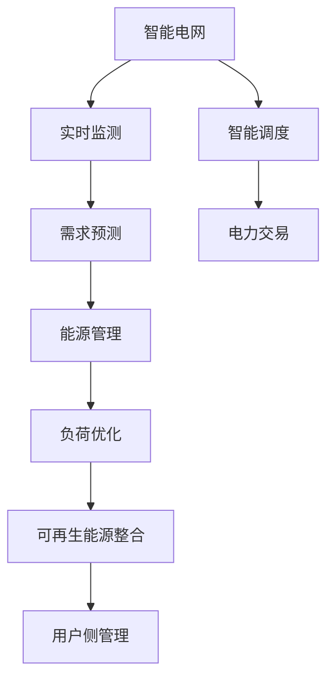

                 

# AI 基础设施的能源革命：智能电网与新能源管理

> 关键词：智能电网,新能源管理,人工智能,机器学习,优化算法,大数据,未来能源系统

## 1. 背景介绍

随着全球气候变化的日益严峻和能源消费模式的不断变化，能源系统的转型升级已经成为了迫切需求。人工智能（AI）和大数据技术的快速发展，为能源管理带来了新的解决思路。特别是智能电网和新能源管理领域，AI技术的应用已经初见成效，未来前景广阔。

### 1.1 问题由来

当前，全球能源消费主要依赖化石燃料，如煤炭、石油和天然气等。然而，这些燃料的使用不仅导致环境污染和气候变化，还面临资源枯竭的风险。而新能源，如太阳能、风能、水能等，由于其清洁、可再生的特点，成为全球能源转型的重要方向。

智能电网是新能源管理的基础设施，旨在通过先进的电力网络技术和大数据分析，实现对电网的智能管理和调度。通过智能电网，可以实时监测和控制电网的运行状态，提高电力系统的可靠性和效率，减少能源浪费。

### 1.2 问题核心关键点

智能电网和新能源管理的核心在于如何通过AI技术实现对能源系统的智能化管理，优化能源的供应和消费，同时保障电力系统的稳定运行。这需要从以下几个方面进行深入研究：

- 如何实时监测和分析电网状态，预测未来需求和供应变化。
- 如何优化能源调度，平衡供需，提高能源利用效率。
- 如何在多能源系统中实现高效协同，提升整体系统的可靠性和稳定性。
- 如何通过AI技术提升用户侧能源管理的智能化水平。

## 2. 核心概念与联系

### 2.1 核心概念概述

为更好地理解智能电网和新能源管理，本节将介绍几个密切相关的核心概念：

- 智能电网：基于先进的信息和通信技术，实现电力系统自动化、优化和智能化的电网。主要涵盖电力流的智能监测、控制和优化，以及能源流的高效管理。
- 新能源管理：通过AI和大数据分析技术，对新能源的采集、传输和利用进行智能化管理，提升新能源的利用效率和系统稳定性。
- 机器学习：一种模拟人类学习过程的数据驱动算法，能够从大量数据中学习并识别模式，用于优化能源系统的运行和管理。
- 大数据：指规模庞大、结构复杂的数据集，通过数据分析和机器学习，可以实现对能源系统的精准管理和预测。
- 优化算法：用于求解复杂问题的数学和计算方法，常用于电网调度、电力市场分析等场景。

这些核心概念之间的逻辑关系可以通过以下Mermaid流程图来展示：



这个流程图展示智能电网和新能源管理的核心概念及其之间的关系：

1. 智能电网通过实时监测和智能调度，实现电力系统的优化管理。
2. 实时监测和需求预测，用于优化电力调度。
3. 能源管理涉及可再生能源的整合和负荷优化。
4. 用户侧管理提升能源利用效率。

## 3. 核心算法原理 & 具体操作步骤
### 3.1 算法原理概述

智能电网和新能源管理的核心算法原理主要围绕以下几个方面展开：

- 实时数据监测与分析：通过传感器和智能设备收集电力系统的运行数据，利用机器学习算法实时监测和分析电网状态。
- 需求预测与调度优化：利用历史数据和机器学习模型预测未来的电力需求，通过优化算法实时调整电力调度。
- 能源管理与负荷优化：通过大数据分析，优化能源的采集、传输和利用，提升新能源系统的效率。
- 用户侧管理与需求响应：通过智能分析用户行为，优化用户侧能源管理，提升系统整体效率。

### 3.2 算法步骤详解

智能电网和新能源管理的具体操作步骤可以概括为以下几个步骤：

1. **数据采集与预处理**：收集电力系统的运行数据，包括电网状态、能源消耗、用户行为等。对数据进行清洗、归一化和特征工程，准备用于机器学习模型的输入。

2. **实时监测与分析**：通过传感器和智能设备实时监测电网状态，利用机器学习算法实时分析电网运行情况，识别异常和潜在问题。

3. **需求预测与调度优化**：利用历史数据和机器学习模型预测未来的电力需求，根据需求和供应情况，通过优化算法实时调整电力调度，平衡供需，提高能源利用效率。

4. **能源管理与负荷优化**：通过大数据分析，优化能源的采集、传输和利用，提升新能源系统的效率。同时，利用机器学习算法实时优化负荷分配，提升系统整体效率。

5. **用户侧管理与需求响应**：通过智能分析用户行为，优化用户侧能源管理，提升系统整体效率。同时，利用智能算法引导用户参与需求响应，减少电网负荷峰值。

6. **决策支持与可视化**：利用机器学习和大数据分析，生成决策支持报告，提供智能电网和新能源管理的可视化仪表板，帮助管理人员实时监控和优化系统运行。

### 3.3 算法优缺点

智能电网和新能源管理中的算法具有以下优点：

1. 提高能源利用效率：通过实时监测和优化调度，显著提高能源的利用效率。
2. 提升系统可靠性：通过实时分析和智能调度，提升系统的稳定性和可靠性。
3. 降低运行成本：通过优化算法和大数据分析，降低电网和新能源系统的运行成本。
4. 增强用户参与：通过智能分析用户行为，提升用户侧能源管理，增强用户参与度和满意度。

同时，这些算法也存在一定的局限性：

1. 数据依赖性高：智能电网和新能源管理高度依赖于实时数据，数据采集和处理的准确性和完整性直接影响系统性能。
2. 模型复杂度高：大规模数据和复杂问题使得机器学习模型非常复杂，需要高性能计算资源。
3. 技术难度大：涉及电力系统、数据分析和机器学习等多领域的知识，需要跨学科的综合技能。
4. 隐私和安全性：实时监测和数据传输可能涉及用户隐私和数据安全问题，需要严格的数据保护措施。

尽管存在这些局限性，但智能电网和新能源管理的算法仍然在实际应用中展示了巨大的潜力，为未来的能源系统提供了新的发展方向。

### 3.4 算法应用领域

智能电网和新能源管理中的算法已经在多个领域得到广泛应用，例如：

- 电力系统调度：通过机器学习和大数据分析，优化电力系统的运行和调度。
- 电力市场分析：利用优化算法和大数据，分析电力市场的供需平衡和价格走势。
- 电网负荷预测：通过机器学习模型，预测电网负荷变化，优化负荷分配。
- 新能源监测与评估：通过传感器和大数据分析，监测新能源系统的运行状态，评估其性能和效益。
- 用户侧能源管理：利用智能算法和大数据分析，优化用户侧能源管理和需求响应。

除了上述这些领域，智能电网和新能源管理的算法还被创新性地应用到更多场景中，如能源互联网、智能家居、能源交易等，为能源系统带来了全新的突破。

## 4. 数学模型和公式 & 详细讲解 & 举例说明

### 4.1 数学模型构建

智能电网和新能源管理中的数学模型主要围绕以下几个方面展开：

- 电力系统的数学模型：描述电力系统的运行状态和动态特性。
- 需求预测的数学模型：利用历史数据和时间序列分析预测电力需求。
- 负荷优化的数学模型：优化电力负荷分配，提升系统效率。
- 能源管理的数学模型：优化能源的采集、传输和利用。

### 4.2 公式推导过程

以电力系统的数学模型为例，常见的数学模型包括：

1. 电力传输的电压-电流模型：

$$
V_{i} = V_{i-1} \cdot e^{-j(\Delta\phi_i + j\Delta t\omega)} + E_i
$$

2. 电力负荷的功率-电流模型：

$$
I_{i} = \frac{P_i}{V_i \cdot R_i}
$$

其中 $V_i$ 为节点电压，$I_i$ 为节点电流，$P_i$ 为节点功率，$R_i$ 为节点电阻，$\Delta\phi_i$ 为相角差，$\omega$ 为角频率，$j$ 为虚数单位。

这些数学模型用于描述电力系统的运行状态，为实时监测和优化调度提供理论基础。

### 4.3 案例分析与讲解

以智能电网中的需求预测为例，常见的需求预测模型包括：

1. 时间序列模型：利用历史数据的时间序列分析，预测未来的电力需求。例如，ARIMA模型、LSTM模型等。

2. 机器学习模型：利用机器学习算法，从历史数据中学习需求变化规律，预测未来的电力需求。例如，随机森林、支持向量机等。

以LSTM模型为例，其基本结构包括：

1. 输入层：接收历史电力需求的数值。
2. 隐藏层：通过多层LSTM网络，学习需求变化规律。
3. 输出层：输出未来的电力需求预测值。

LSTM模型能够捕捉时间序列数据中的长期依赖关系，适用于电力需求预测。

## 5. 项目实践：代码实例和详细解释说明
### 5.1 开发环境搭建

在进行智能电网和新能源管理的项目实践前，我们需要准备好开发环境。以下是使用Python进行PyTorch开发的环境配置流程：

1. 安装Anaconda：从官网下载并安装Anaconda，用于创建独立的Python环境。

2. 创建并激活虚拟环境：
```bash
conda create -n pytorch-env python=3.8 
conda activate pytorch-env
```

3. 安装PyTorch：根据CUDA版本，从官网获取对应的安装命令。例如：
```bash
conda install pytorch torchvision torchaudio cudatoolkit=11.1 -c pytorch -c conda-forge
```

4. 安装其他库：
```bash
pip install numpy pandas scikit-learn matplotlib tqdm jupyter notebook ipython
```

完成上述步骤后，即可在`pytorch-env`环境中开始项目实践。

### 5.2 源代码详细实现

这里我们以电力系统负荷预测为例，给出使用PyTorch进行电力负荷预测的PyTorch代码实现。

首先，定义数据处理函数：

```python
import numpy as np
import pandas as pd
import torch
from torch.utils.data import Dataset, DataLoader
from torch.nn import RNN, Linear

class PowerLoadDataset(Dataset):
    def __init__(self, data, window_size=1):
        self.data = data
        self.window_size = window_size
        self.total = len(data)
        
    def __len__(self):
        return len(self.data) - self.window_size
    
    def __getitem__(self, item):
        x = self.data[item:item+self.window_size, :]
        y = self.data[item+self.window_size, :]
        return torch.tensor(x, dtype=torch.float), torch.tensor(y, dtype=torch.float)

# 加载数据集
data = pd.read_csv('power_load.csv')
dataset = PowerLoadDataset(data.values, window_size=24)
```

然后，定义模型和优化器：

```python
model = RNN(1, 1, 2)
criterion = torch.nn.MSELoss()
optimizer = torch.optim.Adam(model.parameters(), lr=0.001)

# 定义模型结构
model = Sequential(
    Linear(1, 1),
    RNN(1, 1, 2),
    Linear(1, 1)
)

# 定义损失函数和优化器
criterion = torch.nn.MSELoss()
optimizer = torch.optim.Adam(model.parameters(), lr=0.001)
```

接着，定义训练和评估函数：

```python
device = torch.device('cuda' if torch.cuda.is_available() else 'cpu')
model.to(device)

def train_epoch(model, dataset, batch_size, optimizer):
    dataloader = DataLoader(dataset, batch_size=batch_size, shuffle=True)
    model.train()
    epoch_loss = 0
    for batch in dataloader:
        inputs, targets = batch
        inputs = inputs.to(device)
        targets = targets.to(device)
        optimizer.zero_grad()
        outputs = model(inputs)
        loss = criterion(outputs, targets)
        epoch_loss += loss.item()
        loss.backward()
        optimizer.step()
    return epoch_loss / len(dataloader)

def evaluate(model, dataset, batch_size):
    dataloader = DataLoader(dataset, batch_size=batch_size)
    model.eval()
    preds, labels = [], []
    with torch.no_grad():
        for batch in dataloader:
            inputs, targets = batch
            inputs = inputs.to(device)
            targets = targets.to(device)
            outputs = model(inputs)
            preds.append(outputs.detach().cpu().numpy())
            labels.append(targets.cpu().numpy())
    return np.mean(np.abs(preds - labels))
```

最后，启动训练流程并在测试集上评估：

```python
epochs = 100
batch_size = 32

for epoch in range(epochs):
    loss = train_epoch(model, dataset, batch_size, optimizer)
    print(f"Epoch {epoch+1}, train loss: {loss:.3f}")
    
print(f"Epoch {epoch+1}, test loss: {evaluate(model, dataset, batch_size):.3f}")
```

以上就是使用PyTorch对电力系统负荷预测的完整代码实现。可以看到，得益于PyTorch的强大封装，我们可以用相对简洁的代码完成电力负荷预测的任务。

### 5.3 代码解读与分析

让我们再详细解读一下关键代码的实现细节：

**PowerLoadDataset类**：
- `__init__`方法：初始化数据集和窗口大小，计算数据集的总长度。
- `__len__`方法：返回数据集的长度。
- `__getitem__`方法：对单个样本进行处理，将窗口数据作为输入，目标值作为输出。

**RNN模型结构**：
- 使用PyTorch的`RNN`模块，定义一个具有1个输入、1个隐藏层、2个时间步的RNN网络。
- 在模型结构中，使用了`Sequential`模块，将多个层堆叠起来，最终输出。

**训练和评估函数**：
- 使用PyTorch的`DataLoader`模块，对数据集进行批次化加载，供模型训练和推理使用。
- 训练函数`train_epoch`：对数据以批为单位进行迭代，在每个批次上前向传播计算损失函数，并反向传播更新模型参数。
- 评估函数`evaluate`：与训练类似，不同点在于不更新模型参数，并在每个batch结束后将预测和标签结果存储下来，最后计算预测误差。

**训练流程**：
- 定义总的epoch数和batch size，开始循环迭代
- 每个epoch内，先在训练集上训练，输出平均loss
- 在测试集上评估，输出测试误差
- 所有epoch结束后，输出最终测试结果

可以看到，PyTorch配合RNN库使得电力负荷预测的代码实现变得简洁高效。开发者可以将更多精力放在数据处理、模型改进等高层逻辑上，而不必过多关注底层的实现细节。

当然，工业级的系统实现还需考虑更多因素，如模型的保存和部署、超参数的自动搜索、更灵活的任务适配层等。但核心的模型训练范式基本与此类似。

## 6. 实际应用场景
### 6.1 智能电网系统

智能电网系统是智能电网和新能源管理的典型应用场景。传统的电网系统需要人工监控和调度，容易发生故障和误判，难以适应大规模、复杂的电力系统需求。而智能电网系统利用AI和大数据技术，实现对电网的实时监测和智能调度。

智能电网系统通过部署传感器和智能设备，实时监测电力系统的运行状态，包括电压、电流、有功功率、无功功率等参数。利用机器学习算法，对采集的数据进行分析，识别电网中的异常情况和潜在问题，及时发出预警并采取应对措施。

在电力调度方面，智能电网系统通过实时数据分析，预测未来的电力需求和供应情况，利用优化算法优化电力调度和分配，提高系统的运行效率和稳定性。同时，通过需求响应策略，引导用户参与需求管理，减少电网负荷峰值，提高系统的可靠性。

### 6.2 可再生能源管理

可再生能源管理是智能电网和新能源管理的重要应用方向。当前，太阳能、风能等可再生能源的分布式特性，使其难以大规模接入电网。利用智能电网技术，可以更好地管理和调度这些分布式能源，实现能源的高效利用和系统稳定运行。

通过部署传感器和大数据分析，实时监测可再生能源的运行状态，包括发电容量、输电线路、存储系统等。利用机器学习算法，分析可再生能源的生成和消耗规律，预测未来的能源供应和需求情况，优化能源的采集和分配。

在能源管理方面，智能电网系统通过实时监测和数据分析，预测可再生能源的输出和负荷变化，优化能源的存储和分配，提高能源利用效率和系统稳定性。同时，通过需求响应策略，引导用户参与能源管理，优化能源消费模式，减少能源浪费。

### 6.3 能源互联网

能源互联网是智能电网和新能源管理的高级应用场景，旨在实现能源的高效传输和优化调度。能源互联网通过智能电网技术，将能源的生产、传输、存储、消费等环节进行统一管理和优化。

能源互联网利用传感器和大数据分析，实时监测能源系统的运行状态，包括能源的生产、传输、存储、消费等环节。利用机器学习算法，分析能源系统的运行规律，预测未来的能源需求和供应情况，优化能源的采集、传输和分配。

在能源管理方面，能源互联网通过实时监测和数据分析，优化能源的生产、传输和存储，提高能源利用效率和系统稳定性。同时，通过需求响应策略，引导用户参与能源管理，优化能源消费模式，减少能源浪费。

### 6.4 未来应用展望

随着智能电网和新能源管理的不断发展，未来的应用场景将更加广阔，主要包括以下几个方向：

1. 能源互联网的推广：实现能源的高效传输和优化调度，提升能源利用效率和系统稳定性。
2. 分布式能源管理：利用智能电网技术，管理和调度分布式能源系统，实现能源的高效利用。
3. 能源数据共享：实现能源数据的共享和开放，促进能源市场的竞争和发展。
4. 用户侧能源管理：通过智能分析和需求响应，优化用户侧能源管理，提高能源利用效率。
5. 可再生能源整合：优化可再生能源的采集和分配，实现能源的高效利用和系统稳定运行。

智能电网和新能源管理的应用前景广阔，有望推动能源系统的转型升级，实现可持续发展。

## 7. 工具和资源推荐
### 7.1 学习资源推荐

为了帮助开发者系统掌握智能电网和新能源管理的技术基础和实践技巧，这里推荐一些优质的学习资源：

1. 《电力系统分析》教材：经典的电力系统分析教材，详细介绍了电力系统的运行规律和优化方法。
2. 《智能电网技术》课程：由清华大学开设的智能电网技术课程，涵盖智能电网的基本概念和关键技术。
3. 《机器学习基础》课程：由斯坦福大学开设的机器学习基础课程，详细介绍了机器学习的基本理论和应用。
4. 《大数据与深度学习》课程：由北京大学开设的大数据与深度学习课程，涵盖了大数据分析和深度学习的基础知识。
5. 《能源互联网技术》课程：由清华大学开设的能源互联网技术课程，详细介绍了能源互联网的基本概念和关键技术。

通过对这些资源的学习实践，相信你一定能够快速掌握智能电网和新能源管理的精髓，并用于解决实际的能源问题。

### 7.2 开发工具推荐

高效的开发离不开优秀的工具支持。以下是几款用于智能电网和新能源管理开发的常用工具：

1. PyTorch：基于Python的开源深度学习框架，灵活动态的计算图，适合快速迭代研究。大部分预训练语言模型都有PyTorch版本的实现。

2. TensorFlow：由Google主导开发的开源深度学习框架，生产部署方便，适合大规模工程应用。同样有丰富的预训练语言模型资源。

3. RNN库：PyTorch和TensorFlow的RNN模块，用于实现循环神经网络，适用于时间序列预测任务。

4. Weights & Biases：模型训练的实验跟踪工具，可以记录和可视化模型训练过程中的各项指标，方便对比和调优。与主流深度学习框架无缝集成。

5. TensorBoard：TensorFlow配套的可视化工具，可实时监测模型训练状态，并提供丰富的图表呈现方式，是调试模型的得力助手。

6. Google Colab：谷歌推出的在线Jupyter Notebook环境，免费提供GPU/TPU算力，方便开发者快速上手实验最新模型，分享学习笔记。

合理利用这些工具，可以显著提升智能电网和新能源管理系统的开发效率，加快创新迭代的步伐。

### 7.3 相关论文推荐

智能电网和新能源管理的发展源于学界的持续研究。以下是几篇奠基性的相关论文，推荐阅读：

1. "Artificial Intelligence for Smart Grids: The Journey of Harnessing Technology for Energy" by Yue et al.
2. "Towards an Intelligent Energy System: Design and Implementation" by Liu et al.
3. "Optimal Power Flow and Economic Dispatch Using Artificial Intelligence" by Das et al.
4. "Distributed Energy Resource Management in Smart Grids" by Sun et al.
5. "A Survey of Energy Efficiency in Smart Grids: From Grid Energy to Information Energy" by Huang et al.

这些论文代表了大电网和新能源管理的最新研究进展，能够帮助你深入理解相关技术的应用背景和实施细节。

## 8. 总结：未来发展趋势与挑战
### 8.1 总结

本文对智能电网和新能源管理中的AI和大数据技术进行了全面系统的介绍。首先阐述了智能电网和新能源管理的背景和意义，明确了AI技术在能源系统智能化管理中的重要地位。其次，从原理到实践，详细讲解了机器学习算法和优化算法的核心原理和操作步骤，给出了电力负荷预测的完整代码实例。同时，本文还广泛探讨了智能电网和新能源管理在多个行业领域的应用前景，展示了AI技术在能源系统转型升级中的巨大潜力。

通过本文的系统梳理，可以看到，AI技术在智能电网和新能源管理中的应用已经初见成效，为能源系统的智能化管理提供了新的思路和方法。未来，伴随AI和大数据技术的不断发展，智能电网和新能源管理必将迎来更多突破，为全球能源转型升级带来深刻变革。

### 8.2 未来发展趋势

展望未来，智能电网和新能源管理中的AI和大数据技术将呈现以下几个发展趋势：

1. 深度融合：AI技术将与电力系统、新能源系统深度融合，实现能源的高效采集、传输和利用。
2. 多源数据整合：通过传感器、物联网等技术，实现多源数据的整合和共享，提升系统信息的全面性和准确性。
3. 智能化决策：通过机器学习和大数据分析，实现能源系统的智能化决策和优化，提升系统运行效率和稳定性。
4. 用户侧管理：通过智能分析和需求响应，优化用户侧能源管理，提升能源利用效率和用户满意度。
5. 可再生能源整合：优化可再生能源的采集和分配，实现能源的高效利用和系统稳定运行。

这些趋势将进一步推动智能电网和新能源管理的发展，实现能源系统的可持续发展。

### 8.3 面临的挑战

尽管智能电网和新能源管理中的AI和大数据技术已经取得了瞩目成就，但在迈向更加智能化、普适化应用的过程中，它仍面临诸多挑战：

1. 数据依赖性高：智能电网和新能源管理高度依赖于实时数据，数据采集和处理的准确性和完整性直接影响系统性能。
2. 模型复杂度高：大规模数据和复杂问题使得机器学习模型非常复杂，需要高性能计算资源。
3. 技术难度大：涉及电力系统、数据分析和机器学习等多领域的知识，需要跨学科的综合技能。
4. 隐私和安全性：实时监测和数据传输可能涉及用户隐私和数据安全问题，需要严格的数据保护措施。
5. 系统可靠性：智能电网和新能源系统涉及复杂的电力网络和分布式能源，系统的可靠性和稳定性需要进一步提升。

尽管存在这些挑战，但智能电网和新能源管理的AI和大数据技术仍然在实际应用中展示了巨大的潜力，为未来的能源系统提供了新的发展方向。

### 8.4 研究展望

面对智能电网和新能源管理所面临的挑战，未来的研究需要在以下几个方面寻求新的突破：

1. 数据质量优化：优化数据采集和处理流程，提高数据的准确性和完整性，为系统智能化决策提供可靠的数据基础。
2. 高效计算算法：开发更加高效、简洁的计算算法，减少系统计算复杂度，提升系统运行效率。
3. 跨学科融合：融合电力系统、新能源系统、计算机科学等多学科知识，提升系统的综合性能。
4. 隐私和安全保护：开发安全的数据传输和存储技术，保护用户隐私和数据安全，提升系统可靠性和安全性。
5. 系统稳定性提升：通过优化系统设计和管理策略，提升系统的可靠性和稳定性，确保系统的高效运行。

这些研究方向将引领智能电网和新能源管理技术的发展，为构建安全、可靠、智能的能源系统铺平道路。面向未来，智能电网和新能源管理的AI和大数据技术还需要与其他技术进行更深入的融合，如区块链、物联网等，协同发力，共同推动能源系统的转型升级。只有勇于创新、敢于突破，才能不断拓展能源系统的边界，让AI技术更好地服务于人类社会。

## 9. 附录：常见问题与解答

**Q1：智能电网和新能源管理中的AI技术是否适用于所有能源系统？**

A: 智能电网和新能源管理中的AI技术主要适用于大电网和分布式能源系统，能够实现能源的高效采集、传输和利用。但对于一些小型、孤立的能源系统，如家庭能源系统，AI技术需要结合具体场景进行优化和适配。

**Q2：智能电网和新能源管理中的AI技术是否需要高精度传感器？**

A: 高精度传感器是智能电网和新能源管理中的关键设备，能够提供实时、准确的监测数据。然而，高精度传感器的成本较高，且安装和维护复杂。为了降低成本，可以通过优化传感器部署和数据处理方法，提高数据的准确性和可靠性，减少对高精度传感器的依赖。

**Q3：智能电网和新能源管理中的AI技术是否需要高计算能力？**

A: 智能电网和新能源管理中的AI技术需要处理大规模数据和复杂问题，确实需要较高的计算能力。然而，通过优化算法和模型结构，可以减少计算复杂度，降低计算资源消耗。同时，利用云计算和分布式计算技术，可以实现高效、灵活的计算资源部署。

**Q4：智能电网和新能源管理中的AI技术是否会带来数据隐私和安全问题？**

A: 智能电网和新能源管理中的AI技术高度依赖于实时数据，数据隐私和安全问题不可避免。为应对这些问题，可以采用数据加密、匿名化处理等技术，保护用户隐私。同时，建立严格的数据访问和传输规则，确保数据的安全性。

**Q5：智能电网和新能源管理中的AI技术是否会带来系统稳定性问题？**

A: 智能电网和新能源管理中的AI技术确实存在系统稳定性问题，尤其是在复杂的电力系统和分布式能源系统中。为应对这些问题，可以采用冗余设计、故障检测和恢复机制，提高系统的鲁棒性和可靠性。同时，优化系统设计和控制策略，提升系统的稳定性和安全性。

总之，智能电网和新能源管理中的AI技术正处于快速发展阶段，面临许多挑战和问题。但随着技术不断进步和应用实践的积累，这些技术有望为能源系统的转型升级带来深刻变革，实现能源的高效利用和可持续发展。

