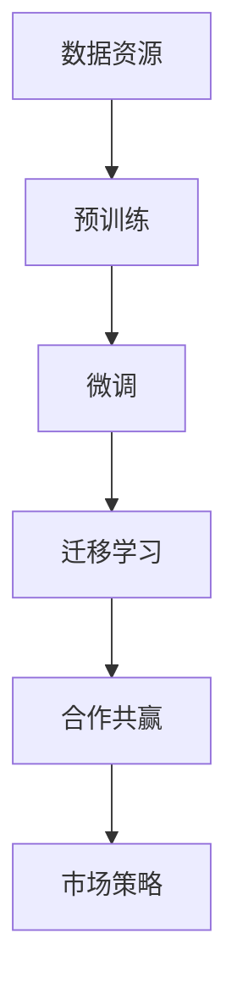

                 

# AI 大模型创业：如何利用国际优势？

> 关键词：大模型创业, 国际优势, AI 技术, 数据资源, 人才培养, 合作共赢

## 1. 背景介绍

### 1.1 问题由来

随着人工智能技术的飞速发展，大模型（Big Models）在各个领域的应用变得越来越广泛。这些大模型，如 OpenAI 的 GPT 系列、Google 的 T5 等，通常是通过在大规模无标签数据上预训练得到的，具有强大的泛化能力和推理能力。这些大模型在自然语言处理（NLP）、计算机视觉（CV）、语音识别（ASR）等领域展现出卓越的表现，成为推动科技进步的重要驱动力。

然而，尽管大模型的性能令人瞩目，但其开发和应用却面临着诸多挑战。其中，如何高效利用国际优势，加速大模型的创业进程，成为一个亟待解决的问题。本文将详细探讨这一问题，并提出相应的解决方案。

### 1.2 问题核心关键点

利用国际优势进行大模型创业，主要涉及以下几个核心关键点：

- **数据资源**：大模型需要大量的高质量数据进行预训练和微调。如何高效获取并利用全球各地的数据资源，是大模型创业的关键。
- **人才培养**：大模型开发和应用需要跨学科的顶尖人才，包括计算机科学家、数据科学家、行业专家等。如何培养和吸引这些人才，是大模型创业的重要因素。
- **合作共赢**：大模型研发和应用往往需要跨国界合作，包括与研究机构、企业、政府等不同利益相关方的协同合作。如何构建高效、稳定的合作机制，是大模型创业的基石。
- **市场策略**：大模型的应用场景广泛，如何制定有效的市场策略，拓展用户和客户群体，是大模型创业的最终目标。

通过深入分析这些问题，本文旨在为大模型创业提供一条可行的国际路径，帮助创业者和企业高效利用国际资源，加速大模型的落地应用。

## 2. 核心概念与联系

### 2.1 核心概念概述

- **大模型（Big Models）**：指在大规模数据集上预训练的模型，具有强大的泛化能力和推理能力。
- **预训练（Pre-training）**：通过大规模无标签数据进行自监督学习，学习模型的通用表示。
- **微调（Fine-tuning）**：在大模型的基础上，通过有标签数据进行有监督学习，适应特定任务的需求。
- **迁移学习（Transfer Learning）**：利用在大规模数据上预训练的模型，将其知识迁移到新任务上，减少训练时间和数据需求。
- **合作共赢（Collaboration & Win-win）**：通过跨界合作，共享资源和知识，实现互利共赢。
- **市场策略（Market Strategy）**：通过制定有效的市场策略，拓展大模型的应用场景和用户群体。

这些核心概念之间存在紧密的联系，共同构成了大模型创业的基础框架。利用这些概念，可以更好地理解大模型创业的国际路径和具体实施方法。

### 2.2 核心概念原理和架构的 Mermaid 流程图



此流程图展示了大模型创业的主要步骤和关键概念之间的联系。其中，数据资源是预训练的基础，微调和迁移学习是大模型落地应用的核心，而合作共赢和市场策略则是大模型创业成功的关键。

## 3. 核心算法原理 & 具体操作步骤

### 3.1 算法原理概述

大模型创业的核心算法原理包括以下几个方面：

1. **预训练算法**：通过在大规模无标签数据上自监督学习，提取通用的语言或视觉特征。
2. **微调算法**：在大模型的基础上，通过有标签数据进行有监督学习，适应特定任务的需求。
3. **迁移学习算法**：利用预训练模型，将其知识迁移到新任务上，减少新任务的训练时间和数据需求。
4. **合作共赢算法**：通过跨界合作，共享资源和知识，实现互利共赢。
5. **市场策略算法**：通过制定有效的市场策略，拓展大模型的应用场景和用户群体。

这些算法原理相互交织，共同构成了大模型创业的技术基础。

### 3.2 算法步骤详解

#### 3.2.1 预训练步骤

1. **数据收集**：收集全球各地的高质量数据，包括文本、图像、视频等。
2. **数据预处理**：对数据进行清洗、标注、划分等预处理操作。
3. **模型选择**：选择合适的预训练模型，如 GPT、BERT、T5 等。
4. **预训练训练**：使用预训练算法在大规模无标签数据上进行自监督学习，提取通用特征。

#### 3.2.2 微调步骤

1. **任务适配**：根据特定任务的需求，适配模型的输出层和损失函数。
2. **数据集准备**：准备包含少量标注数据的下游任务数据集。
3. **模型初始化**：将预训练模型作为初始化参数，进行微调。
4. **模型训练**：使用微调算法和优化器在大规模标注数据上进行有监督学习，优化模型性能。
5. **模型评估**：在验证集和测试集上评估模型性能，确保模型适应特定任务。

#### 3.2.3 迁移学习步骤

1. **任务映射**：将新任务与已有预训练模型的知识进行映射。
2. **模型微调**：在新任务上对预训练模型进行微调，适应新任务的需求。
3. **知识迁移**：将预训练模型的知识迁移到新任务上，减少新任务的训练时间和数据需求。

#### 3.2.4 合作共赢步骤

1. **合作伙伴选择**：选择具有相似目标和优势的合作伙伴。
2. **资源共享**：共享数据、技术、人才等资源，实现互利共赢。
3. **合作协议制定**：制定明确的合作协议，确保合作的稳定性和可持续性。

#### 3.2.5 市场策略步骤

1. **市场调研**：了解目标市场的需求和痛点。
2. **产品定位**：根据市场需求，制定大模型的产品定位和功能。
3. **营销推广**：制定有效的市场推广策略，提升大模型的知名度和用户群体。
4. **用户反馈**：收集用户反馈，持续优化大模型的性能和应用体验。

### 3.3 算法优缺点

#### 3.3.1 优点

1. **高效利用国际资源**：通过跨国界的合作和数据共享，可以高效利用全球各地的数据资源和技术人才。
2. **快速适应新任务**：利用预训练模型的知识迁移能力，可以快速适应新任务，减少新任务的训练时间和数据需求。
3. **提升性能和效率**：通过合作共赢和市场策略，可以快速拓展用户群体，提升大模型的市场价值。

#### 3.3.2 缺点

1. **数据隐私和安全**：跨国数据共享可能带来数据隐私和安全问题，需要采取严格的保护措施。
2. **合作协调难度**：跨界合作需要协调不同国家和地区的法律、文化和语言差异，可能导致合作效率降低。
3. **市场竞争激烈**：大模型市场竞争激烈，如何制定有效的市场策略，提升竞争力，是创业成功的关键。

### 3.4 算法应用领域

大模型创业的应用领域广泛，包括但不限于以下几个方面：

1. **自然语言处理（NLP）**：利用大模型进行文本分类、情感分析、机器翻译、问答系统等任务。
2. **计算机视觉（CV）**：利用大模型进行图像识别、目标检测、图像生成等任务。
3. **语音识别（ASR）**：利用大模型进行语音识别、语音合成、语音翻译等任务。
4. **智能推荐**：利用大模型进行个性化推荐系统，提升用户体验和系统效率。
5. **智能客服**：利用大模型进行智能客服系统，提高客户满意度和服务效率。

以上应用领域展示了大模型创业的广阔前景，为创业者和企业提供了多样化的选择。

## 4. 数学模型和公式 & 详细讲解 & 举例说明

### 4.1 数学模型构建

大模型创业的数学模型构建包括以下几个关键步骤：

1. **数据表示**：将数据表示为模型可以处理的形式，如文本表示为向量、图像表示为矩阵等。
2. **模型选择**：选择适当的预训练模型和微调模型。
3. **损失函数定义**：根据任务需求，定义合适的损失函数，如交叉熵损失、均方误差损失等。
4. **优化器选择**：选择合适的优化器，如 SGD、AdamW 等。
5. **性能评估**：定义评估指标，如准确率、召回率、F1 值等。

### 4.2 公式推导过程

#### 4.2.1 预训练

预训练的数学模型构建如下：

1. **文本表示**：
   $$
   \mathbf{x} = \text{Embedding}(\text{Tokenize}(\text{Text}))
   $$
2. **自监督学习**：
   $$
   \mathbf{h} = \text{Transformer}(\mathbf{x})
   $$
3. **预训练目标**：
   $$
   \mathcal{L}_{\text{pretrain}} = \mathcal{L}_{\text{masked language modeling}} + \mathcal{L}_{\text{next sentence prediction}}
   $$

#### 4.2.2 微调

微调的数学模型构建如下：

1. **任务适配**：
   $$
   \mathbf{y} = \text{Task-Specific Layer}(\mathbf{h})
   $$
2. **有监督学习**：
   $$
   \mathcal{L}_{\text{fine-tune}} = \mathcal{L}_{\text{loss function}}
   $$
3. **微调优化器**：
   $$
   \mathbf{\theta} \leftarrow \mathbf{\theta} - \eta \nabla_{\mathbf{\theta}} \mathcal{L}_{\text{fine-tune}}
   $$

#### 4.2.3 迁移学习

迁移学习的数学模型构建如下：

1. **知识迁移**：
   $$
   \mathbf{z} = \text{Task-Specific Layer}(\mathbf{h})
   $$
2. **新任务微调**：
   $$
   \mathbf{\hat{y}} = \text{Task-Specific Layer}(\mathbf{z})
   $$

### 4.3 案例分析与讲解

#### 4.3.1 案例：NLP领域的多语种翻译

1. **数据收集**：收集全球多语言的新闻、网页、书籍等数据。
2. **预训练模型**：选择 BERT 或 GPT 等大模型进行预训练。
3. **微调模型**：根据多语种翻译需求，适配输出层和损失函数。
4. **知识迁移**：利用预训练模型的知识，对新语种进行微调。
5. **合作共赢**：与不同国家的语言专家和机构合作，提高翻译质量。

#### 4.3.2 案例：CV领域的图像识别

1. **数据收集**：收集全球各地的图像数据。
2. **预训练模型**：选择 ResNet、VGG 等大模型进行预训练。
3. **微调模型**：根据具体图像识别任务，适配输出层和损失函数。
4. **知识迁移**：利用预训练模型的知识，对新任务进行微调。
5. **合作共赢**：与不同国家的计算机视觉专家和机构合作，提高识别准确率。

## 5. 项目实践：代码实例和详细解释说明

### 5.1 开发环境搭建

1. **安装 Python**：在目标平台上安装 Python 3.x 版本。
2. **安装 PyTorch**：
   ```bash
   pip install torch torchvision torchaudio
   ```
3. **安装 Transformers**：
   ```bash
   pip install transformers
   ```
4. **安装相关库**：安装必要的库，如 pandas、numpy、matplotlib 等。

### 5.2 源代码详细实现

#### 5.2.1 数据处理

```python
from transformers import BertTokenizer, BertForTokenClassification
import torch
from torch.utils.data import Dataset, DataLoader

class CustomDataset(Dataset):
    def __init__(self, data, tokenizer, max_len=128):
        self.tokenizer = tokenizer
        self.data = data
        self.max_len = max_len
        
    def __len__(self):
        return len(self.data)
    
    def __getitem__(self, idx):
        text = self.data[idx]
        tokenized_text = self.tokenizer(text, padding='max_length', max_length=self.max_len, return_tensors='pt')
        input_ids = tokenized_text['input_ids']
        attention_mask = tokenized_text['attention_mask']
        return {'input_ids': input_ids, 'attention_mask': attention_mask}
```

#### 5.2.2 模型微调

```python
from transformers import BertForTokenClassification, AdamW

model = BertForTokenClassification.from_pretrained('bert-base-cased')
tokenizer = BertTokenizer.from_pretrained('bert-base-cased')

device = torch.device('cuda' if torch.cuda.is_available() else 'cpu')
model.to(device)

optimizer = AdamW(model.parameters(), lr=2e-5)

def train_epoch(model, train_loader, optimizer):
    model.train()
    total_loss = 0
    for batch in train_loader:
        input_ids = batch['input_ids'].to(device)
        attention_mask = batch['attention_mask'].to(device)
        labels = batch['labels'].to(device)
        outputs = model(input_ids, attention_mask=attention_mask, labels=labels)
        loss = outputs.loss
        total_loss += loss.item()
        optimizer.zero_grad()
        loss.backward()
        optimizer.step()
    return total_loss / len(train_loader)
```

#### 5.2.3 模型评估

```python
from sklearn.metrics import accuracy_score, precision_recall_fscore_support

def evaluate(model, test_loader):
    model.eval()
    total_preds, total_labels = [], []
    with torch.no_grad():
        for batch in test_loader:
            input_ids = batch['input_ids'].to(device)
            attention_mask = batch['attention_mask'].to(device)
            labels = batch['labels'].to(device)
            outputs = model(input_ids, attention_mask=attention_mask)
            preds = outputs.logits.argmax(dim=2).to('cpu').tolist()
            batch_preds = preds[:len(labels)]
            batch_labels = labels.to('cpu').tolist()
            total_preds.extend(batch_preds)
            total_labels.extend(batch_labels)
    
    accuracy = accuracy_score(total_labels, total_preds)
    precision, recall, f1, _ = precision_recall_fscore_support(total_labels, total_preds, average='macro')
    return accuracy, precision, recall, f1
```

### 5.3 代码解读与分析

#### 5.3.1 数据处理

数据处理模块负责将原始数据转换为模型可用的格式。通过使用 Transformers 库中的 BertTokenizer 类，可以方便地对文本进行分词和编码。

#### 5.3.2 模型微调

模型微调模块包括模型初始化、损失函数计算、梯度更新等。通过定义 train_epoch 函数，可以高效地对模型进行训练和优化。

#### 5.3.3 模型评估

模型评估模块负责在测试集上评估模型的性能。通过计算准确率、精确率、召回率和 F1 值，可以全面了解模型在不同任务上的表现。

### 5.4 运行结果展示

运行上述代码后，可以得到模型的训练和评估结果，如训练过程中的损失变化、测试集上的准确率和 F1 值等。这些结果可以帮助我们了解模型的性能，并根据需要进行调整。

## 6. 实际应用场景

### 6.1 智能客服系统

智能客服系统是利用大模型进行应用的一个典型例子。通过微调预训练的对话模型，可以实现智能问答、情感分析、自动回复等功能，极大提升客户服务体验。

#### 6.1.1 数据收集

收集企业内部的历史客服对话记录，并将问题和最佳答复构建成监督数据，供模型训练。

#### 6.1.2 模型微调

选择预训练的对话模型，如 GPT-3，对其进行微调，使其适应特定的问答和情感分析任务。

#### 6.1.3 应用部署

将微调后的模型集成到智能客服系统中，实现自动问答、情感分析等功能。

#### 6.1.4 效果评估

通过在真实客服场景中进行测试，评估模型的实际效果和用户体验。

### 6.2 金融舆情监测

金融舆情监测是大模型在金融领域的一个典型应用。通过微调预训练的情感分析模型，可以实时监测市场舆情，辅助金融决策。

#### 6.2.1 数据收集

收集金融领域的新闻、评论、社交媒体等数据，并对数据进行情感标注。

#### 6.2.2 模型微调

选择预训练的情感分析模型，如 BERT，对其进行微调，使其适应金融舆情监测任务。

#### 6.2.3 应用部署

将微调后的模型集成到金融舆情监测系统中，实时监测市场舆情，辅助金融决策。

#### 6.2.4 效果评估

通过对比人工监测的效果，评估模型的准确性和实时性。

### 6.3 个性化推荐系统

个性化推荐系统是大模型在电商、视频、新闻等领域的一个典型应用。通过微调预训练的推荐模型，可以实现个性化的商品、视频、新闻推荐，提升用户体验和系统效率。

#### 6.3.1 数据收集

收集用户的历史行为数据，包括浏览、点击、购买等行为。

#### 6.3.2 模型微调

选择预训练的推荐模型，如 BERT，对其进行微调，使其适应特定的个性化推荐任务。

#### 6.3.3 应用部署

将微调后的模型集成到个性化推荐系统中，实现商品、视频、新闻的个性化推荐。

#### 6.3.4 效果评估

通过用户反馈和行为数据，评估模型的推荐效果和用户满意度。

## 7. 工具和资源推荐

### 7.1 学习资源推荐

1. **《Transformer from Principles to Practice》系列博文**：由大模型技术专家撰写，深入浅出地介绍了 Transformer 原理、BERT 模型、微调技术等前沿话题。
2. **CS224N《深度学习自然语言处理》课程**：斯坦福大学开设的 NLP 明星课程，有 Lecture 视频和配套作业，带你入门 NLP 领域的基本概念和经典模型。
3. **《Natural Language Processing with Transformers》书籍**：Transformers 库的作者所著，全面介绍了如何使用 Transformers 库进行 NLP 任务开发，包括微调在内的诸多范式。
4. **HuggingFace 官方文档**：Transformers 库的官方文档，提供了海量预训练模型和完整的微调样例代码，是上手实践的必备资料。
5. **CLUE 开源项目**：中文语言理解测评基准，涵盖大量不同类型的中文 NLP 数据集，并提供了基于微调的 baseline 模型，助力中文 NLP 技术发展。

### 7.2 开发工具推荐

1. **PyTorch**：基于 Python 的开源深度学习框架，灵活动态的计算图，适合快速迭代研究。大部分预训练语言模型都有 PyTorch 版本的实现。
2. **TensorFlow**：由 Google 主导开发的开源深度学习框架，生产部署方便，适合大规模工程应用。同样有丰富的预训练语言模型资源。
3. **Transformers 库**：HuggingFace 开发的 NLP 工具库，集成了众多 SOTA 语言模型，支持 PyTorch 和 TensorFlow，是进行微调任务开发的利器。
4. **Weights & Biases**：模型训练的实验跟踪工具，可以记录和可视化模型训练过程中的各项指标，方便对比和调优。与主流深度学习框架无缝集成。
5. **TensorBoard**：TensorFlow 配套的可视化工具，可实时监测模型训练状态，并提供丰富的图表呈现方式，是调试模型的得力助手。
6. **Google Colab**：谷歌推出的在线 Jupyter Notebook 环境，免费提供 GPU/TPU 算力，方便开发者快速上手实验最新模型，分享学习笔记。

### 7.3 相关论文推荐

1. **Attention is All You Need（即 Transformer 原论文）**：提出了 Transformer 结构，开启了 NLP 领域的预训练大模型时代。
2. **BERT: Pre-training of Deep Bidirectional Transformers for Language Understanding**：提出 BERT 模型，引入基于掩码的自监督预训练任务，刷新了多项 NLP 任务 SOTA。
3. **Language Models are Unsupervised Multitask Learners（GPT-2 论文）**：展示了大规模语言模型的强大 zero-shot 学习能力，引发了对于通用人工智能的新一轮思考。
4. **Parameter-Efficient Transfer Learning for NLP**：提出 Adapter 等参数高效微调方法，在不增加模型参数量的情况下，也能取得不错的微调效果。
5. **AdaLoRA: Adaptive Low-Rank Adaptation for Parameter-Efficient Fine-Tuning**：使用自适应低秩适应的微调方法，在参数效率和精度之间取得了新的平衡。
6. **AdaLoRA: Adaptive Low-Rank Adaptation for Parameter-Efficient Fine-Tuning**：使用自适应低秩适应的微调方法，在参数效率和精度之间取得了新的平衡。

这些论文代表了大模型微调技术的发展脉络。通过学习这些前沿成果，可以帮助研究者把握学科前进方向，激发更多的创新灵感。

## 8. 总结：未来发展趋势与挑战

### 8.1 研究成果总结

本文详细介绍了利用国际优势进行大模型创业的方法和步骤，涵盖了数据资源、人才培养、合作共赢、市场策略等方面。通过系统梳理这些关键概念，为大模型创业提供了一条可行的国际路径。

### 8.2 未来发展趋势

展望未来，大模型创业将呈现以下几个发展趋势：

1. **全球化合作**：跨国界的合作将更加深入，共享数据、技术、人才等资源，实现互利共赢。
2. **数据隐私保护**：随着数据隐私意识的提高，大模型创业需要更加重视数据隐私和安全保护。
3. **模型自适应性**：大模型需要具备更加强大的自适应性，能够快速适应新任务和新环境。
4. **多模态融合**：大模型将更加注重多模态数据的融合，提升跨模态的推理和理解能力。
5. **市场竞争**：大模型市场的竞争将更加激烈，如何制定有效的市场策略，提升竞争力，是创业成功的关键。

### 8.3 面临的挑战

尽管大模型创业取得了一定的进展，但在迈向更加智能化、普适化应用的过程中，仍面临诸多挑战：

1. **数据隐私和安全**：跨国数据共享可能带来数据隐私和安全问题，需要采取严格的保护措施。
2. **合作协调难度**：跨界合作需要协调不同国家和地区的法律、文化和语言差异，可能导致合作效率降低。
3. **市场竞争激烈**：大模型市场竞争激烈，如何制定有效的市场策略，提升竞争力，是创业成功的关键。
4. **技术壁垒**：大模型开发和应用需要跨学科的顶尖人才，如何培养和吸引这些人才，是大模型创业的重要因素。
5. **落地应用难度**：大模型需要高效的落地应用方案，如何设计高效、易用的应用接口和用户界面，是应用落地的关键。

### 8.4 研究展望

面对大模型创业所面临的挑战，未来的研究需要在以下几个方面寻求新的突破：

1. **数据隐私保护**：研究更加高效、安全的数据共享和隐私保护技术，确保跨国数据合作的顺利进行。
2. **模型自适应性**：研究更加高效、自适应的微调算法，提升模型的跨任务和跨环境适应能力。
3. **多模态融合**：研究多模态数据的整合和融合技术，提升大模型对视觉、语音等多模态信息的理解和推理能力。
4. **市场策略优化**：研究更加灵活、高效的市场策略，提升大模型在各领域的落地应用和用户群体。
5. **人才培养**：研究更加系统、高效的人才培养和吸引机制，构建跨学科、国际化的人才团队。

通过持续研究和创新，大模型创业必将迈向更高的台阶，为人工智能技术在各领域的落地应用提供强大的驱动力。

## 9. 附录：常见问题与解答

### Q1: 大模型创业需要哪些关键资源？

A: 大模型创业需要以下关键资源：

1. **高质量数据**：大模型需要大量的高质量数据进行预训练和微调。
2. **顶尖人才**：大模型开发和应用需要跨学科的顶尖人才，包括计算机科学家、数据科学家、行业专家等。
3. **先进技术**：大模型需要先进的技术支持，如高效的数据处理、模型训练、优化算法等。
4. **国际合作**：大模型需要跨国界的合作，共享资源和知识，实现互利共赢。

### Q2: 大模型创业过程中如何避免数据隐私和安全问题？

A: 大模型创业过程中，避免数据隐私和安全问题可以从以下几个方面进行：

1. **数据匿名化**：在数据共享过程中，对敏感信息进行匿名化处理，确保数据隐私保护。
2. **加密传输**：通过加密传输技术，保护数据在传输过程中的安全。
3. **访问控制**：设置严格的访问控制机制，确保只有授权人员可以访问敏感数据。
4. **审计和监控**：建立审计和监控机制，实时监控数据使用情况，及时发现和处理安全问题。

### Q3: 如何选择合适的预训练模型和微调模型？

A: 选择合适的预训练模型和微调模型可以从以下几个方面进行：

1. **任务适配**：根据具体的任务需求，选择适合的预训练模型和微调模型。
2. **模型性能**：选择性能优秀、效果稳定的预训练模型和微调模型。
3. **模型资源**：根据可用资源和算力，选择合适的预训练模型和微调模型。
4. **模型更新**：选择具备更新潜力的预训练模型和微调模型，保证其长期可用性。

### Q4: 大模型创业过程中如何构建高效的合作机制？

A: 构建高效的合作机制可以从以下几个方面进行：

1. **明确目标**：明确合作的总体目标和具体任务，确保各方共同努力。
2. **资源共享**：建立资源共享机制，确保各方能够高效地利用彼此的资源和优势。
3. **协议制定**：制定明确的合作协议，确保合作的稳定性和可持续性。
4. **沟通协作**：建立高效的沟通协作机制，确保各方能够及时沟通和解决问题。

### Q5: 大模型创业过程中如何制定有效的市场策略？

A: 制定有效的市场策略可以从以下几个方面进行：

1. **市场调研**：了解目标市场的需求和痛点，制定有针对性的市场策略。
2. **产品定位**：根据市场需求，制定大模型的产品定位和功能，确保其满足市场需求。
3. **营销推广**：制定有效的营销推广策略，提升大模型的知名度和用户群体。
4. **用户反馈**：收集用户反馈，持续优化大模型的性能和应用体验。

---

作者：禅与计算机程序设计艺术 / Zen and the Art of Computer Programming

