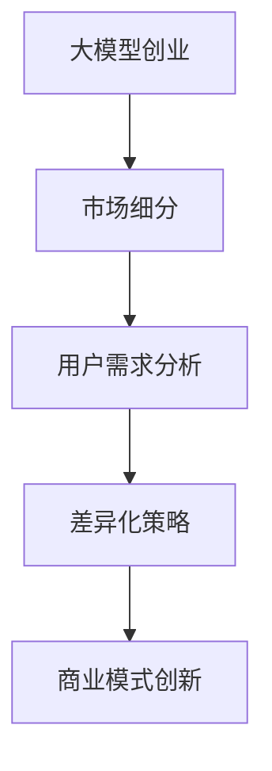

                 

# AI 大模型创业：如何利用市场优势？

> 关键词：大模型创业, 市场优势, 商业应用, 技术突破, 用户需求, 竞争策略, 商业模式

## 1. 背景介绍

### 1.1 问题由来

在人工智能(AI)领域的飞速发展中，大模型凭借其强大的语言理解和生成能力，逐渐成为各大企业和初创公司争相布局的重要方向。例如，Google的BERT、OpenAI的GPT-3等模型已经在新闻、医疗、金融、教育等多个领域展现了广泛的应用潜力。然而，要在大模型创业领域取得成功，仅仅依靠强大的技术能力是不够的。如何有效利用市场优势，推动大模型技术向现实落地，成为摆在企业家和创业者面前的重大挑战。

### 1.2 问题核心关键点

大模型创业的关键在于如何将技术优势转化为市场竞争优势，形成可持续发展的商业模式。具体而言，需注意以下关键点：

1. **明确目标市场**：确定大模型应用的特定行业或细分市场，进行深入需求分析和市场调研。
2. **解决实际问题**：针对目标市场，识别用户的具体痛点和需求，开发能真正解决实际问题的AI应用。
3. **差异化竞争**：根据用户需求和市场特点，设计差异化的产品和服务，避免同质化竞争。
4. **灵活商业模式**：创新商业模式，探索多种收入途径，如订阅服务、API接口、咨询培训等。
5. **持续优化改进**：构建数据驱动的反馈机制，根据用户反馈不断优化产品，提升用户体验。

## 2. 核心概念与联系

### 2.1 核心概念概述

为深入理解大模型创业的市场优势利用，需掌握以下核心概念：

- **大模型创业**：使用大模型技术进行创业，开发解决特定行业问题的AI产品，实现商业化落地。
- **市场细分**：将广阔的市场分为若干个具体的、相对独立的部分，以便更精准地识别潜在客户和竞争者。
- **用户需求分析**：通过调查问卷、用户访谈等方式，收集目标用户的需求和痛点，以指导产品开发。
- **差异化策略**：在市场细分和用户需求分析的基础上，设计具有独特价值的产品和服务，满足特定用户群体。
- **商业模式创新**：基于大模型技术，设计灵活多变的商业模式，以适应不同市场和用户需求。

这些概念共同构成大模型创业的框架，其核心逻辑可以概括为：通过细分市场、分析需求、差异化竞争、创新模式，实现大模型技术的市场化应用。

### 2.2 核心概念原理和架构的 Mermaid 流程图



这个流程图直观地展示了大模型创业的实施流程：从大模型创业出发，通过市场细分识别目标市场，再进行用户需求分析，设计差异化策略，最终形成创新商业模式。

## 3. 核心算法原理 & 具体操作步骤

### 3.1 算法原理概述

大模型创业的本质是通过大模型技术解决实际问题，实现商业化应用。其核心算法原理包括以下几个方面：

1. **市场细分算法**：将大市场细分为若干小市场，找到最具有潜力的细分市场，分析其需求特点。
2. **需求分析算法**：通过问卷调查、访谈等手段收集目标市场用户的具体需求和痛点，明确产品开发方向。
3. **差异化产品设计算法**：基于需求分析结果，设计独特的产品和服务，满足特定用户群体的需求。
4. **商业模式设计算法**：构建多样化的商业模式，实现收入多样化，降低单一业务的经营风险。

### 3.2 算法步骤详解

#### 步骤一：市场细分
- **数据收集**：收集行业报告、市场调研数据，了解整体市场规模和趋势。
- **指标分析**：使用聚类算法、关联规则等方法，分析市场中的主要细分领域。
- **市场评估**：评估各细分市场的潜力和发展前景，筛选出最有吸引力的细分市场。

#### 步骤二：用户需求分析
- **问卷设计**：设计针对目标用户的问卷调查表，涵盖产品功能、使用体验、价格接受度等方面。
- **数据采集**：通过线上线下渠道采集问卷数据，使用数据挖掘技术分析用户需求。
- **需求识别**：提取用户需求的关键特征，识别出用户的痛点和需求点。

#### 步骤三：差异化产品设计
- **功能设计**：根据需求分析结果，设计差异化功能，确保产品具有独特优势。
- **用户体验优化**：通过A/B测试、用户反馈等方式，不断优化产品设计，提升用户体验。
- **市场适配**：针对不同市场特点，调整产品特性和服务方式，实现本地化适配。

#### 步骤四：商业模式设计
- **收入模型设计**：探索订阅服务、API接口、咨询培训等多种收入模式，形成多样化收入体系。
- **成本控制策略**：采用云计算、按需付费等方式，优化成本结构，提升利润率。
- **风险管理**：设计风险转移、业务备用策略，降低单一市场变化带来的风险。

### 3.3 算法优缺点

大模型创业利用市场优势的关键算法有以下优缺点：

**优点**：
- **市场需求明确**：通过细分市场和需求分析，明确目标用户需求，避免盲目开发。
- **产品差异化高**：差异化产品设计能够满足特定用户群体的需求，提升用户满意度。
- **收入多样化**：多渠道收入模式可以有效分散风险，提升整体盈利能力。

**缺点**：
- **前期投入大**：市场细分、需求分析、产品设计等环节需要大量时间和资源投入。
- **竞争激烈**：创新产品的市场接受度和推广难度较大，需具备较强的市场竞争能力。
- **数据依赖高**：数据质量直接影响需求分析和产品设计，需确保数据来源和采集的可靠性。

### 3.4 算法应用领域

大模型创业的市场优势利用算法广泛应用于多个领域，例如：

- **金融科技**：通过大模型技术开发智能投顾、信用评估、风险预警等金融应用。
- **医疗健康**：开发AI辅助诊断、个性化治疗方案推荐、健康管理等医疗服务。
- **教育培训**：设计智能辅导、课程推荐、学习效果评估等教育应用。
- **智能制造**：开发工业视觉检测、机器人控制、质量检测等工业智能化应用。
- **智慧城市**：提供智能交通管理、公共安全监测、能源管理等城市治理解决方案。

## 4. 数学模型和公式 & 详细讲解 & 举例说明

### 4.1 数学模型构建

为更好地量化大模型创业的市场优势，本文将构建一个简单的大模型创业评估模型。该模型包括以下变量：

- $M$：市场规模
- $N$：用户需求满足率
- $C$：开发和运营成本
- $P$：产品价格
- $R$：用户续订率
- $E$：模型评估得分

模型目标为最大化利润：

$$
\maximize \quad P \times (N \times R \times M - C)
$$

其中，$N$表示模型满足用户需求的比例，$R$表示用户的续订率，$M$表示市场的潜在规模，$C$表示开发和运营成本，$P$表示产品价格。

### 4.2 公式推导过程

将利润函数代入上述优化问题，得：

$$
\maximize \quad PNM - PC
$$

模型评估得分$E$为：

$$
E = \frac{PNM - PC}{M}
$$

### 4.3 案例分析与讲解

假设某公司决定开发一款面向企业的智能招聘系统。使用市场细分算法，发现招聘SaaS市场潜在规模为$M=100$亿，其中医疗行业细分市场需求满足率为$N=70\%$。

通过用户需求分析，确定招聘系统的主要功能包括简历筛选、职位匹配、招聘流程自动化等，用户续订率为$R=0.8$。

采用差异化产品设计，将系统功能优化到行业最佳水平，设计价格为$P=5000$。开发和运营成本$C=1000$。

最终，计算模型评估得分$E$：

$$
E = \frac{5000 \times 70\% \times 100 - 1000}{100} = 35
$$

这意味着，公司产品能够为市场带来平均每用户$35元$的净收入，具有良好的市场潜力。

## 5. 项目实践：代码实例和详细解释说明

### 5.1 开发环境搭建

大模型创业项目开发环境搭建主要依赖Python及相应的AI框架。以下是搭建环境的步骤：

1. **环境创建**：
   ```bash
   conda create -n my_env python=3.7
   conda activate my_env
   ```

2. **安装依赖**：
   ```bash
   pip install transformers torch torchvision scikit-learn pandas
   ```

3. **环境检查**：
   ```bash
   python -m torch --version
   python -m transformers --version
   ```

### 5.2 源代码详细实现

以开发一款智能招聘系统为例，展示代码实现过程：

```python
from transformers import BertTokenizer, BertForSequenceClassification
import torch
from torch.utils.data import DataLoader, Dataset

class HRDataset(Dataset):
    def __init__(self, texts, labels, tokenizer):
        self.texts = texts
        self.labels = labels
        self.tokenizer = tokenizer
        self.max_len = 256

    def __len__(self):
        return len(self.texts)

    def __getitem__(self, item):
        text = self.texts[item]
        label = self.labels[item]

        encoding = self.tokenizer(text, return_tensors='pt', max_length=self.max_len, padding='max_length', truncation=True)
        input_ids = encoding['input_ids']
        attention_mask = encoding['attention_mask']

        encoded_labels = [label] + [0] * (self.max_len - 1)
        labels = torch.tensor(encoded_labels, dtype=torch.long)

        return {'input_ids': input_ids, 'attention_mask': attention_mask, 'labels': labels}

# 准备数据集
tokenizer = BertTokenizer.from_pretrained('bert-base-cased')
train_dataset = HRDataset(train_texts, train_labels, tokenizer)
dev_dataset = HRDataset(dev_texts, dev_labels, tokenizer)
test_dataset = HRDataset(test_texts, test_labels, tokenizer)

# 加载模型
model = BertForSequenceClassification.from_pretrained('bert-base-cased', num_labels=2)

# 训练模型
optimizer = AdamW(model.parameters(), lr=2e-5)
device = torch.device('cuda' if torch.cuda.is_available() else 'cpu')
model.to(device)

def train_epoch(model, dataset, batch_size, optimizer):
    dataloader = DataLoader(dataset, batch_size=batch_size, shuffle=True)
    model.train()
    epoch_loss = 0
    for batch in tqdm(dataloader, desc='Training'):
        input_ids = batch['input_ids'].to(device)
        attention_mask = batch['attention_mask'].to(device)
        labels = batch['labels'].to(device)
        model.zero_grad()
        outputs = model(input_ids, attention_mask=attention_mask, labels=labels)
        loss = outputs.loss
        epoch_loss += loss.item()
        loss.backward()
        optimizer.step()
    return epoch_loss / len(dataloader)

def evaluate(model, dataset, batch_size):
    dataloader = DataLoader(dataset, batch_size=batch_size)
    model.eval()
    preds, labels = [], []
    with torch.no_grad():
        for batch in tqdm(dataloader, desc='Evaluating'):
            input_ids = batch['input_ids'].to(device)
            attention_mask = batch['attention_mask'].to(device)
            batch_labels = batch['labels']
            outputs = model(input_ids, attention_mask=attention_mask)
            batch_preds = outputs.logits.argmax(dim=1).to('cpu').tolist()
            batch_labels = batch_labels.to('cpu').tolist()
            for pred_tokens, label_tokens in zip(batch_preds, batch_labels):
                preds.append(pred_tokens[:len(label_tokens)])
                labels.append(label_tokens)

    print(classification_report(labels, preds))

epochs = 5
batch_size = 16
device = torch.device('cuda' if torch.cuda.is_available() else 'cpu')

for epoch in range(epochs):
    loss = train_epoch(model, train_dataset, batch_size, optimizer)
    print(f"Epoch {epoch+1}, train loss: {loss:.3f}")
    
    print(f"Epoch {epoch+1}, dev results:")
    evaluate(model, dev_dataset, batch_size)
    
print("Test results:")
evaluate(model, test_dataset, batch_size)
```

### 5.3 代码解读与分析

本代码实现的主要步骤包括：

1. **数据集准备**：创建自定义数据集，处理文本输入和标签，进行token化。
2. **模型加载**：使用BertForSequenceClassification模型，指定标签数为2，用于二分类任务。
3. **模型训练**：定义优化器，将模型移动到GPU上，进行训练循环，计算损失并更新模型参数。
4. **模型评估**：在验证集和测试集上评估模型性能，使用classification_report打印分类指标。

通过上述代码，可以构建并训练一个基本的智能招聘系统。实现细节包括：

- 使用BertTokenizer处理输入文本。
- 将模型、数据加载器、优化器等组件移动到GPU上。
- 通过DataLoader进行批量数据加载。
- 使用classification_report计算分类指标。

## 6. 实际应用场景

### 6.1 智能客服系统

智能客服系统是AI大模型创业的典型应用场景。传统客服依赖人工处理，成本高、效率低。使用大模型微调技术，可以构建7x24小时的智能客服解决方案。

具体应用如下：
1. **市场细分**：确定金融、医疗、电商等行业作为目标市场。
2. **需求分析**：通过问卷调查了解用户对即时响应、问题解决、个性化服务等需求。
3. **差异化设计**：设计多渠道客服解决方案，支持语音、文本、图像等多种交互方式。
4. **商业模式**：采用订阅服务、按需付费等方式，实现灵活的收入模型。

### 6.2 智能医疗诊断

智能医疗诊断是大模型创业的另一个重要应用领域。使用大模型微调技术，可以构建智能辅助诊断系统，提升医疗效率和诊断精度。

具体应用如下：
1. **市场细分**：针对医院、诊所、在线医疗平台等细分市场。
2. **需求分析**：通过访谈和调查了解医生、患者对快速诊断、精准治疗、健康管理等需求。
3. **差异化设计**：开发智能辅助诊断系统，支持多模态数据输入和处理，提高诊断准确性。
4. **商业模式**：采用订阅服务、医疗数据付费等方式，实现稳定收入。

### 6.3 教育个性化推荐

教育个性化推荐是大模型创业的典型应用场景。传统推荐系统依赖用户行为数据，难以捕捉深层次需求。使用大模型微调技术，可以构建个性化推荐系统，实现精准教学。

具体应用如下：
1. **市场细分**：针对K12教育、职业培训、在线教育平台等细分市场。
2. **需求分析**：通过调查问卷了解学生、教师对个性化课程、教学资源、学习效果评估等需求。
3. **差异化设计**：开发个性化推荐系统，支持智能辅导、课程推荐、学习效果评估等功能。
4. **商业模式**：采用订阅服务、课程付费等方式，实现收入多样化。

### 6.4 未来应用展望

未来，大模型创业的市场优势利用将涵盖更多应用场景，推动AI技术的广泛落地。

- **智慧城市**：通过智能交通管理、公共安全监测等系统，提升城市治理水平。
- **农业科技**：开发智能农事管理、精准农业分析等应用，助力农业生产智能化。
- **能源管理**：设计智能电网、智能家居等系统，优化能源使用效率。
- **工业自动化**：构建智能制造、质量检测等系统，提升工业生产效率和质量。

## 7. 工具和资源推荐

### 7.1 学习资源推荐

为帮助开发者全面掌握大模型创业的市场优势利用，以下推荐一些优质学习资源：

1. **《人工智能商业应用》课程**：介绍AI技术在各行各业中的应用，包括市场细分、需求分析、产品设计等。
2. **《商业智能与数据分析》书籍**：讲解数据驱动的商业决策方法，提供市场分析和用户需求挖掘的案例分析。
3. **Google Cloud AI Hub**：提供丰富的AI工具和教程，涵盖市场细分、产品设计、商业模式创新等。
4. **Hugging Face Transformers博客**：介绍大模型微调技术，提供多种AI应用案例。
5. **Coursera《AI for Everyone》课程**：面向非技术人员的AI入门课程，讲解AI技术的基本原理和应用。

### 7.2 开发工具推荐

高效的大模型创业开发离不开工具支持，以下是推荐的开发工具：

1. **Jupyter Notebook**：支持Python代码执行，提供代码块的可重复执行和共享功能，方便团队协作。
2. **TensorFlow**：提供丰富的深度学习框架和工具，支持模型训练和部署。
3. **PyTorch**：支持动态计算图和模型构建，便于研究和实验。
4. **OpenCV**：提供图像处理和计算机视觉功能，支持多模态数据的处理。
5. **Faker**：用于生成随机数据，方便测试和训练。

### 7.3 相关论文推荐

大模型创业的市场优势利用涉及多个前沿研究领域，以下推荐一些相关论文：

1. **《A Survey on Pre-trained Models for Data Mining》**：介绍预训练模型在数据挖掘中的应用，包括市场细分和需求分析。
2. **《Integrating AI into Business: A Survey》**：探讨AI技术在企业中的应用，涵盖市场细分、产品设计、商业模式创新等方面。
3. **《Generative Adversarial Nets》**：介绍生成对抗网络（GAN）在数据生成和增强中的应用，提升数据质量和模型性能。
4. **《Deep Learning for NLP》**：讲解深度学习在自然语言处理中的应用，包括语言模型、情感分析等。

## 8. 总结：未来发展趋势与挑战

### 8.1 总结

本文深入探讨了大模型创业的市场优势利用，通过市场细分、需求分析、差异化设计、商业模式创新等核心步骤，阐述了大模型技术在各行业的落地应用。通过对大模型创业的市场优势利用进行系统梳理，希望为AI创业者提供实践指导和思路。

### 8.2 未来发展趋势

未来，大模型创业将在更多领域实现突破，推动AI技术的广泛应用。

1. **跨领域融合**：大模型创业将与其他AI技术（如机器学习、自然语言处理、计算机视觉等）进行更深入的融合，形成更全面的AI解决方案。
2. **数据驱动决策**：利用大数据分析、市场细分等方法，更精准地识别用户需求，指导产品开发和市场推广。
3. **新兴市场开拓**：随着AI技术的普及，更多的细分市场将被开拓，如农业、能源、智慧城市等领域。
4. **多模态融合**：通过引入图像、语音、视频等多模态数据，提升大模型的理解和处理能力，拓展应用场景。

### 8.3 面临的挑战

尽管大模型创业前景广阔，但也面临一些挑战：

1. **数据隐私保护**：如何在使用用户数据进行市场细分和需求分析时，保护用户隐私和数据安全，需制定严格的数据管理政策。
2. **高昂成本**：大模型创业初期投入巨大，需合理规划资源，确保项目可持续发展。
3. **模型可靠性**：大模型虽强，但模型失效和过拟合风险需高度关注，需构建有效的模型监控和维护机制。
4. **市场竞争激烈**：大模型创业领域竞争激烈，需具备较强的创新能力和市场竞争力。
5. **法律法规约束**：AI技术的应用需符合法律法规要求，需确保产品合规合法。

### 8.4 研究展望

面对大模型创业的市场优势利用，未来的研究方向主要集中在以下几个方面：

1. **模型和数据隐私保护**：研究隐私保护技术，如差分隐私、联邦学习等，确保用户数据安全。
2. **高效模型构建**：开发更高效的模型构建和训练方法，降低成本，提升性能。
3. **多模态融合**：探索多模态数据融合和处理技术，提升大模型的理解和处理能力。
4. **模型鲁棒性提升**：研究鲁棒性增强方法，提升模型对噪声和异常数据的处理能力。
5. **人机协同设计**：研究人机协同设计方法，提升用户对AI产品的接受度和使用体验。

总之，大模型创业的市场优势利用具有广阔前景，但也需不断应对新的挑战。唯有在技术、市场、政策等多方面协同发力，方能实现大模型创业的持续创新和可持续发展。

## 9. 附录：常见问题与解答

**Q1: 大模型创业如何定位目标市场？**

A: 通过市场调研和数据收集，确定市场规模、增长率和市场结构，识别潜在用户群体。同时，进行市场细分，明确不同细分市场的特点和需求。

**Q2: 如何设计差异化产品？**

A: 根据市场细分和用户需求分析结果，设计独特的功能和用户体验，确保产品具有明显优势。可通过A/B测试、用户反馈等方式不断优化产品设计。

**Q3: 如何选择合适的商业模式？**

A: 根据产品特性、市场特点和用户需求，选择合适的商业模式。常用的商业模式包括订阅服务、API接口、按需付费等。需灵活设计，兼顾成本和收益。

**Q4: 大模型创业需要哪些技术支持？**

A: 大模型创业需要数据处理、机器学习、自然语言处理、计算机视觉等技术支持。需确保技术的完备性和先进性，以实现高效的产品开发和市场推广。

**Q5: 如何构建数据驱动的反馈机制？**

A: 设计数据采集和处理流程，确保数据的真实性和代表性。利用数据分析工具，提取关键指标，评估模型和产品性能。根据用户反馈不断优化产品和模型。

本文通过系统梳理大模型创业的市场优势利用，希望能为AI创业者提供实用的指导和思路，推动AI技术在更多领域实现落地应用。

---

作者：禅与计算机程序设计艺术 / Zen and the Art of Computer Programming

