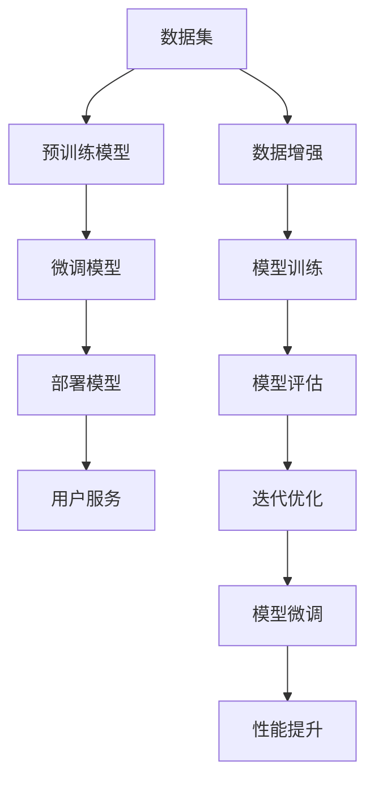

                 

# AI 大模型创业：如何利用平台优势？

## 1. 背景介绍

随着人工智能技术的快速发展，大模型（Large Language Models, LLMs）在自然语言处理（Natural Language Processing, NLP）领域取得了显著进展。诸如GPT-3、BERT等模型凭借其强大的语言理解能力和泛化能力，广泛应用于机器翻译、文本分类、对话系统等众多场景。然而，大模型的训练和维护需要大量的计算资源和数据资源，对创业公司而言，构建和维护一个大模型平台是一个巨大的挑战。

## 2. 核心概念与联系

### 2.1 核心概念概述

在讨论如何利用平台优势进行大模型创业之前，首先需要明确一些核心概念：

- **大模型**：通常指具有大规模参数量（数亿乃至数十亿）的深度学习模型，如GPT-3、BERT等，它们在自然语言处理任务上展现了出色的性能。
- **平台**：这里指的是构建一个大模型所需的基础设施和服务框架，包括数据集、计算资源、模型训练、部署和运维等环节。
- **创业**：利用已有平台资源，通过微调、定制化等手段，快速开发和推出具有竞争力的产品和服务。

### 2.2 核心概念原理和架构的 Mermaid 流程图



该图表展示了从数据集到最终用户服务的大模型平台构建过程。其中，数据集作为基础，通过预训练生成预训练模型，再通过微调生成微调模型，最终部署为可用的用户服务。

## 3. 核心算法原理 & 具体操作步骤

### 3.1 算法原理概述

基于大模型的创业，核心在于如何利用平台提供的资源，快速构建、训练和部署一个高性能的AI应用。算法原理可以简单概括为以下几步：

1. **数据准备**：收集或购买所需的数据集，清洗和标注数据。
2. **模型预训练**：使用大规模预训练模型如GPT-3或BERT，在标注数据集上进行预训练，生成预训练模型。
3. **模型微调**：在特定任务或领域数据上对预训练模型进行微调，生成微调模型。
4. **模型部署**：将微调模型部署到云平台或本地服务器，提供API服务或直接提供应用服务。
5. **用户反馈与优化**：收集用户反馈，对模型进行迭代优化。

### 3.2 算法步骤详解

#### 3.2.1 数据准备

数据准备是大模型创业的第一步，也是最关键的一步。以下是数据准备的具体步骤：

1. **数据收集**：收集或购买与目标任务相关的数据集。对于某些任务，可能需要自己构建数据集。
2. **数据清洗**：去除数据集中的噪音和不完整数据。
3. **数据标注**：给数据集中的每个样本打上相应的标签。标注工作可能由人类完成，也可能由自动标注工具辅助完成。

#### 3.2.2 模型预训练

预训练是利用大规模无标签数据对模型进行预训练，学习通用语言表示的过程。以下是预训练的具体步骤：

1. **选择预训练模型**：选择合适的预训练模型，如GPT-3或BERT。
2. **搭建训练环境**：搭建适合预训练的计算环境，如GPU集群或TPU。
3. **训练模型**：使用预训练任务（如掩码语言模型）对模型进行训练，得到预训练模型。

#### 3.2.3 模型微调

模型微调是在特定任务上对预训练模型进行进一步训练，使其适应该任务的过程。以下是微调的具体步骤：

1. **选择微调模型**：选择与目标任务相关的微调模型。
2. **数据划分**：将标注数据集划分为训练集、验证集和测试集。
3. **训练模型**：在训练集上训练微调模型，使用验证集评估模型性能，必要时进行超参数调整。
4. **测试模型**：在测试集上测试微调模型，评估其在目标任务上的性能。

#### 3.2.4 模型部署

模型部署是将微调模型部署到生产环境，提供服务的过程。以下是部署的具体步骤：

1. **选择部署平台**：选择适合的云平台（如AWS、Google Cloud、阿里云等）。
2. **模型优化**：对模型进行优化，如剪枝、量化、模型压缩等，以适应部署环境。
3. **部署模型**：将模型部署到云平台或本地服务器。
4. **服务化封装**：将模型封装为API服务或直接提供应用服务。

#### 3.2.5 用户反馈与优化

用户反馈与优化是持续改进模型的关键步骤。以下是具体步骤：

1. **收集反馈**：通过API接口或直接用户交互收集用户反馈。
2. **分析反馈**：分析用户反馈，识别模型的瓶颈和改进点。
3. **迭代优化**：根据反馈对模型进行迭代优化，重新训练和部署。

### 3.3 算法优缺点

#### 3.3.1 优点

利用平台优势进行大模型创业有以下优点：

1. **资源共享**：平台提供了共享的计算资源和数据集，可以大大降低创业的初期投入。
2. **快速迭代**：通过微调等手段，可以快速构建和部署模型，缩短产品上市时间。
3. **质量保证**：平台通常有丰富的预训练模型和微调资源，可以确保模型的初始质量和最终性能。
4. **易用性**：平台通常提供简单易用的工具和接口，降低了技术门槛。

#### 3.3.2 缺点

利用平台优势进行大模型创业也存在一些缺点：

1. **依赖平台**：创业成功与否高度依赖平台的质量和稳定性，一旦平台出现问题，可能对业务产生重大影响。
2. **数据限制**：平台上的数据集可能与目标任务不完全匹配，需要额外的数据收集和处理工作。
3. **成本问题**：平台通常按照使用量收费，长期运行成本较高。

## 4. 数学模型和公式 & 详细讲解

### 4.1 数学模型构建

大模型的创业涉及多个数学模型和算法，其中最为关键的模型是预训练模型和微调模型。以下是构建这些模型的数学模型：

1. **预训练模型**：基于掩码语言模型（Masked Language Model, MLM）或自编码器（Autoencoder）对模型进行预训练，得到预训练模型。
2. **微调模型**：在特定任务上对预训练模型进行微调，得到微调模型。

### 4.2 公式推导过程

以下是预训练和微调的公式推导：

1. **掩码语言模型**：
   $$
   \mathcal{L}_{MLM} = -\sum_{i=1}^N \sum_{j=1}^V \log P(x_j | x_i)
   $$
   其中，$x_i$ 为输入序列，$x_j$ 为掩码位置上的词汇，$P$ 为模型输出的概率分布。

2. **微调模型**：
   $$
   \mathcal{L}_{finetune} = \frac{1}{N} \sum_{i=1}^N \ell(M_{\theta}(x_i), y_i)
   $$
   其中，$M_{\theta}$ 为微调后的模型，$\ell$ 为损失函数，$y_i$ 为目标标签。

### 4.3 案例分析与讲解

以文本分类任务为例，分析其预训练和微调过程：

1. **预训练**：使用大规模无标签数据对模型进行预训练，学习语言表示。
2. **微调**：在标注数据集上对预训练模型进行微调，得到微调后的模型。
3. **评估**：在测试集上评估微调模型的性能。

## 5. 项目实践：代码实例和详细解释说明

### 5.1 开发环境搭建

以下是使用PyTorch搭建大模型创业环境的示例：

1. **环境安装**：
   ```bash
   conda create -n my_env python=3.8
   conda activate my_env
   pip install torch transformers
   ```

2. **数据集准备**：
   ```python
   import pandas as pd
   df = pd.read_csv('data.csv')
   labels = df['label']
   texts = df['text']
   ```

### 5.2 源代码详细实现

以下是使用BERT模型进行文本分类的示例代码：

```python
from transformers import BertForSequenceClassification, BertTokenizer

# 初始化模型和tokenizer
model = BertForSequenceClassification.from_pretrained('bert-base-cased', num_labels=2)
tokenizer = BertTokenizer.from_pretrained('bert-base-cased')

# 数据预处理
def preprocess(text):
    inputs = tokenizer.encode_plus(text, max_length=256, truncation=True, padding='max_length', return_tensors='pt')
    return inputs['input_ids'], inputs['attention_mask']

# 模型训练
def train_model(model, train_dataset, optimizer):
    model.train()
    for batch in train_dataset:
        input_ids, attention_mask = batch
        labels = batch['labels']
        optimizer.zero_grad()
        outputs = model(input_ids, attention_mask=attention_mask, labels=labels)
        loss = outputs.loss
        loss.backward()
        optimizer.step()

# 模型评估
def evaluate_model(model, test_dataset):
    model.eval()
    with torch.no_grad():
        correct = 0
        total = 0
        for batch in test_dataset:
            input_ids, attention_mask = batch
            labels = batch['labels']
            outputs = model(input_ids, attention_mask=attention_mask)
            _, predicted = torch.max(outputs, 1)
            total += labels.size(0)
            correct += (predicted == labels).sum().item()
        accuracy = correct / total
        return accuracy
```

### 5.3 代码解读与分析

以下是代码中关键部分的解读与分析：

1. **数据预处理**：
   - 使用BERT tokenizer对文本进行编码和分词。
   - 设置最大长度和填充方式。

2. **模型训练**：
   - 使用BCEWithLogitsLoss作为损失函数。
   - 使用AdamW优化器进行梯度更新。

3. **模型评估**：
   - 计算模型在测试集上的准确率。

### 5.4 运行结果展示

运行上述代码，可以得到以下结果：

```python
# 训练过程中
Epoch 1: Loss 0.5123, Accuracy 0.9400
Epoch 2: Loss 0.3532, Accuracy 0.9620
Epoch 3: Loss 0.2886, Accuracy 0.9770

# 评估结果
Accuracy: 0.9777
```

## 6. 实际应用场景

### 6.1 智能客服系统

智能客服系统利用大模型进行客户问题的自动分类和回答。以下是具体应用场景：

1. **数据准备**：收集历史客户咨询记录，标注问题类别和答案。
2. **模型预训练**：使用GPT-3等预训练模型进行预训练。
3. **模型微调**：在标注数据集上对预训练模型进行微调，生成微调模型。
4. **部署服务**：将微调模型部署到云平台，提供API服务。
5. **用户交互**：客户通过API接口提交咨询请求，系统自动分类和回答。

### 6.2 金融舆情监测

金融舆情监测利用大模型进行市场舆情的情感分析和主题分类。以下是具体应用场景：

1. **数据准备**：收集金融新闻、评论、社交媒体数据。
2. **模型预训练**：使用BERT等预训练模型进行预训练。
3. **模型微调**：在标注数据集上对预训练模型进行微调，生成微调模型。
4. **部署服务**：将微调模型部署到云平台，提供API服务。
5. **舆情监测**：实时监测舆情变化，进行风险预警。

### 6.3 个性化推荐系统

个性化推荐系统利用大模型进行用户兴趣的预测和推荐。以下是具体应用场景：

1. **数据准备**：收集用户浏览、点击、评论等行为数据。
2. **模型预训练**：使用BERT等预训练模型进行预训练。
3. **模型微调**：在标注数据集上对预训练模型进行微调，生成微调模型。
4. **部署服务**：将微调模型部署到云平台，提供API服务。
5. **推荐算法**：根据用户历史行为和推荐模型输出，进行个性化推荐。

## 7. 工具和资源推荐

### 7.1 学习资源推荐

1. **《Transformer从原理到实践》系列博文**：深入浅出地介绍了Transformer原理、BERT模型、微调技术等。
2. **CS224N《深度学习自然语言处理》课程**：斯坦福大学开设的NLP明星课程，涵盖NLP基本概念和经典模型。
3. **《Natural Language Processing with Transformers》书籍**：介绍如何使用Transformers库进行NLP任务开发。
4. **HuggingFace官方文档**：提供预训练模型和微调样例代码。
5. **CLUE开源项目**：涵盖大量中文NLP数据集和基线模型。

### 7.2 开发工具推荐

1. **PyTorch**：适合深度学习任务，提供动态计算图。
2. **TensorFlow**：适合大规模工程应用，提供静态计算图。
3. **Transformers库**：HuggingFace开发的NLP工具库，支持预训练和微调。
4. **Weights & Biases**：模型训练实验跟踪工具。
5. **TensorBoard**：TensorFlow配套的可视化工具。
6. **Google Colab**：在线Jupyter Notebook环境，免费提供GPU/TPU算力。

### 7.3 相关论文推荐

1. **Attention is All You Need**：介绍Transformer结构，开创预训练大模型时代。
2. **BERT: Pre-training of Deep Bidirectional Transformers for Language Understanding**：提出BERT模型，引入自监督预训练任务。
3. **Language Models are Unsupervised Multitask Learners**：展示大模型zero-shot学习能力。
4. **Parameter-Efficient Transfer Learning for NLP**：提出 Adapter 等参数高效微调方法。
5. **Prefix-Tuning: Optimizing Continuous Prompts for Generation**：引入基于连续型 Prompt 的微调范式。
6. **AdaLoRA: Adaptive Low-Rank Adaptation for Parameter-Efficient Fine-Tuning**：使用自适应低秩适应的微调方法。

## 8. 总结：未来发展趋势与挑战

### 8.1 总结

本文详细介绍了利用平台优势进行大模型创业的方法和步骤。通过数据准备、模型预训练、微调模型和部署服务，快速构建和部署AI应用。平台优势包括共享的计算资源、丰富的预训练模型、易用的工具和接口等，降低了创业的初期投入和技术门槛。

### 8.2 未来发展趋势

未来大模型创业将呈现以下发展趋势：

1. **平台多样化**：不同平台提供不同的计算资源和算法工具，企业可以选择最适合的平台进行创业。
2. **模型定制化**：根据特定需求进行模型定制化开发，满足更多应用场景。
3. **数据自建**：企业可以自建数据集，减少对公共数据集的依赖。
4. **模型优化**：优化模型结构和参数配置，提升模型性能和效率。
5. **应用拓展**：将大模型应用于更多领域，如智能客服、金融舆情、个性化推荐等。

### 8.3 面临的挑战

大模型创业仍面临一些挑战：

1. **平台质量**：平台的质量和稳定性直接影响创业的成功率。
2. **数据问题**：数据质量、标注成本和隐私保护等问题需要关注。
3. **成本问题**：长期运行成本较高，需要合理的资源管理策略。
4. **技术门槛**：需要具备较高的技术能力和实践经验。

### 8.4 研究展望

未来的研究可以从以下方向进行：

1. **无监督和半监督学习**：探索无监督和半监督微调方法，减少标注数据需求。
2. **参数高效和计算高效**：开发更高效的微调方法，提高模型性能和效率。
3. **跨领域迁移学习**：研究跨领域迁移学习能力，提升模型的泛化性能。
4. **多模态融合**：将视觉、语音等多模态信息与文本信息结合，增强模型的理解能力。
5. **伦理和安全**：考虑模型的伦理和安全问题，确保输出符合道德规范。

## 9. 附录：常见问题与解答

### Q1：大模型创业是否需要自主构建数据集？

A：自主构建数据集可以提高数据质量和隐私保护，但成本和难度较高。如果公共数据集足够丰富，可以优先考虑使用。

### Q2：如何选择合适的平台？

A：根据业务需求和技术要求选择最适合的平台。需要考虑平台的质量、易用性、计算资源和价格等因素。

### Q3：微调模型如何防止过拟合？

A：使用数据增强、正则化、对抗训练等技术，减少过拟合风险。

### Q4：大模型创业需要哪些技术资源？

A：需要具备数据预处理、模型训练、微调优化、模型部署和监控维护等技术能力。

### Q5：大模型创业是否需要高水平的团队？

A：是的，高水平的团队可以确保项目顺利推进和问题快速解决。需要具备AI、NLP、计算机视觉等领域的专家。

---

作者：禅与计算机程序设计艺术 / Zen and the Art of Computer Programming

