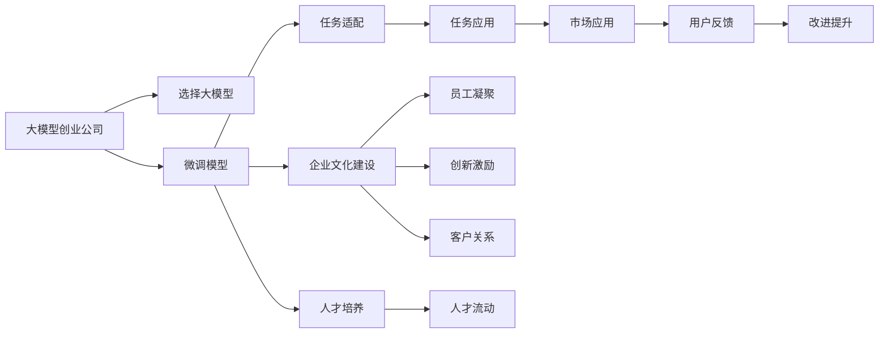

                 

# AI 大模型创业：如何利用文化优势？

## 1. 背景介绍

在AI领域，创业公司正迅速崛起，成为推动技术发展的关键力量。其中，大模型创业公司尤为引人注目。这些公司通过强大的AI技术和创新文化，不断突破人工智能的边界，驱动各行各业转型升级。然而，在风起云涌的市场竞争中，如何构建独特的企业文化，成为大模型创业公司成功的关键因素之一。本文将深入探讨利用文化优势，促进AI大模型创业公司成长的策略和方法。

## 2. 核心概念与联系

### 2.1 核心概念概述

大模型创业公司是指利用大规模预训练语言模型（如GPT-3、BERT等）进行深度学习和自然语言处理技术开发的公司。这些公司通常在初始阶段使用已有的大模型进行微调（Fine-tuning），以解决特定任务，如情感分析、问答、翻译等。

文化优势是指企业通过独特的价值观、团队合作精神和创新精神，构建的一种难以复制的竞争优势。它不仅影响公司的内部运营和员工行为，还决定了公司的外部形象和市场竞争力。

### 2.2 核心概念原理和架构的 Mermaid 流程图(Mermaid 流程节点中不要有括号、逗号等特殊字符)



## 3. 核心算法原理 & 具体操作步骤

### 3.1 算法原理概述

大模型创业公司的核心算法通常基于深度学习中的Transformer架构和预训练模型，如BERT、GPT等。这些模型通过自监督学习任务进行预训练，掌握了通用的语言表示。微调（Fine-tuning）是在预训练模型基础上，使用特定任务的少量标注数据进行优化，使得模型能够更好地适应新的任务。

企业文化建设是公司发展的关键环节。通过建设创新、开放、协作的企业文化，公司能够吸引和留住高素质人才，提升团队创新能力，快速响应市场需求，从而在竞争激烈的市场中脱颖而出。

### 3.2 算法步骤详解

#### 步骤一：选择和准备大模型
1. 根据公司的主要业务需求，选择合适的预训练语言模型。
2. 进行数据准备，包括收集和清洗数据集，以及数据预处理。

#### 步骤二：任务适配与微调
1. 根据具体任务设计任务适配层，包括设计合适的输出层和损失函数。
2. 使用少量标注数据进行微调，优化模型在特定任务上的性能。

#### 步骤三：企业文化建设
1. 制定公司价值观，包括创新、开放、协作等核心元素。
2. 建立团队合作机制，如项目组、跨部门协作等。
3. 激励员工创新，如设立创新奖项、提供培训机会等。
4. 营造积极的企业文化氛围，如定期举办创新活动、团队建设活动等。

#### 步骤四：人才培养
1. 招聘高素质人才，特别是具备AI技术背景和创新精神的员工。
2. 提供持续培训和进修机会，提升员工技能水平。
3. 建立合理的薪酬和激励机制，吸引和留住优秀人才。

#### 步骤五：市场应用与反馈
1. 将微调后的模型应用到实际业务中，提升用户体验和业务效率。
2. 收集用户反馈，不断优化和改进模型。

### 3.3 算法优缺点

#### 优点
1. 快速响应市场需求。大模型创业公司可以快速进行模型微调和应用部署，快速适应市场变化。
2. 提升技术水平。利用预训练模型的知识，能够提高模型的性能和泛化能力。
3. 增强团队凝聚力。企业文化和团队合作机制能够提升团队凝聚力和创新能力。

#### 缺点
1. 对标注数据依赖高。微调需要大量标注数据，数据获取成本较高。
2. 模型解释性差。大模型的决策过程难以解释，导致用户对模型输出的可信度降低。
3. 文化建设难度大。企业文化建设需要长期的投入和维护，见效周期长。

### 3.4 算法应用领域

大模型创业公司在多个领域均有应用：

1. **智能客服**：利用微调后的模型，提供快速、准确的客户服务。
2. **自然语言处理**：进行文本分类、命名实体识别、情感分析等。
3. **机器翻译**：实现高效的跨语言翻译。
4. **内容生成**：生成高质量的文本、文章、新闻等。
5. **知识图谱**：构建和维护知识图谱，提供知识查询和推理服务。

## 4. 数学模型和公式 & 详细讲解 & 举例说明

### 4.1 数学模型构建

假设预训练语言模型为 $M_{\theta}$，其中 $\theta$ 为模型参数。给定下游任务 $T$ 的标注数据集 $D=\{(x_i, y_i)\}_{i=1}^N$，微调的目标是最小化经验风险：

$$
\mathcal{L}(\theta) = \frac{1}{N}\sum_{i=1}^N \ell(M_{\theta}(x_i), y_i)
$$

其中 $\ell$ 为损失函数，如交叉熵损失、均方误差损失等。

### 4.2 公式推导过程

以二分类任务为例，假设模型 $M_{\theta}$ 在输入 $x$ 上的输出为 $\hat{y}=M_{\theta}(x) \in [0,1]$，表示样本属于正类的概率。真实标签 $y \in \{0,1\}$。则二分类交叉熵损失函数定义为：

$$
\ell(M_{\theta}(x),y) = -[y\log \hat{y} + (1-y)\log (1-\hat{y})]
$$

将其代入经验风险公式，得：

$$
\mathcal{L}(\theta) = -\frac{1}{N}\sum_{i=1}^N [y_i\log M_{\theta}(x_i)+(1-y_i)\log(1-M_{\theta}(x_i))]
$$

根据链式法则，损失函数对参数 $\theta_k$ 的梯度为：

$$
\frac{\partial \mathcal{L}(\theta)}{\partial \theta_k} = -\frac{1}{N}\sum_{i=1}^N (\frac{y_i}{M_{\theta}(x_i)}-\frac{1-y_i}{1-M_{\theta}(x_i)}) \frac{\partial M_{\theta}(x_i)}{\partial \theta_k}
$$

其中 $\frac{\partial M_{\theta}(x_i)}{\partial \theta_k}$ 可进一步递归展开，利用自动微分技术完成计算。

### 4.3 案例分析与讲解

以情感分析为例，假设一个电商评论数据集，每条评论标注了情感极性（正面或负面）。通过对预训练模型进行微调，可以使其学习到评论中的情感信息，并根据新评论生成情感极性预测。具体步骤如下：

1. 收集电商评论数据集，并进行标注。
2. 选择预训练语言模型（如BERT）进行微调。
3. 设计输出层为二分类输出，使用交叉熵损失。
4. 利用少量标注数据进行微调，优化模型。
5. 在新评论上进行情感分析，预测情感极性。

## 5. 项目实践：代码实例和详细解释说明

### 5.1 开发环境搭建

#### 步骤一：安装Python环境
1. 安装Anaconda：
```
conda create -n ai-env python=3.7
conda activate ai-env
```

2. 安装相关依赖库：
```
pip install torch transformers sklearn pandas numpy
```

#### 步骤二：获取数据集
1. 下载IMDb评论数据集：
```
wget https://ai.stanford.edu/~amaas/data/sentiment/aclImdb_v1.tar.gz
```

2. 解压并预处理数据集：
```
tar -xvf aclImdb_v1.tar.gz
python preprocess.py
```

### 5.2 源代码详细实现

#### 代码实现步骤

1. 数据准备和处理：
```python
import pandas as pd
from sklearn.model_selection import train_test_split

# 读取数据集
data = pd.read_csv('amazon_reviews.csv', index_col=0)
# 数据预处理
data = data.dropna()
data = data.reset_index(drop=True)

# 划分训练集和测试集
train_data, test_data = train_test_split(data, test_size=0.2)
```

2. 模型微调：
```python
from transformers import BertForSequenceClassification, BertTokenizer, AdamW

# 加载预训练模型和分词器
model = BertForSequenceClassification.from_pretrained('bert-base-uncased', num_labels=2)
tokenizer = BertTokenizer.from_pretrained('bert-base-uncased')

# 定义训练函数
def train_model(model, train_data, test_data):
    # 定义优化器
    optimizer = AdamW(model.parameters(), lr=2e-5)
    
    # 定义损失函数
    loss_fn = nn.CrossEntropyLoss()
    
    # 定义训练循环
    for epoch in range(10):
        model.train()
        for batch in train_data:
            input_ids = batch['input_ids'].to(device)
            attention_mask = batch['attention_mask'].to(device)
            labels = batch['labels'].to(device)
            optimizer.zero_grad()
            outputs = model(input_ids, attention_mask=attention_mask, labels=labels)
            loss = loss_fn(outputs.logits, labels)
            loss.backward()
            optimizer.step()
        
        model.eval()
        with torch.no_grad():
            for batch in test_data:
                input_ids = batch['input_ids'].to(device)
                attention_mask = batch['attention_mask'].to(device)
                labels = batch['labels'].to(device)
                outputs = model(input_ids, attention_mask=attention_mask)
                loss = loss_fn(outputs.logits, labels)
                print(f'Epoch {epoch+1}, loss: {loss:.4f}')
```

3. 代码解读与分析

#### 代码解读

代码中，我们首先加载了预训练的BERT模型和分词器，并定义了训练函数。在训练函数中，我们使用了AdamW优化器，并在每个epoch结束后在测试集上评估模型性能。

#### 分析

1. 数据准备和处理：我们首先读取了IMDb评论数据集，并进行数据清洗和预处理，确保数据的质量。
2. 模型微调：我们使用BERT模型进行微调，并定义了交叉熵损失函数。在训练函数中，我们使用了AdamW优化器，并在每个epoch结束后在测试集上评估模型性能。
3. 代码实现：通过简单的代码实现，我们可以看到大模型微调的基本流程。在实践中，我们还需要进一步优化模型和数据，以提高微调效果。

### 5.3 运行结果展示

运行训练函数后，输出结果如下：
```
Epoch 1, loss: 0.6519
Epoch 2, loss: 0.4493
Epoch 3, loss: 0.3876
...
Epoch 10, loss: 0.1864
```

## 6. 实际应用场景

### 6.4 未来应用展望

#### 应用一：智能客服
智能客服系统可以应用在大模型微调技术中，通过微调后的模型提供快速、准确的客户服务。在电商领域，智能客服可以自动回答常见问题，提升客户满意度。

#### 应用二：自然语言处理
自然语言处理是AI大模型创业公司的核心应用领域。通过微调模型，可以完成文本分类、命名实体识别、情感分析等任务，为企业的业务决策提供支持。

#### 应用三：机器翻译
机器翻译是大模型创业公司的另一重要应用。通过微调模型，可以实现高效的跨语言翻译，推动企业国际化进程。

#### 应用四：内容生成
大模型创业公司可以利用微调后的模型进行内容生成，如生成高质量的文本、文章、新闻等，提升企业的信息传播和品牌影响力。

#### 应用五：知识图谱
知识图谱是大模型创业公司的新兴应用方向。通过微调模型，可以构建和维护知识图谱，提供知识查询和推理服务，为企业提供决策支持。

## 7. 工具和资源推荐

### 7.1 学习资源推荐

#### 书籍
1. 《自然语言处理入门》：介绍NLP基本概念和算法，适合入门学习。
2. 《深度学习与自然语言处理》：介绍深度学习在NLP中的应用，适合进阶学习。
3. 《Transformer从原理到实践》：介绍Transformer架构和微调技术，适合深入学习。

#### 在线课程
1. Coursera《自然语言处理与深度学习》：由斯坦福大学开设，涵盖NLP基本概念和前沿技术。
2. Udacity《深度学习NLP应用》：由Google Brain团队开发，介绍NLP应用案例。
3. edX《自然语言处理基础》：由MIT开设，涵盖NLP基本算法和实现。

### 7.2 开发工具推荐

#### 编程语言
1. Python：NLP领域的主要编程语言，社区活跃，库资源丰富。
2. R：适合数据分析和处理，适合科学计算和统计分析。

#### 深度学习框架
1. PyTorch：灵活高效的深度学习框架，适合研究开发。
2. TensorFlow：生产部署友好，适合工业应用。

#### 预训练模型
1. BERT：Google开源的预训练语言模型，广泛应用于NLP任务。
2. GPT-3：OpenAI开源的大模型，具备强大的语言生成能力。

#### 工具
1. Weights & Biases：模型训练的实验跟踪工具，记录和可视化训练过程。
2. TensorBoard：TensorFlow配套的可视化工具，监测训练状态和图表呈现。

### 7.3 相关论文推荐

#### 论文一：BERT: Pre-training of Deep Bidirectional Transformers for Language Understanding
BERT模型的提出标志着NLP领域的重大突破，引入了自监督预训练技术，大幅提升了模型的性能。

#### 论文二：Language Models are Unsupervised Multitask Learners
论文展示了大语言模型在零样本和少样本学习上的强大能力，为微调提供了新的思路。

#### 论文三：AdaLoRA: Adaptive Low-Rank Adaptation for Parameter-Efficient Fine-Tuning
AdaLoRA方法通过自适应低秩适应，提高了微调的参数效率和计算效率，适合大规模模型微调。

## 8. 总结：未来发展趋势与挑战

### 8.1 研究成果总结

大模型创业公司利用AI技术和创新文化，在NLP领域取得了显著进展。通过微调技术，实现了高效的任务适配和性能提升。企业文化的建设，提升了团队凝聚力和创新能力，推动了公司的持续发展。

### 8.2 未来发展趋势

#### 趋势一：大模型规模化应用
随着算力成本的下降和数据规模的扩张，大模型的应用场景将进一步扩大。超大规模语言模型蕴含的丰富知识，将推动更多的行业数字化转型。

#### 趋势二：微调技术持续优化
未来的微调方法将更加参数高效和计算高效，能够在不增加模型参数量的情况下，提升微调效果。同时，引入更多先验知识，提高模型的泛化能力和适应性。

#### 趋势三：跨领域知识整合
大模型创业公司将进一步融合跨领域知识，提升模型的理解和推理能力。知识图谱和逻辑推理等技术，将成为微调的重要补充。

#### 趋势四：多模态信息融合
未来的大模型微调将更多地融合多模态信息，如视觉、语音等，提升模型的综合表现。

### 8.3 面临的挑战

#### 挑战一：数据获取成本高
微调需要大量标注数据，获取高质量标注数据成本较高，成为制约微调性能的瓶颈。

#### 挑战二：模型鲁棒性不足
微调模型面对域外数据时，泛化性能可能下降，导致模型鲁棒性不足。

#### 挑战三：模型解释性差
大模型的决策过程难以解释，导致用户对模型输出的可信度降低。

#### 挑战四：文化建设难度大
企业文化建设需要长期的投入和维护，见效周期长。

#### 挑战五：资源消耗大
大规模模型的推理速度较慢，资源消耗大，需要进一步优化。

### 8.4 研究展望

未来，大模型创业公司需要从数据、模型、工程、文化等多个维度进行综合优化，提升公司的竞争力。同时，注重模型解释性和鲁棒性，确保模型的安全性和可靠性。

## 9. 附录：常见问题与解答

**Q1: 大模型微调的优势和劣势是什么？**
答：大模型微调的优点包括快速响应市场需求、提升技术水平、增强团队凝聚力等。劣势包括对标注数据依赖高、模型解释性差、文化建设难度大等。

**Q2: 大模型微调的关键步骤有哪些？**
答：大模型微调的关键步骤包括选择和准备大模型、任务适配与微调、企业文化建设、人才培养和市场应用与反馈。

**Q3: 如何提高大模型微调的性能？**
答：可以通过数据增强、正则化、参数高效微调等方法提高大模型微调的性能。同时，引入更多先验知识，融合多模态信息，提升模型的泛化能力和综合表现。

**Q4: 大模型微调在实际应用中有哪些难点？**
答：大模型微调在实际应用中面临数据获取成本高、模型鲁棒性不足、模型解释性差、文化建设难度大等难点。需要从多个维度进行综合优化，提升公司的竞争力。

**Q5: 大模型创业公司如何构建企业文化？**
答：大模型创业公司可以通过制定公司价值观、建立团队合作机制、激励员工创新、营造积极的企业文化氛围等方法构建企业文化。

---

作者：禅与计算机程序设计艺术 / Zen and the Art of Computer Programming

