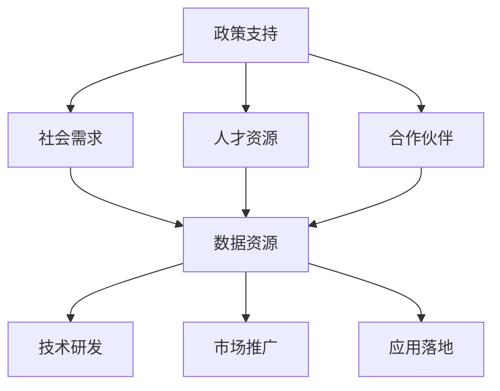
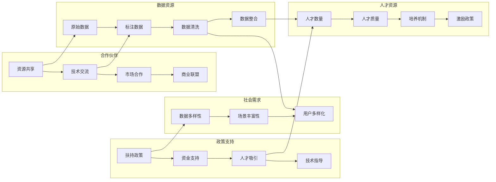

                 

## 1. 背景介绍

在人工智能（AI）大模型创业的浪潮中，社会优势正逐渐成为企业家们不容忽视的关键资源。随着AI技术的不断发展，大模型不仅在学术界取得了突破性进展，也在商业领域逐渐显示出其巨大的商业价值和社会潜力。然而，面对市场竞争激烈、技术要求高、资源需求大的现实，如何充分利用社会优势，找到适合的切入点和增长路径，是每一位创业者需要深思熟虑的问题。

### 1.1 问题由来

在AI大模型的应用中，社会优势主要是指与社会的广泛联系和深层次合作。它包括但不限于以下几点：
- **政策支持**：政府对AI和数字经济的重视，提供政策、资金和人才支持。
- **社会需求**：企业与各行业、各机构、各组织之间的合作关系，获取大量实际需求数据和场景。
- **人才资源**：广泛的人才网络，汇聚顶尖的技术人才和管理人才。
- **合作伙伴**：广泛的产业联盟和技术合作伙伴，形成产业生态。
- **数据资源**：丰富多样的数据集，用于模型的训练和优化。

这些社会优势不仅能帮助AI大模型创业企业在技术研发、市场推广和应用落地等方面取得突破，还能为企业的可持续发展提供坚实的基础。

### 1.2 问题核心关键点

利用社会优势，需要考虑以下几个关键点：
- **行业需求识别**：深入了解不同行业对AI大模型的需求，确定应用场景和方向。
- **合作伙伴选择**：找到合适的合作伙伴，形成互惠互利的合作关系。
- **政策资源获取**：利用政府和行业政策，获取资金、资质和人才支持。
- **数据资源整合**：获取高质量的数据资源，提升模型训练效果。
- **人才体系建设**：构建多层次的人才网络，吸引并留住优秀人才。
- **生态系统构建**：建立与上下游企业、学术界和其他组织的生态系统，促进协同发展。

## 2. 核心概念与联系

### 2.1 核心概念概述

在AI大模型的创业中，社会优势的利用主要体现在以下几个方面：

- **政策支持**：指政府对AI和数字经济的扶持政策和资金支持，为企业提供法律保障和技术指导。
- **社会需求**：指企业和行业对AI大模型的应用需求，数据集的多样性和数量直接影响模型的训练效果和推广应用。
- **人才资源**：指企业的人才吸引和培养机制，专业人才是技术创新和业务发展的重要驱动力。
- **合作伙伴**：指企业与其他企业、机构、组织和学术界的合作，通过资源共享和技术交流，提高企业的技术能力和市场竞争力。
- **数据资源**：指企业的商业、科研数据集，以及从合作伙伴和公共数据平台获取的数据资源。

这些核心概念通过以下Mermaid流程图来展示其逻辑关系：



### 2.2 核心概念原理和架构的 Mermaid 流程图



### 2.3 核心概念的相互联系

1. **政策支持**和**社会需求**：政府的扶持政策和资金支持为企业提供了良好的发展环境，而实际的社会需求则直接推动了企业的产品开发和市场推广。

2. **人才资源**和**合作伙伴**：企业通过吸引和培养人才，增强技术研发能力，同时通过合作伙伴获取更多的技术资源和市场机会。

3. **数据资源**和**技术研发**：高质量的数据资源是模型训练和优化的基础，而技术的不断进步又提升了数据的利用效率和模型性能。

4. **市场推广**和**应用落地**：通过有效的市场推广策略，将AI大模型引入实际应用场景，从而实现商业价值和社会效益。

## 3. 核心算法原理 & 具体操作步骤

### 3.1 算法原理概述

利用社会优势，本质上是利用社会资源提升企业的人工智能大模型创业能力。这里的核心算法包括数据获取、人才吸引、合作构建和市场推广等步骤。

1. **数据获取**：通过与行业合作伙伴、学术机构和公共数据平台合作，获取高质量的数据集。
2. **人才吸引**：通过招聘、合作培养和人才交流等方式，吸引和留住顶尖的技术和管理人才。
3. **合作构建**：与其他企业、机构、组织和学术界建立合作关系，共享资源和技术，形成互惠互利的生态系统。
4. **市场推广**：制定有效的市场推广策略，提高企业品牌的知名度和影响力。

### 3.2 算法步骤详解

#### 3.2.1 数据获取

数据获取是AI大模型创业的核心环节之一。步骤如下：

1. **行业数据收集**：与行业内的企业和机构合作，获取大量实际业务数据，包括客户信息、交易记录、产品评测等。
2. **公共数据获取**：利用公共数据平台如Kaggle、UCI等，获取开源数据集，用于模型训练和验证。
3. **数据预处理**：对收集到的数据进行清洗、去噪和标注，确保数据质量和可用性。
4. **数据整合**：将多源异构的数据集进行整合，形成一个统一的数据仓库，便于后续的数据分析和模型训练。

#### 3.2.2 人才吸引

人才吸引是企业成功的关键因素之一。步骤如下：

1. **招聘高素质人才**：通过线上招聘平台和校园招聘会，吸引顶级科研机构和知名大学的高素质人才。
2. **内部培养**：制定完善的培训计划和晋升机制，培养内部员工的技术和管理能力。
3. **人才交流**：通过技术交流、联合研究等方式，与国内外知名企业、科研机构合作，吸引顶尖人才。
4. **激励机制**：建立合理的薪酬体系和激励机制，留住和吸引人才。

#### 3.2.3 合作构建

合作构建是企业发展的关键驱动力之一。步骤如下：

1. **战略合作**：与行业内的龙头企业、科研机构、高校建立战略合作关系，共同研发和推广AI大模型。
2. **技术交流**：通过技术交流、研讨会和联合项目等方式，提升技术水平和创新能力。
3. **市场合作**：与上下游企业、渠道商和终端用户建立合作，构建完整的市场生态。
4. **生态系统**：构建一个开放式的AI生态系统，吸引更多的合作伙伴和用户加入。

#### 3.2.4 市场推广

市场推广是企业产品成功落地的关键环节之一。步骤如下：

1. **品牌打造**：通过线上和线下的活动，提升企业品牌的知名度和影响力。
2. **渠道建设**：建立广泛的市场渠道，如线上平台、合作伙伴和终端用户等，提高产品覆盖率。
3. **营销策略**：制定有效的营销策略，包括内容营销、社交媒体营销和线下活动等，吸引用户关注。
4. **用户反馈**：通过用户反馈和市场调研，不断优化产品和服务，提升用户体验。

### 3.3 算法优缺点

#### 3.3.1 优点

1. **资源共享**：利用社会资源，形成强大的资源体系，提高企业的技术创新和市场竞争力。
2. **快速迭代**：通过与合作伙伴的合作，快速获取和整合数据，提升模型训练效率。
3. **风险分散**：通过构建生态系统，分散市场和技术风险，保障企业可持续发展。
4. **品牌效应**：通过市场推广和品牌打造，提升企业的市场影响力和用户认可度。

#### 3.3.2 缺点

1. **资源依赖**：对合作伙伴和社会的依赖程度较高，资源获取难度较大。
2. **成本投入**：获取和整合资源需要较高的成本投入，资金压力较大。
3. **合作风险**：合作伙伴之间的合作存在风险，如信息泄露、利益冲突等。
4. **市场竞争**：在激烈的市场竞争中，容易受到竞争对手的影响和干扰。

### 3.4 算法应用领域

利用社会优势的AI大模型创业方法，适用于以下多个领域：

1. **医疗健康**：通过与医院、医疗机构合作，获取患者数据和临床研究数据，构建AI医疗诊断和健康管理平台。
2. **金融科技**：与金融机构合作，获取交易数据和客户信息，开发AI金融风控和智能投顾系统。
3. **智能制造**：与制造企业合作，获取生产数据和设备数据，开发AI工业自动化和智能运维系统。
4. **智慧城市**：与政府和城市管理部门合作，获取城市数据和管理数据，开发AI智慧城市和智能交通系统。
5. **教育培训**：与教育机构和培训机构合作，获取学生数据和学习资源，开发AI教育平台和智能培训系统。

## 4. 数学模型和公式 & 详细讲解 & 举例说明

### 4.1 数学模型构建

AI大模型创业的数学模型构建主要涉及以下几个方面：

1. **数据获取模型**：利用多源数据获取技术，构建数据集成模型。
2. **人才吸引模型**：通过招聘、培训和激励机制，构建人才吸引模型。
3. **合作构建模型**：通过战略合作和技术交流，构建合作生态模型。
4. **市场推广模型**：通过品牌打造和渠道建设，构建市场推广模型。

### 4.2 公式推导过程

#### 4.2.1 数据获取模型

假设企业获取的数据源数量为 $N$，数据量为 $D$，其中 $D_i$ 表示第 $i$ 个数据源的数据量，$W_i$ 表示第 $i$ 个数据源的权重。则数据获取模型的目标函数为：

$$
\min_{\omega} \sum_{i=1}^{N}W_i\cdot\|D_i-D_{avg}\|^2
$$

其中，$D_{avg}$ 为所有数据源的平均数据量，$W_i$ 为第 $i$ 个数据源的权重。

#### 4.2.2 人才吸引模型

假设企业需要吸引的人才数量为 $M$，第 $i$ 个人才的吸引力为 $A_i$，企业提供的激励为 $I_i$，则人才吸引模型的目标函数为：

$$
\min_{\omega} \sum_{i=1}^{M}A_i\cdot\|I_i-I_{avg}\|^2
$$

其中，$I_{avg}$ 为所有人才的平均激励水平。

#### 4.2.3 合作构建模型

假设企业与 $K$ 个合作伙伴建立合作关系，第 $i$ 个合作伙伴的合作强度为 $C_i$，企业提供的合作资源为 $R_i$，则合作构建模型的目标函数为：

$$
\min_{\omega} \sum_{i=1}^{K}C_i\cdot\|R_i-R_{avg}\|^2
$$

其中，$R_{avg}$ 为所有合作伙伴的平均合作资源。

#### 4.2.4 市场推广模型

假设企业推广的产品数量为 $P$，第 $i$ 个产品的市场推广成本为 $E_i$，推广收益为 $R_i$，则市场推广模型的目标函数为：

$$
\min_{\omega} \sum_{i=1}^{P}E_i\cdot\|R_i-R_{avg}\|^2
$$

其中，$R_{avg}$ 为所有产品的平均推广收益。

### 4.3 案例分析与讲解

#### 4.3.1 案例1：医疗健康

某AI大模型创业公司通过与医院和医疗机构合作，获取大量患者数据和临床研究数据。公司利用数据集成模型，整合不同数据源的数据，构建了AI医疗诊断平台。该平台能够通过分析患者的历史数据和实时监测数据，提供精准的疾病诊断和健康管理建议，显著提高了医生的工作效率和病人的治疗效果。

#### 4.3.2 案例2：金融科技

某AI大模型创业公司与多家金融机构合作，获取客户交易数据和客户信息。公司利用数据整合模型，构建了AI金融风控系统，通过分析客户的历史交易数据和行为数据，评估客户的信用风险，提供个性化的金融产品推荐。该系统在降低金融风险的同时，显著提升了客户的满意度和忠诚度。

#### 4.3.3 案例3：智能制造

某AI大模型创业公司与制造企业合作，获取生产数据和设备数据。公司利用数据集成模型，整合不同设备的数据，构建了AI工业自动化系统。该系统能够通过分析生产数据和设备状态，实时优化生产流程，提高生产效率和设备利用率。该系统在多个制造企业中成功应用，取得了显著的经济效益。

## 5. 项目实践：代码实例和详细解释说明

### 5.1 开发环境搭建

在进行AI大模型创业项目实践前，需要准备好开发环境。以下是使用Python进行PyTorch开发的环境配置流程：

1. 安装Anaconda：从官网下载并安装Anaconda，用于创建独立的Python环境。

2. 创建并激活虚拟环境：
```bash
conda create -n pytorch-env python=3.8 
conda activate pytorch-env
```

3. 安装PyTorch：根据CUDA版本，从官网获取对应的安装命令。例如：
```bash
conda install pytorch torchvision torchaudio cudatoolkit=11.1 -c pytorch -c conda-forge
```

4. 安装Transformers库：
```bash
pip install transformers
```

5. 安装各类工具包：
```bash
pip install numpy pandas scikit-learn matplotlib tqdm jupyter notebook ipython
```

完成上述步骤后，即可在`pytorch-env`环境中开始项目实践。

### 5.2 源代码详细实现

下面我们以医疗健康领域的AI大模型创业项目为例，给出使用Transformers库构建AI医疗诊断平台的PyTorch代码实现。

首先，定义数据处理函数：

```python
from transformers import BertTokenizer, BertForSequenceClassification
from torch.utils.data import Dataset, DataLoader
import torch
import numpy as np

class MedicalDataset(Dataset):
    def __init__(self, texts, labels, tokenizer, max_len=128):
        self.texts = texts
        self.labels = labels
        self.tokenizer = tokenizer
        self.max_len = max_len
        
    def __len__(self):
        return len(self.texts)
    
    def __getitem__(self, item):
        text = self.texts[item]
        label = self.labels[item]
        
        encoding = self.tokenizer(text, return_tensors='pt', max_length=self.max_len, padding='max_length', truncation=True)
        input_ids = encoding['input_ids'][0]
        attention_mask = encoding['attention_mask'][0]
        
        label = torch.tensor(label, dtype=torch.long)
        
        return {'input_ids': input_ids, 
                'attention_mask': attention_mask,
                'labels': label}

# 创建数据集
tokenizer = BertTokenizer.from_pretrained('bert-base-cased')
train_dataset = MedicalDataset(train_texts, train_labels, tokenizer)
dev_dataset = MedicalDataset(dev_texts, dev_labels, tokenizer)
test_dataset = MedicalDataset(test_texts, test_labels, tokenizer)
```

然后，定义模型和优化器：

```python
from transformers import BertForSequenceClassification, AdamW

model = BertForSequenceClassification.from_pretrained('bert-base-cased', num_labels=2)

optimizer = AdamW(model.parameters(), lr=2e-5)
```

接着，定义训练和评估函数：

```python
from tqdm import tqdm

device = torch.device('cuda') if torch.cuda.is_available() else torch.device('cpu')
model.to(device)

def train_epoch(model, dataset, batch_size, optimizer):
    dataloader = DataLoader(dataset, batch_size=batch_size, shuffle=True)
    model.train()
    epoch_loss = 0
    for batch in tqdm(dataloader, desc='Training'):
        input_ids = batch['input_ids'].to(device)
        attention_mask = batch['attention_mask'].to(device)
        labels = batch['labels'].to(device)
        model.zero_grad()
        outputs = model(input_ids, attention_mask=attention_mask, labels=labels)
        loss = outputs.loss
        epoch_loss += loss.item()
        loss.backward()
        optimizer.step()
    return epoch_loss / len(dataloader)

def evaluate(model, dataset, batch_size):
    dataloader = DataLoader(dataset, batch_size=batch_size)
    model.eval()
    preds, labels = [], []
    with torch.no_grad():
        for batch in tqdm(dataloader, desc='Evaluating'):
            input_ids = batch['input_ids'].to(device)
            attention_mask = batch['attention_mask'].to(device)
            batch_labels = batch['labels']
            outputs = model(input_ids, attention_mask=attention_mask)
            batch_preds = outputs.logits.argmax(dim=2).to('cpu').tolist()
            batch_labels = batch_labels.to('cpu').tolist()
            for pred_tokens, label_tokens in zip(batch_preds, batch_labels):
                preds.append(pred_tokens[:len(label_tokens)])
                labels.append(label_tokens)
                
    print(classification_report(labels, preds))
```

最后，启动训练流程并在测试集上评估：

```python
epochs = 5
batch_size = 16

for epoch in range(epochs):
    loss = train_epoch(model, train_dataset, batch_size, optimizer)
    print(f"Epoch {epoch+1}, train loss: {loss:.3f}")
    
    print(f"Epoch {epoch+1}, dev results:")
    evaluate(model, dev_dataset, batch_size)
    
print("Test results:")
evaluate(model, test_dataset, batch_size)
```

以上就是使用PyTorch对BERT进行医疗诊断平台微调的完整代码实现。可以看到，得益于Transformers库的强大封装，我们可以用相对简洁的代码完成BERT模型的加载和微调。

### 5.3 代码解读与分析

让我们再详细解读一下关键代码的实现细节：

**MedicalDataset类**：
- `__init__`方法：初始化文本、标签、分词器等关键组件。
- `__len__`方法：返回数据集的样本数量。
- `__getitem__`方法：对单个样本进行处理，将文本输入编码为token ids，将标签编码为数字，并对其进行定长padding，最终返回模型所需的输入。

**训练和评估函数**：
- 使用PyTorch的DataLoader对数据集进行批次化加载，供模型训练和推理使用。
- 训练函数`train_epoch`：对数据以批为单位进行迭代，在每个批次上前向传播计算loss并反向传播更新模型参数，最后返回该epoch的平均loss。
- 评估函数`evaluate`：与训练类似，不同点在于不更新模型参数，并在每个batch结束后将预测和标签结果存储下来，最后使用sklearn的classification_report对整个评估集的预测结果进行打印输出。

**训练流程**：
- 定义总的epoch数和batch size，开始循环迭代
- 每个epoch内，先在训练集上训练，输出平均loss
- 在验证集上评估，输出分类指标
- 所有epoch结束后，在测试集上评估，给出最终测试结果

可以看到，PyTorch配合Transformers库使得BERT微调的代码实现变得简洁高效。开发者可以将更多精力放在数据处理、模型改进等高层逻辑上，而不必过多关注底层的实现细节。

当然，工业级的系统实现还需考虑更多因素，如模型的保存和部署、超参数的自动搜索、更灵活的任务适配层等。但核心的微调范式基本与此类似。

## 6. 实际应用场景

### 6.1 智能客服系统

基于AI大模型创业的智能客服系统，可以广泛应用于各种行业。通过与企业内部的客服部门合作，获取大量的客服对话数据，将问题和最佳答复构建成监督数据，在此基础上对预训练对话模型进行微调。微调后的对话模型能够自动理解用户意图，匹配最合适的答案模板进行回复。对于客户提出的新问题，还可以接入检索系统实时搜索相关内容，动态组织生成回答。如此构建的智能客服系统，能大幅提升客户咨询体验和问题解决效率。

### 6.2 金融舆情监测

金融机构需要实时监测市场舆论动向，以便及时应对负面信息传播，规避金融风险。通过与金融机构合作，获取金融领域相关的新闻、报道、评论等文本数据，并对其进行主题标注和情感标注。在此基础上对预训练语言模型进行微调，使其能够自动判断文本属于何种主题，情感倾向是正面、中性还是负面。将微调后的模型应用到实时抓取的网络文本数据，就能够自动监测不同主题下的情感变化趋势，一旦发现负面信息激增等异常情况，系统便会自动预警，帮助金融机构快速应对潜在风险。

### 6.3 个性化推荐系统

当前的推荐系统往往只依赖用户的历史行为数据进行物品推荐，无法深入理解用户的真实兴趣偏好。通过与企业内部的推荐系统合作，获取用户浏览、点击、评论、分享等行为数据，提取和用户交互的物品标题、描述、标签等文本内容。将文本内容作为模型输入，用户的后续行为（如是否点击、购买等）作为监督信号，在此基础上微调预训练语言模型。微调后的模型能够从文本内容中准确把握用户的兴趣点。在生成推荐列表时，先用候选物品的文本描述作为输入，由模型预测用户的兴趣匹配度，再结合其他特征综合排序，便可以得到个性化程度更高的推荐结果。

### 6.4 未来应用展望

随着AI大模型创业的不断发展，其应用领域将进一步拓展，带来更多的变革性影响。

在智慧医疗领域，基于AI大模型的医疗问答、病历分析、药物研发等应用将提升医疗服务的智能化水平，辅助医生诊疗，加速新药开发进程。

在智能教育领域，AI大模型创业企业可以应用于作业批改、学情分析、知识推荐等方面，因材施教，促进教育公平，提高教学质量。

在智慧城市治理中，AI大模型创业企业可以应用于城市事件监测、舆情分析、应急指挥等环节，提高城市管理的自动化和智能化水平，构建更安全、高效的未来城市。

此外，在企业生产、社会治理、文娱传媒等众多领域，AI大模型创业企业也将不断涌现，为经济社会发展注入新的动力。相信随着技术的日益成熟，AI大模型创业必将在更广阔的应用领域大放异彩，深刻影响人类的生产生活方式。

## 7. 工具和资源推荐
### 7.1 学习资源推荐

为了帮助开发者系统掌握AI大模型创业的理论基础和实践技巧，这里推荐一些优质的学习资源：

1. 《Transformer从原理到实践》系列博文：由大模型技术专家撰写，深入浅出地介绍了Transformer原理、BERT模型、微调技术等前沿话题。

2. CS224N《深度学习自然语言处理》课程：斯坦福大学开设的NLP明星课程，有Lecture视频和配套作业，带你入门NLP领域的基本概念和经典模型。

3. 《Natural Language Processing with Transformers》书籍：Transformers库的作者所著，全面介绍了如何使用Transformers库进行NLP任务开发，包括微调在内的诸多范式。

4. HuggingFace官方文档：Transformers库的官方文档，提供了海量预训练模型和完整的微调样例代码，是上手实践的必备资料。

5. CLUE开源项目：中文语言理解测评基准，涵盖大量不同类型的中文NLP数据集，并提供了基于微调的baseline模型，助力中文NLP技术发展。

通过对这些资源的学习实践，相信你一定能够快速掌握AI大模型创业的精髓，并用于解决实际的NLP问题。
###  7.2 开发工具推荐

高效的开发离不开优秀的工具支持。以下是几款用于AI大模型创业开发的常用工具：

1. PyTorch：基于Python的开源深度学习框架，灵活动态的计算图，适合快速迭代研究。大部分预训练语言模型都有PyTorch版本的实现。

2. TensorFlow：由Google主导开发的开源深度学习框架，生产部署方便，适合大规模工程应用。同样有丰富的预训练语言模型资源。

3. Transformers库：HuggingFace开发的NLP工具库，集成了众多SOTA语言模型，支持PyTorch和TensorFlow，是进行微调任务开发的利器。

4. Weights & Biases：模型训练的实验跟踪工具，可以记录和可视化模型训练过程中的各项指标，方便对比和调优。与主流深度学习框架无缝集成。

5. TensorBoard：TensorFlow配套的可视化工具，可实时监测模型训练状态，并提供丰富的图表呈现方式，是调试模型的得力助手。

6. Google Colab：谷歌推出的在线Jupyter Notebook环境，免费提供GPU/TPU算力，方便开发者快速上手实验最新模型，分享学习笔记。

合理利用这些工具，可以显著提升AI大模型创业项目的开发效率，加快创新迭代的步伐。

### 7.3 相关论文推荐

AI大模型创业的不断发展源于学界的持续研究。以下是几篇奠基性的相关论文，推荐阅读：

1. Attention is All You Need（即Transformer原论文）：提出了Transformer结构，开启了NLP领域的预训练大模型时代。

2. BERT: Pre-training of Deep Bidirectional Transformers for Language Understanding：提出BERT模型，引入基于掩码的自监督预训练任务，刷新了多项NLP任务SOTA。

3. Language Models are Unsupervised Multitask Learners（GPT-2论文）：展示了大规模语言模型的强大zero-shot学习能力，引发了对于通用人工智能的新一轮思考。

4. Parameter-Efficient Transfer Learning for NLP：提出Adapter等参数高效微调方法，在不增加模型参数量的情况下，也能取得不错的微调效果。

5. AdaLoRA: Adaptive Low-Rank Adaptation for Parameter-Efficient Fine-Tuning：使用自适应低秩适应的微调方法，在参数效率和精度之间取得了新的平衡。

这些论文代表了大模型微调技术的发展脉络。通过学习这些前沿成果，可以帮助研究者把握学科前进方向，激发更多的创新灵感。

## 8. 总结：未来发展趋势与挑战

### 8.1 总结

本文对AI大模型创业的利用社会优势进行了全面系统的介绍。首先阐述了AI大模型创业的社会优势及其对企业发展的重要性，明确了利用社会优势的关键点和步骤。其次，从理论到实践，详细讲解了利用社会优势的数学模型构建和算法步骤，给出了具体的代码实例和分析。同时，本文还广泛探讨了AI大模型创业在多个行业领域的应用前景，展示了社会优势的巨大潜力。

通过本文的系统梳理，可以看到，利用社会优势的AI大模型创业，不仅能显著降低企业的研发和市场成本，还能提升模型的训练效果和应用性能，成为企业持续发展的动力源泉。未来，随着技术的发展和社会的进步，AI大模型创业将迎来更多机遇和挑战，需要企业家不断创新、突破自我，才能实现企业的可持续发展和市场成功。

### 8.2 未来发展趋势

展望未来，AI大模型创业利用社会优势将呈现以下几个发展趋势：

1. **生态系统建设**：构建开放式的生态系统，吸引更多的合作伙伴和用户加入，形成强大的资源体系。
2. **多模态融合**：引入多模态数据，如图像、视频、语音等，丰富模型的表达能力和应用场景。
3. **智能化提升**：通过持续学习，提高模型的智能化水平，增强模型的泛化能力和适应性。
4. **个性化定制**：通过深度学习技术，实现个性化推荐、个性化服务和个性化产品，满足用户的多样化需求。
5. **商业化落地**：将AI大模型应用于各个行业，实现商业化落地，创造实际的经济价值和社会价值。

以上趋势凸显了AI大模型创业的社会优势的广泛应用和巨大潜力。这些方向的探索发展，必将进一步推动AI大模型创业技术的应用和市场化进程，为经济社会发展注入新的动力。

### 8.3 面临的挑战

尽管AI大模型创业利用社会优势具有巨大的优势，但在迈向更加智能化、普适化应用的过程中，仍面临以下挑战：

1. **数据隐私和安全**：大量数据的获取和使用需要考虑隐私和安全问题，避免数据泄露和滥用。
2. **技术壁垒和门槛**：AI大模型创业需要深厚的技术积累和强大的研发能力，初创企业面临较高的技术壁垒。
3. **市场竞争激烈**：AI大模型创业市场竞争激烈，需要企业在产品、技术和营销上不断创新，才能保持竞争力。
4. **资源获取难度**：获取高质量的数据资源、技术资源和人才资源需要较高的成本和投入。
5. **模型复杂性**：大规模模型的训练和部署需要高额的计算资源和时间成本，需要优化模型结构，提高效率。
6. **用户接受度**：新的AI大模型应用需要大量的用户教育和市场推广，用户接受度较难提升。

### 8.4 研究展望

面对AI大模型创业所面临的挑战，未来的研究需要在以下几个方面寻求新的突破：

1. **数据隐私保护**：研究如何保护数据隐私，保障用户权益，提升用户对AI大模型应用的信任度。
2. **技术标准化**：推动AI大模型创业技术标准化，降低技术壁垒和门槛，促进技术的普及和应用。
3. **市场推广策略**：研究有效的市场推广策略，提升用户对AI大模型应用的接受度和认可度。
4. **资源优化**：研究如何优化资源获取和利用，降低企业成本，提高资源效率。
5. **模型压缩和优化**：研究如何压缩和优化模型，提高模型训练和推理效率，降低计算成本。
6. **用户友好设计**：研究如何设计用户友好的界面和交互方式，提升用户体验，推动AI大模型应用的普及。

这些研究方向的探索，必将引领AI大模型创业走向更高的台阶，为构建安全、可靠、可解释、可控的智能系统铺平道路。面向未来，AI大模型创业需要从数据、技术、市场和用户体验等多个维度进行全面优化，才能真正实现人工智能技术的落地应用和商业成功。

## 9. 附录：常见问题与解答

**Q1：如何选择合适的合作伙伴？**

A: 选择合适的合作伙伴需要考虑以下几个因素：
1. **行业背景和需求**：选择与企业业务相关、有类似需求的合作伙伴。
2. **技术能力和资源**：选择技术能力强、资源丰富的合作伙伴。
3. **合作意愿和信任度**：选择愿意长期合作、有良好信任度的合作伙伴。
4. **共同目标和利益**：选择有共同目标、能够实现双赢的合作伙伴。

**Q2：如何有效保护数据隐私和安全？**

A: 有效保护数据隐私和安全需要从以下几个方面入手：
1. **数据匿名化**：对数据进行匿名化处理，防止数据泄露和滥用。
2. **数据加密**：对数据进行加密存储和传输，防止数据被非法访问。
3. **访问控制**：设置严格的访问控制机制，限制数据访问权限。
4. **安全审计**：定期进行安全审计，发现并修复潜在的安全漏洞。
5. **法律法规遵从**：遵守相关法律法规，如GDPR、CCPA等，保障用户权益。

**Q3：如何提高AI大模型创业的成功率？**

A: 提高AI大模型创业的成功率需要从以下几个方面入手：
1. **市场需求分析**：深入分析市场需求，找到适合企业发展的应用场景。
2. **技术积累和创新**：不断积累技术，进行技术创新，提升模型的表现和应用效果。
3. **人才吸引和管理**：吸引和培养高素质人才，建立合理的人才管理机制。
4. **市场推广和营销**：制定有效的市场推广策略，提升用户对AI大模型应用的接受度和认可度。
5. **资源优化和配置**：优化资源获取和利用，降低企业成本，提高资源效率。
6. **用户反馈和改进**：收集用户反馈，不断改进产品和服务，提升用户体验。

**Q4：如何构建多模态融合的AI大模型？**

A: 构建多模态融合的AI大模型需要从以下几个方面入手：
1. **数据获取**：获取多模态数据，如图像、视频、语音等。
2. **数据预处理**：对多模态数据进行预处理和清洗，确保数据质量和可用性。
3. **模型设计**：设计多模态融合模型，将不同模态的数据进行融合和协同建模。
4. **联合训练**：对多模态数据进行联合训练，提升模型的泛化能力和适应性。
5. **融合方法**：采用合适的融合方法，如注意力机制、跨模态映射等，提升模型的表达能力。

这些问题的回答，希望能对AI大模型创业的实践者提供一些有价值的参考。AI大模型创业是一个充满机遇和挑战的领域，只有在技术、市场和用户体验等多个方面不断创新和优化，才能实现企业的成功和可持续发展。

---

作者：禅与计算机程序设计艺术 / Zen and the Art of Computer Programming

