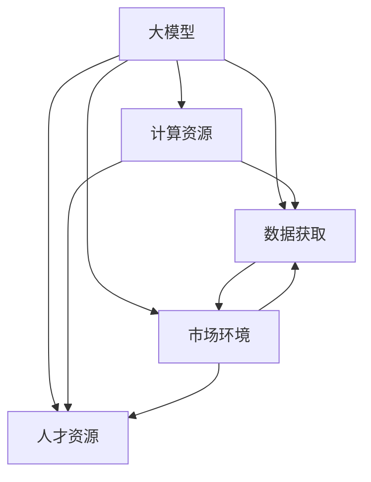

                 

# AI 大模型创业：如何利用社会优势？

## 1. 背景介绍

### 1.1 问题由来

随着人工智能（AI）技术的快速发展，大模型（如GPT-3、BERT等）在各个领域的应用越来越广泛，从自然语言处理（NLP）到图像识别，再到游戏AI，大模型的能力已触及各行各业的方方面面。然而，尽管大模型性能强大，但在实际应用中，往往需要大规模的训练数据和强大的计算资源，这对创业公司来说是一个不小的挑战。

### 1.2 问题核心关键点

利用社会优势（Social Advantage），即通过社会资源、市场环境、数据资源等方式降低创业成本，是AI大模型创业的关键。社会优势可以分为以下几个方面：

1. **数据资源的获取**：高质量的大规模数据是训练大模型的基础，创业公司可以通过与科研机构、行业协会、大型企业等合作获取数据。
2. **计算资源的获取**：训练大模型需要高性能的GPU/TPU等计算资源，创业公司可以通过云计算平台、政府补贴、企业合作等方式获取计算资源。
3. **人才资源的获取**：AI大模型需要跨学科的高端人才，创业公司可以通过与高校、科研机构、技术社区等合作获取人才资源。
4. **市场环境的适应**：创业公司需要适应快速变化的市场环境，寻找有潜力的应用场景，并在技术上不断突破。

## 2. 核心概念与联系

### 2.1 核心概念概述

在AI大模型创业中，利用社会优势是至关重要的。以下是几个核心概念及其联系的介绍：

- **大模型（Large Model）**：指使用大规模数据集进行训练，具有强大表现能力的人工智能模型。
- **数据获取（Data Acquisition）**：指通过各种方式获取高质量、大规模的数据资源。
- **计算资源（Computational Resources）**：指训练大模型所需的高性能计算硬件和软件环境。
- **人才资源（Talent Resources）**：指具有跨学科知识背景的高端AI人才。
- **市场环境（Market Environment）**：指创业公司所处的外部市场环境，包括行业发展趋势、用户需求、竞争格局等。

这些核心概念之间的关系可以通过以下Mermaid流程图来展示：



这个流程图展示了大模型创业过程中数据、计算、人才、市场之间的相互作用关系。

## 3. 核心算法原理 & 具体操作步骤

### 3.1 算法原理概述

AI大模型创业的核心算法原理是通过利用社会优势，降低创业成本，提高模型性能。具体而言，可以从以下几个方面入手：

1. **数据获取**：与科研机构、行业协会、大型企业合作，获取高质量的数据资源。
2. **计算资源**：通过云计算平台、政府补贴、企业合作等方式获取高性能计算资源。
3. **人才资源**：通过招聘、培训、合作等方式获取具有跨学科知识背景的高端AI人才。
4. **市场环境**：分析市场趋势，寻找有潜力的应用场景，并在技术上不断突破。

### 3.2 算法步骤详解

1. **数据获取**
   - **合作获取**：与科研机构、行业协会、大型企业合作，获取高质量的数据资源。
   - **数据交换**：通过数据交换协议，获取其他公司的数据资源。
   - **众包获取**：利用众包平台，获取用户生成内容（User Generated Content, UGC）数据。

2. **计算资源**
   - **云计算平台**：使用AWS、Google Cloud、阿里云等云计算平台获取计算资源。
   - **政府补贴**：申请政府提供的AI计算资源补贴。
   - **企业合作**：与大型企业合作，共享计算资源。

3. **人才资源**
   - **招聘**：在人才市场中招聘具有跨学科背景的高端AI人才。
   - **培训**：通过内部培训和外部合作，提高现有团队的技术能力。
   - **合作**：与高校、科研机构合作，获取高端AI人才。

4. **市场环境**
   - **市场调研**：通过市场调研，了解行业发展趋势和用户需求。
   - **应用场景**：寻找有潜力的应用场景，如医疗、金融、教育等。
   - **技术突破**：在技术上进行不断突破，提升模型性能。

### 3.3 算法优缺点

**优点**：

- **降低成本**：通过利用社会优势，降低创业成本，提高模型性能。
- **快速迭代**：通过获取高质量数据和计算资源，可以加快模型迭代速度。
- **人才优势**：通过获取高端AI人才，提高团队技术水平。

**缺点**：

- **数据获取困难**：高质量数据获取难度大，需要与多方合作。
- **计算资源昂贵**：高性能计算资源成本高，需要持续投入。
- **人才资源稀缺**：具有跨学科背景的高端AI人才稀缺，需要持续招聘和培训。

### 3.4 算法应用领域

AI大模型创业技术在多个领域都有广泛应用，例如：

- **自然语言处理（NLP）**：如聊天机器人、文本生成、情感分析等。
- **图像识别**：如图像分类、目标检测、图像生成等。
- **医疗**：如医疗影像分析、智能诊断等。
- **金融**：如风险评估、股票预测、反欺诈等。
- **教育**：如智能辅导、个性化推荐等。
- **自动驾驶**：如自动驾驶车辆、智能交通等。

## 4. 数学模型和公式 & 详细讲解  
### 4.1 数学模型构建

大模型创业中的数学模型构建需要考虑多个因素，包括数据获取、计算资源、人才资源和市场环境。以下是数学模型构建的概述：

- **数据模型**：定义数据获取和数据预处理的数学模型。
- **计算模型**：定义计算资源的分配和管理模型。
- **人才模型**：定义人才招聘和培训的数学模型。
- **市场模型**：定义市场调研和应用场景选择的数学模型。

### 4.2 公式推导过程

1. **数据模型**
   - 数据获取量 $D$：$D = \sum_{i=1}^{n} d_i$
   - 数据获取成本 $C$：$C = \sum_{i=1}^{n} c_i$

2. **计算模型**
   - 计算资源需求 $R$：$R = \sum_{i=1}^{m} r_i$
   - 计算成本 $S$：$S = \sum_{i=1}^{m} s_i$

3. **人才模型**
   - 人才招聘成本 $H$：$H = \sum_{i=1}^{k} h_i$
   - 人才培训成本 $T$：$T = \sum_{i=1}^{k} t_i$

4. **市场模型**
   - 市场调研成本 $M$：$M = \sum_{i=1}^{p} m_i$
   - 应用场景选择 $A$：$A = \sum_{i=1}^{q} a_i$

### 4.3 案例分析与讲解

以一个AI大模型创业项目为例，分析数据获取、计算资源、人才资源和市场环境的影响。

假设项目需要获取1TB的数据资源，成本为$C = 100万元$。通过与科研机构合作，获取1/3的数据，成本为$c_1 = 50万元$；通过众包平台获取1/3的数据，成本为$c_2 = 20万元$；自行购买数据，成本为$c_3 = 30万元$。

计算资源需求为$R = 10个TPU，成本为S = 500万元$。通过云计算平台获取5个TPU，成本为$s_1 = 200万元$；通过政府补贴获取3个TPU，成本为$s_2 = 50万元$；与大型企业合作获取2个TPU，成本为$s_3 = 100万元$。

人才资源需求为$K = 50人，招聘成本为H = 500万元，培训成本为T = 200万元$。

市场调研成本为$M = 100万元，应用场景选择成本为A = 50万元。

通过以上计算，可以得出整个项目的成本为$C_{total} = C + S + H + M + A = 1250万元$。

## 5. 项目实践：代码实例和详细解释说明

### 5.1 开发环境搭建

在进行AI大模型创业项目开发前，需要先搭建好开发环境。以下是使用Python进行TensorFlow开发的开发环境配置流程：

1. 安装Anaconda：从官网下载并安装Anaconda，用于创建独立的Python环境。

2. 创建并激活虚拟环境：
```bash
conda create -n tensorflow-env python=3.8 
conda activate tensorflow-env
```

3. 安装TensorFlow：根据CUDA版本，从官网获取对应的安装命令。例如：
```bash
conda install tensorflow -c tensorflow -c conda-forge
```

4. 安装各类工具包：
```bash
pip install numpy pandas scikit-learn matplotlib tqdm jupyter notebook ipython
```

完成上述步骤后，即可在`tensorflow-env`环境中开始AI大模型创业项目的开发。

### 5.2 源代码详细实现

以下是使用TensorFlow进行AI大模型创业项目的PyTorch代码实现。

```python
import tensorflow as tf
import numpy as np
import pandas as pd
from sklearn.model_selection import train_test_split

# 数据加载
data = pd.read_csv('data.csv')
X = data.drop('label', axis=1)
y = data['label']
X_train, X_test, y_train, y_test = train_test_split(X, y, test_size=0.2, random_state=42)

# 模型定义
model = tf.keras.Sequential([
    tf.keras.layers.Dense(64, activation='relu', input_shape=(X.shape[1],)),
    tf.keras.layers.Dense(32, activation='relu'),
    tf.keras.layers.Dense(1, activation='sigmoid')
])

# 模型编译
model.compile(optimizer='adam', loss='binary_crossentropy', metrics=['accuracy'])

# 模型训练
model.fit(X_train, y_train, epochs=10, batch_size=32, validation_data=(X_test, y_test))

# 模型评估
loss, acc = model.evaluate(X_test, y_test)
print(f'Test loss: {loss:.4f}')
print(f'Test accuracy: {acc:.4f}')
```

### 5.3 代码解读与分析

让我们再详细解读一下关键代码的实现细节：

**数据加载**：
- 使用Pandas加载CSV格式的数据集，并使用`train_test_split`将数据集划分为训练集和测试集。

**模型定义**：
- 使用TensorFlow的Sequential模型定义，包含两个隐藏层和一个输出层。
- 隐藏层使用ReLU激活函数，输出层使用Sigmoid激活函数，适用于二分类问题。

**模型编译**：
- 使用Adam优化器和二元交叉熵损失函数进行模型编译。

**模型训练**：
- 在训练集上使用10个epoch，32个样本批量训练，并在测试集上验证模型性能。

**模型评估**：
- 使用测试集评估模型性能，输出损失和准确率。

## 6. 实际应用场景

### 6.1 智能客服系统

基于AI大模型的智能客服系统可以帮助企业提升客户服务体验。传统客服系统需要大量人力，响应速度慢且一致性差，而智能客服系统可以7x24小时不间断服务，快速响应客户咨询，用自然流畅的语言解答各类常见问题。

通过数据获取、计算资源和人才资源的有效利用，智能客服系统可以显著提升客户咨询体验和问题解决效率。例如，企业可以与多个客户合作，收集大量的客服对话记录，并使用GPU资源进行模型训练，最终在生产环境中部署智能客服模型。

### 6.2 金融舆情监测

金融机构需要实时监测市场舆论动向，以便及时应对负面信息传播，规避金融风险。传统的人工监测方式成本高、效率低，难以应对网络时代海量信息爆发的挑战。基于AI大模型的金融舆情监测系统可以自动判断文本属于何种主题，情感倾向是正面、中性还是负面。

通过利用数据获取、计算资源和人才资源，金融舆情监测系统可以实时抓取网络文本数据，并自动监测不同主题下的情感变化趋势。一旦发现负面信息激增等异常情况，系统便会自动预警，帮助金融机构快速应对潜在风险。

### 6.3 个性化推荐系统

当前的推荐系统往往只依赖用户的历史行为数据进行物品推荐，无法深入理解用户的真实兴趣偏好。基于AI大模型的个性化推荐系统可以更好地挖掘用户行为背后的语义信息，从而提供更精准、多样的推荐内容。

通过数据获取、计算资源和人才资源的有效利用，个性化推荐系统可以实时抓取用户浏览、点击、评论、分享等行为数据，并使用GPU资源进行模型训练，最终在生产环境中部署个性化推荐模型。

### 6.4 未来应用展望

随着AI大模型创业技术的不断发展，未来AI大模型将广泛应用于各个领域，为各行各业带来变革性影响。

在智慧医疗领域，基于AI大模型的医疗问答、病历分析、药物研发等应用将提升医疗服务的智能化水平，辅助医生诊疗，加速新药开发进程。

在智能教育领域，AI大模型可以应用于作业批改、学情分析、知识推荐等方面，因材施教，促进教育公平，提高教学质量。

在智慧城市治理中，AI大模型可以应用于城市事件监测、舆情分析、应急指挥等环节，提高城市管理的自动化和智能化水平，构建更安全、高效的未来城市。

此外，在企业生产、社会治理、文娱传媒等众多领域，AI大模型也将不断涌现，为经济社会发展注入新的动力。

## 7. 工具和资源推荐

### 7.1 学习资源推荐

为了帮助开发者系统掌握AI大模型创业的理论基础和实践技巧，这里推荐一些优质的学习资源：

1. **《深度学习》课程**：斯坦福大学开设的深度学习课程，全面介绍了深度学习的理论和实践，包括AI大模型创业中的数据获取、计算资源、人才资源和市场环境等内容。

2. **《TensorFlow官方文档》**：TensorFlow官方文档，提供了丰富的API和教程，帮助开发者快速上手TensorFlow，进行AI大模型创业项目的开发。

3. **《Python深度学习》书籍**：深度学习领域的经典书籍，涵盖深度学习的基础理论和实践技巧，适合AI大模型创业的初学者阅读。

4. **Kaggle**：数据科学竞赛平台，提供大量高质量的数据集和开源项目，帮助开发者获取数据资源，提升技能水平。

5. **GitHub**：代码托管平台，提供丰富的开源项目和工具库，帮助开发者获取计算资源、人才资源和市场环境等方面的支持。

通过对这些资源的学习实践，相信你一定能够快速掌握AI大模型创业的核心技术和方法，并用于解决实际的AI应用问题。

### 7.2 开发工具推荐

高效的开发离不开优秀的工具支持。以下是几款用于AI大模型创业开发的常用工具：

1. **Jupyter Notebook**：开源的Python笔记本环境，支持Python、R、Scala等语言，适合数据处理、模型训练和报告撰写。

2. **PyCharm**：专业的Python IDE，提供了丰富的开发工具和插件，帮助开发者高效进行AI大模型创业项目的开发。

3. **TensorFlow Extended (TFX)**：TensorFlow的扩展框架，提供了数据管道、模型部署等组件，适合AI大模型创业项目的管理和部署。

4. **Docker**：容器化平台，可以将AI大模型创业项目打包成镜像，方便在不同环境中部署和运行。

5. **Kubernetes**：容器编排平台，可以自动化管理多个容器的生命周期，提升AI大模型创业项目的可扩展性和可维护性。

合理利用这些工具，可以显著提升AI大模型创业项目的开发效率，加快创新迭代的步伐。

### 7.3 相关论文推荐

AI大模型创业技术的发展源于学界的持续研究。以下是几篇奠基性的相关论文，推荐阅读：

1. **Attention is All You Need**：提出了Transformer结构，开启了NLP领域的预训练大模型时代。

2. **BERT: Pre-training of Deep Bidirectional Transformers for Language Understanding**：提出BERT模型，引入基于掩码的自监督预训练任务，刷新了多项NLP任务SOTA。

3. **Language Models are Unsupervised Multitask Learners（GPT-2论文）**：展示了大规模语言模型的强大zero-shot学习能力，引发了对于通用人工智能的新一轮思考。

4. **Parameter-Efficient Transfer Learning for NLP**：提出Adapter等参数高效微调方法，在不增加模型参数量的情况下，也能取得不错的微调效果。

5. **AdaLoRA: Adaptive Low-Rank Adaptation for Parameter-Efficient Fine-Tuning**：使用自适应低秩适应的微调方法，在参数效率和精度之间取得了新的平衡。

这些论文代表了大模型创业技术的发展脉络。通过学习这些前沿成果，可以帮助研究者把握学科前进方向，激发更多的创新灵感。

## 8. 总结：未来发展趋势与挑战

### 8.1 总结

本文对AI大模型创业中利用社会优势的方法进行了全面系统的介绍。首先阐述了AI大模型创业的社会优势及其重要性，明确了在数据获取、计算资源、人才资源和市场环境等方面获取优势的关键。其次，从原理到实践，详细讲解了AI大模型创业的数学模型和操作步骤，给出了具体的代码实现和分析。同时，本文还广泛探讨了AI大模型创业在各个领域的应用前景，展示了其巨大的潜力。最后，本文精选了AI大模型创业的相关学习资源和开发工具，力求为读者提供全方位的技术指引。

通过本文的系统梳理，可以看到，AI大模型创业利用社会优势的方法是实现创业成功的关键。这一方法不仅降低了创业成本，提升了模型性能，还能实现快速迭代和市场适应，为AI大模型创业带来了广阔的前景。

### 8.2 未来发展趋势

展望未来，AI大模型创业利用社会优势将呈现以下几个发展趋势：

1. **数据资源的丰富化**：随着数据的积累和技术的进步，数据资源的获取将更加容易，数据的多样性和质量将进一步提升。
2. **计算资源的普及化**：云计算平台的发展和政府补贴的增加，高性能计算资源的获取将更加便捷，计算成本将大幅降低。
3. **人才资源的国际化**：全球化的人才流动和技术合作，高端AI人才的获取将更加多元，人才结构将更加均衡。
4. **市场环境的动态化**：AI大模型创业需要适应快速变化的市场环境，寻找有潜力的应用场景，并在技术上不断突破。

以上趋势凸显了AI大模型创业利用社会优势的广阔前景。这些方向的探索发展，必将进一步提升AI大模型创业的成功率，为AI大模型落地应用提供更多的可能性。

### 8.3 面临的挑战

尽管AI大模型创业利用社会优势取得了显著成效，但在迈向更加智能化、普适化应用的过程中，仍面临诸多挑战：

1. **数据获取难度大**：高质量数据获取难度大，需要与多方合作，耗费时间和资源。
2. **计算资源昂贵**：高性能计算资源成本高，需要持续投入，增加创业成本。
3. **人才资源稀缺**：具有跨学科背景的高端AI人才稀缺，需要持续招聘和培训。
4. **市场环境变化快**：市场环境变化快，需要快速适应和调整，增加创业风险。

### 8.4 研究展望

面对AI大模型创业利用社会优势所面临的挑战，未来的研究需要在以下几个方面寻求新的突破：

1. **探索无监督和半监督学习**：摆脱对大规模标注数据的依赖，利用自监督学习、主动学习等无监督和半监督范式，最大限度利用非结构化数据，实现更加灵活高效的创业。
2. **研究参数高效和计算高效的微调范式**：开发更加参数高效的微调方法，在固定大部分预训练参数的情况下，只更新极少量的任务相关参数。同时优化微调模型的计算图，减少前向传播和反向传播的资源消耗，实现更加轻量级、实时性的部署。
3. **融合因果和对比学习范式**：通过引入因果推断和对比学习思想，增强AI大模型创业模型的建立稳定因果关系的能力，学习更加普适、鲁棒的语言表征，从而提升模型泛化性和抗干扰能力。
4. **引入更多先验知识**：将符号化的先验知识，如知识图谱、逻辑规则等，与神经网络模型进行巧妙融合，引导AI大模型创业过程学习更准确、合理的语言模型。同时加强不同模态数据的整合，实现视觉、语音等多模态信息与文本信息的协同建模。
5. **结合因果分析和博弈论工具**：将因果分析方法引入AI大模型创业模型，识别出模型决策的关键特征，增强输出解释的因果性和逻辑性。借助博弈论工具刻画人机交互过程，主动探索并规避模型的脆弱点，提高系统稳定性。
6. **纳入伦理道德约束**：在模型训练目标中引入伦理导向的评估指标，过滤和惩罚有偏见、有害的输出倾向。同时加强人工干预和审核，建立模型行为的监管机制，确保输出符合人类价值观和伦理道德。

这些研究方向的探索，必将引领AI大模型创业技术迈向更高的台阶，为构建安全、可靠、可解释、可控的智能系统铺平道路。面向未来，AI大模型创业利用社会优势还需要与其他人工智能技术进行更深入的融合，如知识表示、因果推理、强化学习等，多路径协同发力，共同推动自然语言理解和智能交互系统的进步。只有勇于创新、敢于突破，才能不断拓展AI大模型创业的边界，让智能技术更好地造福人类社会。

## 9. 附录：常见问题与解答

**Q1：AI大模型创业需要哪些关键资源？**

A: AI大模型创业需要以下关键资源：

1. **数据资源**：高质量、大规模的数据资源，可以通过与科研机构、行业协会、大型企业等合作获取。
2. **计算资源**：高性能的GPU/TPU等计算资源，可以通过云计算平台、政府补贴、企业合作等方式获取。
3. **人才资源**：具有跨学科背景的高端AI人才，可以通过招聘、培训、合作等方式获取。
4. **市场环境**：了解行业发展趋势和用户需求，寻找有潜力的应用场景。

**Q2：如何降低AI大模型创业的计算资源成本？**

A: 降低AI大模型创业的计算资源成本，可以从以下几个方面入手：

1. **利用云计算平台**：使用AWS、Google Cloud、阿里云等云计算平台获取计算资源，按需计费，降低成本。
2. **申请政府补贴**：申请政府提供的AI计算资源补贴，减轻成本负担。
3. **企业合作**：与大型企业合作，共享计算资源，降低成本。
4. **优化模型结构**：通过参数高效微调、模型压缩等技术，减少计算资源消耗，降低成本。

**Q3：如何获取高质量的数据资源？**

A: 获取高质量的数据资源，可以从以下几个方面入手：

1. **合作获取**：与科研机构、行业协会、大型企业合作，获取高质量的数据资源。
2. **数据交换**：通过数据交换协议，获取其他公司的数据资源。
3. **众包获取**：利用众包平台，获取用户生成内容（UGC）数据。

**Q4：AI大模型创业需要哪些关键技能？**

A: AI大模型创业需要以下关键技能：

1. **数据处理技能**：数据清洗、数据预处理、数据增强等技能。
2. **模型开发技能**：深度学习模型的定义、训练、优化等技能。
3. **算法优化技能**：模型压缩、参数高效微调、对抗训练等技能。
4. **项目管理技能**：项目规划、资源管理、团队协作等技能。
5. **市场分析技能**：行业分析、用户需求分析、应用场景选择等技能。

**Q5：如何提升AI大模型创业的模型性能？**

A: 提升AI大模型创业的模型性能，可以从以下几个方面入手：

1. **数据增强**：通过回译、近义替换等方式扩充训练集，提升模型泛化能力。
2. **正则化技术**：使用L2正则、Dropout、Early Stopping等避免过拟合。
3. **参数高效微调**：只调整少量参数(如Adapter、Prefix等)，减小过拟合风险。
4. **对抗训练**：引入对抗样本，提高模型鲁棒性。
5. **多模型集成**：训练多个模型，取平均输出，抑制过拟合。

这些方法需要根据具体任务和数据特点进行灵活组合，才能最大限度地发挥AI大模型创业的优势。

---

作者：禅与计算机程序设计艺术 / Zen and the Art of Computer Programming

