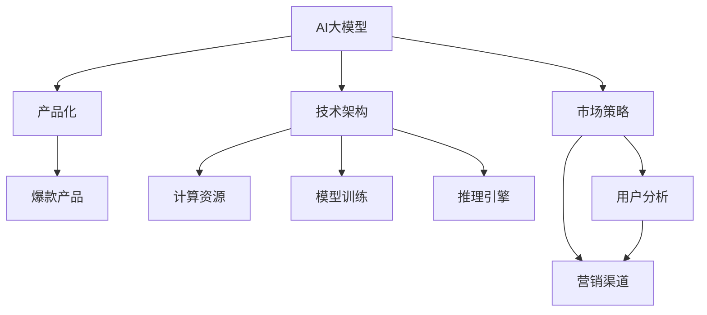

                 

# AI 大模型创业：如何打造爆款产品？

> 关键词：AI大模型, 创业, 产品, 爆款, 技术, 市场, 应用, 模型优化, 数据策略, 商业化

## 1. 背景介绍

在人工智能(AI)领域，大模型正成为驱动行业发展的核心动力。这些模型基于大规模数据训练，具备强大的泛化能力和多模态学习能力，被广泛应用于自然语言处理(NLP)、计算机视觉(CV)、语音识别(SR)等多个领域。然而，面对庞大的市场需求和竞争，如何从众多AI大模型中脱颖而出，打造爆款产品，成为创业者和从业者的重要课题。本文将从技术、市场和商业化三个维度，详细探讨如何构建并成功推出AI大模型产品。

## 2. 核心概念与联系

### 2.1 核心概念概述

为更好地理解AI大模型创业的本质，我们首先明确几个关键概念：

- **AI大模型**：指基于大规模数据训练的通用AI模型，如BERT、GPT-3等，具备强大的语言、图像、声音等通用知识表示能力。
- **产品化**：将AI技术转化为具有实际应用价值的商业产品和服务。
- **爆款产品**：指在市场上有极高知名度和用户接受度，具有显著商业价值和市场影响力，并能够持续迭代升级的产品。
- **商业化**：将技术产品转化为具有盈利能力的商业模式，包括但不限于市场推广、客户服务、收入模式等。
- **技术架构**：指支撑AI大模型产品的技术框架和组件，包括数据存储、计算资源、模型训练和推理等。
- **市场策略**：指利用市场调研、用户需求分析和竞争情报等手段，制定有效的市场营销策略。

这些概念之间的联系通过以下Mermaid流程图来展示：



这个流程图展示了AI大模型从技术到市场再到产品化的过程：

1. AI大模型在技术架构的支持下进行训练和推理。
2. 技术架构包括计算资源、存储系统和模型引擎等基础组件。
3. 市场策略和用户分析指导产品的设计和推广。
4. 最终通过爆款产品实现技术价值和商业价值的双赢。

## 3. 核心算法原理 & 具体操作步骤

### 3.1 算法原理概述

AI大模型的产品化，本质上是将先进的AI算法转化为具有商业价值的产品和服务的过程。核心算法原理主要包括：

- **模型训练**：使用大规模标注数据对AI大模型进行微调，优化模型的泛化能力和任务适应性。
- **模型部署**：将训练好的模型部署到生产环境，通过API或SDK等方式提供服务。
- **用户交互设计**：设计直观易用的产品界面和交互流程，提升用户体验。
- **数据策略**：收集、清洗和标注数据，确保模型训练和推理的数据质量。

### 3.2 算法步骤详解

#### 步骤一：数据收集与准备
1. **数据收集**：通过网络爬虫、合作伙伴接口等方式，收集大量数据。
2. **数据清洗**：去重、格式化、规范化，去除噪音和错误数据。
3. **数据标注**：为数据添加标签，确保其标注质量和一致性。

#### 步骤二：模型训练与优化
1. **模型选择**：选择适合的AI大模型，如BERT、GPT等。
2. **参数调整**：根据业务需求调整模型参数，如隐藏层数、学习率、批量大小等。
3. **模型微调**：在少量标注数据上对模型进行微调，提升模型精度。
4. **模型评估**：在验证集上评估模型性能，调整模型参数，直到达到预期效果。

#### 步骤三：产品设计
1. **界面设计**：设计直观易用的界面，便于用户使用。
2. **交互设计**：设计友好的交互流程，提升用户体验。
3. **文档编写**：编写详细的产品文档和用户手册，指导用户使用。

#### 步骤四：模型部署与迭代
1. **模型部署**：将训练好的模型部署到生产环境，提供API或SDK接口。
2. **性能监控**：监控模型性能和系统运行状态，及时发现和解决问题。
3. **版本迭代**：根据用户反馈和市场变化，持续更新模型和产品功能。

### 3.3 算法优缺点

**优点**：

- 高泛化能力：基于大模型训练的产品具有较强的泛化能力，可以适应多种应用场景。
- 低开发成本：利用现有大模型技术，减少开发和训练成本。
- 高用户接受度：大模型产品在学术界和工业界广受好评，有较高的市场认可度。

**缺点**：

- 高计算资源需求：大模型训练和推理需要大量计算资源，对硬件要求较高。
- 数据依赖性强：大模型对数据质量要求高，依赖大量标注数据。
- 技术复杂度高：涉及数据工程、模型训练、产品设计等多个环节，技术门槛较高。

### 3.4 算法应用领域

AI大模型产品化在多个领域具有广泛应用，例如：

- **自然语言处理(NLP)**：文本分类、情感分析、机器翻译、问答系统等。
- **计算机视觉(CV)**：图像识别、人脸识别、目标检测、图像生成等。
- **语音识别(SR)**：语音转文本、语音识别、说话人识别等。
- **推荐系统**：个性化推荐、协同过滤、内容推荐等。
- **智能客服**：智能问答、对话系统、自动回复等。
- **医疗健康**：疾病诊断、健康监测、个性化诊疗等。

以上应用场景只是冰山一角，随着AI技术的不断发展，AI大模型产品化的应用领域将更加广泛和深入。

## 4. 数学模型和公式 & 详细讲解 & 举例说明

### 4.1 数学模型构建

假设我们正在构建一个基于BERT模型的文本分类产品，其数学模型可以表示为：

$$
P(y|x; \theta) = \frac{e^{z(x;\theta)}}{\sum_{i=1}^{C}e^{z(x;\theta_i)}}
$$

其中，$y$为分类标签，$x$为输入文本，$z(x;\theta)$为BERT模型输出的分类表示，$\theta$为模型参数，$C$为分类数目。

### 4.2 公式推导过程

1. **特征提取**：输入文本通过BERT模型转化为向量表示$z(x;\theta)$。
2. **分类计算**：利用softmax函数将分类表示转化为概率分布。
3. **预测输出**：选择概率最大的分类作为预测结果。

### 4.3 案例分析与讲解

以基于BERT的情感分析为例，其训练过程如下：

1. **数据准备**：收集标注的情感文本数据集，划分为训练集、验证集和测试集。
2. **模型选择**：选择预训练的BERT模型。
3. **参数调整**：设置学习率、批量大小等超参数。
4. **模型训练**：在训练集上训练模型，每epoch更新一次参数。
5. **模型评估**：在验证集上评估模型性能，选择最佳模型。
6. **模型预测**：在测试集上使用模型进行情感分类预测。

## 5. 项目实践：代码实例和详细解释说明

### 5.1 开发环境搭建

- **环境准备**：安装Python、PyTorch、TensorFlow等深度学习框架，配置好GPU环境。
- **数据准备**：准备训练集、验证集和测试集，确保数据质量。
- **模型选择**：选择预训练的BERT模型。
- **环境部署**：将模型部署到云端或本地服务器。

### 5.2 源代码详细实现

```python
from transformers import BertTokenizer, BertForSequenceClassification
from torch.utils.data import DataLoader, Dataset
import torch

class MyDataset(Dataset):
    def __init__(self, data, tokenizer):
        self.data = data
        self.tokenizer = tokenizer
        
    def __len__(self):
        return len(self.data)
    
    def __getitem__(self, index):
        text = self.data[index]['text']
        label = self.data[index]['label']
        
        encoding = self.tokenizer(text, truncation=True, padding='max_length', max_length=128, return_tensors='pt')
        input_ids = encoding['input_ids']
        attention_mask = encoding['attention_mask']
        label = torch.tensor(label, dtype=torch.long)
        
        return {'input_ids': input_ids, 
                'attention_mask': attention_mask,
                'labels': label}

tokenizer = BertTokenizer.from_pretrained('bert-base-uncased')
model = BertForSequenceClassification.from_pretrained('bert-base-uncased', num_labels=2)

# 加载数据
train_dataset = MyDataset(train_data, tokenizer)
val_dataset = MyDataset(val_data, tokenizer)
test_dataset = MyDataset(test_data, tokenizer)

# 定义模型训练函数
def train_epoch(model, data_loader, optimizer):
    model.train()
    for batch in data_loader:
        input_ids = batch['input_ids'].to(device)
        attention_mask = batch['attention_mask'].to(device)
        labels = batch['labels'].to(device)
        model.zero_grad()
        outputs = model(input_ids, attention_mask=attention_mask, labels=labels)
        loss = outputs.loss
        loss.backward()
        optimizer.step()
        
# 定义模型评估函数
def evaluate(model, data_loader):
    model.eval()
    total_correct = 0
    total_pred = 0
    for batch in data_loader:
        input_ids = batch['input_ids'].to(device)
        attention_mask = batch['attention_mask'].to(device)
        labels = batch['labels'].to(device)
        with torch.no_grad():
            outputs = model(input_ids, attention_mask=attention_mask)
            logits = outputs.logits
            total_correct += torch.sum(torch.argmax(logits, dim=1) == labels).item()
            total_pred += logits.size(0)
    return total_correct / total_pred

# 训练模型
device = torch.device('cuda') if torch.cuda.is_available() else torch.device('cpu')
model.to(device)
optimizer = torch.optim.Adam(model.parameters(), lr=2e-5)
for epoch in range(10):
    train_epoch(model, train_loader, optimizer)
    acc = evaluate(model, val_loader)
    print(f'Epoch {epoch+1}, Validation Accuracy: {acc:.3f}')
```

### 5.3 代码解读与分析

该代码实现了基于BERT模型的情感分析任务。首先，我们定义了一个自定义的`MyDataset`类，用于处理文本数据的加载和预处理。然后，我们选择了预训练的BERT模型，并定义了训练和评估函数。在训练函数中，我们使用了PyTorch的自动微分功能和优化器，实现了模型的训练。在评估函数中，我们计算了模型在验证集上的准确率。最后，我们训练了模型，并在验证集上评估了其性能。

## 6. 实际应用场景

### 6.1 智能客服

智能客服系统可以基于大模型技术构建。用户通过自然语言输入，系统自动理解和回答常见问题，大大提升客户咨询体验和响应速度。例如，保险公司可以通过智能客服系统，实时回答客户关于理赔流程、理赔金额等问题，提升服务效率。

### 6.2 医疗健康

基于大模型的医疗问答系统可以显著提升医生的诊疗效率。用户通过输入症状和病史，系统自动提供可能的诊断建议和治疗方案，辅助医生进行快速诊断。例如，医院可以通过智能问诊系统，实时回答患者的健康问题，减轻医生的工作负担。

### 6.3 金融服务

大模型可以用于构建智能投顾系统，提供个性化的投资建议和理财方案。用户通过输入个人财务信息和投资偏好，系统自动生成投资建议，帮助用户优化资产配置。例如，银行可以通过智能投顾系统，为客户提供个性化的理财建议，提升用户体验。

### 6.4 未来应用展望

随着AI大模型技术的不断进步，其在更多领域的应用前景将更加广阔。例如：

- **自动驾驶**：基于大模型的自动驾驶系统，可以提升行车安全和用户体验。
- **智能制造**：基于大模型的智能制造系统，可以优化生产流程和提高产品质量。
- **智慧城市**：基于大模型的智慧城市系统，可以实现智能交通、智能安防等功能，提升城市管理水平。

未来，AI大模型产品化将成为各行各业数字化转型的重要工具，为人类社会带来更多便利和效率提升。

## 7. 工具和资源推荐

### 7.1 学习资源推荐

- **《深度学习》书籍**：由Yoshua Bengio等撰写，全面介绍了深度学习的基本概念和应用。
- **《自然语言处理入门》课程**：斯坦福大学开设的NLP入门课程，介绍了NLP的基本技术和应用。
- **Hugging Face官方文档**：提供丰富的预训练模型和代码示例，是学习大模型的重要资源。

### 7.2 开发工具推荐

- **PyTorch**：强大的深度学习框架，支持动态计算图和模型优化。
- **TensorFlow**：谷歌主导的深度学习框架，支持分布式训练和生产部署。
- **Jupyter Notebook**：交互式编程环境，方便开发者进行模型训练和数据分析。

### 7.3 相关论文推荐

- **《Attention is All You Need》**：Transformer的原始论文，开创了大模型预训练范式。
- **《BERT: Pre-training of Deep Bidirectional Transformers for Language Understanding》**：BERT模型的论文，提出了大规模预训练语言模型。
- **《GPT-3: Language Models are Unsupervised Multitask Learners》**：GPT-3的论文，展示了超大规模语言模型的强大能力。

## 8. 总结：未来发展趋势与挑战

### 8.1 总结

本文详细探讨了AI大模型产品化的过程，从技术、市场和商业化三个维度，揭示了打造爆款产品的关键要素。通过技术原理和具体实例，我们展示了从数据准备到模型训练，再到产品设计的全流程。

### 8.2 未来发展趋势

未来AI大模型产品化将呈现以下趋势：

- **技术迭代加速**：AI大模型的训练和推理算法将不断优化，提升性能和效率。
- **跨模态融合**：多模态数据的融合将成为AI大模型产品化的重要方向。
- **个性化推荐**：基于大模型的推荐系统将实现更加精准、多样化的推荐。
- **智能化客服**：基于大模型的智能客服系统将实现更加智能、自然的人机交互。

### 8.3 面临的挑战

尽管AI大模型产品化带来了诸多机遇，但也面临以下挑战：

- **数据隐私和安全**：大模型对数据的依赖性强，涉及用户隐私保护和数据安全问题。
- **计算资源成本**：大模型训练和推理需要大量计算资源，成本较高。
- **模型泛化能力**：不同领域和场景下的泛化能力有待提升。
- **用户接受度**：用户对新技术的接受度仍然存在挑战，需要持续优化用户体验。

### 8.4 研究展望

未来研究需要聚焦于以下几个方向：

- **数据隐私保护**：研究隐私保护技术，确保用户数据安全和隐私保护。
- **跨领域泛化**：研究跨领域泛化技术，提升模型在不同场景下的适应能力。
- **模型压缩和加速**：研究模型压缩和加速技术，降低计算资源成本。
- **用户友好性**：研究用户界面和交互设计，提升用户接受度和满意度。

只有解决这些挑战，才能实现AI大模型产品化的持续发展和广泛应用。

## 9. 附录：常见问题与解答

**Q1: 如何选择合适的AI大模型？**

A: 选择合适的AI大模型需要考虑多个因素，如任务类型、数据量和计算资源。例如，对于图像识别任务，可以选择ResNet、VGG等模型；对于自然语言处理任务，可以选择BERT、GPT等模型。

**Q2: 如何进行模型微调？**

A: 模型微调包括数据准备、模型选择、参数调整和模型评估等步骤。使用少量标注数据，可以采用迁移学习等方法，提升模型泛化能力。

**Q3: 如何设计用户界面和交互流程？**

A: 用户界面和交互流程设计需要考虑用户体验和系统易用性。可以通过用户调研、原型设计等方式，进行多次迭代优化。

**Q4: 如何评估模型性能？**

A: 模型性能评估包括训练集和验证集的准确率、召回率、F1分数等指标。同时，可以通过交叉验证、A/B测试等方式，评估模型在不同场景下的表现。

---

作者：禅与计算机程序设计艺术 / Zen and the Art of Computer Programming

