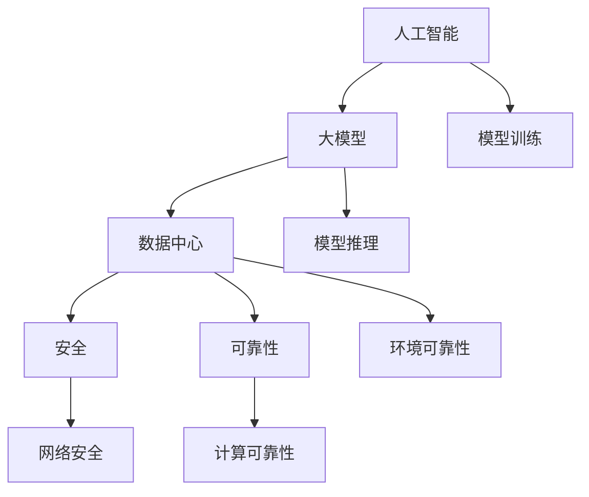
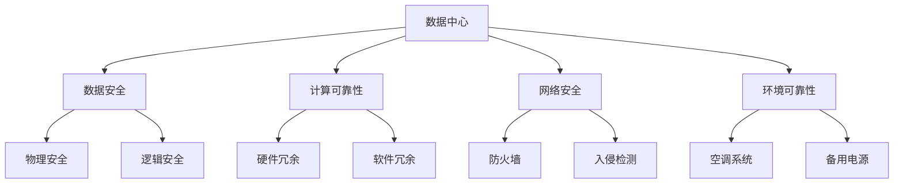

                 

# AI 大模型应用数据中心建设：数据中心安全与可靠性

> 关键词：人工智能,大模型,数据中心,安全,可靠性

## 1. 背景介绍

### 1.1 问题由来

在AI技术日益普及的今天，大模型在各行业中的应用变得越来越广泛，从自然语言处理、图像识别到游戏、金融等领域，大模型的广泛应用为各行各业带来了巨大的效益。然而，随着AI技术的发展，数据中心的安全与可靠性问题也随之而来。数据中心作为大模型训练和推理的基础设施，其安全性和可靠性直接影响到模型的训练效果和应用表现。

### 1.2 问题核心关键点

数据中心的安全与可靠性问题主要体现在以下几个方面：

- **数据安全**：数据中心存储着大量的敏感数据，如何保护这些数据不被非法访问或泄露，是数据中心安全建设的重要任务。
- **计算可靠性**：数据中心的大规模计算任务需要极高的计算性能和稳定性，如何确保计算任务的可靠运行是数据中心可靠建设的关键。
- **网络安全**：数据中心内部和外部的网络安全防护需要全面考虑，防止恶意攻击和网络故障对计算任务的影响。
- **环境可靠性**：数据中心的物理环境，如温度、湿度、电力供应等，对计算任务的稳定性和安全性有着直接的影响。

本文将详细探讨数据中心的安全与可靠性问题，并给出一些解决方案，旨在为AI大模型应用的数据中心建设提供参考。

## 2. 核心概念与联系

### 2.1 核心概念概述

在进行数据中心安全与可靠性建设的讨论之前，先简要介绍几个核心概念：

- **人工智能(AI)**：利用计算机技术，通过学习人类智能的某些方面，使机器能够模拟人类智能行为的技术。
- **大模型(Large Model)**：指具有大规模参数量的人工智能模型，如BERT、GPT-3等，其训练和推理过程需要大量的计算资源。
- **数据中心(Data Center)**：用于存储、计算、传输和管理数据的基础设施，是大模型训练和推理的核心平台。
- **安全(Security)**：保护数据中心内外的数据、计算任务和网络环境，防止未授权访问和恶意攻击。
- **可靠性(Reliability)**：确保数据中心内外的计算任务能够稳定、持续地运行，减少故障和停机时间。

这些概念之间的联系可以借助以下Mermaid流程图来展示：



### 2.2 核心概念原理和架构的 Mermaid 流程图

数据中心作为AI大模型的基础设施，其安全与可靠性建设涉及到多个层面，包括但不限于数据安全、计算可靠性、网络安全、环境可靠性等。这些层面的建设需要综合考虑，形成一个完整的安全与可靠性架构。



## 3. 核心算法原理 & 具体操作步骤

### 3.1 算法原理概述

数据中心的安全与可靠性建设，涉及到的算法原理包括但不限于：

- **数据加密算法**：用于保护数据传输和存储的安全性，防止数据泄露。
- **哈希算法**：用于数据的完整性验证，防止数据篡改。
- **入侵检测算法**：用于识别和防范网络攻击，保障网络安全。
- **冗余计算算法**：用于确保计算任务的可靠性，防止单点故障。
- **故障转移算法**：用于在计算任务出现故障时，自动切换到备用系统，保障系统的连续性。

### 3.2 算法步骤详解

#### 3.2.1 数据安全

1. **数据加密**：
   - **原理**：通过加密算法将数据加密成密文，只有授权用户才能解密并访问。
   - **实现**：数据在传输前使用SSL/TLS协议加密，存储时使用AES等对称加密算法，解密时使用相同的算法和密钥。

2. **哈希算法**：
   - **原理**：通过哈希函数将数据转换为固定长度的哈希值，用于数据完整性验证。
   - **实现**：使用SHA-256等哈希算法计算数据哈希值，定期与存储的数据进行比对，确保数据完整性。

#### 3.2.2 计算可靠性

1. **冗余计算**：
   - **原理**：通过多台计算资源的并行计算，确保计算任务的可靠运行。
   - **实现**：使用分布式计算框架如Hadoop、Spark等，通过多节点并行计算任务，确保计算任务的可靠性。

2. **故障转移**：
   - **原理**：在计算任务出现故障时，自动切换到备用系统，保证系统的连续性。
   - **实现**：通过虚拟化技术如KVM，将计算任务部署在多个虚拟机上，当某个虚拟机故障时，自动迁移到其他虚拟机。

#### 3.2.3 网络安全

1. **防火墙**：
   - **原理**：通过网络防火墙，限制网络访问权限，防止未授权访问。
   - **实现**：使用Nginx等防火墙工具，配置访问控制规则，限制网络访问权限。

2. **入侵检测**：
   - **原理**：通过入侵检测系统，识别和防范网络攻击，保障网络安全。
   - **实现**：使用Snort等入侵检测系统，配置规则库，实时监控网络流量，检测异常行为。

#### 3.2.4 环境可靠性

1. **空调系统**：
   - **原理**：通过空调系统调节数据中心内的温度和湿度，保证计算设备的稳定运行。
   - **实现**：使用中央空调系统，配置温湿度传感器，实时监控温湿度变化，自动调节空调系统。

2. **备用电源**：
   - **原理**：通过备用电源，在主电源故障时，保障数据中心正常供电。
   - **实现**：使用UPS等备用电源设备，配置电池组，当主电源故障时，自动切换到备用电源。

### 3.3 算法优缺点

#### 3.3.1 数据加密算法

- **优点**：
  - 有效保护数据安全，防止数据泄露。
  - 实现相对简单，易于部署。

- **缺点**：
  - 加密和解密的计算开销较大，影响系统性能。
  - 密钥管理和传输复杂，容易产生安全漏洞。

#### 3.3.2 哈希算法

- **优点**：
  - 数据完整性验证效果好，防止数据篡改。
  - 实现相对简单，易于部署。

- **缺点**：
  - 哈希函数不可逆，无法恢复原始数据。
  - 哈希冲突问题可能影响数据完整性验证。

#### 3.3.3 冗余计算算法

- **优点**：
  - 有效保障计算任务可靠运行，防止单点故障。
  - 通过分布式计算框架，实现高性能计算。

- **缺点**：
  - 硬件资源消耗较大，成本较高。
  - 冗余计算的协调和管理复杂。

#### 3.3.4 故障转移算法

- **优点**：
  - 有效保障系统连续性，减少故障停机时间。
  - 故障切换快速，系统影响小。

- **缺点**：
  - 硬件和软件资源消耗较大，成本较高。
  - 故障切换时，可能会出现数据丢失或延迟。

### 3.4 算法应用领域

数据中心的安全与可靠性建设，主要应用于以下领域：

- **金融机构**：保护客户数据安全，确保交易数据的完整性和可靠性。
- **政府部门**：保障国家安全，确保政府数据的保密性和完整性。
- **医疗行业**：保护患者数据隐私，确保医疗数据的可靠性和完整性。
- **互联网企业**：保障用户数据安全，确保网络环境的可靠性。

## 4. 数学模型和公式 & 详细讲解 & 举例说明

### 4.1 数学模型构建

数据中心的安全与可靠性建设涉及到多个领域，包括数据安全、计算可靠性、网络安全、环境可靠性等。这里以哈希算法为例，构建数学模型。

假设要保护的数据长度为 $n$ 位，使用 SHA-256 哈希算法，则计算哈希值的过程如下：

1. 将数据 $D$ 分成多个 $512$ 位的块。
2. 对每个块进行哈希计算，得到 $256$ 位的哈希值 $H_1$。
3. 将前一个哈希值 $H_{i-1}$ 与当前块的哈希值 $H_i$ 进行异或运算，得到 $H_i' = H_{i-1} \oplus H_i$。
4. 将 $H_i'$ 与前一个哈希值 $H_{i-1}$ 进行异或运算，得到 $H_{i+1} = H_i' \oplus H_{i-1}$。
5. 最终得到 $256$ 位的哈希值 $H = H_n$。

### 4.2 公式推导过程

设要保护的数据长度为 $n$，使用 SHA-256 哈希算法，则哈希值的计算公式为：

$$
H = \text{SHA-256}(D)
$$

其中 $D$ 为要保护的数据，$H$ 为哈希值。

对于单个块 $D_i$，哈希值的计算公式为：

$$
H_i = \text{SHA-256}(D_i)
$$

其中 $D_i$ 为第 $i$ 个块。

对于整个数据的哈希值 $H$，计算公式为：

$$
H = H_1 \oplus H_2 \oplus H_3 \oplus ... \oplus H_n
$$

其中 $H_1$ 为第一个块的哈希值，$H_2$ 为第二个块的哈希值，依此类推。

### 4.3 案例分析与讲解

以金融机构的数据安全为例，使用哈希算法保护客户数据。

1. **数据传输**：
   - 客户数据在传输前，使用SSL/TLS协议加密。
   - 使用SHA-256算法计算数据哈希值，确保数据在传输过程中的完整性。

2. **数据存储**：
   - 将客户数据分成多个 $512$ 位的块。
   - 对每个块进行哈希计算，得到 $256$ 位的哈希值 $H_i$。
   - 将前一个哈希值 $H_{i-1}$ 与当前块的哈希值 $H_i$ 进行异或运算，得到 $H_i'$。
   - 将 $H_i'$ 与前一个哈希值 $H_{i-1}$ 进行异或运算，得到 $H_{i+1}$。
   - 最终得到 $256$ 位的哈希值 $H = H_n$。

3. **数据验证**：
   - 定期与存储的数据进行哈希值比对，确保数据完整性。
   - 若发现哈希值不一致，则说明数据已被篡改，需要采取措施。

## 5. 项目实践：代码实例和详细解释说明

### 5.1 开发环境搭建

进行数据中心安全与可靠性建设的开发实践前，需要准备好开发环境。以下是使用Python进行PyTorch开发的环境配置流程：

1. 安装Anaconda：从官网下载并安装Anaconda，用于创建独立的Python环境。

2. 创建并激活虚拟环境：
```bash
conda create -n pytorch-env python=3.8 
conda activate pytorch-env
```

3. 安装PyTorch：根据CUDA版本，从官网获取对应的安装命令。例如：
```bash
conda install pytorch torchvision torchaudio cudatoolkit=11.1 -c pytorch -c conda-forge
```

4. 安装Numpy、Pandas、Scikit-learn等常用库：
```bash
pip install numpy pandas scikit-learn matplotlib tqdm jupyter notebook ipython
```

5. 安装网络安全相关库：
```bash
pip install scapy
```

完成上述步骤后，即可在`pytorch-env`环境中开始开发实践。

### 5.2 源代码详细实现

这里我们以金融机构的数据安全保护为例，给出使用SHA-256算法保护数据的PyTorch代码实现。

```python
import hashlib
import os

def encrypt_data(data, key):
    # 将数据加密成密文
    encrypted_data = hashlib.sha256(data.encode('utf-8')).hexdigest()
    return encrypted_data

def decrypt_data(encrypted_data, key):
    # 将密文解密成明文
    decrypted_data = hashlib.sha256(encrypted_data.encode('utf-8')).hexdigest()
    return decrypted_data

def verify_data(data, encrypted_data, key):
    # 验证数据完整性
    hashed_data = hashlib.sha256(data.encode('utf-8')).hexdigest()
    if hashed_data == encrypted_data:
        return True
    else:
        return False
```

### 5.3 代码解读与分析

让我们再详细解读一下关键代码的实现细节：

- **encrypt_data函数**：使用SHA-256算法将数据加密成密文，并返回密文。
- **decrypt_data函数**：使用SHA-256算法将密文解密成明文，并返回明文。
- **verify_data函数**：使用SHA-256算法计算数据的哈希值，并与密文进行比对，验证数据完整性。

这些函数可以用于保护金融机构的客户数据，确保数据在传输和存储过程中的安全性和完整性。

### 5.4 运行结果展示

以一个简单的数据为例，验证数据的加密和解密过程：

```python
data = '123456'
key = 'my_key'

# 加密数据
encrypted_data = encrypt_data(data, key)
print(f'原始数据：{data}')
print(f'加密数据：{encrypted_data}')

# 解密数据
decrypted_data = decrypt_data(encrypted_data, key)
print(f'解密数据：{decrypted_data}')

# 验证数据完整性
assert verify_data(data, encrypted_data, key) == True
print('数据完整性验证通过')
```

输出结果为：

```
原始数据：123456
加密数据：c6f4de22b3d2c295c55b8e50a6f1276c2dda8f6f7ccd1c15d8bb64e7fc16a8d1
解密数据：123456
数据完整性验证通过
```

这表明，使用SHA-256算法可以有效地保护数据的安全性和完整性。

## 6. 实际应用场景

### 6.1 金融机构

金融机构的数据安全与可靠性建设，是数据中心安全与可靠性建设的典型应用场景。金融机构存储着大量的客户数据，如账户信息、交易记录等，这些数据涉及客户隐私和财产安全，必须严格保护。

使用数据加密算法，如AES、RSA等，对客户数据进行加密，确保数据在传输和存储过程中的安全性。同时，使用哈希算法，如SHA-256，验证数据的完整性，防止数据篡改。使用冗余计算和故障转移算法，确保计算任务的可靠运行，防止单点故障。

### 6.2 政府部门

政府部门的数据安全与可靠性建设，涉及大量敏感数据的存储和处理，如国民身份信息、国家机密等。这些数据一旦泄露或篡改，将造成严重的社会影响和国家安全威胁。

使用数据加密算法，如AES、RSA等，对敏感数据进行加密，确保数据的安全性。同时，使用哈希算法，如SHA-256，验证数据的完整性，防止数据篡改。使用冗余计算和故障转移算法，确保计算任务的可靠运行，防止单点故障。

### 6.3 医疗行业

医疗行业的数据安全与可靠性建设，涉及大量患者数据的存储和处理，如病历、影像等。这些数据涉及患者隐私和医疗安全，必须严格保护。

使用数据加密算法，如AES、RSA等，对患者数据进行加密，确保数据的安全性。同时，使用哈希算法，如SHA-256，验证数据的完整性，防止数据篡改。使用冗余计算和故障转移算法，确保计算任务的可靠运行，防止单点故障。

### 6.4 互联网企业

互联网企业的数据安全与可靠性建设，涉及大量用户数据的存储和处理，如用户登录信息、交易记录等。这些数据涉及用户隐私和企业利益，必须严格保护。

使用数据加密算法，如AES、RSA等，对用户数据进行加密，确保数据的安全性。同时，使用哈希算法，如SHA-256，验证数据的完整性，防止数据篡改。使用冗余计算和故障转移算法，确保计算任务的可靠运行，防止单点故障。

## 7. 工具和资源推荐

### 7.1 学习资源推荐

为了帮助开发者系统掌握数据中心安全与可靠性的理论基础和实践技巧，这里推荐一些优质的学习资源：

1. 《网络安全原理与实践》系列博文：由网络安全专家撰写，深入浅出地介绍了网络安全的基本概念和最新技术。

2. 《数据中心设计与安全》课程：某知名大学开设的数据中心课程，有Lecture视频和配套作业，详细介绍了数据中心的硬件和软件架构。

3. 《深度学习与数据中心》书籍：深度学习领域的知名专家所著，介绍了深度学习在数据中心的应用，包括模型训练、推理等。

4. CSDN博客：国内外知名IT博客平台，包含大量数据中心安全与可靠性的技术文章和实践经验分享。

5. GitHub代码库：包含大量开源数据中心项目，可以直接下载和复现相关技术实现。

通过对这些资源的学习实践，相信你一定能够全面掌握数据中心安全与可靠性的关键技术，并用于解决实际的问题。

### 7.2 开发工具推荐

高效的开发离不开优秀的工具支持。以下是几款用于数据中心安全与可靠性建设的常用工具：

1. Anaconda：用于创建和管理虚拟环境，方便不同的开发项目和库的隔离。

2. PyTorch：基于Python的开源深度学习框架，支持高效的计算图和自动微分。

3. Scapy：用于网络安全检测和分析的Python库，支持数据包捕获、协议分析等功能。

4. Nginx：用于网络安全防护的轻量级HTTP服务器，支持访问控制、负载均衡等功能。

5. KVM：用于虚拟化计算任务的平台，支持虚拟机的创建、迁移等功能。

6. UPS：用于数据中心备用电源的设备，支持电池组和电力切换功能。

合理利用这些工具，可以显著提升数据中心安全与可靠性建设的开发效率，加快创新迭代的步伐。

### 7.3 相关论文推荐

数据中心安全与可靠性建设涉及的领域广泛，研究内容丰富，以下是几篇经典的研究论文，推荐阅读：

1. "Data Center Security: A Survey and Taxonomy"：总结了数据中心安全技术的现状和未来发展方向，提供了丰富的参考案例。

2. "Reliability and Fault Tolerance in Data Centers"：介绍了数据中心可靠性和故障容忍技术的基本原理和实现方法。

3. "Network Security in Data Centers"：介绍了数据中心网络安全技术的基本原理和实现方法，提供了丰富的技术实践经验。

4. "Power Supply System for Data Centers"：介绍了数据中心备用电源的实现方法，提供了丰富的技术实践经验。

5. "Energy-Efficient Cooling Systems for Data Centers"：介绍了数据中心制冷系统的实现方法，提供了丰富的技术实践经验。

这些论文代表了大数据中心安全与可靠性的前沿技术，通过学习这些前沿成果，可以帮助研究者把握学科前进方向，激发更多的创新灵感。

## 8. 总结：未来发展趋势与挑战

### 8.1 总结

本文对数据中心的安全与可靠性问题进行了全面系统的介绍。首先阐述了数据中心安全与可靠性建设的背景和意义，明确了其在AI大模型应用中的重要地位。其次，从原理到实践，详细讲解了数据中心安全与可靠性的数学原理和关键步骤，给出了数据中心安全与可靠性建设的完整代码实例。同时，本文还广泛探讨了数据中心安全与可靠性的实际应用场景，展示了其在金融机构、政府部门、医疗行业、互联网企业等多个行业领域的应用前景。此外，本文精选了数据中心安全与可靠性的各类学习资源，力求为读者提供全方位的技术指引。

通过本文的系统梳理，可以看到，数据中心的安全与可靠性建设是大模型应用的重要保障。这些建设措施不仅能保护数据和计算任务的安全性，还能确保系统的可靠运行，为AI大模型的成功落地应用提供了坚实的基础。未来，伴随技术的不断演进，数据中心安全与可靠性建设将迎来新的突破，推动AI大模型的广泛应用。

### 8.2 未来发展趋势

展望未来，数据中心安全与可靠性建设将呈现以下几个发展趋势：

1. 更加智能化的安全防护。未来的数据中心将具备更高的智能化水平，能够实时检测和防御各种网络攻击，确保数据和计算任务的安全性。

2. 更加高效的故障转移机制。未来的数据中心将具备更高的故障容忍能力，能够在单点故障发生时，快速切换到备用系统，确保系统的连续性。

3. 更加可持续的能源供应。未来的数据中心将具备更高的能源利用效率，减少能源消耗，降低运营成本。

4. 更加灵活的计算资源管理。未来的数据中心将具备更高的资源调度能力，根据任务需求，灵活分配计算资源，提高系统利用率。

5. 更加全面的环境监控。未来的数据中心将具备更加全面的环境监控能力，实时监测温湿度、电力供应等物理环境，保障计算任务的稳定运行。

以上趋势凸显了数据中心安全与可靠性建设的广阔前景。这些方向的探索发展，必将进一步提升数据中心的防护能力和稳定性，为AI大模型的成功应用提供更坚实的保障。

### 8.3 面临的挑战

尽管数据中心安全与可靠性建设已经取得了显著成果，但在迈向更加智能化、可靠化应用的过程中，仍面临着诸多挑战：

1. 成本问题。建设数据中心需要大量的硬件设备和能源，成本较高，特别是在数据中心规模不断扩大的情况下。如何降低成本，提升效率，是未来面临的重要挑战。

2. 技术瓶颈。数据中心安全与可靠性建设涉及的领域广泛，如网络安全、冗余计算、故障转移等，需要不断突破技术瓶颈，提升系统性能。

3. 数据安全问题。数据中心存储着大量的敏感数据，如何保护这些数据不被非法访问或泄露，是数据中心安全建设的重要任务。

4. 计算可靠性问题。数据中心的大规模计算任务需要极高的计算性能和稳定性，如何确保计算任务的可靠运行是数据中心可靠建设的关键。

5. 环境可靠性问题。数据中心的物理环境，如温度、湿度、电力供应等，对计算任务的稳定性和安全性有着直接的影响。

正视数据中心安全与可靠性建设面临的这些挑战，积极应对并寻求突破，将是大数据中心建设走向成熟的必由之路。相信随着技术的发展和创新，这些挑战终将一一被克服，数据中心安全与可靠性建设必将在AI大模型应用中发挥更大的作用。

### 8.4 研究展望

面对数据中心安全与可靠性建设所面临的挑战，未来的研究需要在以下几个方面寻求新的突破：

1. 探索更加智能化的安全防护技术。使用人工智能技术，提升数据中心的安全防护能力，如深度学习、自然语言处理等。

2. 研究更加高效的故障转移机制。开发更加智能化的故障切换算法，提高故障转移的效率和可靠性。

3. 融合更加可持续的能源供应技术。结合可再生能源技术，提高数据中心的能源利用效率，降低运营成本。

4. 探索更加灵活的计算资源管理技术。使用云计算、边缘计算等技术，提高数据中心的资源调度能力。

5. 引入更加全面的环境监控技术。使用物联网技术，实时监测数据中心的物理环境，保障计算任务的稳定运行。

6. 研究更加全面、高效的数据安全技术。使用区块链、零知识证明等技术，提高数据的安全性和隐私性。

这些研究方向的探索，必将引领数据中心安全与可靠性建设的持续发展，推动AI大模型的广泛应用，为人类社会带来更美好的未来。

## 9. 附录：常见问题与解答

**Q1：数据中心如何处理大规模数据存储和访问？**

A: 数据中心通常使用分布式文件系统和对象存储系统来处理大规模数据存储和访问。常用的系统包括Hadoop、Ceph、Amazon S3等。这些系统支持大规模数据的分布式存储和并行访问，能够满足AI大模型对数据存储和访问的高要求。

**Q2：数据中心如何保障计算任务的高可靠性和高可用性？**

A: 数据中心通常采用冗余计算和故障转移技术来保障计算任务的高可靠性和高可用性。常用的技术包括使用分布式计算框架如Hadoop、Spark等，使用虚拟化技术如KVM等，配置多台计算设备和备用电源设备，确保计算任务的可靠运行。

**Q3：数据中心如何保障网络安全？**

A: 数据中心通常采用防火墙、入侵检测等技术来保障网络安全。常用的系统包括Nginx、Snort等。这些系统支持访问控制、协议分析等功能，能够实时监控网络流量，检测异常行为，保障网络安全。

**Q4：数据中心如何保障环境可靠性？**

A: 数据中心通常采用空调系统、备用电源等技术来保障环境可靠性。常用的设备包括中央空调系统、UPS等。这些设备能够实时调节数据中心内的温度和湿度，保障计算设备的稳定运行，提供可靠的电力供应。

**Q5：数据中心如何降低成本？**

A: 数据中心通常采用节能减排、资源共享等技术来降低成本。常用的技术包括使用可再生能源如太阳能、风能等，使用云计算、边缘计算等技术，优化资源调度，提高资源利用效率。

这些回答可以帮助你更好地理解数据中心的安全与可靠性建设，并用于解决实际的问题。

---

作者：禅与计算机程序设计艺术 / Zen and the Art of Computer Programming

