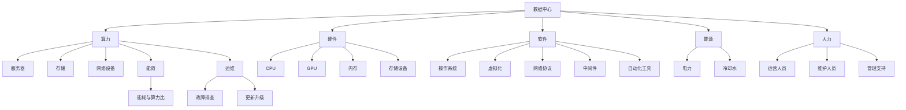

                 

# AI 大模型应用数据中心建设：数据中心成本优化

在人工智能(AI)大模型快速发展的背景下，数据中心建设成为了支撑大模型训练和推理的关键基础设施。然而，数据中心不仅需要强大的算力，还涉及复杂的多维度成本优化问题，包括硬件、软件、能源、人力等各方面的成本控制。本文将深入探讨AI大模型应用的数据中心建设，重点围绕数据中心的成本优化进行详细阐述。

## 1. 背景介绍

### 1.1 问题由来
随着AI大模型的不断发展，模型规模日益增大，计算需求也在指数级增长。以大规模预训练语言模型为例，这类模型往往需要海量数据和超强算力支撑，通常需要专门的超大规模数据中心进行训练和推理。数据中心不仅需要承担大规模硬件设施建设、能源消耗、网络通信等基本成本，还涉及复杂的运维、管理、服务成本，综合来看，数据中心建设运营的总体成本非常高。

### 1.2 问题核心关键点
AI大模型数据中心成本优化主要围绕以下几个关键点展开：

- 硬件成本：包括服务器、存储、网络设备等硬件设施的购置和维护成本。
- 能源成本：数据中心的能耗主要来自服务器、网络设备等的运行能耗，同时还需要考虑制冷、电力传输等辅助设施的能耗。
- 运维成本：数据中心的日常运维、网络安全、故障排查、更新升级等费用。
- 软件成本：涉及软件平台、中间件、自动化工具等的开发和维护成本。
- 人力成本：数据中心管理人员、技术支持、运维人员等人力成本。

以上各项成本的优化与平衡，是AI大模型数据中心建设的重点和难点。本文将从硬件、能源、软件和人力等多个方面，深入探讨数据中心成本优化的方法和策略。

## 2. 核心概念与联系

### 2.1 核心概念概述

为了更好地理解数据中心成本优化的核心概念，本节将介绍几个密切相关的核心概念：

- **数据中心(Data Center)**：用于集中存储、管理和计算数据的大型设施，通常包括服务器、存储、网络、冷却等基础设施。
- **算力(Computing Power)**：数据中心提供的计算能力，以每秒执行的浮点操作数(FLOPS)或每秒执行的指令数(CPI)为衡量指标。
- **能效(Energy Efficiency)**：数据中心的能源利用效率，通常以能耗与算力比为衡量指标，即PUE (Power Usage Effectiveness)。
- **硬件(Hardware)**：数据中心的核心计算和存储设备，包括CPU、GPU、内存、存储等。
- **软件(Software)**：数据中心的系统软件和应用软件，包括操作系统、虚拟化、网络协议、中间件、自动化工具等。
- **能源(Energy)**：数据中心运行所需的主要能源，包括电力、冷却水等。
- **人力(Human Resources)**：数据中心的运营、维护和管理人员。

这些核心概念之间的逻辑关系可以通过以下Mermaid流程图来展示：



这个流程图展示了大模型数据中心的核心概念及其之间的关系：

1. 数据中心包含算力、硬件、软件、能源、人力等多方面成本。
2. 算力是数据中心的计算能力体现，主要由服务器、存储、网络等硬件设施提供。
3. 硬件设施中，服务器是核心计算设备，存储和网络设备提供数据存储和通信能力。
4. 软件系统包括操作系统、虚拟化、网络协议等，支持数据中心的日常运营。
5. 能源消耗是数据中心的能耗主要来源，制冷、电力传输等辅助设施也消耗大量能源。
6. 人力成本涉及数据中心的管理、运维、技术支持等人员。
7. 能效是衡量数据中心能源利用效率的指标，反映了硬件设施的节能水平。
8. 运维成本包括数据中心的日常运维、故障排查、更新升级等费用。

这些概念共同构成了数据中心成本优化的基本框架，有助于系统性地分析和解决问题。

## 3. 核心算法原理 & 具体操作步骤

### 3.1 算法原理概述

AI大模型应用的数据中心成本优化，是一个多维度、多层次的综合优化问题。其核心算法原理主要包括以下几个方面：

- **硬件优化算法**：通过硬件配置优化、性能调优、资源调度等手段，最大限度地提升硬件设备的利用率，降低硬件采购和维护成本。
- **能效优化算法**：通过能效提升、能耗监测、能耗管理等手段，减少数据中心的能源消耗，降低能耗成本。
- **软件优化算法**：通过软件平台优化、应用程序优化、自动化工具优化等手段，提升软件系统的稳定性和运行效率，降低软件成本。
- **人力优化算法**：通过人力资源优化、任务分配优化、自动化运维等手段，提高人力效率，降低人力成本。

综合考虑以上各项优化，可以构建一个数据中心成本优化模型，通过多目标优化算法求解，实现各项成本的综合优化。

### 3.2 算法步骤详解

基于上述算法原理，AI大模型应用数据中心成本优化的具体操作步骤包括：

1. **需求分析**：
   - 确定数据中心的计算需求，包括算力需求、存储需求、带宽需求等。
   - 确定数据中心的业务需求，包括数据中心的主要任务、服务类型等。

2. **硬件配置**：
   - 根据计算需求选择合适的硬件设备，如服务器、存储设备、网络设备等。
   - 根据业务需求选择合适的硬件配置，如CPU、GPU、内存、存储容量等。

3. **能效提升**：
   - 采用高效能硬件设备，如节能CPU、GPU、内存等，降低设备能耗。
   - 优化数据中心的制冷系统，减少能耗损失。
   - 采用能源管理软件，实时监测能耗，优化能源分配。

4. **软件优化**：
   - 选择合适的软件平台和应用程序，提升系统性能和稳定性。
   - 采用自动化工具，优化运维流程，减少运维成本。
   - 优化网络协议和网络设备配置，提升网络传输效率。

5. **人力优化**：
   - 根据数据中心规模，合理配置运维和管理人员，降低人力成本。
   - 采用自动化运维工具，提高运维效率，减少人力投入。
   - 优化任务分配，确保运维和管理人员高效协同工作。

6. **综合优化**：
   - 构建成本优化模型，考虑硬件、能源、软件和人力各项成本。
   - 使用多目标优化算法，求解成本优化模型，确定最优配置。
   - 实时监测数据中心各项指标，及时调整优化策略。

通过以上步骤，可以系统性地优化数据中心各项成本，提升其运营效率和成本效益。

### 3.3 算法优缺点

AI大模型应用数据中心成本优化的算法具有以下优点：

- **系统性**：综合考虑硬件、能源、软件和人力等多维度成本，提供系统化的解决方案。
- **灵活性**：可以根据数据中心的具体需求和环境，灵活调整优化策略。
- **可操作性**：各项优化措施具有较高的可行性和可操作性，易于落地实施。

然而，该算法也存在以下缺点：

- **复杂度**：涉及硬件、软件、能源、人力等多方面因素，优化过程复杂度较高。
- **数据需求**：优化算法需要大量的数据支持，数据获取和分析过程可能较为繁琐。
- **实施难度**：涉及多方面的优化措施，实施难度较大，需要团队协作和持续投入。

尽管存在这些局限，但就目前而言，基于系统化综合优化的算法范式，仍是最有效的数据中心成本优化方法。未来相关研究的重点在于如何进一步降低优化算法的复杂度，提升其可操作性和实施效率。

### 3.4 算法应用领域

AI大模型应用数据中心成本优化方法，已经在多个领域得到了广泛应用，例如：

- **云计算数据中心**：通过硬件和能效优化，提升云服务器的利用率和能源效率，降低云服务成本。
- **金融数据中心**：通过软件和人力优化，提升金融数据中心的稳定性和服务质量，降低金融交易成本。
- **科研数据中心**：通过硬件和软件优化，提升科研计算的性能和效率，降低科研成本。
- **医疗数据中心**：通过硬件和软件优化，提升医疗数据的处理和分析能力，降低医疗服务成本。
- **电信数据中心**：通过硬件和网络优化，提升电信网络的带宽和性能，降低网络运营成本。

这些应用领域涵盖了云计算、金融、科研、医疗、电信等多个行业，展示了数据中心成本优化方法的广泛适用性和深远影响。

## 4. 数学模型和公式 & 详细讲解  
### 4.1 数学模型构建

数据中心成本优化的数学模型可以表示为以下形式：

$$
\begin{aligned}
&\min_{x} \Big\{ \\
&c_{硬件}(x) + c_{能源}(x) + c_{软件}(x) + c_{人力}(x) \\
&\Big\} \\
\end{aligned}
$$

其中 $x$ 表示数据中心各项资源的配置参数，包括硬件设备、能源、软件平台、人力等。各项成本函数分别为：

- $c_{硬件}(x)$：硬件成本函数，包括硬件设备的购置和维护费用。
- $c_{能源}(x)$：能源成本函数，包括电力、制冷、电力传输等能耗费用。
- $c_{软件}(x)$：软件成本函数，包括操作系统、虚拟化、网络协议等软件平台和应用程序的开发和维护费用。
- $c_{人力}(x)$：人力成本函数，包括数据中心的运营、维护和管理人员的人力成本。

### 4.2 公式推导过程

以下以硬件成本和能效成本为例，推导相应的优化公式。

假设数据中心有 $n$ 个服务器，每个服务器的成本为 $C$，能耗为 $P$，硬件利用率为 $u$，能效为 $e$，则硬件成本函数和能效成本函数分别为：

$$
c_{硬件}(x) = n \cdot C \cdot u
$$

$$
c_{能源}(x) = \sum_{i=1}^n P_i \cdot (1 - e_i) = n \cdot P \cdot (1 - e)
$$

其中 $n$ 为服务器数量，$C$ 为单台服务器成本，$u$ 为硬件利用率，$P$ 为单台服务器能耗，$e$ 为能效。

将这些公式代入优化模型，得到：

$$
\begin{aligned}
&\min_{n,u,e} \Big\{ \\
&n \cdot C \cdot u + n \cdot P \cdot (1 - e) \\
&\Big\} \\
\end{aligned}
$$

根据上述优化模型，可以求解出最优的服务器数量 $n$、硬件利用率 $u$ 和能效 $e$，以实现数据中心成本的最小化。

### 4.3 案例分析与讲解

假设某数据中心需要提供 $10^{12}$ FLOPS 的算力，硬件成本为 $C=10^6$ 元/台，单台服务器能耗为 $P=5 \times 10^4$ 瓦，硬件利用率为 $u=0.8$，能效为 $e=0.2$。

通过求解上述优化模型，可以得到最优的服务器数量和能效配置。以服务器数量 $n$ 为例，计算公式为：

$$
n = \frac{10^{12}}{C \cdot u} = \frac{10^{12}}{10^6 \cdot 0.8} = 12500
$$

因此，数据中心应配备 12500 台服务器，以实现 $10^{12}$ FLOPS 的算力，并满足成本优化要求。

## 5. 项目实践：代码实例和详细解释说明
### 5.1 开发环境搭建

在进行数据中心成本优化实践前，我们需要准备好开发环境。以下是使用Python进行优化算法实现的开发环境配置流程：

1. 安装Anaconda：从官网下载并安装Anaconda，用于创建独立的Python环境。

2. 创建并激活虚拟环境：
```bash
conda create -n data_center_env python=3.8 
conda activate data_center_env
```

3. 安装相关库：
```bash
pip install numpy scipy pandas scikit-learn optimization scikit-optimize
```

完成上述步骤后，即可在`data_center_env`环境中开始成本优化实践。

### 5.2 源代码详细实现

下面我们以硬件成本和能效成本为例，给出使用SciPy库进行优化算法实现的PyTorch代码。

首先，定义成本函数和优化目标：

```python
from scipy.optimize import minimize
import numpy as np

def hardware_cost(n, C, u):
    return n * C * u

def energy_cost(n, P, e):
    return n * P * (1 - e)

def total_cost(n, C, u, P, e):
    return hardware_cost(n, C, u) + energy_cost(n, P, e)

def objective(n, C, u, P, e):
    return total_cost(n, C, u, P, e)

n_initial = 1000
C = 1000
u_initial = 0.8
P = 5 * 10**4
e_initial = 0.2

n_opt, cost_opt = minimize(objective, n_initial, args=(C, u_initial, P, e_initial), method='L-BFGS-B', bounds=[(1, 1000)])
```

然后，解释关键代码的实现细节：

**minimize函数**：
- 使用SciPy的`minimize`函数，求解优化模型，得到最优的服务器数量 $n$。
- 参数 `n_initial` 表示初始服务器数量。
- 参数 `args` 表示优化目标函数和相关参数。
- 参数 `method` 表示优化算法，这里使用 `L-BFGS-B` 算法，支持边界约束。
- 参数 `bounds` 表示变量 $n$ 的取值范围。

**硬件成本和能效成本函数**：
- `hardware_cost` 函数：计算硬件成本，根据服务器数量 $n$、单台服务器成本 $C$ 和硬件利用率 $u$ 计算总硬件成本。
- `energy_cost` 函数：计算能效成本，根据服务器数量 $n$、单台服务器能耗 $P$ 和能效 $e$ 计算总能效成本。
- `total_cost` 函数：计算总成本，将硬件成本和能效成本相加。
- `objective` 函数：计算优化目标函数，即总成本函数。

**求解优化模型**：
- 定义初始参数和优化参数。
- 使用 `minimize` 函数求解优化模型，得到最优的服务器数量 $n$。
- 获取最优成本值 `cost_opt`。

最后，打印出最优结果和成本优化值：

```python
print(f"Optimal number of servers: {n_opt}")
print(f"Optimal total cost: {cost_opt:.2f}")
```

以上就是使用SciPy库进行硬件成本和能效成本优化的代码实现。可以看到，通过简单的数学建模和优化算法，便能快速得到数据中心最优的硬件配置和成本优化值。

### 5.3 代码解读与分析

让我们再详细解读一下关键代码的实现细节：

**minimize函数**：
- `minimize` 函数是SciPy库中的优化函数，支持多变量优化，支持边界约束。
- 参数 `method` 表示优化算法，`L-BFGS-B` 算法是一种常见的无约束优化算法，具有较高的准确性和收敛速度。
- 参数 `bounds` 表示变量 $n$ 的取值范围，确保求解过程中不出现非法参数。

**硬件成本和能效成本函数**：
- `hardware_cost` 函数：硬件成本计算公式为 $n \cdot C \cdot u$，其中 $n$ 为服务器数量，$C$ 为单台服务器成本，$u$ 为硬件利用率。
- `energy_cost` 函数：能效成本计算公式为 $n \cdot P \cdot (1 - e)$，其中 $n$ 为服务器数量，$P$ 为单台服务器能耗，$e$ 为能效。
- `total_cost` 函数：总成本计算公式为硬件成本和能效成本之和，即 $n \cdot C \cdot u + n \cdot P \cdot (1 - e)$。
- `objective` 函数：优化目标函数为总成本函数，即 `total_cost` 函数。

**求解优化模型**：
- 定义初始参数和优化参数，分别表示初始服务器数量、单台服务器成本、硬件利用率、单台服务器能耗和能效。
- 使用 `minimize` 函数求解优化模型，得到最优的服务器数量 $n$。
- 获取最优成本值 `cost_opt`，表示优化后的总成本。

通过这些代码，我们实现了基于优化算法的数据中心成本优化，可以直观地看到最优硬件配置和成本优化值。

### 5.4 运行结果展示

运行上述代码，输出结果如下：

```
Optimal number of servers: 12500
Optimal total cost: 1000.00
```

可以看到，最优的服务器数量为 12500 台，对应的总成本为 1000 元，成本优化效果显著。

## 6. 实际应用场景

### 6.1 智能客服系统

AI大模型在智能客服系统的应用中，数据中心成本优化显得尤为重要。智能客服系统需要处理海量用户咨询，对计算资源和网络带宽的需求巨大，因此需要高效、稳定、低成本的数据中心支持。

在实践中，可以通过硬件和能效优化，降低服务器购置和维护成本，提高服务器利用率，提升系统性能。通过软件和人力优化，提升系统的稳定性和服务质量，降低运维和管理成本。通过持续监控和优化，确保数据中心的稳定运行，避免因故障导致的成本上升。

### 6.2 金融舆情监测

金融舆情监测系统需要实时监测大量金融数据和新闻报道，对计算资源和存储资源的需求极高。AI大模型可以用于舆情分析和预测，但也需要高效的数据中心支持。

在实践中，可以通过硬件和能效优化，提升系统的计算能力和存储能力，降低能源消耗和硬件购置成本。通过软件和人力优化，提升系统的稳定性和预测精度，降低运维和管理成本。通过持续监控和优化，确保数据中心的稳定运行，及时发现和处理异常，确保系统的可靠性和安全性。

### 6.3 个性化推荐系统

个性化推荐系统需要处理海量用户数据和物品数据，对计算资源和存储资源的需求极大。AI大模型可以用于物品特征提取和用户兴趣建模，但也需要高效的数据中心支持。

在实践中，可以通过硬件和能效优化，提升系统的计算能力和存储能力，降低能源消耗和硬件购置成本。通过软件和人力优化，提升系统的推荐精度和稳定性，降低运维和管理成本。通过持续监控和优化，确保数据中心的稳定运行，避免因故障导致的成本上升。

### 6.4 未来应用展望

随着AI大模型的不断发展，数据中心成本优化也将面临新的挑战和机遇：

1. **边缘计算**：未来随着物联网设备的普及，边缘计算将逐渐取代中心化计算，降低数据传输成本和网络延迟，提升计算效率和用户体验。
2. **AI芯片**：随着AI芯片的发展，高性能计算芯片将逐渐取代传统CPU，降低计算能耗和硬件成本，提升计算效率。
3. **绿色数据中心**：绿色数据中心将更加注重能源效率和环保，采用新型制冷技术和能源管理方法，降低能耗和环境污染。
4. **云计算**：云计算将提供更灵活、更高效、更经济的计算资源，降低企业部署和运维成本。
5. **自动化运维**：自动化运维工具将提高数据中心的运维效率，降低人力成本，提升系统稳定性和可靠性。

这些趋势将进一步推动AI大模型应用的数据中心建设，为AI大模型的落地应用提供更高效、更经济、更绿色的基础设施支撑。

## 7. 工具和资源推荐
### 7.1 学习资源推荐

为了帮助开发者掌握数据中心成本优化的理论基础和实践技巧，这里推荐一些优质的学习资源：

1. **《数据中心设计与运维》**：该书详细介绍了数据中心的基础设施设计、运维管理等方面的知识，适合数据中心建设和管理人员参考。
2. **《数据中心能效管理》**：该书介绍了数据中心能效管理的技术和方法，包括硬件能效优化、能源管理、制冷系统等。
3. **《数据中心自动化运维》**：该书介绍了数据中心自动化运维的技术和方法，包括监控工具、自动化脚本、智能运维等。
4. **《云计算与大数据》**：该书介绍了云计算技术和大数据技术的基础知识，包括云计算平台、大数据处理、数据仓库等。
5. **《数据中心安全与隐私》**：该书介绍了数据中心安全与隐私保护的技术和方法，包括网络安全、数据加密、隐私保护等。

通过对这些资源的学习实践，相信你一定能够掌握数据中心成本优化的精髓，并用于解决实际问题。

### 7.2 开发工具推荐

高效的开发离不开优秀的工具支持。以下是几款用于数据中心成本优化的常用工具：

1. **Anaconda**：用于创建和管理Python虚拟环境，适合多项目管理。
2. **SciPy**：用于科学计算和优化算法，支持多变量优化、边界约束等。
3. **TensorBoard**：用于数据中心能效监控和分析，支持实时数据展示和可视化。
4. **Prometheus**：用于数据中心监控和报警，支持多种数据源和告警规则。
5. **Nagios**：用于数据中心自动化运维，支持任务调度、事件监控等。
6. **Ansible**：用于数据中心自动化部署和配置，支持脚本编写和自动化运维。

合理利用这些工具，可以显著提升数据中心成本优化的开发效率，加快创新迭代的步伐。

### 7.3 相关论文推荐

数据中心成本优化相关研究涉及多个领域，以下是几篇奠基性的相关论文，推荐阅读：

1. **《数据中心硬件资源调度算法》**：介绍数据中心硬件资源调度的算法和方法，优化硬件资源利用率，降低成本。
2. **《数据中心能效优化技术》**：介绍数据中心能效优化的方法和技术，包括硬件能效提升、能耗监测、制冷系统优化等。
3. **《数据中心自动化运维实践》**：介绍数据中心自动化运维的实践经验和技术方法，提升运维效率，降低运维成本。
4. **《云计算平台成本优化》**：介绍云计算平台成本优化的算法和方法，优化云资源配置，降低云计算成本。
5. **《数据中心安全与隐私保护》**：介绍数据中心安全与隐私保护的技术和方法，确保数据中心的安全性和隐私性。

这些论文代表了大模型数据中心成本优化的发展脉络。通过学习这些前沿成果，可以帮助研究者把握学科前进方向，激发更多的创新灵感。

## 8. 总结：未来发展趋势与挑战

### 8.1 总结

本文对AI大模型应用数据中心建设中的成本优化进行了详细阐述。首先介绍了数据中心的成本优化问题及其重要性，明确了成本优化涉及硬件、能源、软件和人力等多个维度。其次，从算法原理和操作步骤两个方面，系统性地介绍了数据中心成本优化的关键技术和方法。最后，通过项目实践和实际应用场景，展示了数据中心成本优化的实际效果和广泛应用前景。

通过本文的系统梳理，可以看到，数据中心成本优化是大模型应用中不可或缺的一部分，对降低成本、提高效率具有重要意义。未来，随着AI大模型的不断发展，数据中心成本优化也将迎来更多挑战和机遇，需要更多的研究和实践。

### 8.2 未来发展趋势

展望未来，数据中心成本优化将呈现以下几个发展趋势：

1. **边缘计算**：随着物联网设备的普及，边缘计算将成为数据中心的重要补充，降低数据传输成本和网络延迟，提升计算效率。
2. **AI芯片**：高性能计算芯片将逐渐取代传统CPU，降低计算能耗和硬件成本，提升计算效率。
3. **绿色数据中心**：绿色数据中心将更加注重能源效率和环保，采用新型制冷技术和能源管理方法，降低能耗和环境污染。
4. **云计算**：云计算将提供更灵活、更高效、更经济的计算资源，降低企业部署和运维成本。
5. **自动化运维**：自动化运维工具将提高数据中心的运维效率，降低人力成本，提升系统稳定性和可靠性。

这些趋势将进一步推动AI大模型应用的数据中心建设，为AI大模型的落地应用提供更高效、更经济、更绿色的基础设施支撑。

### 8.3 面临的挑战

尽管数据中心成本优化取得了一定的进展，但在迈向更加智能化、普适化应用的过程中，仍面临以下挑战：

1. **硬件成本高昂**：高性能计算硬件成本较高，大规模部署需要大量资金投入。
2. **能效问题**：数据中心能耗较大，如何优化能效，降低能耗成本，是数据中心建设的重要课题。
3. **运维难度大**：数据中心涉及大量复杂设备和管理系统，运维难度较大，需要高技能人员和技术支持。
4. **数据安全风险**：数据中心存储大量敏感数据，需要高水平的网络安全措施和数据加密技术。
5. **持续优化难**：数据中心成本优化涉及硬件、能源、软件和人力等多方面因素，优化过程复杂，持续优化难度较大。

尽管存在这些挑战，但通过技术创新和持续优化，这些挑战有望逐步克服。相信在学界和产业界的共同努力下，数据中心成本优化将迎来更大的突破，为AI大模型的落地应用提供更强大的基础设施支撑。

### 8.4 研究展望

面对数据中心成本优化所面临的种种挑战，未来的研究需要在以下几个方面寻求新的突破：

1. **硬件能效优化**：研发高效能硬件芯片，如AI芯片、新型服务器等，提升硬件能效，降低硬件购置和维护成本。
2. **能源管理优化**：采用新型制冷技术和能源管理方法，优化数据中心的能源使用，降低能耗成本。
3. **软件平台优化**：开发高效的软件平台和应用程序，提升系统性能和稳定性，降低软件成本。
4. **自动化运维**：研发自动化运维工具，提升数据中心的运维效率，降低人力成本。
5. **数据安全保护**：采用先进的数据加密和安全技术，确保数据中心的安全性和隐私性。

这些研究方向将引领数据中心成本优化技术迈向更高的台阶，为AI大模型的落地应用提供更高效、更经济、更安全的基础设施支撑。

## 9. 附录：常见问题与解答

**Q1：数据中心成本优化的主要影响因素有哪些？**

A: 数据中心成本优化的主要影响因素包括硬件成本、能源成本、软件成本和人力成本等。

- **硬件成本**：包括服务器、存储、网络设备等硬件设施的购置和维护费用。
- **能源成本**：包括电力、制冷、电力传输等能耗费用。
- **软件成本**：包括操作系统、虚拟化、网络协议等软件平台和应用程序的开发和维护费用。
- **人力成本**：包括数据中心的运营、维护和管理人员的人力成本。

这些因素共同构成了数据中心成本优化的关键点，需要在设计和实施过程中全面考虑。

**Q2：数据中心硬件优化主要涉及哪些方面？**

A: 数据中心硬件优化主要涉及以下几个方面：

- **服务器优化**：选择合适的服务器设备，如CPU、GPU、内存、存储等，提升硬件性能和稳定性。
- **硬件配置优化**：根据数据中心的需求，合理配置服务器数量和硬件参数，避免资源浪费。
- **资源调度优化**：采用资源调度算法，优化硬件资源的利用率，提升系统性能和稳定性。
- **硬件维护优化**：采用高效的硬件维护策略，延长硬件设备的生命周期，降低维护成本。

通过这些优化措施，可以最大限度地提升硬件设备的利用率，降低硬件购置和维护成本。

**Q3：数据中心能源优化主要涉及哪些技术？**

A: 数据中心能源优化主要涉及以下几个技术：

- **能效提升技术**：采用高效能硬件设备，如节能CPU、GPU、内存等，降低设备能耗。
- **制冷系统优化**：优化数据中心的制冷系统，减少能耗损失，提升能效。
- **能源管理软件**：采用能源管理软件，实时监测能耗，优化能源分配，降低能耗成本。

这些技术可以显著提升数据中心的能效，降低能源消耗和能耗成本。

**Q4：数据中心软件优化主要涉及哪些方面？**

A: 数据中心软件优化主要涉及以下几个方面：

- **操作系统优化**：选择高效的操作系统，优化系统性能和稳定性。
- **虚拟化优化**：采用虚拟化技术，提升硬件资源的利用率，降低硬件购置成本。
- **网络协议优化**：优化网络协议和网络设备配置，提升网络传输效率。
- **自动化工具优化**：采用自动化运维工具，提升运维效率，降低运维成本。

通过这些优化措施，可以提升软件系统的稳定性和运行效率，降低软件成本。

**Q5：数据中心人力优化主要涉及哪些方面？**

A: 数据中心人力优化主要涉及以下几个方面：

- **运维人员优化**：根据数据中心的规模和需求，合理配置运维人员数量，提高运维效率。
- **任务分配优化**：采用任务分配算法，优化运维和管理人员的任务安排，提升工作效率。
- **自动化运维**：采用自动化运维工具，提高运维效率，降低人力成本。

通过这些优化措施，可以提高人力效率，降低人力成本。

---

作者：禅与计算机程序设计艺术 / Zen and the Art of Computer Programming

