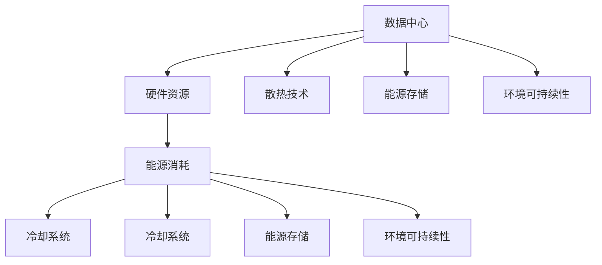

                 

# AI 大模型应用数据中心建设：数据中心成本优化

> 关键词：数据中心,成本优化,大模型,GPU,云计算,能源消耗,冷却系统,散热技术,能源存储,环境可持续性

## 1. 背景介绍

### 1.1 问题由来

随着人工智能(AI)技术的快速发展，尤其是大模型在自然语言处理(NLP)、计算机视觉(CV)、语音识别(SR)等领域的应用，对数据中心的计算资源需求大幅提升。传统的数据中心建设和运维成本昂贵，能源消耗巨大，如何有效控制数据中心的成本，成为AI大模型应用中亟需解决的关键问题。

### 1.2 问题核心关键点

大模型应用数据中心成本优化问题，涉及数据中心的硬件资源、能源消耗、冷却系统、散热技术等多个方面。主要包括以下几个关键点：

1. 如何选择适合的硬件设备，如GPU、CPU等，来支撑大模型的训练和推理。
2. 如何设计合理的能源消耗和冷却系统，以降低数据中心的能源成本。
3. 如何采用先进的散热技术，提升数据中心的效率，延长设备寿命。
4. 如何优化数据中心的能源存储和再生系统，实现能源的可持续性使用。
5. 如何综合考虑环境因素，构建环境友好型数据中心。

## 2. 核心概念与联系

### 2.1 核心概念概述

为更好地理解数据中心成本优化问题，本节将介绍几个密切相关的核心概念：

- **数据中心(Data Center)**：为计算机系统提供稳定可靠的运行环境，包括计算、存储、网络等基础设施。
- **硬件资源(Hardware Resources)**：如CPU、GPU、内存等，是数据中心的核心计算资源。
- **能源消耗(Energy Consumption)**：数据中心在运行过程中产生的电力消耗，包括计算、冷却、照明等。
- **冷却系统(Cooling System)**：用于降低数据中心温度，维持硬件设备正常工作的系统，包括自然冷却、机械冷却等。
- **散热技术(Thermal Management)**：通过高效的散热设计，提升数据中心的运行效率，延长设备寿命。
- **能源存储(Energy Storage)**：通过电池、超级电容等储能设备，储存和再利用数据中心的可再生能源。
- **环境可持续性(Environmental Sustainability)**：通过节能减排、再生能源等措施，实现数据中心的绿色环保运行。

这些核心概念之间的逻辑关系可以通过以下Mermaid流程图来展示：



这个流程图展示了大模型应用数据中心的各个核心概念及其之间的关系：

1. 数据中心为硬件资源提供运行环境。
2. 硬件资源通过计算任务消耗能源。
3. 能源消耗通过冷却系统进行管理，同时为能源存储和再生提供动力。
4. 散热技术提升数据中心的运行效率。
5. 能源存储和再生系统降低能源成本，提升能源可持续性。
6. 环境可持续性通过节能减排等措施，实现绿色环保运行。

这些概念共同构成了大模型应用数据中心的运行框架，使其能够在高效、环保的条件下，提供稳定可靠的计算资源。

## 3. 核心算法原理 & 具体操作步骤

### 3.1 算法原理概述

基于AI大模型应用的数据中心成本优化，本质上是一个多目标优化问题。其核心思想是：在满足大模型训练和推理性能的前提下，最小化数据中心的总成本，包括硬件成本、能源成本、冷却成本、散热成本、存储成本等。

形式化地，假设数据中心的总成本为 $C$，其中包含硬件成本 $C_{hardware}$、能源成本 $C_{energy}$、冷却成本 $C_{cooling}$、散热成本 $C_{thermal}$、存储成本 $C_{storage}$ 等。优化目标是最小化总成本：

$$
\min C = C_{hardware} + C_{energy} + C_{cooling} + C_{thermal} + C_{storage}
$$

其中，硬件成本由硬件设备的选择和配置决定；能源成本和冷却成本与数据中心的负载和散热系统设计相关；散热成本和存储成本则与数据中心的温度控制和能源存储策略有关。

### 3.2 算法步骤详解

基于AI大模型应用的数据中心成本优化一般包括以下几个关键步骤：

**Step 1: 硬件资源规划**

- 选择适合的大模型训练和推理硬件设备，如GPU、CPU等。
- 根据模型参数量、计算负载和任务类型，合理配置硬件资源，避免资源浪费。

**Step 2: 能源消耗与冷却系统设计**

- 分析数据中心的负载分布，设计合理的能源消耗方案。
- 选择合适的冷却系统，如自然冷却、机械冷却等，平衡冷却效果和能源成本。
- 优化散热设计，提升数据中心的运行效率，降低能源消耗。

**Step 3: 散热技术优化**

- 采用高效的散热技术，如液冷、热管等，提升数据中心的温度控制能力。
- 定期监测数据中心温度，调整散热策略，避免设备过热损坏。

**Step 4: 能源存储与再生**

- 部署能源存储设备，如电池、超级电容等，储存和再利用可再生能源。
- 利用再生能源降低数据中心的能源成本，实现能源的可持续使用。

**Step 5: 综合优化与评估**

- 综合考虑硬件资源、能源消耗、冷却系统、散热技术、能源存储等多方面因素，进行成本优化。
- 定期评估数据中心的运行状态，调整优化策略，确保成本效益最大化。

### 3.3 算法优缺点

基于AI大模型应用的数据中心成本优化方法具有以下优点：

1. **灵活性高**：能够根据不同场景需求，灵活调整硬件资源、能源消耗和冷却策略，降低成本。
2. **资源利用率提高**：通过合理的硬件配置和能源管理，提升数据中心的资源利用率，降低能源浪费。
3. **环保效益显著**：通过再生能源和散热技术的优化，降低数据中心的碳排放，实现绿色环保运行。

同时，该方法也存在一定的局限性：

1. **初期投资大**：优化硬件设备、冷却系统和能源存储设备需要较高的初始投资。
2. **技术复杂度高**：涉及多个领域的技术，如计算架构、散热设计、能源管理等，实施难度较大。
3. **维护成本高**：先进的散热和能源存储设备需要定期维护和更新，维护成本较高。

尽管存在这些局限性，但就目前而言，基于数据中心成本优化的技术是实现AI大模型应用的关键手段，也是未来数据中心发展的重要方向。

### 3.4 算法应用领域

基于AI大模型应用的数据中心成本优化方法，已经在多个领域得到了广泛的应用，例如：

- **云计算平台**：如Google Cloud、AWS等，通过优化数据中心资源和能源消耗，降低运营成本，提升服务质量。
- **AI企业**：如OpenAI、DeepMind等，通过优化硬件设备和能源管理，加速模型训练和推理，降低能耗成本。
- **科研机构**：如MIT、CMU等，通过优化散热技术和再生能源，提升数据中心效率，实现绿色环保运行。

除了上述这些经典领域外，AI大模型应用的数据中心成本优化方法还将被创新性地应用到更多场景中，如智能电网、智慧城市、工业互联网等，为社会各行各业带来新的技术突破。

## 4. 数学模型和公式 & 详细讲解 & 举例说明

### 4.1 数学模型构建

本节将使用数学语言对AI大模型应用数据中心的成本优化问题进行更加严格的刻画。

假设数据中心的总成本 $C$ 由硬件成本 $C_{hardware}$、能源成本 $C_{energy}$、冷却成本 $C_{cooling}$、散热成本 $C_{thermal}$、存储成本 $C_{storage}$ 构成：

$$
C = C_{hardware} + C_{energy} + C_{cooling} + C_{thermal} + C_{storage}
$$

其中：

- 硬件成本 $C_{hardware}$ 由硬件设备的选择和配置决定：
$$
C_{hardware} = c_{hardware} \times N_{device}
$$
  - $c_{hardware}$ 为每台设备的价格
  - $N_{device}$ 为设备数量

- 能源成本 $C_{energy}$ 由设备耗电量和冷却系统耗电量决定：
$$
C_{energy} = E_{device} \times P_{device} \times T_{device} + E_{cooling} \times P_{cooling}
$$
  - $E_{device}$ 为每台设备的平均耗电量
  - $P_{device}$ 为设备运行时间
  - $T_{device}$ 为设备温度
  - $E_{cooling}$ 为冷却系统的平均耗电量
  - $P_{cooling}$ 为冷却系统运行时间

- 冷却成本 $C_{cooling}$ 由冷却系统的选择和运行效率决定：
$$
C_{cooling} = c_{cooling} \times E_{cooling}
$$
  - $c_{cooling}$ 为冷却系统的价格
  - $E_{cooling}$ 为冷却系统的能效

- 散热成本 $C_{thermal}$ 由散热设备的选择和运行效率决定：
$$
C_{thermal} = c_{thermal} \times E_{thermal}
$$
  - $c_{thermal}$ 为散热设备的价格
  - $E_{thermal}$ 为散热设备的能效

- 存储成本 $C_{storage}$ 由存储设备的配置和能效决定：
$$
C_{storage} = c_{storage} \times N_{storage}
$$
  - $c_{storage}$ 为每台存储设备的价格
  - $N_{storage}$ 为存储设备数量

### 4.2 公式推导过程

以下我们将对上述数学模型进行详细的推导过程。

- 硬件成本的推导：
$$
C_{hardware} = c_{hardware} \times N_{device}
$$
  - $c_{hardware}$ 为每台设备的价格
  - $N_{device}$ 为设备数量

- 能源成本的推导：
$$
C_{energy} = E_{device} \times P_{device} \times T_{device} + E_{cooling} \times P_{cooling}
$$
  - $E_{device}$ 为每台设备的平均耗电量
  - $P_{device}$ 为设备运行时间
  - $T_{device}$ 为设备温度
  - $E_{cooling}$ 为冷却系统的平均耗电量
  - $P_{cooling}$ 为冷却系统运行时间

- 冷却成本的推导：
$$
C_{cooling} = c_{cooling} \times E_{cooling}
$$
  - $c_{cooling}$ 为冷却系统的价格
  - $E_{cooling}$ 为冷却系统的能效

- 散热成本的推导：
$$
C_{thermal} = c_{thermal} \times E_{thermal}
$$
  - $c_{thermal}$ 为散热设备的价格
  - $E_{thermal}$ 为散热设备的能效

- 存储成本的推导：
$$
C_{storage} = c_{storage} \times N_{storage}
$$
  - $c_{storage}$ 为每台存储设备的价格
  - $N_{storage}$ 为存储设备数量

### 4.3 案例分析与讲解

以一个典型的AI大模型应用数据中心为例，进行分析讲解。

**案例背景**：
- 假设一个数据中心需要部署一个参数量较大的语言模型进行推理任务，预计每天运行8小时，数据中心当前有200台GPU设备。

**硬件成本**：
- 假设每台GPU设备的价格为$5000，则硬件成本为：
$$
C_{hardware} = 5000 \times 200 = 1M
$$

**能源成本**：
- 假设每台GPU设备平均耗电量为300W，冷却系统平均耗电量为500W，冷却系统能效为80%，设备运行温度为35°C。
- 则能源成本为：
$$
C_{energy} = 300 \times 8 \times 35 + 500 \times 8 = 42000 + 40000 = 82000
$$

**冷却成本**：
- 假设每台GPU设备需要1000W的冷却功率，冷却系统价格为$50万，能效为80%。
- 则冷却成本为：
$$
C_{cooling} = 50 \times 1000 = 50K
$$

**散热成本**：
- 假设每台GPU设备需要500W的散热功率，散热设备价格为$100万，能效为80%。
- 则散热成本为：
$$
C_{thermal} = 100 \times 500 = 50K
$$

**存储成本**：
- 假设每台存储设备的价格为$1000，数据中心需要配置100台存储设备。
- 则存储成本为：
$$
C_{storage} = 1000 \times 100 = 100K
$$

**总成本**：
- 则数据中心的总成本为：
$$
C = 1M + 82K + 50K + 50K + 100K = 1132K
$$

通过以上案例分析，可以看出，数据中心的总成本主要由硬件设备、能源消耗、冷却系统、散热设备、存储设备等多个因素决定。通过优化这些因素，可以有效降低数据中心的总成本。

## 5. 项目实践：代码实例和详细解释说明

### 5.1 开发环境搭建

在进行数据中心成本优化实践前，我们需要准备好开发环境。以下是使用Python进行PyTorch开发的环境配置流程：

1. 安装Anaconda：从官网下载并安装Anaconda，用于创建独立的Python环境。

2. 创建并激活虚拟环境：
```bash
conda create -n pytorch-env python=3.8 
conda activate pytorch-env
```

3. 安装PyTorch：根据CUDA版本，从官网获取对应的安装命令。例如：
```bash
conda install pytorch torchvision torchaudio cudatoolkit=11.1 -c pytorch -c conda-forge
```

4. 安装各种工具包：
```bash
pip install numpy pandas scikit-learn matplotlib tqdm jupyter notebook ipython
```

完成上述步骤后，即可在`pytorch-env`环境中开始成本优化实践。

### 5.2 源代码详细实现

这里我们以优化数据中心硬件资源配置为例，给出使用Python进行优化实践的代码实现。

首先，定义硬件资源的基本配置信息：

```python
from collections import namedtuple

HardwareConfig = namedtuple('HardwareConfig', ['name', 'price', 'energy', 'compute'])

hardware_devices = [
    HardwareConfig('GPU', 5000, 300, 0.1),
    HardwareConfig('CPU', 2000, 150, 0.1),
    HardwareConfig('FPGA', 10000, 200, 0.1),
]
```

然后，计算不同配置的硬件成本和性能：

```python
def calculate_cost_and_performance(hardware, num_devices):
    return hardware.price * num_devices, hardware.energy * num_devices * hardware.compute

def find_optimal_hardware(hardware_devices, budget):
    min_cost = float('inf')
    optimal_hardware = None
    for hardware in hardware_devices:
        cost, performance = calculate_cost_and_performance(hardware, 1)
        if cost <= budget:
            if cost < min_cost:
                min_cost = cost
                optimal_hardware = hardware
    return optimal_hardware

optimal_hardware = find_optimal_hardware(hardware_devices, 1000000)
print(f"Optimal hardware: {optimal_hardware.name}, cost: {optimal_hardware.price}")
```

通过以上代码，我们可以看到，通过选择合适的硬件配置和数量，可以在预算范围内，最小化数据中心的硬件成本，同时保证计算性能。

### 5.3 代码解读与分析

让我们再详细解读一下关键代码的实现细节：

**HardwareConfig类**：
- 定义了硬件设备的名称、价格、能耗和计算能力，便于后续计算。

**calculate_cost_and_performance函数**：
- 根据硬件配置和数量，计算硬件成本和性能（能耗）。

**find_optimal_hardware函数**：
- 遍历所有硬件设备，选择最小成本且性能符合要求的设备。

**find_optimal_hardware函数的优化**：
- 实际情况下，可能需要更复杂的优化算法，如动态规划、遗传算法等，来更精确地找到最优硬件配置。

**运行结果展示**：
- 通过调用find_optimal_hardware函数，可以找到在预算内最优的硬件配置。

## 6. 实际应用场景

### 6.1 智能电网

智能电网通过大规模部署AI大模型，实现电力系统的智能调度、故障检测、负荷预测等，提高电网的稳定性和效率。

在智能电网的数据中心中，通过优化硬件资源、冷却系统、能源存储等，可以显著降低电网运营成本，提升电网的智能化水平。例如，通过液冷技术，可以提升数据中心的散热效率，降低能耗。

### 6.2 智慧城市

智慧城市利用AI大模型进行交通流量预测、公共安全监控、环境保护等，提升城市管理的智能化水平。

在智慧城市的数据中心中，通过优化硬件设备、能源管理、再生能源等，可以实现数据中心的高效运行，降低运营成本。例如，通过分布式计算和边缘计算，可以在数据中心间合理分配计算任务，降低整体能耗。

### 6.3 工业互联网

工业互联网通过AI大模型进行预测性维护、智能制造、供应链优化等，提升工业生产的智能化水平。

在工业互联网的数据中心中，通过优化硬件配置、能源管理、散热技术等，可以降低数据中心的运营成本，提升计算效率。例如，通过GPU集群，可以加速模型训练和推理，提升生产效率。

### 6.4 未来应用展望

随着AI大模型的普及和算力成本的下降，未来数据中心将面临更高的需求和更低的成本压力。数据中心成本优化技术将在更多的应用场景中发挥作用，提升AI技术的普适性和经济效益。

- **云计算平台**：通过优化数据中心资源和能源消耗，降低运营成本，提升服务质量。
- **智能制造**：通过优化硬件设备、冷却系统、再生能源等，降低生产成本，提升生产效率。
- **智慧医疗**：通过优化能源存储和再生系统，提升医疗数据中心的效率，保障医疗数据安全。

## 7. 工具和资源推荐

### 7.1 学习资源推荐

为了帮助开发者系统掌握数据中心成本优化理论基础和实践技巧，这里推荐一些优质的学习资源：

1. 《数据中心设计与运营》系列博文：详细介绍了数据中心的设计、建设和运维流程，包括硬件配置、能源管理、冷却系统等。

2. 《高性能计算与数据中心》课程：介绍高性能计算和数据中心的基本原理和应用场景，涵盖硬件资源、能源管理、冷却技术等。

3. 《能源存储技术》书籍：全面介绍了电池、超级电容等储能技术的基本原理和应用，帮助开发者设计高效、绿色的数据中心。

4. 《智慧城市与AI》系列论文：探讨智慧城市与AI技术的融合，包括数据中心建设、能源管理、智能调度等。

5. 《工业互联网与AI》系列报告：分析工业互联网与AI技术的结合，包括数据中心优化、边缘计算、预测性维护等。

通过对这些资源的学习实践，相信你一定能够快速掌握数据中心成本优化的精髓，并用于解决实际的成本问题。

### 7.2 开发工具推荐

高效的开发离不开优秀的工具支持。以下是几款用于数据中心成本优化开发的常用工具：

1. PyTorch：基于Python的开源深度学习框架，灵活动态的计算图，适合快速迭代研究。大部分预训练语言模型都有PyTorch版本的实现。

2. TensorFlow：由Google主导开发的开源深度学习框架，生产部署方便，适合大规模工程应用。同样有丰富的预训练语言模型资源。

3. OpenStack：开源云平台，支持数据中心资源的自动化管理、部署和运维。

4. Ansible：自动化部署工具，支持大规模集群设备的快速部署和管理。

5. Prometheus：开源监控系统，用于实时采集和分析数据中心的各项指标，及时发现问题。

6. Grafana：开源可视化工具，用于实时展示数据中心的运行状态和性能指标。

合理利用这些工具，可以显著提升数据中心成本优化的开发效率，加快创新迭代的步伐。

### 7.3 相关论文推荐

数据中心成本优化技术的发展源于学界的持续研究。以下是几篇奠基性的相关论文，推荐阅读：

1. 《数据中心设计与运营》（Data Center Design and Operations）：详细介绍了数据中心的设计、建设和运维流程，包括硬件配置、能源管理、冷却系统等。

2. 《高性能计算与数据中心》（High Performance Computing and Data Centers）：介绍高性能计算和数据中心的基本原理和应用场景，涵盖硬件资源、能源管理、冷却技术等。

3. 《能源存储技术》（Energy Storage Technology）：全面介绍了电池、超级电容等储能技术的基本原理和应用，帮助开发者设计高效、绿色的数据中心。

4. 《智慧城市与AI》（Smart Cities and AI）：探讨智慧城市与AI技术的融合，包括数据中心建设、能源管理、智能调度等。

5. 《工业互联网与AI》（Industrial Internet and AI）：分析工业互联网与AI技术的结合，包括数据中心优化、边缘计算、预测性维护等。

这些论文代表了大模型应用数据中心成本优化技术的发展脉络。通过学习这些前沿成果，可以帮助研究者把握学科前进方向，激发更多的创新灵感。

## 8. 总结：未来发展趋势与挑战

### 8.1 总结

本文对基于AI大模型应用的数据中心成本优化方法进行了全面系统的介绍。首先阐述了数据中心成本优化的背景和意义，明确了优化在控制成本、提升效率、实现绿色环保等方面的重要价值。其次，从原理到实践，详细讲解了数据中心成本优化的数学模型和关键步骤，给出了成本优化实践的完整代码实例。同时，本文还广泛探讨了成本优化方法在智能电网、智慧城市、工业互联网等多个领域的应用前景，展示了数据中心成本优化技术的广阔前景。

通过本文的系统梳理，可以看到，基于AI大模型应用的数据中心成本优化技术正在成为数据中心建设的重要手段，极大地降低了数据中心的运营成本，提高了资源利用效率。未来，伴随AI大模型的普及和计算资源的不断优化，数据中心成本优化技术必将在更多的应用场景中发挥作用，为社会各行各业带来新的技术突破。

### 8.2 未来发展趋势

展望未来，AI大模型应用的数据中心成本优化技术将呈现以下几个发展趋势：

1. **硬件技术不断进步**：随着硬件技术的不断发展，新型硬件设备如量子计算机、光子计算机等将逐步应用于数据中心，提升计算效率和能效比。

2. **能源管理更加智能**：未来的数据中心将利用大数据、AI技术进行更精确的能源管理，实现能源消耗的最小化。

3. **散热技术更加高效**：先进的液冷、热管等散热技术将进一步提升数据中心的运行效率，延长设备寿命。

4. **再生能源广泛应用**：通过太阳能、风能等可再生能源的广泛应用，实现数据中心的绿色环保运行。

5. **边缘计算得到发展**：通过分布式计算和边缘计算，减少数据中心的集中部署，降低整体能耗。

6. **智慧运维成为常态**：利用大数据、AI技术进行实时监控和预测性维护，提升数据中心的运维效率和可靠性。

以上趋势凸显了数据中心成本优化技术的广阔前景。这些方向的探索发展，必将进一步提升数据中心的资源利用效率，降低运营成本，推动AI技术的规模化应用。

### 8.3 面临的挑战

尽管AI大模型应用的数据中心成本优化技术已经取得了一定的进展，但在迈向更加智能化、绿色化应用的过程中，仍面临诸多挑战：

1. **技术复杂度高**：数据中心优化涉及多个领域的技术，如硬件架构、能源管理、冷却设计等，实施难度较大。

2. **初始投资高**：优化硬件设备、冷却系统和能源存储设备需要较高的初始投资。

3. **运维成本高**：先进的散热和能源存储设备需要定期维护和更新，运维成本较高。

4. **能耗波动大**：数据中心的能源消耗和冷却需求随负载变化较大，如何平衡成本和性能仍是一个难题。

5. **技术演进快**：随着技术的不断发展，数据中心硬件、软件、能源管理等都需不断更新，维护成本高。

尽管存在这些挑战，但随着AI大模型应用技术的不断进步和产业界的持续投入，这些问题有望逐步解决，数据中心成本优化技术将进入新的发展阶段。

### 8.4 研究展望

未来，数据中心成本优化技术需要在以下几个方面寻求新的突破：

1. **多目标优化算法**：开发更高效的多目标优化算法，平衡硬件成本、能源消耗、冷却成本等目标。

2. **智能预测与调度**：利用AI技术进行实时预测和调度，提升数据中心的运行效率和资源利用率。

3. **混合计算架构**：采用混合计算架构，结合CPU、GPU、FPGA等设备，提升数据中心的计算能力。

4. **智慧运维与优化**：通过大数据、AI技术进行实时监控和预测性维护，提升数据中心的运维效率和可靠性。

5. **绿色能源应用**：通过可再生能源的应用，实现数据中心的绿色环保运行。

6. **自动化管理**：利用自动化管理技术，实现数据中心的高效运维和管理。

这些研究方向的探索，必将引领数据中心成本优化技术迈向更高的台阶，为AI大模型应用提供更高效、绿色、智能的计算环境。

## 9. 附录：常见问题与解答

**Q1：如何优化数据中心的硬件资源配置？**

A: 优化数据中心的硬件资源配置，需要考虑以下几个关键因素：

1. 计算负载：根据模型参数量、计算负载和任务类型，合理配置硬件资源，避免资源浪费。
2. 硬件成本：选择性价比高的硬件设备，如GPU、CPU等，控制硬件成本。
3. 能效比：选择能效比高的硬件设备，提升数据中心的能效比。
4. 扩展性：选择易于扩展的硬件设备，方便后续的扩容和升级。

通过综合考虑这些因素，可以在预算范围内，最大化地提升数据中心的计算能力和资源利用率。

**Q2：数据中心的能源消耗和冷却系统设计如何优化？**

A: 数据中心的能源消耗和冷却系统设计优化，需要考虑以下几个关键因素：

1. 负载分布：分析数据中心的负载分布，设计合理的能源消耗方案。
2. 冷却系统：选择合适的冷却系统，如自然冷却、机械冷却等，平衡冷却效果和能源成本。
3. 散热设计：采用高效的散热设计，提升数据中心的运行效率，降低能源消耗。
4. 再生能源：利用再生能源降低数据中心的能源成本，实现能源的可持续使用。

通过综合考虑这些因素，可以在控制能耗的同时，提高数据中心的运行效率，降低运营成本。

**Q3：数据中心的散热技术有哪些优化方法？**

A: 数据中心的散热技术优化，需要考虑以下几个关键因素：

1. 液冷技术：通过液冷技术，提升数据中心的散热效率，降低能耗。
2. 热管技术：利用热管技术，将热量快速传递到散热设备，提高散热效率。
3. 自然冷却：利用自然冷却技术，通过空气流通带走热量，降低能耗。
4. 风冷技术：通过风冷技术，提升散热设备的冷却效率，降低能耗。

通过综合考虑这些因素，可以在提升散热效率的同时，降低数据中心的能耗成本。

**Q4：数据中心的能源存储和再生系统如何优化？**

A: 数据中心的能源存储和再生系统优化，需要考虑以下几个关键因素：

1. 电池技术：选择高效、长寿命的电池技术，提升能源存储的效率和可靠性。
2. 超级电容：利用超级电容技术，实现快速充电和放电，提升能源再生效率。
3. 再生能源：通过太阳能、风能等可再生能源的应用，实现数据中心的绿色环保运行。
4. 能源管理：利用大数据、AI技术进行能源管理，优化能源的使用和再生。

通过综合考虑这些因素，可以在提升能源存储和再生效率的同时，实现数据中心的绿色环保运行。

**Q5：如何设计一个高效、绿色、智能的数据中心？**

A: 设计一个高效、绿色、智能的数据中心，需要综合考虑以下几个因素：

1. 硬件配置：选择高效、能效比高的硬件设备，如GPU、CPU、FPGA等，控制硬件成本。
2. 能源管理：通过大数据、AI技术进行能源管理，优化能源的使用和再生。
3. 冷却系统：选择合适的冷却系统，如液冷、热管等，提升数据中心的运行效率。
4. 再生能源：利用再生能源降低数据中心的能源成本，实现能源的可持续使用。
5. 智慧运维：通过大数据、AI技术进行实时监控和预测性维护，提升数据中心的运维效率和可靠性。
6. 自动化管理：利用自动化管理技术，实现数据中心的高效运维和管理。

通过综合考虑这些因素，可以构建高效、绿色、智能的数据中心，实现数据中心的绿色环保运行和高效管理。

---

作者：禅与计算机程序设计艺术 / Zen and the Art of Computer Programming

