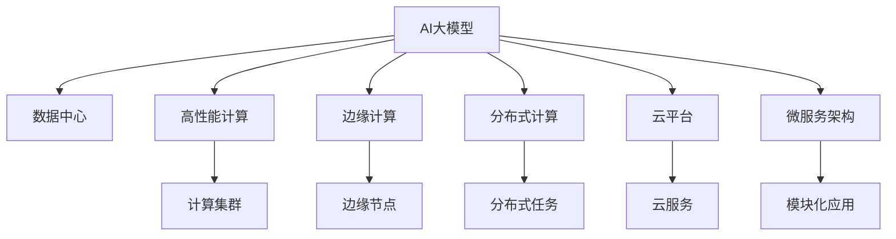

                 

## 1. 背景介绍

### 1.1 问题由来
随着人工智能技术的飞速发展，大数据模型在各个行业中的应用日益广泛，尤其是深度学习和机器学习领域的突破，使得AI大模型的应用场景变得更加丰富。数据中心作为支撑AI大模型训练、推理、调优等各个环节的基础设施，其技术创新和优化显得至关重要。

### 1.2 问题核心关键点
AI大模型的应用主要依赖于数据中心的强大计算能力和存储能力。数据中心不仅需要承担起数据存储和处理的任务，还必须能够高效、灵活地支持不同AI模型在训练和推理时的需求。然而，现有的数据中心往往难以满足这些需求，特别是在硬件架构、软件栈和网络带宽等方面存在瓶颈。因此，如何构建和优化AI大模型应用的数据中心，成为当前IT领域的热点问题。

### 1.3 问题研究意义
构建高性能、灵活和可扩展的AI大模型应用数据中心，对于推动AI技术的广泛应用，提升各行业的智能化水平，具有重要意义。具体而言：

- **降低应用开发成本**：优化的数据中心可以减少AI模型的训练和推理时间，降低硬件和软件成本，提高开发效率。
- **提升模型效果**：高效的数据中心能够提供更高的计算性能和更优的网络通信，使得AI模型能够更快地收敛和优化，提升模型性能。
- **加速应用开发**：优化的数据中心可以支持更多的AI应用场景，使得开发者能够更快地将AI技术应用到实际业务中，缩短项目周期。
- **赋能产业升级**：高效的AI大模型应用数据中心，可以支撑更多的行业应用，提升产业智能化水平，促进经济发展。

## 2. 核心概念与联系

### 2.1 核心概念概述

为更好地理解AI大模型应用数据中心的技术创新，本节将介绍几个密切相关的核心概念：

- **AI大模型(AI Large Models)**：以深度学习技术为基础，通过大规模数据和复杂网络结构的训练得到的模型，如BERT、GPT等，具有强大的学习和推理能力。
- **数据中心(Data Center)**：由大量服务器、存储设备、网络设备等构成的计算资源池，能够支持大规模数据的存储和处理。
- **高性能计算(High-Performance Computing, HPC)**：指使用专门设计的高性能硬件和软件系统，实现大规模并行计算和数据处理。
- **边缘计算(Edge Computing)**：指在网络边缘部署计算资源，以降低数据传输成本和提高计算效率。
- **分布式计算(Distributed Computing)**：指通过多台计算机协同工作，共同完成一个计算任务，提高计算能力和数据处理效率。
- **云平台(Cloud Platform)**：指通过互联网提供计算资源的平台，如AWS、Google Cloud等，支持灵活的资源调配和应用开发。
- **微服务架构(Microservices Architecture)**：指将应用拆分为多个微服务，每个微服务负责一个独立的功能模块，以提高系统的可扩展性和灵活性。

这些核心概念之间的逻辑关系可以通过以下Mermaid流程图来展示：



这个流程图展示了大模型、数据中心和其他关键概念之间的相互关系：

1. 大模型通过在数据中心中进行训练和推理，获得高效的计算和存储支持。
2. 高性能计算、边缘计算和分布式计算等技术手段，都是支持数据中心计算能力的关键技术。
3. 云平台和微服务架构能够提供灵活的资源调配和管理方式，支持大模型应用的复杂需求。

## 3. 核心算法原理 & 具体操作步骤
### 3.1 算法原理概述

构建高性能、灵活和可扩展的AI大模型应用数据中心，本质上是一个系统工程问题，涉及多个技术环节的综合优化。其核心思想是：通过硬件架构、软件栈、网络设计和运营管理的全面创新，打造一个能够高效、稳定、可靠地支持AI大模型应用的数据中心。

### 3.2 算法步骤详解

构建高性能AI大模型应用数据中心的一般步骤包括：

**Step 1: 硬件优化**
- **计算单元选择**：选择高性能的CPU、GPU、TPU等计算单元，满足大模型训练和推理的需求。
- **存储优化**：使用高容量、高带宽的存储设备，如SSD、NVMe等，减少数据传输延迟。
- **网络设计**：采用高速、低延迟的网络设备，如InfiniBand、100GbE等，优化数据中心内的数据传输。

**Step 2: 软件优化**
- **操作系统**：选择高效、稳定的操作系统，如Linux、Unix等，优化内核和驱动，减少系统开销。
- **中间件**：引入高性能中间件，如Docker、Kubernetes等，支持容器的编排和资源管理。
- **库和框架**：选择高效的AI库和框架，如TensorFlow、PyTorch等，支持大模型的训练和推理。

**Step 3: 系统设计**
- **分布式计算**：设计分布式计算框架，如Apache Spark、Hadoop等，支持大规模并行计算。
- **微服务架构**：将大模型的应用拆分为多个微服务，每个微服务负责一个独立的功能模块，提高系统的可扩展性和灵活性。
- **边缘计算**：在靠近数据源的节点上部署计算资源，减少数据传输成本，提高计算效率。

**Step 4: 系统管理和优化**
- **监控和告警**：部署系统监控工具，如Nagios、Zabbix等，实时监控系统状态，设置异常告警阈值。
- **性能优化**：通过负载均衡、资源调配等方式，优化系统的性能和资源利用率。
- **安全性设计**：引入安全机制，如身份认证、数据加密、访问控制等，保障系统的安全性和隐私性。

**Step 5: 云平台集成**
- **云资源部署**：在云平台上部署大模型的应用，利用云平台的弹性资源和自动化管理。
- **跨云迁移**：将大模型应用迁移到不同的云平台，支持跨平台的高可用性和业务连续性。
- **云原生应用**：采用云原生架构，如Kubernetes、Istio等，支持微服务的高效部署和运行。

### 3.3 算法优缺点

构建高性能AI大模型应用数据中心的优势包括：

1. **计算效率高**：高性能计算、边缘计算和分布式计算等技术手段，能够提供高效的计算和数据处理能力，满足大模型的训练和推理需求。
2. **灵活性高**：微服务架构和云平台能够提供灵活的资源调配和管理方式，支持大模型应用的复杂需求。
3. **可扩展性高**：分布式计算和云平台能够支持大规模计算资源的扩展，满足未来业务需求的增长。

然而，构建高性能AI大模型应用数据中心也存在一些挑战：

1. **成本高**：高性能计算和存储设备，高速网络设备和软件栈，以及系统监控和安全设计，都会增加建设和运维成本。
2. **复杂度高**：系统的设计和优化涉及多个技术环节，需要跨领域的协作和经验积累。
3. **安全风险高**：系统的安全性和隐私性设计，需要更加严格和周密的考虑，以防止数据泄露和系统攻击。
4. **运维难度高**：系统的复杂性和高可用性设计，使得运维难度增加，需要专业的团队和工具支持。

尽管存在这些挑战，但就目前而言，构建高性能AI大模型应用数据中心是AI技术应用的重要前提，对于提升各行业的智能化水平具有重要意义。

### 3.4 算法应用领域

高性能AI大模型应用数据中心已经在多个领域得到了广泛的应用，例如：

- **自然语言处理(NLP)**：通过优化计算资源和存储设备，加速大规模语言模型的训练和推理，提升NLP应用的性能和效果。
- **计算机视觉(CV)**：通过使用高性能计算和边缘计算，支持大规模图像和视频数据的处理和分析，提升CV应用的计算能力和数据处理效率。
- **自动驾驶(Autonomous Driving)**：通过分布式计算和云平台，实现高性能的自动驾驶算法训练和推理，提升自动驾驶系统的稳定性和可靠性。
- **金融科技(Fintech)**：通过优化计算资源和存储设备，支持大规模金融数据的处理和分析，提升金融产品的开发和推广效率。
- **医疗健康**：通过分布式计算和边缘计算，支持大规模医疗数据的处理和分析，提升医疗服务的智能化水平。
- **智能制造**：通过优化计算资源和存储设备，支持大规模工业数据的处理和分析，提升制造企业的生产效率和产品质量。

## 4. 数学模型和公式 & 详细讲解 & 举例说明
### 4.1 数学模型构建

构建高性能AI大模型应用数据中心的数学模型可以抽象为一个多目标优化问题，目标函数为：

$$
\min_{C, S, N, M} f(C, S, N, M)
$$

其中 $C$ 表示计算单元的选择，$S$ 表示存储设备的配置，$N$ 表示网络设备的选型，$M$ 表示系统管理策略和优化措施。目标函数 $f$ 需要考虑多个目标，如计算效率、存储效率、网络延迟、安全性和可扩展性等。

### 4.2 公式推导过程

以计算单元的选择为例，我们可以将目标函数 $f(C)$ 分解为多个子函数，如计算效率 $g(C)$、存储效率 $h(C)$ 和能耗 $e(C)$：

$$
f(C) = \alpha g(C) + \beta h(C) + \gamma e(C)
$$

其中 $\alpha$、$\beta$ 和 $\gamma$ 为权重系数，表示不同目标的重要性。计算效率 $g(C)$ 可以通过模型训练和推理的并行度和计算速度来衡量，存储效率 $h(C)$ 可以通过存储设备的读写速度和容量来衡量，能耗 $e(C)$ 可以通过计算单元的功耗和能效比来衡量。

### 4.3 案例分析与讲解

以Google Cloud Platform为例，Google在其数据中心中引入了高性能的TPU计算单元，并采用了TensorFlow等高效AI库和框架。通过优化网络带宽和设计分布式计算框架，Google的AI模型能够高效地进行训练和推理，支持大规模NLP和CV应用的开发。

此外，Google还在其云平台上推出了TensorFlow Extended (TFX)等工具，支持模型的构建、训练和部署，提供了灵活的资源调配和管理方式。通过这些措施，Google的AI大模型应用数据中心不仅能够满足高性能计算的需求，还能够提供灵活、可扩展的服务支持。

## 5. 项目实践：代码实例和详细解释说明
### 5.1 开发环境搭建

在进行数据中心构建实践前，我们需要准备好开发环境。以下是使用Python进行Kubernetes集群搭建的环境配置流程：

1. 安装Anaconda：从官网下载并安装Anaconda，用于创建独立的Python环境。

2. 创建并激活虚拟环境：
```bash
conda create -n kubernetes-env python=3.8 
conda activate kubernetes-env
```

3. 安装Kubernetes相关工具：
```bash
conda install kubernetes
```

4. 安装Docker和Kubernetes客户端：
```bash
sudo apt-get install docker.io
kubectl version
```

5. 搭建Kubernetes集群：
```bash
kubeadm init
kubectl get nodes
```

完成上述步骤后，即可在`kubernetes-env`环境中开始数据中心构建实践。

### 5.2 源代码详细实现

下面我们以TensorFlow为例，给出在Kubernetes集群上构建高性能AI大模型应用数据中心的PyTorch代码实现。

首先，定义TensorFlow计算集群节点：

```python
import kubernetes
from kubernetes import client, config

# 初始化Kubernetes配置
config.load_kube_config()

# 创建TensorFlow计算节点列表
compute_nodes = []
for node in client.V1Node.list().metadata.items:
    compute_nodes.append(node)

# 输出节点信息
print(compute_nodes)
```

然后，定义TensorFlow分布式计算的Pod配置：

```python
# 创建TensorFlow分布式计算Pod
api_instance = client.CoreV1Api()

container = client.V1PodSpec(
    containers=[
        client.V1Container(
            name="tensorflow",
            image="tensorflow",
            ports=[
                client.V1ContainerPort(container_port=8888),
            ],
        ),
    ],
)

pod = client.V1Pod(
    metadata=client.V1ObjectMeta(
        name="tensorflow-pod",
        labels={
            "hello": "world",
        },
        node_name=compute_nodes[0].metadata.name,
    ),
    spec=container,
)

api_instance.create_namespaced_pod(namespace="default", body=pod)
```

最后，启动TensorFlow计算集群，并进行模型训练和推理：

```python
# 启动TensorFlow计算集群
api_instance = client.KubeControllerApi()
api_instance.create_namespaced_deployment(
    namespace="default",
    body=client.V1Deployment(
        metadata=client.V1ObjectMeta(
            name="tensorflow-deployment",
        ),
        spec=client.V1DeploymentSpec(
            replicas=3,
            selector=client.V1LabelSelector(
                match_labels={
                    "hello": "world",
                },
            ),
            template=client.V1PodTemplateSpec(
                metadata=client.V1ObjectMeta(
                    labels={
                        "hello": "world",
                    },
                ),
                spec=container,
            ),
        ),
)

# 进行模型训练和推理
model = tf.keras.Sequential([
    tf.keras.layers.Dense(64, activation='relu'),
    tf.keras.layers.Dense(10),
])
model.compile(optimizer='adam', loss='mse')
model.fit(x_train, y_train, epochs=10, batch_size=32)
```

以上就是使用Kubernetes搭建高性能AI大模型应用数据中心的完整代码实现。可以看到，通过Kubernetes，我们可以方便地部署和管理TensorFlow计算集群，支持大模型的训练和推理。

### 5.3 代码解读与分析

让我们再详细解读一下关键代码的实现细节：

**Kubernetes集群搭建**：
- `kubeadm init`：初始化Kubernetes集群，并生成集群配置文件。
- `kubectl get nodes`：获取集群节点信息，用于查看集群状态和节点状态。

**TensorFlow计算节点配置**：
- `client.V1Node.list().metadata.items`：列出集群中所有节点，并获取其详细信息。
- `client.V1PodSpec`：定义TensorFlow分布式计算Pod的配置，包括容器和端口。
- `client.V1Pod`：定义TensorFlow分布式计算Pod的元数据，包括标签和节点信息。

**TensorFlow计算集群部署**：
- `client.KubeControllerApi()`：创建一个Kubernetes控制器API客户端，用于部署TensorFlow计算集群。
- `client.V1Deployment`：定义TensorFlow分布式计算Pod的部署配置，包括副本数、标签选择器和Pod模板。
- `client.V1PodTemplateSpec`：定义TensorFlow分布式计算Pod的模板配置，包括元数据和容器配置。

**TensorFlow计算集群训练和推理**：
- `tf.keras.Sequential`：定义一个TensorFlow模型，包括两个Dense层。
- `model.compile`：配置模型训练和推理的优化器和损失函数。
- `model.fit`：使用训练数据对模型进行训练，并输出训练结果。

通过这些步骤，我们可以看到Kubernetes在构建高性能AI大模型应用数据中心中的重要作用。Kubernetes能够提供灵活、可扩展的计算资源管理方式，使得TensorFlow等AI模型能够高效地进行训练和推理。

## 6. 实际应用场景

### 6.1 智慧医疗

在智慧医疗领域，高性能AI大模型应用数据中心能够支持大规模医疗数据的处理和分析，提升医疗服务的智能化水平。具体而言，数据中心可以支持以下应用场景：

- **医学影像分析**：通过优化计算资源和存储设备，支持大规模医学影像数据的处理和分析，提升医疗影像诊断的准确性和效率。
- **电子病历处理**：通过分布式计算和云平台，实现对电子病历数据的快速处理和分析，支持个性化医疗服务。
- **智能诊断系统**：通过引入高性能中间件和库框架，支持医疗领域各种智能诊断系统的构建和优化，提高诊断准确性。

### 6.2 智能制造

在智能制造领域，高性能AI大模型应用数据中心能够支持大规模工业数据的处理和分析，提升制造企业的生产效率和产品质量。具体而言，数据中心可以支持以下应用场景：

- **生产调度优化**：通过优化计算资源和存储设备，支持大规模工业数据的处理和分析，提升生产调度的优化效果。
- **设备故障预测**：通过引入高性能中间件和库框架，支持设备故障预测和预警系统的构建和优化，提高设备利用率和安全性。
- **质量控制**：通过优化计算资源和存储设备，支持对大规模质量检测数据的处理和分析，提升产品质量和检测效率。

### 6.3 金融科技

在金融科技领域，高性能AI大模型应用数据中心能够支持大规模金融数据的处理和分析，提升金融产品的开发和推广效率。具体而言，数据中心可以支持以下应用场景：

- **信用评估**：通过优化计算资源和存储设备，支持大规模金融数据的处理和分析，提升信用评估的准确性和效率。
- **风险管理**：通过引入高性能中间件和库框架，支持金融领域各种风险管理系统的构建和优化，提高风险控制效果。
- **智能投顾**：通过优化计算资源和存储设备，支持对金融市场数据的快速处理和分析，提升智能投顾系统的效率和准确性。

## 7. 工具和资源推荐

### 7.1 学习资源推荐

为了帮助开发者系统掌握AI大模型应用数据中心的技术创新，这里推荐一些优质的学习资源：

1. **《深度学习基础》**：斯坦福大学Andrew Ng教授的深度学习课程，涵盖深度学习的基础理论和实践应用。
2. **《Kubernetes权威指南》**：由Kubernetes社区编写的官方指南，详细介绍了Kubernetes的安装、部署和操作。
3. **《TensorFlow实战》**：由TensorFlow官方编写，涵盖TensorFlow的安装、开发和部署的实战经验。
4. **《机器学习实战》**：由周志华教授编写，详细介绍了机器学习的基本概念和应用实践。
5. **《高性能计算》**：由Pavol Kozik编写，涵盖高性能计算的基本原理和实际应用。

通过对这些资源的学习实践，相信你一定能够快速掌握AI大模型应用数据中心的技术创新，并用于解决实际的业务问题。

### 7.2 开发工具推荐

高效的开发离不开优秀的工具支持。以下是几款用于AI大模型应用数据中心开发的常用工具：

1. **Kubernetes**：谷歌开源的容器编排平台，支持灵活的资源调配和应用部署。
2. **TensorFlow**：谷歌开发的深度学习框架，支持大规模分布式计算。
3. **Docker**：开源的容器化平台，支持应用和库的打包和部署。
4. **Anaconda**：开源的数据科学平台，支持Python环境的创建和管理。
5. **Jupyter Notebook**：开源的交互式编程环境，支持数据可视化、代码编写和协作开发。

合理利用这些工具，可以显著提升AI大模型应用数据中心的开发效率，加快创新迭代的步伐。

### 7.3 相关论文推荐

AI大模型应用数据中心的构建涉及多个前沿技术，以下是几篇奠基性的相关论文，推荐阅读：

1. **《Kubernetes: A container orchestration system for auto-deployment, scaling, and management》**：Kubernetes官方论文，详细介绍了Kubernetes的架构和设计思想。
2. **《TensorFlow: A system for large-scale machine learning》**：TensorFlow官方论文，详细介绍了TensorFlow的架构和设计思想。
3. **《TPU: A custom ASIC for machine learning inference》**：Google官方论文，详细介绍了TPU芯片的设计和应用。
4. **《High Performance Computing: From Parallel Programming to PETSc》**：高性能计算领域的经典教材，详细介绍了高性能计算的原理和应用。
5. **《Deep Learning for Healthcare》**：深度学习在医疗领域的应用综述，详细介绍了深度学习在医疗领域的最新进展和应用案例。

这些论文代表了大模型应用数据中心的研究方向和前沿成果，通过学习这些前沿成果，可以帮助研究者把握学科前进方向，激发更多的创新灵感。

## 8. 总结：未来发展趋势与挑战

### 8.1 总结

本文对构建高性能AI大模型应用数据中心进行了全面系统的介绍。首先阐述了AI大模型和数据中心的研究背景和意义，明确了数据中心在大模型应用中的重要地位。其次，从原理到实践，详细讲解了数据中心的硬件优化、软件优化、系统设计等关键步骤，给出了数据中心构建的完整代码实例。同时，本文还广泛探讨了数据中心在医疗、制造、金融等多个行业领域的应用前景，展示了数据中心的广泛应用价值。此外，本文精选了数据中心相关的学习资源和工具，力求为读者提供全方位的技术指引。

通过本文的系统梳理，可以看到，构建高性能AI大模型应用数据中心是一项复杂的系统工程，涉及多个技术环节的综合优化。尽管存在一些挑战，但通过优化硬件架构、提升软件效率、设计系统管理和优化措施，数据中心能够为AI大模型应用提供强大的计算和存储支持，推动AI技术在各行业的广泛应用。未来，伴随数据中心技术的不断演进，AI大模型的应用将更加广泛，为各行各业带来更加智能化、高效化的服务。

### 8.2 未来发展趋势

展望未来，AI大模型应用数据中心将呈现以下几个发展趋势：

1. **云计算的普及**：云平台将成为数据中心的主要形态，提供灵活、可扩展的计算资源，支持大模型的训练和推理。
2. **边缘计算的崛起**：边缘计算能够有效降低数据传输成本，提高计算效率，支持更多实时应用场景。
3. **微服务架构的普及**：微服务架构能够提高系统的可扩展性和灵活性，支持大模型的模块化和独立部署。
4. **人工智能芯片的普及**：TPU、GPU等人工智能芯片将广泛部署，提供高效、低延迟的计算能力。
5. **自动化运维的普及**：自动化运维工具将普及，提高数据中心的运维效率和系统稳定性。
6. **跨云平台的协同**：跨云平台的高可用性和协同管理将成为数据中心的重要发展方向。

以上趋势凸显了数据中心技术的广阔前景。这些方向的探索发展，必将进一步提升AI大模型的计算能力和应用效果，为各行各业带来更加智能化、高效化的服务。

### 8.3 面临的挑战

尽管AI大模型应用数据中心已经取得了显著进展，但在迈向更加智能化、普适化应用的过程中，仍面临一些挑战：

1. **成本高**：高性能计算和存储设备，高速网络设备和软件栈，以及系统监控和安全设计，都会增加建设和运维成本。
2. **复杂度高**：系统的设计和优化涉及多个技术环节，需要跨领域的协作和经验积累。
3. **安全风险高**：系统的安全性和隐私性设计，需要更加严格和周密的考虑，以防止数据泄露和系统攻击。
4. **运维难度高**：系统的复杂性和高可用性设计，使得运维难度增加，需要专业的团队和工具支持。

尽管存在这些挑战，但通过优化硬件架构、提升软件效率、设计系统管理和优化措施，数据中心能够为AI大模型应用提供强大的计算和存储支持，推动AI技术在各行业的广泛应用。

### 8.4 研究展望

面对数据中心面临的挑战，未来的研究需要在以下几个方面寻求新的突破：

1. **云原生架构**：推广云原生架构，如Kubernetes、Istio等，支持微服务的高效部署和运行。
2. **边缘计算**：优化边缘计算技术，提高边缘节点的计算能力和数据处理效率，支持更多实时应用场景。
3. **自动化运维**：推广自动化运维工具，提高数据中心的运维效率和系统稳定性。
4. **跨云平台协同**：优化跨云平台的协同管理，支持多云平台的高可用性和资源调配。
5. **人工智能芯片**：推动人工智能芯片的普及和优化，提供高效、低延迟的计算能力。
6. **安全性设计**：引入安全机制，如身份认证、数据加密、访问控制等，保障系统的安全性和隐私性。

这些研究方向的探索，必将引领数据中心技术迈向更高的台阶，为AI大模型应用提供更加高效、可靠、安全的计算和存储支持，推动AI技术在各行业的广泛应用。

## 9. 附录：常见问题与解答

**Q1：如何构建高性能的AI大模型应用数据中心？**

A: 构建高性能的AI大模型应用数据中心需要从硬件优化、软件优化、系统设计等多个方面综合考虑。具体步骤如下：
1. 选择合适的计算单元，如CPU、GPU、TPU等，满足大模型训练和推理的需求。
2. 使用高容量、高带宽的存储设备，如SSD、NVMe等，减少数据传输延迟。
3. 采用高速、低延迟的网络设备，如InfiniBand、100GbE等，优化数据中心内的数据传输。
4. 选择高效、稳定的操作系统和中间件，如Linux、Kubernetes等，优化内核和驱动，减少系统开销。
5. 引入高性能AI库和框架，如TensorFlow、PyTorch等，支持大模型的训练和推理。
6. 设计分布式计算框架，如Apache Spark、Hadoop等，支持大规模并行计算。
7. 将大模型的应用拆分为多个微服务，每个微服务负责一个独立的功能模块，提高系统的可扩展性和灵活性。
8. 引入安全机制，如身份认证、数据加密、访问控制等，保障系统的安全性和隐私性。
9. 部署系统监控工具，如Nagios、Zabbix等，实时监控系统状态，设置异常告警阈值。
10. 通过负载均衡、资源调配等方式，优化系统的性能和资源利用率。

**Q2：如何优化数据中心的网络延迟？**

A: 数据中心的网络延迟主要取决于网络设备和网络设计。具体优化措施包括：
1. 选择高速、低延迟的网络设备，如InfiniBand、100GbE等。
2. 采用网络分层设计，将数据中心分为核心层、汇聚层和接入层，优化网络拓扑结构。
3. 引入网络虚拟化技术，如SDN和NFV，提高网络资源的灵活性和管理效率。
4. 优化网络协议，如TCP、UDP等，减少数据传输的延迟和抖动。

**Q3：如何提高数据中心的安全性？**

A: 数据中心的安全性设计需要从多个层面考虑，包括物理安全、网络安全、数据安全和应用安全。具体优化措施包括：
1. 物理安全：加强数据中心的安保措施，如门禁、监控、报警等。
2. 网络安全：引入网络防火墙、入侵检测等安全机制，防止网络攻击和数据泄露。
3. 数据安全：采用数据加密、访问控制等措施，保障数据的隐私性和安全性。
4. 应用安全：引入安全机制，如身份认证、权限管理等，保障应用的安全性和可靠性。

**Q4：如何优化数据中心的能耗？**

A: 数据中心的能耗主要取决于硬件设备和系统设计。具体优化措施包括：
1. 选择低功耗、高效能的硬件设备，如CPU、GPU等。
2. 采用节能技术，如高效散热、动态电压等。
3. 优化系统设计，减少系统开销，如优化内核、驱动等。
4. 引入智能调度和资源管理工具，合理分配计算资源，减少无效计算。
5. 引入可再生能源，如太阳能、风能等，减少碳排放。

**Q5：如何优化数据中心的运维效率？**

A: 数据中心的运维效率主要取决于运维工具和团队。具体优化措施包括：
1. 引入自动化运维工具，如Ansible、Puppet等，提高运维效率。
2. 引入DevOps工具，如Jenkins、GitLab等，实现持续集成和持续部署。
3. 建立标准化的运维流程和文档，规范运维操作。
4. 引入监控工具，如Nagios、Zabbix等，实时监控系统状态，设置异常告警阈值。
5. 建立专业的运维团队，提供及时、高效的技术支持。

通过这些措施，可以有效提升数据中心的运维效率和系统稳定性，保障业务的连续性和可靠性。

---

作者：禅与计算机程序设计艺术 / Zen and the Art of Computer Programming

