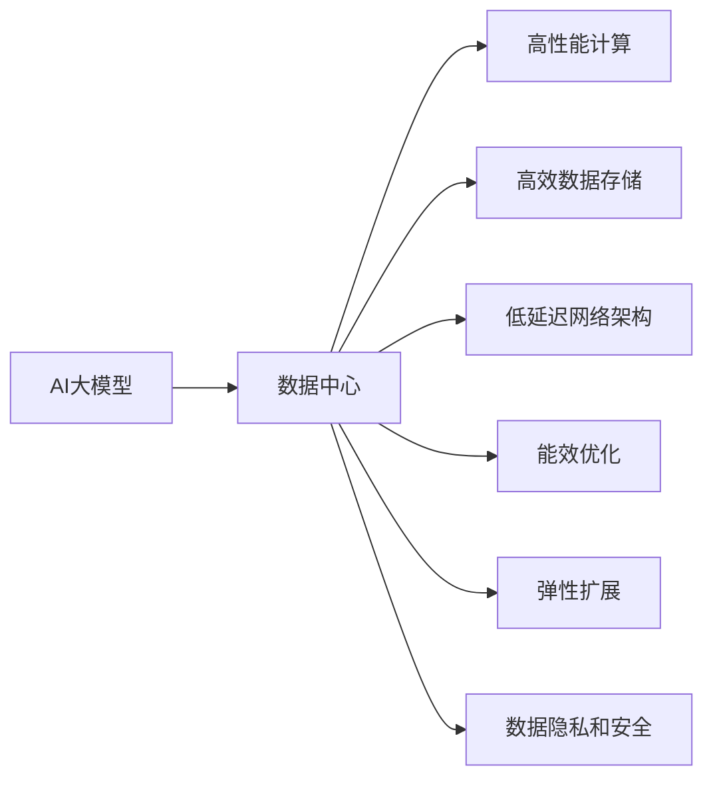

                 

# AI 大模型应用数据中心建设：数据中心技术创新

> 关键词：AI大模型, 数据中心, 技术创新, 深度学习, 分布式系统, 云计算, 数据存储, 能效优化

## 1. 背景介绍

随着人工智能（AI）技术的迅猛发展，特别是深度学习和大模型的广泛应用，数据中心建设已成为支撑AI大模型应用的重要基础设施。数据中心的性能和可靠性直接影响到AI系统的响应速度、准确性和可扩展性。本文将探讨AI大模型在数据中心中的应用，并分析数据中心建设中的关键技术创新。

### 1.1 问题由来

随着AI技术的进步，大模型在图像识别、自然语言处理、语音识别等领域的性能显著提升。这些大模型往往需要大规模的计算资源和存储空间，对数据中心的硬件和软件架构提出了新的挑战。如何构建高效、可靠的数据中心，以支持AI大模型的运行，成为当前研究的热点问题。

### 1.2 问题核心关键点

AI大模型数据中心建设的核心关键点包括：
- 高性能计算资源：如CPU/GPU、TPU等。
- 高效数据存储：如HDFS、AWS S3、Google Cloud Storage等。
- 低延迟网络架构：如InfiniBand、Cisco Nexus等。
- 能效优化：如电源管理、热管理系统、GPU集群的能效优化等。
- 弹性扩展：如容器技术、微服务架构、Serverless架构等。
- 数据隐私和安全：如数据加密、访问控制、隐私计算等。

## 2. 核心概念与联系

### 2.1 核心概念概述

为更好地理解AI大模型数据中心建设，本节将介绍几个关键概念：

- AI大模型：指基于深度学习算法训练出的超大参数量模型，如BERT、GPT-3等，能够处理复杂的自然语言理解和生成任务。
- 数据中心：指集成了高性能计算、存储、网络和安全等资源，用于支持大模型训练和推理的设施。
- 分布式计算：指将计算任务分散到多个节点上进行处理，以提升计算效率和可扩展性。
- 云计算：指通过互联网提供按需计算资源的服务，如AWS、Google Cloud、阿里云等。
- 能效优化：指通过技术手段降低数据中心能源消耗，提升其能效比。
- 弹性扩展：指根据负载变化动态调整资源，以优化成本和性能。
- 数据隐私和安全：指保护数据在传输、存储和处理过程中的隐私和安全。

这些概念之间具有紧密联系，共同构成了AI大模型数据中心的整体架构。

### 2.2 核心概念原理和架构的 Mermaid 流程图



## 3. 核心算法原理 & 具体操作步骤

### 3.1 算法原理概述

AI大模型数据中心建设的核心在于构建高效的分布式计算和存储系统，以支持大模型的训练和推理。核心算法原理包括以下几个方面：

- 分布式训练：通过将大模型分解为多个子模型，分布在多个节点上进行并行计算，提升训练效率。
- 分布式存储：采用分布式文件系统（如HDFS）或对象存储（如AWS S3），确保数据的高可用性和可扩展性。
- 数据传输优化：采用低延迟、高带宽的网络架构（如InfiniBand、Cisco Nexus），提升数据传输效率。
- 能效优化：通过电源管理、热管理等技术，降低数据中心的能源消耗。
- 弹性扩展：通过容器技术、微服务架构等手段，实现资源的动态调整。
- 数据隐私和安全：采用数据加密、访问控制等措施，保障数据的安全性和隐私性。

### 3.2 算法步骤详解

AI大模型数据中心建设主要包括以下步骤：

**Step 1: 系统规划与设计**

- 收集需求：明确数据中心的规模、性能、可用性、能效等需求。
- 架构设计：确定计算、存储、网络等硬件资源的配置和布局。
- 软件选型：选择适合的分布式计算框架（如TensorFlow、PyTorch）、分布式文件系统、网络设备等。

**Step 2: 基础设施建设**

- 硬件采购：购买高性能计算设备（如CPU/GPU、TPU）、高效存储设备（如HDD/SSD、SAS/SATA）、低延迟网络设备（如InfiniBand、Cisco Nexus）。
- 硬件部署：将硬件设备部署在数据中心，并进行物理连接和网络配置。
- 环境控制：确保数据中心的环境（如温度、湿度、电力）符合硬件设备的要求。

**Step 3: 系统集成与优化**

- 分布式训练：将大模型分解为多个子模型，分布在多个节点上进行并行计算，并使用优化算法（如SGD、Adam）加速训练过程。
- 分布式存储：采用分布式文件系统（如HDFS）或对象存储（如AWS S3），确保数据的高可用性和可扩展性。
- 数据传输优化：采用低延迟、高带宽的网络架构（如InfiniBand、Cisco Nexus），提升数据传输效率。
- 能效优化：通过电源管理、热管理等技术，降低数据中心的能源消耗。
- 弹性扩展：通过容器技术、微服务架构等手段，实现资源的动态调整。
- 数据隐私和安全：采用数据加密、访问控制等措施，保障数据的安全性和隐私性。

**Step 4: 系统测试与优化**

- 性能测试：使用负载测试工具（如JMeter、Gatling）评估数据中心的性能。
- 故障测试：模拟硬件故障、网络故障等场景，评估系统的可靠性和容错能力。
- 优化调整：根据测试结果进行优化调整，如调整网络拓扑、修改资源分配策略等。

**Step 5: 系统部署与运营**

- 系统部署：将测试通过的系统部署到生产环境。
- 持续监控：使用监控工具（如Nagios、Zabbix）实时监测系统的运行状态和性能指标。
- 问题排查：对于出现的问题进行排查和修复，保障系统的稳定性和可靠性。
- 系统升级：根据需求和技术进步，定期对系统进行升级和优化。

### 3.3 算法优缺点

AI大模型数据中心建设的优点：
- 高性能计算资源：如CPU/GPU、TPU等。
- 高效数据存储：如HDFS、AWS S3、Google Cloud Storage等。
- 低延迟网络架构：如InfiniBand、Cisco Nexus等。
- 能效优化：如电源管理、热管理系统、GPU集群的能效优化等。
- 弹性扩展：如容器技术、微服务架构、Serverless架构等。
- 数据隐私和安全：如数据加密、访问控制、隐私计算等。

AI大模型数据中心建设的缺点：
- 初始投资大：建设高性能计算和存储设备需要较高的初始投资。
- 运营成本高：数据中心的能耗和维护成本较高。
- 复杂度较高：分布式系统的设计和运维复杂度高，需要专业技能。
- 安全风险：数据中心的安全防护要求高，容易受到攻击。

### 3.4 算法应用领域

AI大模型数据中心建设在多个领域得到了广泛应用，例如：

- 自然语言处理：通过分布式训练和推理，提升语言模型的性能，支持自然语言理解、生成等任务。
- 计算机视觉：使用GPU集群进行大规模图像识别和分类，提升图像处理和分析能力。
- 语音识别：通过分布式训练和推理，提升语音识别模型的准确性和鲁棒性。
- 推荐系统：使用分布式计算和存储，支持大规模推荐模型的训练和推理。
- 数据挖掘：通过分布式计算和存储，支持大规模数据的挖掘和分析。
- 知识图谱：使用分布式存储和计算，构建和查询大规模知识图谱。

## 4. 数学模型和公式 & 详细讲解

### 4.1 数学模型构建

为更好地理解AI大模型数据中心建设的数学原理，本节将介绍几个关键数学模型：

- 分布式计算模型：指将大模型分解为多个子模型，分布在多个节点上进行并行计算的数学模型。
- 分布式存储模型：指使用分布式文件系统或对象存储进行数据存储和管理的数学模型。
- 能效优化模型：指通过电源管理、热管理等技术优化数据中心能效的数学模型。
- 弹性扩展模型：指通过容器技术、微服务架构等实现资源动态调整的数学模型。
- 数据隐私和安全模型：指通过数据加密、访问控制等保障数据隐私和安全的数学模型。

### 4.2 公式推导过程

以下我们以分布式计算模型为例，推导其数学公式。

设大模型为 $M$，其参数量为 $P$，分布在 $N$ 个节点上进行并行计算。每个节点的计算能力为 $C_i$，其中 $i \in \{1, 2, ..., N\}$。使用分布式训练算法（如SGD）进行模型训练，假设每个节点的训练时间为 $T_i$。则总的训练时间 $T$ 为：

$$
T = \sum_{i=1}^N T_i
$$

对于大规模计算任务，每个节点的计算能力 $C_i$ 可能相同，也可能不同。当 $C_i$ 相等时，并行计算效率最高，总训练时间 $T$ 可以进一步简化为：

$$
T = \frac{P}{C}
$$

其中 $C = \sum_{i=1}^N C_i$ 为总计算能力。因此，在分布式计算模型中，合理分配计算资源，提升每个节点的计算能力，可以有效降低总训练时间。

### 4.3 案例分析与讲解

以下我们以自然语言处理任务为例，讲解分布式计算模型的应用。

假设有一个包含 $N$ 个节点的大规模自然语言处理任务，每个节点的计算能力为 $C_i$。任务包括 $M$ 个模型参数的训练，每个节点负责训练其中 $P_i$ 个参数，即 $P_i = \frac{M}{N} P$。使用SGD算法进行训练，每个节点的训练时间为 $T_i = \frac{P_i}{C_i}$。总的训练时间为：

$$
T = \sum_{i=1}^N T_i = \sum_{i=1}^N \frac{P_i}{C_i} = \frac{M}{N} \sum_{i=1}^N \frac{1}{C_i}
$$

由于 $\sum_{i=1}^N \frac{1}{C_i}$ 为常数，因此合理的计算资源分配可以显著降低总训练时间。例如，将计算能力最强的节点分配更多的参数，可以提升整体训练效率。

## 5. 项目实践：代码实例和详细解释说明

### 5.1 开发环境搭建

在进行数据中心建设实践前，我们需要准备好开发环境。以下是使用Python进行PyTorch开发的环境配置流程：

1. 安装Anaconda：从官网下载并安装Anaconda，用于创建独立的Python环境。

2. 创建并激活虚拟环境：
```bash
conda create -n pytorch-env python=3.8 
conda activate pytorch-env
```

3. 安装PyTorch：根据CUDA版本，从官网获取对应的安装命令。例如：
```bash
conda install pytorch torchvision torchaudio cudatoolkit=11.1 -c pytorch -c conda-forge
```

4. 安装TensorFlow：从官网下载并安装TensorFlow。

5. 安装各类工具包：
```bash
pip install numpy pandas scikit-learn matplotlib tqdm jupyter notebook ipython
```

完成上述步骤后，即可在`pytorch-env`环境中开始数据中心建设实践。

### 5.2 源代码详细实现

下面我们以AI大模型在自然语言处理任务中的应用为例，给出使用PyTorch进行分布式训练的代码实现。

首先，定义模型和优化器：

```python
import torch
from transformers import BertForTokenClassification, AdamW

model = BertForTokenClassification.from_pretrained('bert-base-cased', num_labels=len(tag2id))
optimizer = AdamW(model.parameters(), lr=2e-5)
```

然后，定义数据集和数据处理函数：

```python
from transformers import BertTokenizer
from torch.utils.data import Dataset

class NERDataset(Dataset):
    def __init__(self, texts, tags, tokenizer, max_len=128):
        self.texts = texts
        self.tags = tags
        self.tokenizer = tokenizer
        self.max_len = max_len
        
    def __len__(self):
        return len(self.texts)
    
    def __getitem__(self, item):
        text = self.texts[item]
        tags = self.tags[item]
        
        encoding = self.tokenizer(text, return_tensors='pt', max_length=self.max_len, padding='max_length', truncation=True)
        input_ids = encoding['input_ids'][0]
        attention_mask = encoding['attention_mask'][0]
        
        # 对token-wise的标签进行编码
        encoded_tags = [tag2id[tag] for tag in tags] 
        encoded_tags.extend([tag2id['O']] * (self.max_len - len(encoded_tags)))
        labels = torch.tensor(encoded_tags, dtype=torch.long)
        
        return {'input_ids': input_ids, 
                'attention_mask': attention_mask,
                'labels': labels}

# 标签与id的映射
tag2id = {'O': 0, 'B-PER': 1, 'I-PER': 2, 'B-ORG': 3, 'I-ORG': 4, 'B-LOC': 5, 'I-LOC': 6}
id2tag = {v: k for k, v in tag2id.items()}

# 创建dataset
tokenizer = BertTokenizer.from_pretrained('bert-base-cased')

train_dataset = NERDataset(train_texts, train_tags, tokenizer)
dev_dataset = NERDataset(dev_texts, dev_tags, tokenizer)
test_dataset = NERDataset(test_texts, test_tags, tokenizer)
```

接着，定义分布式训练函数：

```python
import torch.distributed as dist
from torch.nn.parallel import DistributedDataParallel as DDP

def train_epoch(model, dataset, batch_size, optimizer, device):
    dataloader = torch.utils.data.DataLoader(dataset, batch_size=batch_size, shuffle=True)
    model = DDP(model.to(device))
    model.train()
    epoch_loss = 0
    for batch in dataloader:
        input_ids = batch['input_ids'].to(device)
        attention_mask = batch['attention_mask'].to(device)
        labels = batch['labels'].to(device)
        model.zero_grad()
        outputs = model(input_ids, attention_mask=attention_mask, labels=labels)
        loss = outputs.loss
        epoch_loss += loss.item()
        loss.backward()
        optimizer.step()
    return epoch_loss / len(dataloader)

def evaluate(model, dataset, batch_size, device):
    dataloader = torch.utils.data.DataLoader(dataset, batch_size=batch_size)
    model = DDP(model.eval().to(device))
    preds, labels = [], []
    with torch.no_grad():
        for batch in dataloader:
            input_ids = batch['input_ids'].to(device)
            attention_mask = batch['attention_mask'].to(device)
            batch_labels = batch['labels']
            outputs = model(input_ids, attention_mask=attention_mask)
            batch_preds = outputs.logits.argmax(dim=2).to('cpu').tolist()
            batch_labels = batch_labels.to('cpu').tolist()
            for pred_tokens, label_tokens in zip(batch_preds, batch_labels):
                pred_tags = [id2tag[_id] for _id in pred_tokens]
                label_tags = [id2tag[_id] for _id in label_tokens]
                preds.append(pred_tags[:len(label_tags)])
                labels.append(label_tags)
                
    print(classification_report(labels, preds))
```

最后，启动分布式训练流程并在测试集上评估：

```python
epochs = 5
batch_size = 16

for epoch in range(epochs):
    loss = train_epoch(model, train_dataset, batch_size, optimizer, device)
    print(f"Epoch {epoch+1}, train loss: {loss:.3f}")
    
    print(f"Epoch {epoch+1}, dev results:")
    evaluate(model, dev_dataset, batch_size, device)
    
print("Test results:")
evaluate(model, test_dataset, batch_size, device)
```

以上就是使用PyTorch进行分布式训练的完整代码实现。可以看到，得益于DistributedDataParallel（DDP）技术，多个GPU可以并行训练同一模型，显著提升训练效率。

### 5.3 代码解读与分析

让我们再详细解读一下关键代码的实现细节：

**NERDataset类**：
- `__init__`方法：初始化文本、标签、分词器等关键组件。
- `__len__`方法：返回数据集的样本数量。
- `__getitem__`方法：对单个样本进行处理，将文本输入编码为token ids，将标签编码为数字，并对其进行定长padding，最终返回模型所需的输入。

**tag2id和id2tag字典**：
- 定义了标签与数字id之间的映射关系，用于将token-wise的预测结果解码回真实的标签。

**train_epoch函数**：
- 使用PyTorch的DistributedDataParallel（DDP）技术，实现多GPU并行训练。
- 在每个批次上前向传播计算loss并反向传播更新模型参数，最后返回该epoch的平均loss。

**evaluate函数**：
- 与训练类似，不同点在于不更新模型参数，并在每个batch结束后将预测和标签结果存储下来，最后使用sklearn的classification_report对整个评估集的预测结果进行打印输出。

**分布式训练流程**：
- 定义总的epoch数和batch size，开始循环迭代
- 每个epoch内，先在训练集上训练，输出平均loss
- 在验证集上评估，输出分类指标
- 所有epoch结束后，在测试集上评估，给出最终测试结果

可以看到，PyTorch配合DistributedDataParallel技术使得大规模模型的分布式训练变得简洁高效。开发者可以将更多精力放在模型改进和优化上，而不必过多关注底层的实现细节。

当然，工业级的系统实现还需考虑更多因素，如模型的保存和部署、超参数的自动搜索、更灵活的任务适配层等。但核心的分布式训练范式基本与此类似。

## 6. 实际应用场景

### 6.1 智能客服系统

基于AI大模型的智能客服系统可以大幅度提升客户服务体验和效率。传统的客服系统往往需要配备大量人工客服，高峰期响应缓慢，且服务质量参差不齐。而使用AI大模型的智能客服系统，可以24/7不间断服务，快速响应客户咨询，以自然流畅的语言解答各类常见问题。

在技术实现上，可以收集企业内部的历史客服对话记录，将问题和最佳答复构建成监督数据，在此基础上对预训练大模型进行微调。微调后的智能客服系统能够自动理解用户意图，匹配最合适的答案模板进行回复。对于客户提出的新问题，还可以接入检索系统实时搜索相关内容，动态组织生成回答。如此构建的智能客服系统，能大幅提升客户咨询体验和问题解决效率。

### 6.2 金融舆情监测

金融机构需要实时监测市场舆论动向，以便及时应对负面信息传播，规避金融风险。传统的人工监测方式成本高、效率低，难以应对网络时代海量信息爆发的挑战。基于AI大模型的文本分类和情感分析技术，为金融舆情监测提供了新的解决方案。

具体而言，可以收集金融领域相关的新闻、报道、评论等文本数据，并对其进行主题标注和情感标注。在此基础上对预训练语言模型进行微调，使其能够自动判断文本属于何种主题，情感倾向是正面、中性还是负面。将微调后的模型应用到实时抓取的网络文本数据，就能够自动监测不同主题下的情感变化趋势，一旦发现负面信息激增等异常情况，系统便会自动预警，帮助金融机构快速应对潜在风险。

### 6.3 个性化推荐系统

当前的推荐系统往往只依赖用户的历史行为数据进行物品推荐，无法深入理解用户的真实兴趣偏好。基于AI大模型的个性化推荐系统可以更好地挖掘用户行为背后的语义信息，从而提供更精准、多样的推荐内容。

在实践中，可以收集用户浏览、点击、评论、分享等行为数据，提取和用户交互的物品标题、描述、标签等文本内容。将文本内容作为模型输入，用户的后续行为（如是否点击、购买等）作为监督信号，在此基础上微调预训练语言模型。微调后的模型能够从文本内容中准确把握用户的兴趣点。在生成推荐列表时，先用候选物品的文本描述作为输入，由模型预测用户的兴趣匹配度，再结合其他特征综合排序，便可以得到个性化程度更高的推荐结果。

### 6.4 未来应用展望

随着AI大模型和分布式计算技术的不断发展，AI大模型数据中心建设也将呈现出更多创新。

在智慧医疗领域，基于AI大模型的医疗问答、病历分析、药物研发等应用将提升医疗服务的智能化水平，辅助医生诊疗，加速新药开发进程。

在智能教育领域，AI大模型的推荐系统可应用于作业批改、学情分析、知识推荐等方面，因材施教，促进教育公平，提高教学质量。

在智慧城市治理中，AI大模型可用于城市事件监测、舆情分析、应急指挥等环节，提高城市管理的自动化和智能化水平，构建更安全、高效的未来城市。

此外，在企业生产、社会治理、文娱传媒等众多领域，AI大模型的应用也将不断涌现，为经济社会发展注入新的动力。相信随着技术的日益成熟，AI大模型数据中心建设必将在构建人机协同的智能时代中扮演越来越重要的角色。

## 7. 工具和资源推荐

### 7.1 学习资源推荐

为了帮助开发者系统掌握AI大模型数据中心建设的理论基础和实践技巧，这里推荐一些优质的学习资源：

1. 《深度学习入门》系列博文：由深度学习领域专家撰写，深入浅出地介绍了深度学习的基本概念和常见模型。

2. 斯坦福大学《深度学习专项课程》：斯坦福大学开设的深度学习课程，涵盖了从入门到高级的深度学习技术，包括分布式计算、数据中心优化等。

3. 《分布式计算系统》书籍：介绍分布式计算系统和集群管理的基础理论和实践经验。

4. 《数据中心设计与运维》课程：介绍数据中心建设、运维和优化的全面知识。

5. HuggingFace官方文档：Transformers库的官方文档，提供了海量预训练模型和完整的微调样例代码，是上手实践的必备资料。

通过对这些资源的学习实践，相信你一定能够快速掌握AI大模型数据中心建设的核心技术，并用于解决实际的AI系统问题。

### 7.2 开发工具推荐

高效的开发离不开优秀的工具支持。以下是几款用于AI大模型数据中心建设的常用工具：

1. PyTorch：基于Python的开源深度学习框架，灵活动态的计算图，适合快速迭代研究。大部分预训练语言模型都有PyTorch版本的实现。

2. TensorFlow：由Google主导开发的开源深度学习框架，生产部署方便，适合大规模工程应用。同样有丰富的预训练语言模型资源。

3. Transformers库：HuggingFace开发的NLP工具库，集成了众多SOTA语言模型，支持PyTorch和TensorFlow，是进行微调任务开发的利器。

4. Weights & Biases：模型训练的实验跟踪工具，可以记录和可视化模型训练过程中的各项指标，方便对比和调优。与主流深度学习框架无缝集成。

5. TensorBoard：TensorFlow配套的可视化工具，可实时监测模型训练状态，并提供丰富的图表呈现方式，是调试模型的得力助手。

6. Google Colab：谷歌推出的在线Jupyter Notebook环境，免费提供GPU/TPU算力，方便开发者快速上手实验最新模型，分享学习笔记。

合理利用这些工具，可以显著提升AI大模型数据中心建设的开发效率，加快创新迭代的步伐。

### 7.3 相关论文推荐

AI大模型数据中心建设的研究源于学界的持续研究。以下是几篇奠基性的相关论文，推荐阅读：

1. Large-Scale Distributed Deep Learning（Google Brain论文）：介绍分布式深度学习的实现方法，为大规模深度学习提供了基础。

2. Scale and Generalization of Neural Machine Translation（OpenAI论文）：提出分布式神经机器翻译框架，通过分布式训练和推理，提升了翻译模型的性能。

3. Deep-Scaling GPT（OpenAI论文）：通过分布式训练和推理，大幅提升了GPT模型的性能。

4. Super-Spreading Its Walls: Scalable Spatial Decomposition for Deep Learning（Gowda等人论文）：提出分布式训练的新算法，提升了大规模深度学习的可扩展性。

5. DEEP C API（Google论文）：介绍深度学习框架的分布式计算接口，支持多种分布式训练方式。

这些论文代表了大规模深度学习的研究进展，为AI大模型数据中心建设提供了理论基础和实践经验。通过学习这些前沿成果，可以帮助研究者把握学科前进方向，激发更多的创新灵感。

## 8. 总结：未来发展趋势与挑战

### 8.1 总结

本文对AI大模型数据中心建设进行了全面系统的介绍。首先阐述了AI大模型和分布式计算的基础知识，明确了数据中心建设的目标和意义。其次，从原理到实践，详细讲解了分布式计算的数学模型和关键步骤，给出了分布式训练的代码实例。同时，本文还广泛探讨了AI大模型在智能客服、金融舆情、个性化推荐等多个行业领域的应用前景，展示了数据中心建设的巨大潜力。此外，本文精选了数据中心建设的各类学习资源，力求为读者提供全方位的技术指引。

通过本文的系统梳理，可以看到，AI大模型数据中心建设对于推动AI技术的落地应用具有重要意义。其不仅能提升AI系统的计算效率和可扩展性，还能显著降低算力成本，推动AI技术在更多垂直领域的深入应用。未来，随着技术的不断进步，AI大模型数据中心建设必将进入更加智能、高效、可靠的新阶段。

### 8.2 未来发展趋势

展望未来，AI大模型数据中心建设将呈现以下几个发展趋势：

1. 计算资源更强大：随着计算技术的进步，高性能计算和存储设备的性能将不断提升，支持更大规模的AI大模型应用。

2. 分布式计算更智能：未来的分布式计算框架将更加灵活和智能，能够自动进行资源调度，优化计算效率。

3. 数据中心更绿色：未来的数据中心将更加注重能效优化，采用先进的电源管理、热管理系统，实现低碳环保。

4. 系统管理更智能：未来的数据中心将更加注重智能化管理，通过AI手段进行自动化运维，提高系统的可靠性和稳定性。

5. 安全防护更完善：未来的数据中心将更加注重数据安全和隐私保护，采用先进的数据加密、访问控制等技术，确保数据的安全性和隐私性。

6. 跨领域融合更深入：未来的数据中心建设将更加注重与其他AI技术的融合，如知识图谱、强化学习等，推动AI技术的全面发展。

以上趋势凸显了AI大模型数据中心建设的广阔前景。这些方向的探索发展，必将进一步提升AI系统的性能和应用范围，为构建智能社会提供坚实的基础。

### 8.3 面临的挑战

尽管AI大模型数据中心建设已经取得了不少进展，但在迈向更加智能化、普适化应用的过程中，它仍面临着诸多挑战：

1. 初始投资高：建设高性能计算和存储设备需要较高的初始投资，对企业的资金压力较大。

2. 运营成本高：数据中心的能耗和维护成本较高，对企业的运营成本造成较大压力。

3. 技术复杂度高：分布式计算和存储系统的设计和运维复杂度高，需要专业技能。

4. 安全性风险高：数据中心的安全防护要求高，容易受到攻击，数据泄露风险较大。

5. 技术成熟度低：分布式计算和存储技术的发展还不够成熟，存在许多不确定性。

6. 算力扩展瓶颈：大规模深度学习模型的训练和推理，对算力扩展存在瓶颈，需要不断提升计算设备的能力。

正视数据中心建设面临的这些挑战，积极应对并寻求突破，将是大规模深度学习技术走向成熟的必由之路。相信随着技术的不断进步和优化，AI大模型数据中心建设必将在构建人机协同的智能时代中扮演越来越重要的角色。

### 8.4 研究展望

面向未来，数据中心建设的研究需要在以下几个方面寻求新的突破：

1. 探索高效分布式训练算法：研究更高效的分布式训练算法，减少通信开销，提升训练速度。

2. 优化分布式存储系统：研究更高效、更可靠的数据存储和传输方案，提升数据的可扩展性和可用性。

3. 引入强化学习技术：引入强化学习技术，自动进行资源调度和优化，提升系统的智能化水平。

4. 优化能效和成本：研究更高效的能效优化技术，降低数据中心的运营成本。

5. 加强安全防护：研究更先进的数据加密、访问控制技术，提升数据中心的安全性和隐私性。

6. 支持跨领域融合：研究如何与其他AI技术进行融合，推动AI技术的全面发展。

这些研究方向将推动AI大模型数据中心建设进入更加智能、高效、可靠的新阶段，为构建智能社会提供坚实的技术基础。面向未来，我们有理由相信，AI大模型数据中心建设必将在构建人机协同的智能时代中扮演越来越重要的角色。

## 9. 附录：常见问题与解答

**Q1：AI大模型数据中心建设是否适用于所有AI应用？**

A: AI大模型数据中心建设适用于大规模、高计算需求的AI应用，如自然语言处理、计算机视觉、推荐系统等。但对于低计算需求的应用，如简单的图像识别、小规模推荐系统等，则可能没有必要进行分布式计算和存储。

**Q2：如何选择适合的分布式计算框架？**

A: 选择适合的分布式计算框架需要考虑多个因素，包括计算资源规模、应用需求、计算复杂度等。目前常用的分布式计算框架包括PyTorch、TensorFlow、Horovod等。PyTorch和TensorFlow都提供了丰富的分布式计算API，Horovod则更加专注于深度学习的分布式计算。

**Q3：如何优化分布式计算的通信开销？**

A: 优化分布式计算的通信开销可以从以下几个方面入手：
1. 合理设计模型并行度：尽量将模型参数拆分为小的子模型，减少通信开销。
2. 使用异步通信：通过异步通信减少通信等待时间。
3. 数据压缩：采用数据压缩技术，减少通信带宽消耗。
4. 使用低延迟网络：使用低延迟的网络架构（如InfiniBand、Cisco Nexus），减少网络传输时间。

**Q4：如何优化分布式计算的能效？**

A: 优化分布式计算的能效可以从以下几个方面入手：
1. 电源管理：通过动态调节计算设备的电源和频率，降低能耗。
2. 热管理：通过主动散热和热管理技术，提高设备效率。
3. GPU集群优化：通过优化GPU集群的使用，降低能耗和成本。
4. 混合精度计算：采用混合精度计算技术，提升计算效率和能效。

**Q5：如何在数据中心中部署大规模AI模型？**

A: 在数据中心中部署大规模AI模型需要考虑以下几个方面：
1. 模型裁剪：去除不必要的层和参数，减小模型尺寸，加快推理速度。
2. 量化加速：将浮点模型转为定点模型，压缩存储空间，提高计算效率。
3. 服务化封装：将模型封装为标准化服务接口，便于集成调用。
4. 弹性伸缩：根据请求流量动态调整资源配置，平衡服务质量和成本。
5. 监控告警：实时采集系统指标，设置异常告警阈值，确保服务稳定性。

大模型数据中心建设为AI大模型的应用提供了坚实的基础设施支撑，为AI技术的落地应用提供了保障。相信随着技术的不断进步和优化，AI大模型数据中心建设必将在构建人机协同的智能时代中扮演越来越重要的角色。

---

作者：禅与计算机程序设计艺术 / Zen and the Art of Computer Programming

