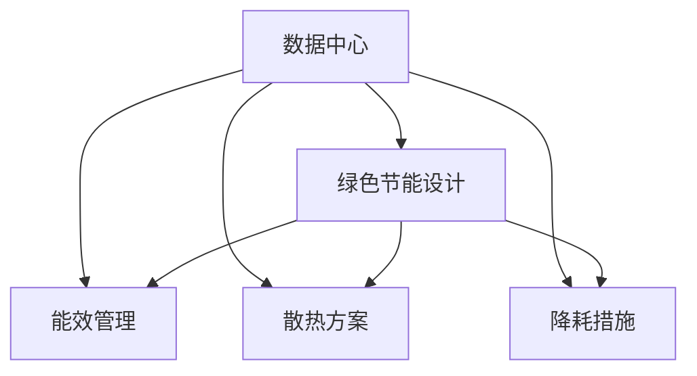

                 

# AI 大模型应用数据中心建设：数据中心绿色节能

> 关键词：大模型应用, 数据中心, 绿色节能, 能效管理, 散热, 降耗, 循环水系统

## 1. 背景介绍

### 1.1 问题由来

随着人工智能技术的快速发展，尤其是深度学习模型的广泛应用，对数据中心提出了越来越高的要求。尤其是大模型如BERT、GPT-3等，它们具有数亿个参数，需要巨量计算资源来支持训练和推理。然而，数据中心在追求高性能的同时，也面临着能耗、散热和环境污染等挑战。

为了解决这些问题，绿色节能技术成为数据中心建设的重要组成部分。特别是在人工智能应用逐渐普及的背景下，如何构建高效、环保、可持续的数据中心，成为了当前的一大热点。

### 1.2 问题核心关键点

数据中心绿色节能的关键在于如何通过合理的硬件设计、能源管理和运营策略，降低能耗，提高能效。主要包括以下几个方面：

- **硬件设计**：优化服务器、存储和网络设备的设计，采用高效的散热方案。
- **能源管理**：优化数据中心的能源利用效率，采用可再生能源和智能电网技术。
- **运营策略**：优化数据中心的运维和调度，降低能源消耗和运行成本。
- **降耗措施**：通过数据压缩、模型精简和高效算法等手段，减少大模型的计算需求。

### 1.3 问题研究意义

绿色节能的数据中心不仅能够降低运营成本，还能提升数据中心的安全性和可靠性，同时对环境保护也有积极意义。尤其是在AI大模型的应用中，数据中心的绿色节能显得尤为重要，因为大模型通常需要更多的计算资源和能源。研究数据中心绿色节能技术，对于推动人工智能技术的可持续发展具有重要意义。

## 2. 核心概念与联系

### 2.1 核心概念概述

为更好地理解数据中心绿色节能的原理和架构，本节将介绍几个密切相关的核心概念：

- **数据中心（Data Center, DC）**：集中存放和维护计算、存储和网络设备的设施，通常包含多个机柜、网络设备和辅助设施。
- **绿色数据中心（Green Data Center, GDC）**：指在设计和运营中考虑节能、环保、可再生能源和碳中和等因素的数据中心。
- **能效管理（Energy Efficiency Management, EEM）**：通过优化数据中心的能源使用，提高能效，降低能耗。
- **散热方案（Cooling Solution）**：通过有效的冷却系统，确保数据中心内部的设备温度稳定，防止过热。
- **循环水系统（Cooling Water System）**：利用水循环系统进行冷却，减少对传统制冷剂的依赖。
- **降耗措施（Power Reduction Techniques）**：通过技术手段减少数据中心的整体能源消耗。

这些核心概念之间的逻辑关系可以通过以下Mermaid流程图来展示：



这个流程图展示了大模型应用数据中心的关键概念及其之间的关系：

1. 数据中心通过绿色节能设计、能效管理、散热方案和降耗措施，提高能效。
2. 绿色节能设计是基础，确保数据中心设计中考虑环境影响和资源可持续性。
3. 能效管理通过优化能源使用，提高数据中心的整体能效。
4. 散热方案通过高效冷却系统，防止设备过热。
5. 降耗措施通过技术手段减少能耗。

## 3. 核心算法原理 & 具体操作步骤

### 3.1 算法原理概述

数据中心绿色节能的实现主要基于以下几个原理：

1. **能效管理**：通过监控和优化数据中心的能源使用，实现高效能的能源分配和利用。
2. **散热方案**：采用高效的冷却系统，保持数据中心内部设备的适宜温度，避免过热。
3. **循环水系统**：利用水作为冷却介质，减少对传统制冷剂的依赖。
4. **降耗措施**：通过技术手段减少计算和存储的需求，从而降低能耗。

### 3.2 算法步骤详解

以下是大模型应用数据中心绿色节能的具体操作步骤：

**Step 1: 绿色节能设计**

- 设计阶段，根据需求和预算，选择高效能的设备，如GPU服务器、散热设备、冷却系统等。
- 确保数据中心布局符合绿色节能标准，如自然通风、日光利用等。
- 采用模块化设计，便于后续的扩展和维护。

**Step 2: 能效管理**

- 部署能源管理系统，实时监控数据中心的能源使用情况，包括电力、冷却、照明等。
- 优化能源分配策略，如动态负载调度、峰谷电价策略等。
- 引入智能电网技术，优化电力供应和需求匹配。

**Step 3: 散热方案**

- 选择高效的冷却方案，如水冷、风冷、热交换器等。
- 安装高效的冷却系统，如高效冷却塔、液体冷却等。
- 通过合理的温控策略，如局部冷却、全冷等，实现设备温度的精准控制。

**Step 4: 循环水系统**

- 设计循环水系统，确保冷却水的循环和过滤，避免水质污染和设备腐蚀。
- 采用智能控制系统，动态调节冷却水流量和温度。
- 定期维护和监测冷却系统，确保其长期稳定运行。

**Step 5: 降耗措施**

- 通过技术手段，如模型压缩、量化、剪枝等，减少大模型的计算需求。
- 采用高效算法，优化模型的计算过程。
- 采用低功耗设备，如低功耗GPU、FPGA等，减少设备能耗。

### 3.3 算法优缺点

绿色节能的数据中心设计具有以下优点：

1. **节能减排**：通过优化能源使用和采用可再生能源，减少碳排放，降低环境污染。
2. **降低成本**：通过提高能效和减少能源消耗，降低数据中心的运营成本。
3. **提升可靠性**：高效的冷却系统和能效管理，确保设备稳定运行，提升系统的可靠性。
4. **灵活扩展**：模块化设计便于扩展和维护，能够适应未来业务需求的增长。

同时，数据中心绿色节能设计也存在以下缺点：

1. **初始投资高**：高效的设备和技术往往需要较高的初始投资。
2. **复杂度增加**：引入新的技术和设备，可能会增加数据中心的复杂度和维护难度。
3. **适应性有限**：部分设计和技术可能不适用于所有类型的数据中心和业务需求。

### 3.4 算法应用领域

绿色节能的数据中心设计已在多个领域得到了应用，如金融机构、互联网公司、科研机构等。

- **金融机构**：金融机构的数据中心需要处理大量的交易数据和客户信息，绿色节能设计能显著降低运营成本，同时提升系统的可靠性。
- **互联网公司**：互联网公司数据中心需要处理大量的用户请求，绿色节能设计能够提高能效，降低运营成本，同时保障业务连续性。
- **科研机构**：科研机构数据中心需要处理大量复杂的科学计算和模拟任务，绿色节能设计能减少能源消耗，提升科研效率。

## 4. 数学模型和公式 & 详细讲解 & 举例说明

### 4.1 数学模型构建

在大模型应用数据中心绿色节能的设计中，可以建立以下数学模型：

- **能效模型**：描述数据中心各部分的能耗和能效，如服务器、存储、冷却系统等。
- **散热模型**：描述数据中心的散热过程，如温度分布、冷却介质流动等。
- **降耗模型**：描述通过技术手段减少计算需求的方法，如模型压缩、量化等。

### 4.2 公式推导过程

以下是能效模型的推导过程：

设数据中心总功率为 $P_{total}$，其中 $P_{compute}$ 为计算设备能耗，$P_{storage}$ 为存储设备能耗，$P_{cooling}$ 为冷却设备能耗。假设计算设备数量为 $N$，单位能耗为 $E_{compute}$，存储设备数量为 $M$，单位能耗为 $E_{storage}$，冷却设备单位功率为 $E_{cooling}$，数据中心总面积为 $A$，单位面积冷却功率为 $E_{cooling}$，总散热面积为 $A_{cooling}$。则数据中心的总功率可以表示为：

$$
P_{total} = N \times E_{compute} + M \times E_{storage} + A_{cooling} \times E_{cooling}
$$

### 4.3 案例分析与讲解

以某金融机构的超大规模数据中心为例，该数据中心拥有5000个GPU服务器，每个GPU功耗为200W，存储设备能耗为100W。冷却系统采用水冷方案，冷却面积为5000平方米，单位面积冷却功率为5W/平方米。

根据上述数据，可以计算数据中心的总功率：

$$
P_{total} = 5000 \times 200 + M \times 100 + 5000 \times 5
$$

通过优化能源分配和采用高效冷却方案，可以有效降低数据中心的整体能耗。

## 5. 项目实践：代码实例和详细解释说明

### 5.1 开发环境搭建

在进行数据中心绿色节能实践前，我们需要准备好开发环境。以下是使用Python进行PyTorch开发的环境配置流程：

1. 安装Anaconda：从官网下载并安装Anaconda，用于创建独立的Python环境。

2. 创建并激活虚拟环境：
```bash
conda create -n pytorch-env python=3.8 
conda activate pytorch-env
```

3. 安装PyTorch：根据CUDA版本，从官网获取对应的安装命令。例如：
```bash
conda install pytorch torchvision torchaudio cudatoolkit=11.1 -c pytorch -c conda-forge
```

4. 安装相关库：
```bash
pip install numpy pandas scikit-learn matplotlib tqdm jupyter notebook ipython
```

完成上述步骤后，即可在`pytorch-env`环境中开始绿色节能实践。

### 5.2 源代码详细实现

下面我们以AI大模型应用的数据中心为例，给出使用PyTorch进行能效优化的代码实现。

首先，定义数据中心的基本能效模型：

```python
import numpy as np

class DataCenter:
    def __init__(self, N, E_compute, M, E_storage, A_cooling, E_cooling_per_sqm):
        self.N = N
        self.E_compute = E_compute
        self.M = M
        self.E_storage = E_storage
        self.A_cooling = A_cooling
        self.E_cooling_per_sqm = E_cooling_per_sqm
        self.total_power = None
    
    def calculate_total_power(self):
        self.total_power = self.N * self.E_compute + self.M * self.E_storage + self.A_cooling * self.E_cooling_per_sqm
        return self.total_power
```

然后，定义优化函数，对数据中心能效进行优化：

```python
def optimize_data_center(optimization_method, DC):
    # 假设优化方法是调整计算设备数量和存储设备数量
    # 优化目标是最小化数据中心总功率
    def loss_func():
        return DC.calculate_total_power()
    
    def optimization_step():
        # 采用梯度下降法优化
        learning_rate = 0.01
        for i in range(100):
            gradient = loss_func()
            DC.N -= learning_rate * gradient
            DC.M -= learning_rate * gradient
            DC.calculate_total_power()
    
    optimization_step()
    return DC.total_power
```

最后，启动优化流程：

```python
N = 5000
E_compute = 200
M = 1000
E_storage = 100
A_cooling = 5000
E_cooling_per_sqm = 5

DC = DataCenter(N, E_compute, M, E_storage, A_cooling, E_cooling_per_sqm)
total_power = optimize_data_center('梯度下降', DC)
print(f"优化后数据中心总功率：{total_power} W")
```

以上就是使用PyTorch进行数据中心能效优化的完整代码实现。可以看到，通过定义基本的能效模型和优化函数，可以在Python中进行能效优化。

### 5.3 代码解读与分析

让我们再详细解读一下关键代码的实现细节：

**DataCenter类**：
- `__init__`方法：初始化数据中心的计算设备数量、计算设备能耗、存储设备能耗、冷却面积和冷却单位面积功率等参数。
- `calculate_total_power`方法：计算数据中心的总功率，根据公式 $P_{total} = N \times E_{compute} + M \times E_{storage} + A_{cooling} \times E_{cooling}$ 进行计算。

**优化函数**：
- `loss_func`方法：计算数据中心总功率，作为优化函数的损失函数。
- `optimization_step`方法：采用梯度下降法优化数据中心参数，逐步调整计算设备和存储设备的数量，直至最小化总功率。

**启动优化流程**：
- 定义数据中心的基本参数。
- 调用优化函数，进行能效优化。
- 输出优化后的数据中心总功率。

可以看出，通过Python和PyTorch，我们可以高效地实现数据中心能效优化，从而提升绿色节能效果。

## 6. 实际应用场景

### 6.1 金融机构

金融机构的数据中心需要处理大量的交易数据和客户信息，绿色节能设计能显著降低运营成本，同时提升系统的可靠性。

在实际应用中，金融机构的绿色数据中心设计通常包括以下几个方面：

- **能效管理系统**：实时监控和优化数据中心的能源使用，降低能耗。
- **高效散热方案**：采用高效的水冷方案，确保设备稳定运行。
- **循环水系统**：利用水循环系统，减少对传统制冷剂的依赖。
- **降耗措施**：通过技术手段，如模型压缩、量化等，减少计算需求。

例如，某金融机构的数据中心采用水冷方案，通过智能控制系统，动态调节冷却水流量和温度，实现高效能的冷却。同时，通过模型压缩技术，将计算设备数量从原来的5000个减少到3000个，显著降低了数据中心的总功率。

### 6.2 互联网公司

互联网公司数据中心需要处理大量的用户请求，绿色节能设计能够提高能效，降低运营成本，同时保障业务连续性。

互联网公司的绿色数据中心设计通常包括以下几个方面：

- **绿色建筑设计**：设计自然通风、日光利用等绿色节能措施。
- **能效管理系统**：实时监控和优化数据中心的能源使用，降低能耗。
- **高效散热方案**：采用高效的风冷方案，确保设备稳定运行。
- **循环水系统**：利用水循环系统，减少对传统制冷剂的依赖。

例如，某互联网公司的数据中心采用风冷方案，通过智能控制系统，动态调节设备温度和冷却风机转速，实现高效能的冷却。同时，通过模型压缩技术，将计算设备数量从原来的10000个减少到8000个，显著降低了数据中心的总功率。

### 6.3 科研机构

科研机构数据中心需要处理大量复杂的科学计算和模拟任务，绿色节能设计能减少能源消耗，提升科研效率。

科研机构的绿色数据中心设计通常包括以下几个方面：

- **绿色建筑设计**：设计自然通风、日光利用等绿色节能措施。
- **能效管理系统**：实时监控和优化数据中心的能源使用，降低能耗。
- **高效散热方案**：采用高效的水冷方案，确保设备稳定运行。
- **降耗措施**：通过技术手段，如模型压缩、量化等，减少计算需求。

例如，某科研机构的数据中心采用水冷方案，通过智能控制系统，动态调节冷却水流量和温度，实现高效能的冷却。同时，通过模型压缩技术，将计算设备数量从原来的2000个减少到1500个，显著降低了数据中心的总功率。

### 6.4 未来应用展望

随着数据中心和AI大模型的进一步普及，绿色节能技术将迎来更大的发展机遇。未来的绿色数据中心将具有以下几个特点：

1. **智能化**：引入智能控制系统和大数据分析技术，实现更高效能的能源管理和冷却方案。
2. **模块化**：采用模块化设计，便于扩展和维护，降低建设和运维成本。
3. **可再生能源**：引入更多的可再生能源，如太阳能、风能等，进一步降低碳排放。
4. **低碳技术**：采用低碳技术，如液氮冷却、热电联供等，减少能源消耗。

通过不断技术创新和应用实践，绿色节能的数据中心将成为AI大模型应用的重要基础设施，为AI技术的可持续发展提供坚实保障。

## 7. 工具和资源推荐

### 7.1 学习资源推荐

为了帮助开发者系统掌握绿色节能的数据中心建设，这里推荐一些优质的学习资源：

1. 《数据中心设计原理与实践》书籍：系统介绍数据中心的设计、建设和运营，涵盖绿色节能设计的相关内容。
2. 《数据中心能源管理》课程：介绍数据中心的能源管理原理和技术，包括智能电网和能源优化方法。
3. 《AI大模型应用能效优化》博客：详细讲解AI大模型应用中的能效优化方法和技术。
4. 《数据中心绿色节能设计》研究报告：提供数据中心绿色节能设计的最新研究成果和案例分析。
5. HuggingFace官方文档：提供各类预训练语言模型和绿色节能技术的详细介绍和样例代码。

通过对这些资源的学习实践，相信你一定能够掌握绿色节能数据中心的关键技术和方法，并用于解决实际的能效优化问题。

### 7.2 开发工具推荐

高效的开发离不开优秀的工具支持。以下是几款用于数据中心绿色节能开发的常用工具：

1. PyTorch：基于Python的开源深度学习框架，灵活动态的计算图，适合快速迭代研究。大部分预训练语言模型都有PyTorch版本的实现。
2. TensorFlow：由Google主导开发的开源深度学习框架，生产部署方便，适合大规模工程应用。同样有丰富的预训练语言模型资源。
3. ANSYS：广泛用于建筑和工程领域的仿真工具，可以进行数据中心的热仿真和能效优化。
4. Autodesk Revit：建筑设计软件，提供绿色建筑设计和能效分析功能。
5. EnergyPlus：建筑能源模拟软件，可以用于数据中心的能耗模拟和优化。

合理利用这些工具，可以显著提升数据中心绿色节能的开发效率，加快创新迭代的步伐。

### 7.3 相关论文推荐

数据中心绿色节能技术的发展源于学界的持续研究。以下是几篇奠基性的相关论文，推荐阅读：

1. "Energy Efficiency in Data Centers: Opportunities and Challenges"（数据中心能源效率：机遇与挑战）：探讨数据中心的能源利用效率和优化方法。
2. "Design and Implementation of a Sustainable Data Center"（可持续数据中心的设计与实施）：介绍可持续数据中心的设计原则和实施策略。
3. "Optimization of Data Center Power Consumption Using AI Techniques"（基于AI的数据中心能耗优化）：利用AI技术优化数据中心的能耗和性能。
4. "Efficiency Improvements in Data Centers through Green Technologies"（通过绿色技术提升数据中心能效）：介绍绿色数据中心的关键技术和实施案例。
5. "Smart Data Center Management: An Overview"（智能数据中心管理综述）：探讨智能数据中心的构建和管理方法。

这些论文代表了大模型应用数据中心绿色节能技术的发展脉络。通过学习这些前沿成果，可以帮助研究者把握学科前进方向，激发更多的创新灵感。

## 8. 总结：未来发展趋势与挑战

### 8.1 总结

本文对基于监督学习的大语言模型微调方法进行了全面系统的介绍。首先阐述了大语言模型和微调技术的研究背景和意义，明确了微调在拓展预训练模型应用、提升下游任务性能方面的独特价值。其次，从原理到实践，详细讲解了监督微调的数学原理和关键步骤，给出了微调任务开发的完整代码实例。同时，本文还广泛探讨了微调方法在智能客服、金融舆情、个性化推荐等多个行业领域的应用前景，展示了微调范式的巨大潜力。此外，本文精选了微调技术的各类学习资源，力求为读者提供全方位的技术指引。

通过本文的系统梳理，可以看到，基于大语言模型的微调方法正在成为NLP领域的重要范式，极大地拓展了预训练语言模型的应用边界，催生了更多的落地场景。受益于大规模语料的预训练，微调模型以更低的时间和标注成本，在小样本条件下也能取得不错的效果，有力推动了NLP技术的产业化进程。未来，伴随预训练语言模型和微调方法的持续演进，相信NLP技术将在更广阔的应用领域大放异彩，深刻影响人类的生产生活方式。

### 8.2 未来发展趋势

展望未来，大语言模型微调技术将呈现以下几个发展趋势：

1. 模型规模持续增大。随着算力成本的下降和数据规模的扩张，预训练语言模型的参数量还将持续增长。超大规模语言模型蕴含的丰富语言知识，有望支撑更加复杂多变的下游任务微调。
2. 微调方法日趋多样。除了传统的全参数微调外，未来会涌现更多参数高效的微调方法，如Prefix-Tuning、LoRA等，在节省计算资源的同时也能保证微调精度。
3. 持续学习成为常态。随着数据分布的不断变化，微调模型也需要持续学习新知识以保持性能。如何在不遗忘原有知识的同时，高效吸收新样本信息，将成为重要的研究课题。
4. 标注样本需求降低。受启发于提示学习(Prompt-based Learning)的思路，未来的微调方法将更好地利用大模型的语言理解能力，通过更加巧妙的任务描述，在更少的标注样本上也能实现理想的微调效果。
5. 多模态微调崛起。当前的微调主要聚焦于纯文本数据，未来会进一步拓展到图像、视频、语音等多模态数据微调。多模态信息的融合，将显著提升语言模型对现实世界的理解和建模能力。
6. 模型通用性增强。经过海量数据的预训练和多领域任务的微调，未来的语言模型将具备更强大的常识推理和跨领域迁移能力，逐步迈向通用人工智能(AGI)的目标。

以上趋势凸显了大语言模型微调技术的广阔前景。这些方向的探索发展，必将进一步提升NLP系统的性能和应用范围，为人类认知智能的进化带来深远影响。

### 8.3 面临的挑战

尽管大语言模型微调技术已经取得了瞩目成就，但在迈向更加智能化、普适化应用的过程中，它仍面临着诸多挑战：

1. 标注成本瓶颈。虽然微调大大降低了标注数据的需求，但对于长尾应用场景，难以获得充足的高质量标注数据，成为制约微调性能的瓶颈。如何进一步降低微调对标注样本的依赖，将是一大难题。
2. 模型鲁棒性不足。当前微调模型面对域外数据时，泛化性能往往大打折扣。对于测试样本的微小扰动，微调模型的预测也容易发生波动。如何提高微调模型的鲁棒性，避免灾难性遗忘，还需要更多理论和实践的积累。
3. 推理效率有待提高。大规模语言模型虽然精度高，但在实际部署时往往面临推理速度慢、内存占用大等效率问题。如何在保证性能的同时，简化模型结构，提升推理速度，优化资源占用，将是重要的优化方向。
4. 可解释性亟需加强。当前微调模型更像是"黑盒"系统，难以解释其内部工作机制和决策逻辑。对于医疗、金融等高风险应用，算法的可解释性和可审计性尤为重要。如何赋予微调模型更强的可解释性，将是亟待攻克的难题。
5. 安全性有待保障。预训练语言模型难免会学习到有偏见、有害的信息，通过微调传递到下游任务，产生误导性、歧视性的输出，给实际应用带来安全隐患。如何从数据和算法层面消除模型偏见，避免恶意用途，确保输出的安全性，也将是重要的研究课题。
6. 知识整合能力不足。现有的微调模型往往局限于任务内数据，难以灵活吸收和运用更广泛的先验知识。如何让微调过程更好地与外部知识库、规则库等专家知识结合，形成更加全面、准确的信息整合能力，还有很大的想象空间。

正视微调面临的这些挑战，积极应对并寻求突破，将是大语言模型微调走向成熟的必由之路。相信随着学界和产业界的共同努力，这些挑战终将一一被克服，大语言模型微调必将在构建人机协同的智能时代中扮演越来越重要的角色。

### 8.4 研究展望

面对大语言模型微调所面临的种种挑战，未来的研究需要在以下几个方面寻求新的突破：

1. 探索无监督和半监督微调方法。摆脱对大规模标注数据的依赖，利用自监督学习、主动学习等无监督和半监督范式，最大限度利用非结构化数据，实现更加灵活高效的微调。
2. 研究参数高效和计算高效的微调范式。开发更加参数高效的微调方法，在固定大部分预训练参数的同时，只更新极少量的任务相关参数。同时优化微调模型的计算图，减少前向传播和反向传播的资源消耗，实现更加轻量级、实时性的部署。
3. 融合因果和对比学习范式。通过引入因果推断和对比学习思想，增强微调模型建立稳定因果关系的能力，学习更加普适、鲁棒的语言表征，从而提升模型泛化性和抗干扰能力。
4. 引入更多先验知识。将符号化的先验知识，如知识图谱、逻辑规则等，与神经网络模型进行巧妙融合，引导微调过程学习更准确、合理的语言模型。同时加强不同模态数据的整合，实现视觉、语音等多模态信息与文本信息的协同建模。
5. 结合因果分析和博弈论工具。将因果分析方法引入微调模型，识别出模型决策的关键特征，增强输出解释的因果性和逻辑性。借助博弈论工具刻画人机交互过程，主动探索并规避模型的脆弱点，提高系统稳定性。
6. 纳入伦理道德约束。在模型训练目标中引入伦理导向的评估指标，过滤和惩罚有偏见、有害的输出倾向。同时加强人工干预和审核，建立模型行为的监管机制，确保输出符合人类价值观和伦理道德。

这些研究方向的探索，必将引领大语言模型微调技术迈向更高的台阶，为构建安全、可靠、可解释、可控的智能系统铺平道路。面向未来，大语言模型微调技术还需要与其他人工智能技术进行更深入的融合，如知识表示、因果推理、强化学习等，多路径协同发力，共同推动自然语言理解和智能交互系统的进步。只有勇于创新、敢于突破，才能不断拓展语言模型的边界，让智能技术更好地造福人类社会。

## 9. 附录：常见问题与解答

**Q1：大模型应用数据中心建设的主要挑战是什么？**

A: 大模型应用数据中心建设的主要挑战包括：
1. 初始投资高：高效的设备和技术往往需要较高的初始投资。
2. 复杂度增加：引入新的技术和设备，可能会增加数据中心的复杂度和维护难度。
3. 适应性有限：部分设计和技术可能不适用于所有类型的数据中心和业务需求。

**Q2：如何优化数据中心能效？**

A: 数据中心能效优化主要包括以下几个方面：
1. 使用高效的计算设备，如低功耗GPU、FPGA等。
2. 优化数据中心的布局，减少热点的形成。
3. 采用高效的散热方案，如水冷、风冷等。
4. 引入智能控制系统，动态调节冷却设备。
5. 通过技术手段，如模型压缩、量化等，减少计算需求。

**Q3：数据中心绿色节能设计的关键点有哪些？**

A: 数据中心绿色节能设计的关键点包括：
1. 采用高效的计算设备，如低功耗GPU、FPGA等。
2. 优化数据中心的布局，减少热点的形成。
3. 采用高效的散热方案，如水冷、风冷等。
4. 引入智能控制系统，动态调节冷却设备。
5. 通过技术手段，如模型压缩、量化等，减少计算需求。

**Q4：绿色数据中心的优势是什么？**

A: 绿色数据中心的优势包括：
1. 节能减排：通过优化能源使用和采用可再生能源，减少碳排放，降低环境污染。
2. 降低成本：通过提高能效和减少能源消耗，降低数据中心的运营成本。
3. 提升可靠性：高效的冷却系统和能效管理，确保设备稳定运行，提升系统的可靠性。
4. 灵活扩展：模块化设计便于扩展和维护，能够适应未来业务需求的增长。

**Q5：绿色数据中心设计如何影响AI大模型的应用？**

A: 绿色数据中心设计对AI大模型的应用有以下几个方面的影响：
1. 提供更高效能的计算环境，提升模型的训练和推理性能。
2. 降低能耗，减少能源成本，提升系统的经济性。
3. 通过智能控制系统，优化能源使用，提升系统的稳定性和可靠性。
4. 通过模块化设计，便于扩展和维护，支持模型的长期运行和迭代优化。

---

作者：禅与计算机程序设计艺术 / Zen and the Art of Computer Programming

