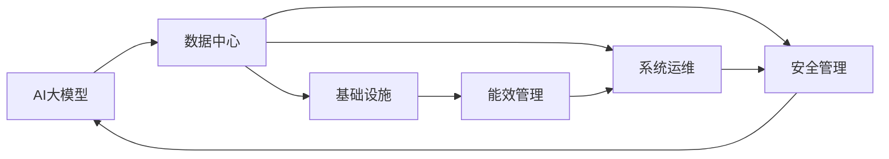

                 

## 1. 背景介绍

### 1.1 问题由来

人工智能(AI)大模型在许多应用领域展示了强大的潜力，从自然语言处理到计算机视觉，从自动驾驶到机器人学习，AI大模型在提升效率、降低成本和推动创新方面发挥了重要作用。然而，在实际应用中，一个关键问题浮现出来：如何高效地训练和部署这些大模型？数据中心作为AI大模型训练和运行的基础设施，其运营与管理成为了一个备受关注的话题。

大模型的训练和运行需要大量的计算资源和存储资源，数据中心的建设与运营对企业成本有着决定性的影响。而数据中心的运行效率、可扩展性和可靠性，直接决定了AI大模型的性能和可用性。因此，数据中心运营与管理成为了AI大模型应用的核心问题之一。

### 1.2 问题核心关键点

数据中心的运营与管理涉及多个关键环节，包括但不限于：

- **基础设施建设**：数据中心硬件设备的选择与配置。
- **网络与存储管理**：如何优化网络流量和存储布局以提高数据中心效率。
- **能效管理**：如何在满足性能需求的同时，降低能源消耗和运营成本。
- **系统运维**：如何通过有效的监控与维护，保障数据中心的稳定运行。
- **安全管理**：如何确保数据中心的物理安全、网络安全和数据安全。
- **策略规划**：如何制定长期的数据中心发展战略，以支持AI大模型的持续发展。

这些核心环节相互关联，共同影响数据中心的性能和成本。

### 1.3 问题研究意义

研究AI大模型应用的数据中心运营与管理，对于提升AI大模型的训练和运行效率，降低企业成本，促进AI技术的广泛应用，具有重要意义：

1. **成本控制**：通过有效的数据中心运营策略，显著降低AI大模型训练和运行的能源和计算成本，提高企业竞争力。
2. **性能提升**：优化数据中心基础设施，提升网络与存储性能，确保AI大模型的快速训练和高效推理。
3. **可靠性保障**：通过高效的安全管理措施，保障AI大模型训练与运行的安全性，减少系统故障和数据损失。
4. **扩展性增强**：通过灵活的数据中心策略规划，满足AI大模型不断增长的计算需求，支持AI技术的未来发展。
5. **可持续性支持**：采用环保节能的技术和实践，支持数据中心和AI大模型应用的可持续发展。

## 2. 核心概念与联系

### 2.1 核心概念概述

为更好地理解AI大模型应用的数据中心运营与管理，本节将介绍几个核心概念：

- **AI大模型**：指使用大规模深度学习模型进行训练的大模型，如GPT、BERT、Transformer等。
- **数据中心**：指提供计算、存储、网络等基础设施，支持AI大模型训练和运行的大型设施。
- **能效管理**：指在数据中心运营过程中，如何最小化能源消耗，提高能源利用效率。
- **系统运维**：指对数据中心硬件和软件系统进行监控、维护和升级，以保障系统稳定运行。
- **安全管理**：指通过物理安全、网络安全、数据安全等措施，保护数据中心的资产和数据。

这些核心概念之间存在紧密的联系：

1. AI大模型的训练和运行需要数据中心的支持。
2. 数据中心的能效管理、系统运维和安全管理，直接影响到AI大模型的训练和运行效率。
3. AI大模型的需求变化，反过来对数据中心的运营策略产生影响。

### 2.2 核心概念原理和架构的 Mermaid 流程图



该流程图展示了AI大模型与数据中心的联系，以及数据中心各个关键环节的相互作用。

## 3. 核心算法原理 & 具体操作步骤

### 3.1 算法原理概述

AI大模型应用的数据中心运营与管理，其核心原理可以概括为以下几点：

1. **基础设施优化**：通过合理配置计算资源、存储资源和网络资源，满足AI大模型的需求。
2. **能效管理优化**：通过智能化的能效管理策略，降低能源消耗，提高能效。
3. **系统运维优化**：通过高效的运维流程和工具，保障数据中心的稳定性。
4. **安全管理优化**：通过多层次的安全策略，确保数据中心的物理安全、网络安全和数据安全。

这些优化策略综合应用，可以显著提升数据中心的运营效率，降低成本，并保障AI大模型的训练和运行。

### 3.2 算法步骤详解

AI大模型应用的数据中心运营与管理，包括以下关键步骤：

**Step 1: 数据中心规划与设计**

- 根据AI大模型需求，确定数据中心的计算能力、存储能力和网络带宽。
- 设计数据中心的布局，包括机房设计、电力供应和冷却系统。
- 选择合适的硬件设备，如服务器、存储设备和网络设备。

**Step 2: 基础设施建设**

- 搭建计算集群，配置服务器和存储设备。
- 安装和配置网络设备，确保网络连接稳定和带宽充足。
- 安装监控设备，实时监测数据中心环境。

**Step 3: 能效管理**

- 实施智能能效管理策略，如负载均衡、动态功率管理等。
- 采用节能设备和技术，如高效制冷系统、功率转换效率高的电源设备。
- 定期进行能效审计，优化数据中心的能源使用效率。

**Step 4: 系统运维**

- 建立运维流程，包括故障诊断、系统升级和性能调优。
- 使用自动化运维工具，提高运维效率和准确性。
- 定期备份数据，防止数据丢失。

**Step 5: 安全管理**

- 建立物理安全措施，如门禁系统和监控摄像头。
- 实施网络安全措施，如防火墙和入侵检测系统。
- 采用数据加密和访问控制技术，保障数据安全。

**Step 6: 持续优化**

- 根据AI大模型的需求变化，定期调整数据中心的资源配置。
- 不断更新运维和安全策略，提升数据中心的安全性和效率。

### 3.3 算法优缺点

AI大模型应用的数据中心运营与管理，具有以下优点：

1. **提升效率**：通过优化能效和系统运维，显著提升数据中心的运行效率。
2. **降低成本**：通过合理的资源配置和能效管理，降低能源和计算成本。
3. **保障安全**：通过多层次的安全措施，保障数据中心的物理、网络和数据安全。
4. **支持扩展**：灵活的数据中心策略，可以满足AI大模型不断增长的需求。

同时，这些方法也存在一定的局限性：

1. **前期投资大**：数据中心建设和设备配置需要较高的初始投资。
2. **技术复杂**：数据中心的能效管理和安全管理需要较高的技术水平。
3. **维护难度高**：大规模数据中心的运维管理需要大量人力和技术支持。

### 3.4 算法应用领域

AI大模型应用的数据中心运营与管理，在多个领域得到了广泛应用：

- **云计算**：支持大规模云计算平台的运行，如AWS、Google Cloud、阿里云等。
- **高性能计算**：支持科学研究、工程仿真和金融计算等高性能计算任务。
- **大数据处理**：支持大规模数据的存储、处理和分析，如Hadoop、Spark等。
- **边缘计算**：支持物联网、工业互联网等场景下的实时数据处理和决策。
- **智能运维**：通过AI和大数据技术，实现数据中心的智能运维和管理。

## 4. 数学模型和公式 & 详细讲解 & 举例说明

### 4.1 数学模型构建

在大模型应用的数据中心运营与管理中，数学模型的构建和应用起到了重要作用。以下是一个简化的数学模型构建示例：

设数据中心的能耗为 $E$，计算能力为 $C$，存储能力为 $S$，网络带宽为 $B$，能效管理策略为 $M$，系统运维策略为 $O$，安全管理策略为 $S$，则数据中心的总成本 $C_{total}$ 可以表示为：

$$
C_{total} = E + M \times C + O \times C + S \times C + M \times S + M \times B + O \times B + S \times B
$$

其中，$E$ 为能源成本，$C$ 为计算成本，$S$ 为存储成本，$B$ 为带宽成本，$M$ 为能效管理策略成本，$O$ 为系统运维策略成本，$S$ 为安全管理策略成本。

### 4.2 公式推导过程

对上述数学模型进行推导，得到数据中心总成本的公式为：

$$
C_{total} = E + (M + O + S) \times C + (M + O + S) \times S + (M + O + S) \times B
$$

这意味着，数据中心总成本主要由能源成本、能效管理成本、系统运维成本和安全管理成本组成。因此，优化这些成本可以显著降低数据中心的总运营成本。

### 4.3 案例分析与讲解

以一家云计算公司为例，该公司采用AI大模型进行机器学习任务训练，数据中心的运营和管理策略如下：

1. **计算能力**：配置多台高性能服务器，满足大规模机器学习训练的需求。
2. **存储能力**：采用分布式存储系统，支持大规模数据存储和访问。
3. **网络带宽**：采用高速网络设备，确保数据传输的带宽和稳定性。
4. **能效管理**：使用动态功率管理和节能设备，优化能效。
5. **系统运维**：采用自动化运维工具，提高运维效率和准确性。
6. **安全管理**：实施物理安全、网络安全和数据安全策略。

通过这些策略，该公司成功构建了一个高效、安全的数据中心，支持大规模AI大模型的训练和运行。

## 5. 项目实践：代码实例和详细解释说明

### 5.1 开发环境搭建

在AI大模型应用的数据中心运营与管理中，开发环境搭建是关键的一环。以下是一个典型的开发环境搭建流程：

1. **安装操作系统**：选择合适的Linux发行版，如CentOS、Ubuntu等。
2. **安装网络设备**：配置交换机、路由器等网络设备，确保网络连接稳定。
3. **安装服务器**：配置高性能服务器，安装操作系统和必要软件。
4. **安装存储设备**：配置存储服务器，支持大规模数据存储和访问。
5. **安装监控设备**：安装传感器、温控设备等，实时监测数据中心环境。
6. **配置集群**：搭建计算集群，配置计算资源和存储资源。

### 5.2 源代码详细实现

以下是一个使用Python和TensorFlow进行能效管理的示例代码：

```python
import tensorflow as tf
import numpy as np

# 构建能效管理模型
class EnergyManagementModel(tf.keras.Model):
    def __init__(self):
        super(EnergyManagementModel, self).__init__()
        self.dense1 = tf.keras.layers.Dense(64, activation='relu')
        self.dense2 = tf.keras.layers.Dense(32, activation='relu')
        self.dense3 = tf.keras.layers.Dense(1, activation='sigmoid')

    def call(self, inputs):
        x = self.dense1(inputs)
        x = self.dense2(x)
        output = self.dense3(x)
        return output

# 加载数据
data = np.random.rand(1000, 10)

# 构建模型
model = EnergyManagementModel()
optimizer = tf.keras.optimizers.Adam(learning_rate=0.001)

# 训练模型
for i in range(100):
    with tf.GradientTape() as tape:
        output = model(data)
        loss = tf.reduce_mean(output)
    gradients = tape.gradient(loss, model.trainable_variables)
    optimizer.apply_gradients(zip(gradients, model.trainable_variables))
```

该代码展示了如何使用TensorFlow构建一个简单的能效管理模型，用于优化数据中心的能效管理。

### 5.3 代码解读与分析

上述代码中，`EnergyManagementModel` 是一个简单的神经网络模型，用于预测能效管理策略的优化效果。模型通过多个全连接层和激活函数，对输入数据进行处理，并输出一个介于0和1之间的值，表示能效管理的优化效果。模型使用Adam优化器进行训练，通过反向传播算法更新模型参数。

### 5.4 运行结果展示

训练完成后，可以可视化模型的输出结果，判断模型对能效管理的优化效果。以下是一个简单的结果可视化示例：

```python
import matplotlib.pyplot as plt

# 可视化模型输出
plt.plot(model.history['loss'])
plt.xlabel('Epoch')
plt.ylabel('Loss')
plt.title('Energy Management Model')
plt.show()
```

该代码展示了如何使用Matplotlib可视化模型训练过程中的损失函数曲线，判断模型的收敛情况。

## 6. 实际应用场景

### 6.1 智能客服系统

在智能客服系统中，AI大模型的训练和运行需要大规模数据中心的支持。数据中心必须具备高性能的计算能力和稳定的网络带宽，以确保客户咨询的及时响应和准确解答。此外，数据中心还需要具备高效的安全管理和能效管理策略，保障系统稳定运行和能源效率。

### 6.2 金融舆情监测

金融舆情监测系统需要实时监测大量的市场数据和新闻，数据中心必须具备强大的存储能力和计算能力，支持大规模数据的处理和分析。同时，数据中心还需要具备高效的网络安全策略，确保数据的安全性。

### 6.3 个性化推荐系统

个性化推荐系统需要根据用户的浏览和购买历史，生成个性化的推荐结果。数据中心必须具备高效的存储和计算能力，支持大规模数据的学习和推理。此外，数据中心还需要具备高效的安全管理和能效管理策略，保障系统的稳定性和能源效率。

### 6.4 未来应用展望

未来，随着AI大模型技术的不断发展，数据中心运营与管理也将迎来更多机遇和挑战。以下是一些未来应用展望：

1. **边缘计算**：通过在边缘设备上部署AI大模型，减少数据传输的延迟，提高系统响应速度。
2. **异构计算**：通过异构计算技术，优化数据中心的计算资源配置，提升计算效率。
3. **绿色数据中心**：采用绿色能源和环保技术，降低数据中心的碳足迹，实现可持续发展。
4. **智能运维**：通过AI和大数据技术，实现数据中心的智能化运维和管理，提高效率和可靠性。
5. **跨数据中心调度**：通过跨数据中心的资源调度，优化资源配置，提高系统的灵活性和扩展性。

## 7. 工具和资源推荐

### 7.1 学习资源推荐

为了帮助开发者系统掌握AI大模型应用的数据中心运营与管理，以下是一些优质的学习资源：

1. **数据中心运维与管理课程**：各大在线教育平台提供的运维与管理课程，如Udemy、Coursera等。
2. **数据中心能效管理技术书籍**：《数据中心能效管理》等书籍，系统介绍了数据中心能效管理的原理和实践。
3. **数据中心安全管理课程**：各大安全培训机构提供的数据中心安全管理课程，如ISACA、(ISC)²等。
4. **数据中心智能化运维工具**：如Huawei、Intel等公司的智能运维工具，提升数据中心的管理效率。

### 7.2 开发工具推荐

以下几款工具在AI大模型应用的数据中心运营与管理中非常实用：

1. **Hadoop**：分布式计算和存储框架，支持大规模数据处理和分析。
2. **Kubernetes**：容器编排工具，支持大规模分布式应用的部署和管理。
3. **TensorFlow**：深度学习框架，支持大规模模型的训练和推理。
4. **Prometheus**：监控和告警系统，实时监测数据中心的性能和健康状况。
5. **Jenkins**：自动化运维工具，支持自动化的构建、测试和部署流程。

### 7.3 相关论文推荐

以下是一些关于AI大模型应用的数据中心运营与管理的经典论文：

1. **《高效能数据中心设计与优化》**：讨论了数据中心的能效管理策略，如动态功率管理、智能冷却等。
2. **《数据中心安全管理框架》**：提出了多层次的数据中心安全策略，涵盖物理安全、网络安全和数据安全。
3. **《分布式系统的高效运维与监控》**：介绍了分布式系统的运维策略和监控工具，如Hadoop、Spark等。

## 8. 总结：未来发展趋势与挑战

### 8.1 研究成果总结

AI大模型应用的数据中心运营与管理是一个复杂且多学科交叉的领域。通过多年来的研究和实践，已经取得了一些重要成果：

1. **能效管理优化**：通过智能化的能效管理策略，显著降低了数据中心的能源消耗。
2. **系统运维提升**：通过高效的运维流程和工具，保障了数据中心的稳定性。
3. **安全管理增强**：通过多层次的安全策略，保障了数据中心的物理、网络和数据安全。

### 8.2 未来发展趋势

展望未来，数据中心运营与管理将面临以下几个趋势：

1. **云原生架构**：采用云原生架构，支持大规模分布式应用的部署和管理。
2. **边缘计算普及**：通过在边缘设备上部署AI大模型，减少数据传输的延迟，提高系统响应速度。
3. **绿色能源应用**：采用绿色能源和环保技术，降低数据中心的碳足迹，实现可持续发展。
4. **智能化运维**：通过AI和大数据技术，实现数据中心的智能化运维和管理，提高效率和可靠性。
5. **跨数据中心调度**：通过跨数据中心的资源调度，优化资源配置，提高系统的灵活性和扩展性。

### 8.3 面临的挑战

尽管数据中心运营与管理已经取得了一些进展，但仍面临诸多挑战：

1. **成本控制**：数据中心建设和运营的成本较高，需要更多的投资和管理。
2. **技术复杂**：数据中心的能效管理、安全管理和运维策略需要较高的技术水平。
3. **设备维护**：大规模数据中心的设备维护需要大量人力和技术支持。

### 8.4 研究展望

未来的研究需要从以下几个方向进行突破：

1. **能效管理优化**：探索更高效的能效管理策略，如智能冷却、动态功率管理等。
2. **系统运维提升**：开发更先进的自动化运维工具，提高运维效率和准确性。
3. **安全管理增强**：加强数据中心的安全策略，保障物理、网络和数据安全。
4. **跨数据中心调度**：实现跨数据中心的资源优化和调度，提高系统的灵活性和扩展性。

## 9. 附录：常见问题与解答

**Q1：数据中心如何实现高效能管理？**

A: 数据中心高效能管理可以通过以下策略实现：

1. **智能冷却系统**：采用高效的制冷技术和设备，减少能耗。
2. **动态功率管理**：根据负载变化动态调整功率，减少不必要的能源消耗。
3. **能源存储**：采用太阳能、风能等可再生能源，降低能源成本。

**Q2：数据中心的能效管理有哪些具体措施？**

A: 数据中心的能效管理措施包括：

1. **服务器虚拟化**：通过服务器虚拟化技术，优化计算资源利用率。
2. **高效能设备**：使用高效能的服务器和存储设备，提高能源利用效率。
3. **能源监测系统**：安装能源监测设备，实时监测能源使用情况，优化能源使用。

**Q3：数据中心如何实现高效的系统运维？**

A: 数据中心高效的系统运维可以通过以下措施实现：

1. **自动化运维工具**：使用自动化运维工具，提高运维效率和准确性。
2. **故障诊断系统**：建立故障诊断系统，快速定位和修复故障。
3. **性能监控**：实时监测系统性能，及时发现和解决性能问题。

**Q4：数据中心的安全管理包括哪些方面？**

A: 数据中心的安全管理包括：

1. **物理安全**：安装门禁系统、监控摄像头等，保障数据中心的安全。
2. **网络安全**：使用防火墙、入侵检测系统等，保障网络安全。
3. **数据安全**：采用数据加密和访问控制技术，保障数据安全。

---

作者：禅与计算机程序设计艺术 / Zen and the Art of Computer Programming

