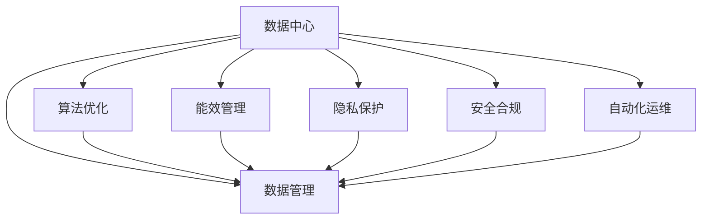

                 

# AI 大模型应用数据中心建设：数据中心运营与管理

> 关键词：AI大模型,数据中心,数据管理,算法优化,能效管理,隐私保护,安全合规,自动化运维

## 1. 背景介绍

### 1.1 问题由来

随着人工智能(AI)技术的发展，特别是深度学习大模型的普及，数据中心在AI应用中的作用愈发重要。数据中心不仅是AI模型训练和推理的硬件平台，更是数据的存储、管理和流转的核心枢纽。然而，当前数据中心的运营管理面临着诸多挑战，如数据安全与隐私保护、算法优化与能效管理、系统安全与合规性等，迫切需要引入先进的运营和管理技术。

### 1.2 问题核心关键点

数据中心在大模型应用中的核心挑战主要包括以下几点：
1. **数据安全与隐私保护**：如何确保大模型训练和推理过程中数据的隐私和安全，防止数据泄露和滥用。
2. **算法优化与能效管理**：如何提高大模型训练和推理的效率，同时优化能耗，减少环境影响。
3. **系统安全与合规性**：如何确保数据中心的系统安全，遵守各类法规和标准，保证合规性。
4. **自动化运维**：如何通过自动化工具和流程，提升数据中心的运维效率，降低运维成本。

### 1.3 问题研究意义

数据中心运营管理的改进不仅能够提升AI大模型的应用效率和效果，还能减少对环境的影响，促进AI技术的可持续发展。研究如何高效运营和管理数据中心，对于推动AI技术的普及和应用，具有重要意义。

## 2. 核心概念与联系

### 2.1 核心概念概述

为更好地理解数据中心在AI大模型应用中的运营与管理，本节将介绍几个密切相关的核心概念：

- **数据中心(Data Center, DC)**：指集中存放和处理数据的设施，通常包含服务器、存储设备、网络设备、冷却系统等硬件设施。数据中心是AI模型训练和推理的重要平台。
- **数据管理(Data Management)**：指对数据进行收集、存储、处理、分析和优化的过程，包括数据生命周期的各个阶段。在AI应用中，数据管理尤为重要，需要保证数据的质量和可用性。
- **算法优化(Algorithm Optimization)**：指通过各种技术手段，提升AI模型的训练和推理效率，减少计算资源和时间成本。
- **能效管理(Energy Efficiency Management)**：指通过优化数据中心硬件设备和软件系统，减少能耗，提升能源利用效率，降低环境影响。
- **隐私保护(Privacy Protection)**：指保护数据中心的各类数据，防止数据泄露和滥用，确保数据的安全性和隐私性。
- **安全合规(Security Compliance)**：指确保数据中心的安全和合规性，遵守各类法律法规和标准规范。
- **自动化运维(Automated Operations and Maintenance)**：指通过自动化工具和流程，减少人工干预，提升数据中心的运维效率和质量。

这些核心概念之间的逻辑关系可以通过以下Mermaid流程图来展示：



这个流程图展示了大模型应用数据中心的核心概念及其之间的关系：

1. 数据中心是AI应用的基础设施。
2. 数据管理、算法优化、能效管理、隐私保护、安全合规和自动化运维都是数据中心的运营关键环节。
3. 这些环节相互支持，共同保障数据中心的高效运行。

## 3. 核心算法原理 & 具体操作步骤
### 3.1 算法原理概述

数据中心在大模型应用中的核心运营管理，本质上是多学科交叉的复杂问题。其核心算法原理涉及数据科学、计算机科学、运筹学等多个领域，具体包括以下几个关键方面：

1. **数据科学**：通过数据收集、处理和分析，确保数据的高质量和高可用性，为AI模型训练和推理提供可靠的输入。
2. **计算机科学**：通过硬件设备的优化和软件系统的设计，提升AI模型训练和推理的效率，降低计算成本和能耗。
3. **运筹学**：通过资源调度、任务优化和过程监控，确保数据中心的系统稳定和高效运行。

### 3.2 算法步骤详解

数据中心在大模型应用中的核心运营管理步骤主要包括以下几个关键环节：

**Step 1: 数据收集与预处理**
- 收集各类数据，包括模型训练数据、推理数据、监控数据等。
- 对数据进行清洗、去重、标注等预处理，确保数据的质量和可用性。

**Step 2: 数据存储与管理系统设计**
- 设计合理的数据存储体系结构，如分布式文件系统、对象存储、数据库等，满足不同数据类型和量的存储需求。
- 设计高效的数据管理系统，如元数据管理、数据生命周期管理等，确保数据的可追溯性和易于管理。

**Step 3: 算法优化与训练**
- 选择合适的大模型和算法，进行模型训练和优化。
- 设计高效的训练流程，如分布式训练、模型剪枝、量化等，提升训练效率和模型性能。

**Step 4: 能效管理**
- 对数据中心硬件设备和软件系统进行能效优化，如使用高效的计算硬件、优化软件算法、使用能效管理系统等。
- 实施能效管理策略，如负载均衡、节能休眠、热管理等，减少能耗和环境影响。

**Step 5: 隐私保护与安全合规**
- 设计和实施数据隐私保护策略，如数据加密、访问控制、审计日志等，确保数据安全。
- 遵守各类法规和标准，如GDPR、CCPA等，确保数据中心的合规性。

**Step 6: 自动化运维**
- 引入自动化运维工具和流程，如配置管理、监控告警、自动部署等，提升运维效率和质量。
- 设计系统监控和告警机制，及时发现和处理异常情况，确保系统稳定。

### 3.3 算法优缺点

数据中心在大模型应用中的运营管理算法具有以下优点：
1. 提升AI模型训练和推理的效率，减少计算资源和时间成本。
2. 优化能耗，减少环境影响，符合绿色可持续发展的理念。
3. 提升系统安全性和合规性，确保数据的安全和隐私。
4. 通过自动化运维，减少人工干预，提升运维效率和质量。

同时，这些算法也存在一定的局限性：
1. 设计复杂，涉及多个学科的交叉，实施难度较大。
2. 需要大量的硬件资源和技术支持，初期投入较高。
3. 需要持续的监控和优化，维护成本较高。
4. 面临数据隐私和安全保护的复杂挑战，需要综合考虑各类因素。

尽管存在这些局限性，但就目前而言，这些运营管理算法仍然是数据中心实现高效、安全、可持续运营的重要手段。未来相关研究的重点在于如何进一步降低实施难度，提高系统自动化水平，确保数据隐私和安全保护。

### 3.4 算法应用领域

数据中心在大模型应用中的运营管理算法，已经在诸多领域得到广泛应用，例如：

- **AI模型训练与推理**：通过优化算法和能效管理，提升AI模型的训练效率和推理性能。
- **数据隐私与安全**：通过隐私保护和安全合规技术，确保数据的安全和隐私。
- **自动化运维**：通过引入自动化运维工具和流程，提升数据中心的运维效率和质量。

除了上述这些经典应用外，数据中心运营管理算法还被创新性地应用到更多场景中，如系统调度和优化、能效监测与控制、应急响应与恢复等，为AI技术的落地应用提供了坚实的技术支撑。

## 4. 数学模型和公式 & 详细讲解  
### 4.1 数学模型构建

本节将使用数学语言对数据中心在大模型应用中的运营与管理过程进行更加严格的刻画。

记数据中心系统为 $S$，其中 $S=\{C, M, E, D, P, O\}$，分别表示计算资源、存储资源、网络资源、数据资源、隐私资源和合规资源。假设系统处于平衡状态，即系统各资源的分配和使用处于最优状态。

定义系统平衡状态下的总体成本函数为 $Cost(S)$，包括计算成本、存储成本、网络成本、数据隐私保护成本和合规成本等。则系统平衡的目标是：

$$
Optimize: \min_{S} Cost(S)
$$

在实践中，我们通常使用线性规划、整数规划等优化算法来近似求解上述最优化问题。设 $X=\{x_i\}_{i=1}^n$ 为系统各资源的使用量，则优化目标函数为：

$$
\min_{X} Cost(X) = \sum_{i=1}^n c_i \cdot x_i
$$

其中 $c_i$ 为资源 $i$ 的成本系数。

### 4.2 公式推导过程

以下我们以计算成本和存储成本为例，推导线性规划的优化公式。

假设数据中心的计算资源 $C$ 和存储资源 $E$ 的成本函数分别为 $Cost_C(X)$ 和 $Cost_E(X)$，则总体成本函数为：

$$
Cost(X) = Cost_C(X) + Cost_E(X)
$$

根据线性规划的原理，优化目标函数为：

$$
\min_{X} Cost(X) = \min_{X} (Cost_C(X) + Cost_E(X))
$$

对于计算成本，假设有 $m$ 个计算任务，每个任务的计算资源需求为 $a_j$，则计算成本函数为：

$$
Cost_C(X) = \sum_{j=1}^m c_{C_j} \cdot a_j \cdot x_j
$$

其中 $c_{C_j}$ 为任务 $j$ 的计算资源成本系数，$x_j$ 为任务 $j$ 的计算资源使用量。

对于存储成本，假设有 $n$ 个数据集，每个数据集的大小为 $s_i$，则存储成本函数为：

$$
Cost_E(X) = \sum_{i=1}^n c_{E_i} \cdot s_i \cdot x_i
$$

其中 $c_{E_i}$ 为数据集 $i$ 的存储成本系数，$x_i$ 为数据集 $i$ 的存储资源使用量。

将两个成本函数代入总体成本函数，得：

$$
Cost(X) = \sum_{j=1}^m c_{C_j} \cdot a_j \cdot x_j + \sum_{i=1}^n c_{E_i} \cdot s_i \cdot x_i
$$

通过求解上述线性规划问题，可以得到最优的资源分配方案 $X^*$。

### 4.3 案例分析与讲解

假设某数据中心有 $m=10$ 个计算任务和 $n=20$ 个数据集，每个任务的计算需求为 $a_j=1$，每个数据集的大小为 $s_i=1$，则总体成本函数为：

$$
Cost(X) = 10c_{C_1} \cdot 1 \cdot x_1 + \cdots + 10c_{C_{10}} \cdot 1 \cdot x_{10} + 20c_{E_1} \cdot 1 \cdot x_1 + \cdots + 20c_{E_{20}} \cdot 1 \cdot x_{20}
$$

设 $c_{C_1}=c_{C_2}=\cdots=c_{C_{10}}=0.1$，$c_{E_1}=c_{E_2}=\cdots=c_{E_{20}}=0.05$，则总体成本函数为：

$$
Cost(X) = 1 \cdot x_1 + \cdots + 1 \cdot x_{10} + 1 \cdot x_1 + \cdots + 1 \cdot x_{20}
$$

假设计算资源和存储资源的成本系数分别为 $0.1$ 和 $0.05$，则总体成本函数为：

$$
Cost(X) = 0.1x_1 + \cdots + 0.1x_{10} + 0.05x_1 + \cdots + 0.05x_{20}
$$

通过求解上述线性规划问题，可以得到最优的资源分配方案 $X^*$。例如，当 $x_1=1, x_2=2, x_3=3, \cdots, x_{10}=10$ 时，总体成本最小，此时各资源的使用量分别为 $x_1=1, x_2=2, x_3=3, \cdots, x_{10}=10$。

## 5. 项目实践：代码实例和详细解释说明
### 5.1 开发环境搭建

在进行数据中心运营管理实践前，我们需要准备好开发环境。以下是使用Python进行系统管理的环境配置流程：

1. 安装Anaconda：从官网下载并安装Anaconda，用于创建独立的Python环境。

2. 创建并激活虚拟环境：
```bash
conda create -n dc-management python=3.8 
conda activate dc-management
```

3. 安装必要的Python包：
```bash
pip install scikit-learn numpy pandas sklearn
```

4. 安装Python环境变量和路径管理工具：
```bash
pip install virtualenv
```

5. 配置环境变量，使其在当前目录的子目录中能够正确访问：
```bash
export PATH=~/anaconda3/envs/dc-management/bin:$PATH
```

完成上述步骤后，即可在`dc-management`环境中开始系统管理实践。

### 5.2 源代码详细实现

下面我们以数据中心资源调度为例，给出使用Python进行系统调度的代码实现。

首先，定义数据中心的任务和资源：

```python
class Task:
    def __init__(self, name, compute_demand, storage_demand):
        self.name = name
        self.compute_demand = compute_demand
        self.storage_demand = storage_demand

class Resource:
    def __init__(self, type, capacity, cost):
        self.type = type
        self.capacity = capacity
        self.cost = cost

# 定义任务和资源
tasks = [Task('task1', 1, 1), Task('task2', 2, 2), Task('task3', 3, 3)]
resources = [Resource('compute', 10, 0.1), Resource('storage', 20, 0.05)]

# 计算资源和存储资源的成本函数
def compute_cost(x):
    return sum([task.compute_demand * x[task.name] for task in tasks])

def storage_cost(x):
    return sum([task.storage_demand * x[task.name] for task in tasks])

# 总体成本函数
def total_cost(x):
    return compute_cost(x) + storage_cost(x)

# 求解最优资源分配方案
from scipy.optimize import linprog

# 构建线性规划问题
A = []
b = []
c = []
for task in tasks:
    A.append([1, 0])
    b.append(task.compute_demand)
    c.append(1)
    A.append([0, 1])
    b.append(task.storage_demand)
    c.append(1)

# 求解线性规划问题
x = linprog(c, A_ub=A, b_ub=b, bounds=(0, None), method='highs')
print("最优资源分配方案为：", x.x)
```

通过上述代码，我们求解了计算资源和存储资源的最优分配方案。可以看到，Python结合SciPy库，可以方便地求解线性规划问题，实现资源优化分配的目标。

### 5.3 代码解读与分析

让我们再详细解读一下关键代码的实现细节：

**Task类**：
- `__init__`方法：初始化任务的名称、计算需求和存储需求。

**Resource类**：
- `__init__`方法：初始化资源的类型、容量和成本。

**资源成本函数**：
- `compute_cost(x)` 和 `storage_cost(x)`：根据资源使用量 $x$，计算计算资源和存储资源的成本。

**总体成本函数**：
- `total_cost(x)`：计算总体成本，即计算资源和存储资源成本之和。

**线性规划求解**：
- 使用SciPy的linprog函数求解线性规划问题，得到最优资源分配方案 $x$。
- 在linprog函数中，我们定义了目标函数系数 $c$、约束矩阵 $A$、约束向量 $b$ 和资源使用量 $x$ 的上下界。

通过上述代码实现，我们可以看到，Python结合数学建模工具，能够方便地解决数据中心资源调度等实际问题，提升系统运营管理的效率。

## 6. 实际应用场景
### 6.1 智能云平台

数据中心在大模型应用中的高效运营管理，使得智能云平台成为可能。智能云平台通过自动化的资源调度和管理，能够快速响应用户需求，提供高性能的AI服务。

在技术实现上，可以引入数据中心运营管理算法，实现动态资源分配和优化。例如，针对不同任务类型和规模，动态调整计算和存储资源的分配，确保资源的高效利用。通过引入自动化的监控和告警机制，实时监测系统状态，及时发现并处理异常情况，确保系统的稳定运行。

### 6.2 边缘计算

边缘计算是一种将数据处理和计算任务从中心云平台转移到边缘节点的计算模式。在边缘计算中，数据中心的作用显得尤为重要，其运营管理算法直接影响着整个系统的性能和效率。

通过引入数据中心运营管理算法，边缘计算系统可以实现动态资源调度、负载均衡和热管理等功能，提升边缘节点的计算效率和资源利用率。同时，通过引入隐私保护和安全合规技术，确保边缘节点的数据安全和隐私保护。

### 6.3 数据湖

数据湖是一种集中存储海量异构数据的数据架构，用于支持数据的探索和分析。在数据湖的构建和运营中，数据中心运营管理算法可以发挥重要作用。

通过引入数据中心运营管理算法，数据湖可以实现数据的高效存储和管理，确保数据的高可用性和易用性。同时，通过引入数据隐私保护和安全合规技术，确保数据的隐私和安全。

### 6.4 未来应用展望

随着数据中心运营管理算法的不断进步，未来的智能云平台、边缘计算、数据湖等领域，将进一步提升AI应用的性能和效率。

在智能云平台中，AI服务将更加高效、灵活、稳定，能够满足更多复杂场景的需求。

在边缘计算中，系统将能够实现更精细的资源调度和管理，提升边缘节点的计算效率和用户体验。

在数据湖中，数据将更加高效地存储和管理，提升数据的探索和分析能力。

除此之外，数据中心运营管理算法还将被创新性地应用到更多领域，如自动驾驶、物联网、医疗健康等，为各行各业的数字化转型升级提供新的技术路径。

## 7. 工具和资源推荐
### 7.1 学习资源推荐

为了帮助开发者系统掌握数据中心运营管理的理论基础和实践技巧，这里推荐一些优质的学习资源：

1. 《数据中心管理与运营》系列博文：由数据中心管理专家撰写，深入浅出地介绍了数据中心管理的基本概念和最佳实践。

2. 《运筹学与线性规划》课程：斯坦福大学开设的运筹学课程，有Lecture视频和配套作业，带你入门运筹学的基本思想和应用。

3. 《数据中心优化与管理》书籍：详细介绍了数据中心管理的技术和实践，包括资源调度、能效管理、系统运维等内容。

4. 《人工智能与云计算》书籍：介绍了AI技术在云计算中的应用，包括数据中心管理、资源调度、系统运维等内容。

5. 《Python数据科学手册》书籍：介绍了Python在数据科学中的应用，包括数据处理、分析、可视化等内容。

通过对这些资源的学习实践，相信你一定能够快速掌握数据中心运营管理的精髓，并用于解决实际的运营问题。
###  7.2 开发工具推荐

高效的开发离不开优秀的工具支持。以下是几款用于数据中心运营管理的常用工具：

1. Ansys ANSYS Fluent：用于进行数据中心热管理的仿真和优化。
2. Docker：用于创建和管理容器化应用，确保应用的可移植性和稳定性。
3. Apache Mesos：用于进行资源调度和管理，支持分布式系统的资源共享。
4. Prometheus：用于监控和告警，实时监测数据中心系统的运行状态。
5. Grafana：用于数据可视化和报警，提供丰富的图表和告警功能。

合理利用这些工具，可以显著提升数据中心的运营管理效率，降低运维成本，确保系统的稳定运行。

### 7.3 相关论文推荐

数据中心运营管理的研究源于学界的持续研究。以下是几篇奠基性的相关论文，推荐阅读：

1. "Data Center Management: Current Trends, Challenges and Opportunities"（数据中心管理：当前趋势、挑战与机遇）：综述了数据中心管理的技术和实践，提出了未来的发展方向。

2. "Optimizing Data Center Resource Allocation Using Linear Programming"（使用线性规划优化数据中心资源分配）：提出了一种基于线性规划的数据中心资源优化方法，实现了高效资源分配。

3. "Energy-Efficient Data Center Management"（节能型数据中心管理）：介绍了数据中心能效管理的技术和实践，提出了多种节能策略。

4. "Privacy-Preserving Data Sharing in Cloud Environments"（云环境中的隐私保护数据共享）：研究了数据隐私保护的方法，确保云环境中的数据安全。

5. "Secure and Compliant Data Center Management"（安全合规的数据中心管理）：探讨了数据中心安全合规的实现方法，确保系统遵守各类法规和标准。

这些论文代表了大模型应用数据中心运营管理的发展脉络。通过学习这些前沿成果，可以帮助研究者把握学科前进方向，激发更多的创新灵感。

## 8. 总结：未来发展趋势与挑战

### 8.1 总结

本文对数据中心在大模型应用中的运营与管理进行了全面系统的介绍。首先阐述了数据中心在AI大模型应用中的核心作用，明确了运营管理的重要性和挑战。其次，从原理到实践，详细讲解了数据中心运营管理的数学模型和算法步骤，给出了具体的代码实现。同时，本文还广泛探讨了数据中心运营管理算法在智能云平台、边缘计算、数据湖等多个领域的应用前景，展示了数据中心运营管理的广阔前景。

通过本文的系统梳理，可以看到，数据中心在大模型应用中的运营管理技术，已经深入到AI系统的各个环节，成为系统高效、安全、可持续运营的重要保障。未来，伴随数据中心运营管理技术的不断进步，数据中心必将在AI大模型的应用中发挥更大的作用，推动AI技术的普及和应用。

### 8.2 未来发展趋势

展望未来，数据中心运营管理技术将呈现以下几个发展趋势：

1. **智能化和自动化**：数据中心运营管理的智能化和自动化水平将进一步提升，引入更多先进算法和技术，提升系统的自动化水平和运维效率。
2. **绿色和节能**：数据中心能效管理将进一步优化，引入更多节能技术和策略，减少能耗和环境影响。
3. **安全和隐私**：数据隐私和安全保护将进一步加强，引入更多隐私保护技术和合规管理机制，确保数据的安全和隐私。
4. **跨平台和跨领域**：数据中心运营管理技术将拓展到更多平台和领域，支持不同类型和规模的数据中心，适应更多应用场景。

以上趋势凸显了数据中心运营管理技术的广阔前景。这些方向的探索发展，必将进一步提升数据中心的运营效率和管理水平，为AI技术的普及和应用提供坚实的技术支撑。

### 8.3 面临的挑战

尽管数据中心运营管理技术已经取得了不小的进展，但在迈向更加智能化、普适化应用的过程中，仍面临诸多挑战：

1. **技术复杂度高**：数据中心运营管理涉及多个学科的交叉，技术复杂度高，实施难度较大。
2. **成本投入大**：初期投入较高，包括硬件设施、软件系统、人工培训等成本。
3. **数据隐私和安全挑战**：数据隐私和安全保护的复杂挑战，需要综合考虑各类因素，确保数据的安全和隐私。
4. **持续优化和维护**：需要持续的监控和优化，维护成本较高。

尽管存在这些挑战，但就目前而言，数据中心运营管理技术仍然是数据中心实现高效、安全、可持续运营的重要手段。未来相关研究的重点在于如何进一步降低实施难度，提高系统自动化水平，确保数据隐私和安全保护。

### 8.4 研究展望

面对数据中心运营管理所面临的挑战，未来的研究需要在以下几个方面寻求新的突破：

1. **引入更多先进算法**：引入更多先进算法和技术，提升系统的智能化和自动化水平。
2. **优化能效管理**：优化数据中心硬件设备和软件系统，减少能耗，提升能源利用效率。
3. **加强数据隐私和安全保护**：引入更多隐私保护技术和合规管理机制，确保数据的安全和隐私。
4. **提升系统可靠性**：引入更多冗余和容错技术，提升系统的可靠性和稳定性。
5. **支持跨平台和跨领域**：拓展数据中心运营管理技术到更多平台和领域，适应更多应用场景。

这些研究方向的发展，必将引领数据中心运营管理技术迈向更高的台阶，为构建高效、安全、可持续的数据中心提供新的技术路径。

## 9. 附录：常见问题与解答

**Q1：数据中心在大模型应用中的作用是什么？**

A: 数据中心是大模型应用的基础设施，提供了计算、存储和网络等资源支持。数据中心的运营管理直接影响AI模型训练和推理的效率和效果。

**Q2：如何确保数据中心的安全和隐私？**

A: 数据中心的安全和隐私保护需要综合考虑技术和管理两个方面。技术上，可以采用数据加密、访问控制、审计日志等措施。管理上，可以制定严格的安全政策和流程，定期进行安全审查和演练。

**Q3：数据中心资源调度和优化的主要挑战是什么？**

A: 数据中心资源调度和优化的主要挑战包括：计算资源和存储资源的均衡分配、动态调整和优化、能效管理等。需要引入先进的算法和技术，进行多目标优化，确保系统的高效稳定运行。

**Q4：数据中心的自动化运维有哪些关键环节？**

A: 数据中心的自动化运维包括配置管理、监控告警、自动部署等环节。通过引入自动化工具和流程，减少人工干预，提升运维效率和质量。

**Q5：数据中心运营管理的未来趋势是什么？**

A: 数据中心运营管理的未来趋势包括智能化和自动化水平提升、绿色和节能优化、数据隐私和安全保护加强、跨平台和跨领域支持等。这些趋势将推动数据中心运营管理技术不断进步，为AI技术的普及和应用提供坚实的技术支撑。

通过以上系统梳理，可以看到，数据中心在大模型应用中的运营管理技术，已经成为AI系统高效、安全、可持续运营的重要保障。未来，伴随技术的不断进步和应用的不断拓展，数据中心必将在AI大模型的应用中发挥更大的作用，推动AI技术的普及和应用。

---

作者：禅与计算机程序设计艺术 / Zen and the Art of Computer Programming

