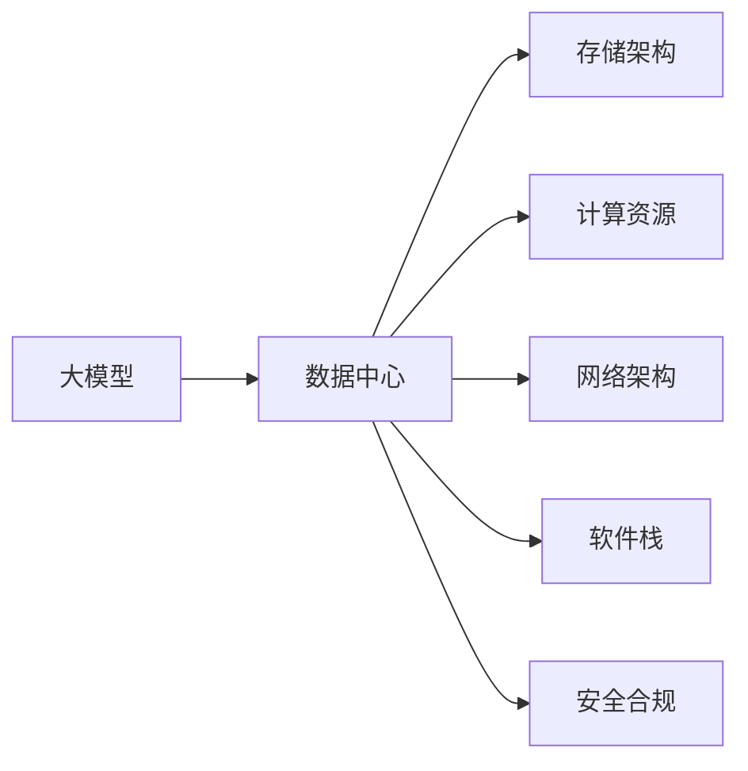

                 

## 1. 背景介绍

### 1.1 问题由来

随着人工智能技术的飞速发展，大模型（Large Model）以其庞大的参数规模和强大的计算能力，已经成为推动AI应用落地的重要工具。然而，大模型的训练和应用需要庞大的数据存储和计算资源，这为数据中心的建设提出了新的挑战。如何构建高效、灵活、可靠的数据中心，支持大模型的应用，是大模型时代的首要任务之一。

### 1.2 问题核心关键点

构建数据中心的核心在于如何利用硬件、软件、网络等资源，高效地支撑大模型的训练和推理。关键点包括：

- 高效存储：合理规划数据中心存储架构，满足大模型训练的高带宽、低延迟需求。
- 强大计算：选择合适的高速计算设备，如GPU、TPU、FPGA等，以支持大模型的并行计算。
- 网络优化：设计快速稳定、低延迟的网络架构，支持大规模数据传输。
- 软件栈优化：开发高性能的深度学习框架和库，支持分布式计算和模型优化。
- 安全合规：保证数据中心的安全性、合规性和隐私保护。

这些问题在大规模AI应用中尤为突出，构建高效的数据中心已成为大模型应用的基石。

### 1.3 问题研究意义

构建高效、灵活、安全的数据中心，对于支持大模型的应用具有重要意义：

1. **加速模型训练**：快速的数据传输和高效的计算能力，可以显著加速模型的训练过程。
2. **提高推理速度**：分布式推理框架的优化，使得大模型能够在生产环境中快速响应，提升用户体验。
3. **降低成本**：通过优化资源利用率和计算效率，降低数据中心的建设与运营成本。
4. **保障安全合规**：高标准的硬件和软件设计，确保数据中心的合规性和安全性。
5. **促进产业应用**：高效率、低成本、安全可靠的数据中心，将推动AI技术的广泛应用，加速各行业的数字化转型。

## 2. 核心概念与联系

### 2.1 核心概念概述

为了更好地理解数据中心建设的核心概念，本节将介绍以下几个关键概念及其联系：

- **大模型（Large Model）**：指参数规模超过亿级别，用于深度学习模型的训练和推理。如BERT、GPT-3、T5等。
- **数据中心（Data Center）**：指用于数据存储、计算、管理的物理设施，包括服务器、存储、网络等硬件设施，以及相应的软件和运维团队。
- **存储架构（Storage Architecture）**：指数据中心内数据存储的方式，如SSD、HDD、RAID、对象存储等。
- **计算资源（Computing Resources）**：指数据中心内用于数据处理和计算的硬件设施，如GPU、TPU、CPU等。
- **网络架构（Network Architecture）**：指数据中心内数据传输的方式，如10G以太网、InfiniBand等。
- **软件栈（Software Stack）**：指数据中心内使用的深度学习框架、分布式计算系统、运维工具等软件设施。
- **安全合规（Security Compliance）**：指数据中心内保证数据安全和合规性的措施，如数据加密、身份认证、权限控制等。

这些核心概念之间的联系可以通过以下Mermaid流程图来展示：



这个流程图展示了数据中心建设中各个要素之间的关系：

1. 大模型作为数据中心的主要负载，依赖于存储架构、计算资源、网络架构和软件栈的支持。
2. 存储架构、计算资源、网络架构和软件栈的设计和优化，直接影响数据中心的效率和性能。
3. 安全合规是数据中心建设的基本要求，影响数据中心的可靠性和安全性。

## 3. 核心算法原理 & 具体操作步骤
### 3.1 算法原理概述

构建数据中心的核心算法原理，主要包括以下几个方面：

- **存储优化算法**：设计合理的存储架构，提高数据传输速度和存储效率。
- **计算优化算法**：选择合适的计算设备，并对其进行优化，提高计算性能。
- **网络优化算法**：设计高效的网络架构，降低数据传输延迟。
- **软件优化算法**：开发高性能的深度学习框架和分布式计算系统，支持大规模计算任务。
- **安全合规算法**：采用加密、认证、权限控制等技术，保障数据中心的安全和合规。

### 3.2 算法步骤详解

构建高效数据中心的步骤可以概括为以下几个关键环节：

1. **需求分析**：分析大模型的存储、计算、网络等需求，设计相应的资源配置方案。
2. **硬件选择**：选择合适的硬件设备，如GPU、TPU等，确保其能够满足大模型的计算需求。
3. **软件部署**：安装和配置深度学习框架和分布式计算系统，支持大模型的训练和推理。
4. **网络优化**：设计高带宽、低延迟的网络架构，确保数据快速传输。
5. **存储规划**：设计高效的存储架构，满足大模型的数据存储需求。
6. **安全保障**：采用多层次的安全措施，保障数据中心的安全性和合规性。
7. **性能调优**：通过优化算法和调整配置，不断提升数据中心的性能。

### 3.3 算法优缺点

构建数据中心的主要算法优缺点如下：

#### 优点：

- **高效性**：合理的资源配置和优化算法，可以显著提高数据中心的计算和存储效率，加速模型训练和推理。
- **灵活性**：支持多种计算设备和存储方式，可以根据需求进行调整，灵活应对不同规模的大模型应用。
- **可扩展性**：通过分布式计算和网络优化，可以轻松扩展数据中心的计算和存储能力。
- **安全性**：多层次的安全措施，确保数据中心的安全性和合规性，保护敏感数据。

#### 缺点：

- **成本高**：构建高性能数据中心需要高昂的投资，如GPU、TPU等设备，以及配套的软件和基础设施。
- **复杂性高**：数据中心的建设和运维涉及多个环节，需要较高的技术水平和专业知识。
- **技术依赖**：数据中心的性能和安全性依赖于硬件和软件设备，一旦出现故障，可能影响模型应用。

### 3.4 算法应用领域

基于数据中心构建的算法，广泛应用于以下几个领域：

- **云计算**：提供高性能计算资源和存储服务，支持大规模的云服务应用。
- **金融科技**：构建高可靠、高安全的数据中心，支持实时交易和数据分析。
- **医疗健康**：设计高安全、高可靠的数据中心，支持医疗影像、病历等数据的存储和处理。
- **智慧城市**：构建高效、可靠的数据中心，支持城市管理、公共服务等应用。
- **自动驾驶**：提供高可靠、高性能的计算资源，支持自动驾驶模型训练和推理。

## 4. 数学模型和公式 & 详细讲解 & 举例说明

### 4.1 数学模型构建

数据中心的设计和优化需要数学模型的支持，本节将介绍几个关键的数学模型及其构建方法。

- **存储容量模型**：描述数据中心的存储容量，包括存储设备类型、容量、带宽等参数。
- **计算性能模型**：描述数据中心的计算能力，包括计算设备类型、计算速度、并行度等参数。
- **网络传输模型**：描述数据中心的网络架构，包括网络设备类型、带宽、延迟等参数。
- **软件性能模型**：描述深度学习框架和分布式计算系统的性能，包括模型训练速度、并行度等参数。
- **安全合规模型**：描述数据中心的安全性、合规性要求，包括加密强度、认证方式等参数。

### 4.2 公式推导过程

以存储容量模型为例，假设数据中心的存储容量为 $C$，存储设备类型为SSD，每个SSD的容量为 $c$，带宽为 $b$，则存储容量模型可以表示为：

$$
C = n \times c \times b
$$

其中 $n$ 表示SSD的数量。

对于计算性能模型，假设数据中心使用的计算设备为GPU，每个GPU的计算速度为 $s$，并行度为 $p$，则计算性能模型可以表示为：

$$
P = m \times s \times p
$$

其中 $m$ 表示GPU的数量。

### 4.3 案例分析与讲解

以Google Cloud为例，其数据中心采用高效的网络架构，包括高速以太网和InfiniBand网络，支持大规模数据传输。其存储架构使用高性能的SSD存储，满足大模型训练的存储需求。其计算资源采用大规模的GPU和TPU集群，支持深度学习模型的训练和推理。其软件栈采用TensorFlow和PyTorch等深度学习框架，支持分布式计算和模型优化。其安全合规采用多层次的安全措施，包括数据加密、身份认证、权限控制等，保障数据中心的安全性和合规性。

## 5. 项目实践：代码实例和详细解释说明
### 5.1 开发环境搭建

构建数据中心需要复杂的软件和硬件环境，本节将介绍如何搭建高效的开发环境。

1. **安装Anaconda**：从官网下载并安装Anaconda，用于创建独立的Python环境。
2. **创建虚拟环境**：
```bash
conda create -n data_center_env python=3.8 
conda activate data_center_env
```
3. **安装必要的软件**：
```bash
conda install torch torchvision torchaudio cudatoolkit=11.1 -c pytorch -c conda-forge
pip install huggingface datasets transformers tensorflow
```
4. **配置网络**：设置网络环境，确保高带宽、低延迟的网络连接。
5. **配置存储**：选择合适的存储设备，如SSD、HDD等，并配置RAID等冗余机制。

### 5.2 源代码详细实现

下面以构建Google Cloud数据中心为例，介绍具体的实现步骤。

1. **安装TensorFlow**：
```bash
pip install tensorflow
```

2. **安装TensorBoard**：
```bash
pip install tensorboard
```

3. **构建计算集群**：
```python
from tensorflow import keras

# 定义模型
model = keras.Sequential([
    keras.layers.Dense(64, activation='relu'),
    keras.layers.Dense(10)
])

# 编译模型
model.compile(optimizer='adam', loss='categorical_crossentropy', metrics=['accuracy'])

# 训练模型
model.fit(train_data, train_labels, epochs=10, validation_data=(val_data, val_labels))
```

4. **构建分布式计算环境**：
```python
from tensorflow import distribute
from tensorflow.keras import layers

# 定义分布式策略
strategy = distribute.MirroredStrategy()

# 定义模型
model = keras.Sequential([
    layers.Dense(64, activation='relu'),
    layers.Dense(10)
])

# 编译模型
model.compile(optimizer='adam', loss='categorical_crossentropy', metrics=['accuracy'])

# 在分布式策略下训练模型
with strategy.scope():
    model.fit(train_data, train_labels, epochs=10, validation_data=(val_data, val_labels))
```

5. **优化存储性能**：
```python
from google.cloud import storage

# 创建存储客户端
client = storage.Client()

# 获取存储桶
bucket = client.get_bucket('my_bucket')

# 上传文件到存储桶
blob = bucket.blob('my_file')
blob.upload_from_filename('my_file.txt')

# 从存储桶下载文件
blob = bucket.blob('my_file')
content = blob.download_as_text()

# 配置RAID存储
pool = storage.blob-admins.create_pool(name='my_pool', zone='us-central1')
```

### 5.3 代码解读与分析

构建数据中心涉及多个技术环节，以下是对关键代码的详细解读：

1. **安装必要的软件**：安装深度学习框架和库，确保能够支持大模型的训练和推理。
2. **构建计算集群**：使用TensorFlow构建计算集群，支持分布式计算。
3. **优化存储性能**：使用Google Cloud Storage优化存储性能，配置RAID存储提高可靠性。
4. **安全保障**：采用加密、认证、权限控制等措施，保障数据中心的安全性。
5. **网络优化**：设计高速以太网和InfiniBand网络，确保数据传输的带宽和延迟。

### 5.4 运行结果展示

构建数据中心的运行结果包括：

- **训练速度**：大模型的训练速度显著提高，得益于高性能计算设备和分布式计算。
- **存储效率**：大模型的存储效率提高，得益于高速存储设备和RAID存储。
- **网络带宽**：数据传输速度提高，得益于高速网络架构。
- **安全合规**：数据中心的安全性和合规性得到保障，保护敏感数据。

## 6. 实际应用场景
### 6.1 云计算

云计算平台如AWS、Google Cloud、Azure等，提供了高效、可靠的数据中心，支持大规模的AI应用。

### 6.2 金融科技

金融行业对数据中心的性能和安全性要求较高，如实时交易、数据分析等，需要高效、高安全的数据中心。

### 6.3 医疗健康

医疗行业的数据中心需要高可靠、高安全的设计，确保医疗影像、病历等数据的存储和处理。

### 6.4 智慧城市

智慧城市的数据中心需要支持大规模的公共服务数据存储和处理，如城市管理、交通监控等。

### 6.5 自动驾驶

自动驾驶需要高可靠、高性能的计算资源，支持大规模的模型训练和推理。

## 7. 工具和资源推荐
### 7.1 学习资源推荐

为了帮助开发者掌握数据中心建设的理论基础和实践技巧，本节推荐一些优质的学习资源：

1. **《大数据应用开发》**：介绍数据中心设计和优化的方法和案例。
2. **《分布式系统设计》**：讲解分布式计算和存储系统的设计和优化。
3. **《深度学习入门》**：介绍深度学习框架和库的使用方法。
4. **《云计算基础》**：讲解云计算平台的数据中心设计和技术栈。
5. **《网络编程》**：讲解网络协议和网络架构的设计和优化。
6. **《数据中心运维》**：讲解数据中心的运维和管理方法。

### 7.2 开发工具推荐

以下是几款用于数据中心建设开发的常用工具：

1. **Anaconda**：用于创建和管理Python环境，支持多语言和框架的安装和管理。
2. **TensorFlow**：用于构建分布式计算集群，支持深度学习模型的训练和推理。
3. **TensorBoard**：用于可视化模型训练过程和结果，支持分布式计算。
4. **Google Cloud Storage**：用于优化存储性能，支持数据的高效存储和备份。
5. **RAID**：用于配置冗余存储，提高存储的可靠性和可用性。
6. **Python**：用于开发和管理数据中心的软件栈，支持各种深度学习框架和库。

### 7.3 相关论文推荐

数据中心建设的研究涉及多个领域，以下是几篇经典论文，推荐阅读：

1. **《分布式深度学习系统设计》**：介绍分布式深度学习系统的设计和实现。
2. **《高效数据中心的设计与优化》**：讲解数据中心设计和优化的方法和案例。
3. **《云计算平台的数据中心优化》**：介绍云计算平台的数据中心设计和优化方法。
4. **《深度学习框架的优化与实践》**：讲解深度学习框架的优化和应用实践。
5. **《网络架构的设计与优化》**：讲解网络架构的设计和优化方法和案例。

## 8. 总结：未来发展趋势与挑战
### 8.1 研究成果总结

本文详细介绍了构建高效数据中心的关键概念和操作步骤，包括存储架构、计算资源、网络架构、软件栈和安全性等方面。通过理论分析和实践案例，展示了构建数据中心的重要性和方法。

### 8.2 未来发展趋势

未来数据中心建设将呈现以下几个发展趋势：

- **云计算的普及**：云计算平台提供高效、灵活的数据中心，加速AI应用的落地。
- **边缘计算的发展**：边缘计算技术提供低延迟、高可靠的数据中心，支持实时数据处理。
- **多云协同**：多云协同的解决方案，提供灵活、高效的数据中心资源。
- **AI芯片的引入**：AI芯片提供高性能计算能力，加速大模型的训练和推理。
- **量子计算的探索**：量子计算技术提供极限计算能力，为未来数据中心提供新的技术方向。

### 8.3 面临的挑战

构建高效数据中心仍面临以下挑战：

- **高成本**：高性能计算设备和存储设备价格昂贵，建设成本高。
- **技术复杂**：数据中心建设和运维涉及多方面的技术，需要较高的专业知识和技能。
- **安全问题**：数据中心的安全性和合规性需要严格保障，防止数据泄露和网络攻击。
- **技术更新**：硬件和软件技术的快速发展，需要持续更新和升级。

### 8.4 研究展望

未来需要在以下几个方面进行深入研究：

- **边缘计算**：探索边缘计算技术，支持实时数据处理和分析。
- **量子计算**：研究量子计算技术，提供极限计算能力，支持更复杂的数据中心应用。
- **多云协同**：研究多云协同的解决方案，提供灵活、高效的数据中心资源。
- **AI芯片**：研究AI芯片的引入和优化，提升数据中心的计算性能。
- **安全保障**：研究多层次的安全措施，保障数据中心的安全性和合规性。

## 9. 附录：常见问题与解答

**Q1：构建数据中心需要哪些资源？**

A：构建数据中心需要高性能的计算设备（如GPU、TPU等），高速的存储设备（如SSD、HDD等），高带宽、低延迟的网络设备，以及高效的深度学习框架和分布式计算系统。

**Q2：如何选择合适的存储设备？**

A：根据大模型的存储需求，选择合适的存储设备类型和容量。常用的存储设备包括SSD、HDD、RAID等。

**Q3：如何优化网络架构？**

A：设计高带宽、低延迟的网络架构，支持大规模数据传输。常用技术包括高速以太网、InfiniBand等。

**Q4：如何保障数据中心的安全性和合规性？**

A：采用多层次的安全措施，如数据加密、身份认证、权限控制等，保障数据中心的安全性和合规性。

**Q5：如何构建高效的数据中心？**

A：根据大模型的需求，选择合适的硬件设备和软件栈，进行合理的资源配置和优化，不断提升数据中心的性能和可靠性。

**Q6：如何维护和升级数据中心？**

A：定期进行设备和软件的维护和升级，确保数据中心的高效稳定运行。

---

作者：禅与计算机程序设计艺术 / Zen and the Art of Computer Programming

