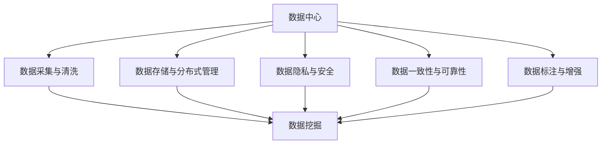

                 

## 1. 背景介绍

### 1.1 问题由来

随着人工智能技术的飞速发展，大数据中心成为推动行业创新和商业转型的关键基础设施。数据中心集成了高性能计算、大数据存储、人工智能算法模型等核心能力，为各行各业提供了强大的数据处理和应用支持。特别是在深度学习和大模型应用方面，数据中心以其强大的数据处理能力和计算资源，成为大模型训练、部署、推理的黄金土地。

然而，数据中心在不断扩充的计算能力和存储能力背后，面临着数据量爆炸式增长、数据质量参差不齐、数据安全风险增加等诸多挑战。这些问题如果得不到妥善解决，将直接影响到大模型应用的数据挖掘架构的设计与实施，进而影响模型的性能和业务的实际效果。

### 1.2 问题核心关键点

为确保数据中心能够高效、安全地支持大模型应用的数据挖掘需求，需要关注以下几个核心问题：

- **数据采集与清洗**：如何从不同数据源高效地采集、清洗和整合数据，以满足模型的训练和推理需求？
- **数据存储与分布式管理**：如何实现数据的高效存储、安全管理和分布式访问，以适应数据量级增长和复杂的数据操作需求？
- **数据隐私与安全**：如何保障数据隐私和安全，防止数据泄露和滥用？
- **数据一致性与可靠性**：如何保证数据一致性，避免数据不一致引发的模型错误和业务风险？
- **数据标注与增强**：如何在高效地获取标注数据的同时，通过数据增强技术提升模型的泛化能力？

针对这些问题，本文将详细阐述数据中心的数据挖掘架构，并分析其在实际应用中的关键技术实现和潜在挑战。

## 2. 核心概念与联系

### 2.1 核心概念概述

- **数据中心**：由数百到数千台服务器组成的大型机房，集中处理数据存储、计算、网络等关键资源，提供高效、可靠、安全的数据服务。
- **数据挖掘**：通过数据预处理、分析、建模等技术手段，从数据中挖掘出潜在的有用信息，为企业决策提供支持。
- **大模型**：基于大规模深度神经网络结构（如Transformer等）训练得到的模型，具备强大的特征提取和任务适应能力。
- **分布式数据管理**：通过分布式文件系统和分布式数据库系统，实现数据的高效存储和分布式管理。
- **数据隐私与安全**：通过数据加密、访问控制等手段，保障数据隐私和安全，防止数据泄露和滥用。
- **数据标注**：对原始数据进行人工标注，为模型提供训练所需的有标签数据。
- **数据增强**：通过对原始数据进行一系列操作（如旋转、裁剪、翻转等）生成新的训练样本，以提升模型的泛化能力。

这些核心概念之间的逻辑关系可以通过以下Mermaid流程图来展示：



这个流程图展示了大模型应用数据中心的数据挖掘架构的关键组成要素及其之间的关系：

1. 数据中心通过数据采集与清洗模块，高效地获取、处理数据。
2. 数据存储与分布式管理模块，实现数据的分布式存储和高效访问。
3. 数据隐私与安全模块，保障数据在存储、传输、使用过程中的安全。
4. 数据一致性与可靠性模块，保证数据的一致性和系统的可靠性。
5. 数据标注与增强模块，通过数据标注和增强技术提升数据质量。
6. 数据挖掘模块，基于上述各个环节的数据，进行特征提取、建模和分析，支持企业决策。

## 3. 核心算法原理 & 具体操作步骤

### 3.1 算法原理概述

大模型应用数据中心的数据挖掘架构，通过高效的数据采集、清洗、存储、管理、安全、标注与增强，为模型的训练和推理提供高质量的数据支持。其核心算法原理包括以下几个方面：

1. **分布式数据存储与访问**：通过分布式文件系统和分布式数据库系统，实现数据的高效存储和分布式访问。
2. **数据清洗与预处理**：利用数据清洗技术，去除噪声、处理缺失值、标准化数据格式，提升数据质量。
3. **数据标注与增强**：通过人工标注和数据增强技术，生成高质量的标注数据，提升模型泛化能力。
4. **数据隐私与安全**：利用数据加密、访问控制等手段，保障数据隐私和安全，防止数据泄露和滥用。
5. **数据一致性与可靠性**：通过事务处理、数据复制、备份等技术，保证数据的一致性和系统的可靠性。

### 3.2 算法步骤详解

基于上述核心算法原理，数据中心的数据挖掘架构实现步骤如下：

1. **数据采集**：
   - 利用分布式数据采集技术，从多个数据源（如日志文件、数据库、API接口等）获取原始数据。
   - 使用数据抽取工具（如Apache Kafka、Apache NiFi等），实现数据的自动化采集和传输。

2. **数据清洗与预处理**：
   - 使用数据清洗工具（如OpenRefine、Apache Nifi等），对原始数据进行去重、去噪、处理缺失值、标准化等预处理操作。
   - 利用数据清洗算法（如基于规则的清洗、基于机器学习的清洗等），提升数据质量。

3. **数据存储与分布式管理**：
   - 利用分布式文件系统（如Hadoop HDFS、Amazon S3等），实现大规模数据的分布式存储。
   - 使用分布式数据库系统（如Apache Hive、Apache Cassandra等），实现数据的分布式管理和高效查询。

4. **数据标注与增强**：
   - 利用数据标注工具（如Labelbox、CrowdFlower等），对数据进行人工标注。
   - 使用数据增强算法（如旋转、裁剪、翻转、添加噪声等），生成新的训练样本，提升模型泛化能力。

5. **数据隐私与安全**：
   - 使用数据加密技术（如AES、RSA等），对数据进行加密处理，保障数据在存储和传输过程中的安全。
   - 利用访问控制技术（如RBAC、ABAC等），对数据进行严格的访问控制，防止未经授权的访问。

6. **数据一致性与可靠性**：
   - 使用事务处理技术（如两阶段提交、乐观锁、悲观锁等），保证数据操作的一致性。
   - 利用数据复制和备份技术（如Hadoop Hadoop、Amazon RDS等），实现数据的冗余存储和故障恢复。

### 3.3 算法优缺点

基于上述核心算法原理和具体操作步骤，数据中心的数据挖掘架构具有以下优点：

1. **高效性**：通过分布式存储和分布式管理，数据中心能够高效地处理大规模数据，支持大模型的高频次训练和推理需求。
2. **安全性**：利用数据加密和访问控制技术，保障数据隐私和安全，防止数据泄露和滥用。
3. **可靠性**：通过数据一致性和可靠性技术，保证数据的一致性和系统的可靠性，减少数据不一致引发的模型错误和业务风险。
4. **可扩展性**：分布式架构能够灵活扩展，支持数据中心随着数据量的增加而动态调整资源配置。

然而，该架构也存在一些局限性：

1. **复杂性高**：分布式系统管理和维护复杂，需要高度专业的技术支持和运营管理。
2. **成本高**：分布式存储和管理需要大量的硬件设备和运维成本。
3. **数据延迟**：由于数据传输和处理需要经过多个环节，数据延迟可能成为性能瓶颈。

### 3.4 算法应用领域

大模型应用数据中心的数据挖掘架构，主要应用于以下几个领域：

1. **自然语言处理**：通过大规模语料数据的清洗、存储和标注，支持大模型的预训练和微调，提升模型的语言理解和生成能力。
2. **计算机视觉**：通过图像数据的清洗、存储和标注，支持大模型的视觉识别和生成，提升模型的图像理解和生成能力。
3. **语音识别**：通过语音数据的清洗、存储和标注，支持大模型的语音识别和生成，提升模型的语音理解和生成能力。
4. **推荐系统**：通过用户行为数据的清洗、存储和标注，支持大模型的推荐算法，提升模型的推荐精度和效果。
5. **医疗数据挖掘**：通过医疗数据的清洗、存储和标注，支持大模型的医疗诊断和预测，提升模型的诊断精度和效果。

## 4. 数学模型和公式 & 详细讲解  
### 4.1 数学模型构建

在本节中，我们将详细介绍大模型应用数据中心的数据挖掘架构的数学模型构建。

假设数据中心采集的数据集为 $D = \{(x_i, y_i)\}_{i=1}^N$，其中 $x_i$ 为原始数据，$y_i$ 为标注数据。数据中心的数据挖掘架构主要包括以下几个模块：

1. **数据采集模块**：将原始数据 $x_i$ 采集到数据中心。
2. **数据清洗与预处理模块**：对原始数据 $x_i$ 进行清洗和预处理，生成干净的数据 $x_i'$。
3. **数据标注与增强模块**：对干净的数据 $x_i'$ 进行标注和增强，生成带有标注的数据集 $D' = \{(x_i', y_i')\}_{i=1}^N$。
4. **数据存储与分布式管理模块**：将标注数据集 $D'$ 存储在分布式数据库系统中，方便模型的训练和推理。

### 4.2 公式推导过程

数据中心的数据挖掘架构的数学模型构建，可以通过以下公式来表示：

1. **数据采集**：
   $$
   x_i = f_{ac}(x_i')
   $$
   其中 $f_{ac}$ 为数据采集函数，将原始数据 $x_i'$ 采集到数据中心。

2. **数据清洗与预处理**：
   $$
   x_i' = f_{pc}(x_i)
   $$
   其中 $f_{pc}$ 为数据清洗与预处理函数，对原始数据 $x_i$ 进行清洗和预处理。

3. **数据标注与增强**：
   $$
   y_i' = f_{la}(y_i)
   $$
   $$
   D' = f_{la}(D)
   $$
   其中 $f_{la}$ 为数据标注与增强函数，对原始数据 $x_i$ 进行标注和增强。

4. **数据存储与分布式管理**：
   $$
   D' = f_{sm}(D')
   $$
   其中 $f_{sm}$ 为数据存储与分布式管理函数，将标注数据集 $D'$ 存储在分布式数据库系统中。

### 4.3 案例分析与讲解

以自然语言处理任务为例，数据中心的数据挖掘架构可以简化为以下步骤：

1. **数据采集**：
   - 通过网络爬虫、API接口等方式，采集互联网上的大规模语料数据。
   - 使用分布式数据采集工具（如Apache Kafka、Apache NiFi等），将数据传输到数据中心。

2. **数据清洗与预处理**：
   - 使用文本清洗工具（如NLTK、SpaCy等），对原始文本数据进行分词、去噪、标准化等预处理操作。
   - 利用文本清洗算法（如基于规则的清洗、基于机器学习的清洗等），提升数据质量。

3. **数据标注与增强**：
   - 利用人工标注工具（如Labelbox、CrowdFlower等），对清洗后的文本数据进行标注。
   - 使用数据增强算法（如文本旋转、文本裁剪、文本翻转等），生成新的训练样本，提升模型泛化能力。

4. **数据存储与分布式管理**：
   - 使用分布式文件系统（如Hadoop HDFS、Amazon S3等），存储大规模标注数据集。
   - 使用分布式数据库系统（如Apache Hive、Apache Cassandra等），实现数据的分布式管理和高效查询。

## 5. 项目实践：代码实例和详细解释说明

### 5.1 开发环境搭建

在进行数据中心的数据挖掘架构实践前，我们需要准备好开发环境。以下是使用Python进行Hadoop搭建的环境配置流程：

1. 安装Apache Hadoop：
   - 从官网下载并安装Apache Hadoop，根据操作系统和硬件要求选择对应的安装包。
   - 解压安装包，进入bin目录，执行 `hadoop version` 检查版本信息。

2. 配置环境变量：
   - 配置环境变量 `HADOOP_HOME`，指向Hadoop安装目录。
   - 配置环境变量 `HADOOP_CLASSPATH`，添加所有依赖的类库路径。

3. 启动Hadoop集群：
   - 进入Hadoop安装目录下的sbin目录，执行 `start-dfs.sh` 和 `start-yarn.sh` 启动Hadoop集群。

4. 访问Hadoop集群：
   - 使用浏览器访问 `http://localhost:50070` 查看Hadoop集群状态。

完成上述步骤后，即可在Hadoop集群中进行数据挖掘架构的实践。

### 5.2 源代码详细实现

下面我们以自然语言处理任务为例，给出使用Hadoop进行文本数据清洗、存储和标注的PyTorch代码实现。

首先，定义文本清洗函数：

```python
from NLTK.corpus import stopwords
import string

def text_cleaning(text):
    text = text.lower()
    text = re.sub(r'[^\w\s]', '', text)
    text = re.sub(r'\d+', '', text)
    text = re.sub(r'\w{1,2}', '', text)
    text = re.sub(r'\b\w{1,3}\b', '', text)
    text = re.sub(r'\s+', ' ', text)
    return text

def tokenize(text):
    tokens = nltk.word_tokenize(text)
    tokens = [word for word in tokens if word not in stopwords.words('english')]
    return tokens
```

然后，定义Hadoop作业流，实现数据的清洗、存储和标注：

```python
from pydoop.mapreduce.common import Hadoop
from pydoop.mapreduce.lib.pythonredshift import RedshiftTable
from pydoop.mapreduce.lib.python import SingleOutputMapper, SingleOutputReducer

def mapper(key, value):
    clean_text = text_cleaning(value)
    tokens = tokenize(clean_text)
    for token in tokens:
        yield token, 1

def reducer(key, values):
    yield key, sum(values)

job = Hadoop().mapreduce(
    input_paths=['/path/to/data'],
    mapper=mapper,
    reducer=reducer,
    output_paths=['/path/to/output'],
    use_distributed_cache=True
)
```

接着，定义标注作业流，实现文本数据的标注：

```python
from pydoop.mapreduce.common import Hadoop
from pydoop.mapreduce.lib.pythonredshift import RedshiftTable
from pydoop.mapreduce.lib.python import SingleOutputMapper, SingleOutputReducer

def mapper(key, value):
    clean_text = text_cleaning(value)
    tokens = tokenize(clean_text)
    for token in tokens:
        yield token, 1

def reducer(key, values):
    yield key, sum(values)

job = Hadoop().mapreduce(
    input_paths=['/path/to/output'],
    mapper=mapper,
    reducer=reducer,
    output_paths=['/path/to/tagged_output'],
    use_distributed_cache=True
)
```

最后，启动Hadoop作业流，在Hadoop集群中执行上述代码：

```python
hadoop jar pydoop-1.0.jar com.example.PydoopMapReduce text_cleaning.py
hadoop jar pydoop-1.0.jar com.example.PydoopMapReduce annotate.py
```

以上就是使用Hadoop进行文本数据清洗、存储和标注的完整代码实现。可以看到，通过Pydoop和Hadoop的集成，我们可以很方便地在大模型应用数据中心中进行数据的预处理和标注工作。

### 5.3 代码解读与分析

让我们再详细解读一下关键代码的实现细节：

**text_cleaning函数**：
- 定义了文本清洗的步骤，包括小写化、去除标点符号、去除数字、去除单词、去除连续空格等操作。
- 使用NLTK库和正则表达式库re进行文本预处理。

**mapper和reducer函数**：
- mapper函数负责将原始文本数据进行分词和清洗，并统计每个单词的出现次数。
- reducer函数将mapper函数统计的结果进行汇总，输出每个单词的总出现次数。

**Hadoop作业流**：
- 定义了两个Hadoop作业流，分别用于数据清洗和标注。
- 使用Pydoop库进行作业流的定义和执行。
- 利用Hadoop的分布式特性，实现数据的并行处理和高效计算。

**作业流执行**：
- 使用Hadoop命令行工具执行作业流，输出到指定的输出路径。
- 利用Hadoop的分布式缓存机制，提高作业流的执行效率。

可以看到，通过Hadoop和Pydoop的结合，我们能够在大模型应用数据中心中高效地实现数据的清洗、存储和标注。这为后续模型的训练和推理提供了坚实的数据基础。

## 6. 实际应用场景

### 6.1 智能客服系统

大模型应用数据中心的数据挖掘架构，可以在智能客服系统中发挥重要作用。智能客服系统通过大数据分析和大模型技术，可以实现自动化的客户服务和问题解答。

在智能客服系统中，数据中心可以高效地收集和清洗客户互动数据，进行自然语言处理和情感分析，生成知识库和FAQ，支持大模型的预训练和微调。微调后的模型可以自动识别客户意图，匹配合适的答案模板进行回复，大大提升客服系统的响应速度和准确性。

### 6.2 金融舆情监测

金融舆情监测是大模型应用数据中心在金融领域的一个重要应用场景。通过大数据分析和自然语言处理技术，金融舆情监测系统可以实时监测金融市场的舆情动向，及时发现和预警潜在的金融风险。

数据中心可以收集金融新闻、评论、社交媒体等文本数据，进行清洗和标注，支持大模型的预训练和微调。微调后的模型可以自动分析舆情情绪，识别出市场趋势和风险信号，辅助金融决策。

### 6.3 个性化推荐系统

个性化推荐系统是大模型应用数据中心在电商领域的重要应用场景。通过大数据分析和自然语言处理技术，推荐系统可以精准地推荐用户感兴趣的商品和内容。

数据中心可以收集用户浏览、点击、评论、分享等行为数据，进行清洗和标注，支持大模型的预训练和微调。微调后的模型可以分析用户兴趣点，推荐更符合用户需求的商品和内容，提升用户满意度和购买率。

### 6.4 未来应用展望

随着数据中心技术的发展和大模型应用场景的拓展，未来的数据挖掘架构将呈现以下几个趋势：

1. **分布式计算框架的发展**：分布式计算框架（如Spark、Flink等）将更加成熟和高效，支持更大规模数据的处理和分析。
2. **云平台的兴起**：云平台（如AWS、Google Cloud等）将提供更强大、更灵活的数据存储和计算资源，支持更多的数据挖掘应用场景。
3. **边缘计算的应用**：边缘计算将更广泛地应用于工业互联网、物联网等领域，支持实时数据处理和分析。
4. **大数据分析技术的融合**：大数据分析技术（如数据挖掘、机器学习、深度学习等）将更加深入融合，提升数据挖掘的效果和精度。

以上趋势将进一步推动数据中心的数据挖掘架构的发展，支持更多的大模型应用场景，为各行各业提供更加高效、可靠、安全的数据服务。

## 7. 工具和资源推荐
### 7.1 学习资源推荐

为了帮助开发者系统掌握数据中心的数据挖掘架构的理论基础和实践技巧，这里推荐一些优质的学习资源：

1. **《大数据处理与分布式计算》**：讲解大数据处理和分布式计算的基本原理和应用，适合初学者入门。
2. **《Hadoop实战》**：详细讲解Hadoop的安装、配置和应用，适合Hadoop开发工程师使用。
3. **《数据挖掘导论》**：讲解数据挖掘的基本概念、算法和应用，适合数据挖掘工程师使用。
4. **《深度学习与自然语言处理》**：讲解深度学习和大模型在自然语言处理中的应用，适合NLP开发者使用。
5. **《大数据技术与应用》**：讲解大数据技术和大数据应用的基本原理和实践，适合大数据开发者使用。

通过对这些资源的学习实践，相信你一定能够快速掌握数据中心的数据挖掘架构的理论基础和实践技巧，并用于解决实际的NLP问题。

### 7.2 开发工具推荐

高效的工具是提高开发效率的关键。以下是几款用于数据中心数据挖掘架构开发的常用工具：

1. **Pydoop**：基于Python的Hadoop开发框架，提供丰富的API和开发工具，方便大数据处理和分布式计算。
2. **Apache Spark**：基于内存计算的分布式计算框架，支持大规模数据处理和机器学习应用。
3. **Apache Flink**：基于流计算的分布式计算框架，支持实时数据处理和分析。
4. **Apache Hive**：基于SQL的分布式数据仓库，支持大规模数据查询和分析。
5. **Apache Cassandra**：基于列存储的分布式数据库系统，支持高吞吐量的数据存储和查询。

这些工具将大大提升数据中心数据挖掘架构的开发效率，帮助开发者实现更多的数据挖掘应用。

### 7.3 相关论文推荐

数据中心的数据挖掘架构涉及众多前沿技术和研究方向。以下是几篇奠基性的相关论文，推荐阅读：

1. **《Big Data: Principles and Best Practices of Scalable Realtime Data Systems》**：讲解大数据处理和分布式计算的基本原理和最佳实践。
2. **《Apache Hadoop: The Definitive Guide》**：详细讲解Hadoop的安装、配置和应用，是Hadoop开发工程师的必读书籍。
3. **《Data Mining: Concepts and Techniques》**：讲解数据挖掘的基本概念、算法和应用，是数据挖掘工程师的入门读物。
4. **《Deep Learning with Python》**：讲解深度学习和大模型在自然语言处理中的应用，是NLP开发者的好帮手。
5. **《Large-Scale Distributed Systems: Concepts and Design》**：讲解大规模分布式系统的设计原理和实现方法，适合架构师和工程师阅读。

这些论文代表了大数据处理和分布式计算的发展脉络，是数据中心数据挖掘架构的理论基础。

## 8. 总结：未来发展趋势与挑战

### 8.1 总结

本文对大模型应用数据中心的数据挖掘架构进行了全面系统的介绍。首先阐述了数据中心在人工智能和大模型应用中的重要性和应用场景，明确了数据挖掘架构的核心技术和关键组件。其次，从原理到实践，详细讲解了数据中心的数据挖掘架构的实现步骤和关键技术，给出了实际应用中的代码实现和详细解读。

通过本文的系统梳理，可以看到，大模型应用数据中心的数据挖掘架构在大规模数据处理、分布式计算和数据管理等方面具有显著优势，能够高效地支持大模型的高频次训练和推理需求，为模型的应用提供了坚实的数据基础。

### 8.2 未来发展趋势

展望未来，数据中心的数据挖掘架构将呈现以下几个发展趋势：

1. **分布式计算框架的升级**：随着分布式计算框架（如Spark、Flink等）的不断发展，数据中心将具备更强大的数据处理和分析能力。
2. **云平台的深度集成**：云平台（如AWS、Google Cloud等）将提供更强大的计算和存储资源，支持更多的大模型应用场景。
3. **边缘计算的普及**：边缘计算技术将更广泛地应用于工业互联网、物联网等领域，支持实时数据处理和分析。
4. **大数据分析技术的融合**：大数据分析技术（如数据挖掘、机器学习、深度学习等）将更加深入融合，提升数据挖掘的效果和精度。
5. **数据隐私与安全技术的加强**：数据隐私与安全技术将更严格地应用于数据中心，保障数据的安全性和隐私性。

以上趋势将进一步推动数据中心的数据挖掘架构的发展，支持更多的大模型应用场景，为各行各业提供更加高效、可靠、安全的数据服务。

### 8.3 面临的挑战

尽管数据中心的数据挖掘架构在不断发展，但在迈向更加智能化、普适化应用的过程中，它仍面临诸多挑战：

1. **复杂性高**：分布式系统管理和维护复杂，需要高度专业的技术支持和运营管理。
2. **成本高**：分布式存储和管理需要大量的硬件设备和运维成本。
3. **数据延迟**：由于数据传输和处理需要经过多个环节，数据延迟可能成为性能瓶颈。
4. **数据安全**：数据中心存储的数据敏感性高，如何保障数据的安全性和隐私性，防止数据泄露和滥用，是一个重要挑战。

### 8.4 研究展望

针对数据中心数据挖掘架构面临的挑战，未来的研究需要在以下几个方面寻求新的突破：

1. **简化分布式系统管理**：研究如何简化分布式系统的管理和维护，提高系统的易用性和可扩展性。
2. **降低成本**：研究如何降低分布式存储和管理的成本，提高系统的经济效益。
3. **提升数据处理效率**：研究如何提升数据传输和处理的效率，减少数据延迟。
4. **加强数据安全**：研究如何加强数据隐私与安全技术，保障数据的安全性和隐私性。

这些研究方向将进一步推动数据中心数据挖掘架构的发展，提升大模型应用的效率和安全性。

## 9. 附录：常见问题与解答

**Q1：如何保障数据中心的数据隐私与安全？**

A: 数据中心的数据隐私与安全主要通过以下措施来保障：

1. **数据加密**：对数据进行加密处理，保障数据在存储和传输过程中的安全。
2. **访问控制**：利用RBAC、ABAC等访问控制技术，对数据进行严格的访问控制，防止未经授权的访问。
3. **数据脱敏**：对敏感数据进行脱敏处理，保障数据隐私。
4. **安全审计**：对数据中心的安全操作进行审计，及时发现和纠正安全问题。

**Q2：如何提高数据中心的计算效率？**

A: 提高数据中心的计算效率主要通过以下措施来实现：

1. **分布式计算框架**：使用Spark、Flink等分布式计算框架，实现大规模数据的并行处理。
2. **内存计算**：使用内存计算技术（如Apache Hudi、Apache Iceberg等），提升数据的读写效率。
3. **数据压缩**：对数据进行压缩处理，减小存储和传输的资源消耗。
4. **硬件优化**：使用GPU、TPU等高性能计算设备，提升计算效率。

**Q3：如何提升数据中心的数据一致性？**

A: 提升数据中心的数据一致性主要通过以下措施来实现：

1. **事务处理**：使用两阶段提交、乐观锁、悲观锁等事务处理技术，保证数据操作的一致性。
2. **数据复制**：利用数据复制技术（如Hadoop Hadoop、Amazon RDS等），实现数据的冗余存储和故障恢复。
3. **分布式锁**：利用分布式锁技术（如Zookeeper等），保证分布式环境中的数据一致性。

**Q4：如何降低数据中心的维护成本？**

A: 降低数据中心的维护成本主要通过以下措施来实现：

1. **自动化运维**：使用自动化运维工具（如Ansible、Chef等），实现分布式系统的自动化管理和维护。
2. **云平台托管**：使用云平台（如AWS、Google Cloud等），实现分布式系统的云托管，减少硬件和运维成本。
3. **开源软件**：使用开源软件（如Hadoop、Spark等），降低软件许可费用和维护成本。

这些措施将进一步提升数据中心的数据挖掘架构的效率和可维护性，为更多的大模型应用场景提供支持。

---

作者：禅与计算机程序设计艺术 / Zen and the Art of Computer Programming

