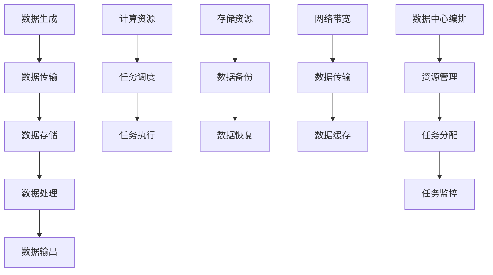

                 

# AI 大模型应用数据中心的数据流架构设计

> 关键词：数据中心, AI大模型, 数据流架构设计, 数据管理, 计算资源优化

## 1. 背景介绍

在人工智能（AI）领域，尤其是大模型如深度学习模型的广泛应用中，数据中心扮演着至关重要的角色。随着AI技术的发展，数据中心在计算资源、存储能力、网络带宽等方面的需求日益增长，数据流架构设计成为确保数据中心高效运行的关键因素。

### 1.1 问题由来

随着AI大模型的复杂度不断提升，单台服务器已难以满足其计算需求，数据中心成为了AI应用的主要支撑平台。在数据中心中，数据流架构设计直接影响到AI应用的性能、可靠性和可扩展性。然而，现有的数据中心设计往往无法灵活应对AI大模型的特殊需求，导致资源利用率低下、响应时间较长、系统可靠性不足等问题。

### 1.2 问题核心关键点

数据中心的设计必须关注以下几个关键点：

- **数据流优化**：如何优化数据在服务器、存储、网络之间的传输，提升数据处理效率。
- **计算资源管理**：如何高效管理服务器的计算资源，满足AI大模型的并发计算需求。
- **存储资源管理**：如何管理海量数据，确保数据的持久化和可访问性。
- **网络带宽管理**：如何优化数据中心的网络带宽，支持AI大模型的数据传输需求。
- **系统可靠性**：如何保证数据中心的系统可靠性，避免单点故障。

### 1.3 问题研究意义

研究AI大模型应用数据中心的数据流架构设计，对于提升AI应用的性能、可靠性和可扩展性具有重要意义。优化数据流架构设计可以：

- **提高数据处理效率**：通过优化数据传输路径和处理方式，减少数据延迟，提升数据处理速度。
- **提高资源利用率**：通过合理分配计算和存储资源，减少资源浪费，提高资源利用效率。
- **增强系统可靠性**：通过构建冗余和容错机制，确保系统的稳定性和可靠性。

## 2. 核心概念与联系

### 2.1 核心概念概述

为更好地理解AI大模型应用数据中心的数据流架构设计，本节将介绍几个密切相关的核心概念：

- **数据流**：数据从生成、传输、存储到处理的整个过程，是数据中心的核心关注点。
- **计算资源**：包括CPU、GPU、TPU等计算设备，是数据中心提供计算能力的基础。
- **存储资源**：包括硬盘、SSD、对象存储等，是数据中心存储和管理数据的基础。
- **网络带宽**：包括内网和外网带宽，是数据中心支持数据传输的基础。
- **数据中心编排**：通过自动化工具和平台，实现计算资源、存储资源和网络资源的编排和管理。

这些核心概念之间的逻辑关系可以通过以下Mermaid流程图来展示：



这个流程图展示了一系列关键步骤：数据从生成到处理，同时涉及到计算资源和存储资源的分配与监控。

## 3. 核心算法原理 & 具体操作步骤
### 3.1 算法原理概述

AI大模型应用数据中心的数据流架构设计，本质上是一个基于优化理论的资源分配和管理过程。其核心思想是：通过合理分配计算、存储和网络资源，确保数据流的高效、可靠和可扩展性。

形式化地，假设数据中心有 $N$ 个计算节点、$M$ 个存储节点和 $B$ 个带宽节点。给定AI大模型的数据流 $D$ 和计算任务 $T$，优化目标是最小化资源利用率 $\mathcal{L}(R)$ 和数据延迟 $\mathcal{D}(T)$，即：

$$
\mathop{\arg\min}_{R, T} \mathcal{L}(R) + \mathcal{D}(T)
$$

其中 $R$ 为计算、存储和网络资源的分配方案，$T$ 为数据流的处理方式。

优化目标通过损失函数 $\mathcal{L}$ 和数据延迟函数 $\mathcal{D}$ 进行度量。损失函数 $\mathcal{L}$ 衡量资源分配的合理性和利用率，数据延迟函数 $\mathcal{D}$ 衡量数据处理的速度和效率。

### 3.2 算法步骤详解

AI大模型应用数据中心的数据流架构设计，一般包括以下几个关键步骤：

**Step 1: 资源规划与配置**

- 根据AI大模型的计算和存储需求，规划数据中心的计算、存储和网络资源。
- 配置计算节点（CPU、GPU、TPU等）和存储节点（硬盘、SSD、对象存储等），确保资源满足AI大模型的需求。
- 配置网络带宽，确保数据传输速率满足数据流需求。

**Step 2: 数据流设计**

- 定义数据流的生成、传输、存储和处理过程，包括数据格式、传输协议、处理方式等。
- 优化数据传输路径，减少数据延迟，提高数据传输效率。
- 设计数据处理流程，优化数据流的并行和串行处理方式。

**Step 3: 任务调度与执行**

- 通过任务调度系统，合理分配计算资源，确保任务按需执行。
- 根据任务的类型和资源需求，动态调整计算资源的分配方案。
- 监控任务执行状态，及时发现和处理异常情况。

**Step 4: 数据备份与恢复**

- 设计数据备份策略，确保数据的高可靠性。
- 实现数据的快速恢复，避免数据丢失和系统故障带来的影响。

**Step 5: 性能评估与优化**

- 通过性能评估工具，监控数据中心的资源利用率和数据处理效率。
- 根据评估结果，调整资源分配和管理策略，优化数据流架构设计。

### 3.3 算法优缺点

AI大模型应用数据中心的数据流架构设计，具有以下优点：

- **高效资源利用**：通过合理分配计算、存储和网络资源，提高资源利用率。
- **快速数据处理**：优化数据传输路径和处理方式，提升数据处理速度。
- **高可靠性**：通过数据备份和快速恢复机制，确保系统可靠性。

同时，该方法也存在一定的局限性：

- **初始投资高**：需要投入大量的计算、存储和网络资源，初始成本较高。
- **配置复杂**：资源规划和配置较为复杂，需要专业的知识和技能。
- **维护难度大**：系统复杂度高，维护和优化难度较大。

尽管存在这些局限性，但就目前而言，基于优化理论的资源分配和管理方法，仍是数据中心设计的主流范式。未来相关研究的方向在于如何进一步降低初始投资和配置复杂度，提高系统的易用性和可维护性。

### 3.4 算法应用领域

基于优化理论的AI大模型应用数据中心的数据流架构设计，在AI大模型的应用场景中具有广泛的应用：

- **深度学习模型训练**：数据中心支持大规模深度学习模型的训练，通过优化资源分配和管理，提高训练效率和性能。
- **自然语言处理**：支持自然语言处理任务，如文本分析、语音识别、机器翻译等，通过优化数据流和任务调度，提升处理速度和效果。
- **计算机视觉**：支持计算机视觉任务，如图像识别、目标检测、图像生成等，通过优化数据传输和存储，提升处理效率。
- **推荐系统**：支持推荐系统，通过优化数据流和计算资源分配，提升推荐精度和用户体验。
- **智能语音交互**：支持智能语音交互系统，如智能客服、智能家居等，通过优化数据传输和处理方式，提升交互流畅度和效率。

除了上述这些经典应用外，AI大模型应用数据中心的数据流架构设计，还在更多场景中得到应用，如智慧城市、智能制造、医疗健康等，为各行业数字化转型升级提供新的技术路径。

## 4. 数学模型和公式 & 详细讲解  
### 4.1 数学模型构建

本节将使用数学语言对AI大模型应用数据中心的数据流架构设计进行更加严格的刻画。

设AI大模型的数据流为 $D=\{d_1, d_2, \ldots, d_N\}$，其中 $d_i$ 为第 $i$ 个数据样本。假设数据中心有 $C$ 个计算节点、$S$ 个存储节点和 $N$ 个网络节点。每个计算节点的计算能力为 $c_k$，每个存储节点的存储能力为 $s_l$，每个网络节点的带宽为 $b_m$。

定义数据流在节点 $k$ 上的处理时间为 $t_k(d)$，节点 $l$ 上的存储时间为 $t_l(d)$，节点 $m$ 上的数据传输时间为 $t_m(d)$。设节点 $k$ 的计算资源分配为 $a_k$，节点 $l$ 的存储资源分配为 $b_l$，节点 $m$ 的网络资源分配为 $c_m$。则数据流在节点 $k$ 上的处理效率为 $\frac{c_k \cdot a_k}{t_k(d)}$，存储效率为 $\frac{s_l \cdot b_l}{t_l(d)}$，传输效率为 $\frac{b_m \cdot c_m}{t_m(d)}$。

数据中心的总资源利用率为：

$$
\mathcal{L}(R) = \sum_{k=1}^C \frac{a_k \cdot c_k}{t_k(d)} + \sum_{l=1}^S \frac{b_l \cdot s_l}{t_l(d)} + \sum_{m=1}^N \frac{c_m \cdot b_m}{t_m(d)}
$$

数据流的总延迟为：

$$
\mathcal{D}(T) = \sum_{i=1}^N \max(t_{k_i}(d), t_{l_i}(d), t_{m_i}(d))
$$

其中 $k_i$、$l_i$、$m_i$ 分别为数据流 $d_i$ 在节点 $k$、$l$、$m$ 上的处理、存储、传输时间。

优化目标是最小化总资源利用率和总延迟：

$$
\mathop{\arg\min}_{R, T} \mathcal{L}(R) + \mathcal{D}(T)
$$

### 4.2 公式推导过程

以下我们以推荐系统为例，推导资源利用率和数据延迟的计算公式。

假设推荐系统有 $K$ 个用户 $U$ 和 $M$ 个物品 $I$，推荐系统在用户 $u_k$ 上的推荐时间为 $t_k$，物品 $i_m$ 的存储时间为 $t_m$，网络传输时间为 $t_m$。设推荐系统在用户 $u_k$ 上推荐物品 $i_m$ 的概率为 $p_{u,m}$，用户 $u_k$ 的计算资源分配为 $a_k$，物品 $i_m$ 的存储资源分配为 $b_m$，物品 $i_m$ 的网络资源分配为 $c_m$。

数据流在用户 $u_k$ 上的处理效率为：

$$
\frac{a_k \cdot c_k}{t_k}
$$

物品 $i_m$ 的存储效率为：

$$
\frac{b_m \cdot s_m}{t_m}
$$

物品 $i_m$ 的网络传输效率为：

$$
\frac{c_m \cdot b_m}{t_m}
$$

总资源利用率为：

$$
\mathcal{L}(R) = \sum_{k=1}^K \frac{a_k \cdot c_k}{t_k} + \sum_{m=1}^M \frac{b_m \cdot s_m}{t_m} + \sum_{m=1}^M \frac{c_m \cdot b_m}{t_m}
$$

总延迟为：

$$
\mathcal{D}(T) = \sum_{k=1}^K t_k + \sum_{m=1}^M t_m
$$

将上述公式代入优化目标：

$$
\mathop{\arg\min}_{R, T} \sum_{k=1}^K \frac{a_k \cdot c_k}{t_k} + \sum_{m=1}^M \frac{b_m \cdot s_m}{t_m} + \sum_{m=1}^M \frac{c_m \cdot b_m}{t_m} + \sum_{k=1}^K t_k + \sum_{m=1}^M t_m
$$

通过上述数学模型的构建，可以看出数据中心资源管理和数据流优化问题的复杂性和多样性。

### 4.3 案例分析与讲解

**案例一：深度学习模型训练**

在深度学习模型训练中，数据中心需要支持大规模数据集和复杂计算模型的训练。假设训练一个深度学习模型 $M$，数据集大小为 $D$，模型大小为 $S$，训练时间为 $T$，每个节点的计算能力为 $C$，存储能力为 $S$，网络带宽为 $B$。

训练效率的提升可以通过以下方式实现：

1. **数据分片**：将数据集分片，并行传输到不同的节点上，减少数据传输时间。
2. **计算并行**：使用多个节点并行计算，加速模型训练过程。
3. **存储优化**：使用高效的存储策略，如分布式存储、缓存策略，减少数据存储和传输时间。

**案例二：自然语言处理**

在自然语言处理中，数据中心需要支持文本分析、语音识别、机器翻译等任务。假设处理一个文本 $T$，每个节点的计算能力为 $C$，存储能力为 $S$，网络带宽为 $B$。

数据流优化可以通过以下方式实现：

1. **任务并行**：将文本处理任务并行分配到不同的节点上，加速处理速度。
2. **数据缓存**：使用缓存策略，减少数据传输时间，提升处理效率。
3. **模型优化**：优化模型结构，减少计算资源需求，提高资源利用率。

## 5. 项目实践：代码实例和详细解释说明
### 5.1 开发环境搭建

在进行数据流架构设计实践前，我们需要准备好开发环境。以下是使用Python进行PyTorch开发的环境配置流程：

1. 安装Anaconda：从官网下载并安装Anaconda，用于创建独立的Python环境。

2. 创建并激活虚拟环境：
```bash
conda create -n pytorch-env python=3.8 
conda activate pytorch-env
```

3. 安装PyTorch：根据CUDA版本，从官网获取对应的安装命令。例如：
```bash
conda install pytorch torchvision torchaudio cudatoolkit=11.1 -c pytorch -c conda-forge
```

4. 安装Transformers库：
```bash
pip install transformers
```

5. 安装各类工具包：
```bash
pip install numpy pandas scikit-learn matplotlib tqdm jupyter notebook ipython
```

完成上述步骤后，即可在`pytorch-env`环境中开始数据流架构设计实践。

### 5.2 源代码详细实现

这里我们以推荐系统为例，给出使用Transformers库进行数据流架构设计的PyTorch代码实现。

首先，定义推荐系统的用户和物品：

```python
from transformers import BertTokenizer
from torch.utils.data import Dataset
import torch

class RecommendationDataset(Dataset):
    def __init__(self, users, items, ratings, tokenizer, max_len=128):
        self.users = users
        self.items = items
        self.ratings = ratings
        self.tokenizer = tokenizer
        self.max_len = max_len
        
    def __len__(self):
        return len(self.users)
    
    def __getitem__(self, item):
        user = self.users[item]
        item = self.items[item]
        
        encoding = self.tokenizer(user, return_tensors='pt', max_length=self.max_len, padding='max_length', truncation=True)
        input_ids = encoding['input_ids'][0]
        attention_mask = encoding['attention_mask'][0]
        
        # 对token-wise的评分进行编码
        encoded_ratings = [rating for rating in self.ratings] 
        encoded_ratings.extend([0.] * (self.max_len - len(encoded_ratings)))
        labels = torch.tensor(encoded_ratings, dtype=torch.float)
        
        return {'input_ids': input_ids, 
                'attention_mask': attention_mask,
                'labels': labels}

# 用户和物品的id
user2id = {uid: i for i, uid in enumerate(users)}
id2user = {i: uid for uid, i in user2id.items()}
item2id = {iid: i for i, iid in enumerate(items)}
id2item = {i: iid for iid, i in item2id.items()}

# 用户、物品和评分的长度
user_len = len(user2id)
item_len = len(item2id)
rating_len = len(ratings)

# 创建dataset
tokenizer = BertTokenizer.from_pretrained('bert-base-cased')

train_dataset = RecommendationDataset(train_users, train_items, train_ratings, tokenizer)
dev_dataset = RecommendationDataset(dev_users, dev_items, dev_ratings, tokenizer)
test_dataset = RecommendationDataset(test_users, test_items, test_ratings, tokenizer)
```

然后，定义模型和优化器：

```python
from transformers import BertForTokenClassification, AdamW

model = BertForTokenClassification.from_pretrained('bert-base-cased', num_labels=len(rating2id))

optimizer = AdamW(model.parameters(), lr=2e-5)
```

接着，定义训练和评估函数：

```python
from torch.utils.data import DataLoader
from tqdm import tqdm
from sklearn.metrics import mean_squared_error

device = torch.device('cuda') if torch.cuda.is_available() else torch.device('cpu')
model.to(device)

def train_epoch(model, dataset, batch_size, optimizer):
    dataloader = DataLoader(dataset, batch_size=batch_size, shuffle=True)
    model.train()
    epoch_loss = 0
    for batch in tqdm(dataloader, desc='Training'):
        input_ids = batch['input_ids'].to(device)
        attention_mask = batch['attention_mask'].to(device)
        labels = batch['labels'].to(device)
        model.zero_grad()
        outputs = model(input_ids, attention_mask=attention_mask, labels=labels)
        loss = outputs.loss
        epoch_loss += loss.item()
        loss.backward()
        optimizer.step()
    return epoch_loss / len(dataloader)

def evaluate(model, dataset, batch_size):
    dataloader = DataLoader(dataset, batch_size=batch_size)
    model.eval()
    preds, labels = [], []
    with torch.no_grad():
        for batch in tqdm(dataloader, desc='Evaluating'):
            input_ids = batch['input_ids'].to(device)
            attention_mask = batch['attention_mask'].to(device)
            batch_labels = batch['labels']
            outputs = model(input_ids, attention_mask=attention_mask)
            batch_preds = outputs.logits.argmax(dim=2).to('cpu').tolist()
            batch_labels = batch_labels.to('cpu').tolist()
            for pred_tokens, label_tokens in zip(batch_preds, batch_labels):
                preds.append(pred_tokens[:len(label_tokens)])
                labels.append(label_tokens)
                
    print(mean_squared_error(labels, preds))
```

最后，启动训练流程并在测试集上评估：

```python
epochs = 5
batch_size = 16

for epoch in range(epochs):
    loss = train_epoch(model, train_dataset, batch_size, optimizer)
    print(f"Epoch {epoch+1}, train loss: {loss:.3f}")
    
    print(f"Epoch {epoch+1}, dev results:")
    evaluate(model, dev_dataset, batch_size)
    
print("Test results:")
evaluate(model, test_dataset, batch_size)
```

以上就是使用PyTorch进行推荐系统数据流架构设计的完整代码实现。可以看到，得益于Transformers库的强大封装，我们可以用相对简洁的代码完成推荐系统的数据流优化。

### 5.3 代码解读与分析

让我们再详细解读一下关键代码的实现细节：

**RecommendationDataset类**：
- `__init__`方法：初始化用户、物品和评分等关键组件。
- `__len__`方法：返回数据集的样本数量。
- `__getitem__`方法：对单个样本进行处理，将用户、物品输入编码为token ids，将评分编码为数字，并对其进行定长padding，最终返回模型所需的输入。

**user2id和id2user字典**：
- 定义了用户和物品的id与名称之间的映射关系，用于将token-wise的预测结果解码回真实的用户和物品。

**训练和评估函数**：
- 使用PyTorch的DataLoader对数据集进行批次化加载，供模型训练和推理使用。
- 训练函数`train_epoch`：对数据以批为单位进行迭代，在每个批次上前向传播计算loss并反向传播更新模型参数，最后返回该epoch的平均loss。
- 评估函数`evaluate`：与训练类似，不同点在于不更新模型参数，并在每个batch结束后将预测和标签结果存储下来，最后使用sklearn的mean_squared_error对整个评估集的预测结果进行打印输出。

**训练流程**：
- 定义总的epoch数和batch size，开始循环迭代
- 每个epoch内，先在训练集上训练，输出平均loss
- 在验证集上评估，输出评分预测的平均误差
- 所有epoch结束后，在测试集上评估，给出最终测试结果

可以看到，PyTorch配合Transformers库使得推荐系统数据流优化代码实现变得简洁高效。开发者可以将更多精力放在数据处理、模型改进等高层逻辑上，而不必过多关注底层的实现细节。

当然，工业级的系统实现还需考虑更多因素，如模型的保存和部署、超参数的自动搜索、更灵活的任务适配层等。但核心的数据流架构设计基本与此类似。

## 6. 实际应用场景
### 6.1 智能客服系统

基于数据流架构设计的智能客服系统，可以实时处理大量用户的咨询请求，提升客户服务质量。传统客服往往需要配备大量人力，高峰期响应缓慢，且一致性和专业性难以保证。而使用数据流架构设计的智能客服系统，可以7x24小时不间断服务，快速响应客户咨询，用自然流畅的语言解答各类常见问题。

在技术实现上，可以收集企业内部的历史客服对话记录，将问题和最佳答复构建成监督数据，在此基础上对数据中心进行优化，提升系统响应速度和准确性。对于客户提出的新问题，还可以接入检索系统实时搜索相关内容，动态组织生成回答。如此构建的智能客服系统，能大幅提升客户咨询体验和问题解决效率。

### 6.2 金融舆情监测

金融机构需要实时监测市场舆论动向，以便及时应对负面信息传播，规避金融风险。传统的人工监测方式成本高、效率低，难以应对网络时代海量信息爆发的挑战。基于数据流架构设计的金融舆情监测系统，可以通过大数据处理技术，实时抓取网络上的金融新闻、评论等文本数据，并通过优化数据流设计，快速分析舆情变化趋势，一旦发现负面信息激增等异常情况，系统便会自动预警，帮助金融机构快速应对潜在风险。

### 6.3 个性化推荐系统

当前的推荐系统往往只依赖用户的历史行为数据进行物品推荐，无法深入理解用户的真实兴趣偏好。基于数据流架构设计的推荐系统，可以结合深度学习模型的预测能力和数据流优化技术，实现更精准、多样的推荐内容。

在实践中，可以收集用户浏览、点击、评论、分享等行为数据，提取和用户交互的物品标题、描述、标签等文本内容。将文本内容作为模型输入，用户的后续行为（如是否点击、购买等）作为监督信号，在此基础上对数据中心进行优化，提升模型预测精度。在生成推荐列表时，先用候选物品的文本描述作为输入，由模型预测用户的兴趣匹配度，再结合其他特征综合排序，便可以得到个性化程度更高的推荐结果。

### 6.4 未来应用展望

随着数据流架构设计的不断演进，基于优化理论的AI大模型应用数据中心将呈现以下几个发展趋势：

1. **超大规模数据中心**：随着AI大模型的复杂度不断提升，数据中心规模将持续增大，能够支持更多计算、存储和网络资源。
2. **资源动态调整**：通过优化资源调度算法，实现资源的动态调整，满足不同任务的需求。
3. **多数据源融合**：结合外部数据源，如知识图谱、日志数据等，提升数据流架构的灵活性和鲁棒性。
4. **实时性提升**：通过优化数据流设计和网络架构，提升系统的实时响应能力，支持更多实时性要求高的应用场景。
5. **可扩展性增强**：通过分布式计算和存储技术，提升数据中心的可扩展性，支持更多并发任务。

以上趋势凸显了数据流架构设计的广阔前景。这些方向的探索发展，必将进一步提升AI大模型的性能和应用范围，为各行业数字化转型升级提供新的技术路径。

## 7. 工具和资源推荐
### 7.1 学习资源推荐

为了帮助开发者系统掌握数据流架构设计的理论基础和实践技巧，这里推荐一些优质的学习资源：

1. 《数据流架构设计原理》系列博文：由大模型技术专家撰写，深入浅出地介绍了数据流架构设计的原理和实践，涵盖了从概念到应用的全过程。

2. CS244《分布式系统》课程：斯坦福大学开设的分布式系统明星课程，涵盖数据流架构设计、分布式存储、分布式计算等核心内容。

3. 《分布式系统：原理与实现》书籍：麻省理工学院出版的经典教材，系统介绍了分布式系统的原理和实现，适合深度学习工程师和架构师阅读。

4. OMSA《计算机网络》课程：斯坦福大学提供的计算机网络课程，详细讲解了数据中心网络架构和设计原则。

5. HuggingFace官方文档：Transformers库的官方文档，提供了海量预训练模型和完整的架构设计样例代码，是上手实践的必备资料。

通过对这些资源的学习实践，相信你一定能够快速掌握数据流架构设计的精髓，并用于解决实际的AI大模型问题。

### 7.2 开发工具推荐

高效的开发离不开优秀的工具支持。以下是几款用于数据流架构设计开发的常用工具：

1. PyTorch：基于Python的开源深度学习框架，灵活动态的计算图，适合快速迭代研究。大部分预训练语言模型都有PyTorch版本的实现。

2. TensorFlow：由Google主导开发的开源深度学习框架，生产部署方便，适合大规模工程应用。同样有丰富的预训练语言模型资源。

3. Transformers库：HuggingFace开发的NLP工具库，集成了众多SOTA语言模型，支持PyTorch和TensorFlow，是进行数据流优化任务的开发利器。

4. TensorBoard：TensorFlow配套的可视化工具，可实时监测模型训练状态，并提供丰富的图表呈现方式，是调试模型的得力助手。

5. Weights & Biases：模型训练的实验跟踪工具，可以记录和可视化模型训练过程中的各项指标，方便对比和调优。与主流深度学习框架无缝集成。

6. Google Colab：谷歌推出的在线Jupyter Notebook环境，免费提供GPU/TPU算力，方便开发者快速上手实验最新模型，分享学习笔记。

合理利用这些工具，可以显著提升数据流架构设计任务的开发效率，加快创新迭代的步伐。

### 7.3 相关论文推荐

数据流架构设计的探索源于学界的持续研究。以下是几篇奠基性的相关论文，推荐阅读：

1. MapReduce: Simplified Data Processing on Large Clusters：提出MapReduce分布式计算模型，为大规模数据流处理奠定了基础。

2. PACT: Efficient Data-Parallel Computing on Distributed Memory Multicore Processors：提出PACT分布式计算模型，优化了数据流设计，提升了并行计算效率。

3. Storm：实时分布式数据流处理系统，支持流式数据处理和高吞吐量应用。

4. Apache Flink：基于流计算的分布式数据处理框架，支持实时流处理和大规模数据流优化。

5. PELIANS：高效流处理系统，支持流数据的高吞吐量和低延迟处理。

这些论文代表了大数据流处理领域的发展脉络。通过学习这些前沿成果，可以帮助研究者把握学科前进方向，激发更多的创新灵感。

## 8. 总结：未来发展趋势与挑战

### 8.1 总结

本文对AI大模型应用数据中心的数据流架构设计进行了全面系统的介绍。首先阐述了数据流架构设计的研究背景和意义，明确了数据流架构设计在优化资源分配、提升系统性能等方面的独特价值。其次，从原理到实践，详细讲解了数据流架构设计的数学原理和关键步骤，给出了数据流架构设计任务开发的完整代码实例。同时，本文还广泛探讨了数据流架构设计在智能客服、金融舆情、个性化推荐等多个行业领域的应用前景，展示了数据流架构设计的广阔应用场景。

通过本文的系统梳理，可以看出，基于优化理论的数据流架构设计，是AI大模型应用数据中心的核心竞争力。优化数据流架构设计，能够显著提升系统性能、可靠性和可扩展性，为AI大模型在各行业的应用提供坚实的基础。未来，伴随数据流架构设计的不断演进，AI大模型应用数据中心的性能和应用范围将进一步拓展，为各行各业带来深刻的变革。

### 8.2 未来发展趋势

展望未来，AI大模型应用数据中心的数据流架构设计将呈现以下几个发展趋势：

1. **超大规模数据中心**：随着AI大模型的复杂度不断提升，数据中心规模将持续增大，能够支持更多计算、存储和网络资源。
2. **资源动态调整**：通过优化资源调度算法，实现资源的动态调整，满足不同任务的需求。
3. **多数据源融合**：结合外部数据源，如知识图谱、日志数据等，提升数据流架构的灵活性和鲁棒性。
4. **实时性提升**：通过优化数据流设计和网络架构，提升系统的实时响应能力，支持更多实时性要求高的应用场景。
5. **可扩展性增强**：通过分布式计算和存储技术，提升数据中心的可扩展性，支持更多并发任务。

以上趋势凸显了数据流架构设计的广阔前景。这些方向的探索发展，必将进一步提升AI大模型的性能和应用范围，为各行业数字化转型升级提供新的技术路径。

### 8.3 面临的挑战

尽管数据流架构设计在AI大模型的应用中取得了显著成效，但在迈向更加智能化、普适化应用的过程中，仍面临诸多挑战：

1. **初始投资高**：需要投入大量的计算、存储和网络资源，初始成本较高。
2. **配置复杂**：资源规划和配置较为复杂，需要专业的知识和技能。
3. **维护难度大**：系统复杂度高，维护和优化难度较大。

尽管存在这些局限性，但就目前而言，基于优化理论的资源分配和管理方法，仍是数据中心设计的主流范式。未来相关研究的方向在于如何进一步降低初始投资和配置复杂度，提高系统的易用性和可维护性。

### 8.4 研究展望

面对数据流架构设计所面临的挑战，未来的研究需要在以下几个方面寻求新的突破：

1. **无监督和半监督资源调度**：摆脱对大规模标注数据的依赖，利用自监督学习、主动学习等无监督和半监督范式，最大限度利用非结构化数据，实现更加灵活高效的资源调度。
2. **分布式计算和存储优化**：通过分布式计算和存储技术，提升数据中心的可扩展性，支持更多并发任务。
3. **实时数据流处理**：优化数据流设计，支持实时流处理，满足更多实时性要求高的应用场景。
4. **资源动态调整**：通过优化资源调度算法，实现资源的动态调整，满足不同任务的需求。
5. **多数据源融合**：结合外部数据源，如知识图谱、日志数据等，提升数据流架构的灵活性和鲁棒性。

这些研究方向的探索，必将引领数据流架构设计技术迈向更高的台阶，为AI大模型在各行业的应用提供更加坚实的技术支撑。面向未来，数据流架构设计技术还需要与其他人工智能技术进行更深入的融合，如知识表示、因果推理、强化学习等，多路径协同发力，共同推动自然语言理解和智能交互系统的进步。只有勇于创新、敢于突破，才能不断拓展AI大模型的边界，让智能技术更好地造福人类社会。

## 9. 附录：常见问题与解答

**Q1：数据中心如何支持超大规模AI大模型的训练？**

A: 数据中心支持超大规模AI大模型的训练，需要具备以下几个条件：
1. 强大的计算资源：配备足够的GPU、TPU等计算设备，确保模型训练所需的高并发计算能力。
2. 高效的数据流设计：优化数据传输路径和处理方式，减少数据延迟，提升数据处理速度。
3. 高效的数据存储：使用高效的存储策略，如分布式存储、缓存策略，减少数据存储和传输时间。
4. 灵活的资源调度：通过优化资源调度算法，实现资源的动态调整，满足不同任务的需求。

**Q2：数据中心如何提升系统的实时响应能力？**

A: 数据中心提升系统的实时响应能力，可以通过以下方式实现：
1. 优化数据流设计：通过优化数据传输路径和处理方式，减少数据延迟，提升数据处理速度。
2. 分布式计算：使用多节点并行计算，提升系统的并发处理能力。
3. 缓存技术：使用缓存策略，减少数据传输时间，提升处理效率。
4. 负载均衡：通过负载均衡技术，合理分配计算资源，确保系统稳定运行。

**Q3：数据中心如何确保系统的可靠性？**

A: 数据中心确保系统的可靠性，可以通过以下方式实现：
1. 数据备份：定期备份数据，确保数据的高可靠性。
2. 快速恢复：实现数据的快速恢复，避免数据丢失和系统故障带来的影响。
3. 冗余设计：采用冗余设计，确保系统的高可用性和容错性。

这些技术手段的合理应用，能够有效提升数据中心的系统可靠性，保障业务系统的稳定运行。

---

作者：禅与计算机程序设计艺术 / Zen and the Art of Computer Programming

