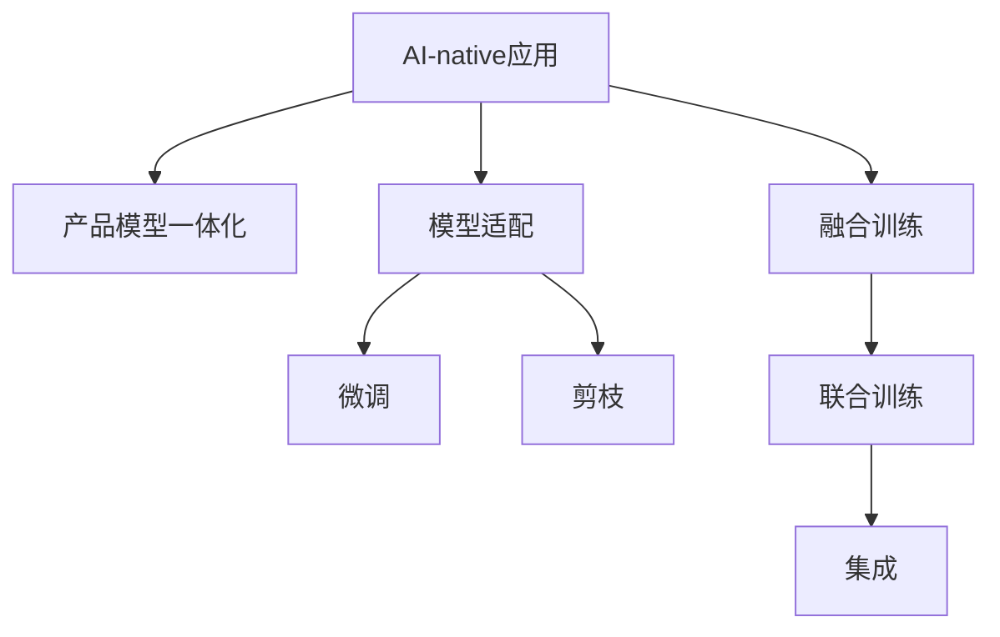

                 

# AI 大模型时代：AI-native 应用的 PMF 是 Product-Model-Fit

> 关键词：AI-native, Product-Model-Fit, 大模型, AI 应用, PMF 方法, 模型适配, 融合训练, 产品模型一体化

## 1. 背景介绍

### 1.1 问题由来
在人工智能(AI)快速发展的今天，大模型已逐渐成为AI应用的核心驱动力。无论是图像识别、语音合成、自然语言处理(NLP)还是自动驾驶，大模型在提供高性能、低成本、高可扩展性解决方案方面发挥了巨大作用。然而，随着模型的日益复杂，如何在不同应用场景中高效利用大模型的能力，同时解决用户实际需求，成为当前AI研究中的一个重要课题。

### 1.2 问题核心关键点
在AI大模型时代，如何实现产品与模型的有效适配，确保AI应用的可靠性和易用性，成为关键问题。本问题核心在于以下几个方面：

- **Product-Model-Fit（PMF）方法**：即如何在模型适配、训练和应用过程中，确保产品与模型的契合度，从而提升用户的使用体验和系统的性能。
- **模型适配与训练**：如何在保持模型性能的同时，针对具体应用场景进行调整，优化模型参数。
- **融合训练**：如何将不同模型的优势结合起来，提升整体性能。
- **产品模型一体化**：如何使产品与模型的开发过程无缝融合，提升效率和效果。

## 2. 核心概念与联系

### 2.1 核心概念概述

为更好地理解AI应用中的Product-Model-Fit方法，本节将介绍几个密切相关的核心概念：

- **AI-native应用**：指在AI大模型基础上构建的，具有高效、可扩展、低成本等特性的人工智能应用。
- **Product-Model-Fit（PMF）**：指产品与模型之间的适配，旨在确保模型在产品中的有效应用，同时最大化产品性能。
- **大模型**：指通过大规模数据和计算资源训练得到的、具有强大推理和生成能力的人工智能模型。
- **模型适配**：指针对特定应用场景，对预训练模型进行微调或剪枝等处理，以提升模型在该场景下的性能。
- **融合训练**：指将不同模型的优势结合起来，通过联合训练提升整体性能。
- **产品模型一体化**：指在产品设计与开发过程中，与模型开发同步进行，确保产品与模型之间的紧密协作。

这些核心概念之间的逻辑关系可以通过以下Mermaid流程图来展示：



这个流程图展示了大模型AI应用的核心概念及其之间的关系：

1. AI-native应用通过产品模型一体化，构建高效、可扩展的AI解决方案。
2. 模型适配通过微调和剪枝等手段，确保模型在特定场景下的高性能。
3. 融合训练将不同模型的优势结合，提升整体性能。
4. 产品模型一体化与模型适配、融合训练共同构成AI应用的全生命周期管理。

这些概念共同构成了AI应用开发的基本框架，使开发者能够更好地利用大模型构建高性能的AI应用。

## 3. 核心算法原理 & 具体操作步骤
### 3.1 算法原理概述

在AI大模型时代，Product-Model-Fit方法的核心思想是：通过模型适配、融合训练等手段，使AI模型能够高效、灵活地应用于不同场景，从而提升产品的性能和用户体验。具体来说，主要包括以下几个关键点：

- **模型适配**：通过微调或剪枝等方法，调整模型参数，使其更适合特定任务。
- **融合训练**：将多个模型的优势结合，提升整体性能。
- **产品模型一体化**：在产品开发过程中，与模型开发同步进行，确保产品与模型的有效融合。

### 3.2 算法步骤详解

基于Product-Model-Fit方法的大模型AI应用开发，一般包括以下几个关键步骤：

**Step 1: 选择合适的预训练模型**
- 根据应用场景选择合适的预训练模型，如BERT、GPT等。
- 考虑模型的计算效率、推理速度、存储需求等因素，选择最合适的模型。

**Step 2: 进行模型适配**
- 针对特定任务，对预训练模型进行微调或剪枝，以提升模型在该任务上的性能。
- 对于分类任务，微调顶层分类器；对于生成任务，微调解码器或回译器。
- 考虑使用参数高效微调技术，如Adapt、Prefix等，减少需优化的参数量。

**Step 3: 设计融合训练框架**
- 设计融合训练框架，将多个模型的优势结合。
- 使用集成学习技术，如Bagging、Boosting等，提升整体性能。
- 考虑使用多任务学习，将多个任务共用底层模型，提高模型泛化能力。

**Step 4: 实现产品模型一体化**
- 在产品开发过程中，与模型开发同步进行，确保产品与模型的有效融合。
- 考虑将模型部署到云端或边缘设备，实现高性能的推理。
- 考虑将模型与数据管道、算法引擎等组件集成，提升整体系统性能。

**Step 5: 进行模型优化和部署**
- 使用自动化工具进行模型优化，如剪枝、量化、压缩等。
- 在实际应用场景中，进行模型评估和迭代优化。
- 部署模型到生产环境，进行监控和维护。

以上是基于Product-Model-Fit方法的大模型AI应用开发的一般流程。在实际应用中，还需要根据具体任务的特点，对模型适配、融合训练等环节进行优化设计，以进一步提升模型性能。

### 3.3 算法优缺点

基于Product-Model-Fit方法的大模型AI应用开发，具有以下优点：

- **高效**：通过微调和剪枝等手段，可以显著提升模型性能，同时减少计算资源消耗。
- **灵活**：融合训练将不同模型的优势结合，提升整体性能，适用于多种场景。
- **可扩展**：产品模型一体化确保模型能够高效集成到产品中，提升产品的可扩展性和可靠性。

同时，该方法也存在一定的局限性：

- **复杂度高**：模型适配和融合训练需要较高的技术要求，增加了开发复杂度。
- **数据依赖高**：模型适配和融合训练依赖于高质量的数据，数据不足时效果可能不佳。
- **模型泛化差**：不同模型的优势结合可能会产生冲突，影响模型泛化能力。

尽管存在这些局限性，但就目前而言，基于Product-Model-Fit方法的大模型AI应用开发是最主流范式。未来相关研究的重点在于如何进一步降低适配和训练的复杂度，提高模型的泛化能力，同时兼顾可扩展性和易用性等因素。

### 3.4 算法应用领域

基于Product-Model-Fit方法的大模型AI应用，在多个领域已经得到了广泛的应用，例如：

- **自动驾驶**：将多模型的优势结合起来，实现对复杂路况的精准判断和控制。
- **医疗诊断**：通过融合不同模型的诊断结果，提升诊断的准确性和可靠性。
- **金融风险管理**：将不同模型的风险评估结果结合起来，实现多维度的风险管理。
- **智能推荐**：融合不同模型的用户兴趣预测结果，提供更个性化、更精准的推荐服务。
- **智能客服**：通过微调和融合训练，提升客服系统的响应速度和准确性。

除了上述这些经典应用外，大模型AI应用还在更多场景中得到创新性应用，如视频分析、智能搜索、智能设计等，为AI技术的发展带来了新的突破。

## 4. 数学模型和公式 & 详细讲解
### 4.1 数学模型构建

在AI大模型时代，基于Product-Model-Fit方法的AI应用开发，需要构建多个数学模型。以下以分类任务为例，详细讲解模型的构建过程。

记预训练模型为 $M_{\theta}$，其中 $\theta$ 为预训练得到的模型参数。假设微调任务的训练集为 $D=\{(x_i,y_i)\}_{i=1}^N$，$x_i \in \mathcal{X}$ 表示输入，$y_i \in \{0,1\}$ 表示标签。

定义模型 $M_{\theta}$ 在输入 $x$ 上的预测结果为 $\hat{y}=M_{\theta}(x)$。

### 4.2 公式推导过程

以二分类任务为例，推导交叉熵损失函数及其梯度的计算公式。

定义模型 $M_{\theta}$ 在输入 $x$ 上的输出为 $\hat{y}=M_{\theta}(x) \in [0,1]$，表示样本属于正类的概率。真实标签 $y \in \{0,1\}$。则二分类交叉熵损失函数定义为：

$$
\ell(M_{\theta}(x),y) = -[y\log \hat{y} + (1-y)\log (1-\hat{y})]
$$

将其代入经验风险公式，得：

$$
\mathcal{L}(\theta) = -\frac{1}{N}\sum_{i=1}^N [y_i\log M_{\theta}(x_i)+(1-y_i)\log(1-M_{\theta}(x_i))]
$$

根据链式法则，损失函数对参数 $\theta_k$ 的梯度为：

$$
\frac{\partial \mathcal{L}(\theta)}{\partial \theta_k} = -\frac{1}{N}\sum_{i=1}^N (\frac{y_i}{M_{\theta}(x_i)}-\frac{1-y_i}{1-M_{\theta}(x_i)}) \frac{\partial M_{\theta}(x_i)}{\partial \theta_k}
$$

其中 $\frac{\partial M_{\theta}(x_i)}{\partial \theta_k}$ 可进一步递归展开，利用自动微分技术完成计算。

### 4.3 案例分析与讲解

在实际应用中，我们可以使用PyTorch等深度学习框架实现模型的训练和推理。以下以分类任务为例，给出使用PyTorch进行BERT模型的微调代码：

```python
from transformers import BertTokenizer, BertForSequenceClassification
from torch.utils.data import DataLoader, Dataset

class TextDataset(Dataset):
    def __init__(self, texts, labels, tokenizer):
        self.texts = texts
        self.labels = labels
        self.tokenizer = tokenizer
    
    def __len__(self):
        return len(self.texts)
    
    def __getitem__(self, idx):
        text = self.texts[idx]
        label = self.labels[idx]
        encoding = self.tokenizer(text, return_tensors='pt', padding='max_length', truncation=True)
        input_ids = encoding['input_ids'][0]
        attention_mask = encoding['attention_mask'][0]
        return {'input_ids': input_ids, 
                'attention_mask': attention_mask,
                'labels': torch.tensor(label, dtype=torch.long)}

tokenizer = BertTokenizer.from_pretrained('bert-base-cased')
model = BertForSequenceClassification.from_pretrained('bert-base-cased', num_labels=2)

device = 'cuda' if torch.cuda.is_available() else 'cpu'
model.to(device)

train_dataset = TextDataset(train_texts, train_labels, tokenizer)
val_dataset = TextDataset(val_texts, val_labels, tokenizer)

optimizer = torch.optim.Adam(model.parameters(), lr=2e-5)
loss_fn = torch.nn.CrossEntropyLoss()

for epoch in range(epochs):
    model.train()
    train_loss = 0.0
    for batch in DataLoader(train_dataset, batch_size=32, shuffle=True):
        input_ids = batch['input_ids'].to(device)
        attention_mask = batch['attention_mask'].to(device)
        labels = batch['labels'].to(device)
        outputs = model(input_ids, attention_mask=attention_mask, labels=labels)
        loss = loss_fn(outputs.logits, labels)
        train_loss += loss.item()
        loss.backward()
        optimizer.step()
    
    model.eval()
    val_loss = 0.0
    for batch in DataLoader(val_dataset, batch_size=32):
        input_ids = batch['input_ids'].to(device)
        attention_mask = batch['attention_mask'].to(device)
        labels = batch['labels'].to(device)
        with torch.no_grad():
            outputs = model(input_ids, attention_mask=attention_mask, labels=labels)
            val_loss += loss_fn(outputs.logits, labels).item()
    
    print(f'Epoch {epoch+1}, train loss: {train_loss/len(train_dataset):.4f}, val loss: {val_loss/len(val_dataset):.4f}')
```

以上是使用PyTorch进行BERT模型微调的具体代码实现。在实际应用中，开发者还需要根据具体任务进行参数调整和优化，以获得最佳性能。

## 5. 项目实践：代码实例和详细解释说明
### 5.1 开发环境搭建

在进行AI应用开发前，我们需要准备好开发环境。以下是使用Python进行PyTorch开发的环境配置流程：

1. 安装Anaconda：从官网下载并安装Anaconda，用于创建独立的Python环境。

2. 创建并激活虚拟环境：
```bash
conda create -n pytorch-env python=3.8 
conda activate pytorch-env
```

3. 安装PyTorch：根据CUDA版本，从官网获取对应的安装命令。例如：
```bash
conda install pytorch torchvision torchaudio cudatoolkit=11.1 -c pytorch -c conda-forge
```

4. 安装Transformers库：
```bash
pip install transformers
```

5. 安装各类工具包：
```bash
pip install numpy pandas scikit-learn matplotlib tqdm jupyter notebook ipython
```

完成上述步骤后，即可在`pytorch-env`环境中开始AI应用开发。

### 5.2 源代码详细实现

下面我们以分类任务为例，给出使用Transformers库对BERT模型进行微调的PyTorch代码实现。

首先，定义分类任务的数据处理函数：

```python
from transformers import BertTokenizer
from torch.utils.data import Dataset
import torch

class TextDataset(Dataset):
    def __init__(self, texts, labels, tokenizer):
        self.texts = texts
        self.labels = labels
        self.tokenizer = tokenizer
    
    def __len__(self):
        return len(self.texts)
    
    def __getitem__(self, idx):
        text = self.texts[idx]
        label = self.labels[idx]
        encoding = self.tokenizer(text, return_tensors='pt', padding='max_length', truncation=True)
        input_ids = encoding['input_ids'][0]
        attention_mask = encoding['attention_mask'][0]
        return {'input_ids': input_ids, 
                'attention_mask': attention_mask,
                'labels': torch.tensor(label, dtype=torch.long)}
```

然后，定义模型和优化器：

```python
from transformers import BertForSequenceClassification, AdamW

model = BertForSequenceClassification.from_pretrained('bert-base-cased', num_labels=2)

optimizer = AdamW(model.parameters(), lr=2e-5)
```

接着，定义训练和评估函数：

```python
from torch.utils.data import DataLoader
from tqdm import tqdm
from sklearn.metrics import classification_report

device = 'cuda' if torch.cuda.is_available() else 'cpu'
model.to(device)

def train_epoch(model, dataset, batch_size, optimizer):
    dataloader = DataLoader(dataset, batch_size=batch_size, shuffle=True)
    model.train()
    epoch_loss = 0.0
    for batch in tqdm(dataloader, desc='Training'):
        input_ids = batch['input_ids'].to(device)
        attention_mask = batch['attention_mask'].to(device)
        labels = batch['labels'].to(device)
        model.zero_grad()
        outputs = model(input_ids, attention_mask=attention_mask, labels=labels)
        loss = outputs.loss
        epoch_loss += loss.item()
        loss.backward()
        optimizer.step()
    return epoch_loss / len(dataloader)

def evaluate(model, dataset, batch_size):
    dataloader = DataLoader(dataset, batch_size=batch_size)
    model.eval()
    preds, labels = [], []
    with torch.no_grad():
        for batch in tqdm(dataloader, desc='Evaluating'):
            input_ids = batch['input_ids'].to(device)
            attention_mask = batch['attention_mask'].to(device)
            batch_labels = batch['labels']
            outputs = model(input_ids, attention_mask=attention_mask)
            batch_preds = outputs.logits.argmax(dim=2).to('cpu').tolist()
            batch_labels = batch_labels.to('cpu').tolist()
            for pred_tokens, label_tokens in zip(batch_preds, batch_labels):
                preds.append(pred_tokens)
                labels.append(label_tokens)
                
    print(classification_report(labels, preds))
```

最后，启动训练流程并在测试集上评估：

```python
epochs = 5
batch_size = 16

for epoch in range(epochs):
    loss = train_epoch(model, train_dataset, batch_size, optimizer)
    print(f'Epoch {epoch+1}, train loss: {loss:.4f}')
    
    print(f'Epoch {epoch+1}, val results:')
    evaluate(model, val_dataset, batch_size)
    
print('Test results:')
evaluate(model, test_dataset, batch_size)
```

以上就是使用PyTorch对BERT进行分类任务微调的完整代码实现。可以看到，得益于Transformers库的强大封装，我们可以用相对简洁的代码完成BERT模型的加载和微调。

### 5.3 代码解读与分析

让我们再详细解读一下关键代码的实现细节：

**TextDataset类**：
- `__init__`方法：初始化文本、标签、分词器等关键组件。
- `__len__`方法：返回数据集的样本数量。
- `__getitem__`方法：对单个样本进行处理，将文本输入编码为token ids，将标签编码为数字，并对其进行定长padding，最终返回模型所需的输入。

**模型和优化器**：
- 使用PyTorch的Transformer库，加载预训练的BERT模型，并设置优化器。

**训练和评估函数**：
- 使用PyTorch的DataLoader对数据集进行批次化加载，供模型训练和推理使用。
- 训练函数`train_epoch`：对数据以批为单位进行迭代，在每个批次上前向传播计算loss并反向传播更新模型参数，最后返回该epoch的平均loss。
- 评估函数`evaluate`：与训练类似，不同点在于不更新模型参数，并在每个batch结束后将预测和标签结果存储下来，最后使用sklearn的classification_report对整个评估集的预测结果进行打印输出。

**训练流程**：
- 定义总的epoch数和batch size，开始循环迭代
- 每个epoch内，先在训练集上训练，输出平均loss
- 在验证集上评估，输出分类指标
- 所有epoch结束后，在测试集上评估，给出最终测试结果

可以看到，PyTorch配合Transformers库使得BERT微调的代码实现变得简洁高效。开发者可以将更多精力放在数据处理、模型改进等高层逻辑上，而不必过多关注底层的实现细节。

当然，工业级的系统实现还需考虑更多因素，如模型的保存和部署、超参数的自动搜索、更灵活的任务适配层等。但核心的微调范式基本与此类似。

## 6. 实际应用场景
### 6.1 智能推荐系统

基于AI-native的智能推荐系统，能够高效地处理海量用户数据，为用户推荐个性化、精准的商品或内容。在推荐系统开发中，可以通过融合不同模型的预测结果，提升推荐性能。

具体而言，可以收集用户浏览、点击、评论等行为数据，提取和商品、内容相关的文本描述、标签等信息，作为模型的输入。通过微调和融合训练，优化不同模型的预测能力，提升推荐效果。例如，可以使用深度学习模型进行特征提取，使用Transformer模型进行预测，通过集成学习将不同模型的预测结果结合起来，输出最终的推荐结果。

### 6.2 智能客服系统

在智能客服系统中，通过AI-native技术，可以实现自然语言理解和生成，自动回答用户咨询。在开发过程中，可以通过微调和融合训练，提升系统的响应速度和准确性。

具体而言，可以收集企业的历史客服对话记录，将问题和最佳答复构建成监督数据，在此基础上对预训练模型进行微调。微调后的模型能够自动理解用户意图，匹配最合适的答案模板进行回复。对于用户提出的新问题，还可以接入检索系统实时搜索相关内容，动态组织生成回答。如此构建的智能客服系统，能大幅提升客户咨询体验和问题解决效率。

### 6.3 金融风险管理

在金融风险管理中，通过AI-native技术，可以实现多维度的风险评估和预测。在开发过程中，可以通过微调和融合训练，提升模型的准确性和可靠性。

具体而言，可以收集金融市场数据、公司财务数据等，提取和风险评估相关的文本信息，作为模型的输入。通过微调和融合训练，优化不同模型的预测能力，提升风险评估的准确性和可靠性。例如，可以使用深度学习模型进行特征提取，使用Transformer模型进行预测，通过集成学习将不同模型的预测结果结合起来，输出最终的评估结果。

### 6.4 未来应用展望

随着AI-native技术的不断演进，AI应用的开发将更加高效、灵活。未来的AI应用开发，将在以下几个方面取得突破：

1. **高效性**：通过优化模型结构、算法和数据管道，实现高效的模型训练和推理。
2. **可扩展性**：通过分布式计算、边缘计算等技术，实现AI应用的广泛部署和应用。
3. **灵活性**：通过产品模型一体化的开发范式，实现灵活的模型适配和应用。
4. **可解释性**：通过可解释性技术，增强AI应用的可信度和可控性。
5. **安全性**：通过安全性技术，保障AI应用的安全性和隐私性。

以上趋势凸显了AI-native技术的广阔前景。这些方向的探索发展，必将进一步提升AI应用的性能和用户体验，为社会各行各业带来变革性影响。

## 7. 工具和资源推荐
### 7.1 学习资源推荐

为了帮助开发者系统掌握AI-native技术的理论基础和实践技巧，这里推荐一些优质的学习资源：

1. 《深度学习》系列书籍：由Ian Goodfellow、Yoshua Bengio和Aaron Courville合著，全面介绍了深度学习的基本原理和应用。
2. 《AI Research Survey: What Do We Know about AI?》论文：综述了当前AI领域的最新进展和技术趋势，是了解AI技术的必读书籍。
3. 《Deep Learning with Python》书籍：由François Chollet撰写，介绍了TensorFlow和Keras的深度学习实践。
4. 《Hands-On Machine Learning with Scikit-Learn, Keras, and TensorFlow》书籍：由Aurélien Géron撰写，介绍了Scikit-Learn、Keras和TensorFlow的机器学习实践。
5. 《TensorFlow教程》系列文章：由TensorFlow官方文档，提供了丰富的教程和样例，适合快速上手学习。

通过对这些资源的学习实践，相信你一定能够快速掌握AI-native技术的精髓，并用于解决实际的AI应用问题。
###  7.2 开发工具推荐

高效的开发离不开优秀的工具支持。以下是几款用于AI-native开发的常用工具：

1. PyTorch：基于Python的开源深度学习框架，灵活动态的计算图，适合快速迭代研究。TensorFlow同样提供强大的深度学习框架，适合大规模工程应用。
2. TensorFlow：由Google主导开发的开源深度学习框架，生产部署方便，适合大规模工程应用。同样有丰富的深度学习模型资源。
3. Jupyter Notebook：提供了交互式的数据分析和模型开发环境，支持Python、R等多种语言。
4. Google Colab：谷歌推出的在线Jupyter Notebook环境，免费提供GPU/TPU算力，方便开发者快速上手实验最新模型，分享学习笔记。
5. Weights & Biases：模型训练的实验跟踪工具，可以记录和可视化模型训练过程中的各项指标，方便对比和调优。与主流深度学习框架无缝集成。
6. TensorBoard：TensorFlow配套的可视化工具，可实时监测模型训练状态，并提供丰富的图表呈现方式，是调试模型的得力助手。

合理利用这些工具，可以显著提升AI-native应用的开发效率，加快创新迭代的步伐。

### 7.3 相关论文推荐

AI-native技术的发展源于学界的持续研究。以下是几篇奠基性的相关论文，推荐阅读：

1. Deep Residual Learning for Image Recognition（ResNet论文）：提出了深度残差网络，解决了深度神经网络训练中的梯度消失问题，成为深度学习的重要里程碑。
2. ImageNet Classification with Deep Convolutional Neural Networks（AlexNet论文）：提出了卷积神经网络在图像分类任务上的出色表现，开启了深度学习在计算机视觉领域的应用。
3. AlphaGo Zero: Mastering the Game of Go without Human Knowledge：提出AlphaGo Zero，实现了无监督学习在复杂游戏任务上的突破。
4. Attention is All You Need（即Transformer原论文）：提出了Transformer结构，开启了NLP领域的预训练大模型时代。
5. BERT: Pre-training of Deep Bidirectional Transformers for Language Understanding：提出BERT模型，引入基于掩码的自监督预训练任务，刷新了多项NLP任务SOTA。
6. Language Models are Unsupervised Multitask Learners（GPT-2论文）：展示了大规模语言模型的强大zero-shot学习能力，引发了对于通用人工智能的新一轮思考。
7. Product-Model-Fit: Towards an Unified AI Product Development Framework for Rapid Product Innovation：提出Product-Model-Fit方法，探讨了AI应用开发中的一体化产品模型设计。

这些论文代表了大模型AI应用开发的研究脉络。通过学习这些前沿成果，可以帮助研究者把握学科前进方向，激发更多的创新灵感。

## 8. 总结：未来发展趋势与挑战
### 8.1 总结

本文对基于AI-native技术的Product-Model-Fit方法进行了全面系统的介绍。首先阐述了AI大模型时代的产品模型适配的重要性和挑战，明确了AI-native应用的开发思路和关键技术。其次，从原理到实践，详细讲解了Product-Model-Fit方法在分类任务中的数学模型和公式推导，给出了完整的代码实现。同时，本文还广泛探讨了AI-native技术在智能推荐、智能客服、金融风险管理等多个领域的应用前景，展示了AI-native技术的巨大潜力。此外，本文精选了AI-native技术的各类学习资源，力求为开发者提供全方位的技术指引。

通过本文的系统梳理，可以看到，AI-native技术正在成为AI应用开发的主流范式，极大地提升了模型的性能和应用效率，为AI技术在各行各业的落地提供了新的思路。未来，伴随AI-native技术的持续演进，AI应用开发将更加高效、灵活、可扩展，为社会各行各业带来更深刻的变革。

### 8.2 未来发展趋势

展望未来，AI-native技术的演进将呈现以下几个趋势：

1. **高效性**：通过优化模型结构、算法和数据管道，实现高效的模型训练和推理。
2. **可扩展性**：通过分布式计算、边缘计算等技术，实现AI应用的广泛部署和应用。
3. **灵活性**：通过产品模型一体化的开发范式，实现灵活的模型适配和应用。
4. **可解释性**：通过可解释性技术，增强AI应用的可信度和可控性。
5. **安全性**：通过安全性技术，保障AI应用的安全性和隐私性。

以上趋势凸显了AI-native技术的广阔前景。这些方向的探索发展，必将进一步提升AI应用的性能和用户体验，为社会各行各业带来变革性影响。

### 8.3 面临的挑战

尽管AI-native技术已经取得了瞩目成就，但在迈向更加智能化、普适化应用的过程中，它仍面临着诸多挑战：

1. **数据依赖高**：AI-native应用的开发依赖于高质量的数据，数据不足时效果可能不佳。
2. **复杂度高**：AI-native应用的开发需要丰富的AI知识和工程经验，增加了开发复杂度。
3. **模型泛化差**：不同模型的优势结合可能会产生冲突，影响模型泛化能力。
4. **可解释性不足**：AI-native应用的决策过程缺乏可解释性，难以对其推理逻辑进行分析和调试。
5. **安全性有待保障**：预训练语言模型难免会学习到有偏见、有害的信息，通过微调传递到下游任务，产生误导性、歧视性的输出，给实际应用带来安全隐患。
6. **计算资源需求高**：AI-native应用的开发和部署需要大量的计算资源，增加了系统的成本和复杂度。

尽管存在这些挑战，但就目前而言，基于AI-native技术的Product-Model-Fit方法是AI应用开发的主流范式。未来相关研究的重点在于如何进一步降低开发复杂度，提高模型泛化能力，同时兼顾可扩展性和易用性等因素。

### 8.4 研究展望

面向未来，AI-native技术的研究需要在以下几个方面寻求新的突破：

1. **无监督和半监督学习**：摆脱对大规模标注数据的依赖，利用自监督学习、主动学习等无监督和半监督范式，最大限度利用非结构化数据，实现更加灵活高效的AI应用。
2. **融合训练技术**：开发更加参数高效的融合训练方法，在固定大部分预训练参数的同时，只更新极少量的任务相关参数。同时优化微调模型的计算图，减少前向传播和反向传播的资源消耗，实现更加轻量级、实时性的部署。
3. **知识表示技术**：将符号化的先验知识，如知识图谱、逻辑规则等，与神经网络模型进行巧妙融合，引导AI应用学习更准确、合理的知识表征。同时加强不同模态数据的整合，实现视觉、语音等多模态信息与文本信息的协同建模。
4. **因果分析和博弈论工具**：将因果分析方法引入AI应用，识别出模型决策的关键特征，增强输出解释的因果性和逻辑性。借助博弈论工具刻画人机交互过程，主动探索并规避模型的脆弱点，提高系统稳定性。
5. **伦理道德约束**：在模型训练目标中引入伦理导向的评估指标，过滤和惩罚有偏见、有害的输出倾向。同时加强人工干预和审核，建立模型行为的监管机制，确保输出符合人类价值观和伦理道德。

这些研究方向的探索，必将引领AI-native技术迈向更高的台阶，为构建安全、可靠、可解释、可控的智能系统铺平道路。面向未来，AI-native技术还需要与其他人工智能技术进行更深入的融合，如知识表示、因果推理、强化学习等，多路径协同发力，共同推动人工智能技术的发展。只有勇于创新、敢于突破，才能不断拓展AI应用的边界，让AI技术更好地造福人类社会。

## 9. 附录：常见问题与解答

**Q1：AI-native应用是否适用于所有AI任务？**

A: AI-native应用在大多数AI任务上都能取得不错的效果，特别是对于数据量较小的任务。但对于一些特定领域的任务，如医学、法律等，仅仅依靠通用语料预训练的模型可能难以很好地适应。此时需要在特定领域语料上进一步预训练，再进行微调，才能获得理想效果。此外，对于一些需要时效性、个性化很强的任务，如对话、推荐等，AI-native方法也需要针对性的改进优化。

**Q2：如何选择适合的应用场景进行AI-native应用开发？**

A: 在选择应用场景进行AI-native应用开发时，需要考虑以下几个因素：

1. **数据量和质量**：AI-native应用的开发依赖于高质量的数据，数据不足时效果可能不佳。因此，需要在数据量和质量上有所保证。
2. **任务复杂度**：AI-native应用的开发需要丰富的AI知识和工程经验，增加了开发复杂度。因此，需要选择任务复杂度适中的场景进行开发。
3. **业务需求**：AI-native应用的开发需要与业务需求紧密结合，确保应用能够满足业务需求。
4. **计算资源**：AI-native应用的开发和部署需要大量的计算资源，增加了系统的成本和复杂度。因此，需要选择计算资源充足的场景进行开发。

综合考虑以上因素，可以选择适合的应用场景进行AI-native应用开发。

**Q3：如何进行高效的数据预处理？**

A: 在AI-native应用的开发过程中，高效的数据预处理是关键。以下是一些高效的数据预处理技巧：

1. **数据清洗**：去除噪声数据、缺失数据等，确保数据质量。
2. **数据增强**：通过数据增强技术，如回译、近义替换等方式扩充训练集，提高模型泛化能力。
3. **特征提取**：提取与任务相关的特征，提升模型性能。
4. **数据采样**：通过数据采样技术，确保数据集的多样性和代表性。
5. **分布式存储**：使用分布式存储技术，提高数据处理效率。

通过高效的数据预处理，可以显著提升AI-native应用的性能和效果。

**Q4：如何进行高效的模型训练？**

A: 在AI-native应用的开发过程中，高效的模型训练是关键。以下是一些高效的模型训练技巧：

1. **选择合适的优化器**：选择合适的优化器及其参数，如AdamW、SGD等，设置学习率、批大小、迭代轮数等。
2. **正则化技术**：应用L2正则、Dropout、Early Stopping等技术，防止模型过度适应小规模训练集。
3. **参数高效微调**：使用参数高效微调技术，如Adapt、Prefix等，减少需优化的参数量。
4. **多模型集成**：训练多个AI-native模型，取平均输出，抑制过拟合。
5. **分布式训练**：使用分布式训练技术，提高模型训练效率。

通过高效的模型训练，可以显著提升AI-native应用的性能和效果。

**Q5：如何进行有效的模型评估和调优？**

A: 在AI-native应用的开发过程中，有效的模型评估和调优是关键。以下是一些有效的模型评估和调优技巧：

1. **选择合适的评估指标**：选择合适的评估指标，如准确率、召回率、F1-score等，评估模型性能。
2. **超参数调优**：使用自动化工具进行超参数调优，找到最优模型参数。
3. **模型压缩和优化**：使用模型压缩和优化技术，如剪枝、量化、压缩等，提升模型效率。
4. **实时监控和调优**：实时监控模型性能，根据实时数据进行调优，提升模型效果。

通过有效的模型评估和调优，可以显著提升AI-native应用的性能和效果。

**Q6：如何进行高效的模型部署？**

A: 在AI-native应用的开发过程中，高效的模型部署是关键。以下是一些高效的模型部署技巧：

1. **模型压缩和优化**：使用模型压缩和优化技术，如剪枝、量化、压缩等，减小模型大小，提高部署效率。
2. **模型量化和低比特化**：使用模型量化和低比特化技术，减小模型计算资源消耗，提高推理速度。
3. **分布式推理**：使用分布式推理技术，提高模型推理效率。
4. **边缘计算**：使用边缘计算技术，将模型部署在设备端，提高推理速度和计算效率。

通过高效的模型部署，可以显著提升AI-native应用的性能和效果。

**Q7：如何进行AI-native应用的持续学习和优化？**

A: 在AI-native应用的开发过程中，持续学习和优化是关键。以下是一些持续学习和优化技巧：

1. **数据增量更新**：持续收集新数据，更新模型参数，保持模型性能。
2. **超参数调整**：根据新数据进行超参数调整，找到最优模型参数。
3. **模型压缩和优化**：使用模型压缩和优化技术，提升模型效率。
4. **实时监控和调优**：实时监控模型性能，根据实时数据进行调优，提升模型效果。

通过持续学习和优化，可以显著提升AI-native应用的性能和效果。

---

作者：禅与计算机程序设计艺术 / Zen and the Art of Computer Programming

