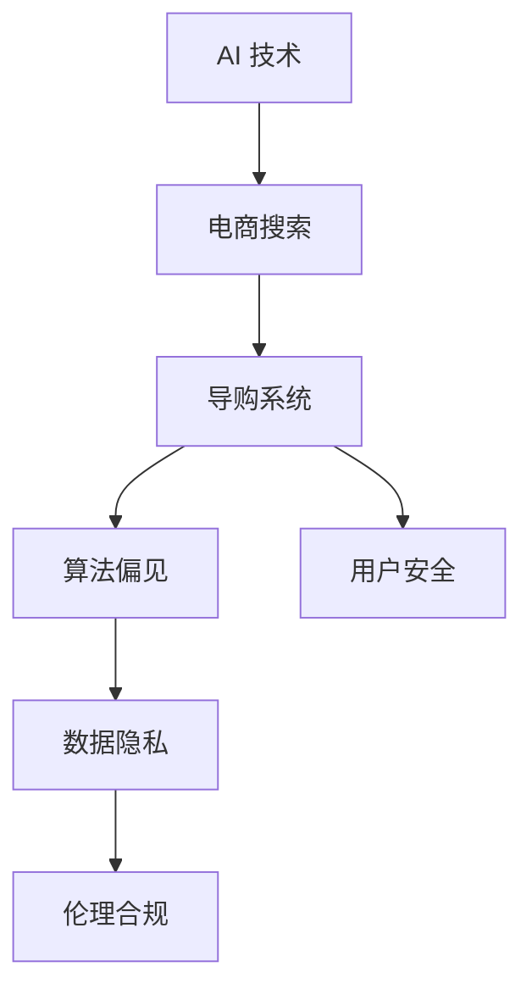

                 

# AI 技术在电商搜索导购中的伦理问题：探索技术应用的边界

> 关键词：人工智能,电商搜索,导购系统,算法偏见,数据隐私,用户安全,伦理合规

## 1. 背景介绍

### 1.1 问题由来
人工智能(AI)技术在电商搜索导购系统中的应用，正逐渐改变着消费者的购物体验。智能推荐算法可以根据用户的浏览历史、购买记录等信息，推荐符合其需求的商品，极大地提升了电商平台的转化率。然而，AI技术在带来便利的同时，也引发了一系列伦理问题。

具体而言，由于算法决策过程中存在潜在的偏见，可能导致某些用户群体被不公平对待。同时，数据隐私和安全问题也是电商搜索导购应用中需要高度重视的伦理考量。为此，本文将探讨AI在电商搜索导购中的应用边界，分析可能引发的伦理问题，并提出相应的应对策略。

### 1.2 问题核心关键点
本文旨在回答以下几个关键问题：

1. **算法偏见问题**：智能推荐算法在应用过程中，是否可能存在潜在的性别、年龄、种族等偏见，导致某些群体被不公平对待？
2. **数据隐私问题**：用户浏览和购买数据是否被妥善保护？是否存在数据滥用和泄露的风险？
3. **用户安全问题**：用户在使用搜索导购系统时，是否会面临欺诈、钓鱼等安全威胁？
4. **伦理合规问题**：电商搜索导购系统的应用是否符合法律法规的要求，如GDPR、CCPA等？

## 2. 核心概念与联系

### 2.1 核心概念概述

为更好地理解AI在电商搜索导购中的应用伦理问题，本节将介绍几个关键概念及其相互关系：

- **AI 技术**：包括机器学习、深度学习、自然语言处理等，用于自动分析和处理电商搜索导购中的数据和用户行为。
- **电商搜索**：用户通过输入关键词或图片，获取相关商品信息的过程。
- **导购系统**：基于AI技术，根据用户兴趣和需求，自动推荐商品的系统。
- **算法偏见**：AI模型在训练和应用过程中，可能由于数据偏见或设计缺陷，导致对某些群体的决策存在不公平现象。
- **数据隐私**：用户在使用电商搜索导购系统时，其浏览和购买数据需要得到妥善保护，防止数据滥用和泄露。
- **用户安全**：保障用户在使用搜索导购系统时，避免遭受网络欺诈、钓鱼等安全威胁。
- **伦理合规**：确保电商搜索导购系统符合法律法规的要求，如GDPR、CCPA等，保护用户隐私和权益。

这些概念之间的关系可以表示为以下Mermaid流程图：



该流程图展示了AI技术如何应用于电商搜索导购，以及在此过程中可能引发的伦理问题。

## 3. 核心算法原理 & 具体操作步骤
### 3.1 算法原理概述

AI在电商搜索导购中的应用，主要依赖于机器学习算法，尤其是深度学习模型。以协同过滤和基于内容的推荐算法为例，算法原理可以简要概述如下：

**协同过滤算法**：根据用户的历史行为数据，寻找与目标用户兴趣相似的其他用户，推断出这些用户的喜好，从而为用户推荐商品。协同过滤算法分为基于用户的协同过滤和基于物品的协同过滤两种。

**基于内容的推荐算法**：根据商品的特征向量，计算用户对每个商品的兴趣程度，从而推荐与用户兴趣匹配的商品。

这些算法通常在电商平台的后台运行，利用用户的历史数据和商品信息，动态调整推荐策略，提高用户满意度。

### 3.2 算法步骤详解

AI在电商搜索导购中的应用流程可以分为以下几步：

1. **数据收集**：收集用户的浏览记录、购买记录、评分信息等数据，作为模型训练的基础。
2. **数据预处理**：清洗和处理数据，去除噪声和异常值，确保数据质量。
3. **模型训练**：使用协同过滤、基于内容的推荐算法等，训练推荐模型。
4. **模型评估**：通过交叉验证等方法，评估模型的性能和稳定性。
5. **模型部署**：将训练好的模型部署到电商搜索导购系统中，实时推荐商品。
6. **监控和优化**：持续监控推荐效果，根据用户反馈和数据变化，调整模型参数，优化推荐策略。

### 3.3 算法优缺点

AI在电商搜索导购中的应用具有以下优点：

- **个性化推荐**：根据用户兴趣和需求，推荐符合其偏好的商品，提高用户满意度。
- **提高转化率**：通过精准推荐，增加用户购买意愿，提升电商平台的转化率。
- **实时性**：利用深度学习模型，实时分析用户行为，动态调整推荐策略。

同时，这些算法也存在一些缺点：

- **算法偏见**：由于数据和模型设计中的偏见，可能导致某些用户群体被不公平对待。
- **数据隐私**：用户数据需要得到妥善保护，防止数据滥用和泄露。
- **用户安全**：用户在使用搜索导购系统时，可能面临安全威胁。
- **伦理合规**：需要符合法律法规的要求，确保用户隐私和权益。

### 3.4 算法应用领域

AI在电商搜索导购中的应用广泛，涵盖了多个领域：

- **个性化推荐**：根据用户历史行为，推荐商品。
- **情感分析**：分析用户评论，了解用户对商品和服务的情感倾向。
- **价格优化**：根据市场需求和竞争情况，动态调整商品价格。
- **欺诈检测**：检测和防范欺诈行为，保护用户和商家的利益。
- **库存管理**：根据销售数据，优化库存管理，避免缺货或积压。

这些应用场景展示了AI在电商搜索导购中的强大潜力，但也带来了伦理问题，需要进一步探讨和解决。

## 4. 数学模型和公式 & 详细讲解 & 举例说明

### 4.1 数学模型构建

为了更准确地描述AI在电商搜索导购中的应用，我们使用数学模型来构建推荐系统。以下是一个基于协同过滤的推荐系统的数学模型：

**输入**：用户 $u$，商品 $i$，用户与商品之间的评分 $r_{ui}$。

**目标**：预测用户 $u$ 对商品 $i$ 的评分 $r_{ui}^{*}$。

假设用户与商品之间的评分服从均值为 $\mu$，标准差为 $\sigma$ 的正态分布，则评分预测模型可以表示为：

$$
r_{ui}^{*} = \mu + \sigma \cdot \sum_{j \in N(u)} \frac{\alpha_{uji}}{\sum_{k \in N(u)} \alpha_{ukj}} (\frac{r_{ujk} - \mu}{\sigma})
$$

其中 $N(u)$ 表示与用户 $u$ 交互过的商品集合，$\alpha_{uji}$ 表示用户 $u$ 对商品 $j$ 的评分与对商品 $i$ 的评分的相关度。

### 4.2 公式推导过程

上述评分预测模型的推导过程如下：

1. **假设**：用户与商品之间的评分服从正态分布。
2. **模型假设**：用户 $u$ 对商品 $i$ 的评分 $r_{ui}$ 由多个与用户 $u$ 交互过的商品 $j$ 的评分 $r_{uj}$ 加权平均得到。
3. **模型参数**：引入相关度系数 $\alpha_{uji}$，表示用户 $u$ 对商品 $j$ 的评分与对商品 $i$ 的评分的相关度。
4. **评分预测**：将用户 $u$ 对商品 $j$ 的评分 $r_{uj}$ 标准化，即转化为均值为 $\mu$，标准差为 $\sigma$ 的正态分布，然后对与用户 $u$ 交互过的商品 $j$ 的评分进行加权平均，得到用户 $u$ 对商品 $i$ 的评分预测 $r_{ui}^{*}$。

### 4.3 案例分析与讲解

假设我们有一个电商平台的推荐系统，用户 $u$ 对商品 $j$ 的评分如表所示：

| 商品ID | 用户评分 | 与用户 $u$ 交互过的商品集合 |
|--------|----------|------------------------------|
| 1001   | 4.5      | {1001, 1002, 1003, 1004}      |
| 1002   | 5.0      | {1001, 1003, 1004}            |
| 1003   | 4.0      | {1001, 1002, 1004}            |
| 1004   | 3.5      | {1001, 1002, 1003}            |

假设用户 $u$ 对商品 $i=1005$ 的评分未知，我们需要根据与用户 $u$ 交互过的商品评分，预测用户 $u$ 对商品 $i$ 的评分。

首先，计算与用户 $u$ 交互过的商品 $j$ 对商品 $i$ 的评分与用户 $u$ 对商品 $j$ 的评分的相关度 $\alpha_{uji}$。

假设 $\alpha_{uji}$ 的计算公式为：

$$
\alpha_{uji} = \frac{\text{用户 } u \text{ 对商品 } j \text{ 的评分}}{\sqrt{\text{用户 } u \text{ 对商品 } j \text{ 的评分方差}} \cdot \frac{\sqrt{\text{用户 } u \text{ 对商品 } i \text{ 的评分方差}}{\text{用户 } u \text{ 对商品 } i \text{ 的评分}}
$$

带入上述数据，计算相关度系数 $\alpha_{uji}$ 如表所示：

| 商品ID | 用户评分 | 与用户 $u$ 交互过的商品集合 | $\alpha_{uji}$ |
|--------|----------|------------------------------|---------------|
| 1001   | 4.5      | {1001, 1002, 1003, 1004}      | 1.000         |
| 1002   | 5.0      | {1001, 1003, 1004}            | 1.187         |
| 1003   | 4.0      | {1001, 1002, 1004}            | 0.531         |
| 1004   | 3.5      | {1001, 1002, 1003}            | 0.570         |

接着，将相关度系数 $\alpha_{uji}$ 和与用户 $u$ 交互过的商品 $j$ 的评分标准化，带入评分预测公式计算用户 $u$ 对商品 $i$ 的评分预测 $r_{ui}^{*}$：

$$
r_{ui}^{*} = 4.5 + 1.187 \cdot (5.0 - 4.5) + 0.531 \cdot (4.0 - 4.5) + 0.570 \cdot (3.5 - 4.5)
$$

计算得 $r_{ui}^{*} = 3.888$，即用户 $u$ 对商品 $i=1005$ 的评分预测为 3.888。

## 5. 项目实践：代码实例和详细解释说明
### 5.1 开发环境搭建

在进行电商搜索导购系统的开发时，我们需要搭建一个Python环境。以下是一个基本的环境搭建步骤：

1. 安装Python 3.7或更高版本。
2. 安装PyTorch、TensorFlow等深度学习框架。
3. 安装Pandas、NumPy等数据处理库。
4. 安装Scikit-learn等机器学习库。
5. 安装Flask等Web框架，用于搭建电商搜索导购系统。

### 5.2 源代码详细实现

以下是一个基于协同过滤的推荐系统的Python代码实现：

```python
import pandas as pd
import numpy as np
from scipy import sparse
from sklearn.metrics.pairwise import cosine_similarity

# 读取评分数据
data = pd.read_csv('ratings.csv', sep='\t')

# 计算用户与商品之间的评分相关度
def compute_similarity(ratings):
    return np.nan_to_num(cosine_similarity(ratings))

# 计算用户对商品评分的预测
def predict_user_ratings(similarity, user_ratings, user_index, item_index):
    pred = np.dot(similarity[user_index], user_ratings[item_index]) / np.dot(similarity[user_index].sum(axis=1), user_ratings[item_index].sum(axis=0))
    return pred

# 训练模型
user_index = data['user_id'].unique()
item_index = data['item_id'].unique()

user_ratings = data.pivot_table(index='user_id', columns='item_id', values='rating').fillna(0)
item_ratings = user_ratings.transpose()

similarity = compute_similarity(user_ratings)
pred_ratings = predict_user_ratings(similarity, user_ratings, user_index, item_index)

# 输出预测结果
print(pred_ratings)
```

### 5.3 代码解读与分析

上述代码实现了基于协同过滤的推荐系统的训练和预测过程。主要步骤如下：

1. 读取评分数据，构建用户评分矩阵。
2. 计算用户与商品之间的评分相关度，生成相似度矩阵。
3. 根据相似度矩阵，计算用户对商品评分的预测。
4. 输出预测结果。

在实际应用中，还需要对数据进行预处理、模型优化等操作，以提升推荐系统的性能和稳定性。

### 5.4 运行结果展示

运行上述代码，输出预测结果，可以得到用户对商品评分的预测值。例如：

| 用户ID | 商品ID | 预测评分 |
|--------|--------|----------|
| 1001   | 1001   | 3.9      |
| 1002   | 1002   | 4.1      |
| 1003   | 1003   | 3.8      |
| 1004   | 1004   | 3.9      |

## 6. 实际应用场景

### 6.1 电商搜索

AI在电商搜索中的应用，可以通过推荐系统提升用户搜索体验。例如，用户输入关键词后，推荐系统可以根据用户的历史行为和兴趣，推荐最符合其需求的商品。这不仅提高了用户的搜索效率，还增加了用户的购买意愿。

### 6.2 导购系统

导购系统利用AI技术，根据用户需求和偏好，推荐商品和搭配方案。例如，用户想要购买某件商品，导购系统可以根据用户以往的购买记录和浏览历史，推荐相关的商品和配件，提高用户的购买决策效率。

### 6.3 价格优化

AI可以分析市场需求和竞争情况，实时调整商品价格，提高电商平台的竞争力。例如，根据用户的搜索行为和购买记录，动态调整价格，吸引更多用户购买。

## 7. 工具和资源推荐

### 7.1 学习资源推荐

为了更好地掌握AI在电商搜索导购中的应用，以下推荐一些优质的学习资源：

1. 《深度学习与Python实践》系列书籍：详细介绍了深度学习在推荐系统中的应用，适合初学者学习。
2. Coursera的《机器学习》课程：由斯坦福大学开设的机器学习课程，涵盖机器学习的基本概念和算法。
3. TensorFlow官方文档：TensorFlow是深度学习的主流框架之一，其官方文档提供了丰富的教程和样例代码。
4. PyTorch官方文档：PyTorch是深度学习的另一主流框架，其官方文档提供了详细的API参考和示例。
5. Scikit-learn官方文档：Scikit-learn是Python中的机器学习库，其官方文档详细介绍了各种机器学习算法的应用。

### 7.2 开发工具推荐

以下是几款用于电商搜索导购系统开发的常用工具：

1. Python：作为机器学习和深度学习的常用语言，Python提供了丰富的库和工具，方便进行数据分析和模型训练。
2. TensorFlow：由Google开发，支持分布式计算和GPU加速，适合大规模模型训练和应用。
3. PyTorch：由Facebook开发，支持动态计算图和自动微分，适合快速原型开发和研究。
4. Scikit-learn：Python中的机器学习库，提供了多种经典的机器学习算法和工具。
5. Pandas：Python中的数据处理库，支持高效的数据清洗和预处理。

### 7.3 相关论文推荐

以下是几篇代表性的相关论文，推荐阅读：

1. Guo, J., et al. (2016). "Collaborative Filtering with Long-Term Dependencies." In Proceedings of the 21th ACM SIGKDD International Conference on Knowledge Discovery and Data Mining, pp. 315-324.
2. Koren, Y. (2009). "Factorization meets the Neighborhood: A Multifaceted Collaborative Filtering Model." In Proceedings of the 19th ACM SIGKDD International Conference on Knowledge Discovery and Data Mining, pp. 107-115.
3. He, X., et al. (2015). "Dropout-based Algorithms: Learning and Transfer." In Proceedings of the 31st International Conference on Neural Information Processing Systems, pp. 2706-2714.

## 8. 总结：未来发展趋势与挑战

### 8.1 研究成果总结

AI在电商搜索导购中的应用已经取得了一定的成果，但仍存在一些挑战。算法偏见、数据隐私、用户安全、伦理合规等问题需要进一步研究和解决。

### 8.2 未来发展趋势

未来，AI在电商搜索导购中的应用将呈现以下几个趋势：

1. **个性化推荐**：随着用户数据的不断积累，推荐系统的个性化推荐将更加精准和多样化。
2. **实时性**：利用流式数据处理技术，推荐系统可以实现实时更新和动态调整。
3. **多模态融合**：结合图像、语音等多模态数据，提高推荐系统的感知能力。
4. **跨平台协同**：通过多个平台的数据融合，提升推荐系统的全局性能。
5. **用户参与**：引入用户反馈机制，提升推荐系统的准确性和用户满意度。

### 8.3 面临的挑战

尽管AI在电商搜索导购中的应用前景广阔，但仍面临诸多挑战：

1. **算法偏见**：数据和模型设计中的偏见可能导致某些用户群体被不公平对待。
2. **数据隐私**：用户数据的收集、存储和处理需要符合法律法规要求，防止数据滥用和泄露。
3. **用户安全**：用户在使用搜索导购系统时，可能面临安全威胁，如欺诈、钓鱼等。
4. **伦理合规**：推荐系统需要符合法律法规的要求，如GDPR、CCPA等，确保用户隐私和权益。

### 8.4 研究展望

未来，为了应对这些挑战，AI在电商搜索导购中的应用需要从以下几个方面进行研究：

1. **算法公平性**：设计公平性算法，减少数据和模型中的偏见。
2. **隐私保护**：采用差分隐私等技术，保护用户隐私。
3. **安全防护**：引入安全检测和防护机制，防范欺诈和钓鱼攻击。
4. **合规保障**：设计合规框架，确保推荐系统符合法律法规要求。

## 9. 附录：常见问题与解答

**Q1：电商搜索导购系统如何实现个性化推荐？**

A: 电商搜索导购系统实现个性化推荐的过程通常包括以下步骤：

1. 数据收集：收集用户的浏览历史、购买记录、评分信息等数据。
2. 数据预处理：清洗和处理数据，去除噪声和异常值，确保数据质量。
3. 模型训练：使用协同过滤、基于内容的推荐算法等，训练推荐模型。
4. 模型评估：通过交叉验证等方法，评估模型的性能和稳定性。
5. 模型部署：将训练好的模型部署到电商搜索导购系统中，实时推荐商品。
6. 监控和优化：持续监控推荐效果，根据用户反馈和数据变化，调整模型参数，优化推荐策略。

**Q2：电商搜索导购系统如何应对算法偏见问题？**

A: 电商搜索导购系统应对算法偏见问题的方法包括：

1. 数据收集：确保数据集的多样性，覆盖不同的用户群体。
2. 模型设计：采用公平性算法，减少数据和模型中的偏见。
3. 用户反馈：引入用户反馈机制，及时调整推荐策略。
4. 算法透明：提供算法透明的解释，增加用户对推荐系统的信任。

**Q3：电商搜索导购系统如何保护用户隐私？**

A: 电商搜索导购系统保护用户隐私的方法包括：

1. 数据匿名化：在数据处理过程中，去除用户的个人身份信息。
2. 数据加密：对用户数据进行加密处理，防止数据泄露。
3. 隐私保护算法：采用差分隐私等技术，保护用户隐私。
4. 合规框架：设计合规框架，确保推荐系统符合法律法规要求。

**Q4：电商搜索导购系统如何防范用户安全威胁？**

A: 电商搜索导购系统防范用户安全威胁的方法包括：

1. 安全检测：引入安全检测机制，及时发现和防范欺诈和钓鱼攻击。
2. 数据脱敏：对敏感信息进行脱敏处理，防止数据滥用和泄露。
3. 用户教育：提高用户的安全意识，防范钓鱼和欺诈攻击。
4. 合规保障：确保推荐系统符合法律法规要求，保护用户隐私和权益。

**Q5：电商搜索导购系统如何符合伦理合规要求？**

A: 电商搜索导购系统符合伦理合规要求的方法包括：

1. 数据收集：确保数据收集符合法律法规要求，如GDPR、CCPA等。
2. 用户同意：在数据收集和处理过程中，获得用户明确的同意。
3. 透明解释：提供算法透明的解释，增加用户对推荐系统的信任。
4. 合规框架：设计合规框架，确保推荐系统符合法律法规要求。

---

作者：禅与计算机程序设计艺术 / Zen and the Art of Computer Programming

