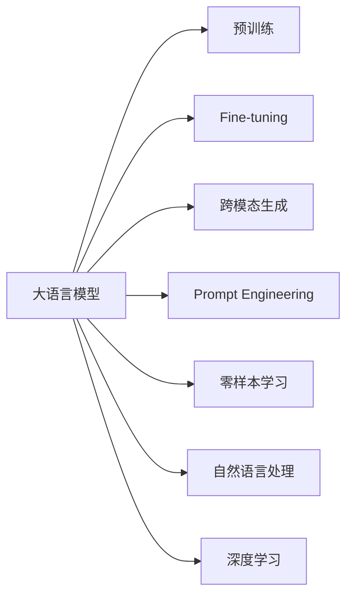

                 

# AIGC从入门到实战：测试：ChatGPT 能扮演什么角色？

## 1. 背景介绍

随着人工智能技术的飞速发展，人工智能生成内容(AIGC)逐渐成为行业热词，引发了众多关注。ChatGPT作为OpenAI推出的GPT-3.5的后续产品，具备了更强的理解力、创造力和泛化能力，能够应用于多个领域的NLP任务。本文将从背景介绍、核心概念与联系、核心算法原理、实际操作流程、数学模型和公式推导、项目实践、应用场景、工具和资源推荐、总结与展望等环节，带领读者系统地了解ChatGPT的原理和应用，助力其从入门到实战。

## 2. 核心概念与联系

### 2.1 核心概念概述

为了更好地理解ChatGPT的原理和应用，首先需要明确几个核心概念：

- **AIGC**：即人工智能生成内容，通过算法和模型自动生成文本、图像、音频等内容的AI技术。ChatGPT作为AIGC的代表，具备强大的生成能力。

- **Transformer**：一种基于自注意力机制的深度学习模型，被广泛用于自然语言处理(NLP)任务，具备高效的并行计算能力和强大的表示能力。

- **Prompt Engineering**：通过精心设计的提示模板，指导模型生成特定格式的输出。ChatGPT的响应高度依赖于提示模板的设计。

- **Fine-tuning**：通过小规模标注数据，对预训练模型进行微调，使其适应特定任务。ChatGPT可以通过Fine-tuning提升在特定领域的表现。

- **Zero-shot Learning**：无需任何标注样本，直接通过提示模板完成目标任务。ChatGPT具备一定程度的Zero-shot学习能力。

- **Cross-modal Generative**：能同时处理文字、图像、音频等多模态数据，生成多模态融合内容。ChatGPT在图像生成、文本描述生成等领域有广泛应用。

### 2.2 核心概念原理和架构的 Mermaid 流程图



这个流程图展示了ChatGPT的核心概念及其之间的联系：

1. 大语言模型通过预训练获得基础能力。
2. Fine-tuning通过小规模标注数据，对预训练模型进行微调，适应特定任务。
3. 跨模态生成能够同时处理文字、图像、音频等多模态数据。
4. Prompt Engineering通过精心设计的提示模板，指导模型生成特定格式的输出。
5. 零样本学习无需任何标注样本，直接通过提示模板完成目标任务。
6. 自然语言处理利用深度学习算法，处理和生成文本内容。
7. 深度学习提供底层算法支持，包括Transformer模型等。

## 3. 核心算法原理 & 具体操作步骤

### 3.1 算法原理概述

ChatGPT的生成过程基于Transformer模型和自回归方式，通过在大规模文本数据上进行预训练，学习语言的表示和生成规则。预训练过程包括掩码语言模型、自回归语言模型等任务，使得模型能够学习到丰富的语言知识。

在应用到特定任务时，ChatGPT通过Fine-tuning，在少量标注数据上进行调整，使其适应新的任务。Fine-tuning通常包括参数更新、损失函数定义、优化器选择等步骤，目标是最大化任务性能。

### 3.2 算法步骤详解

ChatGPT的核心算法步骤如下：

**Step 1: 准备预训练模型和数据集**
- 选择OpenAI的GPT-3.5或GPT-4等大语言模型作为初始化参数。
- 准备特定任务的数据集，划分为训练集、验证集和测试集。

**Step 2: 设计提示模板**
- 根据任务需求，设计合适的提示模板，使其包含任务相关信息和生成格式要求。

**Step 3: Fine-tuning**
- 在少量标注数据上，使用AdamW优化器进行Fine-tuning，设置合适的学习率、批次大小等超参数。
- 定义损失函数，如交叉熵损失、均方误差损失等。
- 使用梯度下降等优化算法，最小化损失函数，更新模型参数。

**Step 4: 评估和部署**
- 在验证集上评估模型性能，调整超参数或重新训练。
- 在测试集上评估最终模型，保存并部署到实际应用中。

### 3.3 算法优缺点

ChatGPT具有以下优点：
1. 通用性强：通过Fine-tuning，ChatGPT可应用于多种NLP任务，如问答、对话、翻译等。
2. 生成能力强：具备强大的语言生成能力，生成的文本自然流畅，信息量大。
3. 自回归生成：生成的文本有较强的连贯性和逻辑性。
4. 多模态处理：支持跨模态数据生成，如图像描述生成、图像生成等。

同时，ChatGPT也存在一些局限性：
1. 依赖提示模板：生成的文本质量高度依赖于提示模板的设计，设计不当会导致输出不连贯、逻辑混乱。
2. 泛化能力有限：当任务与预训练数据的分布差异较大时，生成效果可能不理想。
3. 可解释性不足：ChatGPT的生成过程黑盒化，难以解释其生成逻辑。
4. 存在偏见：预训练模型可能包含偏见，传递到生成的文本中，造成不公平或不准确。

### 3.4 算法应用领域

ChatGPT在多个领域具有广泛的应用，以下是几个典型案例：

**1. 内容创作**
- 新闻报道：自动生成新闻稿件、报道摘要等。
- 文学创作：自动创作小说、诗歌、故事等。
- 广告文案：自动生成广告词、宣传语等。

**2. 客户服务**
- 智能客服：自动回答客户咨询，提供24/7服务。
- 技术支持：自动生成故障排除指南、FAQ等。
- 市场调研：自动生成市场报告、问卷调查等。

**3. 教育培训**
- 智能辅导：自动生成习题、答案、教学计划等。
- 学习建议：自动生成个性化学习方案、课程推荐等。
- 教育资源：自动生成教材、讲义、案例分析等。

**4. 研究开发**
- 数据分析：自动生成数据报告、分析报告等。
- 技术支持：自动生成技术文档、代码示例等。
- 知识整理：自动生成知识库、术语表等。

**5. 娱乐传媒**
- 影视剧本：自动生成电影剧本、电视剧本等。
- 音乐创作：自动生成歌词、编曲等。
- 游戏开发：自动生成游戏文本、对话等。

## 4. 数学模型和公式 & 详细讲解 & 举例说明

### 4.1 数学模型构建

ChatGPT的生成过程可以通过以下数学模型进行描述：

$$
p(w|x) = \frac{e^{\sum_{i=1}^n \log P(w_i|w_{<i},x)}}
$$

其中，$w$ 为生成的文本序列，$x$ 为输入的提示模板，$P(w_i|w_{<i},x)$ 为当前生成词的条件概率。

### 4.2 公式推导过程

ChatGPT的生成过程基于自回归模型，通过最大似然估计法，学习每个词的条件概率。给定提示模板 $x$，模型的目标是最大化生成的文本序列 $w$ 的条件概率。

在训练过程中，使用自回归方式，即先预测下一个词的概率，然后利用这个概率计算下一个词的条件概率，依次迭代生成整个文本序列。训练时，通过最大化似然损失函数：

$$
L(w) = -\log p(w|x)
$$

求解模型的最优参数 $\theta$，最小化损失函数 $L(w)$。

### 4.3 案例分析与讲解

假设我们希望ChatGPT自动生成一段关于“人工智能”的介绍文本，可以设计如下提示模板：

```
请生成一段关于人工智能的介绍，包含定义、应用和未来发展。
```

然后通过训练，ChatGPT将自动生成如下文本：

```
人工智能（AI）是一种基于数据驱动、算法驱动和计算驱动的技术体系，旨在模拟人类的认知、推理和决策能力。AI在各个领域得到了广泛应用，如自然语言处理、计算机视觉、机器人技术等。未来，AI将更加普及，并将在医疗、教育、金融等领域带来颠覆性变革。
```

## 5. 项目实践：代码实例和详细解释说明

### 5.1 开发环境搭建

ChatGPT的应用开发依赖于OpenAI的API接口，因此需要首先创建一个OpenAI账号，并申请API密钥。

```bash
pip install openai
```

安装openai Python客户端库。

### 5.2 源代码详细实现

以下是一个使用OpenAI API生成文本的Python代码示例：

```python
import openai

openai.api_key = 'your-api-key'

prompt = "请生成一段关于人工智能的介绍，包含定义、应用和未来发展。"
response = openai.Completion.create(
    engine='davinci-codex', 
    prompt=prompt,
    max_tokens=50,
    temperature=0.7
)

print(response.choices[0].text)
```

其中，`engine`参数指定了使用的生成模型，`prompt`为提示模板，`max_tokens`指定生成的文本长度，`temperature`指定生成的文本多样性。

### 5.3 代码解读与分析

**openai.Completion.create**方法使用OpenAI的API生成文本。其中：

- `engine`参数指定使用的生成模型。
- `prompt`参数为提示模板，定义了生成的文本内容和格式。
- `max_tokens`参数指定生成的文本长度，默认情况下为1。
- `temperature`参数指定生成的文本多样性，值越小生成结果越具确定性。

## 6. 实际应用场景

### 6.4 未来应用展望

ChatGPT作为AIGC的代表性产品，将在未来持续扩展其应用场景，带来更多可能性和创新。以下是几个未来应用展望：

**1. 多领域应用**
- 自动生成市场报告、数据分析报告、技术文档等。
- 自动生成教育资源、学习材料、个性化教学方案等。
- 自动生成游戏内容、影视剧本、小说等创意内容。

**2. 跨模态生成**
- 图像描述生成：给定一张图片，自动生成文字描述。
- 视频生成：自动生成视频脚本、旁白、配乐等。
- 音频生成：自动生成音频脚本、配乐、配音等。

**3. 个性化服务**
- 智能助理：自动生成个性化问答、推荐等。
- 智能咨询：自动生成医疗咨询、法律咨询、技术支持等。
- 个性化推荐：自动生成商品推荐、内容推荐等。

**4. 商业应用**
- 营销推广：自动生成广告词、宣传语、销售话术等。
- 市场分析：自动生成市场报告、趋势分析、竞争分析等。
- 客户服务：自动生成客户满意度调查、服务评价等。

## 7. 工具和资源推荐

### 7.1 学习资源推荐

为了帮助开发者系统掌握ChatGPT的理论基础和实践技巧，以下是几个推荐的学习资源：

1. **《AIGC原理与实践》系列博文**：由大模型技术专家撰写，深入浅出地介绍了AIGC原理、ChatGPT模型、Prompt Engineering等前沿话题。

2. **《OpenAI的GPT系列论文》**：OpenAI的官方论文，详细介绍了GPT-3、GPT-4等模型的架构和训练过程，是理解ChatGPT的必读材料。

3. **《自然语言处理》课程**：斯坦福大学开设的NLP明星课程，涵盖了自然语言处理的基础理论和经典模型。

4. **《深度学习与自然语言处理》书籍**：全面介绍了深度学习在NLP领域的应用，包括Prompt Engineering、Fine-tuning等。

5. **《自然语言处理与AI技术》视频课程**：结合实际项目，详细讲解了自然语言处理和AI技术的开发过程。

### 7.2 开发工具推荐

ChatGPT的开发和应用离不开优秀的工具支持。以下是几款常用的开发工具：

1. **OpenAI的API接口**：通过OpenAI的API接口，可以访问ChatGPT和其他AIGC工具。
2. **Jupyter Notebook**：一个交互式编程环境，适合进行数据处理和模型训练。
3. **PyTorch**：一个深度学习框架，提供高效的Tensor运算和自动微分功能。
4. **TensorFlow**：由Google主导的深度学习框架，支持GPU加速和大规模模型训练。
5. **HuggingFace的Transformers库**：提供了多种预训练语言模型，方便进行微调和推理。

### 7.3 相关论文推荐

ChatGPT作为AIGC的代表性产品，其研究和发展受到了广泛关注。以下是几篇奠基性的相关论文，推荐阅读：

1. **Attention is All You Need**：提出了Transformer结构，开启了NLP领域的预训练大模型时代。
2. **Language Models are Unsupervised Multitask Learners**：展示了GPT-2的大规模自监督学习能力。
3. **Fine-tuning Pre-trained Language Models for Medical Question Answering**：介绍了如何利用预训练模型进行医疗问答的微调。
4. **AdaLoRA: Adaptive Low-Rank Adaptation for Parameter-Efficient Fine-Tuning**：提出了一种自适应低秩适应的微调方法，提高了微调效率。
5. **Few-shot Learning with Meta-Learning Adaptation to Post-Training Initialization**：介绍了Few-shot学习中的元学习适应方法，提升了微调效果。

这些论文代表了大模型微调技术的发展脉络，通过学习这些前沿成果，可以帮助研究者把握学科前进方向，激发更多的创新灵感。

## 8. 总结：未来发展趋势与挑战

### 8.1 总结

本文对ChatGPT的原理和应用进行了全面系统的介绍。首先，介绍了AIGC和ChatGPT的概念及其联系，明确了ChatGPT在多领域NLP任务中的强大生成能力。其次，详细讲解了ChatGPT的生成原理和具体操作步骤，给出了生成文本的代码实现。同时，本文还广泛探讨了ChatGPT在实际应用中的多种场景，展示了其应用潜力。

通过本文的系统梳理，可以看到，ChatGPT作为AIGC的代表性产品，已经在多个领域展现出了巨大的应用潜力，能够高效地生成高质量文本内容。未来，伴随技术的不断演进，ChatGPT必将在更多领域发挥更大作用，成为推动NLP技术发展的重要力量。

### 8.2 未来发展趋势

展望未来，ChatGPT的发展将呈现以下几个趋势：

1. **模型规模不断扩大**：随着算力成本的下降和数据规模的扩张，预训练模型的参数量将继续增加，生成效果将更加逼真和自然。

2. **Fine-tuning技术升级**：更多的Fine-tuning方法和技术将被引入，提高ChatGPT在不同任务上的适应性和泛化能力。

3. **多模态生成**：ChatGPT将逐步拓展到图像、音频、视频等多模态数据生成领域，实现更丰富的内容生成方式。

4. **个性化和实时生成**：通过更好的Prompt Engineering，ChatGPT将能够生成更加个性化、实时响应的内容，提高用户体验。

5. **跨领域应用**：ChatGPT将更多地应用于教育、医疗、法律等高风险领域，为这些领域带来创新和变革。

这些趋势凸显了ChatGPT的广阔前景，预示着其在未来将更加广泛地应用于多个领域，带来更多创新和变革。

### 8.3 面临的挑战

尽管ChatGPT已经取得了显著进展，但在实现其广泛应用的过程中，仍面临以下挑战：

1. **依赖提示模板**：生成的文本质量高度依赖于提示模板的设计，设计不当会导致输出不连贯、逻辑混乱。

2. **泛化能力有限**：当任务与预训练数据的分布差异较大时，生成效果可能不理想。

3. **可解释性不足**：ChatGPT的生成过程黑盒化，难以解释其生成逻辑。

4. **存在偏见**：预训练模型可能包含偏见，传递到生成的文本中，造成不公平或不准确。

5. **性能瓶颈**：在处理大规模文本数据时，ChatGPT的计算和存储成本较高，存在性能瓶颈。

这些挑战需要在技术、算法、数据等多个方面进行改进和优化，才能使ChatGPT真正实现大规模落地应用。

### 8.4 研究展望

为了克服ChatGPT面临的挑战，未来的研究需要在以下几个方面寻求新的突破：

1. **Prompt Engineering优化**：设计更加灵活、智能的提示模板，提高生成的文本质量。

2. **多模态融合**：探索多模态数据融合的生成方法，提升ChatGPT的多模态生成能力。

3. **模型优化**：通过模型结构优化和算法改进，提高ChatGPT的生成效率和泛化能力。

4. **生成解释**：引入生成解释技术，增强ChatGPT的生成可解释性，帮助用户理解生成内容。

5. **数据净化**：开发数据净化技术，减少预训练模型中的偏见，提升ChatGPT的公正性。

6. **分布式计算**：通过分布式计算和存储技术，提高ChatGPT的计算和存储效率，支持大规模生成任务。

这些研究方向将进一步推动ChatGPT的技术成熟和应用落地，为构建安全、可靠、可解释、可控的智能系统铺平道路。

## 9. 附录：常见问题与解答

**Q1：ChatGPT的生成效果如何？**

A: ChatGPT的生成效果高度依赖于提示模板的设计，设计得当可以生成高质量、自然流畅的文本。在新闻报道、文学创作、广告文案等领域，ChatGPT已经展现出了显著的生成能力。

**Q2：ChatGPT如何提高生成质量？**

A: 提高ChatGPT生成质量的关键在于优化Prompt Engineering和Fine-tuning。通过设计更有信息的提示模板，提供更多上下文信息，可以显著提升生成的文本连贯性和逻辑性。通过Fine-tuning，进一步适应特定任务和领域，提升生成效果。

**Q3：ChatGPT是否存在偏见？**

A: ChatGPT的生成结果可能受到预训练数据的影响，存在一定的偏见。可以通过数据净化技术，如去偏训练、对抗训练等，减少预训练数据中的偏见，提升ChatGPT的公正性和公平性。

**Q4：ChatGPT的计算和存储成本高吗？**

A: 目前ChatGPT的计算和存储成本较高，主要原因是模型规模较大。未来随着技术进步和资源优化，这些成本有望逐步降低。同时，通过分布式计算和存储技术，可以进一步提升ChatGPT的性能。

总之，ChatGPT作为AIGC的代表产品，已经在多个领域展现出巨大的应用潜力。未来，伴随技术的不断演进和应用实践的不断深入，ChatGPT必将在更多领域发挥更大作用，成为推动NLP技术发展的重要力量。

