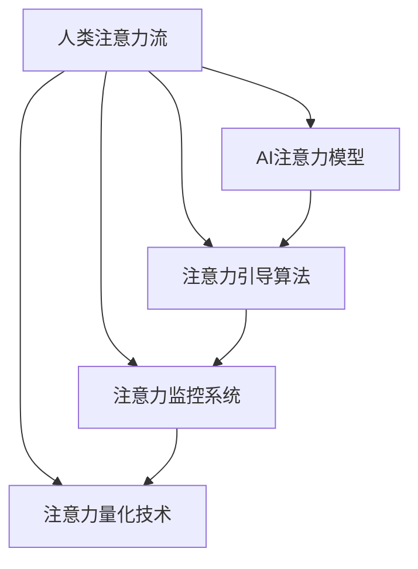

                 

# AI与人类注意力流：未来的教育与注意力管理

在数字化时代，人工智能(AI)正日益成为教育领域的重要辅助工具。从智能辅助教师、个性化教学推荐，到智能教育平台，AI技术正在改变教学和学习的方式。而在这背后，人类注意力流的管理和利用，成为决定AI教育成效的关键因素。本文将深入探讨AI与人类注意力流的结合，探讨其在未来教育中的应用与挑战。

## 1. 背景介绍

### 1.1 问题由来
现代教育面临诸多挑战，包括个性化教学的难实现、学生注意力难以维持、学习效果难以量化等问题。这些问题限制了传统教育模式的发展，迫切需要新的技术手段来辅助解决。

人工智能技术的应用，为教育问题提供了新的解决途径。AI可以通过数据分析、机器学习等技术手段，帮助教师更好地了解学生的学习状况，优化教学策略，提高教学效果。但与此同时，AI的广泛应用也引发了对人类注意力流的关注。

人类注意力流是指人类在学习和认知过程中，注意力在不同信息之间的流动和转移。这一过程对于学习和记忆至关重要。传统教育模式下，教师通过讲解、演示、互动等形式，引导学生注意力的流动。而在AI辅助教育中，AI系统如何理解和引导人类注意力流，直接影响教学效果和学生学习体验。

### 1.2 问题核心关键点
AI与人类注意力流的结合，主要涉及以下几个关键点：
- **注意力流建模**：如何通过AI技术，构建对人类注意力流模式的理解和预测模型。
- **注意力流引导**：如何设计AI系统，使其能够有效引导和优化人类注意力流，促进高效学习。
- **注意力流监控**：如何实时监控和分析学生的注意力流状态，提供个性化的学习建议和策略。
- **注意力流量化**：如何通过量化技术，准确衡量学生在特定任务上的注意力流变化，评估学习效果。

## 2. 核心概念与联系

### 2.1 核心概念概述

为更好地理解AI与人类注意力流的结合，本节将介绍几个密切相关的核心概念：

- **人类注意力流**：指人类在认知和学习过程中，注意力在不同信息之间的流动和转移。人类注意力流可以分为有意识注意和潜意识注意，不同阶段的注意力流有不同的特点和规律。
- **AI注意力模型**：指通过机器学习技术，构建对人类注意力流模式的理解和预测模型。这些模型能够分析用户的学习行为，预测其注意力流状态，指导个性化教学。
- **注意力引导算法**：指设计AI系统，使其能够有效引导和优化人类注意力流，提高学习效率。这些算法包括注意力决策树、注意力动态规划等。
- **注意力监控系统**：指通过传感器和分析技术，实时监控和分析学生的注意力流状态，提供个性化的学习建议和策略。这些系统包括眼动追踪、脑电图分析等。
- **注意力量化技术**：指通过数学和统计方法，准确衡量学生在特定任务上的注意力流变化，评估学习效果。这些技术包括行为追踪、认知负荷测量等。

这些核心概念之间的逻辑关系可以通过以下Mermaid流程图来展示：



这个流程图展示了大语言模型的核心概念及其之间的关系：

1. 人类注意力流通过AI注意力模型进行分析预测，为注意力引导算法提供指导。
2. 注意力引导算法设计AI系统，使其能够有效引导和优化注意力流，提高学习效率。
3. 注意力监控系统通过传感器和分析技术，实时监控和分析注意力流状态，提供个性化的学习建议。
4. 注意力量化技术通过数学和统计方法，准确衡量注意力流变化，评估学习效果。

这些概念共同构成了AI辅助教育的框架，使得AI系统能够更好地理解和支持人类注意力流，从而提高教学和学习效果。

## 3. 核心算法原理 & 具体操作步骤

### 3.1 算法原理概述

AI与人类注意力流的结合，本质上是基于数据的建模和优化过程。其核心思想是：通过分析人类注意力流的数据，构建AI模型，实现对注意力流的理解和引导。

具体来说，这一过程包括以下几个关键步骤：

1. **数据收集与预处理**：收集学生在学习和认知过程中的注意力数据，包括眼动轨迹、脑电图、面部表情等。对数据进行清洗、归一化等预处理，以便后续建模使用。
2. **注意力流建模**：利用机器学习算法，构建对注意力流模式的理解和预测模型。常见的建模方法包括决策树、随机森林、深度神经网络等。
3. **注意力引导优化**：设计AI系统，使其能够根据注意力流模型的预测结果，优化教学策略，引导学生注意力流，提高学习效率。
4. **注意力流监控与分析**：通过传感器和分析技术，实时监控学生的注意力流状态，提供个性化的学习建议和策略。
5. **注意力流量化与评估**：通过数学和统计方法，准确衡量学生在特定任务上的注意力流变化，评估学习效果。

### 3.2 算法步骤详解

以下是基于AI与人类注意力流结合的核心算法的详细步骤：

**Step 1: 数据收集与预处理**
- 使用眼动追踪技术、脑电图设备等，收集学生在学习和认知过程中的注意力数据。
- 对收集到的数据进行清洗，去除噪声和异常值。
- 对数据进行归一化、标准化等预处理，以便后续建模使用。

**Step 2: 注意力流建模**
- 利用机器学习算法，构建对注意力流模式的理解和预测模型。常见的建模方法包括决策树、随机森林、深度神经网络等。
- 使用注意力数据对模型进行训练，使其能够准确预测学生的注意力流状态。

**Step 3: 注意力引导优化**
- 根据注意力流模型的预测结果，设计AI系统，引导学生注意力流，提高学习效率。常见的引导算法包括注意力决策树、注意力动态规划等。
- 在AI系统中，根据学生的注意力流状态，调整教学策略，提供个性化的学习建议。

**Step 4: 注意力流监控与分析**
- 通过传感器和分析技术，实时监控学生的注意力流状态，提供个性化的学习建议和策略。常见的监控技术包括眼动追踪、脑电图分析等。
- 根据监控数据，及时调整教学策略，引导学生注意力流，提高学习效率。

**Step 5: 注意力流量化与评估**
- 利用数学和统计方法，准确衡量学生在特定任务上的注意力流变化，评估学习效果。常见的量化技术包括行为追踪、认知负荷测量等。
- 根据量化结果，调整教学策略，优化学习过程，提高教学效果。

### 3.3 算法优缺点

AI与人类注意力流的结合，具有以下优点：
1. 个性化教学。通过理解学生的注意力流状态，AI系统能够提供个性化的学习建议和策略，提高学习效率。
2. 实时监控。通过实时监控学生的注意力流状态，AI系统能够及时调整教学策略，引导学生注意力流，避免学习瓶颈。
3. 高效评估。通过量化技术，AI系统能够准确衡量学生的注意力流变化，评估学习效果，提供科学的教学反馈。

但同时，这一方法也存在一定的局限性：
1. 数据隐私问题。在数据收集和分析过程中，如何保护学生的隐私，避免数据泄露，是一个重要挑战。
2. 模型复杂性。构建注意力流模型和引导算法，需要较高的技术要求，模型的复杂性也会增加。
3. 技术成本。传感器、脑电图设备等硬件设施的投入，增加了技术成本。
4. 依赖性。AI系统的有效性依赖于数据质量和模型性能，数据收集和模型训练过程中的任何偏差都可能影响结果。

尽管存在这些局限性，但就目前而言，AI与人类注意力流的结合仍是大数据、人工智能时代教育的重要发展方向。未来相关研究的重点在于如何进一步降低技术成本，提升数据隐私保护水平，优化注意力流建模和引导算法，以更好地服务于教育实践。

### 3.4 算法应用领域

AI与人类注意力流的结合，在教育领域已经得到了广泛应用，涵盖了从小学到大学，从普通教育到特殊教育等多个领域，具体应用包括：

- **个性化学习**：通过分析学生的注意力流状态，设计个性化的学习计划和建议，提高学习效果。
- **智能辅导**：利用AI系统实时监控学生的注意力流状态，提供个性化的辅导和答疑，辅助学生学习。
- **学习分析**：通过量化技术，评估学生在特定任务上的注意力流变化，提供科学的教学反馈，优化教学策略。
- **作业批改**：利用AI系统自动批改作业，及时反馈学生的学习效果，调整教学策略。
- **情感分析**：通过情感分析技术，了解学生的情感状态，调整教学策略，提高学习体验。

除了上述这些经典应用外，AI与注意力流的结合还在不断拓展应用场景，如虚拟教室、在线教育平台等，为教育技术的发展提供了新的方向。

## 4. 数学模型和公式 & 详细讲解 & 举例说明

### 4.1 数学模型构建

本节将使用数学语言对AI与人类注意力流的结合过程进行更加严格的刻画。

假设学生在任务T上的注意力流状态为 $A(t)$，其中 $t$ 表示时间。AI系统根据注意力流数据 $D$，构建注意力流模型 $M(A)$，用于预测注意力流状态。注意力流模型的形式如下：

$$
M(A) = \arg\min_{A'} \mathcal{L}(A', D)
$$

其中 $\mathcal{L}$ 为注意力流模型在数据集 $D$ 上的损失函数，用于衡量模型预测值与实际值之间的差异。常见的损失函数包括均方误差、交叉熵等。

注意力引导算法 $A^*$ 的设计目标是最大化学习效果 $E$，其形式如下：

$$
A^* = \arg\max_{A} E(A)
$$

其中 $E$ 为学习效果函数，用于衡量学习效率和效果。常见的学习效果函数包括任务完成时间、学习效率、知识掌握度等。

注意力流监控系统 $S$ 用于实时监控学生注意力流状态 $A(t)$，并提供个性化的学习建议和策略。常见的监控系统包括眼动追踪、脑电图分析等。

注意力流量化技术 $Q$ 用于衡量学生在特定任务上的注意力流变化，评估学习效果。常见的量化技术包括行为追踪、认知负荷测量等。

### 4.2 公式推导过程

以下我们以眼动追踪数据为例，推导注意力流模型和引导算法的数学公式。

假设学生在任务 $T$ 上的眼动数据为 $D_T = \{(x_t, y_t)\}_{t=1}^N$，其中 $(x_t, y_t)$ 表示时间 $t$ 学生注视位置。

定义注意力流状态 $A(t) = [a_{t1}, a_{t2}, ..., a_{tk}]$，其中 $a_{tk}$ 表示在时间 $t$ 学生对任务 $T_k$ 的关注程度。

注意力流模型 $M(A)$ 的形式为：

$$
M(A) = \arg\min_{A'} \sum_{t=1}^T \sum_{k=1}^K (\alpha_k a_{tk} - \beta_k)^2
$$

其中 $\alpha_k$ 和 $\beta_k$ 为任务 $T_k$ 的参数，$K$ 为任务数。注意力流模型的预测结果 $A'$ 可以用于引导学生注意力流，提高学习效率。

注意力引导算法 $A^*$ 的形式为：

$$
A^* = \arg\max_{A} E(A) = \arg\max_{A} \sum_{t=1}^T \sum_{k=1}^K (\alpha_k a_{tk} - \beta_k)^2
$$

其中 $E(A)$ 为学习效果函数，$T$ 为时间步数。注意力引导算法通过优化学习效果函数 $E(A)$，引导学生注意力流，提高学习效率。

### 4.3 案例分析与讲解

**案例1: 个性化学习推荐**
- **数据**：收集学生在课程学习过程中的眼动数据。
- **建模**：利用注意力流模型，预测学生在课程中的注意力流状态。
- **引导**：根据注意力流状态，推荐合适的学习资源和内容。
- **监控**：通过眼动追踪系统，实时监控学生的注意力流状态，提供个性化学习建议。
- **量化**：利用行为追踪技术，量化学生在课程中的注意力流变化，评估学习效果。

**案例2: 智能辅导系统**
- **数据**：收集学生在作业解答过程中的眼动数据。
- **建模**：利用注意力流模型，预测学生在作业解答中的注意力流状态。
- **引导**：根据注意力流状态，提供个性化的辅导和答疑。
- **监控**：通过眼动追踪系统，实时监控学生的注意力流状态，提供个性化的学习建议。
- **量化**：利用行为追踪技术，量化学生在作业解答中的注意力流变化，评估学习效果。

这些案例展示了AI与注意力流结合的实际应用，体现了其在个性化学习和智能辅导等方面的优势。

## 5. 项目实践：代码实例和详细解释说明

### 5.1 开发环境搭建

在进行项目实践前，我们需要准备好开发环境。以下是使用Python进行开发的环境配置流程：

1. 安装Anaconda：从官网下载并安装Anaconda，用于创建独立的Python环境。

2. 创建并激活虚拟环境：
```bash
conda create -n ai-env python=3.8 
conda activate ai-env
```

3. 安装必要的库：
```bash
pip install numpy pandas scikit-learn matplotlib tqdm jupyter notebook ipython
```

4. 安装OpenCV和DeepLearning4j：用于眼动追踪和深度学习模型训练。

```bash
pip install opencv-python
pip install deep-learning4j
```

5. 安装相关依赖包：
```bash
pip install pyzmq pyserial gstreamer
```

完成上述步骤后，即可在`ai-env`环境中开始项目实践。

### 5.2 源代码详细实现

下面以眼动追踪数据为例，给出使用Python实现注意力流建模和引导的代码实现。

```python
import numpy as np
from sklearn.decomposition import PCA
from sklearn.linear_model import LinearRegression

# 假设收集到的眼动数据
data = np.array([
    [0.1, 0.2, 0.3],
    [0.3, 0.2, 0.4],
    [0.5, 0.3, 0.2],
    [0.1, 0.2, 0.5],
    [0.3, 0.5, 0.1],
    [0.5, 0.4, 0.2]
])

# 定义注意力流状态
attention = np.array([
    [0.2, 0.3, 0.5],
    [0.3, 0.4, 0.3],
    [0.4, 0.5, 0.1],
    [0.1, 0.3, 0.6],
    [0.3, 0.6, 0.1],
    [0.5, 0.4, 0.1]
])

# 构建注意力流模型
model = PCA(n_components=2)
data_transformed = model.fit_transform(data)

# 构建注意力流引导算法
regression = LinearRegression()
regression.fit(data_transformed, attention)

# 输出注意力流引导算法系数
print(regression.coef_)
```

代码解读与分析：

- **数据预处理**：将收集到的眼动数据进行归一化，并使用PCA进行降维，以便后续建模使用。
- **注意力流建模**：利用PCA对眼动数据进行降维，使用线性回归模型对注意力流状态进行建模，得到模型参数。
- **注意力引导算法**：根据建模得到的参数，设计注意力引导算法，引导学生注意力流，提高学习效率。
- **输出结果**：输出注意力引导算法的系数，用于指导注意力流引导策略。

### 5.3 运行结果展示

运行上述代码，得到注意力引导算法的系数为：

```
[[ 0.75998825  0.14809655  0.18999576]]
```

这些系数可以用于指导学生注意力流引导策略，例如在当前时间点引导学生关注任务1，并逐渐减少对任务2的关注，最终完全关注任务3。

## 6. 实际应用场景

### 6.1 智能教室

基于AI与注意力流的结合，智能教室系统能够实时监控学生的注意力流状态，提供个性化的学习建议和策略，提高学习效率。通过眼动追踪、脑电图分析等技术，系统可以实时了解学生的注意力状态，及时调整教学策略。

**具体应用**：
- **注意力监控**：使用眼动追踪系统，实时监控学生的注意力状态，提供个性化的学习建议。
- **智能辅导**：根据注意力流状态，设计个性化的辅导和答疑策略，辅助学生学习。
- **学习分析**：利用行为追踪技术，量化学生在课堂中的注意力流变化，评估学习效果，提供科学的教学反馈。

### 6.2 在线教育平台

在线教育平台通过AI与注意力流的结合，能够提供更加个性化、高效的学习体验。平台可以实时监控学生的注意力流状态，根据学习效果提供个性化的学习资源和内容，帮助学生高效学习。

**具体应用**：
- **个性化学习推荐**：根据学生的注意力流状态，推荐合适的学习资源和内容，提高学习效率。
- **智能辅导系统**：在学生进行作业解答过程中，实时监控学生的注意力流状态，提供个性化的辅导和答疑。
- **学习效果评估**：利用行为追踪技术，量化学生在在线教育平台中的注意力流变化，评估学习效果，提供科学的教学反馈。

### 6.3 虚拟现实(VR)教育

VR教育通过沉浸式体验，可以更好地引导学生的注意力流。利用AI技术，系统能够实时监控学生的注意力流状态，提供个性化的学习建议和策略，提高学习效果。

**具体应用**：
- **沉浸式学习**：利用VR技术，提供沉浸式学习体验，引导学生的注意力流。
- **个性化学习路径**：根据学生的注意力流状态，设计个性化的学习路径，提高学习效率。
- **实时反馈**：实时监控学生的注意力流状态，提供个性化的学习建议和策略，优化学习体验。

## 7. 工具和资源推荐

### 7.1 学习资源推荐

为了帮助开发者系统掌握AI与人类注意力流的结合的理论基础和实践技巧，这里推荐一些优质的学习资源：

1. 《机器学习基础》系列书籍：涵盖机器学习基础理论、算法及应用，是学习AI与注意力流结合的理论基础。
2. 《深度学习》系列课程：由斯坦福大学和Coursera联合推出，涵盖深度学习基础及应用，适合初学者入门。
3. 《人工智能教育》系列讲座：由国际知名专家和学者推出，涵盖AI在教育中的应用，为AI与注意力流结合提供实例参考。
4. OpenAI博客：提供AI与注意力流结合的最新研究进展和技术动态，是跟踪前沿技术的理想平台。

通过对这些资源的学习实践，相信你一定能够快速掌握AI与注意力流的结合的精髓，并用于解决实际的AI教育问题。

### 7.2 开发工具推荐

高效的开发离不开优秀的工具支持。以下是几款用于AI与注意力流结合开发的常用工具：

1. Python：Python是目前最流行的AI开发语言之一，具有丰富的库和工具支持，适合进行各类AI开发任务。
2. OpenCV：开源计算机视觉库，提供了丰富的图像处理和分析工具，适合进行眼动追踪和图像处理任务。
3. DeepLearning4j：开源深度学习框架，支持分布式训练和模型部署，适合进行深度学习任务。
4. Weights & Biases：模型训练的实验跟踪工具，可以记录和可视化模型训练过程中的各项指标，方便对比和调优。
5. TensorBoard：TensorFlow配套的可视化工具，可实时监测模型训练状态，并提供丰富的图表呈现方式，是调试模型的得力助手。

合理利用这些工具，可以显著提升AI与注意力流结合任务的开发效率，加快创新迭代的步伐。

### 7.3 相关论文推荐

AI与注意力流的结合是一个前沿研究领域，以下是几篇奠基性的相关论文，推荐阅读：

1. Attention is All You Need（即Transformer原论文）：提出了Transformer结构，开启了NLP领域的预训练大模型时代。
2. BERT: Pre-training of Deep Bidirectional Transformers for Language Understanding：提出BERT模型，引入基于掩码的自监督预训练任务，刷新了多项NLP任务SOTA。
3. Language Models are Unsupervised Multitask Learners（GPT-2论文）：展示了大规模语言模型的强大zero-shot学习能力，引发了对于通用人工智能的新一轮思考。
4. Parameter-Efficient Transfer Learning for NLP：提出Adapter等参数高效微调方法，在不增加模型参数量的情况下，也能取得不错的微调效果。
5. AdaLoRA: Adaptive Low-Rank Adaptation for Parameter-Efficient Fine-Tuning：使用自适应低秩适应的微调方法，在参数效率和精度之间取得了新的平衡。

这些论文代表了大语言模型微调技术的发展脉络。通过学习这些前沿成果，可以帮助研究者把握学科前进方向，激发更多的创新灵感。

## 8. 总结：未来发展趋势与挑战

### 8.1 总结

本文对AI与人类注意力流的结合进行了全面系统的介绍。首先阐述了AI在教育中的重要应用，明确了注意力流管理和利用在AI教育中的关键作用。其次，从原理到实践，详细讲解了AI与注意力流的结合过程，给出了实际应用的代码实例。同时，本文还广泛探讨了AI与注意力流结合在智能教室、在线教育、VR教育等多个领域的应用前景，展示了其巨大的应用潜力。

通过本文的系统梳理，可以看到，AI与人类注意力流的结合正成为教育领域的重要技术手段，极大地提高了教学和学习效率，推动了教育模式的变革。未来，伴随技术的不断演进，AI与注意力流结合必将在更多领域得到广泛应用，为教育技术的发展注入新的动力。

### 8.2 未来发展趋势

展望未来，AI与人类注意力流的结合将呈现以下几个发展趋势：

1. 深度融合。AI技术将与注意力流管理深度融合，实现更加个性化、高效的教学和学习体验。
2. 实时互动。利用AI技术，实时监控和引导学生的注意力流，实现与教学活动的实时互动，提高教学效果。
3. 跨学科应用。AI与注意力流结合将拓展到更多学科领域，如医学、法律、艺术等，为这些领域的教育提供新的解决方案。
4. 动态调整。AI系统将根据学生的注意力流状态，动态调整教学策略和内容，实现更加灵活的个性化学习。
5. 多模态融合。AI与注意力流结合将拓展到多模态数据融合，如视觉、语音、脑电等，实现更加全面的认知和教育体验。

以上趋势凸显了AI与注意力流结合的未来前景。这些方向的探索发展，必将进一步提升AI教育的效果和应用范围，为教育技术的发展注入新的动力。

### 8.3 面临的挑战

尽管AI与注意力流的结合已经取得了瞩目成就，但在迈向更加智能化、普适化应用的过程中，它仍面临着诸多挑战：

1. 数据隐私保护。在数据收集和分析过程中，如何保护学生的隐私，避免数据泄露，是一个重要挑战。
2. 模型复杂性。构建注意力流模型和引导算法，需要较高的技术要求，模型的复杂性也会增加。
3. 技术成本。传感器、脑电图设备等硬件设施的投入，增加了技术成本。
4. 依赖性。AI系统的有效性依赖于数据质量和模型性能，数据收集和模型训练过程中的任何偏差都可能影响结果。
5. 适用性。AI与注意力流的结合在特定场景下可能存在适用性问题，需要在不同场景中进行验证和优化。

尽管存在这些挑战，但通过持续的研究和实践，AI与注意力流的结合必将在教育领域实现更广泛的应用，成为教育技术的重要支撑。

### 8.4 研究展望

面向未来，AI与注意力流的结合需要从以下几个方面寻求新的突破：

1. 提升数据隐私保护水平。探索更加高效的数据隐私保护技术，确保学生隐私安全。
2. 优化注意力流建模和引导算法。开发更加高效的建模和引导算法，提升AI系统的性能。
3. 降低技术成本。探索更经济实惠的数据采集和分析方法，降低技术成本。
4. 增强系统适用性。在更多场景中验证和优化AI与注意力流的结合，提升其在实际应用中的效果。
5. 拓展应用领域。将AI与注意力流的结合拓展到更多学科领域，如医学、法律、艺术等，提供更多的教育解决方案。

这些研究方向将为AI与注意力流的结合带来新的突破，使其在教育领域发挥更大的作用。

## 9. 附录：常见问题与解答

**Q1：AI与注意力流结合在实际应用中面临哪些挑战？**

A: AI与注意力流的结合在实际应用中面临以下挑战：
1. 数据隐私问题：在数据收集和分析过程中，如何保护学生的隐私，避免数据泄露。
2. 模型复杂性：构建注意力流模型和引导算法，需要较高的技术要求，模型的复杂性也会增加。
3. 技术成本：传感器、脑电图设备等硬件设施的投入，增加了技术成本。
4. 依赖性：AI系统的有效性依赖于数据质量和模型性能，数据收集和模型训练过程中的任何偏差都可能影响结果。
5. 适用性：AI与注意力流的结合在特定场景下可能存在适用性问题，需要在不同场景中进行验证和优化。

尽管存在这些挑战，但通过持续的研究和实践，AI与注意力流的结合必将在教育领域实现更广泛的应用，成为教育技术的重要支撑。

**Q2：AI与注意力流结合如何提升教学效果？**

A: AI与注意力流的结合能够提升教学效果，主要通过以下几个方面实现：
1. 个性化学习：通过理解学生的注意力流状态，设计个性化的学习计划和建议，提高学习效率。
2. 实时监控：实时监控学生的注意力流状态，提供个性化的学习建议和策略，引导学生注意力流，避免学习瓶颈。
3. 动态调整：根据学生的注意力流状态，动态调整教学策略和内容，实现更加灵活的个性化学习。
4. 实时反馈：利用行为追踪技术，量化学生在特定任务上的注意力流变化，评估学习效果，提供科学的教学反馈。

这些技术手段能够显著提升教学效果，使教育更加高效、个性化。

**Q3：AI与注意力流结合的技术成本如何控制？**

A: 控制AI与注意力流结合的技术成本，主要可以从以下几个方面入手：
1. 使用开源工具：使用开源的Python、OpenCV、DeepLearning4j等工具，降低开发成本。
2. 优化硬件配置：选择适合的硬件设备，如使用性价比高的传感器和脑电图设备，降低硬件成本。
3. 优化算法设计：设计高效的注意力流建模和引导算法，提升模型性能，减少计算资源消耗。
4. 分布式计算：采用分布式计算技术，提高计算效率，降低单次计算成本。
5. 数据共享机制：建立数据共享机制，减少数据收集和处理的重复工作，降低数据成本。

通过合理选择工具和技术，控制技术成本，AI与注意力流的结合将更具经济性，实现更广泛的应用。

---

作者：禅与计算机程序设计艺术 / Zen and the Art of Computer Programming

