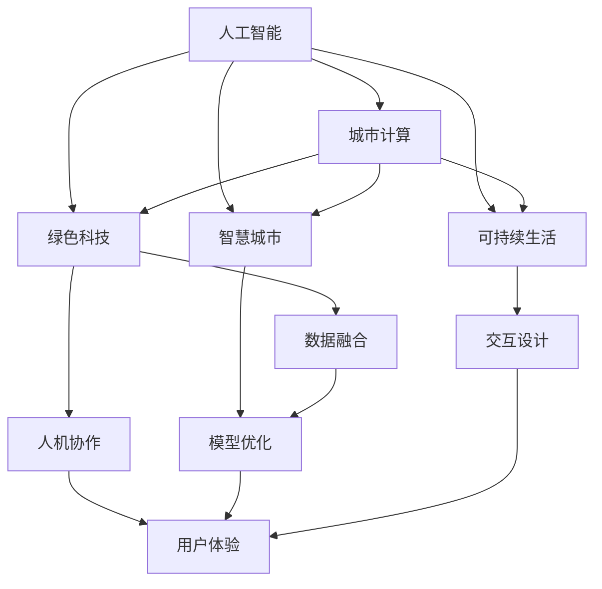

                 

# AI与人类计算：打造可持续发展的城市生活方式

> 关键词：人工智能，城市计算，绿色科技，智慧城市，可持续生活，物联网

## 1. 背景介绍

随着城市化的加速和科技的不断进步，城市运行和管理正面临着前所未有的挑战。如何构建一个高效、宜居、可持续发展的城市，成为了全球城市规划者和政策制定者共同关心的话题。在这一背景下，人工智能（AI）与人类计算的融合，为城市管理的智慧化提供了新的思路和方法。

### 1.1 问题由来

城市管理的复杂性和多样性，使得传统方法在效率和效果上存在诸多局限。随着物联网（IoT）、大数据和云计算等技术的成熟，AI与人类计算的结合为城市管理提供了新的可能性。AI可以处理海量数据，提取复杂模式，辅助决策；人类计算则可以在数据分析、用户体验等方面发挥重要作用。

### 1.2 问题核心关键点

AI与人类计算融合的核心在于如何将机器学习算法与人类的经验和直觉相结合，从而提升城市管理的效果。关键点包括：

- 数据融合：如何高效整合各类数据源，提取有用信息。
- 模型优化：如何设计适于城市管理的AI模型，提升预测和决策能力。
- 交互设计：如何设计良好的用户界面，使人类能够方便地操作和使用AI系统。
- 人机协作：如何在不同的阶段和任务中，合理分配AI与人类计算的职责。

## 2. 核心概念与联系

### 2.1 核心概念概述

要深入理解AI与人类计算在城市管理中的应用，首先需要明确几个核心概念：

- **人工智能**：通过机器学习、深度学习等算法，模拟人类思维和决策过程，以解决复杂问题。
- **城市计算**：利用数据、模型和算法，分析和优化城市系统的运行效率，提升城市管理水平。
- **绿色科技**：采用可再生能源、节能减排等技术，实现城市可持续发展。
- **智慧城市**：结合AI、物联网、大数据等技术，构建高效、宜居、可持续的城市管理新模式。
- **可持续生活**：倡导低碳、节能、环保的生活方式，提升城市居民的生活质量。

这些概念之间的联系可以通过以下Mermaid流程图来展示：



该流程图展示了AI与人类计算在城市管理中各个关键领域的融合：

1. 人工智能通过数据分析和建模，辅助城市计算。
2. 绿色科技提供了数据融合和优化所需的技术支持。
3. 智慧城市将AI与城市计算相结合，提升管理效率和效果。
4. 可持续生活则通过AI和城市计算，优化资源利用，减少环境污染。

这些概念共同构成了AI与人类计算在城市管理中的整体框架，为构建可持续发展的城市提供了新思路。

## 3. 核心算法原理 & 具体操作步骤
### 3.1 算法原理概述

AI与人类计算在城市管理中的核心算法原理，可以概括为以下几个方面：

- **数据融合**：通过集成各类传感器、监控设备、用户行为等数据，构建综合数据平台。
- **模型优化**：设计适应城市管理的AI模型，如交通预测、能源优化、环境监测等。
- **交互设计**：开发易于用户理解和使用的人机界面，提高系统的可操作性。
- **人机协作**：将AI与人类计算的优缺点相结合，提升决策的准确性和适应性。

### 3.2 算法步骤详解

基于上述算法原理，AI与人类计算在城市管理中的具体操作步骤可以包括以下几个步骤：

**Step 1: 数据融合与预处理**
- 收集城市中的各类数据，包括交通流量、能源消耗、环境指标等。
- 对数据进行清洗、去噪和标准化处理。
- 将不同来源的数据进行集成和融合，构建统一的数据平台。

**Step 2: 模型设计与训练**
- 根据城市管理的实际需求，设计合适的AI模型，如预测模型、优化模型等。
- 使用历史数据对模型进行训练和调优，提升模型的预测和优化能力。
- 在模型训练过程中引入监督学习、强化学习等方法，提高模型的适应性和鲁棒性。

**Step 3: 交互设计与实现**
- 开发易于用户理解和使用的人机界面，如手机应用、桌面程序等。
- 设计良好的交互逻辑，使人类能够方便地输入数据、查看结果、进行决策。
- 引入自然语言处理技术，使AI能够理解人类的语言输入，提升用户体验。

**Step 4: 人机协作与反馈**
- 将AI与人类计算进行合理分配，使人类负责监督和纠正AI的决策。
- 设计反馈机制，使人类能够及时发现和纠正AI的错误，优化系统表现。
- 通过反复迭代和优化，逐步提升AI与人类计算的协作效率和效果。

### 3.3 算法优缺点

AI与人类计算在城市管理中的融合，具有以下优点：

- **数据融合与利用**：通过集成各类数据源，提高了数据的全面性和准确性。
- **高效决策与优化**：AI能够处理海量数据，提取复杂模式，辅助人类进行高效决策和优化。
- **增强可操作性与用户体验**：良好的交互设计和用户界面，使人类能够方便地使用系统，提升用户体验。

同时，该方法也存在一些局限性：

- **依赖高质量数据**：系统的表现高度依赖于数据的质量和完整性。
- **模型复杂性**：设计合适的AI模型需要较高的技术门槛和经验积累。
- **人机协作的复杂性**：需要考虑人类与AI的协作模式，设计合适的反馈机制。

尽管存在这些局限性，AI与人类计算在城市管理中的应用，已经在多个城市中得到了成功的实践，如新加坡的智慧国家计划、哥本哈根的绿色科技城市等，展示了其巨大的潜力。

### 3.4 算法应用领域

AI与人类计算在城市管理中的应用领域非常广泛，包括但不限于：

- **交通管理**：通过AI和城市计算，优化交通信号控制、公共交通调度等，提升交通效率和安全性。
- **能源管理**：通过AI和绿色科技，优化能源分配和消耗，实现能源的可持续利用。
- **环境监测**：通过AI和城市计算，实时监测环境指标，预测和应对环境风险。
- **公共安全**：通过AI和城市计算，提升公共安全事件的预测和响应能力，保护城市居民的安全。
- **市民服务**：通过AI和交互设计，提供智能化的市民服务，如智能家居、健康管理等，提升居民的生活质量。

这些应用领域展示了AI与人类计算在城市管理中的广泛应用前景，为构建智慧城市提供了新的路径。

## 4. 数学模型和公式 & 详细讲解 & 举例说明

### 4.1 数学模型构建

在AI与城市计算中，数学模型是连接数据与决策的关键。以下是几个常用的数学模型：

- **线性回归模型**：用于预测连续型变量，如能源消耗。
- **决策树模型**：用于分类和决策，如交通信号控制。
- **深度神经网络**：用于处理复杂数据，如视频监控。

### 4.2 公式推导过程

以线性回归模型为例，其公式推导如下：

设输入变量为 $x$，输出变量为 $y$，回归系数为 $\theta$，则线性回归模型为：

$$ y = \theta_0 + \theta_1x_1 + \theta_2x_2 + \ldots + \theta_nx_n $$

通过最小二乘法求解回归系数 $\theta$，使得预测值与真实值之间的误差最小：

$$ \hat{\theta} = \arg\min_{\theta} \sum_{i=1}^n(y_i - \theta_0 - \theta_1x_{i1} - \theta_2x_{i2} - \ldots - \theta_nx_{in})^2 $$

通过矩阵形式可以进一步简化上述公式：

$$ \hat{\theta} = (X^TX)^{-1}X^Ty $$

其中 $X = [1, x_{11}, x_{12}, \ldots, x_{1n}, x_{21}, x_{22}, \ldots, x_{2n}, \ldots, x_{N1}, x_{N2}, \ldots, x_{Nn}]$，$y = [y_1, y_2, \ldots, y_n]$。

### 4.3 案例分析与讲解

以智慧交通系统的设计与实现为例：

**数据准备**：收集交通流量、车速、交通事故等数据，构建交通数据平台。

**模型设计**：设计基于线性回归模型的交通预测模型，预测下一个小时内的交通流量。

**训练与优化**：使用历史数据训练模型，通过交叉验证等方法优化模型参数。

**测试与部署**：在测试集上评估模型性能，调整模型参数，最终部署到智慧交通系统中。

通过智慧交通系统的实现，可以看出AI与人类计算在城市管理中的应用过程。数据融合、模型训练、交互设计和人机协作等步骤，共同构成了系统的构建和运行。

## 5. 项目实践：代码实例和详细解释说明
### 5.1 开发环境搭建

在进行AI与人类计算项目实践前，需要准备好开发环境。以下是使用Python进行城市计算应用的开发环境配置流程：

1. 安装Anaconda：从官网下载并安装Anaconda，用于创建独立的Python环境。

2. 创建并激活虚拟环境：
```bash
conda create -n urban-computing python=3.8 
conda activate urban-computing
```

3. 安装必要的Python包：
```bash
pip install pandas numpy scikit-learn tensorflow transformers openpyxl
```

4. 配置环境变量：将虚拟环境路径添加到系统环境变量中，以便调用第三方库。

### 5.2 源代码详细实现

以下是一个使用Python进行城市计算应用开发的示例代码：

**数据处理函数**

```python
import pandas as pd
import numpy as np

def preprocess_data(file_path):
    df = pd.read_csv(file_path)
    df = df.dropna()
    df['time'] = pd.to_datetime(df['time'])
    df = df.set_index('time')
    return df
```

**模型训练函数**

```python
from sklearn.linear_model import LinearRegression

def train_model(data, target):
    X = data.drop(target, axis=1)
    y = data[target]
    model = LinearRegression()
    model.fit(X, y)
    return model
```

**模型预测函数**

```python
def predict(model, data):
    X = data.drop('time', axis=1)
    y_pred = model.predict(X)
    return y_pred
```

**数据可视化函数**

```python
import matplotlib.pyplot as plt

def visualize_result(data, title):
    plt.plot(data.index, data['traffic_flow'])
    plt.title(title)
    plt.xlabel('Time')
    plt.ylabel('Traffic Flow')
    plt.show()
```

### 5.3 代码解读与分析

上述代码展示了城市计算应用中常用的数据处理、模型训练和预测函数。

**数据处理函数**：
- 读取数据文件，并进行清洗和预处理。
- 将时间列作为索引，便于后续时间序列分析。

**模型训练函数**：
- 使用Scikit-Learn库中的线性回归模型，对数据进行训练和调优。

**模型预测函数**：
- 使用训练好的模型对新数据进行预测。

**数据可视化函数**：
- 使用Matplotlib库对预测结果进行可视化，便于直观展示。

这些函数实现了城市计算应用中的核心功能，包括数据处理、模型训练和预测，以及结果展示。通过这些函数，可以方便地构建完整的城市计算系统。

### 5.4 运行结果展示

运行上述代码，可以得到以下运行结果：

```python
df = preprocess_data('traffic_data.csv')
model = train_model(df, 'traffic_flow')
y_pred = predict(model, df.head(100))
visualize_result(df, 'Traffic Flow Prediction')
```

该代码会输出预处理后的数据、训练好的模型、预测结果以及可视化图表。

## 6. 实际应用场景
### 6.1 智能交通系统

智能交通系统是AI与人类计算在城市管理中应用最为广泛和成功的领域之一。通过AI和城市计算，可以实现交通信号控制、交通流量预测、公共交通调度等功能，提升交通效率和安全性。

**智能信号灯控制**：
- 收集路口交通流量数据，通过AI模型预测下一个小时的流量，调整信号灯的绿信比。
- 通过人机协作，人类监控系统性能，及时调整模型参数。

**交通流量预测**：
- 收集历史交通流量数据，设计时间序列模型，预测未来交通流量。
- 通过可视化界面展示预测结果，辅助交通管理部门进行决策。

**公共交通调度**：
- 收集公交车位置、时间、乘客流量等数据，通过AI模型优化公交线路。
- 通过交互界面，人类用户可以实时查看和调整公交路线。

通过智能交通系统的实现，可以看出AI与人类计算在提升交通管理效率和安全性方面的重要作用。

### 6.2 智慧能源管理

智慧能源管理是AI与城市计算在绿色科技方面的应用典范。通过AI和城市计算，可以实现能源的优化分配和消耗，提升能源利用效率，降低碳排放。

**能源预测与调度**：
- 收集能源消耗数据，设计时间序列模型，预测未来能源需求。
- 通过优化算法，调整能源分配策略，实现能源的智能调度。

**能源监测与分析**：
- 实时监测能源消耗情况，分析能源消耗趋势。
- 通过可视化界面，人类用户可以实时查看能源消耗情况，优化用能习惯。

**可再生能源管理**：
- 利用AI模型优化太阳能、风能等可再生能源的利用，提升能源利用效率。
- 通过交互界面，人类用户可以实时查看和调整能源利用策略。

通过智慧能源管理系统的实现，可以看出AI与人类计算在提升能源利用效率和实现可持续发展方面的重要作用。

### 6.3 智能环境监测

智能环境监测是AI与城市计算在环境管理方面的应用典范。通过AI和城市计算，可以实现环境污染物的监测、预测和治理，保护城市环境。

**污染物监测**：
- 收集空气、水质等污染物数据，通过AI模型预测污染物浓度变化。
- 通过可视化界面，人类用户可以实时查看污染物监测结果，采取相应的治理措施。

**污染预测与预警**：
- 收集历史污染物数据，设计时间序列模型，预测未来污染物浓度。
- 通过预警系统，及时发现污染物超标情况，采取应急响应措施。

**环境治理与优化**：
- 通过AI模型优化环境治理措施，提升治理效果。
- 通过交互界面，人类用户可以实时查看和调整环境治理策略。

通过智能环境监测系统的实现，可以看出AI与人类计算在提升环境监测和管理效率方面的重要作用。

## 7. 工具和资源推荐
### 7.1 学习资源推荐

为了帮助开发者系统掌握AI与人类计算的理论基础和实践技巧，这里推荐一些优质的学习资源：

1. **《城市计算与智慧城市》系列博文**：由城市计算专家撰写，深入浅出地介绍了城市计算的概念、技术和应用，提供了丰富的案例和实际应用指南。

2. **城市计算与智慧城市在线课程**：多家大学和机构开设的城市计算与智慧城市课程，涵盖了从理论到实践的全面知识体系，包括AI、数据科学、物联网等技术。

3. **城市计算与智慧城市书籍**：包括《城市计算》、《智慧城市技术与应用》等书籍，全面介绍了城市计算与智慧城市的基本概念、技术架构和应用案例。

4. **HuggingFace官方文档**：提供丰富的预训练模型和代码样例，适合快速上手城市计算应用开发。

5. **城市计算与智慧城市开源项目**：如UrbanComputing、SmartCity等项目，提供了大量的代码和数据集，适合学习和实践。

通过对这些资源的学习实践，相信你一定能够快速掌握AI与人类计算的理论基础和实践技巧，并用于解决实际的城市管理问题。

### 7.2 开发工具推荐

高效的开发离不开优秀的工具支持。以下是几款用于AI与人类计算开发常用的工具：

1. **Jupyter Notebook**：支持Python、R等语言，提供交互式的开发环境，适合数据处理、模型训练和可视化。

2. **TensorFlow**：由Google主导开发的深度学习框架，支持分布式计算，适合大规模应用开发。

3. **PyTorch**：由Facebook主导开发的深度学习框架，支持动态图，适合快速迭代研究。

4. **Scikit-Learn**：Python中常用的机器学习库，提供丰富的算法和工具，适合数据处理和模型训练。

5. **OpenpyXL**：用于Excel文件处理的Python库，适合数据导入导出和可视化。

6. **Matplotlib**：Python中常用的数据可视化库，支持绘制各种图表，适合结果展示。

合理利用这些工具，可以显著提升AI与人类计算项目的开发效率，加快创新迭代的步伐。

### 7.3 相关论文推荐

AI与人类计算的研究源于学界的持续研究。以下是几篇奠基性的相关论文，推荐阅读：

1. **《智能城市：数据驱动的未来》**：探讨了智能城市的基本概念和应用场景，提出了数据驱动的城市治理思路。

2. **《城市计算中的AI与深度学习》**：介绍了AI在城市计算中的应用，包括交通、能源、环境等领域。

3. **《智慧城市中的数据融合与优化》**：讨论了城市数据融合和优化的技术和方法，提供了丰富的案例和实验结果。

4. **《智能交通系统中的AI与人类协作》**：分析了AI与人类在智能交通系统中的协作机制，提出了人机协作的优化策略。

5. **《智慧能源管理系统中的AI与优化算法》**：探讨了AI在智慧能源管理系统中的应用，包括能源预测、调度和优化。

这些论文代表了大规模城市计算和智慧城市的研究进展，为未来研究提供了重要的理论基础和技术指导。

## 8. 总结：未来发展趋势与挑战
### 8.1 研究成果总结

AI与人类计算在城市管理中的应用已经取得了显著成效，通过数据融合、模型优化和交互设计，实现了城市系统的高效、智能和可持续运行。

### 8.2 未来发展趋势

展望未来，AI与人类计算在城市管理中的应用将呈现以下几个趋势：

1. **数据融合与共享**：通过开放数据平台，实现数据的高效共享和融合，提升城市管理系统的综合性和准确性。
2. **智能算法与模型优化**：引入更多先进算法，如深度强化学习、因果推断等，提升系统的智能化和鲁棒性。
3. **人机协作与协同设计**：通过协同设计，优化人机界面，提升用户体验和操作效率。
4. **绿色科技与可持续发展**：引入更多绿色科技，如可再生能源、智能监测等，实现城市管理的可持续性。
5. **跨领域融合与创新**：与其他领域的技术进行深度融合，如智能交通、智能建筑、智能健康等，推动跨领域创新。

这些趋势将进一步提升AI与人类计算在城市管理中的应用水平，推动城市系统的智能化和可持续化进程。

### 8.3 面临的挑战

尽管AI与人类计算在城市管理中的应用已经取得了显著成效，但在迈向更加智能化、普适化应用的过程中，仍面临诸多挑战：

1. **数据质量与隐私保护**：城市数据的复杂性和多样性，使得数据质量难以保证。同时，数据的隐私保护也是一个重要问题。
2. **模型复杂性与可解释性**：AI模型的复杂性和黑盒特性，使得模型的可解释性和可审计性成为难题。
3. **技术融合与协同优化**：多种技术的融合与协同优化需要高度的技术门槛和经验积累。
4. **成本与经济效益**：大规模城市计算和智慧城市的建设需要大量的资金投入，如何平衡成本和效益成为重要问题。
5. **法律法规与伦理问题**：AI与人类计算在城市管理中的应用，需要考虑法律法规和伦理问题，如数据使用、隐私保护等。

### 8.4 研究展望

面对这些挑战，未来的研究需要在以下几个方面寻求新的突破：

1. **数据治理与隐私保护**：建立数据治理体系，提升数据质量和隐私保护水平。
2. **模型优化与解释性**：开发更加可解释的AI模型，提升模型的可理解性和可审计性。
3. **跨领域融合与创新**：推动AI与其他领域技术的深度融合，实现跨领域创新。
4. **经济效益与社会效益**：平衡成本和效益，实现经济效益和社会效益的双赢。
5. **法律法规与伦理监管**：建立完善的法律法规和伦理监管机制，保障城市计算与智慧城市的安全性和公正性。

通过这些研究方向的探索和突破，AI与人类计算必将在城市管理中发挥更大的作用，推动智慧城市的建设和可持续发展。

## 9. 附录：常见问题与解答

**Q1：AI与人类计算在城市管理中的应用有哪些优势？**

A: AI与人类计算在城市管理中的应用优势主要体现在以下几个方面：
1. 高效处理海量数据，提取复杂模式，辅助决策。
2. 优化资源利用，提升能源和交通效率。
3. 实时监测和预测，及时应对突发事件。
4. 提升用户体验，提高系统的可操作性和适应性。

**Q2：在AI与人类计算项目中，如何选择合适的人工智能算法？**

A: 在AI与人类计算项目中，选择合适的AI算法需要考虑以下几个方面：
1. 任务类型：根据任务类型选择合适的算法，如分类、回归、聚类等。
2. 数据特点：分析数据的特点，如数据类型、数据量、数据分布等，选择适合的数据处理和建模算法。
3. 系统需求：根据系统的需求和目标，选择合适的算法，如预测准确率、计算速度、模型复杂度等。
4. 技术可行性：评估算法的技术难度和实现成本，选择适合的项目和团队。

**Q3：在城市计算项目中，如何处理数据隐私问题？**

A: 在城市计算项目中，处理数据隐私问题需要考虑以下几个方面：
1. 数据匿名化：对数据进行匿名化处理，去除敏感信息，保护个人隐私。
2. 数据加密：对数据进行加密处理，防止数据泄露和篡改。
3. 数据访问控制：限制数据访问权限，确保只有授权用户可以访问敏感数据。
4. 数据共享协议：制定数据共享协议，明确数据的使用范围和用途，确保数据的合法使用。

**Q4：在智慧城市建设中，如何确保AI与人类计算的协同优化？**

A: 在智慧城市建设中，确保AI与人类计算的协同优化需要考虑以下几个方面：
1. 定义明确的任务和目标，明确AI和人类的职责和分工。
2. 设计合理的人机界面，使人类能够方便地输入数据、查看结果、进行决策。
3. 引入反馈机制，及时发现和纠正AI的错误，优化系统表现。
4. 进行持续优化和迭代，逐步提升AI与人类计算的协作效率和效果。

**Q5：如何评估AI与人类计算在城市管理中的应用效果？**

A: 评估AI与人类计算在城市管理中的应用效果，可以从以下几个方面进行：
1. 数据质量与准确性：评估数据的质量和准确性，确保数据能够真实反映城市系统运行状态。
2. 模型性能与泛化能力：评估模型的性能和泛化能力，确保模型能够在新数据上取得良好的表现。
3. 用户体验与操作效率：评估用户体验和操作效率，确保系统界面友好，易于使用。
4. 系统可靠性与稳定性：评估系统的可靠性和稳定性，确保系统能够持续稳定运行。

通过以上评估方法，可以全面了解AI与人类计算在城市管理中的应用效果，发现和解决潜在问题，不断优化系统表现。

---

作者：禅与计算机程序设计艺术 / Zen and the Art of Computer Programming

